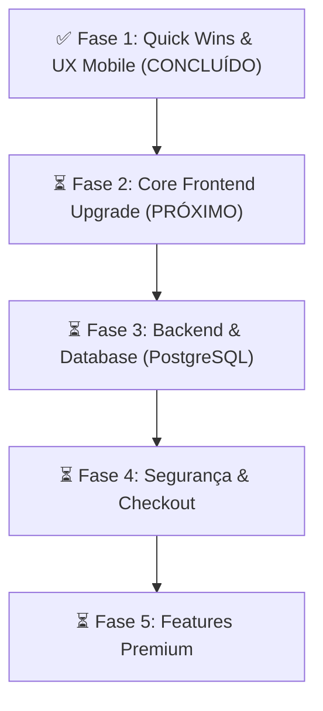

### File: .env.example

```example
# Segurança
SECRET_KEY=troque_isso_por_uma_chave_segura_e_aleatoria
ADMIN_PASSWORD=admin

# Banco de Dados
DATABASE_URL=sqlite:///database.db

# Uploads
UPLOAD_FOLDER=static/uploads

# Mercado Pago (Opcional)
MP_ACCESS_TOKEN=seu_token_aqui

# Telegram Bot
TELEGRAM_TOKEN=seu_telegram_token
WEBHOOK_URL=https://seusite.pythonanywhere.com/telegram/webhook
WEBHOOK_SECRET=senha_super_secreta_webhook
```

### File: .gitignore

```
# --- Segurança (CRÍTICO) ---
.env
.env.local

# --- Python ---
__pycache__/
*.py[cod]
*$py.class
*.manifest
*.spec

# --- Ambientes Virtuais ---
venv/
.venv/
env/

# --- Banco de Dados Local ---
*.db
*.sqlite3
database.db

# --- Uploads de Imagens (Não enviar para o Git) ---
# Ignora o conteúdo da pasta uploads, mas mantém a pasta
static/uploads/*
!static/uploads/.gitkeep

# --- IDEs e Editores ---
.vscode/
.idea/
.DS_Store

# --- Logs e Erros ---
*.log

# --- Cache ---
dolar_cache.json
dolar.log

# --- Tailwind CSS compiler binary ---
tailwindcss.exe
```

### File: app.py

```py
from flask import Flask
from core.config import Config
from routes.public import public_bp
from routes.admin import admin_bp
from routes.client import client_bp
from routes.reseller import reseller_bp
from database.connection import init_db
from routes.payment import payment_bp

import os
from database.orm import db

app = Flask(__name__)

# 1. Carrega as configurações (SECRET_KEY, Uploads, etc) do arquivo core/config.py
app.config.from_object(Config)

# Configura o SQLAlchemy para ORM gradual
DATABASE_URL = os.getenv('DATABASE_URL')
db_uri = None

if DATABASE_URL and (DATABASE_URL.startswith("postgresql://") or DATABASE_URL.startswith("postgres://")):
    import psycopg2
    try:
        # Tenta uma conexao rápida de teste
        conn = psycopg2.connect(DATABASE_URL, connect_timeout=3)
        conn.close()
        db_uri = DATABASE_URL
        if db_uri.startswith("postgres://"):
            db_uri = db_uri.replace("postgres://", "postgresql://", 1)
    except Exception as e:
        print(f"[SQLAlchemy] Erro ao conectar ao PostgreSQL, fallback para SQLite: {e}")
        db_uri = None

if not db_uri:
    # Fallback para SQLite local
    basedir = os.path.abspath(os.path.dirname(__file__))
    db_uri = f"sqlite:///{os.path.join(basedir, 'database.db')}"

app.config['SQLALCHEMY_DATABASE_URI'] = db_uri

app.config['SQLALCHEMY_TRACK_MODIFICATIONS'] = False
db.init_app(app)

# Registrar helper de traducao global no Jinja2
from utils.i18n import _, get_current_language, get_current_currency
app.jinja_env.globals.update(
    _=_,
    get_current_language=get_current_language,
    get_current_currency=get_current_currency
)

from database.models import get_db_connection
from contextlib import closing

@app.context_processor
def inject_global_config():
    try:
        with closing(get_db_connection()) as conn:
            config = conn.execute('SELECT * FROM config WHERE id = 1').fetchone()
            if config:
                return dict(global_config=dict(config))
    except Exception as e:
        pass
    return dict(global_config={})

# 2. Inicializa o Banco de Dados (Executa Migrações)
# Isso garante que tabelas e colunas novas sejam criadas mesmo em produção (WSGI)
with app.app_context():
    init_db()

# 3. Registra as Rotas (Blueprints)
from telegram_app import telegram_bp

app.register_blueprint(public_bp)
app.register_blueprint(admin_bp)
app.register_blueprint(payment_bp)
app.register_blueprint(client_bp)
app.register_blueprint(reseller_bp)
app.register_blueprint(telegram_bp)

import traceback
from flask import render_template

@app.errorhandler(Exception)
def handle_exception(e):
    app.logger.error(f"Erro Interno do Servidor: {e}\n{traceback.format_exc()}")
    return render_template('500.html'), 500

if __name__ == '__main__':
    # 4. Roda a aplicação
    # O host='0.0.0.0' permite acessar pelo IP da rede (igual ao seu original)
    is_debug = os.getenv('FLASK_DEBUG', 'False').lower() in ('true', '1', 't')
    app.run(debug=is_debug, host='0.0.0.0', port=5000)
```

### File: approve_pending.py

```py
import sys
import os

# Adiciona o diretório atual ao sys.path
sys.path.insert(0, os.path.abspath(os.path.dirname(__file__)))

from database.connection import get_db_connection
from routes.payment import process_approved_payment

def approve_specific_pending():
    order_ref = sys.argv[1] if len(sys.argv) > 1 else 'ORD-4f4394daa27d'
    
    print(f"Buscando o pedido pendente com referência: {order_ref}...")
    conn = get_db_connection()
    
    # Busca apenas o pedido específico
    order = conn.execute("SELECT id, external_reference, product_id, customer_email, created_at, status FROM orders WHERE external_reference = ?", (order_ref,)).fetchone()
    
    if not order:
        print(f"❌ Pedido {order_ref} não encontrado no banco de dados.")
        conn.close()
        return
        
    if order['status'] != 'pending':
        print(f"⚠️ Atenção: O pedido {order_ref} já está com status '{order['status']}'.")
        # Mas vamos forçar a re-execução se necessário? Depende, deixei a validação original dentro do process_approved_payment tratar.

    print(f"\n-> Processando Pedido ID: {order['id']}")
    print(f"   Cliente: {order['customer_email']}")
    print(f"   Data: {order['created_at']}")
    
    try:
        process_approved_payment(order['external_reference'], order['product_id'])
        print(f"   ✅ Pedido {order['id']} processado e aprovado com sucesso!")
    except Exception as e:
        print(f"   ❌ Erro ao processar pedido {order['id']}: {e}")
            
    conn.close()
    print("\nFinalizado!")

if __name__ == '__main__':
    approve_specific_pending()
```

### File: ARCHITECTURE.md

```md
# Arquitetura do Sistema - RAIO MODS

Este documento serve como a fonte da verdade da arquitetura do sistema do site e bot da **RAIO MODS**, contendo as definições dos fluxos de pagamentos, integração com o Telegram, internacionalização e banco de dados.

---

## 1. Integração de Pagamento Automatizado (Telegram WebApp)

O sistema de checkout é unificado para o site e para o Bot do Telegram. A abertura ocorre por meio de uma janela overlay nativa (Telegram WebApp) sem redirecionamento para navegadores externos.

### Fluxo de Sequência Segura:
1. **Abertura**: O cliente clica no botão "Comprar" no Bot. O bot abre `/pagamento` injetando o SDK do Telegram.
2. **Autenticação**: O frontend (`telegram_webapp.js`) captura o `window.Telegram.WebApp.initData` e o anexa de forma invisível nas requisições POST para `/api/checkout`.
3. **Validação Criptográfica**: O backend intercepta o payload e o valida em `telegram_app/utils/auth.py` utilizando o algoritmo oficial do Telegram (HMAC-SHA256 com o token do Bot).
4. **Tolerância a Falhas**: Caso o `initData` falhe na validação ou esteja ausente (compra comum no navegador), o checkout prossegue normalmente sem associar o Telegram ao pedido.
5. **Auditoria e Entrega**: Após confirmação do pagamento, a entrega é executada de forma assíncrona/não-bloqueante (`run_coroutine_threadsafe`) enviando a chave no chat privado e atualizando as colunas de auditoria na tabela `orders`:
   - `telegram_id`, `telegram_username`, `telegram_first_name`
   - `telegram_delivery_status` (`'delivered'` ou `'failed'`)
   - `telegram_delivered_at` (gravação via `CURRENT_TIMESTAMP` do banco)
   - `telegram_message_id` (ID da mensagem de entrega do Telegram)
   - `telegram_delivery_error` (motivo do erro se o envio falhar)

---

## 2. Internacionalização (i18n) & Localização

O sistema é preparado para múltiplos idiomas (Português, Inglês e Espanhol) e moedas (Real - BRL e Dólar - USD).

### Regras de Ouro:
* **Sem Tradução Automática**: Proibido utilizar APIs de tradução automática em tempo de execução. Traduções de catálogo ficam salvas no banco de dados e as de interface em JSON local, eliminando latências e dependências de terceiros.
* **Fallback de Idioma por Campo**: Se um campo de tradução (inglês/espanhol) estiver vazio no banco, o sistema exibe a versão correspondente em português para aquele campo específico (ex: `name_en` se preenchido é exibido, mas se `description_en` for vazio usa `description_pt`), permitindo traduções parciais de forma limpa.

### Estrutura de Banco de Dados de Produtos:
A tabela `products` possui suporte estruturado para múltiplos idiomas, moedas e controle de tradução:
- `name_pt` (TEXT), `name_en` (TEXT), `name_es` (TEXT)
- `description_pt` (TEXT), `description_en` (TEXT), `description_es` (TEXT)
- `price_brl` (DECIMAL(10,2)), `price_usd` (DECIMAL(10,2))
- `default_currency` (TEXT DEFAULT `'BRL'` - aceita estritamente `'BRL'` ou `'USD'`)
- `translation_status` (TEXT DEFAULT `'draft'` - indica progresso: `'draft'`, `'partial'`, `'complete'`)
- As colunas legadas (`name`, `description`, `price`) são mantidas por compatibilidade e facilidade de rollback.

### Detecção de Idioma do Usuário (Ordem de Prioridade):
1. Seleção manual explícita (URL query / ação do usuário).
2. Cookie de preferência.
3. Sessão do Flask.
4. Cabeçalho HTTP `Accept-Language` do navegador.
5. Fallback padrão: **Português (`pt-BR`)**.

### Moeda e Gateways de Pagamento Dinâmicos:
O sistema decide qual moeda exibir com base na localidade padrão do idioma selecionado (PT -> BRL, EN/ES -> USD), permitindo alteração manual. Os gateways são exibidos condicionalmente no checkout:
* Se moeda for **BRL**: Mostrar Pix e Cartão (Mercado Pago).
* Se moeda for **USD**: Mostrar Binance Pay (Cripto USDT).

### Localização no Bot do Telegram:
O bot lê a propriedade `language_code` enviada pelo aplicativo do usuário. Caso o idioma correspondente não esteja disponível, adota o **Inglês (`en`)** como fallback para a interface do Bot.
```

### File: cleanup_duplicates.py

```py
import os
from contextlib import closing
import logging

# Configuração de log
logging.basicConfig(level=logging.INFO, format='%(levelname)s - %(message)s')
logger = logging.getLogger('cleanup')

def run_cleanup():
    from database.db_wrappers import get_db_connection
    
    with closing(get_db_connection()) as conn:
        cursor = conn.cursor()
        
        logger.info("Iniciando varredura de comissões duplicadas...")
        
        # Encontra pedidos que têm mais de 1 comissão (o que indica que a race condition ocorreu)
        cursor.execute('''
            SELECT order_id, COUNT(*) as qtd
            FROM commissions
            GROUP BY order_id
            HAVING COUNT(*) > 1
        ''')
        
        duplicates = cursor.fetchall()
        if not duplicates:
            logger.info("Nenhuma comissão duplicada encontrada no banco de dados atual.")
            return

        for row in duplicates:
            order_id = row['order_id']
            qtd = row['qtd']
            logger.info(f"--- Encontrado Pedido ID {order_id} com {qtd} comissões geradas ---")
            
            # Buscar detalhes do pedido
            order = cursor.execute("SELECT * FROM orders WHERE id = ?", (order_id,)).fetchone()
            if not order:
                logger.warning(f"Pedido {order_id} não encontrado na tabela orders. Pulando.")
                continue
                
            email = order['customer_email'].strip().lower()
            product_id = order['product_id']
            
            # 1. Corrigir Comissões (Manter apenas a primeira, apagar as outras)
            comms = cursor.execute("SELECT id, commission_amount FROM commissions WHERE order_id = ? ORDER BY id ASC", (order_id,)).fetchall()
            first_comm_id = comms[0]['id']
            
            # Deletar as outras
            for comm in comms[1:]:
                cursor.execute("DELETE FROM commissions WHERE id = ?", (comm['id'],))
                logger.info(f"  [Comissão] Deletada comissão extra ID: {comm['id']} (R$ {comm['commission_amount']})")
                
            # 2. Corrigir Pontos de Fidelidade
            amount_val = order['amount']
            points_to_add = int(amount_val)
            
            if points_to_add > 0:
                # Quantas vezes os pontos foram dados para esse pedido?
                points_given = cursor.execute(
                    "SELECT id, points_changed FROM points_history WHERE email = ? AND description LIKE ?", 
                    (email, f'%#{order_id} - %')
                ).fetchall()
                
                # Se foi dado mais de uma vez
                if len(points_given) > 1:
                    # Deletar o histórico extra
                    for p_hist in points_given[1:]:
                        cursor.execute("DELETE FROM points_history WHERE id = ?", (p_hist['id'],))
                        logger.info(f"  [Pontos] Deletado histórico de pontos extra ID: {p_hist['id']}")
                    
                    # Subtrair do saldo total do cliente
                    pontos_excedentes = (len(points_given) - 1) * points_to_add
                    
                    cursor.execute("UPDATE client_points SET points = points - ? WHERE email = ?", (pontos_excedentes, email))
                    # Garantir que não fique negativo (por segurança)
                    cursor.execute("UPDATE client_points SET points = 0 WHERE email = ? AND points < 0", (email,))
                    logger.info(f"  [Pontos] Removidos {pontos_excedentes} pontos extras do saldo do cliente {email}.")

            # 3. Corrigir Uso de Cupons
            if order['coupon_id']:
                c_id = order['coupon_id']
                # Se gerou N comissões, provavelmente usou o cupom N vezes (N-1 vezes a mais)
                usos_extras = qtd - 1
                cursor.execute("UPDATE coupons SET current_uses = current_uses - ? WHERE id = ?", (usos_extras, c_id))
                # Segurança
                cursor.execute("UPDATE coupons SET current_uses = 0 WHERE id = ? AND current_uses < 0", (c_id,))
                logger.info(f"  [Cupom] Uso do cupom ID {c_id} reduzido em {usos_extras}.")
                
                if order['coupon_code'] and str(order['coupon_code']).upper().startswith('FID-'):
                    logger.info("  [Cupom] Atenção: Cupom fidelidade foi marcado como usado. Como é de uso único, manter marcado está correto.")
                    
        conn.commit()
        logger.info("\n=== LIMPEZA E CORREÇÃO CONCLUÍDAS COM SUCESSO ===")

if __name__ == '__main__':
    # Simula o ambiente da aplicação Flask
    import sys
    sys.path.append(os.path.dirname(os.path.abspath(__file__)))
    try:
        run_cleanup()
    except Exception as e:
        logger.error(f"Erro ao executar limpeza: {e}")
```

### File: dolar.log

```log
2026-02-05 02:45:14 -  * Debugger is active!
2026-02-05 02:45:14 -  * Debugger PIN: 101-740-436
2026-02-05 02:45:20 -  * Detected change in 'C:\\Users\\l.royo\\Documents\\site\\routes\\admin.py', reloading
2026-02-05 02:45:22 -  * Debugger is active!
2026-02-05 02:45:22 -  * Debugger PIN: 101-740-436
2026-02-05 02:46:11 -  * Detected change in 'C:\\Users\\l.royo\\Documents\\site\\routes\\admin.py', reloading
2026-02-05 02:46:12 -  * Debugger is active!
2026-02-05 02:46:12 -  * Debugger PIN: 101-740-436
2026-02-05 02:46:48 - WARNING: This is a development server. Do not use it in a production deployment. Use a production WSGI server instead.
 * Running on all addresses (0.0.0.0)
 * Running on http://127.0.0.1:5000
 * Running on http://192.168.2.12:5000
2026-02-05 02:46:48 - Press CTRL+C to quit
2026-02-05 02:46:48 -  * Restarting with stat
2026-02-05 02:46:48 -  * Debugger is active!
2026-02-05 02:46:48 -  * Debugger PIN: 101-740-436
2026-02-05 02:47:21 - [OK] Dolar atualizado via https://economia.awesomeapi.com.br/last/USD-BRL: R$ 5.24
2026-02-05 02:48:24 - WARNING: This is a development server. Do not use it in a production deployment. Use a production WSGI server instead.
 * Running on all addresses (0.0.0.0)
 * Running on http://127.0.0.1:5000
 * Running on http://192.168.2.12:5000
2026-02-05 02:48:24 - Press CTRL+C to quit
2026-02-05 02:48:24 -  * Restarting with stat
2026-02-05 02:48:24 -  * Debugger is active!
2026-02-05 02:48:25 -  * Debugger PIN: 101-740-436
2026-02-05 02:50:07 - WARNING: This is a development server. Do not use it in a production deployment. Use a production WSGI server instead.
 * Running on all addresses (0.0.0.0)
 * Running on http://127.0.0.1:5000
 * Running on http://192.168.2.12:5000
2026-02-05 02:50:07 - Press CTRL+C to quit
2026-02-05 02:50:07 -  * Restarting with stat
2026-02-05 02:50:08 -  * Debugger is active!
2026-02-05 02:50:08 -  * Debugger PIN: 101-740-436
2026-02-05 02:50:46 - WARNING: This is a development server. Do not use it in a production deployment. Use a production WSGI server instead.
 * Running on all addresses (0.0.0.0)
 * Running on http://127.0.0.1:5000
 * Running on http://192.168.2.12:5000
2026-02-05 02:50:46 - Press CTRL+C to quit
2026-02-05 02:50:46 -  * Restarting with stat
2026-02-05 02:50:47 -  * Debugger is active!
2026-02-05 02:50:47 -  * Debugger PIN: 101-740-436
2026-02-05 02:51:01 -  * Detected change in 'C:\\Users\\l.royo\\Documents\\site\\update_tables.py', reloading
2026-02-05 02:51:01 -  * Restarting with stat
2026-02-05 02:51:02 -  * Debugger is active!
2026-02-05 02:51:02 -  * Debugger PIN: 101-740-436
2026-02-05 02:55:28 - [OK] Dolar atualizado via https://economia.awesomeapi.com.br/last/USD-BRL: R$ 5.2393
2026-02-05 02:55:28 - [OK] Dolar atualizado via https://economia.awesomeapi.com.br/last/USD-BRL: R$ 5.2393
2026-02-05 02:55:29 - Usando cotacao em cache (age=1s): R$ 5.2393
2026-02-07 00:48:28 - [OK] Dolar atualizado via https://economia.awesomeapi.com.br/last/USD-BRL: R$ 5.2159
2026-02-07 00:48:29 - Usando cotacao em cache (age=0s): R$ 5.2159
2026-02-07 00:48:29 - Usando cotacao em cache (age=0s): R$ 5.2159
2026-02-07 00:48:40 - Usando cotacao em cache (age=12s): R$ 5.2159
2026-02-07 00:48:42 - Usando cotacao em cache (age=13s): R$ 5.2159
2026-02-07 00:48:43 - Usando cotacao em cache (age=14s): R$ 5.2159
2026-02-07 00:48:43 - Usando cotacao em cache (age=14s): R$ 5.2159
2026-02-07 00:48:44 - Usando cotacao em cache (age=15s): R$ 5.2159
2026-02-07 00:48:45 - Usando cotacao em cache (age=17s): R$ 5.2159
2026-02-07 00:48:46 - Usando cotacao em cache (age=17s): R$ 5.2159
2026-02-07 00:48:46 - Usando cotacao em cache (age=17s): R$ 5.2159
2026-02-07 00:48:49 - Usando cotacao em cache (age=20s): R$ 5.2159
2026-02-07 00:48:50 - Usando cotacao em cache (age=21s): R$ 5.2159
2026-02-07 00:48:50 - Usando cotacao em cache (age=21s): R$ 5.2159
2026-02-07 00:49:20 - Usando cotacao em cache (age=51s): R$ 5.2159
2026-02-07 00:49:32 - Usando cotacao em cache (age=63s): R$ 5.2159
2026-02-07 00:49:34 - Usando cotacao em cache (age=65s): R$ 5.2159
2026-02-07 00:49:35 - Usando cotacao em cache (age=66s): R$ 5.2159
2026-02-07 00:49:35 - Usando cotacao em cache (age=66s): R$ 5.2159
2026-02-07 00:49:37 - Usando cotacao em cache (age=68s): R$ 5.2159
2026-02-07 00:49:39 - Usando cotacao em cache (age=70s): R$ 5.2159
2026-02-07 00:49:40 - Usando cotacao em cache (age=71s): R$ 5.2159
2026-02-07 00:49:40 - Usando cotacao em cache (age=71s): R$ 5.2159
2026-02-07 00:50:10 - Usando cotacao em cache (age=101s): R$ 5.2159
2026-02-07 00:50:40 - Usando cotacao em cache (age=131s): R$ 5.2159
2026-02-07 00:51:10 - Usando cotacao em cache (age=161s): R$ 5.2159
2026-02-07 00:51:40 - Usando cotacao em cache (age=191s): R$ 5.2159
2026-02-07 00:51:55 - Usando cotacao em cache (age=206s): R$ 5.2159
2026-02-07 00:51:55 - Usando cotacao em cache (age=207s): R$ 5.2159
2026-02-07 00:51:56 - Usando cotacao em cache (age=207s): R$ 5.2159
2026-02-07 00:52:06 - Usando cotacao em cache (age=217s): R$ 5.2159
2026-02-07 00:52:12 - Usando cotacao em cache (age=224s): R$ 5.2159
2026-02-07 00:52:13 - Usando cotacao em cache (age=224s): R$ 5.2159
2026-02-07 00:52:13 - Usando cotacao em cache (age=225s): R$ 5.2159
2026-02-07 00:52:18 - Usando cotacao em cache (age=229s): R$ 5.2159
2026-02-07 00:52:21 - Usando cotacao em cache (age=232s): R$ 5.2159
2026-02-07 00:52:21 - Usando cotacao em cache (age=233s): R$ 5.2159
2026-02-07 00:52:22 - Usando cotacao em cache (age=233s): R$ 5.2159
2026-02-07 00:52:37 - Usando cotacao em cache (age=248s): R$ 5.2159
2026-02-07 00:52:37 - Usando cotacao em cache (age=249s): R$ 5.2159
2026-02-07 00:52:38 - Usando cotacao em cache (age=249s): R$ 5.2159
2026-02-07 00:52:40 - Usando cotacao em cache (age=251s): R$ 5.2159
2026-02-07 00:52:42 - Usando cotacao em cache (age=253s): R$ 5.2159
2026-02-07 00:52:51 - Usando cotacao em cache (age=262s): R$ 5.2159
2026-02-07 00:53:00 - Usando cotacao em cache (age=271s): R$ 5.2159
2026-02-07 00:53:01 - Usando cotacao em cache (age=272s): R$ 5.2159
2026-02-07 00:53:01 - Usando cotacao em cache (age=272s): R$ 5.2159
2026-02-07 00:53:13 - Usando cotacao em cache (age=284s): R$ 5.2159
2026-02-07 00:53:15 - Usando cotacao em cache (age=286s): R$ 5.2159
2026-02-07 00:53:15 - Usando cotacao em cache (age=287s): R$ 5.2159
2026-02-07 00:53:16 - Usando cotacao em cache (age=287s): R$ 5.2159
2026-02-07 00:53:45 - Usando cotacao em cache (age=317s): R$ 5.2159
2026-02-07 00:54:15 - Usando cotacao em cache (age=347s): R$ 5.2159
2026-02-07 00:54:46 - Usando cotacao em cache (age=377s): R$ 5.2159
2026-02-07 00:55:16 - Usando cotacao em cache (age=407s): R$ 5.2159
2026-02-07 00:55:46 - Usando cotacao em cache (age=437s): R$ 5.2159
2026-02-07 00:56:08 - Usando cotacao em cache (age=459s): R$ 5.2159
2026-02-07 00:56:09 - Usando cotacao em cache (age=460s): R$ 5.2159
2026-02-07 00:56:09 - Usando cotacao em cache (age=460s): R$ 5.2159
2026-02-07 00:56:39 - Usando cotacao em cache (age=490s): R$ 5.2159
2026-02-07 00:57:09 - Usando cotacao em cache (age=520s): R$ 5.2159
2026-02-07 00:57:39 - Usando cotacao em cache (age=550s): R$ 5.2159
2026-02-07 00:58:09 - Usando cotacao em cache (age=580s): R$ 5.2159
2026-06-09 00:40:24 - [OK] Dolar atualizado via https://economia.awesomeapi.com.br/last/USD-BRL: R$ 5.1824
2026-06-09 00:40:25 - Usando cotacao em cache (age=1s): R$ 5.1824
2026-06-09 00:40:26 - Usando cotacao em cache (age=1s): R$ 5.1824
2026-06-09 00:40:26 - Usando cotacao em cache (age=1s): R$ 5.1824
2026-06-09 00:40:26 - Usando cotacao em cache (age=2s): R$ 5.1824
2026-06-09 00:40:33 - Usando cotacao em cache (age=8s): R$ 5.1824
2026-06-09 00:40:34 - Usando cotacao em cache (age=9s): R$ 5.1824
2026-06-09 00:41:00 - [OK] Dolar atualizado via https://economia.awesomeapi.com.br/last/USD-BRL: R$ 5.1824
2026-06-09 00:41:01 - [OK] Dolar atualizado via https://economia.awesomeapi.com.br/last/USD-BRL: R$ 5.1824
2026-06-09 00:41:19 - Usando cotacao em cache (age=17s): R$ 5.1824
2026-06-09 00:41:39 - [OK] Dolar atualizado via https://economia.awesomeapi.com.br/last/USD-BRL: R$ 5.1824
2026-06-09 00:41:40 - Usando cotacao em cache (age=1s): R$ 5.1824
2026-06-09 00:41:51 - Usando cotacao em cache (age=12s): R$ 5.1824
2026-06-09 00:42:01 - Usando cotacao em cache (age=22s): R$ 5.1824
2026-06-09 00:42:25 - [OK] Dolar atualizado via https://economia.awesomeapi.com.br/last/USD-BRL: R$ 5.1824
2026-06-09 00:42:32 - Usando cotacao em cache (age=6s): R$ 5.1824
2026-06-09 00:42:48 - Usando cotacao em cache (age=23s): R$ 5.1824
2026-06-09 00:43:00 - [OK] Dolar atualizado via https://economia.awesomeapi.com.br/last/USD-BRL: R$ 5.1824
2026-06-09 00:43:12 - Usando cotacao em cache (age=12s): R$ 5.1824
2026-06-09 00:43:22 - Usando cotacao em cache (age=22s): R$ 5.1824
2026-06-09 00:43:23 - Usando cotacao em cache (age=23s): R$ 5.1824
2026-06-09 00:43:46 - [OK] Dolar atualizado via https://economia.awesomeapi.com.br/last/USD-BRL: R$ 5.1824
2026-06-09 00:44:09 - Usando cotacao em cache (age=23s): R$ 5.1824
2026-06-09 00:44:36 - [OK] Dolar atualizado via https://economia.awesomeapi.com.br/last/USD-BRL: R$ 5.1824
2026-06-09 00:44:53 - Usando cotacao em cache (age=17s): R$ 5.1824
2026-06-09 00:45:30 - [OK] Dolar atualizado via https://economia.awesomeapi.com.br/last/USD-BRL: R$ 5.1824
2026-06-09 00:45:37 - Usando cotacao em cache (age=6s): R$ 5.1824
2026-06-09 00:45:38 - Usando cotacao em cache (age=8s): R$ 5.1824
2026-06-09 00:45:55 - Usando cotacao em cache (age=24s): R$ 5.1824
2026-06-09 00:47:00 - [OK] Dolar atualizado via https://economia.awesomeapi.com.br/last/USD-BRL: R$ 5.1824
2026-06-09 00:47:08 - Usando cotacao em cache (age=8s): R$ 5.1824
2026-06-09 00:47:25 - Usando cotacao em cache (age=24s): R$ 5.1824
2026-06-14 22:17:08 - [OK] Dolar atualizado via https://economia.awesomeapi.com.br/last/USD-BRL: R$ 5.0624
2026-06-14 22:17:09 - Usando cotacao em cache (age=1s): R$ 5.0624
2026-06-14 22:17:10 - Usando cotacao em cache (age=1s): R$ 5.0624
2026-06-14 22:17:10 - Usando cotacao em cache (age=2s): R$ 5.0624
2026-06-14 22:17:11 - Usando cotacao em cache (age=2s): R$ 5.0624
2026-06-14 22:17:17 - Usando cotacao em cache (age=8s): R$ 5.0624
2026-06-16 23:21:49 - [OK] Dolar atualizado via https://economia.awesomeapi.com.br/last/USD-BRL: R$ 5.1020
2026-06-16 23:21:51 - Usando cotacao em cache (age=2s): R$ 5.1020
2026-06-16 23:21:54 - Usando cotacao em cache (age=5s): R$ 5.1020
2026-06-16 23:21:54 - Usando cotacao em cache (age=5s): R$ 5.1020
2026-06-16 23:22:14 - Usando cotacao em cache (age=24s): R$ 5.1020
2026-06-16 23:22:50 - [OK] Dolar atualizado via https://economia.awesomeapi.com.br/last/USD-BRL: R$ 5.1020
2026-06-16 23:22:53 - [OK] Dolar atualizado via https://economia.awesomeapi.com.br/last/USD-BRL: R$ 5.1020
2026-06-16 23:27:33 - [OK] Dolar atualizado via https://economia.awesomeapi.com.br/last/USD-BRL: R$ 5.1020
2026-06-16 23:29:46 - [OK] Dolar atualizado via https://economia.awesomeapi.com.br/last/USD-BRL: R$ 5.1020
2026-06-16 23:30:32 - [OK] Dolar atualizado via https://economia.awesomeapi.com.br/last/USD-BRL: R$ 5.1020
2026-06-16 23:32:01 - [OK] Dolar atualizado via https://economia.awesomeapi.com.br/last/USD-BRL: R$ 5.1020
2026-06-16 23:33:11 - [OK] Dolar atualizado via https://economia.awesomeapi.com.br/last/USD-BRL: R$ 5.1020
```

### File: dolar_cache.json

```json
{"rate": 5.102, "ts": 1781663591.4485154}
```

### File: fix.py

```py
import re

with open('templates/admin/produtos.html', 'r', encoding='utf-8') as f:
    text = f.read()

# Fix the broken quotes
text = text.replace('default("))', 'default(""))')
text = text.replace('default())', 'default(""))')

with open('templates/admin/produtos.html', 'w', encoding='utf-8') as f:
    f.write(text)
print("Fixed!")
```

### File: fix_commission_dates.py

```py
import sys
import os
import sqlite3

# Adiciona o diretório atual ao sys.path
sys.path.insert(0, os.path.abspath(os.path.dirname(__file__)))

from database.models import get_db_connection

def fix_dates():
    print("Iniciando correção das datas das comissões retroativas...")
    conn = get_db_connection()
    
    try:
        # Corrige as datas das comissões baseadas em Vendas Online (orders)
        # Copia o created_at da tabela orders para a tabela commissions
        cursor = conn.execute('''
            UPDATE commissions
            SET created_at = (
                SELECT created_at 
                FROM orders 
                WHERE orders.id = commissions.order_id
            )
            WHERE order_id IS NOT NULL;
        ''')
        print(f"✅ {cursor.rowcount} comissões de vendas online tiveram suas datas corrigidas.")
        
        # Corrige as datas das comissões baseadas em Vendas Manuais (se houver alguma)
        # A tabela manual_sales usa 'created_at', então copiamos de lá
        cursor = conn.execute('''
            UPDATE commissions
            SET created_at = (
                SELECT created_at 
                FROM manual_sales 
                WHERE manual_sales.id = commissions.manual_sale_id
            )
            WHERE manual_sale_id IS NOT NULL;
        ''')
        print(f"✅ {cursor.rowcount} comissões de vendas manuais tiveram suas datas corrigidas.")
        
        conn.commit()
        print("\nPronto! Todas as datas foram corrigidas com sucesso no banco de dados.")
        
    except Exception as e:
        print(f"❌ Erro ao corrigir as datas: {e}")
        
    finally:
        conn.close()

if __name__ == '__main__':
    fix_dates()
```

### File: migrate_commissions.py

```py
from database.db_wrappers import get_db_connection
import sys

def migrate():
    try:
        with get_db_connection() as conn:
            # Add commission_percentage to coupons
            try:
                conn.execute("ALTER TABLE coupons ADD COLUMN commission_percentage REAL DEFAULT 0;")
                print("Added commission_percentage to coupons.")
            except Exception as e:
                if 'already exists' in str(e).lower() or 'duplicate column' in str(e).lower():
                    print("Column commission_percentage already exists.")
                else:
                    print(f"Error adding column: {e}")

            # Create commissions table
            conn.execute('''
                CREATE TABLE IF NOT EXISTS commissions (
                    id SERIAL PRIMARY KEY,
                    seller_coupon TEXT NOT NULL,
                    order_id INTEGER,
                    manual_sale_id INTEGER,
                    sale_amount REAL NOT NULL,
                    commission_amount REAL NOT NULL,
                    status TEXT DEFAULT 'pending',
                    created_at TIMESTAMP DEFAULT CURRENT_TIMESTAMP,
                    paid_at TIMESTAMP
                )
            ''')
            print("Created commissions table.")
            
    except Exception as e:
        print(f"Migration failed: {e}")
        sys.exit(1)

if __name__ == '__main__':
    migrate()
```

### File: README.md

```md
# ⚡ Raio Mods - E-commerce de Produtos Digitais

Plataforma completa para venda automática de chaves (keys), contas e produtos digitais, com integração Pix (Mercado Pago), painel administrativo robusto e otimização para SEO.


## � Funcionalidades Principais

### 🛒 Loja & Catálogo
- **Venda de Produtos Digitais**: Entrega automática de chaves (keys) após pagamento.
- **Catálogo Dinâmico**: Suporte a produtos simples e catálogos (agrupamento de produtos).
- **Busca Inteligente**: Pesquisa por nome e categoria.
- **SEO Dinâmico**: Meta tags (Open Graph) automáticas para compartilhamento bonito no WhatsApp/Telegram.
- **Performance**: Imagens com carregamento lento (`lazy loading`) e otimização WebP.

### 💰 Pagamentos & Financeiro
- **Integração Mercado Pago**: 
    - Pix Automático (QR Code Copy & Paste).
    - Cartão de Crédito (Checkout Transparente).
- **Cotação Dólar**: Atualização automática da taxa de câmbio (com cache de 10min) para precificação de custos.
- **Dashboard Financeiro**: 
    - Visão geral de lucro, faturamento e custos.
    - Gráficos e indicadores de performance.

### 🛡️ Administração & Segurança
- **Painel Admin Completo**: 
    - Gerenciamento de Produtos (Adicionar, Editar, Ocultar/Exibir).
    - Gerenciamento de Estoque de Chaves.
    - Gerenciamento de Links Utéis.
- **Segurança Reforçada**: Auditoria automática de senhas fracas.
- **Backup**: Download do banco de dados (`database.db`) direto pelo painel.

---

## 🛠️ Tecnologias Utilizadas

- **Backend**: Python (Flask)
- **Frontend**: HTML5, JavaScript (Vanilla), Tailwind CSS
- **Banco de Dados**: SQLite
- **Pagamentos**: SDK Mercado Pago
- **Imagens**: Pillow (Processamento e Otimização)

---

## ⚙️ Instalação e Configuração

### 1. Requisitos
- Python 3.10 ou superior
- Conta no Mercado Pago (para credenciais de API)

### 2. Instalação
Clone o repositório e instale as dependências:

```bash
git clone https://github.com/seu-usuario/raio-mods-site.git
cd raio-mods-site
pip install -r requirements.txt
```

### 3. Configuração (.env)
Crie um arquivo `.env` na raiz do projeto com as suas configurações:

```env
SECRET_KEY=sua_chave_secreta_super_segura
ADMIN_PASSWORD=sua_senha_admin
```

> **Nota**: O Token do Mercado Pago e outras configs são gerenciados direto pelo Painel Admin no banco de dados.

### 4. Executando
```bash
python app.py
```
O site estará acessível em `http://localhost:5000`.

---

## � Segurança em Produção (Deploy)

Para rodar em produção (ex: PythonAnywhere, VPS):
1.  Garanta que o `SECRET_KEY` e `ADMIN_PASSWORD` no `.env` sejam fortes.
2.  O sistema alertará no Dashboard se detectar configurações padrão inseguras.
3.  Utilize um servidor WSGI (Gunicorn, uWSGI) ou a configuração padrão do seu host.

---

## 📜 Licença
Este projeto é de uso privado/proprietário.
```

### File: requirements.txt

```txt
Flask==3.0.0
Werkzeug==3.0.1
python-dotenv
Pillow>=10.0.0
mercadopago>=2.2.0
psycopg2-binary>=2.9.0
Flask-SQLAlchemy>=3.1.0
python-telegram-bot==21.0.1
requests
```

### File: retroactive_commissions.py

```py
from database.db_wrappers import get_db_connection
import sys

def recalculate_retroactive_commissions():
    try:
        with get_db_connection() as conn:
            # Pegar todos os cupons de vendedor que tem comissão configurada > 0
            seller_coupons = conn.execute('SELECT code, commission_percentage FROM coupons WHERE is_seller = TRUE AND commission_percentage > 0').fetchall()
            
            if not seller_coupons:
                print("Nenhum cupom de vendedor com comissão configurada encontrado.")
                return
                
            for coupon in seller_coupons:
                code = coupon['code']
                perc = float(coupon['commission_percentage'])
                print(f"\n--- Processando Retroativo para Cupom: {code} ({perc}%) ---")
                
                # Vendas Manuais
                manual_sales = conn.execute('''
                    SELECT ms.id, ms.total_price, COALESCE(p.pays_commission, 1) as pays_commission
                    FROM manual_sales ms
                    LEFT JOIN products p ON ms.product_id = p.id
                    WHERE ms.coupon_code = ?
                ''', (code,)).fetchall()
                
                for sale in manual_sales:
                    if int(sale['pays_commission']) == 0:
                        continue
                    # Verifica se já existe comissão para não duplicar
                    exists = conn.execute('SELECT 1 FROM commissions WHERE manual_sale_id = ?', (sale['id'],)).fetchone()
                    if not exists:
                        com_amt = round(sale['total_price'] * (perc / 100.0), 2)
                        conn.execute('''
                            INSERT INTO commissions (seller_coupon, manual_sale_id, sale_amount, commission_amount, status)
                            VALUES (?, ?, ?, ?, 'pending')
                        ''', (code, sale['id'], sale['total_price'], com_amt))
                        print(f"Comissão gerada (Manual #{sale['id']}): R$ {com_amt}")
                        
                # Vendas Online
                online_sales = conn.execute('''
                    SELECT o.id, o.amount, COALESCE(p.pays_commission, 1) as pays_commission
                    FROM orders o
                    LEFT JOIN products p ON o.product_id = p.id
                    WHERE (o.seller_coupon = ? OR o.coupon_code = ?) AND o.status IN ('approved', 'paid_no_key')
                ''', (code, code)).fetchall()
                
                for order in online_sales:
                    if int(order['pays_commission']) == 0:
                        continue
                    # Verifica se já existe comissão
                    exists = conn.execute('SELECT 1 FROM commissions WHERE order_id = ?', (order['id'],)).fetchone()
                    if not exists:
                        com_amt = round(order['amount'] * (perc / 100.0), 2)
                        conn.execute('''
                            INSERT INTO commissions (seller_coupon, order_id, sale_amount, commission_amount, status)
                            VALUES (?, ?, ?, ?, 'pending')
                        ''', (code, order['id'], order['amount'], com_amt))
                        print(f"Comissão gerada (Online #{order['id']}): R$ {com_amt}")

            print("\nProcesso de comissões retroativas finalizado!")

    except Exception as e:
        print(f"Failed: {e}")
        sys.exit(1)

from database.connection import init_db

if __name__ == '__main__':
    print("Inicializando banco de dados para aplicar migrações...")
    init_db()
    recalculate_retroactive_commissions()
```

### File: tailwind.config.js

```js
module.exports = {
  content: [
    "./templates/**/*.html",
    "./static/js/**/*.js"
  ],
  theme: {
    extend: {
      colors: {
        'neon-cyan': '#06b6d4',
        'neon-green': '#22c55e',
        'accent-cyan': '#06b6d4',
        'accent-blue': '#3b82f6',
        'accent-purple': '#8b5cf6',
        'accent-green': '#22c55e',
        'accent-amber': '#f59e0b',
      },
      boxShadow: {
        'neon-cyan': '0 0 20px rgba(6, 182, 212, 0.15), 0 0 40px rgba(6, 182, 212, 0.05)',
      }
    },
  },
  plugins: [],
}
```

### File: test.js

```js
openEditModal(1, "8 Ball Pool VIP", "Description", "R$ 49,90", "VIP", "8ball.jpg", "", 0, null, 1, "", "", "", 0.0, 0.0, 1, 1, "", 0.0, "", "", "8 Ball Pool VIP", "8 Ball Pool VIP", "", "Description", "Description", "", 49.90, 0.00, "BRL", "draft", null, "", null)
openEditModal(2, "Temp Product", "", "100", "Key80", "", "", 0, 1, 0, "", "", "SALE", 0.0, 0.0, 1, 1, "", 0.0, "", "", "Temp Product", "Temp Product", "", "", "", "", 100.00, 0.00, "BRL", "draft", null, "", null)
```

### File: test.py

```py
from markupsafe import escape
print(escape('"\'<>&'))
```

### File: update.py

```py
import os

p = r'c:\Users\l.royo\Documents\site\templates\admin\produtos.html'
c = open(p, encoding='utf-8').read()

# Replace all np and prod
c = c.replace(
    '{{ (np.translation_status|default("draft"))|tojson|forceescape }})\'',
    '{{ (np.translation_status|default("draft"))|tojson|forceescape }}, {{ (np.platform|default(""))|tojson|forceescape }})\''
)

c = c.replace(
    '{{ (prod.translation_status|default("draft"))|tojson|forceescape }})\'',
    '{{ (prod.translation_status|default("draft"))|tojson|forceescape }}, {{ (prod.platform|default(""))|tojson|forceescape }})\''
)

open(p, 'w', encoding='utf-8').write(c)
print("Updated successfully")
```

### File: core\config.py

```py
import os
from dotenv import load_dotenv

basedir = os.path.abspath(os.path.dirname(__file__))
load_dotenv(os.path.join(basedir, '../.env'))

class Config:
    SECRET_KEY = os.getenv('SECRET_KEY', 'dev-secret-key-change-me')
    ADMIN_PASSWORD = os.getenv('ADMIN_PASSWORD', 'admin123')
    UPLOAD_FOLDER = 'static/uploads'
    MAX_CONTENT_LENGTH = 16 * 1024 * 1024
    ALLOWED_EXTENSIONS = {'png', 'jpg', 'jpeg', 'gif', 'webp'}
```

### File: core\__init__.py

```py

```

### File: database\connection.py

```py
import sqlite3
import os

from database.schema import create_tables
from database.migrations_schema import run_schema_migrations
from database.migrations_data import run_data_migrations
from database.models import get_db_connection, PostgreSQLConnectionWrapper

def get_db_path():
    basedir = os.path.abspath(os.path.dirname(__file__))
    return os.path.join(basedir, '../database.db')

def init_db():
    DATABASE_URL = os.getenv('DATABASE_URL')
    is_postgres_configured = DATABASE_URL and (DATABASE_URL.startswith('postgresql://') or DATABASE_URL.startswith('postgres://'))
    
    if is_postgres_configured:
        print("[BD] Verificando banco de dados em: PostgreSQL (Neon)")
    else:
        db_path = get_db_path()
        print(f"[BD] Verificando banco de dados em: {db_path}")
    
    conn = get_db_connection()
    is_real_postgres = isinstance(conn, PostgreSQLConnectionWrapper)
    
    if is_real_postgres:
        conn.conn.autocommit = True
    cursor = conn.cursor()
    
    if is_real_postgres:
        # Criar funções customizadas de compatibilidade com SQLite date(...)
        cursor.execute("""
        CREATE OR REPLACE FUNCTION date(time_val timestamp, mod1 text)
        RETURNS date AS $$
        BEGIN
            RETURN (time_val + mod1::interval)::date;
        END;
        $$ LANGUAGE plpgsql IMMUTABLE;
        """)
        cursor.execute("""
        CREATE OR REPLACE FUNCTION date(time_val timestamp, mod1 text, mod2 text)
        RETURNS date AS $$
        BEGIN
            RETURN (time_val + mod1::interval + mod2::interval)::date;
        END;
        $$ LANGUAGE plpgsql IMMUTABLE;
        """)
        cursor.execute("""
        CREATE OR REPLACE FUNCTION date(time_str text, mod1 text)
        RETURNS date AS $$
        DECLARE
            ts timestamp;
        BEGIN
            IF time_str = 'now' THEN
                ts := CURRENT_TIMESTAMP;
            ELSE
                ts := time_str::timestamp;
            END IF;
            RETURN (ts + mod1::interval)::date;
        END;
        $$ LANGUAGE plpgsql STABLE;
        """)
        cursor.execute("""
        CREATE OR REPLACE FUNCTION date(time_str text, mod1 text, mod2 text)
        RETURNS date AS $$
        DECLARE
            ts timestamp;
        BEGIN
            IF time_str = 'now' THEN
                ts := CURRENT_TIMESTAMP;
            ELSE
                ts := time_str::timestamp;
            END IF;
            RETURN (ts + mod1::interval + mod2::interval)::date;
        END;
        $$ LANGUAGE plpgsql STABLE;
        """)

        # Criar funções customizadas de compatibilidade com SQLite datetime(...)
        cursor.execute("""
        CREATE OR REPLACE FUNCTION datetime(time_val timestamp)
        RETURNS timestamp AS $$
        BEGIN
            RETURN time_val;
        END;
        $$ LANGUAGE plpgsql IMMUTABLE;
        """)
        cursor.execute("""
        CREATE OR REPLACE FUNCTION datetime(time_str text)
        RETURNS timestamp AS $$
        BEGIN
            IF time_str = 'now' THEN
                RETURN CURRENT_TIMESTAMP;
            ELSE
                RETURN time_str::timestamp;
            END IF;
        END;
        $$ LANGUAGE plpgsql STABLE;
        """)
        cursor.execute("""
        CREATE OR REPLACE FUNCTION datetime(time_str text, mod1 text)
        RETURNS timestamp AS $$
        DECLARE
            ts timestamp;
        BEGIN
            IF time_str = 'now' THEN
                ts := CURRENT_TIMESTAMP;
            ELSE
                ts := time_str::timestamp;
            END IF;
            RETURN ts + mod1::interval;
        END;
        $$ LANGUAGE plpgsql STABLE;
        """)
        cursor.execute("""
        CREATE OR REPLACE FUNCTION datetime(time_val timestamp, mod1 text)
        RETURNS timestamp AS $$
        BEGIN
            RETURN time_val + mod1::interval;
        END;
        $$ LANGUAGE plpgsql IMMUTABLE;
        """)
    

    # 1. Criação do Schema Base
    create_tables(cursor)

    # 2. Migrações Estruturais (Schema)
    run_schema_migrations(cursor, is_real_postgres)

    # 3. Migrações de Dados (Data)
    run_data_migrations(cursor)

    conn.commit()
    conn.close()
    print("[OK] Banco de dados inicializado/atualizado com sucesso!")
```

### File: database\db_wrappers.py

```py
import os
import re
import sqlite3
import psycopg2
from dotenv import load_dotenv

basedir = os.path.abspath(os.path.dirname(__file__))
load_dotenv(os.path.join(basedir, '../.env'))

DATABASE_URL = os.getenv('DATABASE_URL')

class PostgreSQLRow(dict):
    """A row object that acts like sqlite3.Row (both dict and tuple-like access)."""
    def __init__(self, cursor, row):
        super().__init__(zip([col[0] for col in cursor.description], row))
        self._row = row

    def __getitem__(self, key):
        if isinstance(key, int):
            return self._row[key]
        return super().__getitem__(key)

    def keys(self):
        return list(super().keys())

class PostgreSQLCursorWrapper:
    def __init__(self, cursor):
        self.cursor = cursor
        self._lastrowid = None

    def execute(self, query, params=None):
        # Translate empty double quotes "" to single quotes '' for Postgres SQL string compatibility
        query = query.replace('""', "''")

        # 1. Translate AUTOINCREMENT to SERIAL for table creation
        if "AUTOINCREMENT" in query.upper():
            query = re.sub(r'(?i)\bINTEGER PRIMARY KEY AUTOINCREMENT\b', 'SERIAL PRIMARY KEY', query)

        # 2. Check if it's an INSERT statement to simulate lastrowid
        is_insert = query.strip().upper().startswith('INSERT')
        if is_insert and 'RETURNING' not in query.upper():
            query += ' RETURNING id'

        # 3. Format query safely to convert sqlite '?' to postgres '%s' and escape '%'
        if params is not None:
            if not isinstance(params, (list, tuple, dict)):
                params = (params,)
            elif isinstance(params, list):
                params = tuple(params)
            
            if isinstance(params, (list, tuple)) and len(params) == 0:
                params = None
            elif isinstance(params, dict) and len(params) == 0:
                params = None

        if params is not None:
            # Robust conversion ignoring '?' inside strings
            result = []
            in_string = False
            string_char = None
            i = 0
            while i < len(query):
                char = query[i]
                if not in_string:
                    if char in ("'", '"'):
                        in_string = True
                        string_char = char
                        result.append(char)
                    elif char == '?':
                        result.append('%s')
                    elif char == '%' and i + 1 < len(query) and query[i+1] == 's':
                        result.append('%')
                    else:
                        result.append(char)
                else:
                    if char == string_char:
                        if i + 1 < len(query) and query[i+1] == string_char:
                            result.append(char)
                            result.append(char)
                            i += 1
                        else:
                            in_string = False
                            result.append(char)
                    else:
                        if char == '%':
                            result.append('%%')
                        else:
                            result.append(char)
                i += 1
            query = "".join(result)

        # 4. Execute and convert psycopg2 exceptions to sqlite3 exceptions
        try:
            if params is not None:
                self.cursor.execute(query, params)
            else:
                self.cursor.execute(query)
            if is_insert:
                try:
                    row = self.cursor.fetchone()
                    if row:
                        self._lastrowid = row[0]
                except Exception:
                    self._lastrowid = None
        except Exception as e:
            raise sqlite3.OperationalError(str(e)) from e

        return self

    def fetchone(self):
        try:
            row = self.cursor.fetchone()
        except Exception as e:
            raise sqlite3.OperationalError(str(e)) from e
            
        if row is None:
            return None
        return PostgreSQLRow(self.cursor, row)

    def fetchall(self):
        try:
            rows = self.cursor.fetchall()
        except Exception as e:
            raise sqlite3.OperationalError(str(e)) from e
            
        return [PostgreSQLRow(self.cursor, r) for r in rows]

    def close(self):
        self.cursor.close()

    @property
    def lastrowid(self):
        return self._lastrowid

    def __iter__(self):
        return self

    def __next__(self):
        row = self.fetchone()
        if row is None:
            raise StopIteration
        return row

    def __getattr__(self, name):
        return getattr(self.cursor, name)

class PostgreSQLConnectionWrapper:
    def __init__(self, conn):
        self.conn = conn

    def cursor(self):
        try:
            return PostgreSQLCursorWrapper(self.conn.cursor())
        except Exception as e:
            raise sqlite3.OperationalError(str(e)) from e

    def execute(self, query, params=None):
        cursor = self.cursor()
        cursor.execute(query, params)
        return cursor

    def commit(self):
        try:
            self.conn.commit()
        except Exception as e:
            raise sqlite3.OperationalError(str(e)) from e

    def rollback(self):
        try:
            self.conn.rollback()
        except Exception:
            pass

    def close(self):
        try:
            self.conn.close()
        except Exception:
            pass

    def __enter__(self):
        return self

    def __exit__(self, exc_type, exc_val, exc_tb):
        if exc_type is not None:
            self.rollback()
        else:
            self.commit()
        self.close()

def get_db_connection():
    if DATABASE_URL and (DATABASE_URL.startswith('postgresql://') or DATABASE_URL.startswith('postgres://')):
        try:
            conn = psycopg2.connect(DATABASE_URL)
            return PostgreSQLConnectionWrapper(conn)
        except Exception as e:
            print(f"[BD Wrapper] Erro ao conectar ao PostgreSQL, fallback para SQLite: {e}")
            
    # Fallback to SQLite
    db_path = os.path.join(basedir, '../database.db')
    conn = sqlite3.connect(db_path)
    conn.row_factory = sqlite3.Row
    return conn
```

### File: database\migrations_data.py

```py
import sqlite3

def run_data_migrations(cursor):
    """Executa migrações de dados (higienização, seed e atualização de registros)."""
    
    # 1. Seed Config (Insere configuração padrão se vazio)
    cursor.execute('SELECT count(*) FROM config')
    if cursor.fetchone()[0] == 0:
        cursor.execute('INSERT INTO config (id, pix_key, binance_wallet) VALUES (1, "", "")')

    # 2. Auto-migração: Move download_link textuais legados para a tabela links e atualiza link_id
    try:
        # Primeiro, verifica se as colunas necessárias existem para evitar erros duros caso a tabela ainda não tenha sido migrada
        cursor.execute('SELECT link_id FROM products LIMIT 1')
        cursor.execute('SELECT download_link FROM products LIMIT 1')
        
        # Seleciona produtos que têm download_link mas não têm link_id
        prods_to_migrate = cursor.execute('''
            SELECT id, name, download_link 
            FROM products 
            WHERE download_link IS NOT NULL 
            AND download_link != '' 
            AND link_id IS NULL
        ''').fetchall()
        
        if prods_to_migrate:
            print(f"--> Migrando {len(prods_to_migrate)} produtos legados para vínculos de links...")
            for prod in prods_to_migrate:
                dlink = prod['download_link'].strip()
                # Verifica se esse link já existe na tabela links
                existing_link = cursor.execute('SELECT id FROM links WHERE download_link = ?', (dlink,)).fetchone()
                if existing_link:
                    new_link_id = existing_link['id']
                else:
                    # Cria um novo link para essa URL
                    cursor.execute('INSERT INTO links (title, download_link) VALUES (?, ?)', 
                                (f"Link gerado: {prod['name']}", dlink))
                    new_link_id = cursor.lastrowid
                
                # Atualiza o produto com o novo link_id
                cursor.execute('UPDATE products SET link_id = ? WHERE id = ?', (new_link_id, prod['id']))
    except sqlite3.OperationalError:
        # Colunas ainda não existem ou não há produtos, ignora
        pass
    except Exception as e:
        print(f"[BD] Erro na auto-migração de links: {e}")

    # 3. Executar migração de dados de preços legados de forma idempotente e segura
    def clean_and_parse_price(price_str):
        if not price_str:
            return 0.0
        cleaned = price_str.replace('R$', '').replace('$', '').strip()
        if ',' in cleaned and '.' not in cleaned:
            cleaned = cleaned.replace(',', '.')
        elif ',' in cleaned and '.' in cleaned:
            cleaned = cleaned.replace('.', '').replace(',', '.')
        try:
            return float(cleaned)
        except ValueError:
            return 0.0

    try:
        rows = cursor.execute('SELECT id, name, description, price, name_pt, description_pt, price_brl FROM products').fetchall()
        for row in rows:
            prod_id = row['id']
            name_pt = row['name_pt']
            desc_pt = row['description_pt']
            price_brl = row['price_brl']
            
            updates = {}
            if not name_pt or name_pt.strip() == "":
                updates['name_pt'] = row['name']
            if not desc_pt or desc_pt.strip() == "":
                updates['description_pt'] = row['description']
            if not price_brl or float(price_brl) == 0.0:
                legacy_price_str = row['price']
                updates['price_brl'] = clean_and_parse_price(legacy_price_str)
                
            if updates:
                set_clause = ", ".join(f"{k} = ?" for k in updates.keys())
                values = list(updates.values())
                values.append(prod_id)
                query = f"UPDATE products SET {set_clause} WHERE id = ?"
                cursor.execute(query, values)
                print(f"--> [MIGRAÇÃO DE DADOS] Produto ID {prod_id} atualizado: {updates}")
    except sqlite3.OperationalError:
        pass
    except Exception as mig_err:
        print(f"[BD] Erro na migração de dados legados de produtos: {mig_err}")
```

### File: database\migrations_schema.py

```py
import sqlite3

def run_schema_migrations(cursor, is_real_postgres):
    """Executa apenas migrações estruturais (adicionando novas colunas e tabelas)."""
    
    # Lista de colunas para verificar/adicionar em PRODUCTS
    new_columns_products = [
        ('tagline', 'TEXT DEFAULT ""'),
        ('sort_order', 'INTEGER DEFAULT 0'),
        ('parent_id', 'INTEGER NULL'),
        ('is_catalog', 'INTEGER DEFAULT 0'),
        ('payment_url', 'TEXT DEFAULT ""'),
        ('promo_price', 'TEXT DEFAULT ""'),
        ('promo_label', 'TEXT DEFAULT ""'),
        ('cost_usd', 'REAL DEFAULT 0'),
        ('cost_brl', 'REAL DEFAULT 0'),
        ('apply_iof', 'INTEGER DEFAULT 1'),
        ('is_active', 'INTEGER DEFAULT 1'),
        ('supplier', 'TEXT DEFAULT ""'),
        ('reseller_price', 'REAL DEFAULT 0'),
        ('download_link', 'TEXT DEFAULT ""'),
        ('pays_commission', 'INTEGER DEFAULT 1'),
        ('api_game_type', 'TEXT DEFAULT ""'),
        ('api_duration', 'INTEGER NULL')
    ]

    for col_name, col_type in new_columns_products:
        try:
            cursor.execute(f'SELECT {col_name} FROM products LIMIT 1')
        except sqlite3.OperationalError:
            try:
                print(f"--> Adicionando coluna {col_name} em products...")
                cursor.execute(f'ALTER TABLE products ADD COLUMN {col_name} {col_type}')
            except: pass

    # Migração config: PIX Copia e Cola
    try:
        cursor.execute('SELECT pix_copia_cola FROM config LIMIT 1')
    except sqlite3.OperationalError:
        try:
            cursor.execute('ALTER TABLE config ADD COLUMN pix_copia_cola TEXT DEFAULT ""')
        except: pass

    # --- MIGRAÇÃO: Colunas de Revendedor (clients) ---
    reseller_columns = [
        ('is_reseller', 'INTEGER DEFAULT 0'),
        ('wallet_balance', 'REAL DEFAULT 0.0')
    ]
    for col_name, col_type in reseller_columns:
        try:
            cursor.execute(f'SELECT {col_name} FROM clients LIMIT 1')
        except sqlite3.OperationalError:
            try:
                print(f"--> Adicionando coluna {col_name} em clients...")
                cursor.execute(f'ALTER TABLE clients ADD COLUMN {col_name} {col_type}')
            except: pass

    # Migração config: Token do Mercado Pago (NOVO)
    try:
        cursor.execute('SELECT mercado_pago_token FROM config LIMIT 1')
    except sqlite3.OperationalError:
        try:
            print("--> Adicionando suporte a Mercado Pago na config...")
            cursor.execute('ALTER TABLE config ADD COLUMN mercado_pago_token TEXT DEFAULT ""')
        except: pass

    # Migração config: WhatsApp Suporte
    try:
        cursor.execute('SELECT contact_whatsapp FROM config LIMIT 1')
    except sqlite3.OperationalError:
        try:
            cursor.execute('ALTER TABLE config ADD COLUMN contact_whatsapp TEXT DEFAULT ""')
        except: pass

    # Migração links: Imagem
    try:
        cursor.execute('SELECT image FROM links LIMIT 1')
    except sqlite3.OperationalError:
        try:
            cursor.execute('ALTER TABLE links ADD COLUMN image TEXT')
        except: pass

    # --- MIGRAÇÃO: Colunas de Proteção Anti-Chargeback (orders) ---
    chargeback_columns = [
        ('customer_name', 'TEXT DEFAULT ""'),
        ('customer_cpf', 'TEXT DEFAULT ""'),
        ('customer_phone', 'TEXT DEFAULT ""'),
        ('ip_purchase', 'TEXT DEFAULT ""'),
        ('ip_delivery', 'TEXT DEFAULT ""'),
        ('terms_accepted_at', 'TIMESTAMP'),
        ('delivered_at', 'TIMESTAMP'),
        ('user_agent_delivery', 'TEXT DEFAULT ""'),
        ('key_hash', 'TEXT DEFAULT ""'),
        ('recovery_email_sent', 'INTEGER DEFAULT 0'),
        ('telegram_id', 'TEXT DEFAULT ""'),
        ('telegram_username', 'TEXT DEFAULT ""'),
        ('telegram_first_name', 'TEXT DEFAULT ""'),
        ('telegram_delivery_status', 'TEXT DEFAULT ""'),
        ('telegram_delivered_at', 'TIMESTAMP'),
        ('telegram_message_id', 'TEXT DEFAULT ""'),
        ('telegram_delivery_error', 'TEXT DEFAULT ""')
    ]
    
    # Obter colunas existentes de forma segura e idempotente
    existing_columns = []
    if is_real_postgres:
        try:
            for col_name, _ in chargeback_columns:
                try:
                    cursor.execute(f'SELECT {col_name} FROM orders LIMIT 1')
                    existing_columns.append(col_name.lower())
                except:
                    pass
        except:
            pass
    else:
        try:
            pragma_rows = cursor.execute('PRAGMA table_info(orders)').fetchall()
            existing_columns = [row['name'].lower() for row in pragma_rows]
        except Exception as e:
            print(f"[BD] Erro ao carregar PRAGMA table_info: {e}")

    for col_name, col_type in chargeback_columns:
        if col_name.lower() not in existing_columns:
            try:
                print(f"--> Adicionando coluna {col_name} em orders...")
                cursor.execute(f'ALTER TABLE orders ADD COLUMN {col_name} {col_type}')
            except Exception as e:
                print(f"[BD] Erro ao adicionar coluna {col_name} em orders: {e}")

    # --- MIGRAÇÃO: Colunas de SMTP (config) ---
    smtp_columns = [
        ('smtp_server', 'TEXT DEFAULT ""'),
        ('smtp_port', 'INTEGER DEFAULT 587'),
        ('smtp_user', 'TEXT DEFAULT ""'),
        ('smtp_password', 'TEXT DEFAULT ""')
    ]
    for col_name, col_type in smtp_columns:
        try:
            cursor.execute(f'SELECT {col_name} FROM config LIMIT 1')
        except sqlite3.OperationalError:
            try:
                print(f"--> Adicionando coluna {col_name} em config...")
                cursor.execute(f'ALTER TABLE config ADD COLUMN {col_name} {col_type}')
            except: pass

    # --- MIGRAÇÃO: Colunas de Promoção Global (config) ---
    promo_columns = [
        ('global_discount_type', "TEXT DEFAULT 'percent'"),
        ('global_discount_value', 'REAL DEFAULT 0.0'),
        ('global_discount_expiry', "TEXT DEFAULT ''"),
        ('global_discount_label', "TEXT DEFAULT 'PROMO'")
    ]
    for col_name, col_type in promo_columns:
        try:
            cursor.execute(f'SELECT {col_name} FROM config LIMIT 1')
        except sqlite3.OperationalError:
            try:
                print(f"--> Adicionando coluna {col_name} em config...")
                cursor.execute(f'ALTER TABLE config ADD COLUMN {col_name} {col_type}')
            except: pass

    # --- MIGRAÇÃO: Renomear notes para client_name na tabela manual_sales ---
    try:
        cursor.execute('SELECT client_name FROM manual_sales LIMIT 1')
    except sqlite3.OperationalError:
        try:
            cursor.execute('SELECT notes FROM manual_sales LIMIT 1')
            print("--> Renomeando coluna notes para client_name na tabela manual_sales...")
            cursor.execute('ALTER TABLE manual_sales RENAME COLUMN notes TO client_name')
        except sqlite3.OperationalError:
            pass

    # --- MIGRAÇÃO: Adicionar coluna client_email na tabela manual_sales ---
    try:
        cursor.execute('SELECT client_email FROM manual_sales LIMIT 1')
    except sqlite3.OperationalError:
        try:
            print("--> Adicionando coluna client_email em manual_sales...")
            cursor.execute('ALTER TABLE manual_sales ADD COLUMN client_email TEXT DEFAULT ""')
        except Exception as e:
            print(f"Erro ao adicionar coluna client_email: {e}")

    # --- MIGRAÇÃO: Adicionar colunas status e paid_amount na tabela manual_sales ---
    manual_sales_columns = [
        ('status', "TEXT DEFAULT 'paid'"),
        ('paid_amount', 'REAL DEFAULT 0.0')
    ]
    for col_name, col_type in manual_sales_columns:
        try:
            cursor.execute(f'SELECT {col_name} FROM manual_sales LIMIT 1')
        except sqlite3.OperationalError:
            try:
                print(f"--> Adicionando coluna {col_name} em manual_sales...")
                cursor.execute(f'ALTER TABLE manual_sales ADD COLUMN {col_name} {col_type}')
            except Exception as e:
                print(f"Erro ao adicionar coluna {col_name}: {e}")

    # --- MIGRAÇÃO: Colunas de Internacionalização/Multi-Moeda (products) ---
    product_i18n_columns = [
        ('name_pt', 'TEXT DEFAULT ""'),
        ('name_en', 'TEXT DEFAULT ""'),
        ('name_es', 'TEXT DEFAULT ""'),
        ('description_pt', 'TEXT DEFAULT ""'),
        ('description_en', 'TEXT DEFAULT ""'),
        ('description_es', 'TEXT DEFAULT ""'),
        ('price_brl', 'DECIMAL(10,2) DEFAULT 0.0'),
        ('price_usd', 'DECIMAL(10,2) DEFAULT 0.0'),
        ('default_currency', "TEXT DEFAULT 'BRL'"),
        ('translation_status', "TEXT DEFAULT 'draft'")
    ]
    
    # Obter colunas existentes de produtos de forma segura
    existing_prod_columns = []
    if is_real_postgres:
        try:
            for col_name, _ in product_i18n_columns:
                try:
                    cursor.execute(f'SELECT {col_name} FROM products LIMIT 1')
                    existing_prod_columns.append(col_name.lower())
                except:
                    pass
        except:
            pass
    else:
        try:
            pragma_rows = cursor.execute('PRAGMA table_info(products)').fetchall()
            existing_prod_columns = [row['name'].lower() for row in pragma_rows]
        except Exception as e:
            print(f"[BD] Erro ao carregar PRAGMA table_info(products): {e}")

    for col_name, col_type in product_i18n_columns:
        if col_name.lower() not in existing_prod_columns:
            try:
                print(f"--> Adicionando coluna {col_name} em products...")
                cursor.execute(f'ALTER TABLE products ADD COLUMN {col_name} {col_type}')
            except Exception as e:
                print(f"[BD] Erro ao adicionar coluna {col_name} em products: {e}")

    # --- MIGRAÇÃO: Vínculo Relacional de Links de Download (products.link_id) ---
    if 'link_id' not in existing_prod_columns:
        try:
            print("--> Adicionando coluna link_id em products...")
            cursor.execute('ALTER TABLE products ADD COLUMN link_id INTEGER REFERENCES links(id)')
        except Exception as e:
            print(f"[BD] Erro ao adicionar coluna link_id: {e}")
            
    # Cria o índice de link_id
    try:
        cursor.execute('CREATE INDEX IF NOT EXISTS idx_products_link_id ON products(link_id)')
    except Exception as e:
        print(f"[BD] Erro ao criar índice idx_products_link_id: {e}")

    # --- MIGRAÇÃO: Adicionar coluna used_by_email na tabela product_keys ---
    try:
        cursor.execute('SELECT used_by_email FROM product_keys LIMIT 1')
    except sqlite3.OperationalError:
        try:
            print("--> Adicionando coluna used_by_email em product_keys...")
            cursor.execute('ALTER TABLE product_keys ADD COLUMN used_by_email TEXT DEFAULT ""')
        except Exception as e:
            print(f"Erro ao adicionar coluna used_by_email: {e}")

    # --- MIGRAÇÃO: Adicionar coluna api_key_id na tabela product_keys ---
    try:
        cursor.execute('SELECT api_key_id FROM product_keys LIMIT 1')
    except sqlite3.OperationalError:
        try:
            print("--> Adicionando coluna api_key_id em product_keys...")
            cursor.execute('ALTER TABLE product_keys ADD COLUMN api_key_id INTEGER NULL')
        except Exception as e:
            print(f"Erro ao adicionar coluna api_key_id: {e}")

    # --- MIGRAÇÃO: Google Analytics (config) ---
    try:
        cursor.execute('SELECT google_analytics_id FROM config LIMIT 1')
    except sqlite3.OperationalError:
        try:
            print("--> Adicionando google_analytics_id na config...")
            cursor.execute('ALTER TABLE config ADD COLUMN google_analytics_id TEXT DEFAULT ""')
        except: pass

    # --- MIGRAÇÃO: Colunas de Cupons e i18n (orders) ---
    orders_new_cols = [
        ('coupon_id', 'INTEGER'),
        ('coupon_code', 'TEXT DEFAULT ""'),
        ('discount_type', 'TEXT DEFAULT ""'),
        ('discount_value', 'REAL DEFAULT 0.0'),
        ('discount_applied', 'REAL DEFAULT 0.0'),
        ('subtotal', 'REAL DEFAULT 0.0'),
        ('total', 'REAL DEFAULT 0.0'),
        ('language', "TEXT DEFAULT 'pt'"),
        ('currency', "TEXT DEFAULT 'BRL'"),
        ('seller_coupon', 'TEXT DEFAULT ""')
    ]
    
    existing_ord_cols = []
    if is_real_postgres:
        try:
            for col_name, _ in orders_new_cols:
                try:
                    cursor.execute(f'SELECT {col_name} FROM orders LIMIT 1')
                    existing_ord_cols.append(col_name.lower())
                except:
                    pass
        except:
            pass
    else:
        try:
            pragma_rows = cursor.execute('PRAGMA table_info(orders)').fetchall()
            existing_ord_cols = [row['name'].lower() for row in pragma_rows]
        except Exception as e:
            print(f"[BD] Erro ao carregar PRAGMA table_info(orders): {e}")

    for col_name, col_type in orders_new_cols:
        if col_name.lower() not in existing_ord_cols:
            try:
                print(f"--> Adicionando coluna {col_name} em orders...")
                cursor.execute(f'ALTER TABLE orders ADD COLUMN {col_name} {col_type}')
            except Exception as e:
                print(f"[BD] Erro ao adicionar coluna {col_name} em orders: {e}")

    # --- MIGRAÇÃO: Coluna de Vendedor em Cupons ---
    try:
        cursor.execute('SELECT commission_percentage FROM coupons LIMIT 1')
    except Exception:
        try:
            print("--> Adicionando coluna commission_percentage em coupons...")
            cursor.execute('ALTER TABLE coupons ADD COLUMN commission_percentage REAL DEFAULT 0.0')
        except Exception as e:
            print(f"[BD] Erro ao adicionar commission_percentage: {e}")

    try:
        cursor.execute('SELECT is_seller FROM coupons LIMIT 1')
    except Exception:
        try:
            print("--> Adicionando coluna is_seller em coupons...")
            cursor.execute('ALTER TABLE coupons ADD COLUMN is_seller INTEGER DEFAULT 0')
        except Exception as e:
            print(f"[BD] Erro ao adicionar is_seller: {e}")

    # --- MIGRAÇÃO: Coluna coupon_code em manual_sales ---
    try:
        cursor.execute('SELECT coupon_code FROM manual_sales LIMIT 1')
    except Exception:
        try:
            print("--> Adicionando coluna coupon_code em manual_sales...")
            cursor.execute('ALTER TABLE manual_sales ADD COLUMN coupon_code TEXT DEFAULT ""')
            cursor.execute('ALTER TABLE manual_sales ADD COLUMN discount_applied REAL DEFAULT 0.0')
        except Exception as e:
            print(f"[BD] Erro ao adicionar coupon_code em manual_sales: {e}")

    # --- MIGRAÇÃO: Criar Tabela de Comissões ---
    pk_type = "SERIAL" if is_real_postgres else "INTEGER PRIMARY KEY AUTOINCREMENT"
    try:
        cursor.execute(f'''
            CREATE TABLE IF NOT EXISTS commissions (
                id {pk_type},
                seller_coupon TEXT NOT NULL,
                order_id INTEGER,
                manual_sale_id INTEGER,
                sale_amount REAL NOT NULL,
                commission_amount REAL NOT NULL,
                status TEXT DEFAULT 'pending',
                created_at TIMESTAMP DEFAULT CURRENT_TIMESTAMP,
                paid_at TIMESTAMP
            )
        ''')
        print("--> Tabela commissions verificada/criada com sucesso.")
    except Exception as e:
        print(f"[BD] Erro ao criar tabela commissions: {e}")
```

### File: database\models.py

```py
# DEPRECATED: Este arquivo é apenas uma fachada para evitar quebra de imports antigos.
# Por favor, importe diretamente de database.db_wrappers em novos códigos.

from database.db_wrappers import get_db_connection, PostgreSQLConnectionWrapper, PostgreSQLRow, PostgreSQLCursorWrapper
```

### File: database\models_orm.py

```py
from database.orm import db
from datetime import datetime

class Product(db.Model):
    __tablename__ = 'products'
    
    id = db.Column(db.Integer, primary_key=True)
    name = db.Column(db.String, nullable=False)
    description = db.Column(db.Text, nullable=False)
    price = db.Column(db.String, nullable=False)
    image = db.Column(db.String, nullable=False)
    category = db.Column(db.String, nullable=False)
    is_active = db.Column(db.Integer, default=1)
    tagline = db.Column(db.String, default="")
    sort_order = db.Column(db.Integer, default=0)
    parent_id = db.Column(db.Integer, nullable=True)
    is_catalog = db.Column(db.Integer, default=0)
    payment_url = db.Column(db.String, default="")
    promo_price = db.Column(db.String, default="")
    promo_label = db.Column(db.String, default="")
    cost_usd = db.Column(db.Float, default=0.0)
    cost_brl = db.Column(db.Float, default=0.0)
    apply_iof = db.Column(db.Integer, default=1)
    supplier = db.Column(db.String, default="")
    download_link = db.Column(db.String, default="")
    
    # Colunas de Internacionalizacao e Multi-Moeda
    name_pt = db.Column(db.String, default="")
    name_en = db.Column(db.String, default="")
    name_es = db.Column(db.String, default="")
    description_pt = db.Column(db.Text, default="")
    description_en = db.Column(db.Text, default="")
    description_es = db.Column(db.Text, default="")
    price_brl = db.Column(db.Numeric(10, 2), default=0.0)
    price_usd = db.Column(db.Numeric(10, 2), default=0.0)
    default_currency = db.Column(db.String, default="BRL")
    translation_status = db.Column(db.String, default="draft")

class Order(db.Model):
    __tablename__ = 'orders'
    
    id = db.Column(db.Integer, primary_key=True)
    external_reference = db.Column(db.String, unique=True, nullable=True)
    product_id = db.Column(db.Integer, db.ForeignKey('products.id'), nullable=False)
    customer_email = db.Column(db.String, nullable=False)
    amount = db.Column(db.Float)
    status = db.Column(db.String, default='pending')
    key_assigned_id = db.Column(db.Integer, nullable=True)
    qr_code = db.Column(db.Text, nullable=True)
    qr_code_base64 = db.Column(db.Text, nullable=True)
    created_at = db.Column(db.DateTime, default=datetime.utcnow)
    updated_at = db.Column(db.DateTime, default=datetime.utcnow, onupdate=datetime.utcnow)
    
    # Anti-chargeback fields
    customer_name = db.Column(db.String, default="")
    customer_cpf = db.Column(db.String, default="")
    customer_phone = db.Column(db.String, default="")
    ip_purchase = db.Column(db.String, default="")
    ip_delivery = db.Column(db.String, default="")
    terms_accepted_at = db.Column(db.DateTime, nullable=True)
    delivered_at = db.Column(db.DateTime, nullable=True)
    user_agent_delivery = db.Column(db.String, default="")
    key_hash = db.Column(db.String, default="")
    recovery_email_sent = db.Column(db.Integer, default=0)

class ManualSale(db.Model):
    __tablename__ = 'manual_sales'
    
    id = db.Column(db.Integer, primary_key=True)
    product_id = db.Column(db.Integer, db.ForeignKey('products.id'), nullable=True)
    quantity = db.Column(db.Integer, default=1)
    unit_price = db.Column(db.Float)
    cost_per_unit_brl = db.Column(db.Float)
    total_price = db.Column(db.Float)
    client_name = db.Column(db.String)
    client_email = db.Column(db.String, default="")
    created_at = db.Column(db.DateTime, default=datetime.utcnow)
```

### File: database\orm.py

```py
from flask_sqlalchemy import SQLAlchemy

db = SQLAlchemy()
```

### File: database\schema.py

```py
def create_tables(cursor):
    """Cria todas as tabelas base do sistema, se não existirem."""
    
    # --- TABELAS BASE DO SISTEMA ---
    
    cursor.execute('''
        CREATE TABLE IF NOT EXISTS products (
            id INTEGER PRIMARY KEY AUTOINCREMENT,
            name TEXT NOT NULL,
            description TEXT NOT NULL,
            price TEXT NOT NULL,
            image TEXT NOT NULL,
            category TEXT NOT NULL,
            is_active INTEGER DEFAULT 1,
            is_catalog INTEGER DEFAULT 0,
            parent_id INTEGER,
            name_pt TEXT DEFAULT "",
            name_en TEXT DEFAULT "",
            name_es TEXT DEFAULT "",
            description_pt TEXT DEFAULT "",
            description_en TEXT DEFAULT "",
            description_es TEXT DEFAULT "",
            price_brl DECIMAL(10,2) DEFAULT 0.0,
            price_usd DECIMAL(10,2) DEFAULT 0.0,
            default_currency TEXT DEFAULT "BRL",
            translation_status TEXT DEFAULT "draft",
            link_id INTEGER REFERENCES links(id),
            api_game_type TEXT DEFAULT "",
            api_duration INTEGER
        )
    ''')
    
    cursor.execute('''
        CREATE TABLE IF NOT EXISTS links (
            id INTEGER PRIMARY KEY AUTOINCREMENT,
            title TEXT NOT NULL,
            description TEXT,
            image TEXT,
            download_link TEXT,
            video_link TEXT,
            game TEXT,
            created_at TIMESTAMP DEFAULT CURRENT_TIMESTAMP
        )
    ''')
    
    cursor.execute('''
        CREATE TABLE IF NOT EXISTS config (
            id INTEGER PRIMARY KEY AUTOINCREMENT,
            pix_key TEXT DEFAULT '',
            binance_wallet TEXT DEFAULT '',
            whatsapp_number TEXT DEFAULT '5519989888909'
        )
    ''')

    # 3. Tabela de Vendas Manuais (Novo)
    cursor.execute('''
        CREATE TABLE IF NOT EXISTS manual_sales (
            id INTEGER PRIMARY KEY AUTOINCREMENT,
            product_id INTEGER,
            quantity INTEGER DEFAULT 1,
            unit_price REAL,
            cost_per_unit_brl REAL,
            total_price REAL,
            client_name TEXT,
            created_at TIMESTAMP DEFAULT CURRENT_TIMESTAMP,
            FOREIGN KEY (product_id) REFERENCES products (id)
        )
    ''')

    # 4. Tabela de Recargas de Painel (Novo)
    cursor.execute('''
        CREATE TABLE IF NOT EXISTS panel_recharges (
            id INTEGER PRIMARY KEY AUTOINCREMENT,
            quantity INTEGER,
            cost_per_unit_usd REAL,
            total_cost_usd REAL,
            dolar_rate REAL,
            notes TEXT,
            created_at TIMESTAMP DEFAULT CURRENT_TIMESTAMP
        )
    ''')

    # --- NOVAS TABELAS PARA AUTOMAÇÃO (MERCADO PAGO) ---
    
    # 1. Tabela de Chaves (O Estoque de produtos digitais)
    cursor.execute('''
        CREATE TABLE IF NOT EXISTS product_keys (
            id INTEGER PRIMARY KEY AUTOINCREMENT,
            product_id INTEGER NOT NULL,
            key_value TEXT NOT NULL,
            is_used INTEGER DEFAULT 0, -- 0 = Disponível, 1 = Vendida
            api_key_id INTEGER,
            created_at TIMESTAMP DEFAULT CURRENT_TIMESTAMP,
            FOREIGN KEY (product_id) REFERENCES products (id)
        )
    ''')

    # 2. Tabela de Pedidos (Histórico de vendas)
    cursor.execute('''
        CREATE TABLE IF NOT EXISTS orders (
            id INTEGER PRIMARY KEY AUTOINCREMENT,
            external_reference TEXT UNIQUE, -- ID do Pedido no Mercado Pago
            product_id INTEGER NOT NULL,
            customer_email TEXT NOT NULL,
            amount REAL,
            status TEXT DEFAULT 'pending', -- pending, approved, refunded
            key_assigned_id INTEGER, -- Qual chave foi entregue
            qr_code TEXT,
            qr_code_base64 TEXT,
            created_at TIMESTAMP DEFAULT CURRENT_TIMESTAMP,
            updated_at TIMESTAMP DEFAULT CURRENT_TIMESTAMP,
            FOREIGN KEY (product_id) REFERENCES products (id),
            FOREIGN KEY (key_assigned_id) REFERENCES product_keys (id)
        )
    ''')
    
    # 3. Tabela de Cupons de Desconto
    cursor.execute('''
        CREATE TABLE IF NOT EXISTS coupons (
            id INTEGER PRIMARY KEY AUTOINCREMENT,
            code TEXT UNIQUE NOT NULL,
            discount_type TEXT NOT NULL, -- 'percent' ou 'fixed'
            discount_value REAL NOT NULL,
            max_uses INTEGER DEFAULT 0, -- 0 = ilimitado
            current_uses INTEGER DEFAULT 0,
            valid_until TIMESTAMP,
            created_at TIMESTAMP DEFAULT CURRENT_TIMESTAMP,
            commission_percentage REAL DEFAULT 0.0,
            is_seller INTEGER DEFAULT 0
        )
    ''')

    # 4. Tabela de Códigos OTP (Login do Cliente)
    cursor.execute('''
        CREATE TABLE IF NOT EXISTS otp_codes (
            id INTEGER PRIMARY KEY AUTOINCREMENT,
            email TEXT NOT NULL,
            code TEXT NOT NULL,
            expires_at TIMESTAMP NOT NULL,
            used INTEGER DEFAULT 0,
            created_at TIMESTAMP DEFAULT CURRENT_TIMESTAMP
        )
    ''')

    # 5. Tabela de Pontos de Fidelidade
    cursor.execute('''
        CREATE TABLE IF NOT EXISTS client_points (
            id INTEGER PRIMARY KEY AUTOINCREMENT,
            email TEXT UNIQUE NOT NULL,
            points INTEGER DEFAULT 0,
            updated_at TIMESTAMP DEFAULT CURRENT_TIMESTAMP
        )
    ''')

    # 6. Tabela de Histórico de Pontos
    cursor.execute('''
        CREATE TABLE IF NOT EXISTS points_history (
            id INTEGER PRIMARY KEY AUTOINCREMENT,
            email TEXT NOT NULL,
            points_changed INTEGER NOT NULL,
            action_type TEXT NOT NULL, -- 'earn_online', 'earn_manual', 'redeem', 'admin_adjust', 'admin_rollback'
            description TEXT,
            created_at TIMESTAMP DEFAULT CURRENT_TIMESTAMP
        )
    ''')

    # 7. Tabela de Cupons de Fidelidade
    cursor.execute('''
        CREATE TABLE IF NOT EXISTS loyalty_coupons (
            id INTEGER PRIMARY KEY AUTOINCREMENT,
            email TEXT NOT NULL,
            coupon_code TEXT UNIQUE NOT NULL,
            discount_value REAL NOT NULL,
            is_used INTEGER DEFAULT 0,
            created_at TIMESTAMP DEFAULT CURRENT_TIMESTAMP
        )
    ''')

    # 8. Tabela de Clientes Cadastrados
    cursor.execute('''
        CREATE TABLE IF NOT EXISTS clients (
            id INTEGER PRIMARY KEY AUTOINCREMENT,
            client_id TEXT UNIQUE,
            name TEXT NOT NULL,
            email TEXT UNIQUE NOT NULL,
            phone TEXT,
            password_hash TEXT NOT NULL,
            created_at TIMESTAMP DEFAULT CURRENT_TIMESTAMP
        )
    ''')

    # 9. Tabela de Cupons de Pontos (Fidelidade Promocional)
    cursor.execute('''
        CREATE TABLE IF NOT EXISTS points_coupons (
            id INTEGER PRIMARY KEY AUTOINCREMENT,
            code TEXT UNIQUE NOT NULL,
            points_value INTEGER NOT NULL,
            max_uses_global INTEGER DEFAULT 1,
            max_uses_per_client INTEGER DEFAULT 1,
            current_uses INTEGER DEFAULT 0,
            valid_until TIMESTAMP,
            created_at TIMESTAMP DEFAULT CURRENT_TIMESTAMP
        )
    ''')

    # 10. Tabela de Auditoria de Resgates de Cupons de Pontos
    cursor.execute('''
        CREATE TABLE IF NOT EXISTS points_coupon_redemptions (
            id INTEGER PRIMARY KEY AUTOINCREMENT,
            coupon_id INTEGER NOT NULL,
            client_email TEXT NOT NULL,
            redeemed_at TIMESTAMP DEFAULT CURRENT_TIMESTAMP,
            FOREIGN KEY (coupon_id) REFERENCES points_coupons (id)
        )
    ''')

    # 11. Tabela de Feedbacks/Avaliações
    cursor.execute('''
        CREATE TABLE IF NOT EXISTS feedbacks (
            id INTEGER PRIMARY KEY AUTOINCREMENT,
            client_name TEXT NOT NULL,
            client_email TEXT,
            rating INTEGER NOT NULL,
            comment TEXT NOT NULL,
            product_id INTEGER,
            status TEXT DEFAULT 'pending', -- pending, approved, rejected
            created_at TIMESTAMP DEFAULT CURRENT_TIMESTAMP,
            FOREIGN KEY (product_id) REFERENCES products (id)
        )
    ''')
    
    # 12. Tabela de Giros da Sorte (Lucky Spins)
    cursor.execute('''
        CREATE TABLE IF NOT EXISTS lucky_spins (
            id INTEGER PRIMARY KEY AUTOINCREMENT,
            email TEXT NOT NULL,
            discount_value REAL NOT NULL,
            coupon_code TEXT NOT NULL,
            created_at TIMESTAMP DEFAULT CURRENT_TIMESTAMP
        )
    ''')
    
    # 13. Tabela de Transações de Revendedores (Histórico/Extrato)
    cursor.execute('''
        CREATE TABLE IF NOT EXISTS reseller_transactions (
            id INTEGER PRIMARY KEY AUTOINCREMENT,
            reseller_id INTEGER NOT NULL,
            amount REAL NOT NULL,
            transaction_type TEXT NOT NULL, -- 'add_balance', 'remove_balance', 'purchase'
            description TEXT,
            created_at TIMESTAMP DEFAULT CURRENT_TIMESTAMP,
            FOREIGN KEY (reseller_id) REFERENCES clients (id)
        )
    ''')
```

### File: database\__init__.py

```py

```

### File: docs\BACKLOG.md

```md
# 📋 Backlog de Funcionalidades — Raio Mods Site

> Arquivo de registro de ideias e funcionalidades pendentes de análise e implementação.
> Criado em: 2026-07-27

---

## 1. Analytics de Visitantes

Saber quantos usuários acessam o site por dia.

### Opção A — Google Analytics 4 (GA4) — Mais rápido
- Gratuito, sem limite de tráfego
- Adicionar 1 script no `templates/base.html`
- Mostra: visitantes por dia, país, dispositivo, páginas mais acessadas
- Sem nenhum código no backend

### Opção B — Rastreamento próprio no banco
- Criar tabela `page_visits` com IP anonimizado, página, data, país, device
- Middleware Flask registra cada visita
- Exibir no painel admin como "Visitas de Hoje / Este Mês"

**Status:** Pendente | **Prioridade:** Alta

---

## 2. Rastreamento de Cupons em Compras

Saber qual cupom o cliente usou em cada pedido aprovado.

### O que precisa:
1. Tabela `coupons` com código, desconto, limite de usos, validade
2. Campo `coupon_code` e `discount_applied` na tabela `orders`
3. Checkout captura o cupom, valida e salva junto ao pedido
4. Painel admin: filtro de vendas por cupom + relatório de uso

**Status:** Pendente | **Prioridade:** Alta

---

## 3. Cartão Internacional sem CNPJ

Aceitar cartões de crédito de qualquer país sem precisar de CNPJ.

### Opções pesquisadas:

| Gateway | Aceita PF/CPF? | Taxa | Ponto forte |
|---|---|---|---|
| **Stripe** | Sim | ~2,9% + $0,30 | Mais completo, SDK Python, cartão mundial |
| **Paddle** | Sim | ~5% + $0,50 | Merchant of Record — nota fiscal no nome deles |
| **Hotmart/Kiwify** | Sim | Variável | Mais simples, voltado para infoprodutos |
| **PayPal** | Sim | ~4,4% | Taxa alta, alguns países bloqueiam |

### Recomendação de caminho:
- **Clientes BR (BRL):** Mercado Pago — já integrado
- **Clientes internacionais (cartão):** Stripe — integrar após Binance Pay
- **Sem querer tratar nota fiscal:** Paddle
- **Clientes crypto:** Binance Pay — já planejado

**Próximo passo:** Criar conta no Stripe, testar sandbox, integrar como 3o gateway

**Status:** Pendente análise | **Prioridade:** Alta

---

## Resumo

| # | Funcionalidade | Esforço | Status |
|---|---|---|---|
| 1 | Google Analytics 4 no site | Baixo (1h) | Pendente |
| 2 | Cupons em pedidos | Médio (1 dia) | Pendente |
| 3 | Stripe (cartão internacional) | Médio (1-2 dias) | Em análise |
```

### File: docs\DASHBOARD_FINANCEIRO_RESUMO.md

```md
# 💰 Dashboard Financeiro - Resumo de Implementação

## ✅ O que foi implementado

Seu sistema agora possui um **Dashboard Financeiro completo** que monitora em tempo real:

1. **Cotação USD-BRL** atualizada dinamicamente via API AwesomeAPI
2. **Faturamento Bruto** (soma de todas as vendas aprovadas em BRL)
3. **Custos Totais** (produtos importados + custo fixo do painel)
4. **Lucro Líquido** (com IOF de 6.38% incluído)

---

## 📋 Alterações por Arquivo

### 1. **site/update_tables.py** ✏️
Adicionada coluna `cost_usd` na tabela `products`:
```sql
ALTER TABLE products ADD COLUMN cost_usd REAL DEFAULT 0.0
```
- Armazena o custo original em dólares de cada produto
- Usado para cálculos de lucro real

---

### 2. **site/routes/admin.py** 🔧

#### a) Importação do `requests`:
```python
import requests
```

#### b) Nova função `get_dolar_hoje()`:
```python
def get_dolar_hoje():
    """
    Consulta a cotação atual do dólar em tempo real via API AwesomeAPI.
    Retorna o valor 'bid' (compra) como float.
    Em caso de erro, retorna valor padrão de segurança (5.50).
    """
    try:
        response = requests.get('https://economia.awesomeapi.com.br/last/USD-BRL', timeout=5)
        if response.status_code == 200:
            data = response.json()
            if 'USDBRL' in data:
                bid = float(data['USDBRL']['bid'])
                return bid
    except Exception as e:
        print(f"⚠️ Erro ao consultar dólar: {e}")
    
    # Valor padrão de segurança
    return 5.50
```

#### c) Cálculos na rota `/admin` (GET):
```python
# --- CÁLCULOS FINANCEIROS ---
dolar_hoje = get_dolar_hoje()
IOF = 1.0638  # 6.38%
CUSTO_FIXO_PAINEL_USD = 50.0

# Busca todas as vendas aprovadas com join para pegar cost_usd
approved_orders = conn.execute('''
    SELECT o.*, p.cost_usd, p.price
    FROM orders o
    JOIN products p ON o.product_id = p.id
    WHERE o.status = 'approved'
''').fetchall()

faturamento_total = 0.0
custo_vendas_total = 0.0

for order in approved_orders:
    # Faturamento em BRL
    try:
        amount = float(str(order['amount']).replace('R$', '').replace(',', '.').strip())
        faturamento_total += amount
    except:
        pass
    
    # Custo das vendas em BRL (USD * cotação * IOF)
    try:
        cost_usd = float(order['cost_usd'] or 0)
        if cost_usd > 0:
            custo_vendas_total += (cost_usd * dolar_hoje * IOF)
    except:
        pass

# Custo fixo do painel (50 USD * cotação * IOF)
custo_fixo_painel_brl = CUSTO_FIXO_PAINEL_USD * dolar_hoje * IOF

# Lucro líquido final
lucro_liquido = faturamento_total - custo_vendas_total - custo_fixo_painel_brl

financeiro = {
    'dolar_hoje': round(dolar_hoje, 2),
    'faturamento_total': round(faturamento_total, 2),
    'custo_vendas_total': round(custo_vendas_total, 2),
    'custo_fixo_painel_brl': round(custo_fixo_painel_brl, 2),
    'lucro_liquido': round(lucro_liquido, 2),
    'total_vendas': len(approved_orders),
    'iof': IOF,
}
```

#### d) Adicionar `cost_usd` no formulário de adicionar produto:
Na função `add_product()`, adicione:
```python
# Novo: Recebe cost_usd
try:
    cost_usd = float(request.form.get('cost_usd', 0) or 0)
except:
    cost_usd = 0.0

# E atualize o INSERT:
conn.execute('INSERT INTO products (..., cost_usd) VALUES (..., ?)',
             (..., cost_usd))
```

#### e) Adicionar `cost_usd` no formulário de editar produto:
Na função `edit_product()`, adicione:
```python
# Novo: Recebe cost_usd
try:
    cost_usd = float(request.form.get('cost_usd') or existing.get('cost_usd', 0) or 0)
except:
    cost_usd = float(existing.get('cost_usd', 0) or 0)

# E atualize o UPDATE:
conn.execute('UPDATE products SET ..., cost_usd=? WHERE id=?',
             (..., cost_usd, pid))
```

#### f) Passar `financeiro` para o template:
```python
return render_template('admin.html', ..., financeiro=financeiro)
```

---

### 3. **site/templates/admin.html** 🎨

#### a) Dashboard Financeiro (no topo de `<main>`):
```html
<!-- Dashboard Financeiro -->
<div class="mb-8 border-2 border-yellow-500 rounded-lg p-6 bg-yellow-500/5">
    <h2 class="text-2xl font-bold text-yellow-500 mb-6">💰 Dashboard Financeiro</h2>
    <div class="grid grid-cols-1 md:grid-cols-2 lg:grid-cols-4 gap-4">
        <!-- Cotação Atual -->
        <div class="border border-blue-500 rounded-lg p-4 bg-black/50">
            <p class="text-xs text-gray-400 mb-2">📊 Cotação USD-BRL</p>
            <p class="text-3xl font-bold text-blue-500">{{ financeiro.dolar_hoje }}</p>
            <p class="text-xs text-gray-500 mt-1">Atualizado em tempo real</p>
        </div>
        
        <!-- Faturamento Bruto -->
        <div class="border border-green-500 rounded-lg p-4 bg-black/50">
            <p class="text-xs text-gray-400 mb-2">💵 Faturamento Bruto</p>
            <p class="text-3xl font-bold text-green-500">R$ {{ "{:,.2f}".format(financeiro.faturamento_total) }}</p>
            <p class="text-xs text-gray-500 mt-1">{{ financeiro.total_vendas }} vendas aprovadas</p>
        </div>
        
        <!-- Custos Totais -->
        <div class="border border-red-500 rounded-lg p-4 bg-black/50">
            <p class="text-xs text-gray-400 mb-2">📉 Custos Totais</p>
            <p class="text-3xl font-bold text-red-500">R$ {{ "{:,.2f}".format(financeiro.custo_vendas_total + financeiro.custo_fixo_painel_brl) }}</p>
            <p class="text-xs text-gray-500 mt-1">Produtos + Painel ($50 USD)</p>
        </div>
        
        <!-- Lucro Líquido -->
        <div class="border border-green-500border-red-500 rounded-lg p-4 bg-black/50">
            <p class="text-xs text-gray-400 mb-2">🎯 Lucro Líquido</p>
            <p class="text-3xl font-bold text-green-500text-red-500">R$ {{ "{:,.2f}".format(financeiro.lucro_liquido) }}</p>
            <p class="text-xs text-gray-500 mt-1">IOF: {{ (financeiro.iof * 100)|int }}% (6.38%)</p>
        </div>
    </div>
    <details class="mt-4 p-3 bg-gray-900/50 rounded text-xs text-gray-400 border border-gray-700">
        <summary class="cursor-pointer font-bold text-gray-300">📋 Detalhes dos Cálculos</summary>
        <div class="mt-3 space-y-2">
            <p>💰 Faturamento Bruto: R$ {{ "{:,.2f}".format(financeiro.faturamento_total) }}</p>
            <p>📦 Custo de Produtos: R$ {{ "{:,.2f}".format(financeiro.custo_vendas_total) }} (Compra em USD + IOF)</p>
            <p>🏪 Custo Painel Fixo: R$ {{ "{:,.2f}".format(financeiro.custo_fixo_painel_brl) }} ($50 USD × {{ financeiro.dolar_hoje }} × {{ financeiro.iof }})</p>
            <p>✅ Lucro Líquido: R$ {{ "{:,.2f}".format(financeiro.lucro_liquido) }}</p>
        </div>
    </details>
</div>
```

#### b) Campo `cost_usd` em "Novo Produto Solto":
```html
<div class="grid grid-cols-1 md:grid-cols-2 gap-4">
    <input type="number" name="cost_usd" step="0.01" placeholder="Custo (USD)" 
           class="w-full px-4 py-2 bg-black border border-purple-500 rounded text-white" 
           title="Quanto você paga pelo produto em dólares">
    <input type="text" name="payment_url" placeholder="Link Mercado Pago (Opcional se usar automático)" 
           class="w-full px-4 py-2 bg-black border border-green-500 rounded text-white">
</div>
```

#### c) Campo `cost_usd` no modal de edição:
```html
<div>
    <label class="text-xs text-gray-400 block mb-1">💸 Custo em USD (para cálculos)</label>
    <input type="number" id="edit_cost_usd" name="cost_usd" step="0.01" 
           class="w-full p-2 bg-gray-900 border border-purple-500 rounded text-white" 
           placeholder="Ex: 9.99" 
           title="Quanto você paga pelo produto em dólares">
</div>
```

#### d) Campo `cost_usd` no modal de adicionar subproduto:
```html
<div class="grid grid-cols-2 gap-2">
    <input type="text" name="category" required placeholder="Categoria (ex: Key)" 
           class="w-full p-2 bg-gray-900 border border-green-500 rounded text-white">
    <input type="number" name="cost_usd" step="0.01" placeholder="Custo USD" 
           class="w-full p-2 bg-gray-900 border border-purple-500 rounded text-white" 
           title="Quanto você paga pelo produto em dólares">
</div>
```

#### e) Adicionar `cost_usd` nas chamadas `openEditModal()`:
```html
<!-- Catálogo -->
<button type="button" onclick='openEditModal(..., {{ (catalog.cost_usd|default(0))|tojson|forceescape }})'>

<!-- Subproduto -->
<button type="button" onclick='openEditModal(..., {{ (sub.cost_usd|default(0))|tojson|forceescape }})'>

<!-- Produto Solto -->
<button type="button" onclick='openEditModal(..., {{ (prod.cost_usd|default(0))|tojson|forceescape }})'>
```

---

### 4. **site/static/js/admin.js** 📝

Atualizar função `openEditModal()`:
```javascript
function openEditModal(
    id, name, desc, price, cat, img,
    tagline, sort, pid, isCat,
    payUrl, promoPrice, promoLabel, costUsd
) {
    setVal('edit_id', id);
    setVal('edit_name', name);
    setVal('edit_description', desc);
    setVal('edit_price', price);
    setVal('edit_category', cat);
    setVal('edit_tagline', tagline);
    setVal('edit_sort_order', sort || 0);
    setVal('edit_is_catalog', isCat);
    setVal('edit_payment_url', payUrl);
    setVal('edit_promo_price', promoPrice);
    setVal('edit_promo_label', promoLabel);
    setVal('edit_cost_usd', costUsd || 0);
    setVal('edit_image_url', '');
    // ... resto da função
}
```

---

## 📐 Fórmulas Utilizadas

### Faturamento Total
```
Faturamento Total = Σ (Valor de cada venda aprovada em BRL)
```

### Custo das Vendas
```
Custo Vendas = Σ (cost_usd × Cotação USD-BRL × IOF)
onde IOF = 1.0638 (6.38%)
```

### Custo Fixo do Painel
```
Custo Fixo Painel = $50 USD × Cotação USD-BRL × IOF
```

### Lucro Líquido
```
Lucro Líquido = Faturamento Total - Custo Vendas - Custo Fixo Painel
```

---

## 🚀 Como Usar

### Passo 1: Adicionar Custo ao Criar um Produto
Ao criar um produto novo (solto, em um jogo ou subproduto), preencha:
- **Nome**: Nome do produto
- **Preço**: Valor em BRL que você vende
- **Custo (USD)**: O quanto você paga em dólares (novo campo)

### Passo 2: Ver Dashboard em Tempo Real
Acesse `/admin` e você verá:
- 📊 Cotação USD atualizada (consultada via API)
- 💵 Total faturado (vendas aprovadas)
- 📉 Total de custos (produtos + painel)
- 🎯 Seu lucro líquido (verde se positivo, vermelho se negativo)

### Passo 3: Clicar em "Detalhes dos Cálculos"
Há uma seção expansível que mostra exatamente como cada valor foi calculado.

---

## ⚙️ Configurações Importantes

- **API de Cotação**: `https://economia.awesomeapi.com.br/last/USD-BRL`
- **IOF Padrão**: 6.38% (1.0638)
- **Custo Fixo Painel**: $50 USD (configurável em `get_dolar_hoje()`)
- **Timeout API**: 5 segundos
- **Valor Padrão Dólar**: R$ 5.50 (se API falhar)

---

## 🔒 Segurança & Tratamento de Erros

✅ Try/except na API de cotação (retorna valor padrão se falhar)  
✅ Validação de valores de custo (converte para float, padrão 0)  
✅ Join seguro com tabela orders (usa SQL parametrizado)  
✅ Formatação de strings de preço (remove R$, converte)  

---

## 📊 Exemplo de Dados

Se você tiver:
- **Cotação**: R$ 5,20
- **Vendas**: R$ 1.000,00 (10 vendas)
- **Custo Produto**: $100 USD
- **Custo Painel**: $50 USD

Então:
```
Faturamento:    R$ 1.000,00
Custo Vendas:   $100 × 5,20 × 1,0638 = R$ 553,18
Custo Painel:   $50 × 5,20 × 1,0638 = R$ 276,59
─────────────────────────────────────
Lucro Líquido:  R$ 1.000,00 - 553,18 - 276,59 = R$ 170,23 ✅
```

---

## 🐛 Troubleshooting

**P: O dashboard mostra cotação padrão (5.50)?**  
R: A API pode estar indisponível. Verifique sua conexão de internet e o timeout.

**P: Os cálculos parecem errados?**  
R: Verifique se todos os seus produtos têm `cost_usd` preenchido no banco.

**P: Onde vejo vendas que não estão "approved"?**  
R: O dashboard só conta vendas com status `'approved'`. Verifique a tabela `orders`.

---

## 📝 Próximos Passos (Sugestões)

- [ ] Adicionar gráficos de lucro por dia/mês
- [ ] Exportar relatório financeiro em PDF
- [ ] Alertas se lucro fica negativo
- [ ] Previsão de lucro baseado em vendas históricas
- [ ] Integração com contabilidade

---

## ✅ Status de Implementação

- ✅ Banco de dados (coluna `cost_usd`)
- ✅ Backend (cálculos e API)
- ✅ Frontend (Dashboard visual)
- ✅ Formulários (campos de entrada)
- ✅ Commit e Deploy (PythonAnywhere)

**Tudo pronto para usar! 🎉**
```

### File: docs\GUIA_VISUAL_VENDAS.md

```md
# 📸 Guia Visual do Sistema de Vendas

## Layout da Nova Aba "💰 Vendas & Lucros"

### Seção 1: Resumo em Cards

```
╔════════════════════════════════════════════════════════════════════════════╗
║  📊 Resumo de Vendas (Em Tempo Real)          [🔄 Atualizar Relatório]    ║
╠════════════════════════════════════════════════════════════════════════════╣
║                                                                            ║
║  ┌──────────────────┐  ┌──────────────────┐  ┌──────────────────┐        ║
║  │ 🌐 Vendas Online │  │ 🛒 Vendas Manual │  │ 💰 Faturamento   │        ║
║  │                  │  │                  │  │                  │        ║
║  │ R$ 1.234,56      │  │ R$ 567,89        │  │ R$ 1.802,45      │        ║
║  │ (5 vendas)       │  │ (12 vendas)      │  │ (17 vendas)      │        ║
║  └──────────────────┘  └──────────────────┘  └──────────────────┘        ║
║                                                                            ║
║  ┌──────────────────┐  ┌──────────────────┐                               ║
║  │ 📉 Custos Totais │  │ 🎯 Lucro Total   │                               ║
║  │                  │  │                  │                               ║
║  │ R$ 892,30        │  │ R$ 910,15        │                               ║
║  │ Produtos + Painel│  │ IOF: 6.38%       │                               ║
║  └──────────────────┘  └──────────────────┘                               ║
║                                                                            ║
╚════════════════════════════════════════════════════════════════════════════╝
```

### Seção 2: Registrar Venda Manual

```
╔════════════════════════════════════════════════════════════════════════════╗
║  🛒 Registrar Venda Manual                                                 ║
╠════════════════════════════════════════════════════════════════════════════╣
║                                                                            ║
║  Produto: [▼ Selecione um Produto                    ]                    ║
║           ├─ KOS Virtual - 30 Dias                                        ║
║           ├─ Premium Key - 1 Mês                                          ║
║           ├─ 📁 Jogos Variados                                            ║
║           │  ├─ GTA V - Standard                                          ║
║           │  └─ GTA V - Premium                                           ║
║                                                                            ║
║  Quantidade:     [1                               ]                       ║
║                                                                            ║
║  Preço de Venda: [R$ 50,00                        ]                       ║
║                  Quanto o cliente pagou                                    ║
║                                                                            ║
║  Custo Unitário: [R$ 15,00                        ]                       ║
║                  Quanto você pagou                                         ║
║                                                                            ║
║  Notas:          [Venda pelo WhatsApp              ]                       ║
║                                                                            ║
║                     [💾 Registrar Venda Manual]                            ║
║                                                                            ║
╚════════════════════════════════════════════════════════════════════════════╝
```

### Seção 3: Registrar Recarga de Painel

```
╔════════════════════════════════════════════════════════════════════════════╗
║  🔄 Recarga de Painel                                                      ║
╠════════════════════════════════════════════════════════════════════════════╣
║                                                                            ║
║  Quantidade de Painéis: [20                      ]                        ║
║                                                                            ║
║  Custo Unitário (USD):  [50.00                   ]                        ║
║                                                                            ║
║  Cotação USD-BRL:       [5.20                    ]                        ║
║                         (auto-preenchida com valor atual)                 ║
║                                                                            ║
║  Notas:                 [Fornecedor ABC, Lote 12345 ]                     ║
║                                                                            ║
║                     [📦 Registrar Recarga]                                 ║
║                                                                            ║
╚════════════════════════════════════════════════════════════════════════════╝
```

### Seção 4: Histórico de Vendas Manuais

```
╔════════════════════════════════════════════════════════════════════════════╗
║  📋 Histórico de Vendas Manuais                                            ║
╠════════════════════════════════════════════════════════════════════════════╣
║                                                                            ║
║  ┌──────────────────┬──────┬──────────┬──────────┬────────────┬────────┐ ║
║  │ Produto          │ Qtd  │ P.Venda  │ Custo    │ Total Vnd  │ Lucro  │ ║
║  ├──────────────────┼──────┼──────────┼──────────┼────────────┼────────┤ ║
║  │ KOS Virtual      │  2   │ R$ 50    │ R$ 15    │ R$ 100,00  │ R$ 70  │ ║
║  │ Premium Key      │  1   │ R$ 30    │ R$ 8     │ R$ 30,00   │ R$ 22  │ ║
║  │ GTA V Standard   │  3   │ R$ 25    │ R$ 12    │ R$ 75,00   │ R$ 39  │ ║
║  ├──────────────────┼──────┼──────────┼──────────┼────────────┼────────┤ ║
║  │                  │      │          │   TOTAL  │ R$ 205,00  │R$ 131  │ ║
║  └──────────────────┴──────┴──────────┴──────────┴────────────┴────────┘ ║
║                                                                            ║
║  [Data: 05/02/2026  10:30] [Data: 04/02/2026  14:15] [Data: 03/02/2026] ║
║  [🗑️ Deletar]              [🗑️ Deletar]              [🗑️ Deletar]      ║
║                                                                            ║
╚════════════════════════════════════════════════════════════════════════════╝
```

### Seção 5: Histórico de Recargas

```
╔════════════════════════════════════════════════════════════════════════════╗
║  📦 Histórico de Recargas de Painel                                        ║
╠════════════════════════════════════════════════════════════════════════════╣
║                                                                            ║
║  ┌─────┬─────────────┬──────────┬──────────┬──────────┬──────────────────┐║
║  │ Qtd │ Custo Unit  │ Total    │ Cotação  │ Total    │ Notas            ││
║  │     │ (USD)       │ (USD)    │          │ (BRL)    │                  ││
║  ├─────┼─────────────┼──────────┼──────────┼──────────┼──────────────────┤║
║  │ 20  │ $50,00      │ $1000    │ R$ 5,20  │ R$ 5.319 │ Fornecedor ABC  ││
║  │ 10  │ $48,00      │ $480     │ R$ 5,15  │ R$ 2.505 │ Lote 12345      ││
║  │ 15  │ $52,00      │ $780     │ R$ 5,25  │ R$ 4.306 │ Emergencial     ││
║  └─────┴─────────────┴──────────┴──────────┴──────────┴──────────────────┘║
║                                                                            ║
║  [Data: 05/02/2026] [🗑️] [Data: 03/02/2026] [🗑️] [Data: 02/02/2026] [🗑️]║
║                                                                            ║
╚════════════════════════════════════════════════════════════════════════════╝
```

---

## Fluxo de Uso (Passo a Passo)

### 1. Acessar o Painel

```
1. Entre em seu site admin
2. Clique na aba: [📂 Jogos] [🛍️ Produtos] [💰 Vendas & Lucros] [🔗 Links]
3. Você está na seção de vendas!
```

### 2. Registrar Uma Venda Manual

```
Cenário: Você vendeu 2 licenças por WhatsApp

1. Scroll para "🛒 Registrar Venda Manual"
2. Selecione: KOS Virtual - 30 Dias
3. Digite Quantidade: 2
4. Digite Preço de Venda: R$ 50,00 (por unidade)
5. Digite Custo Unitário: R$ 15,00 (por unidade)
6. Digite Notas: "Cliente João - WhatsApp"
7. Clique: [💾 Registrar Venda Manual]
8. Mensagem verde: "✅ Venda manual registrada!"
9. Vê na tabela abaixo: Total = R$ 100,00 | Lucro = R$ 70,00
```

### 3. Registrar Uma Recarga

```
Cenário: Você comprou 20 painéis em dólares

1. Scroll para "🔄 Recarga de Painel"
2. Digite Quantidade: 20
3. Digite Custo Unitário: 50.00 (em USD)
4. Cotação já vem preenchida com a atual
5. Digite Notas: "Fornecedor ABC"
6. Clique: [📦 Registrar Recarga]
7. Mensagem verde: "✅ Recarga de painel registrada!"
8. Vê na tabela: $1000 USD = R$ 5.319 BRL (com IOF)
```

### 4. Atualizar Relatório

```
1. Clique em: [🔄 Atualizar Relatório]
2. Sistema recalcula tudo automaticamente
3. Cards no topo mostram:
   - Total Online (automático)
   - Total Manual (que você registrou)
   - Total de Custos
   - Lucro Final (verde se positivo!)
```

---

## Cores e Significados

| Cor | Significado | Exemplo |
|-----|-------------|---------|
| 🔵 Azul | Vendas Online | Mercado Pago |
| 🟣 Roxo | Vendas Manuais | Registros offline |
| 🟠 Laranja | Recargas | Painéis importados |
| 🟢 Verde | Lucro/Positivo | R$ 1.234,56 ✅ |
| 🔴 Vermelho | Custo/Negativo | -R$ 567,89 ❌ |
| 🟡 Amarelo | Lucro Detalhado | Nas tabelas |

---

## Exemplos de Cálculos

### Exemplo 1: Venda Simples
```
Você registra:
- Produto: KOS Virtual
- Quantidade: 1
- Preço de Venda: R$ 50,00
- Custo Unitário: R$ 15,00
- Notas: Cliente do WhatsApp

Sistema calcula:
- Total Venda: 1 × R$ 50 = R$ 50,00
- Total Custo: 1 × R$ 15 = R$ 15,00
- Lucro: R$ 50 - R$ 15 = R$ 35,00 ✅
```

### Exemplo 2: Venda em Lote
```
Você registra:
- Produto: Premium Key
- Quantidade: 5
- Preço de Venda: R$ 30,00
- Custo Unitário: R$ 8,00

Sistema calcula:
- Total Venda: 5 × R$ 30 = R$ 150,00
- Total Custo: 5 × R$ 8 = R$ 40,00
- Lucro: R$ 150 - R$ 40 = R$ 110,00 ✅
```

### Exemplo 3: Recarga com IOF
```
Você registra:
- Quantidade: 20 painéis
- Custo Unitário: $50 USD
- Cotação: R$ 5,20

Sistema calcula:
- Total USD: 20 × $50 = $1.000 USD
- Com IOF 6.38%: $1.000 × 1.0638 = R$ 5.532,00
- Nota: Nesse mês vai deduzir R$ 5.532 do seu lucro
```

---

## Mensagens e Feedback

### ✅ Sucesso
```
Verde: "✅ Venda manual registrada!"
Verde: "✅ Recarga de painel registrada!"
```

### ❌ Erro
```
Vermelho: "❌ Dados inválidos"
Vermelho: "❌ Todos os campos são obrigatórios"
Vermelho: "❌ Erro ao excluir"
```

### ⚠️ Confirmações
```
"Excluir esta venda?" → Clique [OK] para confirmar
"Excluir esta recarga?" → Clique [OK] para confirmar
```

---

## Dicas de Uso

### ✅ Faça Assim
- [ ] Registre vendas **no mesmo dia**
- [ ] Use **cotação correta** nas recargas
- [ ] Coloque **notas descritivas**
- [ ] Clique "Atualizar" **regularmente**
- [ ] Revise o **histórico semanalmente**

### ❌ Evite Isto
- [ ] Não registre vendas antigas
- [ ] Não use cotação de dias passados
- [ ] Não deixe campos em branco
- [ ] Não delete dados sem backup
- [ ] Não esqueça de atualizar o relatório

---

## Responsividade

### Desktop (Tela Grande)
```
┌─ Tabelas lado a lado
├─ Formulários em 2 colunas
├─ Todos os cards visíveis
└─ Layout expandido
```

### Tablet (Tela Média)
```
┌─ Tabelas com scroll horizontal
├─ Formulários em 2 colunas
├─ Cards empilhados
└─ Parcialmente adaptado
```

### Mobile (Tela Pequena)
```
┌─ Tabelas com scroll horizontal
├─ Formulários em 1 coluna
├─ Cards em fila
└─ Totalmente mobile-friendly
```

---

## Atalhos Rápidos

| Ação | Comando |
|------|---------|
| Ir para "Vendas & Lucros" | `/admin` → Aba 3 |
| Registrar venda | Preencha + Clique |
| Registrar recarga | Preencha + Clique |
| Deletar | Clique 🗑️ |
| Atualizar | Clique 🔄 |
| Ver detalhes | Hover nos cards |

---

## Checklist Diário

Você pode usar como template:

```
[ ] ☀️ Manhã
    [ ] Verificar painel
    [ ] Atualizar relatório
    
[ ] 🌅 Dia
    [ ] Registrar vendas do site
    [ ] Registrar vendas manuais
    
[ ] 🌙 Noite
    [ ] Conferir números
    [ ] Registrar recargas (se houver)
    [ ] Clique em "Atualizar"
```

---

Tudo pronto! Seu sistema está 100% visual e intuitivo. Bora lucrar! 💰✨
```

### File: docs\REESTRUTURACAO_PLAN.md

```md
# 🚀 Plano de Reestruturação & Modernização — RAIO MODS

Este documento serve para guiar o desenvolvimento do projeto entre diferentes computadores e sessões. Ao trocar de máquina, basta atualizar o repositório (`git pull`) e ler este arquivo para saber exatamente onde paramos.

---

## 🚦 Status Atual do Projeto



---

## 🛠️ Detalhamento das Fases

### ✅ FASE 1: Quick Wins & UX Mobile (Concluída)
- **Otimização Crítica do Logo:** `static/logo.png` de **5.8MB** foi reduzido para variantes otimizadas:
  - `logo.webp` (**44KB**) - Carregado no cabeçalho do site.
  - `logo-192.png` / `logo-192.webp` - Usados para PWA e ícones mobile.
  - `logo-512.png` - Fallback para pré-visualizações de redes sociais (OpenGraph/Twitter).
  - Atualizados `templates/base.html`, `static/manifest.json` e `static/sw.js` para usar as imagens otimizadas.
- **UX Mobile - Bottom Navigation Bar:**
  - Implementada barra de navegação inferior fixa em telas pequenas com links rápidos (*Início, Links, Pagamento, Segurança, Minha Conta*).
  - Adicionado espaçamento seguro no rodapé para não ocultar conteúdos nas telas mobile (`pb-20` no body).
- **Hero Glow:**
  - Adicionado efeito de orbes de luz dinâmicas flutuantes (orbes neon) no fundo da seção Hero.

---

### ⏳ FASE 2: Core Frontend Upgrade (Próximo Passo)
- **Build Local do Tailwind CSS:**
  - Configurar Tailwind local via `npm` para sair do script CDN do Tailwind que pesa ~300KB no head.
- **Efeitos 3D nos Cards:**
  - Adicionar rotação 3D interativa (efeito Tilt) com reflexo (shimmer/glassmorphism) nos cards de produto no hover.
- **Tipografia & Animações no Hero:**
  - Adicionar efeitos modernos de digitação ou revelação gradual de letras no título principal do Hero.

---

### ⏳ FASE 3: Backend & Database Upgrade
- **Migração para PostgreSQL (Neon):**
  - Configurar e migrar a conexão do SQLite local (`database.db`) para o PostgreSQL usando o serviço Neon Cloud.
- **Mapeamento SQLAlchemy (ORM):**
  - Substituir gradualmente as queries SQL puras por models ORM estruturados.
- **Reorganização de Rotas (Blueprints):**
  - Dividir e organizar melhor as rotas administrativas em Blueprints menores.

---

### ⏳ FASE 4: Segurança & Checkout
- **Validação e Redesign do Checkout:**
  - Checkout em etapas (dados pessoais -> pagamento -> sucesso) com máscara de inputs e validações em JS.
- **Implementação de CSRF Protection & Rate Limiting:**
  - Proteger rotas contra abusos e ataques nos formulários.

---

### ⏳ FASE 5: Features Premium
- **Notificações Push / In-App**
- **Landing pages dedicadas por jogo**
- **Chat ao vivo via WhatsApp Business API**

---

## 💻 Como continuar em outra máquina

1. **Obter os arquivos mais recentes:**
   ```bash
   git pull origin main
   ```
2. **Ativar o ambiente virtual e instalar dependências:**
   ```bash
   # No Windows (PowerShell):
   .venv\Scripts\activate
   pip install -r requirements.txt
   
   # No macOS/Linux:
   source .venv/bin/activate
   pip install -r requirements.txt
   ```
3. **Executar a aplicação localmente:**
   ```bash
   python app.py
   ```
   A aplicação subirá em `http://127.0.0.1:5000`.
```

### File: docs\RESUMO_SISTEMA_VENDAS.md

```md
# 🎉 Sistema Completo de Vendas - Implementado com Sucesso!

## ✨ O Que Você Ganhou

### 1. **Tab "💰 Vendas & Lucros"** 
Nova aba no painel admin com tudo que você pediu:

```
┌─────────────────────────────────────────────────────────────┐
│ 📊 Resumo de Vendas (Em Tempo Real)                         │
├─────────────────────────────────────────────────────────────┤
│  🌐 Vendas Online    │  🛒 Vendas Manuais   │  💰 Total     │
│  R$ 1.234,56         │  R$ 567,89           │  R$ 1.802,45  │
│  (5 vendas)          │  (12 vendas)         │  (17 vendas)  │
├─────────────────────────────────────────────────────────────┤
│  📉 Custos Totais    │  🎯 Lucro Total      │  Margem       │
│  R$ 892,30           │  R$ 910,15           │  50,5%        │
│  (Produtos + Painel) │  (Seu ganho real)    │  (Rentabilidade)
└─────────────────────────────────────────────────────────────┘
              [🔄 Atualizar Relatório]
```

### 2. **Registrar Vendas Manuais** 📝
Quando você vende offline:
- Seleciona o produto
- Informar quantidade
- Preço que recebeu
- Custo que pagou
- Notas opcionais

Sistema **calcula automaticamente o lucro** dessa venda!

### 3. **Registrar Recargas de Painel** 📦
Quando você importa painéis/chaves novos:
- Quantidade comprada
- Custo unitário em USD
- Cotação (auto-preenchida)
- Notas

Sistema **desconta automaticamente do seu lucro total**!

### 4. **Histórico Completo com Tabelas** 📋

#### Tabela de Vendas Manuais
```
┌────────────────┬─────┬──────────┬──────────┬────────────┬─────────┐
│ Produto        │ Qtd │ P.Venda  │ Custo    │ Total Vnd  │ Lucro   │
├────────────────┼─────┼──────────┼──────────┼────────────┼─────────┤
│ KOS Virtual    │  2  │ R$ 50    │ R$ 15    │ R$ 100,00  │ R$ 70   │
│ Premium Key    │  1  │ R$ 30    │ R$ 8     │ R$ 30,00   │ R$ 22   │
└────────────────┴─────┴──────────┴──────────┴────────────┴─────────┘
```

#### Tabela de Recargas
```
┌─────┬──────────────┬──────────┬──────────┬────────────┬────────────┐
│ Qtd │ Custo Unit   │ Total    │ Cotação  │ Total BRL  │ Data       │
├─────┼──────────────┼──────────┼──────────┼────────────┼────────────┤
│ 20  │ $ 50,00      │ $ 1000   │ R$ 5,20  │ R$ 5.319   │ 05/02/2026 │
│ 10  │ $ 48,00      │ $ 480    │ R$ 5,15  │ R$ 2.505   │ 04/02/2026 │
└─────┴──────────────┴──────────┴──────────┴────────────┴────────────┘
```

### 5. **Cálculos Automáticos**
- ✅ Vendas Online (Mercado Pago) → Automáticas
- ✅ Vendas Manuais → Você registra
- ✅ Custos de produtos → Com IOF 6.38%
- ✅ Custos de recargas → Com IOF 6.38%
- ✅ Lucro final = Faturamento - Custos
- ✅ Margem de lucro = (Lucro / Faturamento) × 100%

---

## 🔧 Como Usar (Rápido)

### 1️⃣ Entrar na Aba
```
Painel Admin → [💰 Vendas & Lucros]
```

### 2️⃣ Registrar Venda Manual
```
1. Preencha: Produto, Qtd, Preço, Custo
2. Clique: "💾 Registrar Venda Manual"
3. Pronto! Aparece no histórico
```

### 3️⃣ Registrar Recarga
```
1. Preencha: Qtd Painéis, Custo USD, Cotação
2. Clique: "📦 Registrar Recarga"
3. Pronto! Desconta do lucro automaticamente
```

### 4️⃣ Ver Relatório
```
Clique: "🔄 Atualizar Relatório"
Veja todos os números atualizados em tempo real
```

---

## 📊 Exemplo do Relatório

**Você tem**:
- 3 vendas online (Mercado Pago): R$ 450
- 5 vendas manuais: R$ 200
- Comprou 20 painéis em dólares: $500 USD
- Cotação atual: R$ 5,20

**Sistema calcula automaticamente**:

```
VENDAS ONLINE:        R$ 450,00
VENDAS MANUAIS:       R$ 200,00
─────────────────────────────────
FATURAMENTO BRUTO:    R$ 650,00 ✅

CUSTO RECARGAS:       R$ 2.760,80 (com IOF 6.38%)
CUSTO PRODUTOS:       R$ 150,00 (dos 8 produtos vendidos)
─────────────────────────────────
CUSTOS TOTAIS:        R$ 2.910,80

─────────────────────────────────
LUCRO TOTAL:          -R$ 2.260,80 ❌
MARGEM:               -347,8% ⚠️

Obs: Neste caso você está investindo em estoque.
Quando vender mais, será lucro positivo.
```

---

## 🎯 Funcionalidades

| Funcionalidade | Antes | Depois |
|---|---|---|
| Ver faturamento | ✓ Só online | ✓ Online + Manual |
| Registrar venda offline | ✗ Não era possível | ✓ Formulário completo |
| Editar custo de venda | ✗ | ✓ A cada registro |
| Registrar recarga de painel | ✗ | ✓ Automático com IOF |
| Ver lucro real | ✓ Só estimativa | ✓ Real + Detalhado |
| Histórico de transações | ✗ | ✓ Tabelas completas |
| Atualizar em tempo real | ✗ | ✓ Botão "Atualizar" |
| Deletar transações | ✗ | ✓ Botão 🗑️ em cada linha |

---

## 📱 Interface

### Cards de Resumo (Topo)
- 🌐 **Vendas Online**: Total automático do Mercado Pago
- 🛒 **Vendas Manuais**: Total que você registrou
- 💰 **Faturamento Total**: Soma de tudo
- 📉 **Custos Totais**: Todas as despesas
- 🎯 **Lucro Total**: Ganho real (verde/vermelho conforme sinal)

### Formulários
- **Registrar Venda Manual**: Roxo/Purple
- **Registrar Recarga**: Laranja/Orange

### Tabelas
- **Histórico de Vendas**: Roxo com ícones
- **Histórico de Recargas**: Laranja com ícones

---

## 💾 Banco de Dados

Foram criadas 2 novas tabelas:

### `manual_sales`
```sql
id, product_id, quantity, unit_price, cost_per_unit_brl, 
total_price, client_name, created_at
```

### `panel_recharges`
```sql
id, quantity, cost_per_unit_usd, total_cost_usd, 
dolar_rate, notes, created_at
```

---

## 🔗 Rotas da API

### Vendas Manuais
```
POST   /admin/sales/manual/add       → Registrar venda
GET    /admin/sales/manual/list      → Listar vendas
POST   /admin/sales/manual/delete/<id> → Deletar venda
```

### Recargas
```
POST   /admin/panel/recharge         → Registrar recarga
GET    /admin/panel/recharge/list    → Listar recargas
POST   /admin/panel/recharge/delete/<id> → Deletar recarga
```

### Relatório
```
GET    /admin/sales/report           → Gerar relatório completo
```

---

## 🎨 Design

- **Cores consistentes** com seu tema (roxo, laranja, cyan, verde, vermelho)
- **Tabelas responsivas** (mobile-friendly)
- **Ícones explicativos** em cada seção
- **Formatação brasileira** (R$ 1.000,00 e $ 50,00)
- **Buttons com feedback** (verde/vermelho conforme resultado)

---

## ✅ Status Final

```
✓ Banco de dados criado (2 novas tabelas)
✓ Backend implementado (6 rotas)
✓ Frontend completo (1 nova aba + formulários)
✓ JavaScript para gerenciar tudo
✓ Histórico com tabelas
✓ Cálculos automáticos
✓ Design responsivo
✓ Deploy em produção (PythonAnywhere)
✓ Documentação completa
✓ Pronto para usar!
```

---

## 🚀 Próximos Passos (Opcionais)

Você pode depois pedir:
- [ ] Gráficos de lucro por período
- [ ] Filtros de data (este mês, último mês, etc)
- [ ] Exportar relatório em PDF
- [ ] Calculadora de ticket médio
- [ ] Alertas de lucro baixo
- [ ] Integração com seu email

---

## 💡 Dica de Ouro

**Registre tudo no mesmo dia!**
- Vendeu? Registre na hora
- Recarga chegou? Registre logo
- Clique "Atualizar" regularmente

Assim seu relatório está sempre 100% atualizado e preciso.

---

## 📞 Dúvidas Frequentes

**P: Preciso deletar uma venda?**  
R: Sim! Clique 🗑️ na tabela, será removida.

**P: Os dados ficam salvos?**  
R: Sim! No banco de dados indefinidamente.

**P: Posso acessar depois?**  
R: Sim! Sempre que entrar no painel, dados continuam lá.

**P: Como calcula a margem?**  
R: (Lucro ÷ Faturamento) × 100

**P: IOF é automático?**  
R: Sim! Usa 1.0638 (6.38%) automaticamente.

---

## 🎉 Tudo Pronto!

Seu sistema de vendas está 100% funcional. 

Acesse agora: `/admin` → `[💰 Vendas & Lucros]`

Bom lucro! 💰✨
```

### File: docs\SISTEMA_VENDAS_COMPLETO.md

```md
# 💰 Sistema Completo de Gerenciamento de Vendas

## 📋 Visão Geral

Seu painel admin agora possui um **Sistema Completo de Vendas** que permite:

✅ **Registrar vendas manuais** (offline, fora do site)  
✅ **Registrar vendas online** (automáticas do Mercado Pago)  
✅ **Gerenciar recargas de painel** (em dólares)  
✅ **Visualizar lucro em tempo real** (com todas as deduções)  
✅ **Histórico de todas as transações**  

---

## 🎯 Como Usar

### 1. **Acessar a Seção de Vendas & Lucros**

No painel admin, clique na aba **"💰 Vendas & Lucros"** para ver:

```
[📂 Jogos] [🛍️ Produtos] [💰 Vendas & Lucros] [🔗 Links]
```

### 2. **Registrar uma Venda Manual**

**Quando**: Quando você vende algo offline (por WhatsApp, Telegram, etc.)

**Como fazer**:
1. Preencha os campos:
   - **Produto**: Selecione qual produto foi vendido
   - **Quantidade**: Quantos itens vendeu
   - **Preço de Venda (R$)**: Quanto o cliente pagou
   - **Custo Unitário (R$)**: Quanto aquilo custou pra você
   - **Notas**: Opcional (ex: "Cliente XYZ", "Cupom 20% OFF")

2. Clique em **"💾 Registrar Venda Manual"**

**Exemplo**:
```
Produto: KOS Virtual - 30 Dias
Quantidade: 2
Preço de Venda: R$ 50,00 (por unidade)
Custo Unitário: R$ 15,00 (por unidade)
Notas: Venda pelo WhatsApp

Resultado:
- Total Venda: R$ 100,00 (2 × 50)
- Total Custo: R$ 30,00 (2 × 15)
- Lucro: R$ 70,00 ✅
```

### 3. **Registrar uma Recarga de Painel**

**Quando**: Quando você compra painéis/chaves novos em dólares

**Como fazer**:
1. Preencha os campos:
   - **Quantidade de Painéis**: Quantos painéis você comprou
   - **Custo Unitário (USD)**: Preço de cada painel em dólares
   - **Cotação USD-BRL**: A cotação que você usou (auto-preenchida)
   - **Notas**: Fornecedor, data, referência

2. Clique em **"📦 Registrar Recarga"**

**Exemplo**:
```
Quantidade: 10 painéis
Custo Unitário: $50,00 USD
Cotação: R$ 5,20
Total: $500 USD = R$ 2.600,00 BRL (com IOF 6.38%)

Resultado:
- Seu custo fixo foi registrado
- Será descontado do lucro total
```

### 4. **Visualizar Resumo em Tempo Real**

Na parte superior vê 4 cards com:

| Card | O que mostra |
|------|-------------|
| 🌐 Vendas Online | Total de vendas automáticas (Mercado Pago) |
| 🛒 Vendas Manuais | Total de vendas que você registrou offline |
| 💰 Faturamento Total | Soma de tudo (online + manual) |
| 📉 Custos Totais | Produtos importados + recargas de painel |
| 🎯 Lucro Total | Faturamento - Custos (seu ganho real) |

Clique em **"🔄 Atualizar Relatório"** para recalcular tudo em tempo real.

---

## 📊 Como os Cálculos Funcionam

### Vendas Online (Mercado Pago)
```
Faturamento = SUM(todas as vendas aprovadas em BRL)
Custo = SUM(cost_usd de cada produto × cotação × IOF 6.38%)
Lucro Online = Faturamento - Custo
```

### Vendas Manuais
```
Faturamento = SUM(quantidade × preço_venda para cada venda)
Custo = SUM(quantidade × custo_unitário para cada venda)
Lucro Manual = Faturamento - Custo
```

### Recargas de Painel
```
Custo = SUM(quantidade × custo_unitário_usd × cotação × IOF)
Este valor é descontado do lucro total
```

### Lucro Final
```
LUCRO TOTAL = (Lucro Online + Lucro Manual) - Custo Recargas
MARGEM DE LUCRO = (Lucro Total / Faturamento Total) × 100%
```

---

## 📋 Histórico de Transações

### Tabela de Vendas Manuais

Mostra todas as suas vendas offline com:
- Produto vendido
- Quantidade
- Preço unitário
- Custo unitário
- **Total Venda** (verde)
- **Lucro** (amarelo)
- Data e hora
- Botão para excluir se necessário

### Tabela de Recargas

Mostra todas as compras de painéis com:
- Quantidade comprada
- Custo unitário em USD
- Total em USD
- Cotação usada
- Total convertido para BRL (com IOF)
- Notas (fornecedor, etc)
- Data e hora
- Botão para excluir se necessário

---

## 🔧 Campos de Entrada Explicados

### Registrar Venda Manual

| Campo | Tipo | Exemplo | Explicação |
|-------|------|---------|------------|
| Produto | Select | "KOS Virtual - 30 Dias" | Escolha qual produto foi vendido |
| Quantidade | Número | 2 | Quantos itens vendeu |
| Preço de Venda | Texto | R$ 50,00 | O que o cliente pagou (aceita R$ e , .) |
| Custo Unitário | Texto | R$ 15,00 | Seu custo (aceita R$ e , .) |
| Notas | Texto | Cliente João | Informação extra (opcional) |

### Registrar Recarga

| Campo | Tipo | Exemplo | Explicação |
|-------|------|---------|------------|
| Quantidade de Painéis | Número | 10 | Quantos painéis você comprou |
| Custo Unitário (USD) | Número | 50.00 | Preço de cada painel em dólares |
| Cotação USD-BRL | Número | 5.20 | Cotação que você usou (auto-preenchida) |
| Notas | Texto | Fornecedor ABC | Referência (opcional) |

---

## 📱 Exemplo Prático Completo

**Cenário**: Você vende hacks e painéis

**Segunda-feira**:
- Compra 20 painéis em USD: $500 USD
- Registra recarga: 20 × $50 = $500 USD (R$ 2.600 com IOF)

**Terça-feira**:
- Vende 5 hacks online (site): R$ 300,00
- Vende 3 hacks offline (WhatsApp): R$ 180,00

**Relatório Final** (clique em "Atualizar"):

```
VENDAS ONLINE:        R$ 300,00 (5 vendas)
VENDAS MANUAIS:       R$ 180,00 (3 vendas)
─────────────────────────────────
FATURAMENTO TOTAL:    R$ 480,00

CUSTO PRODUTOS:       R$ 200,00 (USD + IOF)
CUSTO RECARGAS:       R$ 2.600,00
─────────────────────────────────
CUSTOS TOTAIS:        R$ 2.800,00

─────────────────────────────────
LUCRO/PREJUÍZO:       -R$ 2.320,00 ❌

Obs: Neste caso com custo alto de recarga,
você está em prejuízo. Quando vender mais,
o lucro positivo aparecerá em verde.
```

---

## 🎯 Dicas Importantes

### ✅ Preenchimento Correto

1. **Sempre complete o "Custo Unitário"** nas vendas manuais
   - Sem isso, o lucro não será calculado corretamente

2. **Use a cotação correta** nas recargas
   - Se você comprou em dólares, use a cotação que você pagou
   - Não use cotação de dias anteriores

3. **Registre as recargas assim que chegar**
   - Quanto antes, mais preciso será o relatório de lucro

### ⚠️ Situações Comuns

**P: Vendi algo, mas não tenho o produto no dropdown?**  
R: Crie o produto primeiro na seção "🛍️ Produtos Soltos" ou "📂 Jogos"

**P: Preciso editar uma venda registrada?**  
R: Clique 🗑️ para deletar e registre novamente

**P: A cotação mudou, preciso atualizar?**  
R: Não precisa dos históricos. Use a cotação atual nas próximas recargas.

---

## 💡 Estratégia Recomendada

### Diariamente
- [ ] Ao vender offline, registre a venda no painel
- [ ] Clique em "🔄 Atualizar Relatório" para ver lucro atual

### Semanalmente
- [ ] Revise o "Histórico de Vendas Manuais"
- [ ] Confirme que tudo foi registrado corretamente

### Mensalmente
- [ ] Exporte ou tire print do relatório
- [ ] Analise: quais produtos dão mais lucro?
- [ ] Calcule margem média

---

## 🔗 Integração Automática

### Vendas Online (Mercado Pago)
```
✅ São contadas AUTOMATICAMENTE
✅ Aparecem no card "🌐 Vendas Online"
✅ Status deve ser "approved"
✅ Custo é calculado pelo cost_usd do produto
```

### Vendas Manuais
```
✅ Você registra manualmente
✅ Aparecem no card "🛒 Vendas Manuais"
✅ Histórico completo na tabela
✅ Pode editar/deletar quando quiser
```

### Recargas de Painel
```
✅ Você registra quando compra
✅ Aparece no card "📉 Custos Totais"
✅ Desconta do lucro automaticamente
✅ Histórico com cotação usada
```

---

## 📈 Visualização de Dados

Todos os números usam **formatação brasileira**:
- Milhares: `1.000,00` (ponto para milhares)
- Decimais: `5,50` (vírgula para decimal)
- Moeda: `R$ 1.000,00` ou `$ 50,00`

---

## 🚀 Próximas Melhorias Possíveis

- [ ] Gráficos de lucro por dia/semana/mês
- [ ] Exportar relatório em PDF
- [ ] Filtrar vendas por período
- [ ] Calcular ticket médio
- [ ] Alertas de lucro baixo
- [ ] Comparar lucro mês a mês

---

## ❓ FAQ

**P: Posso deletar uma venda depois de registrar?**  
R: Sim! Clique 🗑️ na tabela e ela será removida.

**P: Os dados são salvos automaticamente?**  
R: Sim! Quando você clica em "Registrar", é salvo no banco de dados.

**P: Posso acessar o histórico depois?**  
R: Sim! Sempre que voltar para a aba "Vendas & Lucros", você vê todo o histórico.

**P: Como é calculada a margem de lucro?**  
R: `(Lucro Total ÷ Faturamento Total) × 100`

**P: O IOF (6.38%) é descontado automaticamente?**  
R: Sim! Ao registrar recargas, o sistema multiplica por 1.0638.

---

## 📞 Suporte

Se encontrar problema:
1. Verifique se preencheu todos os campos obrigatórios
2. Clique em "🔄 Atualizar Relatório"
3. Se continuar, verifique o console (F12 > Console) para erros

Tudo está funcionando? Ótimo! 🎉
```

### File: routes\client.py

```py
from flask import Blueprint, render_template, request, jsonify, session, redirect, url_for
from database.models import get_db_connection
import smtplib
from email.mime.text import MIMEText
from email.mime.multipart import MIMEMultipart
from datetime import datetime, timedelta
import random

client_bp = Blueprint('client', __name__)

def send_otp_email(config, to_email, code):
    smtp_server = config['smtp_server']
    smtp_port = config['smtp_port']
    smtp_user = config['smtp_user']
    smtp_password = config['smtp_password']

    if not all([smtp_server, smtp_port, smtp_user, smtp_password]):
        return False, "SMTP não configurado no painel Admin."

    msg = MIMEMultipart("alternative")
    msg['Subject'] = "Seu código de acesso - RAIO MODS"
    msg['From'] = f"RAIO MODS <{smtp_user}>"
    msg['To'] = to_email

    html = f"""\
    <html>
      <body style="background-color: #050505; color: #fff; font-family: Arial, sans-serif; padding: 20px;">
        <div style="background-color: #111; border: 1px solid #333; border-radius: 8px; max-width: 600px; margin: 0 auto; padding: 30px; text-align: center;">
            <h1 style="color: #06b6d4;">RAIO MODS</h1>
            <h2 style="color: #fff;">Seu Código de Acesso</h2>
            <p style="color: #ccc; font-size: 16px;">
                Use o código abaixo para entrar no Painel do Cliente.
            </p>
            <div style="margin: 30px 0;">
                <span style="background-color: #06b6d4; color: #000; padding: 15px 30px; border-radius: 5px; font-weight: bold; font-size: 24px; letter-spacing: 5px;">
                    {code}
                </span>
            </div>
            <p style="color: #666; font-size: 12px;">Este código expira em 10 minutos. Se você não solicitou, ignore.</p>
        </div>
      </body>
    </html>
    """
    msg.attach(MIMEText(html, "html"))

    try:
        server = smtplib.SMTP(smtp_server, int(smtp_port))
        server.starttls()
        server.login(smtp_user, smtp_password)
        server.sendmail(smtp_user, to_email, msg.as_string())
        server.quit()
        return True, "Email enviado."
    except Exception as e:
        return False, str(e)

@client_bp.route('/cliente/cadastro')
def cadastro_page():
    if session.get('client_email'):
        return redirect(url_for('client.dashboard_page'))
    return render_template('client/cadastro.html')

@client_bp.route('/api/client/register', methods=['POST'])
def register_client():
    from werkzeug.security import generate_password_hash
    data = request.json or {}
    name = data.get('name', '').strip()
    email = data.get('email', '').strip().lower()
    phone = data.get('phone', '').strip()
    password = data.get('password', '')

    if not all([name, email, phone, password]):
        return jsonify({'error': 'Todos os campos são obrigatórios.'}), 400

    conn = get_db_connection()
    try:
        # Verifica se e-mail já existe
        existing = conn.execute('SELECT 1 FROM clients WHERE email = ?', (email,)).fetchone()
        if existing:
            return jsonify({'error': 'Este e-mail já está cadastrado.'}), 400

        # Cria usuário
        pwd_hash = generate_password_hash(password)
        cursor = conn.cursor()
        cursor.execute(
            'INSERT INTO clients (name, email, phone, password_hash) VALUES (?, ?, ?, ?)',
            (name, email, phone, pwd_hash)
        )
        insert_id = cursor.lastrowid
        
        # Gera o ID Único
        client_id = f"CL{insert_id:06d}"
        cursor.execute('UPDATE clients SET client_id = ? WHERE id = ?', (client_id, insert_id))
        
        # Cria registro de pontos se não existir
        pts_row = conn.execute('SELECT 1 FROM client_points WHERE email = ?', (email,)).fetchone()
        if not pts_row:
            conn.execute('INSERT INTO client_points (email, points) VALUES (?, 0)', (email,))

        conn.commit()

        # Inicia a sessão
        session['client_email'] = email
        return jsonify({'success': True})
    except Exception as e:
        conn.rollback()
        return jsonify({'error': f'Erro ao registrar: {str(e)}'}), 500
    finally:
        conn.close()

@client_bp.route('/api/client/login-password', methods=['POST'])
def login_password():
    from werkzeug.security import check_password_hash
    data = request.json or {}
    email = data.get('email', '').strip().lower()
    password = data.get('password', '')

    if not email or not password:
        return jsonify({'error': 'E-mail e senha são obrigatórios.'}), 400

    conn = get_db_connection()
    try:
        client = conn.execute('SELECT * FROM clients WHERE email = ?', (email,)).fetchone()
        if not client:
            return jsonify({'error': 'E-mail ou senha incorretos.'}), 400

        if not check_password_hash(client['password_hash'], password):
            return jsonify({'error': 'E-mail ou senha incorretos.'}), 400

        session['client_email'] = email
        return jsonify({'success': True})
    except Exception as e:
        return jsonify({'error': f'Erro de login: {str(e)}'}), 500
    finally:
        conn.close()

@client_bp.route('/cliente/login')
def login_page():
    if session.get('client_email'):
        return redirect(url_for('client.dashboard_page'))
    return render_template('client/login.html')

@client_bp.route('/api/client/request-code', methods=['POST'])
def request_code():
    data = request.json
    email = data.get('email', '').strip().lower()
    if not email:
        return jsonify({'error': 'E-mail inválido.'}), 400

    conn = get_db_connection()
    config = conn.execute('SELECT * FROM config WHERE id = 1').fetchone()
    
    # Gera um código numérico de 6 dígitos
    code = f"{random.randint(100000, 999999)}"
    expires_at = (datetime.now() + timedelta(minutes=10)).strftime('%Y-%m-%d %H:%M:%S')

    try:
        conn.execute(
            'INSERT INTO otp_codes (email, code, expires_at) VALUES (?, ?, ?)',
            (email, code, expires_at)
        )
        conn.commit()
    except Exception as e:
        conn.close()
        return jsonify({'error': 'Erro ao gerar código no banco de dados.'}), 500

    success, msg = send_otp_email(config, email, code)
    conn.close()

    if success:
        return jsonify({'success': True, 'message': 'Código enviado para ' + email})
    else:
        return jsonify({'error': 'Erro ao enviar e-mail: ' + msg}), 500

@client_bp.route('/api/client/verify-code', methods=['POST'])
def verify_code():
    data = request.json
    email = data.get('email', '').strip().lower()
    code = data.get('code', '').strip()

    conn = get_db_connection()
    now = datetime.now().strftime('%Y-%m-%d %H:%M:%S')

    otp = conn.execute(
        '''SELECT * FROM otp_codes 
           WHERE email = ? AND code = ? AND used = 0 AND expires_at > ?
           ORDER BY created_at DESC LIMIT 1''',
        (email, code, now)
    ).fetchone()

    if not otp:
        conn.close()
        return jsonify({'error': 'Código inválido, expirado ou já utilizado.'}), 400

    # Marcar como usado
    conn.execute('UPDATE otp_codes SET used = 1 WHERE id = ?', (otp['id'],))
    conn.commit()
    conn.close()

    session['client_email'] = email
    
    return jsonify({'success': True})

@client_bp.route('/cliente/painel')
def dashboard_page():
    email = session.get('client_email')
    if not email:
        return redirect(url_for('client.login_page'))

    conn = get_db_connection()
    
    # Carrega dados cadastrais do cliente
    client = conn.execute('SELECT * FROM clients WHERE email = ?', (email,)).fetchone()
    
    orders = conn.execute('''
        SELECT o.id, o.external_reference, o.amount, o.status, o.created_at, o.qr_code, o.qr_code_base64,
               p.name as product_name, p.image as product_image,
               k.key_value
        FROM orders o
        LEFT JOIN products p ON o.product_id = p.id
        LEFT JOIN product_keys k ON o.key_assigned_id = k.id
        WHERE o.customer_email = ?
        ORDER BY o.created_at DESC
    ''', (email,)).fetchall()
    conn.close()

    client_info = {
        'name': client['name'] if client else 'Cliente',
        'client_id': client['client_id'] if client else 'Sem ID (Cadastre-se)',
        'phone': client['phone'] if client else '—'
    }

    return render_template('client/dashboard.html', orders=orders, email=email, client_info=client_info)

@client_bp.route('/api/client/loyalty/redeem-points-coupon', methods=['POST'])
def redeem_points_coupon():
    email = session.get('client_email')
    if not email:
        return jsonify({'error': 'Não autorizado'}), 401

    data = request.json or {}
    coupon_code = data.get('code', '').strip().upper()

    if not coupon_code:
        return jsonify({'error': 'Código do cupom é obrigatório.'}), 400

    conn = get_db_connection()
    try:
        # Buscar cupom de pontos
        coupon = conn.execute('SELECT * FROM points_coupons WHERE code = ?', (coupon_code,)).fetchone()
        if not coupon:
            return jsonify({'error': 'Cupom inválido ou inexistente.'}), 404

        # Validar data
        now = datetime.now().strftime('%Y-%m-%d %H:%M:%S')
        if coupon['valid_until'] and coupon['valid_until'] < now:
            return jsonify({'error': 'Este cupom já expirou.'}), 400

        # Validar limite global de usos
        if coupon['max_uses_global'] > 0 and coupon['current_uses'] >= coupon['max_uses_global']:
            return jsonify({'error': 'Este cupom atingiu o limite máximo de usos.'}), 400

        # Validar limite de usos por cliente
        redemptions_count = conn.execute(
            'SELECT COUNT(*) FROM points_coupon_redemptions WHERE coupon_id = ? AND client_email = ?',
            (coupon['id'], email)
        ).fetchone()[0]

        if coupon['max_uses_per_client'] > 0 and redemptions_count >= coupon['max_uses_per_client']:
            return jsonify({'error': 'Você já resgatou este cupom.'}), 400

        # Registrar o resgate
        conn.execute(
            'INSERT INTO points_coupon_redemptions (coupon_id, client_email) VALUES (?, ?)',
            (coupon['id'], email)
        )

        # Atualizar usos do cupom
        conn.execute(
            'UPDATE points_coupons SET current_uses = current_uses + 1 WHERE id = ?',
            (coupon['id'],)
        )

        # Atualizar saldo de pontos
        pts_row = conn.execute('SELECT points FROM client_points WHERE email = ?', (email,)).fetchone()
        if pts_row:
            conn.execute(
                'UPDATE client_points SET points = points + ?, updated_at = CURRENT_TIMESTAMP WHERE email = ?',
                (coupon['points_value'], email)
            )
            new_points = pts_row['points'] + coupon['points_value']
        else:
            conn.execute(
                'INSERT INTO client_points (email, points) VALUES (?, ?)',
                (email, coupon['points_value'])
            )
            new_points = coupon['points_value']

        # Registrar histórico de pontos
        conn.execute(
            '''INSERT INTO points_history (email, points_changed, action_type, description)
               VALUES (?, ?, 'admin_adjust', ?)''',
            (email, coupon['points_value'], f"Resgate de Cupom de Pontos: {coupon_code}")
        )

        conn.commit()
        return jsonify({
            'success': True,
            'message': f'Sucesso! Você ganhou {coupon["points_value"]} pontos.',
            'new_points': new_points
        })
    except Exception as e:
        conn.rollback()
        return jsonify({'error': f'Erro ao resgatar cupom: {str(e)}'}), 500
    finally:
        conn.close()

@client_bp.route('/cliente/logout')
def logout():
    session.pop('client_email', None)
    return redirect(url_for('client.login_page'))

@client_bp.route('/api/client/loyalty/info')
def loyalty_info():
    email = session.get('client_email')
    if not email:
        return jsonify({'error': 'Não autorizado'}), 401
    
    conn = get_db_connection()
    try:
        # Saldo de pontos
        pts_row = conn.execute('SELECT points FROM client_points WHERE email = ?', (email,)).fetchone()
        points = pts_row['points'] if pts_row else 0
        
        # Histórico de pontos
        history = conn.execute('''
            SELECT points_changed, action_type, description, created_at 
            FROM points_history 
            WHERE email = ? 
            ORDER BY created_at DESC LIMIT 15
        ''', (email,)).fetchall()
        
        # Cupons ativos de fidelidade
        coupons = conn.execute('''
            SELECT coupon_code, discount_value, created_at 
            FROM loyalty_coupons 
            WHERE email = ? AND is_used = 0
            ORDER BY created_at DESC
        ''', (email,)).fetchall()
        
        return jsonify({
            'points': points,
            'history': [dict(h) for h in history],
            'coupons': [dict(c) for c in coupons]
        })
    except Exception as e:
        return jsonify({'error': str(e)}), 500
    finally:
        conn.close()

@client_bp.route('/api/client/loyalty/redeem', methods=['POST'])
def loyalty_redeem():
    email = session.get('client_email')
    if not email:
        return jsonify({'error': 'Não autorizado'}), 401
        
    data = request.json or {}
    points_required = data.get('points')
    
    # Validações de pontos exigidos
    reward_map = {
        100: 5.0,
        200: 12.0,
        500: 35.0
    }
    
    if points_required not in reward_map:
        return jsonify({'error': 'Opção de resgate inválida.'}), 400
        
    discount_value = reward_map[points_required]
    
    conn = get_db_connection()
    try:
        # Check current points
        pts_row = conn.execute('SELECT points FROM client_points WHERE email = ?', (email,)).fetchone()
        current_points = pts_row['points'] if pts_row else 0
        
        if current_points < points_required:
            return jsonify({'error': 'Pontos insuficientes.'}), 400
            
        # Deduct points
        new_points = current_points - points_required
        conn.execute('UPDATE client_points SET points = ?, updated_at = CURRENT_TIMESTAMP WHERE email = ?', (new_points, email))
        
        # Log history
        conn.execute('''
            INSERT INTO points_history (email, points_changed, action_type, description)
            VALUES (?, ?, 'redeem', ?)
        ''', (email, -points_required, f"Resgate de cupom de R$ {discount_value:.2f}"))
        
        # Generate random unique coupon code
        import string
        coupon_code = ""
        while True:
            code_rand = "".join(random.choices(string.ascii_uppercase + string.digits, k=6))
            coupon_code = f"FID-{code_rand}"
            # Check uniqueness in coupons
            dup = conn.execute('SELECT 1 FROM coupons WHERE code = ?', (coupon_code,)).fetchone()
            if not dup:
                break
                
        # Insert into coupons (usable in checkout)
        valid_until = (datetime.now() + timedelta(days=30)).strftime('%Y-%m-%d %H:%M:%S')
        conn.execute('''
            INSERT INTO coupons (code, discount_type, discount_value, max_uses, current_uses, valid_until)
            VALUES (?, 'fixed', ?, 1, 0, ?)
        ''', (coupon_code, discount_value, valid_until))
        
        # Insert into loyalty_coupons (tracked for client)
        conn.execute('''
            INSERT INTO loyalty_coupons (email, coupon_code, discount_value, is_used)
            VALUES (?, ?, ?, 0)
        ''', (email, coupon_code, discount_value))
        
        conn.commit()
        return jsonify({
            'success': True,
            'coupon_code': coupon_code,
            'discount_value': discount_value,
            'new_points': new_points
        })
    except Exception as e:
        conn.rollback()
        return jsonify({'error': str(e)}), 500
    finally:
        conn.close()

@client_bp.route('/api/client/feedback/submit', methods=['POST'])
def submit_feedback():
    email = session.get('client_email')
    if not email:
        return jsonify({'error': 'Não autorizado.'}), 401
        
    data = request.json or {}
    rating = data.get('rating')
    comment = data.get('comment', '').strip()
    product_id = data.get('product_id')

    if rating is None or not comment:
        return jsonify({'error': 'Nota e comentário são obrigatórios.'}), 400

    try:
        rating = int(rating)
        if rating < 1 or rating > 5:
            return jsonify({'error': 'A nota deve ser entre 1 e 5.'}), 400
    except ValueError:
        return jsonify({'error': 'Nota inválida.'}), 400

    conn = get_db_connection()
    try:
        # Obter nome do cliente cadastrado
        client = conn.execute('SELECT name FROM clients WHERE email = ?', (email,)).fetchone()
        client_name = client['name'] if client else 'Cliente'

        conn.execute('''
            INSERT INTO feedbacks (client_name, client_email, rating, comment, product_id, status)
            VALUES (?, ?, ?, ?, ?, 'pending')
        ''', (client_name, email, rating, comment, product_id))
        conn.commit()
        return jsonify({'success': True, 'message': 'Feedback enviado com sucesso! Aguarde a aprovação do administrador.'})
    except Exception as e:
        conn.rollback()
        return jsonify({'error': f'Erro ao salvar feedback: {str(e)}'}), 500
    finally:
        conn.close()

```

### File: routes\payment.py

```py
import logging
import hmac
import os
import uuid
import hashlib
import smtplib
import threading
from email.mime.text import MIMEText
from email.mime.multipart import MIMEMultipart
from datetime import datetime, timezone
from contextlib import closing

import mercadopago
from services.payment_service import PaymentService
from flask import Blueprint, request, jsonify, current_app
from database.models import get_db_connection

# --- Configuração de Log ---
logger = logging.getLogger('payment_webhook')
if not logger.handlers:
    handler = logging.StreamHandler()
    formatter = logging.Formatter('%(asctime)s - %(name)s - %(levelname)s - %(message)s')
    handler.setFormatter(formatter)
    logger.addHandler(handler)
    logger.setLevel(logging.INFO)

payment_bp = Blueprint('payment', __name__)

# --- Funções Auxiliares ---

def _get_client_ip() -> str:
    """Captura o IP real do cliente, considerando proxies (PythonAnywhere, Render, etc)."""
    forwarded = request.headers.get('X-Forwarded-For', '')
    if forwarded:
        return forwarded.split(',')[0].strip()
    return request.remote_addr or 'unknown'

def parse_price(price_str) -> float:
    """Converte strings de preço em float de forma segura e padronizada."""
    if not price_str:
        return 1.00
    try:
        clean_str = str(price_str).lower().replace('r$', '').replace(',', '.').strip()
        return float(clean_str)
    except ValueError:
        return 1.00

def parse_customer_name(customer_name: str, email: str) -> tuple[str, str]:
    """Separa nome e sobrenome focado nas exigências do Mercado Pago."""
    parts = customer_name.strip().split() if customer_name else email.split('@')
    first_name = parts[0]
    last_name = ' '.join(parts[1:]) if len(parts) > 1 else ''
    return first_name, last_name

def process_approved_payment(order_ref: str, p_id: str):
    """Lógica separada para aprovação do pedido e consumo de estoque do banco."""
    with closing(get_db_connection()) as conn:
        # ATOMIC UPDATE: Previne Race Conditions (duplicação de comissões, pontos, etc)
        # Tenta travar esse pedido mudando o status para 'processing'. Funciona perfeitamente em SQLite.
        cursor = conn.execute("UPDATE orders SET status = 'processing' WHERE external_reference = ? AND status = 'pending'", (order_ref,))
        conn.commit()
        
        # Se rowcount == 0, outra thread já pegou ou já está processado
        if cursor.rowcount == 0:
            order_check = conn.execute('SELECT status FROM orders WHERE external_reference = ?', (order_ref,)).fetchone()
            if not order_check:
                logger.warning(f"Pedido não encontrado para OrderRef: {order_ref}")
            else:
                logger.info(f"Pedido {order_ref} ignorado na aprovação (Status já está: {order_check['status']}). Isso previne duplicações.")
            return
            
        # Agora temos a garantia exclusiva de processar esse pedido
        try:
            order = conn.execute('SELECT * FROM orders WHERE external_reference = ?', (order_ref,)).fetchone()
            logger.info(f"Iniciando processamento do pedido {order['id']} (travado exclusivamento como 'processing')")
        
            product_info = conn.execute('SELECT api_game_type, api_duration FROM products WHERE id = ?', (order['product_id'],)).fetchone()
            api_game_type = product_info['api_game_type'] if product_info and 'api_game_type' in product_info.keys() else None
            api_duration = product_info['api_duration'] if product_info and 'api_duration' in product_info.keys() else None
        
            key = None
        
            if api_game_type and api_duration:
                try:
                    from services.kos_api import KosSellerApi
                    kos_api = KosSellerApi()
                    idempotency_key = KosSellerApi.new_intended_action_key()
                    response = kos_api.generate_keys(
                        game_type=api_game_type,
                        duration=int(api_duration),
                        quantity=1,
                        idempotency_key=idempotency_key
                    )
                    if response and isinstance(response, dict):
                        keys_list = response.get("keys", [])
                        if keys_list and len(keys_list) > 0:
                            api_key = keys_list[0]
                            key_value = api_key.get("key_string") or api_key.get("key")
                            api_key_id = api_key.get("id")
                        
                            if key_value:
                                cursor = conn.execute(
                                    'INSERT INTO product_keys (product_id, key_value, is_used, api_key_id) VALUES (?, ?, 1, ?)',
                                    (order['product_id'], key_value, api_key_id)
                                )
                                new_key_id = cursor.lastrowid
                                key = conn.execute('SELECT * FROM product_keys WHERE id = ?', (new_key_id,)).fetchone()
                                logger.info(f"Chave gerada via API KOS: ID {key['id']} ({api_game_type})")
                            else:
                                raise Exception("Campo 'key_string' vazio na resposta da API.")
                        else:
                            raise Exception("Array 'keys' vazio na resposta da API.")
                    else:
                        raise Exception("Formato de resposta inesperado (não é dicionário).")
                except Exception as e:
                    logger.error(f"Erro ao gerar chave via API KOS (Fallback ativado): {e}")
        
            if not key:
                # Tenta encontrar uma chave disponível (estoque)
                key = conn.execute('SELECT * FROM product_keys WHERE product_id = ? AND is_used = 0 LIMIT 1', (order['product_id'],)).fetchone()
                if key:
                    logger.info(f"Chave local (estoque) encontrada: ID {key['id']}")
                    conn.execute('UPDATE product_keys SET is_used = 1 WHERE id = ?', (key['id'],))
        
            if key:
                conn.execute(
                    'UPDATE orders SET status = "approved", key_assigned_id = ?, updated_at = CURRENT_TIMESTAMP WHERE id = ?', 
                    (key['id'], order['id'])
                )
                logger.info(f"Pedido {order['id']} aprovado com chave {key['id']}")
            else:
                # ERRO CRÍTICO: SEM ESTOQUE
                logger.critical(f"SEM ESTOQUE para o produto {order['product_id']} no pedido {order['id']}!")
                # Marca como 'paid_no_key' para auditoria futura
                conn.execute('UPDATE orders SET status = "paid_no_key", updated_at = CURRENT_TIMESTAMP WHERE id = ?', (order['id'],))
            
            # Atribuir Pontos de Fidelidade
            customer_email = order['customer_email'].strip().lower()
            amount_val = order['amount']
            points_to_add = int(amount_val)
            if points_to_add > 0:
                try:
                    prod_row = conn.execute('SELECT name FROM products WHERE id = ?', (order['product_id'],)).fetchone()
                    prod_name = prod_row['name'] if prod_row else 'Produto'
                
                    client_row = conn.execute('SELECT points FROM client_points WHERE email = ?', (customer_email,)).fetchone()
                    if client_row:
                        conn.execute('UPDATE client_points SET points = points + ?, updated_at = CURRENT_TIMESTAMP WHERE email = ?', (points_to_add, customer_email))
                    else:
                        conn.execute('INSERT INTO client_points (email, points) VALUES (?, ?)', (customer_email, points_to_add))
                
                    conn.execute(
                        'INSERT INTO points_history (email, points_changed, action_type, description) VALUES (?, ?, ?, ?)',
                        (customer_email, points_to_add, 'earn_online', f"Compra online #{order['id']} - {prod_name}")
                    )
                    logger.info(f"Creditado {points_to_add} pontos para {customer_email} pela compra #{order['id']}")
                except Exception as e:
                    logger.error(f"Erro ao creditar pontos de fidelidade para {customer_email}: {e}")

            # Incrementar uso do cupom, se houver (somente após pagamento aprovado)
            if 'coupon_id' in order.keys() and order['coupon_id']:
                try:
                    c_id = order['coupon_id']
                    conn.execute('UPDATE coupons SET current_uses = current_uses + 1 WHERE id = ?', (c_id,))
                
                    if 'coupon_code' in order.keys() and order['coupon_code']:
                        if str(order['coupon_code']).upper().startswith('FID-'):
                            conn.execute('UPDATE loyalty_coupons SET is_used = 1 WHERE coupon_code = ?', (order['coupon_code'],))
                    logger.info(f"Uso do cupom ID {c_id} incrementado.")
                except Exception as e:
                    logger.error(f"Erro ao atualizar uso do cupom no pedido {order['id']}: {e}")

            # Processar comissão de vendedor (se houver)
            # Verifica se o produto paga comissão
            try:
                prod_info = conn.execute('SELECT pays_commission FROM products WHERE id = ?', (order['product_id'],)).fetchone()
                pays_commission = int(prod_info['pays_commission']) if prod_info and 'pays_commission' in prod_info.keys() else 1
            except Exception:
                pays_commission = 1

            if pays_commission == 1:
                possible_sellers = []
                order_dict = dict(order)
                if order_dict.get('seller_coupon'):
                    possible_sellers.append(order_dict['seller_coupon'])
                if order_dict.get('coupon_code'):
                    possible_sellers.append(order_dict['coupon_code'])
                
                processed_sellers = set()
                for sc in possible_sellers:
                    if not sc or sc.upper() in processed_sellers: 
                        continue
                
                    try:
                        # Busca os dados do vendedor no banco de cupons
                        seller_data = conn.execute('SELECT commission_percentage FROM coupons WHERE code = ? COLLATE NOCASE AND is_seller = TRUE', (sc,)).fetchone()
                        if seller_data and seller_data['commission_percentage'] > 0:
                            com_perc = seller_data['commission_percentage']
                            sale_amt = order['amount']
                            com_amt = round(sale_amt * (com_perc / 100.0), 2)
                        
                            conn.execute('''
                                INSERT INTO commissions (seller_coupon, order_id, sale_amount, commission_amount, status)
                                VALUES (?, ?, ?, ?, 'pending')
                            ''', (sc.upper(), order['id'], sale_amt, com_amt))
                            logger.info(f"Comissão gerada: R$ {com_amt} para {sc} no pedido {order['id']}")
                            processed_sellers.add(sc.upper())
                    except Exception as e:
                        logger.error(f"Erro ao gerar comissão do vendedor {sc} no pedido {order['id']}: {e}")
            else:
                logger.info(f"Produto {order['product_id']} não paga comissão. Nenhuma comissão gerada para o pedido {order['id']}")

            conn.commit()

            # Envia e-mails de notificação (Admin e Cliente) de forma assíncrona
            product = conn.execute('''
                SELECT p.name, p.download_link, l.download_link AS linked_download_url
                FROM products p
                LEFT JOIN links l ON p.link_id = l.id
                WHERE p.id = ?
            ''', (order['product_id'],)).fetchone()
        
            product_dict = dict(product) if product else {}
            download_link = product_dict.get('linked_download_url')
            if not download_link or not download_link.strip():
                download_link = product_dict.get('download_link') or ''
            else:
                download_link = download_link.strip()
        
            # Enviar chave via Telegram (se o cliente comprou pelo bot)
            telegram_id = dict(order).get('telegram_id')
            if telegram_id:
                try:
                    from telegram_app.services.telegram_service import TelegramService
                    product_name = product['name'] if product else 'Produto Desconhecido'
                
                    if key:
                        key_value = key['key_value']
                        TelegramService.send_key_delivery(
                            chat_id=telegram_id,
                            product_name=product_name,
                            key_value=key_value,
                            download_link=download_link,
                            order_ref=order['external_reference']
                        )
                        logger.info(f"Entrega de chave via Telegram agendada para o chat_id: {telegram_id}")
                    else:
                        from telegram_app.routes import send_telegram_message_safe
                        safe_prod_name = str(product_name).replace('&', '&amp;').replace('<', '&lt;').replace('>', '&gt;')
                        warn_msg = (
                            f"⚠️ <b>PAGAMENTO APROVADO!</b> ⚠️\n\n"
                            f"Seu pagamento para o produto <b>{safe_prod_name}</b> foi confirmado, mas nosso estoque de chaves para este item esgotou temporariamente.\n\n"
                            f"O administrador já foi notificado e enviará sua licença manualmente no seu e-mail ou aqui no privado o mais rápido possível!"
                        )
                        send_telegram_message_safe(telegram_id, warn_msg, parse_mode='HTML', order_ref=order['external_reference'])
                        logger.warning(f"Aviso de sem estoque enviado via Telegram para o chat_id: {telegram_id}")
                except Exception as e:
                    logger.error(f"Erro ao disparar entrega via Telegram: {e}")
                
            config = conn.execute('SELECT smtp_server, smtp_port, smtp_user, smtp_password FROM config WHERE id = 1').fetchone()

            if config and config['smtp_server'] and config['smtp_user']:
                prod_name = product['name'] if product else 'Produto Desconhecido'
                order_dict = dict(order)
                config_dict = dict(config)
            
                # 1. Enviar e-mail de notificação para o Admin
                def send_admin_email():
                    try:
                        msg = MIMEMultipart("alternative")
                        msg['Subject'] = f"Nova Venda! 🚀 - {prod_name}"
                        msg['From'] = f"RAIO MODS Loja <{config_dict['smtp_user']}>"
                        msg['To'] = config_dict['smtp_user'] # Envia para o próprio admin
                    
                        html = f"""
                        <html>
                          <body style="background-color: #050505; color: #fff; font-family: Arial, sans-serif; padding: 20px;">
                            <div style="background-color: #111; border: 1px solid #333; border-radius: 8px; max-width: 600px; margin: 0 auto; padding: 30px; text-align: left;">
                                <h1 style="color: #06b6d4;">RAIO MODS - Nova Venda Aprovada!</h1>
                                <p style="color: #ccc; font-size: 16px;">Você acabou de realizar uma nova venda.</p>
                            
                                <h2 style="color: #fff; margin-top:20px;">Detalhes do Pedido</h2>
                                <ul style="color: #ccc; font-size: 14px; line-height: 1.6;">
                                    <li><strong>ID do Pedido:</strong> {order_dict.get('id')}</li>
                                    <li><strong>Referência:</strong> {order_dict.get('external_reference')}</li>
                                    <li><strong>Produto:</strong> {prod_name}</li>
                                    <li><strong>Valor:</strong> R$ {order_dict.get('amount')}</li>
                                    <li><strong>Cliente (Nome):</strong> {order_dict.get('customer_name')}</li>
                                    <li><strong>Cliente (CPF):</strong> {order_dict.get('customer_cpf')}</li>
                                    <li><strong>Email do Cliente:</strong> {order_dict.get('customer_email')}</li>
                                </ul>
                            
                                <p style="color: #666; font-size: 12px; margin-top: 30px;">Notificação Automática - RAIO MODS Administrativo.</p>
                            </div>
                          </body>
                        </html>
                        """
                        msg.attach(MIMEText(html, "html"))
                    
                        server = smtplib.SMTP(config_dict['smtp_server'], int(config_dict['smtp_port']))
                        server.starttls()
                        server.login(config_dict['smtp_user'], config_dict['smtp_password'])
                        server.sendmail(config_dict['smtp_user'], config_dict['smtp_user'], msg.as_string())
                        server.quit()
                        logger.info("Email de notificação para admin enviado com sucesso.")
                    except Exception as e:
                        logger.error(f"Erro ao enviar e-mail de notificação para admin: {e}")
                    
                threading.Thread(target=send_admin_email).start()

                # 2. Enviar e-mail com a Chave para o Cliente (se houver chave associada)
                # Para evitar consultas no banco dentro da thread (e possíveis locks), extraímos o valor da chave antes.
                key_value = None
                if key:
                    try:
                        key_value = key['key_value']
                    except Exception:
                        pass

                if key_value:
                    def send_customer_email():
                        try:
                            msg = MIMEMultipart("alternative")
                            msg['Subject'] = f"Seu produto está pronto! ⚡ - {prod_name}"
                            msg['From'] = f"RAIO MODS <{config_dict['smtp_user']}>"
                            msg['To'] = customer_email
                        
                            html_download = ""
                            if download_link and download_link.strip():
                                html_download = f"""
                                <p style="color: #ccc; font-size: 15px; margin-top: 20px;">
                                    <strong>Link para Download / Instruções:</strong><br>
                                    <a href="{download_link}" target="_blank" style="color: #06b6d4; text-decoration: underline; font-weight: bold;">Clique aqui para baixar</a>
                                </p>
                                """
                        
                            html = f"""
                            <html>
                              <body style="background-color: #050505; color: #fff; font-family: Arial, sans-serif; padding: 20px;">
                                <div style="background-color: #111; border: 1px solid #333; border-radius: 8px; max-width: 600px; margin: 0 auto; padding: 30px; text-align: center;">
                                    <h1 style="color: #06b6d4; font-size: 28px; margin-bottom: 10px; font-weight: bold; letter-spacing: 1px;">RAIO MODS</h1>
                                    <h2 style="color: #fff; font-size: 20px; margin-bottom: 20px;">Obrigado por sua compra! 🎉</h2>
                                    <p style="color: #ccc; font-size: 15px;">
                                        Seu pagamento para o produto <strong>{prod_name}</strong> foi aprovado.
                                    </p>
                                    <p style="color: #ccc; font-size: 15px; margin-top: 15px;">
                                        Abaixo está a sua chave de ativação / licença:
                                    </p>
                                    <div style="margin: 25px 0;">
                                        <span style="background-color: #1a1a1a; border: 2px dashed #06b6d4; color: #06b6d4; padding: 12px 25px; border-radius: 6px; font-weight: bold; font-size: 20px; letter-spacing: 1px; display: inline-block; font-family: monospace;">
                                            {key_value}
                                        </span>
                                    </div>
                                    {html_download}
                                    <hr style="border-color: #222; margin: 25px 0;">
                                    <p style="color: #888; font-size: 12px; line-height: 1.4;">
                                        Referência do Pedido: <strong>{order_ref}</strong><br>
                                        Caso precise de ajuda ou suporte, entre em contato através do nosso WhatsApp.
                                    </p>
                                </div>
                              </body>
                            </html>
                            """
                            msg.attach(MIMEText(html, "html"))
                        
                            server = smtplib.SMTP(config_dict['smtp_server'], int(config_dict['smtp_port']))
                            server.starttls()
                            server.login(config_dict['smtp_user'], config_dict['smtp_password'])
                            server.sendmail(config_dict['smtp_user'], customer_email, msg.as_string())
                            server.quit()
                            logger.info(f"Email de entrega de chave enviado para {customer_email} com sucesso.")
                        except Exception as e:
                            logger.error(f"Erro ao enviar e-mail de entrega de chave para o cliente: {e}")

                    threading.Thread(target=send_customer_email).start()

        except Exception as e:
            logger.error(f"Erro ao processar pedido {order_ref}: {e}")
            conn.rollback()
            conn.execute("UPDATE orders SET status = 'pending' WHERE external_reference = ?", (order_ref,))
            conn.commit()
            raise e


# --- Lógica de Cupons ---
def get_coupon_discount(code, base_price, conn):
    """Retorna (valor_descontado_em_reais, erro_msg, dict_cupom)"""
    if not code:
        return 0, None, None
        
    coupon = conn.execute('SELECT * FROM coupons WHERE code = ? COLLATE NOCASE', (code.strip(),)).fetchone()
    if not coupon:
        return 0, 'Cupom inválido.', None
        
    if coupon['max_uses'] > 0 and coupon['current_uses'] >= coupon['max_uses']:
        return 0, 'Cupom esgotado.', None
        
    if coupon['valid_until']:
        # Verifica expiração
        try:
            exp_date = datetime.strptime(coupon['valid_until'], '%Y-%m-%d %H:%M:%S')
            if datetime.now() > exp_date:
                return 0, 'Cupom expirado.', None
        except Exception as e:
            logger.error(f"Erro ao converter data do cupom {code}: {e}")
            
    discount = 0.0
    if coupon['discount_type'] == 'percent':
        discount = base_price * (coupon['discount_value'] / 100.0)
    else:
        discount = coupon['discount_value']
        
    discount = min(discount, base_price - 1.0) # Não pode zerar ou negativar o preço (Min R$1)
    if discount < 0: discount = 0
    return discount, None, coupon

@payment_bp.route('/api/check_coupon', methods=['POST'])
def check_coupon():
    data = request.json or {}
    code = data.get('code')
    product_id = data.get('product_id')
    
    if not code or not product_id:
        return jsonify({'error': 'Código ou produto ausente.'}), 400
        
    try:
        with closing(get_db_connection()) as conn:
            product = conn.execute('SELECT * FROM products WHERE id = ?', (product_id,)).fetchone()
            if not product:
                return jsonify({'error': 'Produto não encontrado.'}), 404
                
            from utils.promo import get_active_global_promo, apply_global_promo
            promo = get_active_global_promo(conn)
            product_dict = apply_global_promo(product, promo)
            
            raw_price = product_dict.get('promo_price') or product_dict.get('price')
            base_price = parse_price(raw_price)
            
            discount_amount, error_msg, coupon = get_coupon_discount(code, base_price, conn)
            
            if error_msg:
                return jsonify({'error': error_msg}), 400
                
            discount_label = f"{coupon['discount_value']}%" if coupon['discount_type'] == 'percent' else f"R$ {coupon['discount_value']:.2f}"
            
            return jsonify({
                'discount_amount': round(discount_amount, 2),
                'discount_label': discount_label
            })
    except Exception as e:
        logger.error(f"Erro no check_coupon: {e}")
        return jsonify({'error': 'Erro ao validar cupom.'}), 500

# --- Validações de Segurança & Rate Limiting ---
import re
import time
from collections import defaultdict

rate_limit_lock = threading.Lock()
checkout_requests = defaultdict(list)

def is_rate_limited(ip: str) -> bool:
    now = time.time()
    with rate_limit_lock:
        checkout_requests[ip] = [t for t in checkout_requests[ip] if now - t < 60]
        if len(checkout_requests[ip]) >= 5:
            return True
        checkout_requests[ip].append(now)
        return False

def validate_email(email_str: str) -> bool:
    regex = r'^[a-zA-Z0-9._%+-]+@[a-zA-Z0-9.-]+\.[a-zA-Z]{2,}$'
    return bool(re.match(regex, email_str or ''))

def validate_cpf(cpf_str: str) -> bool:
    cpf = ''.join(filter(str.isdigit, cpf_str or ''))
    if len(cpf) != 11:
        return False
    if cpf in (c * 11 for c in '0123456789'):
        return False
    for i in range(9, 11):
        value = sum((int(cpf[num]) * ((i + 1) - num) for num in range(0, i)))
        digit = ((value * 10) % 11) % 10
        if digit != int(cpf[i]):
            return False
    return True

# --- Rotas da API ---

@payment_bp.route('/api/checkout', methods=['POST'])
def create_payment():
    """Endpoint principal de processamento de checkout."""
    try:
        data = request.json or {}
        product_id = data.get('product_id')
        email = (data.get('email') or '').strip().lower()
        payment_type = data.get('type', 'pix') # 'pix' ou 'card'
        customer_name = (data.get('name') or '').strip()
        customer_cpf = ''.join(filter(str.isdigit, data.get('cpf') or ''))
        customer_phone = (data.get('phone') or '').strip()
        terms_accepted = data.get('terms_accepted', False)
        platform_confirmed = 1 if data.get('platform_confirmed') else 0
        
        # 1. Rate limiting check
        client_ip = _get_client_ip()
        if is_rate_limited(client_ip):
            return jsonify({'error': 'Muitas tentativas de compra em pouco tempo. Aguarde um minuto.'}), 429
            
        # Validação do initData do Telegram
        init_data = data.get('init_data')
        telegram_id = ""
        telegram_username = ""
        telegram_first_name = ""
        
        if init_data:
            from telegram_app.utils.auth import validate_telegram_webapp_data
            from telegram_app.config import TelegramConfig
            
            tg_user = validate_telegram_webapp_data(init_data, TelegramConfig.TELEGRAM_TOKEN)
            if tg_user:
                telegram_id = tg_user.telegram_id
                telegram_username = tg_user.username
                telegram_first_name = tg_user.first_name
            else:
                # Se a validação falhar, o checkout continua funcionando normalmente
                # apenas sem associar o usuário do Telegram ao pedido.
                logger.warning("Falha na validação do init_data do Telegram WebApp. Procedendo como compra comum.")
            
        # 2. Validações primárias de payload
        if not product_id or not email:
            return jsonify({'error': 'Dados incompletos'}), 400

        if not customer_name or not terms_accepted:
            return jsonify({'error': 'Preencha seu Nome e aceite os termos para continuar.'}), 400

        if not validate_email(email):
            return jsonify({'error': 'Por favor, insira um e-mail válido.'}), 400

        if customer_cpf and not validate_cpf(customer_cpf):
            return jsonify({'error': 'Por favor, insira um CPF válido.'}), 400

        terms_ts = datetime.now(timezone.utc).isoformat() if terms_accepted else None

        with closing(get_db_connection()) as conn:
            # Validação ágil de estoque antes do processamento pesado
            # Removido para permitir compras sem chave em estoque
            # has_stock = conn.execute('SELECT 1 FROM product_keys WHERE product_id = ? AND is_used = 0 LIMIT 1', (product_id,)).fetchone()
            # if not has_stock:
            #     return jsonify({'error': 'Produto esgotado! Contate o suporte.'}), 409

            product = conn.execute('SELECT * FROM products WHERE id = ?', (product_id,)).fetchone()
            if not product:
                return jsonify({'error': 'Produto não encontrado'}), 404
            
            from utils.promo import get_active_global_promo, apply_global_promo
            promo = get_active_global_promo(conn)
            product_dict = apply_global_promo(product, promo)

            # Regra de negócio de exibição de preço (promoção ou fixo)
            raw_price = product_dict.get('promo_price') or product_dict.get('price')
            base_price = parse_price(raw_price)
            final_price = base_price
            
            coupon_code = data.get('coupon')
            seller_coupon = data.get('seller_coupon')
            applied_coupon = None
            coupon_data = None
            discount_applied = 0.0
            
            # Se houver seller_ref e ele for válido, nós mantemos. (Sem dar desconto invisível)
            valid_seller = None
            if seller_coupon:
                s_check = conn.execute('SELECT code FROM coupons WHERE code = ? COLLATE NOCASE', (seller_coupon.strip(),)).fetchone()
                if s_check:
                    valid_seller = s_check['code']
                else:
                    # Pode salvar o ref cru mesmo se não for cupom? Sim, para afliados sem cupom.
                    valid_seller = seller_coupon[:50] # Limite de tamanho
            
            # Aplica o cupom de desconto real digitado pelo usuário
            if coupon_code:
                discount_amt, err, c_data = get_coupon_discount(coupon_code, base_price, conn)
                if not err and c_data:
                    final_price -= discount_amt
                    applied_coupon = c_data['id']
                    coupon_data = c_data
                    discount_applied += discount_amt
                    
            final_price = max(1.0, final_price)

        final_price = round(final_price, 2)
        order_ref = f"ORD-{uuid.uuid4().hex[:12]}"
        first_name, last_name = parse_customer_name(customer_name, email)

        # Configurações básicas de pagador no Mercado Pago
        payer_info = {
            "email": email,
            "first_name": first_name,
            "last_name": last_name
        }
        if customer_cpf:
            payer_info["identification"] = {"type": "CPF", "number": customer_cpf}
        if customer_phone:
            payer_info["phone"] = {"number": customer_phone}

        response_data = {'success': True, 'type': payment_type, 'order_ref': order_ref}
        qr_code, qr_base64, checkout_url = None, None, None

        try:
            if payment_type == 'pix':
                pix_res = PaymentService.create_pix_payment(final_price, product_dict['name'], order_ref, payer_info)
                qr_code = pix_res.get('qr_code')
                qr_base64 = pix_res.get('qr_code_base64')
                response_data.update(pix_res)
            else:
                final_price = round(final_price * 1.07, 2)
                card_payer = {
                    "email": email,
                    "name": first_name,
                    "surname": last_name
                }
                if customer_cpf:
                    card_payer["identification"] = {"type": "CPF", "number": customer_cpf}
                if customer_phone:
                    card_payer["phone"] = {"area_code": "", "number": customer_phone}
                    
                card_res = PaymentService.create_card_payment(final_price, product_dict['name'], order_ref, card_payer)
                checkout_url = card_res.get('checkout_url')
                response_data.update(card_res)
        except ValueError as ve:
            logger.error(f"Erro ao criar pagamento MP: {ve}")
            return jsonify({'error': str(ve)}), 500

        # Persistência do pedido unificada
        with closing(get_db_connection()) as conn:
            from utils.i18n import get_current_language, get_current_currency
            try:
                lang = get_current_language()
                curr = get_current_currency()
            except:
                lang = 'pt'
                curr = 'BRL'
                
            c_code = coupon_data['code'] if coupon_data else ''
            c_type = coupon_data['discount_type'] if coupon_data else ''
            c_val = coupon_data['discount_value'] if coupon_data else 0.0

            # Descontar 5% se for cartão e 1% se for PIX para refletir o valor líquido recebido
            if payment_type == 'pix':
                amount_to_save = round(final_price * 0.99, 2)
            else:
                amount_to_save = round(final_price * 0.95, 2)

            conn.execute('''
                INSERT INTO orders (
                    external_reference, product_id, customer_email, amount, status, 
                    qr_code, qr_code_base64, customer_name, customer_cpf, 
                    customer_phone, ip_purchase, terms_accepted_at,
                    telegram_id, telegram_username, telegram_first_name,
                    coupon_id, coupon_code, discount_type, discount_value, discount_applied,
                    subtotal, total, language, currency, seller_coupon,
                    product_platform, platform_confirmed
                ) VALUES (?, ?, ?, ?, ?, ?, ?, ?, ?, ?, ?, ?, ?, ?, ?, ?, ?, ?, ?, ?, ?, ?, ?, ?, ?, ?, ?)
            ''', (
                order_ref, product_id, email, amount_to_save, 'pending', 
                qr_code, qr_base64, customer_name, customer_cpf, 
                customer_phone, client_ip, terms_ts,
                telegram_id, telegram_username, telegram_first_name,
                applied_coupon, c_code, c_type, c_val, discount_applied,
                base_price, amount_to_save, lang, curr, valid_seller,
                dict(product).get('platform', ''), platform_confirmed
            ))
            conn.commit()

        return jsonify(response_data)

    except Exception as e:
        logger.error(f"ERRO CRITICO CHECKOUT: {e}", exc_info=True)
        return jsonify({'error': 'Erro interno ao processar pagamento. Contate o suporte.'}), 500


@payment_bp.route('/webhook/mp', methods=['POST'])
def webhook():
    """Recebe as notificações de atualização do MercadoPago."""
    try:
        topic = request.args.get('topic') or request.args.get('type')
        p_id = request.args.get('id') or request.args.get('data.id')
        
        if request.is_json:
            body = request.json or {}
            if not topic:
                topic = body.get('type') or body.get('topic')
            if not p_id:
                p_id = body.get('data', {}).get('id') or body.get('id')
        
        logger.info(f"Webhook recebido: topic={topic}, id={p_id}")
        
        # Segurança: Valida x-signature antes de prosseguir
        client_ip = _get_client_ip()
        headers = dict(request.headers)
        query_args = dict(request.args)
        json_data = request.json if request.is_json else {}
        
        if not PaymentService.verify_webhook_signature(headers, query_args, json_data, client_ip):
            logger.error(f"Webhook rejeitado: Assinatura x-signature inválida. (ID pago: {p_id})")
            return jsonify({'error': 'Unauthorized webhook. Signature mismatch.'}), 403

        if topic == 'payment' and p_id:
            try:
                payment = PaymentService.get_payment_info(p_id)
            except ValueError:
                logger.error("Erro: SDK Mercado Pago não configurado.")
                return jsonify({'status': 'error_config'}), 500
            
            if 'error' in payment or 'status' not in payment:
                logger.error(f"Erro ao buscar pagamento {p_id}: {payment}")
                return jsonify({'status': 'error_mp'}), 400

            status = payment.get('status')
            order_ref = payment.get('external_reference')
            logger.info(f"Processando pagamento {p_id}: Status={status}, OrderRef={order_ref}")
            
            if status == 'approved' and order_ref:
                process_approved_payment(order_ref, p_id)
            else:
                logger.info(f"Pagamento {p_id} ignorado ou não finalizado (Status: {status}, Ref: {order_ref})")

    except Exception as e:
        logger.error(f"ERRO GERAL WEBHOOK: {e}", exc_info=True)
        return jsonify({'status': 'error_general'}), 500

    return jsonify({'status': 'ok'}), 200


@payment_bp.route('/api/check_status/<order_ref>', methods=['GET'])
def check_status(order_ref):
    """Verifica e retorna o status em tempo real do pedido via poll do cliente.
    Quando aprovado, retorna também os dados do produto (download_link, product_name)
    para que o frontend possa montar a tela de pós-compra sem depender do template.
    Inclui fallback ativo: se o webhook falhar, consulta o MP diretamente.
    """
    with closing(get_db_connection()) as conn:
        row = conn.execute('''
            SELECT o.status, o.key_assigned_id,
                   p.name AS product_name,
                   p.download_link,
                   l.download_link AS linked_download_url
            FROM orders o
            LEFT JOIN products p ON o.product_id = p.id
            LEFT JOIN links l ON p.link_id = l.id
            WHERE o.external_reference = ?
        ''', (order_ref,)).fetchone()
    
    if not row:
        return jsonify({'status': 'not_found'})
    
    def _build_approved_response(row):
        """Monta o payload completo quando o pedido está aprovado."""
        row_dict = dict(row)
        # Prioriza a URL da tabela de links, com fallback para o link manual antigo
        download_link = row_dict.get('linked_download_url')
        if not download_link or not download_link.strip():
            download_link = row_dict.get('download_link') or ''
        else:
            download_link = download_link.strip()
            
        return jsonify({
            'status': 'ready_to_reveal',
            'product_name': row_dict.get('product_name') or '',
            'download_link': download_link,
            'has_download': bool(download_link.strip())
        })

    if row['status'] == 'approved':
        if row['key_assigned_id']:
            return _build_approved_response(row)
        else:
            return jsonify({'status': 'paid_no_key'})
    
    # Fallback: se ainda está pendente, consulta o MP diretamente
    if row['status'] == 'pending':
        try:
            results = PaymentService.search_payment(order_ref)
            for payment in results:
                    if payment.get("status") == "approved":
                        logger.info(f"Fallback ativo: pagamento aprovado encontrado para {order_ref} (Payment ID: {payment.get('id')})")
                        process_approved_payment(order_ref, str(payment.get("id", "")))
                        # Re-busca para pegar os dados do produto após processar
                        with closing(get_db_connection()) as conn2:
                            updated = conn2.execute('''
                                SELECT o.status, o.key_assigned_id,
                                       p.name AS product_name,
                                       p.download_link,
                                       l.download_link AS linked_download_url
                                FROM orders o
                                LEFT JOIN products p ON o.product_id = p.id
                                LEFT JOIN links l ON p.link_id = l.id
                                WHERE o.external_reference = ?
                            ''', (order_ref,)).fetchone()
                        if updated:
                            return _build_approved_response(updated)
                        return jsonify({'status': 'ready_to_reveal', 'download_link': '', 'has_download': False})
        except Exception as e:
            logger.warning(f"Erro no fallback de verificação ativa: {e}")
        
    return jsonify({'status': row['status']})


@payment_bp.route('/api/reveal_key/<order_ref>', methods=['POST'])
def reveal_key(order_ref):
    """Registra forte prova de consumo (anti-chargeback) e retorna apenas a chave ao cliente.
    Responsabilidade única: revelar a chave. Dados do pedido (download_link, produto)
    são retornados por /api/check_status para manter a arquitetura limpa.
    """
    with closing(get_db_connection()) as conn:
        order = conn.execute('''
            SELECT o.*, k.key_value, p.download_link, l.download_link AS linked_download_url
            FROM orders o
            LEFT JOIN product_keys k ON o.key_assigned_id = k.id
            LEFT JOIN products p ON o.product_id = p.id
            LEFT JOIN links l ON p.link_id = l.id
            WHERE o.external_reference = ?
        ''', (order_ref,)).fetchone()

        if not order:
            return jsonify({'error': 'Pedido não encontrado'}), 404

        if order['status'] != 'approved' or not order['key_value']:
            return jsonify({'error': 'Chave ainda não disponível ou pedido pendente'}), 400

        key_value = order['key_value']

        # Registra as provas de consumo para proteção contra chargeback APENAS 1 VEZ
        if not order['delivered_at']:
            delivery_ip = _get_client_ip()
            user_agent = request.headers.get('User-Agent', 'unknown')
            now_iso = datetime.now(timezone.utc).isoformat()
            key_sha256 = hashlib.sha256(key_value.encode('utf-8')).hexdigest()

            try:
                conn.execute('''
                    UPDATE orders
                    SET delivered_at = ?, ip_delivery = ?, user_agent_delivery = ?, key_hash = ?
                    WHERE id = ?
                ''', (now_iso, delivery_ip, user_agent, key_sha256, order['id']))
                conn.commit()
            except Exception as e:
                logger.error(f"Erro ao registrar consumo anti-chargeback (Order Ref: {order_ref}): {e}", exc_info=True)

    order_dict = dict(order)
    download_link = order_dict.get('linked_download_url')
    if not download_link or not download_link.strip():
        download_link = order_dict.get('download_link') or ''
    else:
        download_link = download_link.strip()

    # Retorna a chave e o link
    return jsonify({'status': 'revealed', 'key': key_value, 'download_link': download_link})
```

### File: routes\public.py

```py
import os
from flask import Blueprint, render_template, request, redirect, url_for, send_from_directory, current_app
from database.models import get_db_connection
from utils.promo import get_active_global_promo, apply_global_promo

public_bp = Blueprint('public', __name__)


def _get_stock_map(conn, product_ids):
    """Retorna dict product_id -> quantidade de chaves disponíveis (is_used=0)."""
    if not product_ids:
        return {}
    placeholders = ','.join('?' * len(product_ids))
    rows = conn.execute(
        'SELECT product_id, COUNT(*) as total FROM product_keys WHERE is_used = 0 AND product_id IN ({}) GROUP BY product_id'.format(placeholders),
        list(product_ids)
    ).fetchall()
    return {row['product_id']: row['total'] for row in rows}


def _get_whatsapp_from_config(conn):
    """Retorna número WhatsApp para contato (contact_whatsapp ou whatsapp_number)."""
    try:
        config = conn.execute('SELECT * FROM config WHERE id = 1').fetchone()
    except Exception:
        return ''
    if not config:
        return ''
    # sqlite3.Row não tem .get(); converter para dict ou acessar por índice
    d = dict(config)
    num = (d.get('contact_whatsapp') or d.get('whatsapp_number') or '').strip()
    return num if num else ''


def _safe_page_param():
    """Retorna o parâmetro page da URL como int, ou 1 se inválido."""
    try:
        return max(1, int(request.args.get('page', 1)))
    except (ValueError, TypeError):
        return 1


from flask import session
from utils.i18n import get_current_language, get_current_currency

@public_bp.route('/set_locale')
def set_locale():
    lang = request.args.get('lang')
    currency = request.args.get('currency')
    next_url = request.args.get('next') or url_for('public.index')
    
    if lang in ['pt', 'en', 'es']:
        session['lang'] = lang
        if not currency:
            session['currency'] = 'BRL' if lang == 'pt' else 'USD'
            
    if currency in ['BRL', 'USD']:
        session['currency'] = currency
        
    response = redirect(next_url)
    
    if lang:
        response.set_cookie('lang', lang, max_age=30*24*60*60)
    if currency:
        response.set_cookie('currency', currency, max_age=30*24*60*60)
        
    return response

def localize_product(p_row):
    if not p_row:
        return p_row
    lang = get_current_language()
    currency = get_current_currency()
    
    p = dict(p_row)
    
    # 1. Name Translation
    name_field = f"name_{lang}"
    name_val = p.get(name_field)
    if not name_val or name_val.strip() == "":
        name_val = p.get("name_pt") or p.get("name")
    p["name"] = name_val
    
    # 2. Description Translation
    desc_field = f"description_{lang}"
    desc_val = p.get(desc_field)
    if not desc_val or desc_val.strip() == "":
        desc_val = p.get("description_pt") or p.get("description")
    p["description"] = desc_val
    
    # 3. Price Translation
    if currency == "BRL":
        p_brl = p.get("price_brl")
        if p_brl and float(p_brl) > 0:
            p["price"] = f"R$ {float(p_brl):.2f}".replace('.', ',')
        else:
            p["price"] = p.get("price")
    else:
        # Currency is USD
        p_usd = p.get("price_usd")
        if p_usd and float(p_usd) > 0:
            p["price"] = f"$ {float(p_usd):.2f}"
        else:
            # Fallback BRL -> USD conversion using awesomeapi / local rates
            from routes.admin.helpers import get_dolar_hoje
            rate = get_dolar_hoje()
            p_brl = p.get("price_brl")
            if not p_brl or float(p_brl) == 0.0:
                price_str = p.get("price", "")
                cleaned = price_str.replace('R$', '').replace('$', '').strip()
                if ',' in cleaned and '.' not in cleaned:
                    cleaned = cleaned.replace(',', '.')
                elif ',' in cleaned and '.' in cleaned:
                    cleaned = cleaned.replace('.', '').replace(',', '.')
                try:
                    p_brl = float(cleaned)
                except:
                    p_brl = 0.0
            p_usd_calc = round(float(p_brl) / rate, 2) if rate > 0 else 0.0
            p["price"] = f"$ {p_usd_calc:.2f}"
            
    return p


@public_bp.route('/')
def index():
    page = _safe_page_param()
    per_page = 20
    offset = (page - 1) * per_page
    supplier = request.args.get('supplier', '').strip()

    conn = get_db_connection()
    
    # Busca lista de fornecedores ativos gerais
    suppliers_query = conn.execute('''
        SELECT DISTINCT p.supplier 
        FROM products p 
        WHERE p.is_active = 1 AND p.supplier IS NOT NULL AND p.supplier != ""
    ''').fetchall()
    suppliers = sorted(list(set(row['supplier'] for row in suppliers_query)))

    if supplier:
        query_total = '''
            SELECT COUNT(DISTINCT p.id) 
            FROM products p
            LEFT JOIN products child ON child.parent_id = p.id
            WHERE p.parent_id IS NULL AND p.is_active = 1
              AND (
                p.supplier = ? 
                OR (p.is_catalog = 1 AND child.supplier = ? AND child.is_active = 1)
              )
        '''
        total = conn.execute(query_total, (supplier, supplier)).fetchone()[0]
        
        query_products = '''
            SELECT DISTINCT p.* 
            FROM products p
            LEFT JOIN products child ON child.parent_id = p.id
            WHERE p.parent_id IS NULL AND p.is_active = 1
              AND (
                p.supplier = ? 
                OR (p.is_catalog = 1 AND child.supplier = ? AND child.is_active = 1)
              )
            ORDER BY p.sort_order ASC, p.id ASC LIMIT ? OFFSET ?
        '''
        products = conn.execute(query_products, (supplier, supplier, per_page, offset)).fetchall()
    else:
        total = conn.execute('SELECT COUNT(*) FROM products WHERE parent_id IS NULL AND is_active = 1').fetchone()[0]
        products = conn.execute(
            'SELECT * FROM products WHERE parent_id IS NULL AND is_active = 1 ORDER BY sort_order ASC, id ASC LIMIT ? OFFSET ?',
            (per_page, offset)
        ).fetchall()

    promo = get_active_global_promo(conn)
    products_list = [localize_product(apply_global_promo(p, promo)) for p in products]

    catalog_ids = set()
    for p in products_list:
        is_cat = p['is_catalog'] if 'is_catalog' in p.keys() else 0
        if is_cat == 1: catalog_ids.add(p['id'])

    legacy = conn.execute('SELECT parent_id FROM products WHERE parent_id IS NOT NULL').fetchall()
    for r in legacy: catalog_ids.add(r[0])

    # Estoque só para produtos “soltos” (que têm botão Comprar)
    standalone_ids = [p['id'] for p in products_list if p['id'] not in catalog_ids]
    stock_map = _get_stock_map(conn, standalone_ids)
    whatsapp_contact = _get_whatsapp_from_config(conn)

    # Buscar feedbacks aprovados para exibir na home
    try:
        feedbacks = conn.execute('''
            SELECT f.*, p.name as product_name 
            FROM feedbacks f 
            LEFT JOIN products p ON f.product_id = p.id 
            WHERE f.status = 'approved' 
            ORDER BY f.created_at DESC LIMIT 10
        ''').fetchall()
    except Exception:
        feedbacks = []

    total_pages = max(1, (total + per_page - 1) // per_page) if total else 1
    conn.close()
    return render_template('index.html', products=products_list, catalog_ids=catalog_ids,
                          stock_map=stock_map, whatsapp_contact=whatsapp_contact,
                          page=page, total_pages=total_pages, total=total,
                          suppliers=suppliers, supplier=supplier, feedbacks=feedbacks)


@public_bp.route('/busca')
def busca():
    q = (request.args.get('q') or '').strip()
    if not q:
        return redirect(url_for('public.index'))
    term = f'%{q}%'
    conn = get_db_connection()
    results = conn.execute(
        '''SELECT * FROM products WHERE (
            name LIKE ? OR description LIKE ? OR category LIKE ? OR
            name_pt LIKE ? OR name_en LIKE ? OR name_es LIKE ? OR
            description_pt LIKE ? OR description_en LIKE ? OR description_es LIKE ?
        ) AND is_active = 1 ORDER BY sort_order ASC, name ASC''',
        (term, term, term, term, term, term, term, term, term)
    ).fetchall()
    promo = get_active_global_promo(conn)
    results_list = [localize_product(apply_global_promo(p, promo)) for p in results]

    # Buscar nomes das capas para produtos que têm parent_id
    parent_ids = set(p['parent_id'] for p in results_list if p['parent_id'] is not None)
    parents = {}
    if parent_ids:
        for pid in parent_ids:
            row = conn.execute('SELECT * FROM products WHERE id = ?', (pid,)).fetchone()
            if row: 
                loc_p = localize_product(row)
                parents[pid] = loc_p['name']
    result_ids = [p['id'] for p in results_list]
    stock_map = _get_stock_map(conn, result_ids)
    whatsapp_contact = _get_whatsapp_from_config(conn)
    conn.close()
    return render_template('busca.html', q=q, results=results_list, parents=parents,
                          stock_map=stock_map, whatsapp_contact=whatsapp_contact)

@public_bp.route('/catalogo/<int:parent_id>')
def catalogo(parent_id):
    page = _safe_page_param()
    per_page = 20
    offset = (page - 1) * per_page
    supplier = request.args.get('supplier', '').strip()

    conn = get_db_connection()
    parent = conn.execute('SELECT * FROM products WHERE id = ?', (parent_id,)).fetchone()
    if not parent:
        conn.close()
        return redirect(url_for('public.index'))
    parent = localize_product(parent)

    # Busca fornecedores ativos deste catálogo específico
    suppliers_query = conn.execute('''
        SELECT DISTINCT supplier 
        FROM products 
        WHERE parent_id = ? AND is_active = 1 AND supplier IS NOT NULL AND supplier != ""
    ''', (parent_id,)).fetchall()
    suppliers = sorted(list(set(row['supplier'] for row in suppliers_query)))

    if supplier:
        total = conn.execute('SELECT COUNT(*) FROM products WHERE parent_id = ? AND is_active = 1 AND supplier = ?', (parent_id, supplier)).fetchone()[0]
        children = conn.execute(
            'SELECT * FROM products WHERE parent_id = ? AND is_active = 1 AND supplier = ? ORDER BY sort_order ASC, id ASC LIMIT ? OFFSET ?',
            (parent_id, supplier, per_page, offset)
        ).fetchall()
    else:
        total = conn.execute('SELECT COUNT(*) FROM products WHERE parent_id = ? AND is_active = 1', (parent_id,)).fetchone()[0]
        children = conn.execute(
            'SELECT * FROM products WHERE parent_id = ? AND is_active = 1 ORDER BY sort_order ASC, id ASC LIMIT ? OFFSET ?',
            (parent_id, per_page, offset)
        ).fetchall()

    promo = get_active_global_promo(conn)
    children_list = [localize_product(apply_global_promo(p, promo)) for p in children]

    catalog_ids = set()
    for p in children_list:
        is_cat = p['is_catalog'] if 'is_catalog' in p.keys() else 0
        if is_cat == 1: catalog_ids.add(p['id'])
        
    child_ids = [p['id'] for p in children_list if p['id'] not in catalog_ids]
    stock_map = _get_stock_map(conn, child_ids)
    whatsapp_contact = _get_whatsapp_from_config(conn)
    total_pages = max(1, (total + per_page - 1) // per_page) if total else 1
    
    # Agrupar produtos por categoria
    products_by_category = {}
    for product in children_list:
        product_dict = dict(product)
        category = product_dict.get('category', 'Sem categoria') or 'Sem categoria'
        if category not in products_by_category:
            products_by_category[category] = []
        products_by_category[category].append(product)
        
    # Ordena categorias pelo menor sort_order de seus produtos
    products_by_category = {k: v for k, v in sorted(
        products_by_category.items(),
        key=lambda item: min(dict(p).get('sort_order', 0) for p in item[1]) if item[1] else 0
    )}
    
    conn.close()
    
    # SEO Variables
    seo_title = f"{parent['name']} - RAIO MODS"
    seo_description = parent['description'] or f"Confira os produtos de {parent['name']} na RAIO MODS."
    seo_image = parent['image'] if parent['image'] else None
    
    return render_template('catalogo.html', parent=parent, products=children_list,
                          products_by_category=products_by_category,
                          stock_map=stock_map, whatsapp_contact=whatsapp_contact,
                          page=page, total_pages=total_pages, total=total,
                          seo_title=seo_title, seo_description=seo_description, seo_image=seo_image, catalog_ids=catalog_ids,
                          suppliers=suppliers, supplier=supplier)

@public_bp.route('/links')
def links():
    page = _safe_page_param()
    per_page = 20
    offset = (page - 1) * per_page

    conn = get_db_connection()
    total = conn.execute('SELECT COUNT(*) FROM links').fetchone()[0]
    links_data = conn.execute(
        'SELECT * FROM links ORDER BY created_at DESC LIMIT ? OFFSET ?',
        (per_page, offset)
    ).fetchall()
    products = conn.execute('SELECT * FROM products ORDER BY id DESC').fetchall()
    total_pages = max(1, (total + per_page - 1) // per_page) if total else 1
    conn.close()
    return render_template('links.html', links=links_data, products=products,
                          page=page, total_pages=total_pages, total=total)

@public_bp.route('/pagamento')
def pagamento():
    conn = get_db_connection()
    try:
        config = conn.execute('SELECT * FROM config WHERE id = 1').fetchone()
    except Exception:
        config = None

    pix_key = ''
    pix_copia_cola = ''
    if config:
        pix_key = (config['pix_key'] or '') if 'pix_key' in config.keys() else ''
        pix_copia_cola = (config['pix_copia_cola'] or '').strip() if 'pix_copia_cola' in config.keys() and (config['pix_copia_cola'] or '').strip() else ''
    pix_qr_data = {'pix_key': pix_key, 'pix_copia_cola': pix_copia_cola}

    # Suporta duas formas de link:
    # 1) /pagamento?product_id=123  (recomendado para link direto ao cliente)
    # 2) /pagamento?produto=Nome   (legado, por nome)
    product_data = None
    product_stock = 0

    product_id = request.args.get('product_id', type=int)
    produto_nome = request.args.get('produto')

    if product_id:
        product_data = conn.execute(
            'SELECT * FROM products WHERE id = ? AND is_active = 1',
            (product_id,)
        ).fetchone()
    elif produto_nome:
        product_data = conn.execute(
            'SELECT * FROM products WHERE name = ? AND is_active = 1',
            (produto_nome,)
        ).fetchone()

    if product_data:
        product_data = localize_product(product_data)
        row = conn.execute(
            'SELECT COUNT(*) as total FROM product_keys WHERE product_id = ? AND is_used = 0',
            (product_data['id'],)
        ).fetchone()
        product_stock = row['total'] if row else 0
    whatsapp_contact = _get_whatsapp_from_config(conn)
    whatsapp_contact = _get_whatsapp_from_config(conn)
    conn.close()
    
    # SEO Variables
    seo_title = None
    seo_description = None
    seo_image = None
    
    if product_data:
        seo_title = f"Comprar {product_data['name']} - RAIO MODS"
        seo_description = f"Adquira {product_data['name']} agora! {product_data['description']}"
        seo_image = product_data['image'] if product_data['image'] else None
        
    return render_template('pagamento.html', product=product_data, config=config, pix_qr_data=pix_qr_data,
                          product_stock=product_stock, whatsapp_contact=whatsapp_contact,
                          seo_title=seo_title, seo_description=seo_description, seo_image=seo_image)

@public_bp.route('/pedido/<order_ref>')
def pedido_status(order_ref):
    """Página de status do pedido - destino do redirect após pagamento no Mercado Pago."""
    mp_status = request.args.get('collection_status') or request.args.get('status', '')
    
    conn = get_db_connection()
    whatsapp_contact = _get_whatsapp_from_config(conn)
    
    order = conn.execute('''
        SELECT p.name as product_name, p.download_link
        FROM orders o
        JOIN products p ON o.product_id = p.id
        WHERE o.external_reference = ?
    ''', (order_ref,)).fetchone()
    
    product_name = order['product_name'] if order else "Produto"
    download_link = order['download_link'] if order and 'download_link' in order.keys() else ""
    conn.close()
    
    return render_template('pedido.html', order_ref=order_ref, mp_status=mp_status, 
                           whatsapp_contact=whatsapp_contact, product_name=product_name, download_link=download_link)

@public_bp.route('/seguranca')
def seguranca():
    return render_template('seguranca.html')

@public_bp.route('/termos')
def termos():
    return render_template('termos.html')

@public_bp.route('/privacidade')
def privacidade():
    return render_template('privacidade.html')

@public_bp.route('/static/uploads/<path:filename>')
def uploaded_file(filename):
    uploads_dir = os.path.join(current_app.root_path, 'static', 'uploads')
    return send_from_directory(uploads_dir, filename)

@public_bp.route('/sw.js')
def service_worker():
    response = send_from_directory(os.path.join(current_app.root_path, 'static'), 'sw.js')
    response.headers['Cache-Control'] = 'no-cache'
    return response

@public_bp.route('/manifest.json')
def manifest():
    return send_from_directory(os.path.join(current_app.root_path, 'static'), 'manifest.json')

@public_bp.route('/offline.html')
def offline():
    return render_template('offline.html')


def send_spin_coupon_email(config, to_email, discount_value, coupon_code):
    import smtplib
    from email.mime.text import MIMEText
    from email.mime.multipart import MIMEMultipart

    smtp_server = config.get('smtp_server')
    smtp_port = config.get('smtp_port')
    smtp_user = config.get('smtp_user')
    smtp_password = config.get('smtp_password')

    if not all([smtp_server, smtp_port, smtp_user, smtp_password]):
        return False, "Serviço SMTP não está totalmente configurado."

    msg = MIMEMultipart("alternative")
    msg['Subject'] = f"Seu cupom de {discount_value}% de desconto chegou! 🎉 - RAIO MODS"
    msg['From'] = f"RAIO MODS <{smtp_user}>"
    msg['To'] = to_email

    html = f"""\
    <html>
      <body style="background-color: #050505; color: #fff; font-family: Arial, sans-serif; padding: 20px;">
        <div style="background-color: #111; border: 1px solid #333; border-radius: 8px; max-width: 600px; margin: 0 auto; padding: 30px; text-align: center;">
            <h1 style="color: #06b6d4; font-size: 28px; margin-bottom: 10px;">RAIO MODS</h1>
            <h2 style="color: #fff; font-size: 20px;">Parabéns! Você ganhou {discount_value}% de desconto!</h2>
            <p style="color: #ccc; font-size: 15px; margin-top: 15px;">
                Use o código abaixo na tela de pagamento da nossa loja para garantir seu desconto.
            </p>
            <div style="margin: 25px 0;">
                <span style="background-color: #06b6d4; color: #000; padding: 12px 25px; border-radius: 6px; font-weight: bold; font-size: 22px; letter-spacing: 2px; display: inline-block;">
                    {coupon_code}
                </span>
            </div>
            <p style="color: #ef4444; font-size: 13px; font-weight: bold; margin-top: 20px;">
                Atenção: Este cupom é de uso único e expira em 24 horas!
            </p>
            <hr style="border-color: #222; margin: 25px 0;">
            <p style="color: #666; font-size: 11px;">
                Se você não solicitou este e-mail no Giro da Sorte da nossa loja, pode desconsiderá-lo com segurança.
            </p>
        </div>
      </body>
    </html>
    """
    msg.attach(MIMEText(html, "html"))

    try:
        server = smtplib.SMTP(smtp_server, int(smtp_port))
        server.starttls()
        server.login(smtp_user, smtp_password)
        server.sendmail(smtp_user, to_email, msg.as_string())
        server.quit()
        return True, "E-mail de desconto enviado com sucesso."
    except Exception as e:
        return False, str(e)


@public_bp.route('/api/spin', methods=['POST'])
def lucky_spin():
    import random
    import string
    from datetime import datetime, timedelta
    from flask import jsonify

    data = request.json or {}
    email = data.get('email', '').strip().lower()

    if not email or '@' not in email:
        return jsonify({'error': 'Por favor, insira um e-mail válido.'}), 400

    # Bloqueio de domínios de e-mails temporários/descartáveis comuns
    disposable_domains = {
        'yopmail.com', 'mailinator.com', 'tempmail.com', 'guerrillamail.com', 
        'sharklasers.com', '10minutemail.com', 'temp-mail.org', 'dispostable.com', 
        'getairmail.com', 'throwawaymail.com', 'tempmailaddress.com', 'boun.cr', 
        'tempinbox.com', 'trashmail.com', 'maildrop.cc', 'temp-mail.io', 
        'temp-mail.ru', 'tempmail.net', '10minutemail.net', '10minutemail.co.uk',
        'guerrillamailblock.com', 'guerrillamail.net', 'guerrillamail.org', 
        'guerrillamail.biz', 'grr.la', 'pokemail.net', 'generator.email', 
        'moakt.cc', 'disposable.com', 'crazymailing.com', 'zillamail.com',
        'tempmail.net', 'fakeinbox.com', 'mailnesia.com', 'mailcatch.com'
    }
    email_domain = email.split('@')[-1]
    if email_domain in disposable_domains:
        return jsonify({'error': 'Não é permitido usar e-mails temporários na roleta.'}), 400

    conn = get_db_connection()
    try:
        # Pegar o IP real do cliente
        client_ip = request.headers.get('X-Forwarded-For', request.remote_addr)
        if client_ip:
            client_ip = client_ip.split(',')[0].strip()
        else:
            client_ip = 'unknown'

        # Verificar se o IP já realizou um giro nas últimas 24 horas
        if client_ip != 'unknown' and client_ip != '127.0.0.1':
            ip_marker = f"ip:{client_ip}"
            row = conn.execute('''
                SELECT 1 FROM lucky_spins 
                WHERE email = ? AND datetime(created_at) > datetime('now', '-1 day')
            ''', (ip_marker,)).fetchone()

            if row:
                return jsonify({'error': 'Limite atingido: Apenas 1 giro por conexão (IP) a cada 24 horas.'}), 400

        # Verificar também pelo Device ID gerado no frontend (que vem como email)
        if email != 'luisroyo25@gmail.com':
            row = conn.execute('''
                SELECT 1 FROM lucky_spins 
                WHERE email = ? AND datetime(created_at) > datetime('now', '-1 day')
            ''', (email,)).fetchone()

            if row:
                return jsonify({'error': 'Este dispositivo já girou a roleta hoje.'}), 400

        # Verificar se o cliente possui cadastro para o Clube de Fidelidade
        client_row = conn.execute('SELECT 1 FROM clients WHERE email = ?', (email,)).fetchone()
        client_exists = client_row is not None

        # 3. Sorteio ponderado (Max 15%)
        # Índices: 0 = 5%, 1 = 8%, 2 = 10%, 3 = 12%, 4 = 15%
        options = [
            {"discount": 5, "weight": 45, "index": 0},
            {"discount": 8, "weight": 30, "index": 1},
            {"discount": 10, "weight": 15, "index": 2},
            {"discount": 12, "weight": 8, "index": 3},
            {"discount": 15, "weight": 2, "index": 4}
        ]
        
        choices = []
        for opt in options:
            choices.extend([opt] * opt["weight"])
            
        winner = random.choice(choices)
        discount_val = winner["discount"]
        winner_index = winner["index"]

        # 4. Gerar cupom de uso único no banco
        coupon_code = ""
        while True:
            code_rand = "".join(random.choices(string.ascii_uppercase + string.digits, k=6))
            coupon_code = f"RAIOSPIN{discount_val}-{code_rand}"
            dup = conn.execute('SELECT 1 FROM coupons WHERE code = ?', (coupon_code,)).fetchone()
            if not dup:
                break

        valid_until = (datetime.now() + timedelta(days=1)).strftime('%Y-%m-%d %H:%M:%S')

        # 5. Salvar registros no banco (com rollback caso haja falhas)
        conn.execute('''
            INSERT INTO coupons (code, discount_type, discount_value, max_uses, current_uses, valid_until)
            VALUES (?, 'percent', ?, 1, 0, ?)
        ''', (coupon_code, discount_val, valid_until))

        conn.execute('''
            INSERT INTO lucky_spins (email, discount_value, coupon_code)
            VALUES (?, ?, ?)
        ''', (email, discount_val, coupon_code))

        # Registrar também o IP para bloqueio
        if client_ip != 'unknown' and client_ip != '127.0.0.1':
            conn.execute('''
                INSERT INTO lucky_spins (email, discount_value, coupon_code)
                VALUES (?, ?, ?)
            ''', (f"ip:{client_ip}", discount_val, coupon_code))

        # 6. Exibição direto na tela (e-mail removido)
        conn.commit()
        return jsonify({
            'success': True,
            'discount': discount_val,
            'index': winner_index,
            'coupon_code': coupon_code,
            'client_exists': client_exists
        })

    except Exception as e:
        try:
            conn.rollback()
        except:
            pass
        return jsonify({'error': f'Erro interno: {str(e)}'}), 500
    finally:
        conn.close()
```

### File: routes\reseller.py

```py
from flask import Blueprint, render_template, request, jsonify, session, redirect, url_for
from database.models import get_db_connection
import hashlib
import uuid

reseller_bp = Blueprint('reseller', __name__)

@reseller_bp.route('/revendedor', methods=['GET'])
def index():
    if session.get('reseller_logged_in'):
        return redirect(url_for('reseller.dashboard'))
    return redirect(url_for('reseller.login'))

@reseller_bp.route('/revendedor/login', methods=['GET', 'POST'])
def login():
    if session.get('reseller_logged_in'):
        return redirect(url_for('reseller.dashboard'))
        
    if request.method == 'POST':
        email = request.form.get('email', '').strip().lower()
        password = request.form.get('password', '').strip()
        
        conn = get_db_connection()
        try:
            client = conn.execute('SELECT * FROM clients WHERE email = ? AND is_reseller = 1', (email,)).fetchone()
            if client:
                # Verificando a senha. Importando werkzeug caso seja usado
                try:
                    from werkzeug.security import check_password_hash
                    # Tenta check_password_hash primeiro
                    valid = check_password_hash(client['password_hash'], password)
                except:
                    valid = False
                    
                if not valid:
                    # Fallback para SHA256 (que usamos no cadastro manual)
                    if client['password_hash'] == hashlib.sha256(password.encode()).hexdigest():
                        valid = True
                
                if valid:
                    session['reseller_logged_in'] = True
                    session['reseller_id'] = client['id']
                    session['reseller_name'] = client['name']
                    return redirect(url_for('reseller.dashboard'))
                    
            error = "E-mail ou senha inválidos, ou você não tem permissão de revendedor."
            return render_template('reseller/login.html', error=error)
        except Exception as e:
            return render_template('reseller/login.html', error=f"Erro interno: {e}")
        finally:
            conn.close()
            
    return render_template('reseller/login.html')

@reseller_bp.route('/revendedor/logout', methods=['GET'])
def logout():
    session.pop('reseller_logged_in', None)
    session.pop('reseller_id', None)
    session.pop('reseller_name', None)
    return redirect(url_for('reseller.login'))

@reseller_bp.route('/revendedor/dashboard', methods=['GET'])
def dashboard():
    if not session.get('reseller_logged_in'):
        return redirect(url_for('reseller.login'))
        
    reseller_id = session.get('reseller_id')
    conn = get_db_connection()
    try:
        # Pega o saldo
        client = conn.execute('SELECT wallet_balance, name FROM clients WHERE id = ?', (reseller_id,)).fetchone()
        balance = client['wallet_balance'] or 0.0
        
        # Pega os produtos disponiveis
        # Conta chaves em estoque para cada produto e traz o reseller_price
        products = conn.execute('''
            SELECT p.id, p.name, p.image, p.category, p.reseller_price, COUNT(k.id) as stock
            FROM products p
            LEFT JOIN product_keys k ON k.product_id = p.id AND k.is_used = 0
            WHERE p.is_active = 1 AND p.is_catalog = 0
            GROUP BY p.id
        ''').fetchall()
        
        # Pega o historico
        history = conn.execute('SELECT * FROM reseller_transactions WHERE reseller_id = ? ORDER BY created_at DESC LIMIT 10', (reseller_id,)).fetchall()
        
        return render_template('reseller/dashboard.html', 
                               balance=balance, 
                               name=client['name'],
                               products=[dict(p) for p in products],
                               history=[dict(h) for h in history])
    except Exception as e:
        return f"Erro: {e}", 500
    finally:
        conn.close()

@reseller_bp.route('/revendedor/api/redeem', methods=['POST'])
def redeem():
    if not session.get('reseller_logged_in'):
        return jsonify({'error': 'Não logado'}), 401
        
    reseller_id = session.get('reseller_id')
    data = request.json or {}
    product_id = data.get('product_id')
    
    if not product_id:
        return jsonify({'error': 'Produto inválido'}), 400
        
    conn = get_db_connection()
    try:
        # Iniciar transacao
        conn.execute('BEGIN TRANSACTION')
        
        # Pega preco do produto e estoque
        product = conn.execute('SELECT name, reseller_price, cost_usd, cost_brl, apply_iof, download_link FROM products WHERE id = ?', (product_id,)).fetchone()
        if not product:
            return jsonify({'error': 'Produto não encontrado'}), 404
            
        reseller_price = product['reseller_price']
        if not reseller_price or reseller_price <= 0:
            return jsonify({'error': 'Este produto não está disponível para revenda.'}), 400
            
        # Verifica chave em estoque
        key_row = conn.execute('SELECT id, key_value FROM product_keys WHERE product_id = ? AND is_used = 0 LIMIT 1', (product_id,)).fetchone()
        if not key_row:
            return jsonify({'error': 'Sem estoque para este produto.'}), 400
            
        # Verifica saldo
        client = conn.execute('SELECT wallet_balance, name FROM clients WHERE id = ?', (reseller_id,)).fetchone()
        balance = client['wallet_balance'] or 0.0
        
        if balance < reseller_price:
            return jsonify({'error': f'Saldo insuficiente. Você tem R$ {balance:.2f} e o produto custa R$ {reseller_price:.2f}.'}), 400
            
        # Processa compra
        new_balance = balance - reseller_price
        conn.execute('UPDATE clients SET wallet_balance = ? WHERE id = ?', (new_balance, reseller_id))
        conn.execute("UPDATE product_keys SET is_used = 1, used_by_email = 'Resgatado por Revendedor' WHERE id = ?", (key_row['id'],))
        
        # Registra no historico do revendedor
        conn.execute(
            'INSERT INTO reseller_transactions (reseller_id, transaction_type, amount, description) VALUES (?, ?, ?, ?)',
            (reseller_id, 'purchase', reseller_price, f'Resgate: {product["name"]}')
        )

        # Registra na tabela de Vendas Manuais para o Faturamento do Admin
        try:
            cost_usd = product['cost_usd'] or 0.0
            cost_brl = product['cost_brl'] or 0.0
            apply_iof = product['apply_iof'] if product['apply_iof'] is not None else 1
            cost_per_unit_brl = 0.0
            
            if cost_brl > 0:
                cost_per_unit_brl = round(cost_brl, 2)
            elif cost_usd > 0:
                from routes.admin.helpers import get_dolar_hoje, IOF
                dolar_rate = get_dolar_hoje()
                if apply_iof == 1:
                    cost_per_unit_brl = round(cost_usd * dolar_rate * IOF, 2)
                else:
                    cost_per_unit_brl = round(cost_usd * dolar_rate, 2)
                    
            client_name = f"Revendedor: {client['name']}"
            conn.execute('''
                INSERT INTO manual_sales (product_id, quantity, unit_price, cost_per_unit_brl, total_price, client_name)
                VALUES (?, ?, ?, ?, ?, ?)
            ''', (product_id, 1, reseller_price, cost_per_unit_brl, reseller_price, client_name))
        except Exception as e:
            print(f"Erro ao registrar venda manual para revendedor: {e}")
        
        conn.commit()
        return jsonify({
            'success': True,
            'key': key_row['key_value'],
            'new_balance': new_balance,
            'message': 'Chave resgatada com sucesso!',
            'download_link': product['download_link'] if 'download_link' in dict(product) else ''
        })
    except Exception as e:
        conn.rollback()
        return jsonify({'error': str(e)}), 500
    finally:
        conn.close()
```

### File: routes\__init__.py

```py

```

### File: routes\admin\commissions.py

```py
from flask import Blueprint, request, jsonify, render_template, session
from database.models import get_db_connection

def admin_commissions_page():
    if not session.get('admin_logged_in'):
        from flask import redirect, url_for
        return redirect(url_for('admin.admin'))
    
    # Needs to get data for the base admin template
    from routes.admin import _get_admin_data
    try:
        data = _get_admin_data()
        if data is None:
            from flask import redirect, url_for
            return redirect(url_for('admin.admin'))
        return render_template('admin/comissoes.html', **data)
    except Exception as e:
        print(f"Erro ao carregar comissões: {e}")
        return jsonify({'error': f'Erro interno: {str(e)}'}), 500


def list_commissions():
    if not session.get('admin_logged_in'):
        return jsonify({'error': '401'}), 401
        
    conn = get_db_connection()
    try:
        # Resumo por vendedor
        summary_query = '''
            SELECT 
                seller_coupon, 
                SUM(CASE WHEN status = 'pending' THEN commission_amount ELSE 0 END) as total_pending,
                SUM(CASE WHEN status = 'paid' THEN commission_amount ELSE 0 END) as total_paid
            FROM commissions
            GROUP BY seller_coupon
        '''
        summary = conn.execute(summary_query).fetchall()
        
        # Histórico detalhado
        history_query = '''
            SELECT c.*, 
                   COALESCE(o.external_reference, 'Manual #' || c.manual_sale_id) as order_ref
            FROM commissions c
            LEFT JOIN orders o ON c.order_id = o.id
            ORDER BY c.created_at DESC
        '''
        history = conn.execute(history_query).fetchall()
        
        return jsonify({
            'summary': [dict(s) for s in summary],
            'history': [dict(h) for h in history]
        })
    except Exception as e:
        return jsonify({'error': str(e)}), 500
    finally:
        conn.close()


def pay_commissions():
    if not session.get('admin_logged_in'):
        return jsonify({'error': '401'}), 401
        
    data = request.json or {}
    seller_coupon = data.get('seller_coupon')
    
    if not seller_coupon:
        return jsonify({'error': 'Vendedor não especificado'}), 400
        
    conn = get_db_connection()
    try:
        conn.execute('''
            UPDATE commissions 
            SET status = 'paid', paid_at = CURRENT_TIMESTAMP
            WHERE seller_coupon = ? AND status = 'pending'
        ''', (seller_coupon,))
        conn.commit()
        return jsonify({'success': True, 'message': 'Comissões marcadas como pagas!'})
    except Exception as e:
        return jsonify({'error': str(e)}), 500
    finally:
        conn.close()


def debit_commissions():
    if not session.get('admin_logged_in'):
        return jsonify({'error': '401'}), 401
        
    data = request.json or {}
    seller_coupon = data.get('seller_coupon')
    amount_str = data.get('amount')
    
    if not seller_coupon or not amount_str:
        return jsonify({'error': 'Vendedor ou valor não especificado'}), 400
        
    try:
        amount = float(amount_str)
        if amount <= 0:
            return jsonify({'error': 'O valor deve ser maior que zero'}), 400
    except ValueError:
        return jsonify({'error': 'Valor inválido'}), 400
        
    conn = get_db_connection()
    try:
        # Registra um débito como uma comissão negativa
        conn.execute('''
            INSERT INTO commissions (seller_coupon, sale_amount, commission_amount, status)
            VALUES (?, 0, ?, 'pending')
        ''', (seller_coupon, -amount))
        conn.commit()
        return jsonify({'success': True, 'message': f'R$ {amount:.2f} debitados com sucesso!'})
    except Exception as e:
        return jsonify({'error': str(e)}), 500
    finally:
        conn.close()

def register_commissions_routes(bp):
    bp.route('/admin/commissions')(admin_commissions_page)
    bp.route('/admin/api/commissions/list', methods=['GET'])(list_commissions)
    bp.route('/admin/api/commissions/pay', methods=['POST'])(pay_commissions)
    bp.route('/admin/api/commissions/debit', methods=['POST'])(debit_commissions)
```

### File: routes\admin\config.py

```py
"""
Config - Configurações do projeto
"""
from flask import Blueprint, request, jsonify, session, send_file
from database.models import get_db_connection
from database.connection import get_db_path
import os
import time

def update_config():
    if not session.get('admin_logged_in'):
        return jsonify({'error': 'Não autorizado'}), 401
    
    pix_key = request.form.get('pix_key') or ''
    pix_copia_cola = request.form.get('pix_copia_cola') or ''
    contact_whatsapp = request.form.get('contact_whatsapp') or ''
    mercado_pago_token = (request.form.get('mercado_pago_token') or '').strip()
    
    smtp_server = request.form.get('smtp_server') or ''
    smtp_port = request.form.get('smtp_port') or '587'
    smtp_user = request.form.get('smtp_user') or ''
    smtp_password = (request.form.get('smtp_password') or '').strip()

    global_discount_type = request.form.get('global_discount_type') or 'percent'
    global_discount_value = float(request.form.get('global_discount_value') or 0.0)
    global_discount_expiry = request.form.get('global_discount_expiry') or ''
    global_discount_label = request.form.get('global_discount_label') or 'PROMO'
    google_analytics_id = request.form.get('google_analytics_id') or ''

    conn = get_db_connection()
    config = conn.execute('SELECT * FROM config WHERE id = 1').fetchone()
    try:
        if not config:
            conn.execute(
                '''INSERT INTO config 
                   (id, pix_key, pix_copia_cola, contact_whatsapp, mercado_pago_token, smtp_server, smtp_port, smtp_user, smtp_password,
                    global_discount_type, global_discount_value, global_discount_expiry, global_discount_label, google_analytics_id) 
                   VALUES (1, ?, ?, ?, ?, ?, ?, ?, ?, ?, ?, ?, ?, ?)''',
                (pix_key, pix_copia_cola, contact_whatsapp, mercado_pago_token, smtp_server, int(smtp_port), smtp_user, smtp_password,
                 global_discount_type, global_discount_value, global_discount_expiry, global_discount_label, google_analytics_id)
            )
        else:
            if not mercado_pago_token and 'mercado_pago_token' in config.keys():
                mercado_pago_token = config['mercado_pago_token'] or ''
                
            if not smtp_password and 'smtp_password' in config.keys():
                smtp_password = config['smtp_password'] or ''

            conn.execute(
                '''UPDATE config SET 
                   pix_key = ?, pix_copia_cola = ?, contact_whatsapp = ?, mercado_pago_token = ?,
                   smtp_server = ?, smtp_port = ?, smtp_user = ?, smtp_password = ?,
                   global_discount_type = ?, global_discount_value = ?, global_discount_expiry = ?, global_discount_label = ?,
                   google_analytics_id = ?
                   WHERE id = 1''',
                (pix_key, pix_copia_cola, contact_whatsapp, mercado_pago_token, smtp_server, int(smtp_port), smtp_user, smtp_password,
                 global_discount_type, global_discount_value, global_discount_expiry, global_discount_label, google_analytics_id)
            )
        conn.commit()
    except Exception as e:
        conn.close()
        return jsonify({'error': str(e)}), 500
    conn.close()
    return jsonify({'success': True})


def backup_database():
    if not session.get('admin_logged_in'):
        return jsonify({'error': 'Não autorizado'}), 401
    
    try:
        db_path = get_db_path()
        if not os.path.exists(db_path):
            return jsonify({'error': 'Arquivo de banco de dados não encontrado'}), 404
            
        timestamp = int(time.time())
        filename = f"backup_database_{timestamp}.db"
        
        return send_file(
            db_path, 
            as_attachment=True, 
            download_name=filename
        )
    except Exception as e:
        return jsonify({'error': str(e)}), 500


def register_config_routes(bp):
    bp.route('/admin/config', methods=['POST'])(update_config)
    bp.route('/admin/config/backup', methods=['GET'])(backup_database)

```

### File: routes\admin\coupons.py

```py
from flask import Blueprint, request, jsonify, session
from database.models import get_db_connection

def list_coupons():
    if not session.get('admin_logged_in'):
        return jsonify({'error': '401'}), 401
    
    conn = get_db_connection()
    coupons = conn.execute('SELECT * FROM coupons ORDER BY created_at DESC').fetchall()
    conn.close()
    
    return jsonify([dict(c) for c in coupons])


def add_coupon():
    if not session.get('admin_logged_in'):
        return jsonify({'error': '401'}), 401

    try:
        code = request.form.get('code', '').strip().upper()
        discount_type = request.form.get('discount_type', 'percent')
        discount_value = float(request.form.get('discount_value', 0))
        max_uses = int(request.form.get('max_uses', 0))
        valid_until = request.form.get('valid_until')

        is_seller = True if request.form.get('is_seller') else False
        commission_percentage = float(request.form.get('commission_percentage', 0)) if is_seller else 0.0

        if not code or discount_value <= 0:
            return jsonify({'error': 'Dados inválidos'}), 400
            
        if valid_until:
            valid_until = valid_until.replace('T', ' ')
            if len(valid_until) == 10:
                valid_until += " 23:59:59"
        else:
            valid_until = None

        conn = get_db_connection()
        # Verificar duplicidade
        exist = conn.execute('SELECT 1 FROM coupons WHERE code = ?', (code,)).fetchone()
        if exist:
            conn.close()
            return jsonify({'error': 'Já existe um cupom com este código!'}), 400

        conn.execute('''
            INSERT INTO coupons (code, discount_type, discount_value, max_uses, valid_until, is_seller, commission_percentage)
            VALUES (?, ?, ?, ?, ?, ?, ?)
        ''', (code, discount_type, discount_value, max_uses, valid_until, is_seller, commission_percentage))
        
        conn.commit()
        conn.close()
        
        return jsonify({'success': True, 'message': 'Cupom criado!'})
    except Exception as e:
        return jsonify({'error': str(e)}), 500


def delete_coupon(coupon_id):
    if not session.get('admin_logged_in'):
        return jsonify({'error': '401'}), 401

    conn = get_db_connection()
    conn.execute('DELETE FROM coupons WHERE id = ?', (coupon_id,))
    conn.commit()
    conn.close()
    
    return jsonify({'success': True})


def list_spins():
    if not session.get('admin_logged_in'):
        return jsonify({'error': '401'}), 401
    
    conn = get_db_connection()
    spins = conn.execute('SELECT * FROM lucky_spins ORDER BY created_at DESC').fetchall()
    conn.close()
    
    return jsonify([dict(s) for s in spins])


def register_coupons_routes(bp):
    bp.route('/admin/coupons/list', methods=['GET'])(list_coupons)
    bp.route('/admin/coupons/add', methods=['POST'])(add_coupon)
    bp.route('/admin/coupons/delete/<int:coupon_id>', methods=['POST'])(delete_coupon)
    bp.route('/admin/spins/list', methods=['GET'])(list_spins)

```

### File: routes\admin\feedbacks.py

```py
from flask import Blueprint, request, jsonify, session
from database.models import get_db_connection

def list_feedbacks():
    if not session.get('admin_logged_in'):
        return jsonify({'error': '401'}), 401
    
    conn = get_db_connection()
    # Busca feedbacks e opcionalmente o nome do produto se houver product_id
    feedbacks = conn.execute('''
        SELECT f.*, p.name as product_name 
        FROM feedbacks f 
        LEFT JOIN products p ON f.product_id = p.id 
        ORDER BY f.created_at DESC
    ''').fetchall()
    conn.close()
    
    return jsonify([dict(f) for f in feedbacks])


def approve_feedback(fid):
    if not session.get('admin_logged_in'):
        return jsonify({'error': '401'}), 401
    
    conn = get_db_connection()
    conn.execute("UPDATE feedbacks SET status = 'approved' WHERE id = ?", (fid,))
    conn.commit()
    conn.close()
    
    return jsonify({'success': True, 'message': 'Feedback aprovado com sucesso!'})


def reject_feedback(fid):
    if not session.get('admin_logged_in'):
        return jsonify({'error': '401'}), 401
    
    conn = get_db_connection()
    conn.execute("UPDATE feedbacks SET status = 'rejected' WHERE id = ?", (fid,))
    conn.commit()
    conn.close()
    
    return jsonify({'success': True, 'message': 'Feedback rejeitado com sucesso!'})


def delete_feedback(fid):
    if not session.get('admin_logged_in'):
        return jsonify({'error': '401'}), 401
    
    conn = get_db_connection()
    conn.execute("DELETE FROM feedbacks WHERE id = ?", (fid,))
    conn.commit()
    conn.close()
    
    return jsonify({'success': True, 'message': 'Feedback excluído com sucesso!'})


def register_feedbacks_routes(bp):
    bp.route('/admin/feedbacks/list', methods=['GET'])(list_feedbacks)
    bp.route('/admin/feedbacks/approve/<int:fid>', methods=['POST'])(approve_feedback)
    bp.route('/admin/feedbacks/reject/<int:fid>', methods=['POST'])(reject_feedback)
    bp.route('/admin/feedbacks/delete/<int:fid>', methods=['POST'])(delete_feedback)

```

### File: routes\admin\helpers.py

```py
"""
Helpers - Funções auxiliares para rotas admin
(dólar, upload, cache)
"""
from flask import current_app, session, jsonify
from werkzeug.utils import secure_filename
from utils.image_utils import process_upload_image, get_base_filename
import os
import time
import requests
import logging
import json

# Cache file for dolar rate
CACHE_PATH = os.path.join(os.path.dirname(__file__), '..', '..', 'dolar_cache.json')

# IDs legados de catálogos (para compatibilidade)
legacy_catalog_ids = [1, 2, 3]

# Constantes financeiras
IOF = 1.0  # 0%
CUSTO_FIXO_PAINEL_USD = 50.0


def get_dolar_logger():
    logger = logging.getLogger('dolar')
    if not logger.handlers:
        log_path = os.path.join(os.path.dirname(__file__), '..', '..', 'dolar.log')
        handler = logging.FileHandler(log_path)
        formatter = logging.Formatter('%(asctime)s - %(message)s', datefmt='%Y-%m-%d %H:%M:%S')
        handler.setFormatter(formatter)
        logger.addHandler(handler)
        logger.setLevel(logging.INFO)
    return logger


def _read_cache():
    try:
        with open(CACHE_PATH, 'r', encoding='utf-8') as f:
            return json.load(f)
    except:
        return None


def _write_cache(rate):
    try:
        payload = {'rate': float(rate), 'ts': time.time()}
        with open(CACHE_PATH, 'w', encoding='utf-8') as f:
            json.dump(payload, f)
    except Exception:
        pass


def allowed_file(filename):
    return '.' in filename and filename.rsplit('.', 1)[1].lower() in current_app.config['ALLOWED_EXTENSIONS']


def get_dolar_hoje():
    """
    Consulta a cotação atual do dólar em tempo real via API AwesomeAPI.
    Retorna o valor 'bid' (compra) como float.
    Em caso de erro, retorna valor padrão de segurança (5.50).
    """
    logger = get_dolar_logger()

    # Try cache first (valid for 10 minutes)
    try:
        cached = _read_cache()
        if cached and 'rate' in cached and 'ts' in cached:
            age = time.time() - float(cached['ts'])
            if age < 30:  # 30 segundos
                logger.info(f"Usando cotacao em cache (age={int(age)}s): R$ {float(cached['rate']):.4f}")
                return float(cached['rate'])
    except Exception:
        pass

    apis = [
        ('https://economia.awesomeapi.com.br/last/USD-BRL', 'USDBRL', 'bid'),
        ('https://api.exchangerate-api.com/v4/latest/USD', 'rates', 'BRL'),
    ]

    for api_url, key1, key2 in apis:
        try:
            response = requests.get(api_url, timeout=5)
            if response.status_code == 200:
                data = response.json()
                if key1 in data:
                    if isinstance(data[key1], dict) and key2 in data[key1]:
                        bid = float(data[key1][key2])
                        msg = f"[OK] Dolar atualizado via {api_url}: R$ {bid:.4f}"
                        logger.info(msg)
                        _write_cache(bid)
                        return bid
        except Exception as e:
            logger.error(f"[ERRO] Falha ao consultar dolar em {api_url}: {e}")
            continue

    # Se todas as APIs falharem, tentar retornar cache mesmo que velho
    cached = _read_cache()
    if cached and 'rate' in cached:
        logger.warning("Todas as APIs falharam; usando cache existente")
        return float(cached['rate'])

    logger.warning("Todas as APIs falharam e nao ha cache; usando valor padrao: 5.50")
    return 5.50


def require_admin(f):
    """Decorador para verificar se admin está logado"""
    from functools import wraps
    @wraps(f)
    def decorated_function(*args, **kwargs):
        if not session.get('admin_logged_in'):
            return jsonify({'error': '401'}), 401
        return f(*args, **kwargs)
    return decorated_function


def handle_image_upload(request, existing_image=''):
    """Processa upload de imagem, retorna caminho da imagem"""
    image = request.form.get('image_url', '') or existing_image
    
    if 'image' in request.files:
        file = request.files['image']
        if file and allowed_file(file.filename):
            base_name = get_base_filename(secure_filename(file.filename))
            uploads_dir = os.path.join(current_app.root_path, 'static', 'uploads')
            img_path, ok = process_upload_image(file.stream, uploads_dir, base_name)
            if ok:
                image = img_path
            else:
                fname = f"{int(time.time())}_{secure_filename(file.filename)}"
                file.seek(0)
                file.save(os.path.join(uploads_dir, fname))
                image = f"/static/uploads/{fname}"
    
    return image
```

### File: routes\admin\keys.py

```py
"""
Keys - Gerenciamento de chaves de produtos
"""
from flask import Blueprint, request, jsonify, session
from database.models import get_db_connection

def add_keys():
    if not session.get('admin_logged_in'):
        return jsonify({'error': '401'}), 401
    
    product_id = request.form.get('product_id')
    keys_text = request.form.get('keys_list')
    
    if not product_id or not keys_text:
        return jsonify({'error': 'Dados inválidos'}), 400
        
    # Separa por quebra de linha
    key_list = [k.strip() for k in keys_text.splitlines() if k.strip()]
    
    if not key_list:
        return jsonify({'error': 'Nenhuma chave válida encontrada'}), 400
        
    conn = get_db_connection()
    count = 0
    for key in key_list:
        # Verifica duplicidade
        exists = conn.execute('SELECT id FROM product_keys WHERE key_value = ?', (key,)).fetchone()
        if not exists:
            conn.execute('INSERT INTO product_keys (product_id, key_value, is_used) VALUES (?, ?, 0)', (product_id, key))
            count += 1
            
    conn.commit()
    conn.close()
    
    return jsonify({'success': True, 'message': f'{count} chaves adicionadas com sucesso!'})


def list_keys(product_id):
    if not session.get('admin_logged_in'):
        return jsonify({'error': '401'}), 401
    
    conn = get_db_connection()
    keys = conn.execute(
        'SELECT * FROM product_keys WHERE product_id = ? ORDER BY is_used ASC, id DESC',
        (product_id,)
    ).fetchall()
    conn.close()
    
    return jsonify([dict(k) for k in keys])


def delete_key(key_id):
    if not session.get('admin_logged_in'):
        return jsonify({'error': '401'}), 401
    
    conn = get_db_connection()
    conn.execute('DELETE FROM product_keys WHERE id = ?', (key_id,))
    conn.commit()
    conn.close()
    
    return jsonify({'success': True})


def redeem_key_admin():
    if not session.get('admin_logged_in'):
        return jsonify({'error': '401'}), 401
    
    try:
        product_id = request.form.get('product_id')
        client_name = (request.form.get('client_name') or '').strip()
        client_email = (request.form.get('client_email') or '').strip().lower()
        unit_price = float(str(request.form.get('unit_price', 0)).replace('R$', '').replace(',', '.'))
        
        payment_status = request.form.get('payment_status', 'paid')
        paid_amount_str = request.form.get('paid_amount', '')
        paid_amount = unit_price
        
        if payment_status == 'pending':
            paid_amount = 0.0
        elif payment_status == 'partial':
            try:
                paid_amount = float(str(paid_amount_str).replace('R$', '').replace(',', '.'))
            except:
                paid_amount = 0.0
        
        if not product_id or unit_price < 0:
            return jsonify({'error': 'Dados inválidos'}), 400
            
        conn = get_db_connection()
        
        # 1. Verificar se o produto existe
        product = conn.execute('SELECT name, cost_usd, cost_brl, apply_iof, download_link, api_game_type, api_duration FROM products WHERE id = ?', (product_id,)).fetchone()
        if not product:
            conn.close()
            return jsonify({'error': 'Produto não encontrado'}), 404
            
        key_value = None
        key_id = None
        
        api_game_type = product['api_game_type'] if 'api_game_type' in dict(product) else None
        api_duration = product['api_duration'] if 'api_duration' in dict(product) else None
        
        used_by = f"Admin (Resgate manual para {client_name})" if client_name else "Admin (Resgate manual)"
        if client_email:
            used_by += f" - {client_email}"
            
        # 2. Tentar gerar chave via API KOS
        if api_game_type and api_duration:
            try:
                from services.kos_api import KosSellerApi
                kos_api = KosSellerApi()
                idempotency_key = KosSellerApi.new_intended_action_key()
                response = kos_api.generate_keys(
                    game_type=api_game_type,
                    duration=int(api_duration),
                    quantity=1,
                    idempotency_key=idempotency_key
                )
                if response and isinstance(response, dict):
                    keys_list = response.get("keys", [])
                    if keys_list and len(keys_list) > 0:
                        api_key = keys_list[0]
                        generated_key = api_key.get("key_string") or api_key.get("key")
                        api_key_id = api_key.get("id")
                        
                        if generated_key:
                            cursor = conn.execute(
                                'INSERT INTO product_keys (product_id, key_value, is_used, api_key_id, used_by_email) VALUES (?, ?, 1, ?, ?)',
                                (product_id, generated_key, api_key_id, used_by)
                            )
                            key_id = cursor.lastrowid
                            key_value = generated_key
                        else:
                            raise Exception(f"Chave 'key_string' não encontrada na resposta: {response}")
                    else:
                        raise Exception(f"Array 'keys' vazio ou ausente na resposta: {response}")
                else:
                    raise Exception(f"Formato inesperado (não é um dicionário): {response}")
            except Exception as e:
                import traceback
                traceback.print_exc()
                api_error_msg = str(e)
                # Em caso de erro, continua para o fallback
        
        # 3. Fallback: Buscar uma chave disponível (is_used = 0) do estoque local
        if not key_value:
            key_row = conn.execute('SELECT id, key_value FROM product_keys WHERE product_id = ? AND is_used = 0 LIMIT 1', (product_id,)).fetchone()
            if not key_row:
                conn.close()
                error_prefix = f"KOS API falhou ({api_error_msg}) e " if 'api_error_msg' in locals() else ""
                return jsonify({'error': f'{error_prefix}Sem chaves disponíveis em estoque local para este produto. Por favor, verifique a API ou adicione chaves manuais.'}), 400
                
            key_id = key_row['id']
            key_value = key_row['key_value']
            conn.execute('UPDATE product_keys SET is_used = 1, used_by_email = ? WHERE id = ?', (used_by, key_id))

        
        # 4. Calcular o custo unitário em BRL do produto
        cost_per_unit_brl = 0.0
        cost_usd = float(product['cost_usd'] or 0.0)
        cost_brl = float(product['cost_brl'] or 0.0) if 'cost_brl' in dict(product) else 0.0
        apply_iof = int(product['apply_iof']) if 'apply_iof' in dict(product) and product['apply_iof'] is not None else 1
        
        if cost_brl > 0:
            cost_per_unit_brl = round(cost_brl, 2)
        elif cost_usd > 0:
            from routes.admin.helpers import get_dolar_hoje, IOF
            dolar_rate = get_dolar_hoje()
            if apply_iof == 1:
                cost_per_unit_brl = round(cost_usd * dolar_rate * IOF, 2)
            else:
                cost_per_unit_brl = round(cost_usd * dolar_rate, 2)
                
        # 5. Inserir na tabela de manual_sales
        cursor = conn.execute('''
            INSERT INTO manual_sales (product_id, quantity, unit_price, cost_per_unit_brl, total_price, client_name, client_email, status, paid_amount)
            VALUES (?, 1, ?, ?, ?, ?, ?, ?, ?)
        ''', (product_id, unit_price, cost_per_unit_brl, unit_price, client_name, client_email, payment_status, paid_amount))
        sale_id = cursor.lastrowid
        
        # 6. Atribuir pontos de fidelidade se e-mail estiver definido
        if client_email:
            points_to_add = int(unit_price)
            if points_to_add > 0:
                client_row = conn.execute('SELECT points FROM client_points WHERE email = ?', (client_email,)).fetchone()
                if client_row:
                    conn.execute('UPDATE client_points SET points = points + ?, updated_at = CURRENT_TIMESTAMP WHERE email = ?', (points_to_add, client_email))
                else:
                    conn.execute('INSERT INTO client_points (email, points) VALUES (?, ?)', (client_email, points_to_add))
                
                conn.execute(
                    'INSERT INTO points_history (email, points_changed, action_type, description) VALUES (?, ?, ?, ?)',
                    (client_email, points_to_add, 'earn_manual', f"Resgate manual + Venda #{sale_id} - {product['name']}")
                )
                
        conn.commit()
        conn.close()
        
        form_download_link = request.form.get('download_link')
        if form_download_link and form_download_link.strip():
            download_link = form_download_link.strip()
        else:
            download_link = product['download_link'] if 'download_link' in dict(product) else ''

        msg_success = 'Chave resgatada e venda registrada com sucesso!'
        if 'api_error_msg' in locals():
            msg_success = f'Aviso: A KOS API falhou ({api_error_msg}). A chave foi retirada do estoque local.'

        return jsonify({
            'success': True,
            'message': msg_success,
            'key': key_value,
            'sale': {
                'id': sale_id,
                'product_name': product['name'],
                'client_name': client_name,
                'unit_price': unit_price,
                'key_value': key_value,
                'download_link': download_link
            }
        })
    except Exception as e:
        import traceback
        traceback.print_exc()
        return jsonify({'error': f'Erro ao processar resgate: {str(e)}'}), 500


def check_key_status():
    if not session.get('admin_logged_in'):
        return jsonify({'error': '401'}), 401
    
    key_value = request.form.get('key_value')
    if not key_value:
        return jsonify({'error': 'Chave não informada'}), 400
        
    conn = get_db_connection()
    key_row = conn.execute('SELECT api_key_id, product_id FROM product_keys WHERE key_value = ?', (key_value,)).fetchone()
    if not key_row:
        conn.close()
        return jsonify({'error': 'Chave não encontrada no banco de dados local.'}), 404
        
    api_key_id = key_row['api_key_id']
    if not api_key_id:
        conn.close()
        return jsonify({'error': 'Esta chave foi inserida manualmente e não possui vínculo (ID) com a KOS API.'}), 400
        
    try:
        from services.kos_api import KosSellerApi
        kos_api = KosSellerApi()
        
        try:
            status_data = kos_api.get_key(api_key_id, "activation")
        except Exception as e:
            if "not found" in str(e).lower():
                status_data = kos_api.get_key(api_key_id, "direct-license")
            else:
                raise e
                
        conn.close()
        return jsonify({
            'success': True,
            'status': status_data.get('status', 'Desconhecido'),
            'hardware_id': status_data.get('hardware_id'),
            'activated_at': status_data.get('activated_at'),
            'expires_at': status_data.get('expires_at')
        })
    except Exception as e:
        conn.close()
        return jsonify({'error': f'Erro ao consultar KOS API: {str(e)}'}), 500


def register_keys_routes(bp):
    bp.route('/admin/keys/add', methods=['POST'])(add_keys)
    bp.route('/admin/keys/list/<int:product_id>', methods=['GET'])(list_keys)
    bp.route('/admin/keys/delete/<int:key_id>', methods=['POST'])(delete_key)
    bp.route('/admin/keys/redeem', methods=['POST'])(redeem_key_admin)
    bp.route('/admin/keys/status', methods=['POST'])(check_key_status)


```

### File: routes\admin\links.py

```py
"""
Links - CRUD de links úteis
"""
from flask import Blueprint, request, jsonify, session
from database.models import get_db_connection
from .helpers import handle_image_upload

def add_link():
    if not session.get('admin_logged_in'):
        return jsonify({'error': '401'}), 401
    
    title = (request.form.get('title') or '').strip()
    description = (request.form.get('description') or '').strip()
    download_link = (request.form.get('download_link') or '').strip()
    video_link = (request.form.get('video_link') or '').strip()
    game = (request.form.get('game') or '').strip()
    
    if not title:
        return jsonify({'error': 'Título obrigatório'}), 400
    if not download_link and not video_link:
        return jsonify({'error': 'Pelo menos um link necessário'}), 400
    
    image = handle_image_upload(request)
    
    conn = get_db_connection()
    conn.execute(
        'INSERT INTO links (title, description, image, download_link, video_link, game) VALUES (?,?,?,?,?,?)',
        (title, description, image, download_link, video_link, game)
    )
    conn.commit()
    conn.close()
    return jsonify({'success': True})


def delete_link(lid):
    if not session.get('admin_logged_in'):
        return jsonify({'error': '401'}), 401
    conn = get_db_connection()
    
    # Verifica se o link está sendo usado em algum produto
    try:
        usage = conn.execute('SELECT COUNT(*) FROM products WHERE link_id = ?', (lid,)).fetchone()[0]
        if usage > 0:
            conn.close()
            return jsonify({'error': f'Não é possível excluir. Este link está vinculado a {usage} produto(s).' }), 400
    except sqlite3.OperationalError:
        pass # A coluna link_id pode não existir ainda se a migration não rodou

    conn.execute('DELETE FROM links WHERE id = ?', (lid,))
    conn.commit()
    conn.close()
    return jsonify({'success': True})


def edit_link(lid):
    if not session.get('admin_logged_in'):
        return jsonify({'error': '401'}), 401
    
    conn = get_db_connection()
    existing = conn.execute('SELECT * FROM links WHERE id = ?', (lid,)).fetchone()
    if not existing:
        conn.close()
        return jsonify({'error': '404'}), 404
    
    existing = dict(existing)
    title = (request.form.get('title') or existing.get('title', '')).strip()
    description = (request.form.get('description') or '').strip()
    download_link = (request.form.get('download_link') or '').strip()
    video_link = (request.form.get('video_link') or '').strip()
    game = (request.form.get('game') or '').strip()
    
    if not download_link and not video_link:
        conn.close()
        return jsonify({'error': 'Pelo menos um link'}), 400
    
    image = handle_image_upload(request, existing.get('image', ''))
    
    conn.execute(
        'UPDATE links SET title=?, description=?, image=?, download_link=?, video_link=?, game=? WHERE id=?',
        (title, description, image, download_link, video_link, game, lid)
    )
    conn.commit()
    conn.close()
    return jsonify({'success': True})


def register_links_routes(bp):
    bp.route('/admin/links/add', methods=['POST'])(add_link)
    bp.route('/admin/links/delete/<int:lid>', methods=['POST'])(delete_link)
    bp.route('/admin/links/edit/<int:lid>', methods=['POST'])(edit_link)

```

### File: routes\admin\products.py

```py
"""
Products - CRUD de produtos
"""
from flask import Blueprint, request, jsonify, session
from database.models import get_db_connection
from database.orm import db
from database.models_orm import Product
from .helpers import handle_image_upload, IOF, get_dolar_hoje
import sqlite3
from telegram_app.repositories.product_repository import ProductRepository

def add_product():
    if not session.get('admin_logged_in'):
        return jsonify({'error': '401'}), 401
    
    name = request.form.get('name')
    desc = request.form.get('description') or ''
    price = request.form.get('price')
    cat = request.form.get('category', '').strip()
    tagline = (request.form.get('tagline') or '').strip()
    payment_url = (request.form.get('payment_url') or '').strip()
    promo_price = (request.form.get('promo_price') or '').strip()
    promo_label = (request.form.get('promo_label') or '').strip()
    link_id_val = request.form.get('link_id', '').strip()
    link_id = int(link_id_val) if link_id_val and link_id_val.isdigit() else None
    download_link = (request.form.get('download_link') or '').strip()
    platform = (request.form.get('platform') or '').strip().lower()
    
    api_game_type = (request.form.get('api_game_type') or '').strip()
    api_duration_val = request.form.get('api_duration', '').strip()
    api_duration = int(api_duration_val) if api_duration_val and api_duration_val.isdigit() else None
    
    try:
        rp_val = request.form.get('reseller_price')
        reseller_price = float(str(rp_val).replace(',', '.') if rp_val else 0.0)
    except:
        reseller_price = 0.0
    
    # cost_usd
    try:
        cost_usd = float(request.form.get('cost_usd', 0) or 0)
    except:
        cost_usd = 0.0
        
    # cost_brl
    try:
        cost_brl = float(request.form.get('cost_brl', 0) or 0)
    except:
        cost_brl = 0.0
    
    # apply_iof checkbox
    try:
        vals = request.form.getlist('apply_iof')
        if vals:
            apply_iof = int(vals[-1])
        else:
            apply_iof = int(request.form.get('apply_iof', 1) or 1)
    except:
        apply_iof = 1

    # is_active checkbox
    try:
        vals_active = request.form.getlist('is_active')
        if vals_active:
            is_active = int(vals_active[-1])
        else:
            is_active = int(request.form.get('is_active', 1) or 1)
    except:
        is_active = 1
        
    # pays_commission checkbox
    try:
        vals_pays_comm = request.form.getlist('pays_commission')
        if vals_pays_comm:
            pays_commission = int(vals_pays_comm[-1])
        else:
            pays_commission = int(request.form.get('pays_commission', 1) or 1)
    except:
        pays_commission = 1
    
    try:
        is_catalog = int(request.form.get('is_catalog', 0))
    except:
        is_catalog = 0
    try:
        sort_order = int(request.form.get('sort_order') or 0)
    except:
        sort_order = 0
    
    parent_id = request.form.get('parent_id')
    if not parent_id or str(parent_id).strip() == '':
        parent_id = None
    
    supplier = (request.form.get('supplier') or '').strip()
    image = handle_image_upload(request) or ''
    
    # Novas propriedades de i18n e multi-moeda
    name_pt = (request.form.get('name_pt') or name or '').strip()
    name_en = (request.form.get('name_en') or '').strip()
    name_es = (request.form.get('name_es') or '').strip()
    
    description_pt = (request.form.get('description_pt') or desc or '').strip()
    description_en = (request.form.get('description_en') or '').strip()
    description_es = (request.form.get('description_es') or '').strip()
    
    try:
        p_brl = request.form.get('price_brl')
        price_brl = float(str(p_brl).replace(',', '.') if p_brl else 0.0)
    except:
        price_brl = 0.0
        
    try:
        p_usd = request.form.get('price_usd')
        price_usd = float(str(p_usd).replace(',', '.') if p_usd else 0.0)
    except:
        price_usd = 0.0
        
    # Se price_brl nao foi enviado mas price sim, tenta fazer parse de price
    if not price_brl and price:
        cleaned = price.replace('R$', '').replace('$', '').strip()
        if ',' in cleaned and '.' not in cleaned:
            cleaned = cleaned.replace(',', '.')
        elif ',' in cleaned and '.' in cleaned:
            cleaned = cleaned.replace('.', '').replace(',', '.')
        try:
            price_brl = float(cleaned)
        except:
            price_brl = 0.0
            
    default_currency = (request.form.get('default_currency') or 'BRL').strip().upper()
    if default_currency not in ['BRL', 'USD']:
        default_currency = 'BRL'
        
    translation_status = (request.form.get('translation_status') or 'draft').strip().lower()
    if translation_status not in ['draft', 'partial', 'complete']:
        translation_status = 'draft'

    if not all([name, price, cat]):
        return jsonify({'error': 'Faltam dados'}), 400
    
    conn = get_db_connection()
    try:
        conn.execute(
            '''INSERT INTO products (
                name, description, price, image, category, tagline, sort_order, parent_id, is_catalog, 
                payment_url, promo_price, promo_label, cost_usd, cost_brl, apply_iof, is_active, supplier, 
                reseller_price, download_link, name_pt, name_en, name_es, description_pt, description_en, 
                description_es, price_brl, price_usd, default_currency, translation_status, link_id, platform, pays_commission,
                api_game_type, api_duration
            ) VALUES (?,?,?,?,?,?,?,?,?,?,?,?,?,?,?,?,?,?,?,?,?,?,?,?,?,?,?,?,?,?,?,?,?,?)''',
            (
                name, desc, price, image, cat, tagline, sort_order, parent_id, is_catalog, 
                payment_url, promo_price, promo_label, cost_usd, cost_brl, apply_iof, is_active, supplier, 
                reseller_price, download_link, name_pt, name_en, name_es, description_pt, description_en, 
                description_es, price_brl, price_usd, default_currency, translation_status, link_id, platform, pays_commission,
                api_game_type, api_duration
            )
        )
        conn.commit()
    except sqlite3.OperationalError as e:
        conn.close()
        return jsonify({'error': 'Erro no banco de dados: ' + str(e)}), 500
        
    conn.close()
    ProductRepository.clear_cache()
    return jsonify({'success': True, 'message': 'Adicionado!'})


def delete_product(pid):
    if not session.get('admin_logged_in'):
        return jsonify({'error': '401'}), 401
    
    try:
        # 1. Update subproducts parent_id to NULL
        Product.query.filter_by(parent_id=pid).update({Product.parent_id: None})
        
        # 2. Retrieve and delete product
        prod = Product.query.get(pid)
        if prod:
            db.session.delete(prod)
            db.session.commit()
            
        ProductRepository.clear_cache()
        return jsonify({'success': True, 'message': 'Removido!'})
    except Exception as e:
        db.session.rollback()
        return jsonify({'error': f'Erro ao remover produto: {str(e)}'}), 500


def edit_product(pid):
    if not session.get('admin_logged_in'):
        return jsonify({'error': '401'}), 401
    
    try:
        conn = get_db_connection()
        row = conn.execute('SELECT * FROM products WHERE id = ?', (pid,)).fetchone()
        if not row:
            conn.close()
            return jsonify({'error': '404'}), 404
        
        existing = dict(row)
        name = request.form.get('name') or existing.get('name', '')
        
        desc = request.form.get('description')
        if desc is None:
            desc = existing.get('description', '')
            
        price = request.form.get('price') or existing.get('price', '')
        cat = request.form.get('category') or existing.get('category', '')
        
        tagline = request.form.get('tagline')
        if tagline is not None:
            tagline = tagline.strip()
        else:
            tagline = existing.get('tagline', '')

        payment_url = request.form.get('payment_url')
        if payment_url is not None:
            payment_url = payment_url.strip()
        else:
            payment_url = existing.get('payment_url', '')

        promo_price = request.form.get('promo_price')
        if promo_price is not None:
            promo_price = promo_price.strip()
        else:
            promo_price = existing.get('promo_price', '')

        promo_label = request.form.get('promo_label')
        if promo_label is not None:
            promo_label = promo_label.strip()
        else:
            promo_label = existing.get('promo_label', '')
            
        download_link = request.form.get('download_link')
        if download_link is not None:
            download_link = download_link.strip()
        else:
            download_link = existing.get('download_link', '')
            
        link_id_val = request.form.get('link_id')
        if link_id_val is not None:
            link_id_val = link_id_val.strip()
            link_id = int(link_id_val) if link_id_val.isdigit() else None
        else:
            link_id = existing.get('link_id')

        platform = request.form.get('platform')
        if platform is not None:
            platform = platform.strip().lower()
        else:
            platform = existing.get('platform', '')

        api_game_type = request.form.get('api_game_type')
        if api_game_type is not None:
            api_game_type = api_game_type.strip()
        else:
            api_game_type = existing.get('api_game_type', '')
            
        api_duration_val = request.form.get('api_duration')
        if api_duration_val is not None:
            api_duration_val = api_duration_val.strip()
            api_duration = int(api_duration_val) if api_duration_val.isdigit() else None
        else:
            api_duration = existing.get('api_duration')

        # Se o preço da promoção for vazio, limpa a promoção inteira
        if not promo_price:
            promo_price = ""
            promo_label = ""
        
        # reseller_price
        try:
            rp_val = request.form.get('reseller_price')
            if rp_val:
                reseller_price = float(str(rp_val).replace(',', '.'))
            else:
                reseller_price = float(existing.get('reseller_price', 0) or 0)
        except:
            reseller_price = float(existing.get('reseller_price', 0) or 0)
            
        # cost_usd
        try:
            cost_usd = float(request.form.get('cost_usd') or existing.get('cost_usd', 0) or 0)
        except:
            cost_usd = float(existing.get('cost_usd', 0) or 0)
            
        # cost_brl
        try:
            cost_brl = float(request.form.get('cost_brl') or existing.get('cost_brl', 0) or 0)
        except:
            cost_brl = float(existing.get('cost_brl', 0) or 0)
        
        # apply_iof
        try:
            vals = request.form.getlist('apply_iof')
            if vals:
                apply_iof = int(vals[-1])
            else:
                apply_iof = int(request.form.get('apply_iof', existing.get('apply_iof', 1)) or 1)
        except:
            apply_iof = int(existing.get('apply_iof', 1) or 1)

        # is_active
        try:
            vals_active = request.form.getlist('is_active')
            if vals_active:
                is_active = int(vals_active[-1])
            else:
                is_active = int(request.form.get('is_active', existing.get('is_active', 1)) or 1)
        except:
            is_active = int(existing.get('is_active', 1) or 1)
            
        # pays_commission
        try:
            vals_pays_comm = request.form.getlist('pays_commission')
            if vals_pays_comm:
                pays_commission = int(vals_pays_comm[-1])
            else:
                pays_commission = int(request.form.get('pays_commission', existing.get('pays_commission', 1)) or 1)
        except:
            pays_commission = int(existing.get('pays_commission', 1) or 1)
        
        try:
            is_catalog = int(request.form.get('is_catalog', existing.get('is_catalog', 0)))
        except:
            is_catalog = 0
        try:
            sort = int(request.form.get('sort_order') or existing.get('sort_order', 0))
        except:
            sort = 0
        
        pid_val = request.form.get('parent_id')
        
        # Opcional ter pai, mesmo se for catalogo
        if pid_val == str(pid) or not pid_val or str(pid_val).strip() == '':
            pid_val = None
        
        supplier = request.form.get('supplier')
        if supplier is None:
            supplier = existing.get('supplier', '')
        supplier = supplier.strip()
        
        img = handle_image_upload(request, existing.get('image', '')) or ''

        # Novas propriedades de i18n e multi-moeda
        name_pt = request.form.get('name_pt')
        if name_pt is None:
            name_pt = existing.get('name_pt', '')
        name_pt = name_pt.strip()

        name_en = request.form.get('name_en')
        if name_en is None:
            name_en = existing.get('name_en', '')
        name_en = name_en.strip()

        name_es = request.form.get('name_es')
        if name_es is None:
            name_es = existing.get('name_es', '')
        name_es = name_es.strip()

        description_pt = request.form.get('description_pt')
        if description_pt is None:
            description_pt = existing.get('description_pt', '')
        description_pt = description_pt.strip()

        description_en = request.form.get('description_en')
        if description_en is None:
            description_en = existing.get('description_en', '')
        description_en = description_en.strip()

        description_es = request.form.get('description_es')
        if description_es is None:
            description_es = existing.get('description_es', '')
        description_es = description_es.strip()

        p_brl = request.form.get('price_brl')
        if p_brl:
            try:
                price_brl = float(str(p_brl).replace(',', '.'))
            except:
                price_brl = float(existing.get('price_brl', 0) or 0)
        else:
            cleaned = price.replace('R$', '').replace('$', '').strip()
            if ',' in cleaned and '.' not in cleaned:
                cleaned = cleaned.replace(',', '.')
            elif ',' in cleaned and '.' in cleaned:
                cleaned = cleaned.replace('.', '').replace(',', '.')
            try:
                price_brl = float(cleaned)
            except:
                price_brl = float(existing.get('price_brl', 0) or 0)

        try:
            p_usd = request.form.get('price_usd')
            if p_usd is not None:
                price_usd = float(str(p_usd).replace(',', '.'))
            else:
                price_usd = float(existing.get('price_usd', 0) or 0)
        except:
            price_usd = float(existing.get('price_usd', 0) or 0)

        default_currency = request.form.get('default_currency')
        if default_currency is None:
            default_currency = existing.get('default_currency', 'BRL')
        default_currency = default_currency.strip().upper()
        if default_currency not in ['BRL', 'USD']:
            default_currency = 'BRL'

        translation_status = request.form.get('translation_status')
        if translation_status is None:
            translation_status = existing.get('translation_status', 'draft')
        translation_status = translation_status.strip().lower()
        if translation_status not in ['draft', 'partial', 'complete']:
            translation_status = 'draft'

        conn.execute(
            '''UPDATE products SET 
                name=?, description=?, price=?, image=?, category=?, tagline=?, sort_order=?, parent_id=?, 
                is_catalog=?, payment_url=?, promo_price=?, promo_label=?, cost_usd=?, cost_brl=?, apply_iof=?, 
                is_active=?, supplier=?, reseller_price=?, download_link=?,
                name_pt=?, name_en=?, name_es=?, description_pt=?, description_en=?, description_es=?,
                price_brl=?, price_usd=?, default_currency=?, translation_status=?, link_id=?, platform=?, pays_commission=?,
                api_game_type=?, api_duration=?
            WHERE id=?''',
            (
                name, desc, price, img, cat, tagline, sort, pid_val, 
                is_catalog, payment_url, promo_price, promo_label, cost_usd, cost_brl, apply_iof, 
                is_active, supplier, reseller_price, download_link,
                name_pt, name_en, name_es, description_pt, description_en, description_es,
                price_brl, price_usd, default_currency, translation_status, link_id, platform, pays_commission,
                api_game_type, api_duration,
                pid
            )
        )
        conn.commit()
        conn.close()
        ProductRepository.clear_cache()
        return jsonify({'success': True, 'message': 'Atualizado!'})
        
    except sqlite3.OperationalError as e:
        if 'conn' in locals():
            conn.close()
        return jsonify({'error': f'Erro ao atualizar: {str(e)}'}), 500
    except Exception as e:
        if 'conn' in locals():
            conn.close()
        return jsonify({'error': f'Erro interno: {str(e)}'}), 500


def product_info(pid):
    if not session.get('admin_logged_in'):
        return jsonify({'error': '401'}), 401
    try:
        prod = Product.query.get(pid)
        if not prod:
            return jsonify({'error': '404'}), 404

        dolar_rate = get_dolar_hoje()

        cost_usd = float(prod.cost_usd or 0)
        cost_brl = float(prod.cost_brl or 0)
        apply_iof = int(prod.apply_iof) if prod.apply_iof is not None else 1

        calculated_cost_brl = 0.0
        if cost_brl > 0:
            calculated_cost_brl = round(cost_brl, 2)
        elif cost_usd > 0:
            if apply_iof == 1:
                calculated_cost_brl = round(cost_usd * dolar_rate * IOF, 2)
            else:
                calculated_cost_brl = round(cost_usd * dolar_rate, 2)

        # Buscar estoque de chaves disponíveis
        conn = get_db_connection()
        stock_row = conn.execute('SELECT COUNT(*) FROM product_keys WHERE product_id = ? AND is_used = 0', (pid,)).fetchone()
        stock_count = stock_row[0] if stock_row else 0
        conn.close()

        return jsonify({
            'id': prod.id,
            'name': prod.name,
            'price': prod.price,
            'promo_price': prod.promo_price,
            'cost_usd': round(cost_usd, 2),
            'cost_brl': round(cost_brl, 2),
            'apply_iof': apply_iof,
            'is_active': int(prod.is_active) if prod.is_active is not None else 1,
            'pays_commission': int(getattr(prod, 'pays_commission', 1) if getattr(prod, 'pays_commission', 1) is not None else 1),
            'dolar_rate': round(dolar_rate, 4),
            'calculated_cost_brl': calculated_cost_brl,
            'stock': stock_count,
            'download_link': prod.download_link or '',
            'name_pt': prod.name_pt or '',
            'name_en': prod.name_en or '',
            'name_es': prod.name_es or '',
            'description_pt': prod.description_pt or '',
            'description_en': prod.description_en or '',
            'description_es': prod.description_es or '',
            'price_brl': float(prod.price_brl or 0.0),
            'price_usd': float(prod.price_usd or 0.0),
            'default_currency': prod.default_currency or 'BRL',
            'translation_status': prod.translation_status or 'draft',
            'link_id': prod.link_id,
            'api_game_type': getattr(prod, 'api_game_type', ''),
            'api_duration': getattr(prod, 'api_duration', None)
        })
    except Exception as e:
        print(f"Erro product_info: {e}")
        return jsonify({'error': str(e)}), 500


def register_products_routes(bp):
    bp.route('/admin/add', methods=['POST'])(add_product)
    bp.route('/admin/delete/<int:pid>', methods=['POST'])(delete_product)
    bp.route('/admin/edit/<int:pid>', methods=['POST'])(edit_product)
    bp.route('/admin/product/info/<int:pid>', methods=['GET'])(product_info)

```

### File: routes\admin\recharges.py

```py
"""
Recharges - Recargas de painel
"""
from flask import Blueprint, request, jsonify, session
from database.models import get_db_connection
from .helpers import get_dolar_hoje

def add_panel_recharge():
    if not session.get('admin_logged_in'):
        return jsonify({'error': '401'}), 401
    
    try:
        quantity = int(request.form.get('quantity', 0))
        cost_per_unit_usd = float(request.form.get('cost_per_unit_usd', 0))
        dolar_rate = float(request.form.get('dolar_rate', get_dolar_hoje()))
        notes = request.form.get('notes', '').strip()
        
        if quantity <= 0 or cost_per_unit_usd <= 0:
            return jsonify({'error': 'Dados inválidos'}), 400
        
        total_cost_usd = quantity * cost_per_unit_usd
        created_at = request.form.get('created_at')
        
        conn = get_db_connection()
        if created_at:
            created_at = created_at.replace('T', ' ')
            if len(created_at) == 10:
                created_at += " 12:00:00"
            conn.execute(
                'INSERT INTO panel_recharges (quantity, cost_per_unit_usd, total_cost_usd, dolar_rate, notes, created_at) VALUES (?,?,?,?,?,?)',
                (quantity, cost_per_unit_usd, total_cost_usd, dolar_rate, notes, created_at)
            )
        else:
            conn.execute(
                'INSERT INTO panel_recharges (quantity, cost_per_unit_usd, total_cost_usd, dolar_rate, notes) VALUES (?,?,?,?,?)',
                (quantity, cost_per_unit_usd, total_cost_usd, dolar_rate, notes)
            )
        conn.commit()
        conn.close()
        
        return jsonify({'success': True, 'message': 'Recarga de painel registrada!'})
    except Exception as e:
        return jsonify({'error': str(e)}), 500


def list_panel_recharges():
    if not session.get('admin_logged_in'):
        return jsonify({'error': '401'}), 401

    try:
        page = int(request.args.get('page', 1))
        limit = int(request.args.get('limit', 10))
        offset = (page - 1) * limit

        conn = get_db_connection()
        
        # Total count
        total_items = conn.execute('SELECT COUNT(*) FROM panel_recharges').fetchone()[0]

        # Total costs
        totals_row = conn.execute('SELECT SUM(total_cost_usd * dolar_rate) as t_brl, SUM(total_cost_usd) as t_usd FROM panel_recharges').fetchone()
        total_brl = float(totals_row['t_brl'] or 0)
        total_usd = float(totals_row['t_usd'] or 0)

        # Paginated data
        recharges = conn.execute(f'''
            SELECT * FROM panel_recharges 
            ORDER BY created_at DESC
            LIMIT ? OFFSET ?
        ''', (limit, offset)).fetchall()
        
        conn.close()
        
        return jsonify({
            'data': [dict(r) for r in recharges],
            'total': total_items,
            'total_brl': total_brl,
            'total_usd': total_usd,
            'page': page,
            'limit': limit,
            'pages': (total_items + limit - 1) // limit
        })
    except Exception as e:
        return jsonify({'error': str(e)}), 500


def edit_panel_recharge(recharge_id):
    if not session.get('admin_logged_in'):
        return jsonify({'error': '401'}), 401
    
    try:
        conn = get_db_connection()
        existing = conn.execute('SELECT * FROM panel_recharges WHERE id = ?', (recharge_id,)).fetchone()
        if not existing:
            conn.close()
            return jsonify({'error': 'Recarga não encontrada'}), 404
            
        quantity = int(request.form.get('quantity', 0))
        cost_per_unit_usd = float(request.form.get('cost_per_unit_usd', 0))
        dolar_rate = float(request.form.get('dolar_rate', 0))
        notes = request.form.get('notes', '').strip()
        
        if quantity <= 0 or cost_per_unit_usd <= 0 or dolar_rate <= 0:
            conn.close()
            return jsonify({'error': 'Dados inválidos'}), 400
        
        total_cost_usd = quantity * cost_per_unit_usd
        created_at = request.form.get('created_at')
        
        if created_at:
            created_at = created_at.replace('T', ' ')
            if len(created_at) == 10:
                created_at += " 12:00:00"
            conn.execute('''
                UPDATE panel_recharges 
                SET quantity=?, cost_per_unit_usd=?, total_cost_usd=?, dolar_rate=?, notes=?, created_at=?
                WHERE id=?
            ''', (quantity, cost_per_unit_usd, total_cost_usd, dolar_rate, notes, created_at, recharge_id))
        else:
            conn.execute('''
                UPDATE panel_recharges 
                SET quantity=?, cost_per_unit_usd=?, total_cost_usd=?, dolar_rate=?, notes=?
                WHERE id=?
            ''', (quantity, cost_per_unit_usd, total_cost_usd, dolar_rate, notes, recharge_id))
        
        conn.commit()
        conn.close()
        
        return jsonify({'success': True, 'message': 'Recarga atualizada com sucesso!'})
    except Exception as e:
        return jsonify({'error': str(e)}), 500


def delete_panel_recharge(recharge_id):
    if not session.get('admin_logged_in'):
        return jsonify({'error': '401'}), 401
    
    conn = get_db_connection()
    conn.execute('DELETE FROM panel_recharges WHERE id = ?', (recharge_id,))
    conn.commit()
    conn.close()
    
    return jsonify({'success': True})


def register_recharges_routes(bp):
    bp.route('/admin/panel/recharge', methods=['POST'])(add_panel_recharge)
    bp.route('/admin/panel/recharge/list', methods=['GET'])(list_panel_recharges)
    bp.route('/admin/panel/recharge/edit/<int:recharge_id>', methods=['POST'])(edit_panel_recharge)
    bp.route('/admin/panel/recharge/delete/<int:recharge_id>', methods=['POST'])(delete_panel_recharge)

```

### File: routes\admin\resellers.py

```py
from flask import Blueprint, request, jsonify, render_template, session, redirect, url_for
from database.models import get_db_connection
import uuid
import hashlib

def register_resellers_routes(admin_bp):

    @admin_bp.route('/admin/revendedores')
    def admin_resellers():
        if not session.get('admin_logged_in'):
            return redirect(url_for('admin.admin'))
        
        from .__init__ import _get_admin_data
        data = _get_admin_data()
        if data is None:
            return redirect(url_for('admin.admin'))
            
        conn = get_db_connection()
        try:
            # Lista todos clientes para a tabela principal
            clients = conn.execute('SELECT id, client_id, name, email, phone, is_reseller, wallet_balance, created_at FROM clients ORDER BY is_reseller DESC, name ASC').fetchall()
            data['clients'] = [dict(c) for c in clients]
            
        except Exception as e:
            print(f"Erro ao carregar revendedores: {e}")
        finally:
            conn.close()
            
        return render_template('admin/resellers.html', **data)


    @admin_bp.route('/admin/api/resellers/toggle', methods=['POST'])
    def admin_api_resellers_toggle():
        if not session.get('admin_logged_in'):
            return jsonify({'error': '401'}), 401
            
        data = request.json or {}
        client_id = data.get('id')
        is_reseller = data.get('is_reseller', 0)
        
        if not client_id:
            return jsonify({'error': 'ID do cliente inválido'}), 400
            
        conn = get_db_connection()
        try:
            conn.execute('UPDATE clients SET is_reseller = ? WHERE id = ?', (is_reseller, client_id))
            conn.commit()
            return jsonify({'success': True, 'message': 'Status atualizado!'})
        except Exception as e:
            return jsonify({'error': str(e)}), 500
        finally:
            conn.close()

    @admin_bp.route('/admin/api/resellers/add', methods=['POST'])
    def admin_api_resellers_add():
        if not session.get('admin_logged_in'):
            return jsonify({'error': '401'}), 401
            
        data = request.json or {}
        name = data.get('name', '').strip()
        email = data.get('email', '').strip().lower()
        phone = data.get('phone', '').strip()
        password = data.get('password', '').strip()
        
        if not name or not email or not password:
            return jsonify({'error': 'Nome, email e senha são obrigatórios.'}), 400
            
        # Hash simple (mesmo padrão do sistema, verifique como ele gera senha, mas em geral é hash de string ou algo do tipo.
        # No seu sistema parece que usa bcrypt ou pbkdf2? Vou usar um hash básico SHA256 que pode ser checado ou o que já usarem.
        # Caso o sistema original utilize werkzeug.security, importo isso. O app original não está claro, vamos usar o padrão.
        # Vou usar hashlib SHA256 hexdigest provisoriamente, ou podemos usar werkzeug se a rota de auth utilizar isso.
        
        try:
            from werkzeug.security import generate_password_hash
            password_hash = generate_password_hash(password)
        except ImportError:
            password_hash = hashlib.sha256(password.encode()).hexdigest()

        client_id = str(uuid.uuid4().hex)[:10].upper()
        
        conn = get_db_connection()
        try:
            # Check if email exists
            exists = conn.execute('SELECT id FROM clients WHERE email = ?', (email,)).fetchone()
            if exists:
                return jsonify({'error': 'Este email já está cadastrado no sistema.'}), 400
                
            conn.execute(
                'INSERT INTO clients (client_id, name, email, phone, password_hash, is_reseller, wallet_balance) VALUES (?, ?, ?, ?, ?, 1, 0.0)',
                (client_id, name, email, phone, password_hash)
            )
            conn.commit()
            return jsonify({'success': True, 'message': 'Revendedor cadastrado com sucesso!'})
        except Exception as e:
            conn.rollback()
            return jsonify({'error': str(e)}), 500
        finally:
            conn.close()


    @admin_bp.route('/admin/api/resellers/balance', methods=['POST'])
    def admin_api_resellers_balance():
        if not session.get('admin_logged_in'):
            return jsonify({'error': '401'}), 401
            
        data = request.json or {}
        client_id = data.get('id')
        amount = float(data.get('amount', 0))
        action = data.get('action') # 'add' or 'remove'
        description = data.get('description', '')
        
        if not client_id or amount <= 0:
            return jsonify({'error': 'Dados inválidos para saldo'}), 400
            
        conn = get_db_connection()
        try:
            client = conn.execute('SELECT wallet_balance FROM clients WHERE id = ?', (client_id,)).fetchone()
            if not client:
                return jsonify({'error': 'Cliente não encontrado'}), 404
                
            current_balance = client['wallet_balance'] or 0.0
            
            if action == 'add':
                new_balance = current_balance + amount
                t_type = 'add_balance'
            elif action == 'remove':
                if current_balance < amount:
                    return jsonify({'error': 'Saldo insuficiente para remover'}), 400
                new_balance = current_balance - amount
                t_type = 'remove_balance'
            else:
                return jsonify({'error': 'Ação inválida'}), 400
                
            conn.execute('UPDATE clients SET wallet_balance = ? WHERE id = ?', (new_balance, client_id))
            
            # Registrar no histórico
            conn.execute(
                'INSERT INTO reseller_transactions (reseller_id, amount, transaction_type, description) VALUES (?, ?, ?, ?)',
                (client_id, amount, t_type, description)
            )
            
            conn.commit()
            return jsonify({'success': True, 'message': 'Saldo atualizado com sucesso!', 'new_balance': new_balance})
            
        except Exception as e:
            conn.rollback()
            return jsonify({'error': str(e)}), 500
        finally:
            conn.close()
            
    @admin_bp.route('/admin/api/resellers/history/<int:client_id>', methods=['GET'])
    def admin_api_resellers_history(client_id):
        if not session.get('admin_logged_in'):
            return jsonify({'error': '401'}), 401
            
        conn = get_db_connection()
        try:
            history = conn.execute(
                'SELECT * FROM reseller_transactions WHERE reseller_id = ? ORDER BY created_at DESC LIMIT 50', 
                (client_id,)
            ).fetchall()
            return jsonify({'history': [dict(h) for h in history]})
        except Exception as e:
            return jsonify({'error': str(e)}), 500
        finally:
            conn.close()

    @admin_bp.route('/admin/api/resellers/list', methods=['GET'])
    def admin_api_resellers_list():
        if not session.get('admin_logged_in'):
            return jsonify({'error': '401'}), 401
            
        conn = get_db_connection()
        try:
            clients = conn.execute('SELECT id, client_id, name, email, phone, is_reseller, wallet_balance, created_at FROM clients ORDER BY is_reseller DESC, name ASC').fetchall()
            return jsonify({'success': True, 'resellers': [dict(c) for c in clients]})
        except Exception as e:
            return jsonify({'error': str(e)}), 500
        finally:
            conn.close()

    @admin_bp.route('/admin/api/resellers/edit', methods=['POST'])
    def admin_api_resellers_edit():
        if not session.get('admin_logged_in'):
            return jsonify({'error': '401'}), 401
            
        data = request.json or {}
        client_id = data.get('id')
        name = data.get('name', '').strip()
        email = data.get('email', '').strip().lower()
        phone = data.get('phone', '').strip()
        password = data.get('password', '').strip()
        
        if not client_id or not name or not email:
            return jsonify({'error': 'ID, nome e email são obrigatórios.'}), 400
            
        conn = get_db_connection()
        try:
            if password:
                try:
                    from werkzeug.security import generate_password_hash
                    password_hash = generate_password_hash(password)
                except ImportError:
                    password_hash = hashlib.sha256(password.encode()).hexdigest()
                    
                conn.execute('UPDATE clients SET name=?, email=?, phone=?, password_hash=? WHERE id=?', (name, email, phone, password_hash, client_id))
            else:
                conn.execute('UPDATE clients SET name=?, email=?, phone=? WHERE id=?', (name, email, phone, client_id))
                
            conn.commit()
            return jsonify({'success': True, 'message': 'Dados atualizados com sucesso!'})
        except Exception as e:
            conn.rollback()
            return jsonify({'error': str(e)}), 500
        finally:
            conn.close()

    @admin_bp.route('/admin/api/resellers/delete', methods=['POST'])
    def admin_api_resellers_delete():
        if not session.get('admin_logged_in'):
            return jsonify({'error': '401'}), 401
            
        data = request.json or {}
        client_id = data.get('id')
        
        if not client_id:
            return jsonify({'error': 'ID inválido.'}), 400
            
        conn = get_db_connection()
        try:
            conn.execute('DELETE FROM reseller_transactions WHERE reseller_id = ?', (client_id,))
            conn.execute('DELETE FROM clients WHERE id = ?', (client_id,))
            conn.commit()
            return jsonify({'success': True, 'message': 'Usuário excluído com sucesso!'})
        except Exception as e:
            conn.rollback()
            return jsonify({'error': str(e)}), 500
        finally:
            conn.close()
```

### File: routes\admin\sales.py

```py
"""
Sales - Vendas manuais e relatório de vendas
"""
from flask import Blueprint, request, jsonify, session
import math
from database.models import get_db_connection
from .helpers import get_dolar_hoje, IOF

def add_manual_sale():
    if not session.get('admin_logged_in'):
        return jsonify({'error': '401'}), 401
    
    try:
        product_id = request.form.get('product_id')
        quantity = int(request.form.get('quantity', 1))
        unit_price = float(str(request.form.get('unit_price', 0)).replace('R$', '').replace(',', '.'))
        
        raw_cost = request.form.get('cost_per_unit_brl', '')
        if raw_cost is None or str(raw_cost).strip() == '':
            cost_per_unit_brl = 0.0
        else:
            cost_per_unit_brl = float(str(raw_cost).replace('R$', '').replace(',', '.'))
        client_name = request.form.get('client_name') or request.form.get('notes') or ''
        client_name = client_name.strip()
        client_email = (request.form.get('client_email') or '').strip().lower()
        created_at = request.form.get('created_at')
        
        if not product_id or quantity <= 0 or unit_price <= 0:
            return jsonify({'error': 'Dados inválidos'}), 400
        
        total_price = quantity * unit_price

        # Se custo não foi fornecido, calcular a partir do produto
        if not cost_per_unit_brl or cost_per_unit_brl <= 0:
            try:
                conn = get_db_connection()
                prod = conn.execute('SELECT cost_usd, cost_brl, apply_iof FROM products WHERE id = ?', (product_id,)).fetchone()
                conn.close()
                dolar_rate = get_dolar_hoje()
                if prod:
                    cost_usd = float(prod['cost_usd'] or 0)
                    cost_brl = float(prod['cost_brl'] or 0) if 'cost_brl' in dict(prod) else 0.0
                    apply_iof = int(prod['apply_iof']) if 'apply_iof' in dict(prod) and prod['apply_iof'] is not None else 1
                    if cost_brl > 0:
                        cost_per_unit_brl = round(cost_brl, 2)
                    elif cost_usd > 0:
                        if apply_iof == 1:
                            cost_per_unit_brl = round(cost_usd * dolar_rate * IOF, 2)
                        else:
                            cost_per_unit_brl = round(cost_usd * dolar_rate, 2)
            except Exception as e:
                print(f"Erro ao calcular custo automático: {e}")
        
        conn = get_db_connection()
        seller_coupon = request.form.get('seller_coupon', '').strip().upper()
        discount_applied = 0.0
        applied_coupon = None

        com_perc = 0.0

        if seller_coupon:
            coupon_data = conn.execute('SELECT * FROM coupons WHERE code = ? AND is_seller = TRUE', (seller_coupon,)).fetchone()
            if not coupon_data:
                conn.close()
                return jsonify({'error': 'Cupom de vendedor inválido ou inexistente!'}), 400
            
            com_perc = float(coupon_data['commission_percentage']) if 'commission_percentage' in dict(coupon_data) and coupon_data['commission_percentage'] else 0.0
            
            if coupon_data['discount_type'] == 'percent':
                discount_applied = total_price * (coupon_data['discount_value'] / 100.0)
            else:
                discount_applied = coupon_data['discount_value']
            
            total_price = max(0, total_price - discount_applied)
            applied_coupon = seller_coupon

        status = request.form.get('status', 'paid')
        raw_paid = request.form.get('paid_amount', '')
        if status == 'paid':
            paid_amount = total_price
        elif status == 'pending':
            paid_amount = 0.0
        else:
            paid_amount = float(str(raw_paid).replace('R$', '').replace(',', '.')) if raw_paid else 0.0

        if created_at:
            # Substituir T por espaço para formato SQL
            created_at = created_at.replace('T', ' ')
            # Se for apenas data (YYYY-MM-DD), adicionar meio-dia para evitar problemas de fuso no JS
            if len(created_at) == 10:
                created_at += " 12:00:00"
            elif len(created_at) == 16:
                created_at += ":00"
            cursor = conn.execute(
                'INSERT INTO manual_sales (product_id, quantity, unit_price, cost_per_unit_brl, total_price, client_name, client_email, created_at, status, paid_amount, coupon_code, discount_applied) VALUES (?,?,?,?,?,?,?,?,?,?,?,?)',
                (product_id, quantity, unit_price, cost_per_unit_brl, total_price, client_name, client_email, created_at, status, paid_amount, applied_coupon, discount_applied)
            )
            sale_id = cursor.lastrowid
        else:
            cursor = conn.execute(
                'INSERT INTO manual_sales (product_id, quantity, unit_price, cost_per_unit_brl, total_price, client_name, client_email, status, paid_amount, coupon_code, discount_applied) VALUES (?,?,?,?,?,?,?,?,?,?,?)',
                (product_id, quantity, unit_price, cost_per_unit_brl, total_price, client_name, client_email, status, paid_amount, applied_coupon, discount_applied)
            )
            sale_id = cursor.lastrowid

        prod_row = conn.execute('SELECT name, download_link, pays_commission FROM products WHERE id = ?', (product_id,)).fetchone()
        prod_name = prod_row['name'] if prod_row else 'Produto'
        
        try:
            pays_commission = int(prod_row['pays_commission']) if prod_row and 'pays_commission' in prod_row.keys() else 1
        except Exception:
            pays_commission = 1

        if applied_coupon and com_perc > 0 and pays_commission == 1:
            com_amt = round(total_price * (com_perc / 100.0), 2)
            conn.execute('''
                INSERT INTO commissions (seller_coupon, manual_sale_id, sale_amount, commission_amount, status)
                VALUES (?, ?, ?, ?, 'pending')
            ''', (applied_coupon, sale_id, total_price, com_amt))
        
        form_download_link = request.form.get('download_link')
        if form_download_link and form_download_link.strip():
            download_link = form_download_link.strip()
        else:
            download_link = prod_row['download_link'] if prod_row and 'download_link' in prod_row.keys() else ''

        # Atribuir Pontos de Fidelidade se e-mail estiver definido
        if client_email:
            points_to_add = int(total_price)
            if points_to_add > 0:
                client_row = conn.execute('SELECT points FROM client_points WHERE email = ?', (client_email,)).fetchone()
                if client_row:
                    conn.execute('UPDATE client_points SET points = points + ?, updated_at = CURRENT_TIMESTAMP WHERE email = ?', (points_to_add, client_email))
                else:
                    conn.execute('INSERT INTO client_points (email, points) VALUES (?, ?)', (client_email, points_to_add))
                
                conn.execute(
                    'INSERT INTO points_history (email, points_changed, action_type, description) VALUES (?, ?, ?, ?)',
                    (client_email, points_to_add, 'earn_manual', f"Venda manual #{sale_id} - {prod_name}")
                )

        conn.commit()
        conn.close()
        
        return jsonify({
            'success': True, 
            'message': 'Venda manual registrada!',
            'sale': {
                'product_name': prod_name,
                'client_name': client_name,
                'quantity': quantity,
                'download_link': download_link
            }
        })
    except Exception as e:
        return jsonify({'error': str(e)}), 500


def list_manual_sales():
    if not session.get('admin_logged_in'):
        return jsonify({'error': '401'}), 401
    
    try:
        page = int(request.args.get('page', 1))
        limit = int(request.args.get('limit', 10))
        offset = (page - 1) * limit
        
        # Filters
        category = request.args.get('category', '')
        supplier = request.args.get('supplier', '').strip()
        date_start = request.args.get('date_start', '')
        date_end = request.args.get('date_end', '')
        search = request.args.get('search', '').strip()
        status_filter = request.args.get('status', '')
        seller_link = request.args.get('seller_link', '').strip()
        
        dolar_hoje = get_dolar_hoje()
        
        # Base Query Structure
        # We use a CTE or subquery to combine them then filter/paginate
        
        query_manual = '''
            SELECT 
                'manual' as type,
                ms.id, 
                ms.product_id,
                p.name as product_name, 
                p.category,
                p.supplier as supplier,
                ms.quantity, 
                ms.unit_price, 
                ms.cost_per_unit_brl, 
                ms.total_price, 
                (ms.total_price - (ms.quantity * ms.cost_per_unit_brl)) as profit,
                (CASE WHEN ms.client_email IS NOT NULL AND ms.client_email != '' THEN ms.client_name || ' (' || ms.client_email || ')' ELSE ms.client_name END) as client_info,
                ms.status,
                ms.paid_amount,
                ms.created_at,
                ms.coupon_code,
                COALESCE(ms.discount_applied, 0.0) as discount_applied,
                (ms.total_price + COALESCE(ms.discount_applied, 0.0)) as subtotal,
                (SELECT COALESCE(commission_amount, 0) FROM commissions c WHERE c.manual_sale_id = ms.id LIMIT 1) as commission,
                'pt' as language,
                'BRL' as currency
            FROM manual_sales ms
            JOIN products p ON ms.product_id = p.id
        '''
        
        # Para online, calculamos o custo estimado com base no dólar de HOJE (como no relatório)
        # Se quiser histórico exato, precisaríamos salvar o custo histórico no pedido.
        # Assumindo cálculo dinâmico conforme regra do relatório.
        
        # Usar cost_brl se existir, senão calcular do cost_usd
        cost_expr = f"(CASE WHEN p.cost_brl > 0 THEN p.cost_brl ELSE p.cost_usd * {dolar_hoje} * (CASE WHEN p.apply_iof = 1 THEN {IOF} ELSE 1 END) END)"
        
        # Safe cleaning of online amount to prevent NaN and float coercion issues in SQL/JS
        online_amount_clean = "CAST(REPLACE(REPLACE(CAST(o.amount AS TEXT), 'R$', ''), ',', '.') AS REAL)"
        
        query_online = f'''
            SELECT 
                'online' as type,
                o.id, 
                o.product_id,
                p.name as product_name,
                p.category,
                p.supplier as supplier,
                1 as quantity,
                {online_amount_clean} as unit_price,
                {cost_expr} as cost_per_unit_brl,
                {online_amount_clean} as total_price,
                ({online_amount_clean} - {cost_expr}) as profit,
                (CASE WHEN o.customer_name IS NOT NULL AND o.customer_name != '' THEN o.customer_name || ' (' || o.customer_email || ')' ELSE o.customer_email END) as client_info,
                'paid' as status,
                {online_amount_clean} as paid_amount,
                o.created_at,
                (CASE 
                    WHEN o.coupon_code IS NOT NULL AND o.coupon_code != '' AND o.seller_coupon IS NOT NULL AND o.seller_coupon != '' THEN o.coupon_code || ' + ' || o.seller_coupon
                    WHEN o.seller_coupon IS NOT NULL AND o.seller_coupon != '' THEN o.seller_coupon
                    ELSE o.coupon_code
                 END) as coupon_code,
                COALESCE(o.discount_applied, 0.0) as discount_applied,
                COALESCE(o.subtotal, {online_amount_clean}) as subtotal,
                (SELECT COALESCE(commission_amount, 0) FROM commissions c WHERE c.order_id = o.id LIMIT 1) as commission,
                o.language,
                o.currency
            FROM orders o
            JOIN products p ON o.product_id = p.id
            WHERE o.status IN ('approved', 'paid_no_key')
        '''

        combined_query = f'''
            SELECT * FROM (
                {query_manual}
                UNION ALL
                {query_online}
            ) as all_sales
            WHERE 1=1
        '''
        
        params = []
        
        if category:
            combined_query += ' AND category = ?'
            params.append(category)

        if supplier:
            combined_query += ' AND supplier = ?'
            params.append(supplier)
            
        if date_start:
            combined_query += " AND date(created_at, '-3 hours') >= ?"
            params.append(date_start)
            
        if date_end:
            combined_query += " AND date(created_at, '-3 hours') <= ?"
            params.append(date_end)
            
        if search:
            combined_query += ' AND client_info LIKE ?'
            params.append(f'%{search}%')
            
        if status_filter:
            if status_filter == 'debt':
                combined_query += " AND status IN ('pending', 'partial')"
            else:
                combined_query += ' AND status = ?'
                params.append(status_filter)

        if seller_link:
            combined_query += ' AND coupon_code LIKE ?'
            params.append(f'%{seller_link}%')

        type_filter = request.args.get('type', '')
        if type_filter:
            if type_filter == 'online':
                combined_query += " AND type = 'online'"
            elif type_filter == 'manual':
                combined_query += " AND type = 'manual'"
            
        # Count total and sums
        count_query = f'''
            SELECT 
                COUNT(*), 
                COALESCE(SUM(total_price - COALESCE(commission, 0)), 0) as total_revenue, 
                COALESCE(SUM(profit - COALESCE(commission, 0)), 0) as total_profit 
            FROM ({combined_query}) as counted
        '''
        
        conn = get_db_connection()
        totals_row = conn.execute(count_query, params).fetchone()
        total_items = totals_row[0]
        total_revenue = totals_row['total_revenue']
        total_profit = totals_row['total_profit']
        
        # Paginate
        combined_query += ' ORDER BY created_at DESC LIMIT ? OFFSET ?'
        params.extend([limit, offset])
        
        sales = conn.execute(combined_query, params).fetchall()
        conn.close()
        
        return jsonify({
            'data': [dict(s) for s in sales],
            'total': total_items,
            'total_revenue': round(total_revenue, 2),
            'total_profit': round(total_profit, 2),
            'page': page,
            'limit': limit,
            'pages': (total_items + limit - 1) // limit if limit > 0 else 0
        })
    except Exception as e:
        import traceback
        print(traceback.format_exc())
        return jsonify({'error': str(e)}), 500


def edit_manual_sale(sale_id):
    if not session.get('admin_logged_in'):
        return jsonify({'error': '401'}), 401
    
    try:
        conn = get_db_connection()
        existing = conn.execute('SELECT * FROM manual_sales WHERE id = ?', (sale_id,)).fetchone()
        if not existing:
            conn.close()
            return jsonify({'error': 'Venda não encontrada'}), 404
            
        product_id = request.form.get('product_id')
        quantity = int(request.form.get('quantity', 1))
        unit_price = float(str(request.form.get('unit_price', 0)).replace('R$', '').replace(',', '.'))
        cost_per_unit_brl = float(str(request.form.get('cost_per_unit_brl', 0)).replace('R$', '').replace(',', '.'))
        client_name = request.form.get('client_name') or request.form.get('notes') or ''
        client_name = client_name.strip()
        client_email = (request.form.get('client_email') or '').strip().lower()
        created_at = request.form.get('created_at')
        
        if not product_id or quantity <= 0 or unit_price <= 0:
            conn.close()
            return jsonify({'error': 'Dados inválidos'}), 400
        
        total_price = quantity * unit_price
        
        # Estornar pontos antigos se houvesse e-mail antigo
        old_email = existing['client_email']
        old_total = existing['total_price']
        if old_email:
            old_points = int(old_total)
            if old_points > 0:
                pts_row = conn.execute('SELECT points FROM client_points WHERE email = ?', (old_email,)).fetchone()
                if pts_row:
                    new_pts = max(0, pts_row['points'] - old_points)
                    conn.execute('UPDATE client_points SET points = ?, updated_at = CURRENT_TIMESTAMP WHERE email = ?', (new_pts, old_email))
                conn.execute(
                    'INSERT INTO points_history (email, points_changed, action_type, description) VALUES (?, ?, ?, ?)',
                    (old_email, -old_points, 'admin_rollback', f"Estorno (Edição) da Venda manual #{sale_id}")
                )

        status = request.form.get('status', 'paid')
        raw_paid = request.form.get('paid_amount', '')
        if status == 'paid':
            paid_amount = total_price
        elif status == 'pending':
            paid_amount = 0.0
        else:
            paid_amount = float(str(raw_paid).replace('R$', '').replace(',', '.')) if raw_paid else 0.0

        if created_at:
            created_at = created_at.replace('T', ' ')
            if len(created_at) == 10:
                created_at += " 12:00:00"
            elif len(created_at) == 16:
                created_at += ":00"
            conn.execute('''
                UPDATE manual_sales 
                SET product_id=?, quantity=?, unit_price=?, cost_per_unit_brl=?, total_price=?, client_name=?, client_email=?, created_at=?, status=?, paid_amount=?
                WHERE id=?
            ''', (product_id, quantity, unit_price, cost_per_unit_brl, total_price, client_name, client_email, created_at, status, paid_amount, sale_id))
        else:
            conn.execute('''
                UPDATE manual_sales 
                SET product_id=?, quantity=?, unit_price=?, cost_per_unit_brl=?, total_price=?, client_name=?, client_email=?, status=?, paid_amount=?
                WHERE id=?
            ''', (product_id, quantity, unit_price, cost_per_unit_brl, total_price, client_name, client_email, status, paid_amount, sale_id))

        # Adicionar novos pontos se houver novo e-mail
        if client_email:
            new_points = int(total_price)
            if new_points > 0:
                prod_row = conn.execute('SELECT name FROM products WHERE id = ?', (product_id,)).fetchone()
                prod_name = prod_row['name'] if prod_row else 'Produto'
                
                client_row = conn.execute('SELECT points FROM client_points WHERE email = ?', (client_email,)).fetchone()
                if client_row:
                    conn.execute('UPDATE client_points SET points = points + ?, updated_at = CURRENT_TIMESTAMP WHERE email = ?', (new_points, client_email))
                else:
                    conn.execute('INSERT INTO client_points (email, points) VALUES (?, ?)', (client_email, new_points))
                
                conn.execute(
                    'INSERT INTO points_history (email, points_changed, action_type, description) VALUES (?, ?, ?, ?)',
                    (client_email, new_points, 'earn_manual', f"Correção (Edição) da Venda manual #{sale_id} - {prod_name}")
                )
        
        conn.commit()
        conn.close()
        
        return jsonify({'success': True, 'message': 'Venda updated com sucesso!'})
    except Exception as e:
        return jsonify({'error': str(e)}), 500


def delete_manual_sale(sale_id):
    if not session.get('admin_logged_in'):
        return jsonify({'error': '401'}), 401
    
    try:
        conn = get_db_connection()
        existing = conn.execute('SELECT * FROM manual_sales WHERE id = ?', (sale_id,)).fetchone()
        if not existing:
            conn.close()
            return jsonify({'error': 'Venda não encontrada'}), 404
            
        old_email = existing['client_email']
        old_total = existing['total_price']
        
        # Estornar pontos se houvesse e-mail
        if old_email:
            old_points = int(old_total)
            if old_points > 0:
                pts_row = conn.execute('SELECT points FROM client_points WHERE email = ?', (old_email,)).fetchone()
                if pts_row:
                    new_pts = max(0, pts_row['points'] - old_points)
                    conn.execute('UPDATE client_points SET points = ?, updated_at = CURRENT_TIMESTAMP WHERE email = ?', (new_pts, old_email))
                conn.execute(
                    'INSERT INTO points_history (email, points_changed, action_type, description) VALUES (?, ?, ?, ?)',
                    (old_email, -old_points, 'admin_rollback', f"Remoção da Venda manual #{sale_id}")
                )
                
        conn.execute('DELETE FROM manual_sales WHERE id = ?', (sale_id,))
        conn.commit()
        conn.close()
        
        return jsonify({'success': True})
    except Exception as e:
        return jsonify({'error': str(e)}), 500


def sales_report():
    if not session.get('admin_logged_in'):
        return jsonify({'error': '401'}), 401
    
    date_start = request.args.get('date_start', '')
    date_end = request.args.get('date_end', '')
    supplier = request.args.get('supplier', '').strip()
    
    date_clause_orders = ""
    date_clause_manual = ""
    date_clause_panel = ""
    params_orders = []
    params_manual = []
    params_panel = []
    
    if date_start:
        date_clause_orders += " AND date(COALESCE(o.updated_at, o.created_at), '-3 hours') >= ?"
        date_clause_manual += " AND date(ms.created_at, '-3 hours') >= ?"
        date_clause_panel += " AND date(created_at, '-3 hours') >= ?"
        params_orders.append(date_start)
        params_manual.append(date_start)
        params_panel.append(date_start)
    if date_end:
        date_clause_orders += " AND date(COALESCE(o.updated_at, o.created_at), '-3 hours') <= ?"
        date_clause_manual += " AND date(ms.created_at, '-3 hours') <= ?"
        date_clause_panel += " AND date(created_at, '-3 hours') <= ?"
        params_orders.append(date_end)
        params_manual.append(date_end)
        params_panel.append(date_end)

    if supplier:
        date_clause_orders += " AND p.supplier = ?"
        date_clause_manual += " AND p.supplier = ?"
        params_orders.append(supplier)
        params_manual.append(supplier)
    
    dolar_hoje = get_dolar_hoje()
    
    conn = get_db_connection()
    
    # Vendas Online
    approved_orders = conn.execute(f'''
        SELECT SUM(CAST(REPLACE(REPLACE(o.amount, 'R$', ''), ',', '.') AS REAL)) as total,
               COUNT(o.id) as count
        FROM orders o 
        JOIN products p ON o.product_id = p.id
        WHERE o.status IN ('approved', 'paid_no_key') {date_clause_orders}
    ''', params_orders).fetchone()
    
    online_revenue = float(approved_orders['total'] or 0) if approved_orders['total'] else 0
    online_count = approved_orders['count'] or 0
    
    # Vendas Manuais
    manual_sales = conn.execute(f'''
        SELECT SUM(ms.total_price) as total, COUNT(ms.id) as count
        FROM manual_sales ms 
        JOIN products p ON ms.product_id = p.id
        WHERE 1=1 {date_clause_manual}
    ''', params_manual).fetchone()
    
    manual_revenue = float(manual_sales['total'] or 0) if manual_sales['total'] else 0
    manual_count = manual_sales['count'] or 0
    
    # Custo de vendas online
    # Pegamos diretamente em BRL se houver, se nao, em USD e converte aqui ou no SQL
    cost_expr = f"(CASE WHEN p.cost_brl > 0 THEN p.cost_brl ELSE p.cost_usd * {dolar_hoje} * (CASE WHEN p.apply_iof = 1 THEN {IOF} ELSE 1 END) END)"
    online_costs = conn.execute(f'''
        SELECT 
            SUM(CASE WHEN p.cost_brl = 0 AND p.apply_iof = 1 THEN p.cost_usd ELSE 0 END) as total_usd_iof,
            SUM(CASE WHEN p.cost_brl = 0 AND p.apply_iof = 0 THEN p.cost_usd ELSE 0 END) as total_usd_noiof,
            SUM({cost_expr}) as total_cost_brl
        FROM orders o
        JOIN products p ON o.product_id = p.id
        WHERE o.status IN ('approved', 'paid_no_key') {date_clause_orders}
    ''', params_orders).fetchone()

    total_usd_iof = float(online_costs['total_usd_iof'] or 0) if online_costs['total_usd_iof'] else 0
    total_usd_noiof = float(online_costs['total_usd_noiof'] or 0) if online_costs['total_usd_noiof'] else 0

    online_cost_brl = float(online_costs['total_cost_brl'] or 0) if online_costs['total_cost_brl'] else 0
    
    # Custo de vendas manuais
    manual_costs = conn.execute(f'''
        SELECT SUM(ms.cost_per_unit_brl * ms.quantity) as total
        FROM manual_sales ms 
        JOIN products p ON ms.product_id = p.id
        WHERE 1=1 {date_clause_manual}
    ''', params_manual).fetchone()
    
    manual_cost_brl = float(manual_costs['total'] or 0) if manual_costs['total'] else 0
    
    # Custo de recargas de painel
    if supplier:
        total_recharged_usd = 0.0
        total_recharged_brl = 0.0
    else:
        recharges = conn.execute(f'''
            SELECT SUM(total_cost_usd) as total_usd,
                   SUM(total_cost_usd * {dolar_hoje}) as total_brl
            FROM panel_recharges WHERE 1=1 {date_clause_panel}
        ''', params_panel).fetchone()
        
        total_recharged_usd = float(recharges['total_usd'] or 0) if recharges['total_usd'] else 0
        total_recharged_brl = float(recharges['total_brl'] or 0) if recharges['total_brl'] else 0
    
    # --- Agregação por Produto ---
    product_stats = {}

    # 1. Agrega Vendas Online
    online_by_product = conn.execute(f'''
        SELECT p.name, COUNT(*) as qtd, 
               SUM(CAST(REPLACE(REPLACE(CAST(amount AS TEXT), 'R$', ''), ',', '.') AS REAL)) as total
        FROM orders o
        JOIN products p ON o.product_id = p.id
        WHERE o.status IN ('approved', 'paid_no_key') {date_clause_orders}
        GROUP BY p.name
    ''', params_orders).fetchall()
    
    for row in online_by_product:
        name = row['name']
        if name not in product_stats:
            product_stats[name] = {'qtd': 0, 'total': 0.0}
        product_stats[name]['qtd'] += row['qtd']
        product_stats[name]['total'] += row['total'] or 0

    # 2. Agrega Vendas Manuais
    manual_by_product = conn.execute(f'''
        SELECT p.name, SUM(ms.quantity) as qtd, SUM(ms.total_price) as total
        FROM manual_sales ms
        JOIN products p ON ms.product_id = p.id
        WHERE 1=1 {date_clause_manual}
        GROUP BY p.name
    ''', params_manual).fetchall()
    
    for row in manual_by_product:
        name = row['name']
        if name not in product_stats:
            product_stats[name] = {'qtd': 0, 'total': 0.0}
        product_stats[name]['qtd'] += row['qtd']
        product_stats[name]['total'] += row['total'] or 0
    # Comissões de afiliados
    commissions_res = conn.execute(f"SELECT SUM(commission_amount) as total FROM commissions WHERE 1=1 {date_clause_panel}", params_panel).fetchone()
    total_commissions = float(commissions_res['total'] or 0) if commissions_res else 0.0

    conn.close()

    # Converter para lista e ordenar por Faturamento (total)
    sorted_products = []
    for name, data in product_stats.items():
        sorted_products.append({
            'name': name,
            'quantity': data['qtd'],
            'total': round(data['total'], 2)
        })
    
    sorted_products.sort(key=lambda x: x['total'], reverse=True)

    # Totais
    total_revenue = online_revenue + manual_revenue
    
    # CORREÇÃO: Usar apenas o custo de recargas (Regime de Caixa) para evitar contagem dupla
    total_costs = online_cost_brl + manual_cost_brl
    total_profit = total_revenue - total_costs - total_commissions
    
    return jsonify({
        'online': {
            'revenue': round(online_revenue, 2),
            'count': online_count,
            'cost_brl': round(online_cost_brl, 2),
            'cost_usd_with_iof': round(total_usd_iof, 2),
            'cost_usd_no_iof': round(total_usd_noiof, 2)
        },
        'manual': {
            'revenue': round(manual_revenue, 2),
            'count': manual_count,
            'cost_brl': round(manual_cost_brl, 2)
        },
        'panel': {
            'total_cost_usd': round(total_recharged_usd, 2),
            'total_cost_brl': round(total_recharged_brl, 2)
        },
        'by_product': sorted_products,
        'summary': {
            'dolar_rate': round(dolar_hoje, 2),
            'total_revenue': round(total_revenue, 2),
            'total_costs': round(total_costs, 2),
            'total_commissions': round(total_commissions, 2),
            'total_profit': round(total_profit, 2),
            'profit_margin': round((total_profit / total_revenue * 100) if total_revenue > 0 else 0, 2)
        }
    })


def get_order_proof(order_id):
    """Retorna dossiê anti-fraude com todas as provas de uma venda online."""
    if not session.get('admin_logged_in'):
        return jsonify({'error': '401'}), 401

    conn = get_db_connection()
    order = conn.execute('''
        SELECT o.*, p.name as product_name, k.key_value
        FROM orders o
        JOIN products p ON o.product_id = p.id
        LEFT JOIN product_keys k ON o.key_assigned_id = k.id
        WHERE o.id = ?
    ''', (order_id,)).fetchone()
    conn.close()

    if not order:
        return jsonify({'error': 'Pedido não encontrado'}), 404

    d = dict(order)
    return jsonify({
        'success': True,
        'proof': {
            'order_id': d.get('id'),
            'external_reference': d.get('external_reference', ''),
            'product_name': d.get('product_name', ''),
            'amount': d.get('amount', 0),
            'status': d.get('status', ''),
            'customer_name': d.get('customer_name', ''),
            'customer_cpf': d.get('customer_cpf', ''),
            'customer_email': d.get('customer_email', ''),
            'customer_phone': d.get('customer_phone', ''),
            'ip_purchase': d.get('ip_purchase', ''),
            'ip_delivery': d.get('ip_delivery', ''),
            'user_agent_delivery': d.get('user_agent_delivery', ''),
            'key_hash': d.get('key_hash', ''),
            'terms_accepted_at': d.get('terms_accepted_at', ''),
            'delivered_at': d.get('delivered_at', ''),
            'key_delivered': d.get('key_value', ''),
            'created_at': d.get('created_at', ''),
            'updated_at': d.get('updated_at', ''),
            'product_platform': d.get('product_platform', ''),
            'platform_confirmed': d.get('platform_confirmed', 0),
        }
    })


def sales_insights():
    """Retorna dados avançados para a aba de Insights"""
    if not session.get('admin_logged_in'):
        return jsonify({'error': '401'}), 401
    
    date_start = request.args.get('date_start', '')
    date_end = request.args.get('date_end', '')
    
    dolar_hoje = get_dolar_hoje()
    conn = get_db_connection()
    
    # Base date clauses
    date_clause_orders = ""
    date_clause_manual = ""
    params_orders = []
    params_manual = []
    
    if date_start:
        date_clause_orders += " AND date(COALESCE(o.updated_at, o.created_at), '-3 hours') >= ?"
        date_clause_manual += " AND date(ms.created_at, '-3 hours') >= ?"
        params_orders.append(date_start)
        params_manual.append(date_start)
    if date_end:
        date_clause_orders += " AND date(COALESCE(o.updated_at, o.created_at), '-3 hours') <= ?"
        date_clause_manual += " AND date(ms.created_at, '-3 hours') <= ?"
        params_orders.append(date_end)
        params_manual.append(date_end)

    # 1. Top Clientes (LTV)
    top_customers_base = f'''
        FROM (
            SELECT 
                COALESCE(NULLIF(customer_name, ''), customer_email) as display_name,
                customer_email as email,
                COUNT(*) as orders_count,
                SUM(CAST(REPLACE(REPLACE(CAST(amount AS TEXT), 'R$', ''), ',', '.') AS REAL)) as total_spent
            FROM orders o
            WHERE status IN ('approved', 'paid_no_key') {date_clause_orders}
            GROUP BY customer_email, customer_name

            UNION ALL

            SELECT 
                client_name as display_name,
                'Venda Manual' as email,
                COUNT(*) as orders_count,
                SUM(total_price) as total_spent
            FROM manual_sales ms
            WHERE 1=1 {date_clause_manual} AND client_name IS NOT NULL AND client_name != ''
            GROUP BY client_name
        )
        GROUP BY LOWER(TRIM(display_name))
    '''

    top_customers_value_query = f'''
        SELECT 
            MAX(display_name) as name,
            MAX(email) as email,
            SUM(orders_count) as orders_count,
            SUM(total_spent) as total_spent
        {top_customers_base}
        ORDER BY total_spent DESC
        LIMIT 10
    '''

    top_customers_count_query = f'''
        SELECT 
            MAX(display_name) as name,
            MAX(email) as email,
            SUM(orders_count) as orders_count,
            SUM(total_spent) as total_spent
        {top_customers_base}
        ORDER BY orders_count DESC, total_spent DESC
        LIMIT 10
    '''

    params_combined = params_orders + params_manual
    try:
        top_customers_value = [dict(row) for row in conn.execute(top_customers_value_query, params_combined).fetchall()]
    except Exception as e:
        print(f"Erro ao buscar ranking de clientes por valor: {e}")
        top_customers_value = []

    try:
        top_customers_count = [dict(row) for row in conn.execute(top_customers_count_query, params_combined).fetchall()]
    except Exception as e:
        print(f"Erro ao buscar ranking de clientes por pedidos: {e}")
        top_customers_count = []
    
    # 2. Vendas por Tempo
    time_query_online = f'''
        SELECT date(COALESCE(o.updated_at, o.created_at), '-3 hours') as data_venda, 
               SUM(CAST(REPLACE(REPLACE(CAST(amount AS TEXT), 'R$', ''), ',', '.') AS REAL)) as total_online
        FROM orders o
        WHERE o.status IN ('approved', 'paid_no_key') {date_clause_orders}
        GROUP BY date(COALESCE(o.updated_at, o.created_at), '-3 hours')
    '''
    online_time = conn.execute(time_query_online, params_orders).fetchall()
    
    time_query_manual = f'''
        SELECT date(ms.created_at, '-3 hours') as data_venda, 
               SUM(total_price) as total_manual
        FROM manual_sales ms
        WHERE 1=1 {date_clause_manual}
        GROUP BY date(ms.created_at, '-3 hours')
    '''
    manual_time = conn.execute(time_query_manual, params_manual).fetchall()

    daily_sales = {}
    for row in online_time:
        day = row['data_venda']
        if day not in daily_sales:
            daily_sales[day] = {'online': 0.0, 'manual': 0.0, 'total': 0.0}
        daily_sales[day]['online'] += float(row['total_online'] or 0)
        daily_sales[day]['total'] += float(row['total_online'] or 0)
        
    for row in manual_time:
        day = row['data_venda']
        if day not in daily_sales:
             daily_sales[day] = {'online': 0.0, 'manual': 0.0, 'total': 0.0}
        daily_sales[day]['manual'] += float(row['total_manual'] or 0)
        daily_sales[day]['total'] += float(row['total_manual'] or 0)
        
    sales_over_time = [{'date': k, **v} for k, v in sorted(daily_sales.items())]
    
    # 3. Categorias
    cat_query_online = f'''
        SELECT p.category, 
               SUM(CAST(REPLACE(REPLACE(o.amount, 'R$', ''), ',', '.') AS REAL)) as revenue,
               SUM(CASE WHEN p.cost_brl > 0 THEN p.cost_brl ELSE p.cost_usd * {dolar_hoje} * (CASE WHEN p.apply_iof = 1 THEN {IOF} ELSE 1 END) END) as cost_brl
        FROM orders o
        JOIN products p ON o.product_id = p.id
        WHERE o.status IN ('approved', 'paid_no_key') {date_clause_orders}
        GROUP BY p.category
    '''
    cat_online = conn.execute(cat_query_online, params_orders).fetchall()
    
    cat_query_manual = f'''
        SELECT p.category, 
               SUM(ms.total_price) as revenue,
               SUM(ms.quantity * ms.cost_per_unit_brl) as cost_brl
        FROM manual_sales ms
        JOIN products p ON ms.product_id = p.id
        WHERE 1=1 {date_clause_manual}
        GROUP BY p.category
    '''
    cat_manual = conn.execute(cat_query_manual, params_manual).fetchall()
    
    categories_data = {}
    for row in cat_online:
        cat = row['category'] or 'Sem Categoria'
        if cat not in categories_data:
            categories_data[cat] = {'revenue': 0.0, 'cost': 0.0, 'profit': 0.0}
        categories_data[cat]['revenue'] += float(row['revenue'] or 0)
        categories_data[cat]['cost'] += float(row['cost_brl'] or 0)
        categories_data[cat]['profit'] = categories_data[cat]['revenue'] - categories_data[cat]['cost']

    for row in cat_manual:
        cat = row['category'] or 'Sem Categoria'
        if cat not in categories_data:
            categories_data[cat] = {'revenue': 0.0, 'cost': 0.0, 'profit': 0.0}
        categories_data[cat]['revenue'] += float(row['revenue'] or 0)
        categories_data[cat]['cost'] += float(row['cost_brl'] or 0)
        categories_data[cat]['profit'] = categories_data[cat]['revenue'] - categories_data[cat]['cost']

    category_profits = []
    for k, v in categories_data.items():
        margin = (v['profit'] / v['revenue'] * 100) if v['revenue'] > 0 else 0
        category_profits.append({
            'category': k, 
            'revenue': round(v['revenue'], 2),
            'profit': round(v['profit'], 2),
            'margin': round(margin, 1)
        })
    category_profits.sort(key=lambda x: x['revenue'], reverse=True)

    # 4. Estoque
    stock_query = '''
        SELECT p.id, p.name, p.is_catalog,
               COUNT(k.id) as keys_available
        FROM products p
        LEFT JOIN product_keys k ON p.id = k.product_id AND k.is_used = 0
        GROUP BY p.id
    '''
    try:
        products_stock = conn.execute(stock_query).fetchall()
    except Exception:
        # p.is_catalog can sometimes be missing in legacy sqlite
        products_stock = conn.execute('''
            SELECT p.id, p.name, 0 as is_catalog,
                COUNT(k.id) as keys_available
            FROM products p
            LEFT JOIN product_keys k ON p.id = k.product_id AND k.is_used = 0
            GROUP BY p.id
        ''').fetchall()
    
    recent_sales = conn.execute('''
        SELECT product_id, COUNT(*) as sales_count
        FROM orders 
        WHERE status = 'approved' AND date(created_at, '-3 hours') >= date('now', '-3 hours', '-15 days')
        GROUP BY product_id
    ''').fetchall()
    
    sales_velocity = {row['product_id']: (row['sales_count'] / 15.0) for row in recent_sales}
    
    stock_alerts = []
    for row in products_stock:
        # Apenas produtos simples
        keys_dict = row.keys() if hasattr(row, 'keys') else []
        is_catalog = row['is_catalog'] if 'is_catalog' in keys_dict else 0
        if is_catalog == 1:
            continue
            
        pid = row['id']
        name = row['name']
        keys_available = row['keys_available']
        vel = sales_velocity.get(pid, 0.0)
        
        days_left = 999
        if vel > 0:
            days_left = keys_available / vel
            
        if days_left <= 10 or keys_available <= 5:
            stock_alerts.append({
                'product_id': pid,
                'name': name,
                'keys_available': keys_available,
                'daily_velocity': round(vel, 2),
                'days_left': round(days_left, 1) if days_left != 999 else '∞'
            })
    
    stock_alerts.sort(key=lambda x: x['days_left'] if isinstance(x['days_left'], (int, float)) else 999)

    # 5. Ticket Médio
    all_rev = sum(d['total'] for d in sales_over_time)
    
    total_orders_online = conn.execute(f"SELECT COUNT(*) FROM orders o WHERE o.status IN ('approved', 'paid_no_key') {date_clause_orders}", params_orders).fetchone()[0]
    total_orders_manual = conn.execute(f"SELECT COUNT(*) FROM manual_sales ms WHERE 1=1 {date_clause_manual}", params_manual).fetchone()[0]
    total_orders = total_orders_online + total_orders_manual
    
    average_ticket = (all_rev / total_orders) if total_orders > 0 else 0.0

    conn.close()

    return jsonify({
        'top_customers': top_customers_value,
        'top_customers_value': top_customers_value,
        'top_customers_count': top_customers_count,
        'sales_over_time': sales_over_time,
        'category_profits': category_profits,
        'stock_alerts': stock_alerts,
        'average_ticket': round(average_ticket, 2),
        'total_revenue': round(all_rev, 2),
        'total_orders': total_orders
    })


def pay_manual_sale(sale_id):
    if not session.get('admin_logged_in'):
        return jsonify({'error': '401'}), 401
    
    try:
        paid_amount_str = request.form.get('paid_amount', '').strip()
        conn = get_db_connection()
        
        # Check if sale exists
        sale = conn.execute('SELECT * FROM manual_sales WHERE id = ?', (sale_id,)).fetchone()
        if not sale:
            conn.close()
            return jsonify({'error': 'Venda não encontrada'}), 404
            
        total_price = sale['total_price']
        
        # If no amount provided, assume full payment
        if not paid_amount_str:
            paid_amount = total_price
            status = 'paid'
        else:
            paid_amount = float(paid_amount_str.replace('R$', '').replace(',', '.'))
            # Get previous paid amount
            prev_paid = sale['paid_amount'] or 0.0
            new_total_paid = prev_paid + paid_amount
            
            if new_total_paid >= total_price:
                paid_amount = total_price
                status = 'paid'
            else:
                paid_amount = new_total_paid
                status = 'partial'
                
        conn.execute('UPDATE manual_sales SET status = ?, paid_amount = ? WHERE id = ?', (status, paid_amount, sale_id))
        conn.commit()
        conn.close()
        
        return jsonify({'success': True, 'message': 'Pagamento registrado com sucesso!'})
    except Exception as e:
        return jsonify({'error': f'Erro: {str(e)}'}), 500


def list_pending_orders():
    if not session.get('admin_logged_in'):
        return jsonify({'error': '401'}), 401
    
    try:
        page = int(request.args.get('page', 1))
        limit = int(request.args.get('limit', 10))
        offset = (page - 1) * limit
        
        conn = get_db_connection()
        query = '''
            SELECT 
                o.id, 
                o.external_reference,
                o.product_id,
                p.name as product_name,
                o.amount as total_price,
                o.customer_name,
                o.customer_email,
                o.customer_phone,
                o.status,
                o.created_at
            FROM orders o
            JOIN products p ON o.product_id = p.id
            WHERE o.status NOT IN ('approved', 'paid_no_key')
            ORDER BY o.created_at DESC
        '''
        
        # Count total
        count_query = "SELECT COUNT(*) FROM orders WHERE status NOT IN ('approved', 'paid_no_key')"
        total_items = conn.execute(count_query).fetchone()[0]
        
        # Paginate
        query += ' LIMIT ? OFFSET ?'
        orders = conn.execute(query, (limit, offset)).fetchall()
        conn.close()
        
        return jsonify({
            'data': [dict(o) for o in orders],
            'total': total_items,
            'page': page,
            'limit': limit,
            'pages': (total_items + limit - 1) // limit if limit > 0 else 0
        })
    except Exception as e:
        return jsonify({'error': str(e)}), 500


def register_sales_routes(bp):
    bp.route('/admin/sales/manual/add', methods=['POST'])(add_manual_sale)
    bp.route('/admin/sales/manual/list', methods=['GET'])(list_manual_sales)
    bp.route('/admin/sales/manual/edit/<int:sale_id>', methods=['POST'])(edit_manual_sale)
    bp.route('/admin/sales/manual/delete/<int:sale_id>', methods=['POST'])(delete_manual_sale)
    bp.route('/admin/sales/report', methods=['GET'])(sales_report)
    bp.route('/admin/sales/proof/<int:order_id>', methods=['GET'])(get_order_proof)
    bp.route('/admin/sales/insights', methods=['GET'])(sales_insights)
    bp.route('/admin/sales/manual/pay/<int:sale_id>', methods=['POST'])(pay_manual_sale)
    bp.route('/admin/sales/pending/list', methods=['GET'])(list_pending_orders)

```

### File: routes\admin\__init__.py

```py
"""
Admin Routes - Blueprint principal
Importa e registra todas as rotas dos módulos
"""
from flask import Blueprint, render_template, request, redirect, url_for, session, jsonify, current_app
from database.models import get_db_connection
from database.connection import init_db
import sqlite3
import time
import logging
import os

# Importa helpers e funções dos módulos
from .helpers import (
    get_dolar_hoje, _read_cache, IOF, CUSTO_FIXO_PAINEL_USD, legacy_catalog_ids
)
from utils.image_utils import PILLOW_AVAILABLE

# Importa as rotas dos submódulos
from .products import register_products_routes
from .keys import register_keys_routes
from .links import register_links_routes
from .sales import register_sales_routes
from .recharges import register_recharges_routes
from .config import register_config_routes
from .feedbacks import register_feedbacks_routes
from .coupons import register_coupons_routes
from .resellers import register_resellers_routes
from .commissions import register_commissions_routes

admin_bp = Blueprint('admin', __name__)

# Registra as rotas diretamente no Blueprint admin
register_products_routes(admin_bp)
register_keys_routes(admin_bp)
register_links_routes(admin_bp)
register_sales_routes(admin_bp)
register_recharges_routes(admin_bp)
register_config_routes(admin_bp)
register_feedbacks_routes(admin_bp)
register_coupons_routes(admin_bp)
register_resellers_routes(admin_bp)
register_commissions_routes(admin_bp)


# --- FUNÇÃO AUXILIAR PARA DADOS ADMIN ---

def _get_admin_data():
    """Retorna todos os dados necessários para as páginas admin"""
    conn = get_db_connection()
    try:
        all_products = conn.execute('SELECT * FROM products ORDER BY sort_order ASC, id ASC').fetchall()
        all_links = conn.execute('SELECT * FROM links ORDER BY created_at DESC').fetchall()
        config = conn.execute('SELECT * FROM config WHERE id = 1').fetchone()
        
        stock_query = conn.execute('SELECT product_id, COUNT(*) as total FROM product_keys WHERE is_used = 0 GROUP BY product_id').fetchall()
        stock_map = {row['product_id']: row['total'] for row in stock_query}
        
    except sqlite3.OperationalError:
        conn.close()
        init_db()
        return None

    # Cálculos financeiros
    dolar_hoje = get_dolar_hoje()
    
    # 1. Vendas Online (Orders)
    try:
        approved_orders = conn.execute('''
            SELECT amount, p.cost_usd, p.price, p.apply_iof
            FROM orders o
            JOIN products p ON o.product_id = p.id
            WHERE o.status IN ('approved', 'paid_no_key') AND date(COALESCE(o.updated_at, o.created_at), 'localtime') = date('now', 'localtime')
        ''').fetchall()
    except sqlite3.OperationalError:
        approved_orders = []

    online_revenue = 0.0
    for order in approved_orders:
        try:
            val = float(str(order['amount']).replace('R$', '').replace(',', '.').strip())
            online_revenue += val
        except:
            pass

    # 2. Vendas Manuais
    manual_sales = conn.execute("SELECT SUM(total_price) as total FROM manual_sales WHERE date(created_at, 'localtime') = date('now', 'localtime')").fetchone()
    manual_revenue = float(manual_sales['total'] or 0) if manual_sales else 0.0

    # 3. Custos (Regime de Caixa - Apenas Recargas)
    recharges = conn.execute("SELECT SUM(total_cost_usd * dolar_rate) as total_brl FROM panel_recharges WHERE date(created_at, 'localtime') = date('now', 'localtime')").fetchone()
    total_recharged_brl = float(recharges['total_brl'] or 0) if recharges else 0.0
    
    # 4. Comissões de Afiliados
    try:
        commissions_res = conn.execute("SELECT SUM(commission_amount) as total FROM commissions WHERE date(created_at, 'localtime') = date('now', 'localtime')").fetchone()
        total_commissions = float(commissions_res['total'] or 0) if commissions_res else 0.0
    except sqlite3.OperationalError:
        total_commissions = 0.0

    # Totais
    faturamento_bruto = online_revenue + manual_revenue
    faturamento_total = faturamento_bruto  # Sem descontar comissões no faturamento bruto
    custo_total = total_recharged_brl
    lucro_liquido = faturamento_total - custo_total - total_commissions
    
    financeiro = {
        'dolar_hoje': round(dolar_hoje, 4),
        'faturamento_total': round(faturamento_total, 2),
        'custo_total': round(custo_total, 2),
        'lucro_liquido': round(lucro_liquido, 2),
        'total_vendas': len(approved_orders) + conn.execute("SELECT COUNT(*) FROM manual_sales WHERE date(created_at, 'localtime') = date('now', 'localtime')").fetchone()[0],
        'iof': IOF,
        'online_revenue': online_revenue,
        'manual_revenue': manual_revenue,
        'total_commissions': round(total_commissions, 2)
    }

    try:
        cached = _read_cache()
        if cached and 'ts' in cached:
            financeiro['dolar_updated'] = time.strftime('%Y-%m-%d %H:%M:%S', time.localtime(cached['ts']))
        else:
            financeiro['dolar_updated'] = '---'
    except Exception:
        financeiro['dolar_updated'] = '---'
        
    estoque_stats = {
        'total_chaves': sum(stock_map.values()),
        'valor_venda': 0.0,
        'valor_custo': 0.0,
        'lucro_potencial': 0.0
    }
    
    import re
    
    catalogs, simple_products, subproducts_by_parent, subproducts_by_category, parent_products = [], [], {}, {}, []
    
    for p in all_products:
        p_dict = dict(p)
        stock = stock_map.get(p['id'], 0)
        p_dict['stock'] = stock
        
        if stock > 0:
            price_str = str(p['price'] if p['price'] else '0')
            match = re.search(r'[\d\.,]+', price_str)
            price_val = 0.0
            if match:
                num_str = match.group()
                if ',' in num_str and '.' in num_str:
                    num_str = num_str.replace('.', '').replace(',', '.')
                elif ',' in num_str:
                    num_str = num_str.replace(',', '.')
                try:
                    price_val = float(num_str)
                except:
                    pass
            
            cost_brl = float(p['cost_brl'] if 'cost_brl' in p.keys() and p['cost_brl'] else 0.0)
            cost_usd = float(p['cost_usd'] if 'cost_usd' in p.keys() and p['cost_usd'] else 0.0)
            apply_iof = p['apply_iof'] if 'apply_iof' in p.keys() else 1
            
            cost_val = 0.0
            if cost_brl > 0:
                cost_val = cost_brl
            elif cost_usd > 0:
                if apply_iof:
                    cost_val = cost_usd * dolar_hoje * IOF
                else:
                    cost_val = cost_usd * dolar_hoje
                    
            estoque_stats['valor_venda'] += price_val * stock
            estoque_stats['valor_custo'] += cost_val * stock
            estoque_stats['lucro_potencial'] += (price_val - cost_val) * stock
        
        keys = p.keys()
        pid = p['parent_id'] if 'parent_id' in keys else None
        is_cat = p['is_catalog'] if 'is_catalog' in keys else 0

        if is_cat == 1 or p['id'] in legacy_catalog_ids:
            p_dict['is_folder'] = True
            parent_products.append(p_dict)
            if p['id'] not in subproducts_by_parent:
                subproducts_by_parent[p['id']] = []
            if p['id'] not in subproducts_by_category:
                subproducts_by_category[p['id']] = {}
        else:
            p_dict['is_folder'] = False

        if pid is None:
            if is_cat == 1 or p['id'] in legacy_catalog_ids:
                catalogs.append(p_dict)
            else:
                simple_products.append(p_dict) 
        else:
            if pid not in subproducts_by_parent:
                subproducts_by_parent[pid] = []
            subproducts_by_parent[pid].append(p_dict)
            
            if pid not in subproducts_by_category:
                subproducts_by_category[pid] = {}
            try:
                category = p.get('category', 'Sem categoria') if 'category' in keys else 'Sem categoria'
                if not category or category.strip() == '':
                    category = 'Sem categoria'
                if category not in subproducts_by_category[pid]:
                    subproducts_by_category[pid][category] = []
                subproducts_by_category[pid][category].append(p_dict)
            except Exception as e:
                if 'Sem categoria' not in subproducts_by_category[pid]:
                    subproducts_by_category[pid]['Sem categoria'] = []
                subproducts_by_category[pid]['Sem categoria'].append(p_dict)
                
    # Ordenar categorias baseadas no menor sort_order
    for pid in subproducts_by_category:
        sorted_items = sorted(
            subproducts_by_category[pid].items(),
            key=lambda item: min(p.get('sort_order', 0) for p in item[1]) if item[1] else 0
        )
        subproducts_by_category[pid] = {k: v for k, v in sorted_items}

    # Conta feedbacks pendentes
    try:
        pending_feedbacks_count = conn.execute("SELECT COUNT(*) FROM feedbacks WHERE status = 'pending'").fetchone()[0]
    except sqlite3.OperationalError:
        pending_feedbacks_count = 0

    stats = {
        'total_products': len(all_products),
        'total_catalogs': len(catalogs),
        'total_links': len(all_links),
        'total_simple': len(simple_products),
        'pillow_available': PILLOW_AVAILABLE,
        'pending_feedbacks': pending_feedbacks_count
    }

    # Extract unique categories
    categories = sorted(list(set(p['category'] for p in all_products if p['category'] and p['category'].strip() != '')))

    # Extract unique suppliers
    suppliers = sorted(list(set(p['supplier'] for p in all_products if 'supplier' in p.keys() and p['supplier'] and p['supplier'].strip() != '')))

    # Extract unique download_links da tabela 'links' (para autocomplete nos modais de produto)
    download_links = sorted({
        lk['download_link'] for lk in all_links
        if 'download_link' in lk.keys() and lk['download_link'] and lk['download_link'].strip()
    })


    # Security Audit
    security_warnings = []
    if current_app.config.get('SECRET_KEY') == 'dev-secret-key-change-me':
        security_warnings.append('SECRET_KEY insegura detectada (valor padrão). Configure uma chave forte no .env.')
    
    if current_app.config.get('ADMIN_PASSWORD') == 'admin123':
        security_warnings.append('ADMIN_PASSWORD insegura detectada (padrão "admin123"). Altere imediatamente no .env.')

    conn.close()
    
    return {
        'catalogs': catalogs,
        'simple_products': simple_products,
        'subproducts_by_parent': subproducts_by_parent,
        'subproducts_by_category': subproducts_by_category,
        'parent_products': parent_products,
        'categories': categories,
        'suppliers': suppliers,
        'download_links': download_links,
        'links': all_links,
        'config': config,
        'stats': stats,
        'financeiro': financeiro,
        'estoque_stats': estoque_stats,
        'security_warnings': security_warnings,
        'pending_feedbacks_count': pending_feedbacks_count
    }


# --- ROTA PRINCIPAL (DASHBOARD) ---

@admin_bp.route('/admin', methods=['GET', 'POST'])
def admin():
    if request.method == 'GET' and session.get('admin_logged_in'):
        try:
            data = _get_admin_data()
            if data is None:
                return redirect(url_for('admin.admin'))
            return render_template('admin/dashboard.html', **data)
        except Exception as e:
            print(f"Erro ao carregar página admin: {e}")
            return jsonify({'error': f'Erro interno: {str(e)}'}), 500
    
    if request.method == 'POST':
        if request.form.get('password') == current_app.config['ADMIN_PASSWORD']:
            session['admin_logged_in'] = True
            return redirect(url_for('admin.admin'))
        return render_template('admin_login.html', error='Senha incorreta!')
    return render_template('admin_login.html')


# --- ROTA DE PRODUTOS ---

@admin_bp.route('/admin/produtos')
def admin_produtos():
    if not session.get('admin_logged_in'):
        return redirect(url_for('admin.admin'))
    try:
        data = _get_admin_data()
        if data is None:
            return redirect(url_for('admin.admin'))
        return render_template('admin/produtos.html', **data)
    except Exception as e:
        print(f"Erro ao carregar produtos: {e}")
        return jsonify({'error': f'Erro interno: {str(e)}'}), 500


# --- ROTA DE VENDAS ---

@admin_bp.route('/admin/vendas')
def admin_vendas():
    if not session.get('admin_logged_in'):
        return redirect(url_for('admin.admin'))
    try:
        data = _get_admin_data()
        if data is None:
            return redirect(url_for('admin.admin'))
        return render_template('admin/vendas.html', **data)
    except Exception as e:
        print(f"Erro ao carregar vendas: {e}")
        return jsonify({'error': f'Erro interno: {str(e)}'}), 500


@admin_bp.route('/admin/pendentes')
def admin_pendentes():
    if not session.get('admin_logged_in'):
        return redirect(url_for('admin.admin'))
    try:
        data = _get_admin_data()
        if data is None:
            return redirect(url_for('admin.admin'))
        return render_template('admin/pendentes.html', **data)
    except Exception as e:
        print(f"Erro ao carregar pendentes: {e}")
        return jsonify({'error': f'Erro interno: {str(e)}'}), 500


# --- ROTA DE LINKS ---

@admin_bp.route('/admin/links')
def admin_links():
    if not session.get('admin_logged_in'):
        return redirect(url_for('admin.admin'))
    try:
        data = _get_admin_data()
        if data is None:
            return redirect(url_for('admin.admin'))
        return render_template('admin/links_page.html', **data)
    except Exception as e:
        print(f"Erro ao carregar links: {e}")
        return jsonify({'error': f'Erro interno: {str(e)}'}), 500


@admin_bp.route('/admin/cupons')
def admin_cupons():
    if not session.get('admin_logged_in'):
        return redirect(url_for('admin.admin'))
    try:
        data = _get_admin_data()
        if data is None:
            return redirect(url_for('admin.admin'))
        return render_template('admin/cupons.html', **data)
    except Exception as e:
        print(f"Erro ao carregar cupons: {e}")
        return jsonify({'error': f'Erro interno: {str(e)}'}), 500


@admin_bp.route('/admin/logout')
def admin_logout():
    session.pop('admin_logged_in', None)
    return redirect(url_for('admin.admin'))


@admin_bp.route('/admin/debug/dolar', methods=['GET'])
def debug_dolar():
    if not session.get('admin_logged_in'):
        return jsonify({'error': '401'}), 401
    rate = get_dolar_hoje()
    cached = _read_cache()
    ts = cached.get('ts') if cached else time.time()
    return jsonify({'dolar_rate': round(rate, 4), 'timestamp': ts})


# --- ROTAS DE FEEDBACKS ---
@admin_bp.route('/admin/feedbacks')
def admin_feedbacks():
    if not session.get('admin_logged_in'):
        return redirect(url_for('admin.admin'))
    try:
        data = _get_admin_data()
        if data is None:
            return redirect(url_for('admin.admin'))
        return render_template('admin/feedbacks.html', **data)
    except Exception as e:
        print(f"Erro ao carregar feedbacks: {e}")
        return jsonify({'error': f'Erro interno: {str(e)}'}), 500


# --- ROTAS DE FIDELIDADE (LOYALTY) ---

@admin_bp.route('/admin/loyalty')
def admin_loyalty():
    if not session.get('admin_logged_in'):
        return redirect(url_for('admin.admin'))
    try:
        data = _get_admin_data()
        if data is None:
            return redirect(url_for('admin.admin'))
        return render_template('admin/loyalty.html', **data)
    except Exception as e:
        print(f"Erro ao carregar fidelidade: {e}")
        return jsonify({'error': f'Erro interno: {str(e)}'}), 500


@admin_bp.route('/admin/api/loyalty/list', methods=['GET'])
def admin_loyalty_list():
    if not session.get('admin_logged_in'):
        return jsonify({'error': '401'}), 401
    
    try:
        search = request.args.get('search', '').strip().lower()
        
        conn = get_db_connection()
        
        # Lista de clientes com pontos + dados de cadastro
        query_clients = '''
            SELECT cp.*, c.name, c.client_id, c.phone
            FROM client_points cp
            LEFT JOIN clients c ON cp.email = c.email
        '''
        params = []
        if search:
            query_clients += ' WHERE cp.email LIKE ? OR c.name LIKE ? OR c.client_id LIKE ?'
            params.append(f'%{search}%')
            params.append(f'%{search}%')
            params.append(f'%{search}%')
        query_clients += ' ORDER BY cp.points DESC, cp.updated_at DESC'
        
        clients = conn.execute(query_clients, params).fetchall()
        
        # Histórico recente de pontos geral (limite 50)
        history_query = '''
            SELECT email, points_changed, action_type, description, created_at
            FROM points_history
            ORDER BY created_at DESC LIMIT 50
        '''
        history = conn.execute(history_query).fetchall()
        
        conn.close()
        
        return jsonify({
            'clients': [dict(c) for c in clients],
            'history': [dict(h) for h in history]
        })
    except Exception as e:
        return jsonify({'error': str(e)}), 500


@admin_bp.route('/admin/api/loyalty/adjust', methods=['POST'])
def admin_loyalty_adjust():
    if not session.get('admin_logged_in'):
        return jsonify({'error': '401'}), 401
        
    try:
        data = request.json or {}
        email = data.get('email', '').strip().lower()
        points = int(data.get('points', 0))
        reason = data.get('reason', '').strip()
        
        if not email or points == 0 or not reason:
            return jsonify({'error': 'Dados incompletos'}), 400
            
        conn = get_db_connection()
        
        # Buscar ou criar cliente
        row = conn.execute('SELECT points FROM client_points WHERE email = ?', (email,)).fetchone()
        if row:
            new_pts = max(0, row['points'] + points)
            conn.execute('UPDATE client_points SET points = ?, updated_at = CURRENT_TIMESTAMP WHERE email = ?', (new_pts, email))
        else:
            if points < 0:
                conn.close()
                return jsonify({'error': 'Cliente não possui pontos para debitar.'}), 400
            conn.execute('INSERT INTO client_points (email, points) VALUES (?, ?)', (email, points))
            
        # Gravar histórico
        conn.execute('''
            INSERT INTO points_history (email, points_changed, action_type, description)
            VALUES (?, ?, 'admin_adjust', ?)
        ''', (email, points, reason))
        
        conn.commit()
        conn.close()
        
        return jsonify({'success': True, 'message': 'Pontos ajustados com sucesso!'})
    except Exception as e:
        return jsonify({'error': str(e)}), 500


@admin_bp.route('/admin/api/loyalty/coupons/list', methods=['GET'])
def admin_points_coupons_list():
    if not session.get('admin_logged_in'):
        return jsonify({'error': '401'}), 401
    
    conn = get_db_connection()
    try:
        coupons = conn.execute('SELECT * FROM points_coupons ORDER BY created_at DESC').fetchall()
        return jsonify({'coupons': [dict(c) for c in coupons]})
    except Exception as e:
        return jsonify({'error': str(e)}), 500
    finally:
        conn.close()


@admin_bp.route('/admin/api/loyalty/coupons/add', methods=['POST'])
def admin_points_coupons_add():
    if not session.get('admin_logged_in'):
        return jsonify({'error': '401'}), 401
    
    try:
        data = request.json or {}
        code = data.get('code', '').strip().upper()
        points = int(data.get('points_value', 0))
        max_uses_global = int(data.get('max_uses_global', 1))
        max_uses_per_client = int(data.get('max_uses_per_client', 1))
        valid_until = data.get('valid_until', '').strip() or None

        if not code or points <= 0:
            return jsonify({'error': 'Código do cupom e valor de pontos são obrigatórios.'}), 400

        conn = get_db_connection()
        
        # Verificar duplicados
        dup = conn.execute('SELECT 1 FROM points_coupons WHERE code = ?', (code,)).fetchone()
        if dup:
            conn.close()
            return jsonify({'error': 'Já existe um cupom cadastrado com este código.'}), 400

        conn.execute(
            '''INSERT INTO points_coupons (code, points_value, max_uses_global, max_uses_per_client, valid_until)
               VALUES (?, ?, ?, ?, ?)''',
            (code, points, max_uses_global, max_uses_per_client, valid_until)
        )
        conn.commit()
        conn.close()
        return jsonify({'success': True, 'message': 'Cupom de pontos criado com sucesso!'})
    except Exception as e:
        return jsonify({'error': str(e)}), 500


@admin_bp.route('/admin/api/loyalty/coupons/delete/<int:cid>', methods=['POST'])
def admin_points_coupons_delete(cid):
    if not session.get('admin_logged_in'):
        return jsonify({'error': '401'}), 401
    
    conn = get_db_connection()
    try:
        conn.execute('DELETE FROM points_coupons WHERE id = ?', (cid,))
        conn.commit()
        return jsonify({'success': True, 'message': 'Cupom excluído com sucesso!'})
    except Exception as e:
        conn.rollback()
        return jsonify({'error': str(e)}), 500
    finally:
        conn.close()


@admin_bp.route('/admin/api/clients/search', methods=['GET'])
def admin_clients_search():
    if not session.get('admin_logged_in'):
        return jsonify({'error': '401'}), 401
        
    query = request.args.get('q', '').strip()
    if not query:
        return jsonify({'clients': []})
        
    conn = get_db_connection()
    try:
        # 1. Buscar na tabela clients
        clients = conn.execute(
            '''SELECT id, client_id, name, email, phone 
               FROM clients 
               WHERE name LIKE ? OR email LIKE ? OR client_id LIKE ? OR phone LIKE ?
               LIMIT 10''',
            (f'%{query}%', f'%{query}%', f'%{query}%', f'%{query}%')
        ).fetchall()
        
        results = []
        emails_seen = set()
        names_seen = set()
        
        for c in clients:
            item = {
                'id': c['id'],
                'name': c['name'],
                'email': c['email'] or '',
                'phone': c['phone'] or '',
                'client_id': c['client_id'] or '',
                'source': 'cadastro'
            }
            results.append(item)
            if c['email']:
                emails_seen.add(c['email'].lower().strip())
            names_seen.add(c['name'].lower().strip())
            
        # 2. Buscar na tabela manual_sales (nomes/emails distintos)
        manual = conn.execute(
            '''SELECT DISTINCT client_name, client_email 
               FROM manual_sales 
               WHERE (client_name LIKE ? OR client_email LIKE ?) 
                 AND client_name IS NOT NULL AND client_name != ''
               LIMIT 10''',
            (f'%{query}%', f'%{query}%')
        ).fetchall()
        
        for m in manual:
            name = m['client_name'].strip()
            email = (m['client_email'] or '').strip()
            
            if email and email.lower() in emails_seen:
                continue
            if name.lower() in names_seen:
                continue
                
            item = {
                'name': name,
                'email': email,
                'phone': '',
                'client_id': 'Manual',
                'source': 'histórico'
            }
            results.append(item)
            if email:
                emails_seen.add(email.lower())
            names_seen.add(name.lower())

        # 3. Buscar na tabela orders (vendas online)
        orders = conn.execute(
            '''SELECT DISTINCT customer_name, customer_email 
               FROM orders 
               WHERE (customer_name LIKE ? OR customer_email LIKE ?) 
                 AND customer_name IS NOT NULL AND customer_name != ''
               LIMIT 10''',
            (f'%{query}%', f'%{query}%')
        ).fetchall()
        
        for o in orders:
            name = o['customer_name'].strip()
            email = (o['customer_email'] or '').strip()
            
            if email and email.lower() in emails_seen:
                continue
            if name.lower() in names_seen:
                continue
                
            item = {
                'name': name,
                'email': email,
                'phone': '',
                'client_id': 'Online',
                'source': 'online'
            }
            results.append(item)
            if email:
                emails_seen.add(email.lower())
            names_seen.add(name.lower())
            
        return jsonify({'clients': results[:15]})
    except Exception as e:
        return jsonify({'error': str(e)}), 500
    finally:
        conn.close()


@admin_bp.route('/admin/pdv')
def admin_pdv():
    if not session.get('admin_logged_in'):
        return redirect(url_for('admin.admin'))
    
    conn = get_db_connection()
    try:
        # Pega os produtos ativos e catalogo=0 que possuem chaves disponiveis
        # Conta chaves em estoque para cada produto
        products = conn.execute('''
            SELECT p.*, COUNT(k.id) as stock
            FROM products p
            LEFT JOIN product_keys k ON k.product_id = p.id AND k.is_used = 0
            WHERE p.is_active = 1 AND p.is_catalog = 0
            GROUP BY p.id
            HAVING COUNT(k.id) > 0
            ORDER BY p.sort_order ASC, p.id ASC
        ''').fetchall()
        
        from utils.promo import get_active_global_promo, apply_global_promo
        promo = get_active_global_promo(conn)
        products_list = [apply_global_promo(p, promo) for p in products]
        categories = sorted(list(set(p.get('category') for p in products_list if p.get('category'))))
        
        # Obter links para o autocomplete
        links = conn.execute('SELECT * FROM links ORDER BY created_at DESC').fetchall()
        
        # Obter configurações de suporte/WhatsApp
        config = conn.execute('SELECT * FROM config WHERE id = 1').fetchone()
        
        # Estatísticas de feedbacks pendentes (para passar ao base_admin)
        pending_feedbacks_count = conn.execute("SELECT COUNT(*) FROM feedbacks WHERE status = 'pending'").fetchone()[0]
    except Exception as e:
        print(f"Erro ao carregar PDV: {e}")
        products_list = []
        categories = []
        links = []
        config = None
        pending_feedbacks_count = 0
    finally:
        conn.close()

    from routes.admin.helpers import get_dolar_hoje
    dolar_rate = get_dolar_hoje()
    
    return render_template('admin/pdv.html', 
                           products=products_list, 
                           categories=categories,
                           config=config, 
                           links=[dict(l) for l in links],
                           financeiro={'dolar_hoje': round(dolar_rate, 4)},
                           pending_feedbacks_count=pending_feedbacks_count)


```

### File: scripts\abandoned_cart_recovery.py

```py
import sys
import os
import sqlite3
import smtplib
from email.mime.text import MIMEText
from email.mime.multipart import MIMEMultipart
from datetime import datetime, timedelta

# Adiciona o diretório raiz ao path para conseguir importar 'database'
sys.path.append(os.path.abspath(os.path.join(os.path.dirname(__file__), '..')))
from database.connection import get_db_path

def send_recovery_email(order, config):
    smtp_server = config['smtp_server']
    smtp_port = config['smtp_port']
    smtp_user = config['smtp_user']
    smtp_password = config['smtp_password']

    if not all([smtp_server, smtp_port, smtp_user, smtp_password]):
        print(f"[{datetime.now()}] Configuração SMTP incompleta. Abortando email para {order['customer_email']}.")
        return False

    msg = MIMEMultipart("alternative")
    msg['Subject'] = "Você esqueceu seu produto no carrinho! 🛒"
    msg['From'] = f"RAIO MODS <{smtp_user}>"
    msg['To'] = order['customer_email']

    # URL de continuação da compra
    # Se for PIX ou Cartão, a página /pedido/ORD-... consegue renderizar se estiver pending
    checkout_url = f"https://raiomodsgames.pythonanywhere.com/pedido/{order['external_reference']}"

    product_name = order['product_name'] or "Produto"
    
    html = f"""\
    <html>
      <body style="background-color: #050505; color: #fff; font-family: Arial, sans-serif; padding: 20px;">
        <div style="background-color: #111; border: 1px solid #333; border-radius: 8px; max-width: 600px; margin: 0 auto; padding: 30px; text-align: center;">
            <h1 style="color: #06b6d4;">RAIO MODS</h1>
            <h2 style="color: #fff;">Esqueceu algo no carrinho? 🤔</h2>
            <p style="color: #ccc; font-size: 16px; line-height: 1.5;">
                Olá, notamos que você tentou comprar <strong>{product_name}</strong> mas não finalizou o pagamento.
            </p>
            <p style="color: #ccc; font-size: 16px; line-height: 1.5;">
                Não se preocupe, salvamos seu pedido e ele ainda está disponível.
            </p>
            <div style="margin: 30px 0;">
                <a href="{checkout_url}" style="background-color: #06b6d4; color: #000; text-decoration: none; padding: 15px 30px; border-radius: 5px; font-weight: bold; font-size: 16px;">
                    FINALIZAR COMPRA
                </a>
            </div>
            <p style="color: #666; font-size: 12px;">Se você já pagou ou desistiu, basta ignorar este e-mail.</p>
        </div>
      </body>
    </html>
    """

    part = MIMEText(html, "html")
    msg.attach(part)

    try:
        server = smtplib.SMTP(smtp_server, int(smtp_port))
        server.starttls()
        server.login(smtp_user, smtp_password)
        server.sendmail(smtp_user, order['customer_email'], msg.as_string())
        server.quit()
        print(f"[{datetime.now()}] Email de recuperação enviado para {order['customer_email']}")
        return True
    except Exception as e:
        print(f"[{datetime.now()}] Erro ao enviar email para {order['customer_email']}: {e}")
        return False

def run_recovery_job():
    db_path = get_db_path()
    conn = sqlite3.connect(db_path)
    conn.row_factory = sqlite3.Row
    cursor = conn.cursor()

    # Busca a configuração SMTP
    config = cursor.execute('SELECT * FROM config WHERE id = 1').fetchone()
    if not config or not config['smtp_server']:
        print(f"[{datetime.now()}] Recuperação de carrinho desativada (SMTP não configurado).")
        conn.close()
        return

    # Busca pedidos pendentes criados entre 30 minutos e 24 horas atrás
    time_limit_upper = (datetime.now() - timedelta(minutes=30)).strftime('%Y-%m-%d %H:%M:%S')
    time_limit_lower = (datetime.now() - timedelta(hours=24)).strftime('%Y-%m-%d %H:%M:%S')

    query = '''
        SELECT o.*, p.name as product_name
        FROM orders o
        JOIN products p ON o.product_id = p.id
        WHERE o.status = 'pending' 
          AND o.recovery_email_sent = 0
          AND o.created_at <= ?
          AND o.created_at >= ?
    '''
    
    abandoned_orders = cursor.execute(query, (time_limit_upper, time_limit_lower)).fetchall()
    
    print(f"[{datetime.now()}] Iniciando job de recuperação de carrinho. {len(abandoned_orders)} encontrados.")

    success_count = 0
    for order in abandoned_orders:
        if send_recovery_email(order, config):
            try:
                # Marca como enviado para não spammar o cliente
                cursor.execute('UPDATE orders SET recovery_email_sent = 1 WHERE id = ?', (order['id'],))
                conn.commit()
                success_count += 1
            except Exception as e:
                print(f"Erro ao atualizar bd para {order['id']}: {e}")

    print(f"[{datetime.now()}] Job finalizado. {success_count} emails enviados.")
    conn.close()

if __name__ == "__main__":
    run_recovery_job()
```

### File: scripts\check_sales.py

```py
"""
Verificar quantas vendas manuais existem no banco de produção.
"""
import sqlite3

# Conectar ao banco de dados
conn = sqlite3.connect('database.db')
cursor = conn.cursor()

# Contar total de vendas manuais
cursor.execute('SELECT COUNT(*) as total FROM manual_sales')
total = cursor.fetchone()[0]

print(f"\n📊 Total de vendas manuais: {total}")

# Mostrar as últimas 10 vendas inseridas
print("\n📋 Últimas 10 vendas manuais:")
print("-" * 80)

cursor.execute('''
    SELECT 
        id,
        product_id,
        quantity,
        unit_price,
        total_price,
        client_name,
        created_at
    FROM manual_sales
    ORDER BY id DESC
    LIMIT 10
''')

for row in cursor.fetchall():
    sale_id, product_id, qty, unit_price, total, client_name, created_at = row
    print(f"ID {sale_id}: Produto {product_id} | Qtd: {qty} | R$ {unit_price:.2f} | Total: R$ {total:.2f}")
    if client_name:
        print(f"         Cliente: {client_name}")
    if created_at:
        print(f"         Data: {created_at}")

# Estatísticas por produto
print("\n\n💰 Vendas por Produto:")
print("-" * 80)

cursor.execute('''
    SELECT 
        p.id,
        p.name,
        COUNT(m.id) as quantidade_vendas,
        SUM(m.total_price) as total_vendido
    FROM manual_sales m
    JOIN products p ON m.product_id = p.id
    GROUP BY p.id, p.name
    ORDER BY quantidade_vendas DESC
''')

for row in cursor.fetchall():
    prod_id, prod_name, qty_sales, total_sold = row
    print(f"Produto {prod_id}: {prod_name}")
    print(f"  → {qty_sales} vendas | Total: R$ {total_sold:.2f}\n")

conn.close()
```

### File: scripts\delete_test_purchase.py

```py
import sys
import os

# Adiciona o diretório raiz ao path do python para poder importar os módulos do projeto
sys.path.append(os.path.abspath(os.path.join(os.path.dirname(__file__), '..')))

from database.models import get_db_connection

def delete_test_purchase():
    conn = get_db_connection()
    try:
        cursor = conn.cursor()
        cursor.execute("DELETE FROM orders WHERE customer_email = 'luisroyo25@gmail.com'")
        conn.commit()
        print("Compras de teste com o email luisroyo25@gmail.com deletadas com sucesso!")
    except Exception as e:
        print(f"Erro ao deletar: {e}")
    finally:
        conn.close()

if __name__ == '__main__':
    delete_test_purchase()
```

### File: scripts\fix_imports.py

```py
import os
import re

base_dir = r"c:\Users\l.royo\Documents\site"
old_dir = os.path.join(base_dir, "telegram")
new_dir = os.path.join(base_dir, "telegram_app")

if os.path.exists(old_dir):
    os.rename(old_dir, new_dir)
    print(f"Renamed {old_dir} to {new_dir}")

def replace_in_file(filepath):
    with open(filepath, 'r', encoding='utf-8') as f:
        content = f.read()

    # We want to replace "from telegram." with "from telegram_app."
    # and "from telegram_app import telegram_bp" with "from telegram_app import telegram_bp"
    
    new_content = re.sub(r'from telegram\.(routes|config|bot|services|repositories|utils|data|constants|messages|keyboards)', r'from telegram_app.\1', content)
    new_content = re.sub(r'from telegram_app import telegram_bp', r'from telegram_app import telegram_bp', new_content)
    new_content = re.sub(r'import telegram\.', r'import telegram_app.', new_content)

    if new_content != content:
        with open(filepath, 'w', encoding='utf-8') as f:
            f.write(new_content)
        print(f"Updated {filepath}")

for root, _, files in os.walk(base_dir):
    if '.git' in root or '__pycache__' in root or '.venv' in root:
        continue
    for file in files:
        if file.endswith('.py'):
            filepath = os.path.join(root, file)
            try:
                replace_in_file(filepath)
            except Exception as e:
                print(f"Error processing {filepath}: {e}")
```

### File: scripts\import_manual_sales.py

```py
"""
Importar vendas manuais históricas de um CSV para a tabela `manual_sales`.

Colunas do CSV (primeira linha = cabeçalho, obrigatório):
  - product_name: nome do produto (ex: "HACK KOS PREMIUM 7 DIAS")
      OU
    product_id: ID numérico do produto
  - quantity: quantidade vendida (ex: 1, 2)
  - unit_price: preço de venda unitário em R$ (ex: 39.90)
  - cost_per_unit_brl: custo unitário em R$ (ex: 25.00) — opcional
  - client_name (ou notes): nome do cliente (ex: "João Silva") — opcional
  - created_at: data/hora no formato YYYY-MM-DD HH:MM:SS (ex: 2026-01-15 14:30:00) — opcional

Exemplo de CSV:
product_name,quantity,unit_price,cost_per_unit_brl,client_name,created_at
HACK KOS PREMIUM 7 DIAS,2,39.90,25.00,"Cliente João",2026-02-03 14:30:00
FREE FIRE,1,17.90,10.50,"Venda loja",2026-01-15 10:00:00

Uso:
  python import_manual_sales.py path/to/vendas.csv

Segurança:
  - Sempre faça backup de `database.db` antes de executar!
  - Você pode executar em produção; o script apenas insere dados.
"""
import csv
import sys
import time
import requests
from database.models import get_db_connection

IOF = 1.0638

AWESOME_API = 'https://economia.awesomeapi.com.br/last/USD-BRL'


def fetch_dolar_rate():
    try:
        r = requests.get(AWESOME_API, timeout=6)
        if r.status_code == 200:
            jd = r.json()
            if 'USDBRL' in jd:
                return float(jd['USDBRL']['bid'])
    except Exception as e:
        print('Warning: failed to fetch dolar rate:', e)
    return None


def find_product_by_name(conn, name):
    row = conn.execute('SELECT id FROM products WHERE name = ?', (name,)).fetchone()
    return row['id'] if row else None


def main(csv_path):
    print('Abrindo banco de dados...')
    conn = get_db_connection()
    cur = conn.cursor()

    rate = fetch_dolar_rate()
    if rate:
        print(f'Usando cotação USD-BRL: {rate:.4f}')
    else:
        print('Cotação não disponível; custo será usado como informado ou 0 se vazio')

    inserted = 0
    skipped = 0
    
    with open(csv_path, newline='', encoding='utf-8') as f:
        reader = csv.DictReader(f)
        for i, row in enumerate(reader, start=1):
            # Tentar obter product_id
            product_id = None
            
            # Tentar coluna product_id primeiro
            pid_str = (row.get('product_id') or '').strip()
            if pid_str != '':
                try:
                    product_id = int(pid_str)
                except:
                    print(f"Linha {i}: product_id '{pid_str}' inválido (esperava número). Tentando buscar por nome...")
            
            # Se não conseguiu, tentar buscar por product_name
            if product_id is None:
                pname = (row.get('product_name') or '').strip()
                if pname:
                    product_id = find_product_by_name(conn, pname)
                    if product_id is None:
                        print(f"Linha {i}: produto '{pname}' não encontrado no banco. Pulando.")
                        skipped += 1
                        continue
                else:
                    print(f"Linha {i}: nenhum product_id ou product_name fornecido. Pulando.")
                    skipped += 1
                    continue

            # Validar dados obrigatórios
            try:
                quantity = int(row.get('quantity', '1') or 1)
                if quantity <= 0:
                    raise ValueError("quantity deve ser > 0")
            except Exception as e:
                print(f"Linha {i}: quantidade inválida ({row.get('quantity')}). {e}. Pulando.")
                skipped += 1
                continue

            try:
                unit_price = float(str(row.get('unit_price', '0') or 0).replace(',', '.'))
                if unit_price <= 0:
                    raise ValueError("unit_price deve ser > 0")
            except Exception as e:
                print(f"Linha {i}: preço inválido ({row.get('unit_price')}). {e}. Pulando.")
                skipped += 1
                continue

            # cost_per_unit_brl (opcional)
            raw_cost = (row.get('cost_per_unit_brl') or '').strip()
            cost_per_unit_brl = 0.0
            if raw_cost != '':
                try:
                    cost_per_unit_brl = float(str(raw_cost).replace(',', '.'))
                    if cost_per_unit_brl < 0:
                        cost_per_unit_brl = 0.0
                except Exception as e:
                    print(f"Linha {i}: custo inválido ({raw_cost}). Usando 0.0. {e}")
                    cost_per_unit_brl = 0.0
            
            client_name = (row.get('client_name') or row.get('notes') or '').strip()
            created_at = (row.get('created_at') or '').strip() or None
            total_price = round(quantity * unit_price, 2)

            try:
                cur.execute(
                    'INSERT INTO manual_sales (product_id, quantity, unit_price, cost_per_unit_brl, total_price, client_name, created_at) VALUES (?,?,?,?,?,?,?)',
                    (product_id, quantity, unit_price, cost_per_unit_brl, total_price, client_name, created_at)
                )
                inserted += 1
                print(f"Linha {i}: OK - {quantity}x {row.get('product_name', f'ID:{product_id}')} = R$ {total_price:.2f}")
            except Exception as e:
                print(f"Linha {i}: erro ao inserir. {e}. Pulando.")
                skipped += 1
                continue

    conn.commit()
    conn.close()
    print(f'\n✅ Importação concluída: {inserted} inseridas, {skipped} puladas.')


if __name__ == '__main__':
    if len(sys.argv) < 2:
        print('Usage: python import_manual_sales.py path/to/sales.csv')
        sys.exit(1)
    main(sys.argv[1])
```

### File: scripts\mass_update_products.py

```py
import sqlite3
import os

# Caminho do banco de dados (ajuste se necessário)
DB_PATH = 'database.db'

def get_connection():
    if not os.path.exists(DB_PATH):
        print(f"❌ Banco de dados não encontrado em: {os.path.abspath(DB_PATH)}")
        return None
    return sqlite3.connect(DB_PATH)

def list_products():
    conn = get_connection()
    if not conn: return

    cursor = conn.cursor()
    cursor.execute("SELECT id, name, price, cost_usd, apply_iof FROM products ORDER BY id")
    products = cursor.fetchall()
    
    print("\n📋 --- PRODUTOS ATUAIS (Copie o dicionário abaixo para editar) ---\n")
    print("products_data = [")
    for p in products:
        p_id, name, price, cost, iof = p
        # Formata para facilitar a cópia
        print(f"    {{'id': {p_id}, 'name': {repr(name)}, 'price': {repr(price)}, 'cost_usd': {cost}, 'apply_iof': {iof}}},")
    print("]")
    print("\n--------------------------------------------------------------")
    conn.close()

def update_products(data):
    conn = get_connection()
    if not conn: return
    
    cursor = conn.cursor()
    print(f"\n🔄 Atualizando {len(data)} produtos...")
    
    for item in data:
        try:
            cursor.execute("""
                UPDATE products 
                SET name = ?, price = ?, cost_usd = ?, apply_iof = ?
                WHERE id = ?
            """, (item['name'], item['price'], item['cost_usd'], item['apply_iof'], item['id']))
            print(f"✅ Produto {item['id']} atualizado.")
        except Exception as e:
            print(f"❌ Erro ao atualizar ID {item['id']}: {e}")
            
    conn.commit()
    conn.close()
    print("\n✨ Atualização concluída!")

# --- COMO USAR ---
# 1. Execute este script primeiro para ver a lista: python mass_update_products.py
# 2. Copie a lista 'products_data' gerada no terminal.
# 3. Cole abaixo em 'NOVOS_DADOS', altere os valores que quiser.
# 4. Descomente a linha 'update_products(NOVOS_DADOS)' no final do arquivo.
# 5. Execute novamente.

if __name__ == "__main__":
    # Passo 1: Listar (Sempre executa para mostrar IDs)
    list_products()

    # Passo 2: Colar dados modificados aqui
    NOVOS_DADOS = [
        # Exemplo:
        # {'id': 1, 'name': 'Produto Exemplo', 'price': 'R$ 20,00', 'cost_usd': 5.0, 'apply_iof': 1},
    ]

    # Passo 3: Descomentar para aplicar
    if NOVOS_DADOS:
         update_products(NOVOS_DADOS)
    else:
         print("\n⚠️  Nenhuma alteração definida em 'NOVOS_DADOS'. Edite o script para aplicar mudanças.")
```

### File: scripts\optimize_logo.py

```py
"""Script para otimizar o logo do site em múltiplos tamanhos."""
from PIL import Image
import os

img = Image.open("static/logo.png")
original_size = os.path.getsize("static/logo.png") / 1024

# 1. WebP otimizado para uso geral (512x512)
img_512 = img.resize((512, 512), Image.LANCZOS)
img_512.save("static/logo.webp", "WEBP", quality=85, method=6)

# 2. PNG otimizado menor para header (128x128)
img_128 = img.resize((128, 128), Image.LANCZOS)
img_128.save("static/logo-128.png", "PNG", optimize=True)

# 3. WebP para PWA (192x192)
img_192 = img.resize((192, 192), Image.LANCZOS)
img_192.save("static/logo-192.webp", "WEBP", quality=90, method=6)

# 4. PNG fallback para PWA (192x192)
img_192.save("static/logo-192.png", "PNG", optimize=True)

# 5. PNG para PWA grande (512x512)
img_512.save("static/logo-512.png", "PNG", optimize=True)

print(f"Original logo.png: {original_size:.1f} KB")
print(f"logo.webp (512): {os.path.getsize('static/logo.webp') / 1024:.1f} KB")
print(f"logo-128.png: {os.path.getsize('static/logo-128.png') / 1024:.1f} KB")
print(f"logo-192.webp: {os.path.getsize('static/logo-192.webp') / 1024:.1f} KB")
print(f"logo-192.png: {os.path.getsize('static/logo-192.png') / 1024:.1f} KB")
print(f"logo-512.png: {os.path.getsize('static/logo-512.png') / 1024:.1f} KB")
```

### File: scripts\vendas_antigas_producao.csv

```csv
product_name,quantity,unit_price,cost_per_unit_brl,notes
KOS Virtual Premium - 1 Dia,1,0.80,0.50,License: 3F8AE-1A5CF-52A31-32BEC
KOS Virtual Premium - 07 Dias,1,2.50,1.50,License: 5D085-2018A-40AE2-1E27B
KOS Virtual Premium - 07 Dias,1,2.50,1.50,License: 37E3F-8A6F1-40F1F-78B53
KOS Virtual Premium - 07 Dias,1,2.50,1.50,License: C61EC-20C4B-D695B-D37E0
KOS Virtual Premium - 15 Dias,1,5.00,3.00,License: 6942E-D384E-CD69E-C3949
KOS Virtual Premium - 15 Dias,1,5.00,3.00,License: 17D94-0E3B4-51588-84662
KOS Virtual Premium - 15 Dias,1,5.00,3.00,License: 3AB1D-48D3B-D993A-C8DC1
KOS Virtual Premium - 15 Dias,1,5.00,3.00,License: A9C26-83E58-CE815-23B32
KOS Virtual Premium - 30 Dias,1,9.00,5.50,License: FF113-95AE7-AD3BD-D0277
KOS APKMOD - 24 horas,1,0.60,0.35,License: 9A4DE-0F120-F3D1C-65F7F
KOS APKMOD - 24 horas,1,0.60,0.35,License: 6BC56-FA462-80717-1631B
KOS APKMOD - 24 horas,1,0.60,0.35,License: 2F550-D2C87-A5453-98A4C
KOS APKMOD - 7 DIAS,1,2.00,1.20,License: F8599-E8C28-EC436-BD0E8
KOS APKMOD - 7 DIAS,1,2.00,1.20,License: 5C663-D01AE-1D238-9AEED
KOS APKMOD - 7 DIAS,1,2.00,1.20,License: 4503E-0AB2F-58096-38870
KOS APKMOD - 7 DIAS,1,2.00,1.20,License: 6507E-169A6-089FD-67867
KOS APKMOD - 7 DIAS,1,2.00,1.20,License: 6E406-A7178-6847E-4E94F
KOS APKMOD - 7 DIAS,1,2.00,1.20,License: 09B47-ED5C7-2FE6A-8A72D
KOS APKMOD - 7 DIAS,1,2.00,1.20,License: 13255-13C23-C4707-F8399
KOS APKMOD - 7 DIAS,1,2.00,1.20,License: 277E8-25038-FE77B-22B2F
KOS APKMOD - 7 DIAS,1,2.00,1.20,License: 44794-0E4D8-E5815-8BA62
KOS APKMOD - 7 DIAS,1,2.00,1.20,License: 549F5-C8EC6-A0825-E6D0F
KOS APKMOD - 7 DIAS,1,2.00,1.20,License: CE92C-C9EF8-268D0-B6DDF
KOS APKMOD - 7 DIAS,1,2.00,1.20,License: 8D085-DACA5-CD771-55E77
KOS APKMOD - 7 DIAS,1,2.00,1.20,License: 180C3-48657-9A5AA-6D0E7
KOS APKMOD - 7 DIAS,1,2.00,1.20,License: 38E0D-4C275-063F5-FBE6F
KOS APKMOD - 7 DIAS,1,2.00,1.20,License: 92AF1-4B64D-14AF4-74301
KOS APKMOD - 7 DIAS,1,2.00,1.20,License: 56902-75A41-4D24F-BD2C5
KOS APKMOD - 7 DIAS,1,2.00,1.20,License: 81B86-1C1F8-89D2E-24D4C
KOS APKMOD - 7 DIAS,1,2.00,1.20,License: 6382A-FD5B3-56A85-35F68
KOS APKMOD - 7 DIAS,1,2.00,1.20,License: 9E575-DFFA6-166CC-290C7
KOS APKMOD - 7 DIAS,1,2.00,1.20,License: EB3AF-3B09E-A7576-A5EEF
KOS APKMOD - 7 DIAS,1,2.00,1.20,License: A9C51-01B53-C350C-49823
KOS APKMOD - 7 DIAS,1,2.00,1.20,License: EFB1A-297AD-04CAD-DB61D
KOS APKMOD - 7 DIAS,1,2.00,1.20,License: 50A57-4219B-736F5-0C3F6
KOS APKMOD - 7 DIAS,1,2.00,1.20,License: 50087-F730A-9DCA5-D092A
KOS APKMOD - 7 DIAS,1,2.00,1.20,License: F9220-B1C1F-618F6-20CEA
KOS APKMOD - 7 DIAS,1,2.00,1.20,License: 2FC03-1CD59-B7CFD-89C7A
KOS APKMOD - 7 DIAS,1,2.00,1.20,License: FBE81-BEB77-B6704-03165
KOS APKMOD - 7 DIAS,1,2.00,1.20,License: 4BE1B-36E1C-5F9D4-BA301
KOS APKMOD - 7 DIAS,1,2.00,1.20,License: 90C99-E3F05-A6337-79C50
KOS APKMOD - 7 DIAS,1,2.00,1.20,License: 8BCE6-593AD-B2DFC-FCD12
KOS APKMOD - 7 DIAS,1,2.00,1.20,License: CCD77-59C54-32F48-66888
KOS APKMOD - 7 DIAS,1,2.00,1.20,License: 1926C-A534F-7DA59-3C36C
KOS APKMOD - 7 DIAS,1,2.00,1.20,License: A72F7-685F4-43CD4-C16AE
KOS APKMOD - 7 DIAS,1,2.00,1.20,License: 56E32-60020-B9210-DAED8
KOS APKMOD - 15 DIAS,1,4.00,2.40,License: 29C86-C6B1E-3B449-E0E20
KOS APKMOD - 15 DIAS,1,4.00,2.40,License: 7BD7A-35704-E9269-1C76B
KOS APKMOD - 15 DIAS,1,4.00,2.40,License: 8BD35-86B8D-2ED90-D3A2E
KOS APKMOD - 15 DIAS,1,4.00,2.40,License: 928C6-78BEA-8C89B-7363C
KOS APKMOD - 30 DIAS,1,7.00,4.20,License: DDE4C-A359A-FBC4E-C1BCA
KOS APKMOD - 30 DIAS,1,7.00,4.20,License: F7420-768FF-420A7-F65FA
KOS APKMOD - 30 DIAS,1,7.00,4.20,License: EA228-39A8A-6A79E-8BB3E
KOS APKMOD - 30 DIAS,1,7.00,4.20,License: 5990D-808D4-B19EA-AD499
KOS APKMOD - 30 DIAS,1,7.00,4.20,License: 45D3C-80D60-08423-89930
KOS APKMOD - 30 DIAS,1,7.00,4.20,License: 95419-B1C87-5FA5E-CEF62
KOS APKMOD - 30 DIAS,1,7.00,4.20,License: 8FAF6-2AEE2-11597-85C9F
KOS APKMOD - 30 DIAS,1,7.00,4.20,License: 0301B-7F3DB-95B4F-A2B50
KOS APKMOD - 30 DIAS,1,7.00,4.20,License: 2B5D4-9A539-97693-BFA0E
KOS APKMOD - 30 DIAS,1,7.00,4.20,License: C6376-C9A56-AB029-A51B7
KOS APKMOD - 30 DIAS,1,7.00,4.20,License: E194C-49612-79EBF-5CD27
```

### File: services\kos_api.py

```py
import json
import os
import socket
import sys
import time
import uuid
from dataclasses import dataclass
from typing import Any, Dict, List, Optional
from urllib.error import HTTPError, URLError
from urllib.parse import urlencode
from urllib.request import Request, urlopen

@dataclass
class SellerApiError(Exception):
    status: Optional[int]
    message: str
    errors: Optional[Dict[str, List[str]]] = None
    idempotency_key: Optional[str] = None

    def __str__(self) -> str:
        status = str(self.status) if self.status is not None else "network"
        retry_key = (
            f" Idempotency-Key: {self.idempotency_key}."
            if self.idempotency_key
            else ""
        )
        return f"Seller API error ({status}): {self.message}.{retry_key}"


class KosSellerApi:
    def __init__(self, base_url: str = None, token: str = None, timeout_seconds: int = 20) -> None:
        # Pega do .env
        env_token = os.environ.get("KOS_API_TOKEN")
        env_url = os.environ.get("KOS_API_BASE_URL", "https://koscheat.xyz/api/v1")
        
        self.base_url = (base_url or env_url).rstrip("/")
        self.token = token or env_token
        self.timeout_seconds = timeout_seconds

        if not self.token:
            print("[KosSellerApi] AVISO: KOS_API_TOKEN não configurado no ambiente")

    def _request_json(
        self,
        method: str,
        path: str,
        body: Optional[Dict[str, Any]] = None,
        idempotency_key: Optional[str] = None,
        max_attempts: int = 5,
    ) -> Dict[str, Any]:
        
        if not self.token:
            raise SellerApiError(None, "KOS_API_TOKEN is not set.")

        headers = {
            "Accept": "application/json",
            "Authorization": f"Bearer {self.token}",
            "User-Agent": "Mozilla/5.0 (Windows NT 10.0; Win64; x64) AppleWebKit/537.36 (KHTML, like Gecko) Chrome/115.0.0.0 Safari/537.36",
        }
        encoded_body = None

        if body is not None:
            headers["Content-Type"] = "application/json"
            encoded_body = json.dumps(body).encode("utf-8")

        if idempotency_key is not None:
            headers["Idempotency-Key"] = idempotency_key

        for attempt in range(1, max_attempts + 1):
            request = Request(
                url=f"{self.base_url}{path}",
                data=encoded_body,
                headers=headers,
                method=method,
            )

            try:
                with urlopen(request, timeout=self.timeout_seconds) as response:
                    return json.loads(response.read().decode("utf-8"))
            except HTTPError as error:
                payload = self._error_payload(error)
                message = str(payload.get("message", "Request failed"))
                errors = payload.get("errors")

                if error.code == 429:
                    wait_seconds = self._retry_after(error)
                    if attempt < max_attempts:
                        time.sleep(wait_seconds)
                        continue
                    raise SellerApiError(
                        429,
                        f"Rate limit exceeded; retry after {wait_seconds} seconds",
                        errors,
                        idempotency_key,
                    ) from error

                if error.code == 409 and "still in progress" in message.lower():
                    wait_seconds = self._retry_after(error)
                    if attempt < max_attempts:
                        time.sleep(wait_seconds)
                        continue
                    raise SellerApiError(
                        409,
                        "The original request is still running; retry it unchanged",
                        errors,
                        idempotency_key,
                    ) from error

                if error.code == 401:
                    message = "Token missing, invalid, or revoked; obtain a valid token"
                elif error.code == 403:
                    message = f"Permission or account restriction: {message}"
                elif error.code == 404:
                    message = "Key not found or not owned by this seller"
                elif error.code == 409:
                    message = (
                        "This idempotency key represents a different request; "
                        "use a fresh key only for a genuinely new intended action"
                    )
                elif error.code == 422:
                    message = f"Validation/Balance error: {message}"
                
                if 500 <= error.code < 600 and attempt < max_attempts:
                    time.sleep(min(2 ** (attempt - 1), 8))
                    continue

                raise SellerApiError(
                    error.code,
                    message,
                    errors if isinstance(errors, dict) else None,
                    idempotency_key,
                ) from error

            except (URLError, TimeoutError, socket.timeout) as error:
                if attempt < max_attempts:
                    time.sleep(min(2 ** (attempt - 1), 8))
                    continue
                raise SellerApiError(
                    None,
                    "No response received; retry the same intended action with the same key",
                    idempotency_key=idempotency_key,
                ) from error

        raise RuntimeError("Unreachable retry state")

    @staticmethod
    def _error_payload(error: HTTPError) -> Dict[str, Any]:
        try:
            payload = json.loads(error.read().decode("utf-8"))
            return payload if isinstance(payload, dict) else {}
        except (UnicodeDecodeError, json.JSONDecodeError):
            return {}

    @staticmethod
    def _retry_after(error: HTTPError) -> int:
        try:
            return max(1, int(error.headers.get("Retry-After", "1")))
        except (TypeError, ValueError):
            return 1

    def get_key(self, key_id: int, key_system: str) -> Dict[str, Any]:
        query = urlencode({"key_system": key_system})
        return self._request_json("GET", f"/keys/{key_id}?{query}")["data"]

    def generate_keys(
        self,
        game_type: str,
        duration: int,
        quantity: int,
        idempotency_key: str,
    ) -> Dict[str, Any]:
        return self._request_json(
            "POST",
            "/keys",
            {
                "game_type": game_type,
                "duration": int(duration),
                "quantity": int(quantity),
            },
            idempotency_key,
        )["data"]

    def reset_key(
        self,
        key_id: int,
        idempotency_key: str,
    ) -> Dict[str, Any]:
        return self._request_json(
            "POST",
            f"/keys/{key_id}/reset",
            {"key_system": "direct-license"},
            idempotency_key,
        )["data"]

    def delete_key(
        self,
        key_id: int,
        key_system: str,
        idempotency_key: str,
    ) -> Dict[str, Any]:
        return self._request_json(
            "DELETE",
            f"/keys/{key_id}",
            {"key_system": key_system},
            idempotency_key,
        )["data"]

    @staticmethod
    def new_intended_action_key() -> str:
        return str(uuid.uuid4())
```

### File: services\payment_service.py

```py
import os
import hmac
import hashlib
import logging
from datetime import datetime
from contextlib import closing
import mercadopago
from database.models import get_db_connection

logger = logging.getLogger('payment_service')
if not logger.handlers:
    handler = logging.StreamHandler()
    formatter = logging.Formatter('%(asctime)s - %(name)s - %(levelname)s - %(message)s')
    handler.setFormatter(formatter)
    logger.addHandler(handler)
    logger.setLevel(logging.INFO)

class PaymentService:
    @staticmethod
    def get_mp_sdk():
        """Recupera o SDK do Mercado Pago inicializado com o token salvo no banco de dados ou .env."""
        token = None
        try:
            with closing(get_db_connection()) as conn:
                config = conn.execute('SELECT mercado_pago_token FROM config WHERE id = 1').fetchone()
                if config and 'mercado_pago_token' in config.keys():
                    db_token = config['mercado_pago_token']
                    if db_token and db_token.strip():
                        token = db_token.strip()
        except Exception as e:
            logger.warning(f"Erro ao ler token do banco: {e}")
        
        if not token:
            token = os.getenv('MP_ACCESS_TOKEN')

        return mercadopago.SDK(token) if token else None

    @staticmethod
    def verify_webhook_signature(headers: dict, query_params: dict, json_data: dict, client_ip: str) -> bool:
        """Valida a assinatura x-signature do Mercado Pago."""
        now = datetime.now().isoformat()
        
        def _reject(reason):
            logger.warning(f"[REJEITADO] Webhook inválido. IP: {client_ip} | Data: {now} | Motivo: {reason}")
            return False

        secret = os.getenv('MP_WEBHOOK_SECRET')
        if not secret:
            return _reject("MP_WEBHOOK_SECRET não configurado.")

        x_signature = headers.get('x-signature') or headers.get('X-Signature')
        x_request_id = headers.get('x-request-id') or headers.get('X-Request-Id')
        
        if not x_signature or not x_request_id:
            return _reject("Cabeçalhos x-signature ou x-request-id ausentes.")
            
        try:
            parts = dict(part.split('=') for part in x_signature.split(','))
            ts = parts.get('ts')
            v1 = parts.get('v1')
            
            if not ts or not v1:
                return _reject("Assinatura do webhook malformada.")
                
            data_id = query_params.get('data.id') or query_params.get('id')
            if not data_id:
                data_id = json_data.get('data', {}).get('id') or json_data.get('id')
                    
            if not data_id:
                return _reject("ID do pagamento não encontrado no payload.")
                
            data_id = str(data_id)
            manifest = f"id:{data_id};request-id:{x_request_id};ts:{ts};"
            
            expected_signature = hmac.new(
                secret.encode('utf-8'),
                manifest.encode('utf-8'),
                hashlib.sha256
            ).hexdigest()
            
            if hmac.compare_digest(expected_signature, v1):
                return True
            else:
                return _reject("Assinatura do webhook inválida (hash não confere).")
                
        except Exception as e:
            return _reject(f"Erro na validação do webhook: {e}")

    @staticmethod
    def create_pix_payment(final_price: float, product_name: str, order_ref: str, payer_info: dict) -> dict:
        """Cria uma preferência de pagamento via PIX no Mercado Pago."""
        sdk = PaymentService.get_mp_sdk()
        if not sdk:
            raise ValueError("SDK Mercado Pago não configurado.")

        payment_data = {
            "transaction_amount": final_price,
            "description": f"{product_name} (Key)",
            "payment_method_id": "pix",
            "external_reference": order_ref,
            "payer": payer_info,
            "notification_url": "https://raiomodsgames.pythonanywhere.com/webhook/mp"
        }

        mp_res = sdk.payment().create(payment_data)
        payment_resp = mp_res.get("response", {})
        
        if 'error' in payment_resp:
            raise ValueError(f"Erro MP: {payment_resp.get('message', 'Erro desconhecido')}")

        try:
            tx_data = payment_resp['point_of_interaction']['transaction_data']
            return {
                'qr_code': tx_data['qr_code'],
                'qr_code_base64': tx_data['qr_code_base64']
            }
        except KeyError:
            logger.error(f"Resposta inesperada do MP ao gerar PIX: {payment_resp}")
            raise ValueError('Resposta inválida na geração de Pix pelo MercadoPago.')

    @staticmethod
    def create_card_payment(final_price: float, product_name: str, order_ref: str, card_payer_info: dict) -> dict:
        """Cria uma preferência de pagamento via Cartão no Mercado Pago."""
        sdk = PaymentService.get_mp_sdk()
        if not sdk:
            raise ValueError("SDK Mercado Pago não configurado.")

        preference_data = {
            "items": [{
                "title": f"Key: {product_name} (+Taxa Cartão)",
                "quantity": 1,
                "currency_id": "BRL",
                "unit_price": final_price
            }],
            "payer": card_payer_info,
            "external_reference": order_ref,
            "back_urls": {
                "success": f"https://raiomodsgames.pythonanywhere.com/pedido/{order_ref}",
                "failure": f"https://raiomodsgames.pythonanywhere.com/pedido/{order_ref}?status=failure",
                "pending": f"https://raiomodsgames.pythonanywhere.com/pedido/{order_ref}?status=pending"
            },
            "auto_return": "approved",
            "notification_url": "https://raiomodsgames.pythonanywhere.com/webhook/mp"
        }

        pref_res = sdk.preference().create(preference_data)
        response_body = pref_res.get("response", {})
        checkout_url = response_body.get("init_point") or response_body.get("sandbox_init_point")

        if not checkout_url:
            logger.error(f"Erro MP Preference: {pref_res}")
            raise ValueError('Erro ao gerar link de pagamento do Cartão.')

        return {
            'checkout_url': checkout_url
        }

    @staticmethod
    def search_payment(order_ref: str) -> list:
        """Busca um pagamento pelo external_reference no Mercado Pago."""
        sdk = PaymentService.get_mp_sdk()
        if not sdk:
            return []
        
        search_result = sdk.payment().search({"external_reference": order_ref})
        return search_result.get("response", {}).get("results", [])

    @staticmethod
    def get_payment_info(payment_id: str) -> dict:
        """Busca os dados completos de um pagamento específico pelo ID."""
        sdk = PaymentService.get_mp_sdk()
        if not sdk:
            raise ValueError("SDK Mercado Pago não configurado.")
            
        payment_info = sdk.payment().get(payment_id)
        return payment_info.get('response', {})
```

### File: static\manifest.json

```json
{
  "name": "RAIO MODS - Loja Oficial",
  "short_name": "RAIO MODS",
  "start_url": "/",
  "display": "standalone",
  "background_color": "#050505",
  "theme_color": "#050505",
  "description": "Loja oficial RAIO MODS. Adquira seus mods com segurança e agilidade via Pix ou Cartão.",
  "icons": [
    {
      "src": "/static/logo-192.png",
      "sizes": "192x192",
      "type": "image/png"
    },
    {
      "src": "/static/logo-512.png",
      "sizes": "512x512",
      "type": "image/png"
    }
  ],
  "orientation": "portrait-primary",
  "shortcuts": [
    {
      "name": "PDV Rápido",
      "short_name": "PDV",
      "description": "Abrir o ponto de venda rápido",
      "url": "/admin/pdv",
      "icons": [
        {
          "src": "/static/logo-192.png",
          "sizes": "192x192",
          "type": "image/png"
        }
      ]
    }
  ]
}
```

### File: static\pdv_manifest.json

```json
{
  "name": "PDV RAIO - Venda Rápida",
  "short_name": "PDV RAIO",
  "start_url": "/admin/pdv",
  "display": "standalone",
  "background_color": "#050505",
  "theme_color": "#050505",
  "description": "Painel rápido de resgate de chaves e registro de vendas.",
  "icons": [
    {
      "src": "/static/pdv-logo.png",
      "sizes": "512x512",
      "type": "image/png"
    }
  ],
  "orientation": "portrait-primary"
}
```

### File: static\sw.js

```js
const CACHE_NAME = 'raio-mods-v1';
const ASSETS_TO_CACHE = [
  '/',
  '/static/css/base.css',
  '/static/js/base.js',
  '/static/logo.webp',
  '/offline.html'
];

// Install Event: Cache static assets
self.addEventListener('install', (event) => {
  event.waitUntil(
    caches.open(CACHE_NAME).then((cache) => {
      return cache.addAll(ASSETS_TO_CACHE);
    })
  );
});

// Activate Event: Clean up old caches
self.addEventListener('activate', (event) => {
  event.waitUntil(
    caches.keys().then((cacheNames) => {
      return Promise.all(
        cacheNames.map((cache) => {
          if (cache !== CACHE_NAME) {
            return caches.delete(cache);
          }
        })
      );
    })
  );
});

// Fetch Event: Network first, fall back to cache
self.addEventListener('fetch', (event) => {
  // Ignora requisições que não sejam GET ou que sejam para API/Admin
  if (event.request.method !== 'GET' || event.request.url.includes('/admin')) {
    return;
  }

  event.respondWith(
    fetch(event.request)
      .then((response) => {
        // Se a resposta for válida, clona e atualiza o cache (estratégia Stale-While-Revalidate simples)
        if (response && response.status === 200 && response.type === 'basic') {
          const responseToCache = response.clone();
          caches.open(CACHE_NAME).then((cache) => {
            cache.put(event.request, responseToCache);
          });
        }
        return response;
      })
      .catch(() => {
        // Se falhar (offline), tenta retornar do cache
        return caches.match(event.request).then((response) => {
          if (response) {
            return response;
          }
          // Se não tiver no cache e for navegação, pode retornar uma página offline (opcional)
          // return caches.match('/offline.html');
        });
      })
  );
});
```

### File: static\css\admin.css

```css
body { background-color: #050505; color: #ffffff; }
.neon-cyan { color: #00f2ff; text-shadow: 0 0 5px rgba(0, 242, 255, 0.6); }
.neon-purple { color: #7000ff; text-shadow: 0 0 5px rgba(112, 0, 255, 0.6); }
.bg-neon-cyan { background-color: #00f2ff; box-shadow: 0 0 10px rgba(0, 242, 255, 0.5); }
.bg-neon-purple { background-color: #7000ff; box-shadow: 0 0 10px rgba(112, 0, 255, 0.5); }
.bg-neon-green { background-color: #00ff00; box-shadow: 0 0 10px rgba(0, 255, 0, 0.5); }
.border-neon-cyan { border-color: #00f2ff; }
.catalog-card { background: linear-gradient(135deg, rgba(112, 0, 255, 0.15), rgba(0, 242, 255, 0.15)); border: 2px solid #7000ff; }
.product-card { background: linear-gradient(135deg, rgba(0, 242, 255, 0.1), rgba(0, 255, 0, 0.1)); border: 2px solid #00f2ff; }

/* Modal Styles */
#editModal, #addSubproductModal, #editLinkModal, #configModal {
    display: none; 
    align-items: center; 
    justify-content: center; 
    min-height: 100vh;
    padding: 1rem;
}
.modal-active { display: flex !important; }
```

### File: static\css\base.css

```css
/* ===== RAIO MODS — Premium Design System ===== */

/* --- Variáveis Globais --- */
:root {
  --bg-deep: #050505;
  --bg-card: rgba(10, 10, 15, 0.7);
  --bg-card-hover: rgba(20, 25, 50, 0.8);
  --accent-cyan: #06b6d4;
  --accent-blue: #3b82f6;
  --accent-purple: #d946ef;
  --accent-green: #22c55e;
  --accent-amber: #f59e0b;
  --text-primary: #f1f5f9;
  --text-secondary: #94a3b8;
  --text-muted: #64748b;
  --border-subtle: rgba(148, 163, 184, 0.1);
  --border-accent: rgba(217, 70, 239, 0.4);
  --glow-cyan:
    0 0 20px rgba(6, 182, 212, 0.15), 0 0 40px rgba(6, 182, 212, 0.05);
  --glow-blue: 0 0 20px rgba(59, 130, 246, 0.15);
  --glow-purple: 0 0 20px rgba(139, 92, 246, 0.15);
  --glass-blur: blur(16px);
  --radius-lg: 16px;
  --radius-xl: 20px;
  --transition: 0.3s cubic-bezier(0.4, 0, 0.2, 1);
}

/* --- Reset & Base --- */
body {
  background-color: var(--bg-deep);
  color: var(--text-primary);
  font-family:
    "Inter",
    system-ui,
    -apple-system,
    sans-serif;
  -webkit-font-smoothing: antialiased;
}

/* Fundo com gradiente mesh profundo */
.circuit-pattern {
  background-color: var(--bg-deep);
  background-image:
    radial-gradient(
      ellipse 80% 50% at 20% 40%,
      rgba(59, 130, 246, 0.08) 0%,
      transparent 70%
    ),
    radial-gradient(
      ellipse 60% 40% at 80% 20%,
      rgba(139, 92, 246, 0.06) 0%,
      transparent 70%
    ),
    radial-gradient(
      ellipse 50% 60% at 50% 90%,
      rgba(6, 182, 212, 0.04) 0%,
      transparent 70%
    );
}

/* --- Tipografia Neon Refinada --- */
.neon-cyan {
  color: var(--accent-cyan);
  text-shadow: 0 0 8px rgba(6, 182, 212, 0.4);
}

.neon-green {
  color: var(--accent-green);
  text-shadow: 0 0 8px rgba(34, 197, 94, 0.4);
}

/* --- Bordas e Backgrounds Accent --- */
.border-neon-cyan {
  border-color: var(--accent-cyan);
  box-shadow: var(--glow-cyan);
}

.bg-neon-cyan {
  background: linear-gradient(135deg, var(--accent-cyan), var(--accent-blue));
  box-shadow: 0 4px 20px rgba(6, 182, 212, 0.3);
}

.bg-neon-green {
  background: linear-gradient(135deg, var(--accent-green), #16a34a);
  box-shadow: 0 4px 20px rgba(34, 197, 94, 0.3);
}

/* --- Glass Card Base --- */
.glass-card {
  background: var(--bg-card);
  backdrop-filter: var(--glass-blur);
  -webkit-backdrop-filter: var(--glass-blur);
  border: 1px solid var(--border-subtle);
  border-radius: var(--radius-lg);
  transition: var(--transition);
}

.glass-card:hover {
  background: var(--bg-card-hover);
  border-color: var(--border-accent);
  box-shadow: var(--glow-cyan);
  transform: translateY(-4px);
}

/* --- Botão Gradiente Premium --- */
.btn-gradient {
  background: linear-gradient(135deg, var(--accent-cyan), var(--accent-blue));
  color: #000;
  font-weight: 700;
  border-radius: 12px;
  padding: 0.75rem 1.5rem;
  transition: var(--transition);
  box-shadow: 0 4px 15px rgba(6, 182, 212, 0.25);
  border: none;
  cursor: pointer;
}

.btn-gradient:hover {
  box-shadow: 0 6px 25px rgba(6, 182, 212, 0.4);
  transform: translateY(-2px);
  filter: brightness(1.1);
}

/* --- Texto Gradiente --- */
.text-gradient {
  background: linear-gradient(135deg, var(--accent-cyan), var(--accent-purple));
  -webkit-background-clip: text;
  -webkit-text-fill-color: transparent;
  background-clip: text;
}

.text-gradient-green {
  background: linear-gradient(135deg, var(--accent-green), var(--accent-cyan));
  -webkit-background-clip: text;
  -webkit-text-fill-color: transparent;
  background-clip: text;
}

/* --- Shimmer Animation (preços) --- */
@keyframes shimmer {
  0% {
    background-position: -200% center;
  }
  100% {
    background-position: 200% center;
  }
}

.price-shimmer {
  background: linear-gradient(
    90deg,
    var(--accent-green) 0%,
    #86efac 50%,
    var(--accent-green) 100%
  );
  background-size: 200% auto;
  -webkit-background-clip: text;
  -webkit-text-fill-color: transparent;
  background-clip: text;
  animation: shimmer 3s linear infinite;
}

/* --- Menu mobile --- */
.menu-overlay,
.menu-drawer {
  display: none;
}
@media (max-width: 639px) {
  .menu-overlay,
  .menu-drawer {
    display: block;
  }
  .menu-overlay.hidden {
    display: none !important;
  }
}

/* --- Responsividade --- */
@media (max-width: 640px) {
  .circuit-pattern {
    background-image:
      radial-gradient(
        ellipse 90% 50% at 30% 50%,
        rgba(59, 130, 246, 0.06) 0%,
        transparent 70%
      ),
      radial-gradient(
        ellipse 70% 40% at 70% 30%,
        rgba(139, 92, 246, 0.04) 0%,
        transparent 70%
      );
  }
}

/* Touch highlight & accessibility */
button,
.copy-btn,
a[class*="bg-"] {
  -webkit-tap-highlight-color: rgba(6, 182, 212, 0.2);
  touch-action: manipulation;
}

@media (max-width: 640px) {
  button,
  .btn-copy,
  a.btn-download,
  a.btn-tutorial,
  a.btn-mercadopago,
  a.btn-whatsapp,
  a.btn-back-outline,
  .catalog-btn-buy,
  main a[class*="bg-"] {
    min-height: 44px;
    padding: 0.6rem 1rem;
  }
}

/* --- Scrollbar Customizada --- */
::-webkit-scrollbar {
  width: 6px;
}
::-webkit-scrollbar-track {
  background: var(--bg-deep);
}
::-webkit-scrollbar-thumb {
  background: rgba(6, 182, 212, 0.3);
  border-radius: 3px;
}
::-webkit-scrollbar-thumb:hover {
  background: rgba(6, 182, 212, 0.5);
}

/* --- Pulse Glow Badge --- */
@keyframes pulse-glow {
  0%,
  100% {
    box-shadow: 0 0 4px rgba(34, 197, 94, 0.4);
  }
  50% {
    box-shadow: 0 0 12px rgba(34, 197, 94, 0.6);
  }
}

.badge-status {
  display: flex;
  align-items: center;
  gap: 6px;
  padding: 4px 10px;
  border-radius: 20px;
  font-size: 10px;
  font-weight: 700;
  letter-spacing: 0.05em;
  background: rgba(34, 197, 94, 0.1);
  border: 1px solid rgba(34, 197, 94, 0.3);
  color: var(--accent-green);
  animation: pulse-glow 2s ease-in-out infinite;
}

.badge-status .dot {
  width: 6px;
  height: 6px;
  border-radius: 50%;
  background: var(--accent-green);
}
```

### File: static\css\catalogo.css

```css
/* Container Principal */
.catalog-main {
    min-height: 60vh;
}

/* Header moderno definido diretamente no HTML (Tailwind), mantendo apenas .category-header-modern se preciso */
.category-header-modern {
    transition: var(--transition);
}
.category-header-modern:hover .cat-icon {
    transform: scale(1.05);
}

/* Card de Produto no Catálogo - Glassmorphism Premium */
.catalog-product-card {
    background: var(--bg-card);
    backdrop-filter: var(--glass-blur);
    border: 1px solid var(--border-subtle);
    border-radius: var(--radius-xl);
    padding: 1.5rem;
    position: relative;
    display: flex;
    flex-direction: column;
    transition: var(--transition);
}

.catalog-product-card:hover {
    transform: translateY(-8px);
    border-color: var(--border-accent);
    box-shadow: 0 15px 35px rgba(6, 182, 212, 0.15);
    background: var(--bg-card-hover);
}

/* Container de Imagem Refinado */
.catalog-img-container {
    position: relative;
    margin-bottom: 1.25rem;
    border-radius: var(--radius-lg);
    overflow: hidden;
    aspect-ratio: 1 / 1;
    background: rgba(0, 0, 0, 0.5);
    border: 1px solid rgba(255, 255, 255, 0.05);
    transition: var(--transition);
}

.catalog-product-card:hover .catalog-img-container {
    border-color: rgba(6, 182, 212, 0.3);
}

.catalog-img-container::after {
    content: '';
    position: absolute;
    bottom: 0;
    left: 0;
    right: 0;
    height: 30%;
    background: linear-gradient(to top, rgba(0,0,0,0.6) 0%, transparent 100%);
    pointer-events: none;
}

/* Badge Promo */
.badge-promo {
    position: absolute;
    top: 1rem;
    left: 1rem;
    z-index: 10;
    padding: 0.3rem 0.8rem;
    border-radius: 8px;
    font-size: 0.75rem;
    font-weight: 700;
    letter-spacing: 0.05em;
    background: linear-gradient(135deg, var(--accent-amber), #d97706);
    color: #000;
    box-shadow: 0 4px 10px rgba(245, 158, 11, 0.3);
    border: 1px solid rgba(255,255,255,0.2);
}

/* Botão Comprar Catálogo */
.catalog-btn-buy {
    display: flex;
    align-items: center;
    justify-content: center;
    gap: 0.5rem;
    width: 100%;
    padding: 0.875rem;
    background: linear-gradient(135deg, var(--accent-cyan), var(--accent-blue));
    color: #000;
    font-weight: 700;
    font-size: 1rem;
    border-radius: 12px;
    transition: var(--transition);
    box-shadow: 0 4px 15px rgba(6, 182, 212, 0.25);
    border: none;
    cursor: pointer;
}

.catalog-btn-buy:hover {
    transform: translateY(-2px);
    box-shadow: 0 6px 20px rgba(6, 182, 212, 0.4);
    filter: brightness(1.1);
}

/* Título e Textos */
.catalog-title {
    font-family: 'Sora', sans-serif;
    color: var(--text-primary);
    transition: var(--transition);
}

.catalog-product-card:hover .catalog-title {
    color: var(--accent-cyan);
}

/* Área Vazia Glass */
.empty-catalog {
    text-align: center;
    padding: 4rem 2rem;
    background: var(--bg-card);
    backdrop-filter: var(--glass-blur);
    border: 1px dashed var(--border-accent);
    border-radius: var(--radius-xl);
}

/* Filtro de Categorias Premium */
.category-filter-container {
    display: flex;
    overflow-x: auto;
    scrollbar-width: none; /* Firefox */
    -ms-overflow-style: none; /* IE/Edge */
    padding-bottom: 0.5rem;
}
.category-filter-container::-webkit-scrollbar {
    display: none; /* Chrome/Safari */
}

.category-filter-btn {
    transition: var(--transition);
    user-select: none;
}

.category-filter-btn.active {
    background-color: var(--accent-purple) !important;
    color: #fff !important;
    border-color: #a78bfa !important;
    box-shadow: 0 0 12px rgba(139, 92, 246, 0.45) !important;
}

/* Transição Suave e Animações no Grid de Produtos */
.product-item-wrapper {
    transition: opacity 0.35s cubic-bezier(0.4, 0, 0.2, 1), transform 0.35s cubic-bezier(0.4, 0, 0.2, 1);
}

@keyframes filterFadeIn {
    from {
        opacity: 0;
        transform: scale(0.95);
    }
    to {
        opacity: 1;
        transform: scale(1);
    }
}

.animate-filter-in {
    animation: filterFadeIn 0.3s ease-out forwards;
}
```

### File: static\css\index.css

```css
/* --- Hero Section Premium --- */
.hero-section {
    position: relative;
    text-align: center;
    padding: 3rem 1rem;
    margin-bottom: 3rem;
    overflow: hidden;
    border-bottom: 1px solid var(--border-accent);
}

.hero-gradient-overlay {
    position: absolute;
    top: 0; left: 0; right: 0; bottom: 0;
    background: radial-gradient(circle at top center, rgba(6, 182, 212, 0.15) 0%, transparent 70%);
    pointer-events: none;
    z-index: 0;
}

/* Animated Glow Circles for Hero Section */
.hero-glow-circle {
    position: absolute;
    border-radius: 50%;
    filter: blur(80px);
    opacity: 0.15;
    pointer-events: none;
    z-index: 0;
}

.circle-1 {
    top: -20px;
    left: 15%;
    width: 250px;
    height: 250px;
    background: var(--accent-cyan);
    animation: drift 18s infinite alternate ease-in-out;
}

.circle-2 {
    bottom: -20px;
    right: 15%;
    width: 300px;
    height: 300px;
    background: var(--accent-purple);
    animation: drift 22s infinite alternate-reverse ease-in-out;
}

@keyframes drift {
    0% {
        transform: translate(0, 0) scale(1);
    }
    50% {
        transform: translate(40px, -20px) scale(1.1);
    }
    100% {
        transform: translate(-20px, 30px) scale(0.95);
    }
}

.hero-content {
    position: relative;
    z-index: 1;
}

@media (min-width: 768px) {
    .hero-section { padding: 5rem 1rem; margin-bottom: 4rem; }
}

/* --- Efeito Glitch Refinado no título --- */
.hero-title {
    position: relative;
    display: inline-block;
    transition: var(--transition);
    font-family: 'Sora', sans-serif;
    letter-spacing: -0.02em;
}

.hero-title:hover {
    animation: glitch-subtle 0.4s ease-in-out;
}

@keyframes glitch-subtle {
    0% { transform: translate(0); text-shadow: var(--glow-cyan); }
    20% { transform: translate(-1px, 1px); text-shadow: -1px 0 var(--accent-purple), 1px 0 var(--accent-cyan); }
    40% { transform: translate(1px, -1px); text-shadow: 1px 0 var(--accent-cyan), -1px 0 var(--accent-purple); }
    60% { transform: translate(-1px, -1px); text-shadow: -1px 0 rgba(34, 197, 94, 0.8), 1px 0 var(--accent-purple); }
    80% { transform: translate(1px, 1px); text-shadow: 1px 0 var(--accent-purple), -1px 0 var(--accent-cyan); }
    100% { transform: translate(0); text-shadow: var(--glow-cyan); }
}

/* --- Cards de Produto (Base) --- */
.card-base {
    position: relative;
    padding: 1.5rem;
    border-radius: var(--radius-xl);
    transition: var(--transition);
}

/* Card de Catálogo (Home) */
.card-catalog {
    display: block;
    cursor: pointer;
    background: var(--bg-card);
    backdrop-filter: var(--glass-blur);
    border: 1px solid rgba(139, 92, 246, 0.3); /* purple accent */
    border-radius: var(--radius-xl);
    overflow: hidden;
    transition: var(--transition);
}

.card-catalog:hover {
    transform: translateY(-8px) scale(1.02);
    box-shadow: 0 10px 30px rgba(139, 92, 246, 0.2);
    border-color: rgba(139, 92, 246, 0.6);
}

.card-catalog .img-container {
    background: rgba(0, 0, 0, 0.4);
    border-radius: var(--radius-lg);
    border: 1px solid rgba(255, 255, 255, 0.05);
    transition: var(--transition);
}

.card-catalog:hover .img-container {
    border-color: rgba(139, 92, 246, 0.4);
}

.catalog-btn {
    display: inline-flex;
    align-items: center;
    justify-content: center;
    gap: 0.5rem;
    padding: 0.6rem 1.5rem;
    border: 1px solid rgba(6, 182, 212, 0.4);
    border-radius: 9999px;
    color: var(--text-primary);
    font-weight: 600;
    font-size: 0.875rem;
    background-color: rgba(0, 0, 0, 0.3);
    transition: var(--transition);
}

.card-catalog:hover .catalog-btn {
    background: linear-gradient(135deg, var(--accent-cyan), var(--accent-blue));
    border-color: transparent;
    color: #000;
    box-shadow: var(--glow-cyan);
}

/* Card de Produto Solto (Cyan) */
.card-product {
    display: flex;
    flex-direction: column;
    padding: 1.5rem;
    background: var(--bg-card);
    backdrop-filter: var(--glass-blur);
    border: 1px solid var(--border-subtle);
    border-radius: var(--radius-xl);
    transition: var(--transition);
}

.card-product:hover {
    transform: translateY(-6px);
    border-color: var(--border-accent);
    box-shadow: 0 10px 30px rgba(6, 182, 212, 0.15);
}

.badge-best-value {
    position: absolute;
    top: -0.75rem;
    left: 50%;
    transform: translateX(-50%);
    padding: 0.3rem 1rem;
    border-radius: 9999px;
    font-size: 0.75rem;
    font-weight: 700;
    letter-spacing: 0.05em;
    background: linear-gradient(135deg, var(--accent-cyan), var(--accent-blue));
    color: #000;
    box-shadow: 0 4px 12px rgba(6, 182, 212, 0.3);
    border: 1px solid rgba(255,255,255,0.2);
    z-index: 10;
}

/* --- Cards de Benefícios / Stats --- */
.card-stat {
    text-align: center;
    padding: 1.5rem;
    background: var(--bg-card);
    backdrop-filter: var(--glass-blur);
    border: 1px solid var(--border-subtle);
    border-radius: var(--radius-xl);
    transition: var(--transition);
}

.card-stat:hover {
    transform: translateY(-4px);
    border-color: var(--border-accent);
    background: var(--bg-card-hover);
}

.card-benefit {
    text-align: center;
    padding: 1.5rem;
    background: var(--bg-card);
    backdrop-filter: var(--glass-blur);
    border: 1px solid var(--border-subtle);
    border-radius: var(--radius-xl);
    transition: var(--transition);
    height: 100%;
}

.card-benefit:hover {
    transform: translateY(-4px);
    border-color: rgba(139, 92, 246, 0.4);
    box-shadow: 0 8px 25px rgba(139, 92, 246, 0.15);
}

.benefit-icon {
    display: inline-flex;
    align-items: center;
    justify-content: center;
    width: 60px;
    height: 60px;
    border-radius: 50%;
    background: linear-gradient(135deg, rgba(6, 182, 212, 0.1), rgba(139, 92, 246, 0.1));
    border: 1px solid rgba(255,255,255,0.05);
    font-size: 1.5rem;
    margin-bottom: 1rem;
    transition: var(--transition);
}

.card-benefit:hover .benefit-icon {
    transform: scale(1.1);
    background: linear-gradient(135deg, rgba(6, 182, 212, 0.2), rgba(139, 92, 246, 0.2));
    border-color: rgba(139, 92, 246, 0.3);
}

/* --- Typewriter Cursor --- */
.typewriter-cursor {
    color: var(--accent-cyan);
    margin-left: 4px;
    font-weight: 300;
    opacity: 1;
}

.typewriter-cursor.blink {
    animation: typewriter-blink 1s step-end infinite;
}

@keyframes typewriter-blink {
    from, to { color: transparent }
    50% { color: var(--accent-cyan) }
}
```

### File: static\css\links.css

```css
/* Card do Link */
.link-card {
    border: 2px solid #7000ff; /* neon-purple */
    background-color: rgba(0, 0, 0, 0.5);
    border-radius: 0.5rem;
    padding: 1.5rem;
    transition: all 0.3s ease;
    transform: translateY(0);
}

.link-card:hover {
    background-color: rgba(0, 0, 0, 0.7);
    transform: translateY(-5px);
    box-shadow: 0 0 15px rgba(112, 0, 255, 0.3);
}

/* Badge do Jogo */
.game-badge {
    display: inline-block;
    padding: 0.25rem 0.75rem;
    margin-bottom: 0.75rem;
    font-size: 0.75rem;
    font-weight: bold;
    background-color: #7000ff;
    color: white;
    border-radius: 9999px;
    box-shadow: 0 0 5px rgba(112, 0, 255, 0.5);
}

/* Botão de Download (Cyan) */
.btn-download {
    display: flex;
    align-items: center;
    justify-content: center;
    gap: 0.5rem;
    padding: 0.75rem 1rem;
    background-color: #00f2ff;
    color: black;
    font-weight: bold;
    border-radius: 0.25rem;
    transition: background-color 0.3s;
    flex: 1;
}

.btn-download:hover {
    background-color: rgba(0, 242, 255, 0.8);
}

/* Botão de Tutorial (Red Outline) */
.btn-tutorial {
    display: flex;
    align-items: center;
    justify-content: center;
    gap: 0.5rem;
    padding: 0.75rem 1rem;
    border: 1px solid #ef4444; /* red-500 */
    color: #ef4444;
    font-weight: bold;
    border-radius: 0.25rem;
    transition: all 0.3s;
    flex: 1;
}

.btn-tutorial:hover {
    background-color: #ef4444;
    color: white;
}

/* Estado Vazio */
.empty-links {
    text-align: center;
    padding: 4rem 0;
    border: 2px dashed #374151; /* gray-700 */
    border-radius: 0.5rem;
}

/* Botão Voltar (Estilo Outline Simples) */
.btn-back-outline {
    display: inline-block;
    padding: 0.75rem 2rem;
    border: 1px solid #4b5563; /* gray-600 */
    color: #d1d5db; /* gray-300 */
    border-radius: 0.25rem;
    transition: all 0.3s;
}

.btn-back-outline:hover {
    border-color: white;
    color: white;
}
```

### File: static\css\lucky_spin.css

```css
/* Estilos para o Giro da Sorte (Lucky Spin) - Estética Cyberpunk/Neon */

/* Botão Flutuante (FAB) */
.lucky-spin-fab {
    position: fixed;
    bottom: 24px;
    left: 24px;
    z-index: 90;
    width: 60px;
    height: 60px;
    background: linear-gradient(135deg, #06b6d4, #10b981);
    border-radius: 50%;
    display: flex;
    align-items: center;
    justify-content: center;
    cursor: pointer;
    box-shadow: 0 0 15px rgba(6, 182, 212, 0.5);
    border: 2px solid rgba(255, 255, 255, 0.1);
    transition: all 0.3s cubic-bezier(0.175, 0.885, 0.32, 1.275);
}

.lucky-spin-fab:hover {
    transform: scale(1.1) rotate(10deg);
    box-shadow: 0 0 25px rgba(16, 185, 129, 0.8);
}

/* Efeito de pulso no botão flutuante */
.lucky-spin-fab::after {
    content: '';
    position: absolute;
    width: 100%;
    height: 100%;
    border-radius: 50%;
    border: 2px solid #06b6d4;
    animation: spin-pulse 2s infinite;
    opacity: 0;
}

@keyframes spin-pulse {
    0% {
        transform: scale(1);
        opacity: 0.8;
    }
    100% {
        transform: scale(1.5);
        opacity: 0;
    }
}

/* Modal e Layout da Roleta */
.wheel-modal-content {
    background: rgba(10, 10, 10, 0.95);
    border: 2px solid rgba(6, 182, 212, 0.3);
    box-shadow: 0 0 40px rgba(6, 182, 212, 0.2), inset 0 0 20px rgba(0, 0, 0, 0.8);
    backdrop-filter: blur(10px);
    border-radius: 20px;
    overflow: hidden;
}

/* Roleta */
.wheel-container {
    position: relative;
    width: 280px;
    height: 280px;
    margin: 20px auto;
}

/* Indicador (Ponteiro) da roleta */
.wheel-pointer {
    position: absolute;
    top: -15px;
    left: 50%;
    transform: translateX(-50%);
    width: 30px;
    height: 35px;
    z-index: 10;
    filter: drop-shadow(0 0 8px rgba(6, 182, 212, 0.8));
    animation: pointer-wiggle 1s ease-in-out infinite alternate;
}

@keyframes pointer-wiggle {
    0% { transform: translateX(-50%) rotate(-3deg); }
    100% { transform: translateX(-50%) rotate(3deg); }
}

/* O círculo giratório da roleta */
.wheel-canvas-wrap {
    width: 100%;
    height: 100%;
    border-radius: 50%;
    border: 6px solid #0f172a;
    box-shadow: 0 0 20px rgba(6, 182, 212, 0.4), inset 0 0 10px rgba(0, 0, 0, 0.5);
    overflow: hidden;
    transition: transform 5s cubic-bezier(0.1, 0.8, 0.1, 1);
    will-change: transform;
}

#wheelCanvas {
    width: 100%;
    height: 100%;
    display: block;
}

/* Botão central de girar (Spin) */
.wheel-spin-btn-center {
    position: absolute;
    top: 50%;
    left: 50%;
    transform: translate(-50%, -50%);
    width: 65px;
    height: 65px;
    background: #0f172a;
    border: 3px solid #06b6d4;
    border-radius: 50%;
    color: #fff;
    font-size: 11px;
    font-weight: 800;
    text-transform: uppercase;
    display: flex;
    align-items: center;
    justify-content: center;
    cursor: pointer;
    box-shadow: 0 0 15px rgba(6, 182, 212, 0.6);
    z-index: 5;
    user-select: none;
    transition: all 0.2s ease;
}

.wheel-spin-btn-center:hover {
    background: #06b6d4;
    color: #000;
    box-shadow: 0 0 25px #06b6d4;
    border-color: #fff;
}

.wheel-spin-btn-center:active {
    transform: translate(-50%, -50%) scale(0.9);
}

.wheel-spin-btn-center.disabled {
    background: #1e293b;
    border-color: #475569;
    color: #64748b;
    box-shadow: none;
    cursor: not-allowed;
    pointer-events: none;
}

/* Input do E-mail e Botões */
.lucky-spin-input {
    background: rgba(15, 23, 42, 0.6) !important;
    border: 1px solid rgba(6, 182, 212, 0.3) !important;
    color: #fff !important;
    transition: all 0.3s ease;
}

.lucky-spin-input:focus {
    border-color: #06b6d4 !important;
    box-shadow: 0 0 10px rgba(6, 182, 212, 0.4) !important;
}

.btn-spin-submit {
    background: linear-gradient(135deg, #06b6d4, #0891b2);
    color: #000;
    font-weight: bold;
    transition: all 0.3s ease;
    box-shadow: 0 4px 12px rgba(6, 182, 212, 0.3);
}

.btn-spin-submit:hover {
    background: linear-gradient(135deg, #22d3ee, #06b6d4);
    box-shadow: 0 6px 16px rgba(6, 182, 212, 0.5);
    transform: translateY(-1px);
}

.btn-spin-submit:disabled {
    background: #1e293b;
    color: #475569;
    cursor: not-allowed;
    box-shadow: none;
    transform: none;
}

/* Neon Text */
.text-neon-cyan {
    color: #06b6d4;
    text-shadow: 0 0 10px rgba(6, 182, 212, 0.5);
}

.text-neon-green {
    color: #10b981;
    text-shadow: 0 0 10px rgba(16, 185, 129, 0.5);
}

/* Responsividade da roleta */
@media (max-width: 480px) {
    .wheel-container {
        width: 240px;
        height: 240px;
    }
    .wheel-spin-btn-center {
        width: 55px;
        height: 55px;
        font-size: 10px;
    }
}
```

### File: static\css\pagamento.css

```css
/* Container de Seleção do Produto */
.selected-product-box {
    border: 2px solid #00f2ff; /* neon-cyan */
    border-radius: 0.5rem;
    padding: 1rem;
    background-color: rgba(0, 0, 0, 0.5);
    display: inline-block;
    margin-bottom: 1.5rem;
}

/* Container do Mercado Pago */
.mercadopago-box {
    margin-bottom: 2rem;
    padding: 1.5rem;
    border: 2px solid #3b82f6; /* blue-500 */
    border-radius: 0.5rem;
    background-color: rgba(30, 58, 138, 0.2); /* blue-900 opacity */
}

.btn-mercadopago {
    display: inline-block;
    width: 100%;
    padding: 1rem 2rem;
    background-color: #2563eb; /* blue-600 */
    color: white;
    font-weight: bold;
    border-radius: 0.5rem;
    font-size: 1.125rem;
    transition: all 0.3s;
    box-shadow: 0 10px 15px -3px rgba(59, 130, 246, 0.5);
}

.btn-mercadopago:hover {
    background-color: #3b82f6;
}

@media (min-width: 768px) {
    .btn-mercadopago { width: auto; }
}

/* Seção Pix Manual */
.pix-manual-section {
    border: 1px solid #22c55e; /* green-500 */
    padding: 1.5rem;
    border-radius: 0.5rem;
    background-color: #111827; /* gray-900 */
}

.qrcode-container {
    background-color: white;
    padding: 0.75rem;
    border-radius: 0.5rem;
    box-shadow: 0 10px 15px -3px rgba(0, 0, 0, 0.1);
    display: inline-block;
}

/* Seção Crypto */
.crypto-section {
    border: 1px solid #eab308; /* yellow-500 */
    padding: 1.5rem;
    border-radius: 0.5rem;
    background-color: #111827; /* gray-900 */
}

/* Caixas de Chave (Copiar) */
.key-box {
    background-color: black;
    padding: 1rem;
    border-radius: 0.25rem;
    border: 1px solid #4b5563; /* gray-600 */
    text-align: center;
    margin-bottom: 1rem;
}

.key-text {
    font-family: monospace;
    color: white;
    user-select: all;
    word-break: break-all;
}

.btn-copy {
    margin-top: 0.5rem;
    font-size: 0.875rem;
    background-color: #374151; /* gray-700 */
    padding: 0.5rem 1rem;
    border-radius: 0.25rem;
    transition: background-color 0.3s;
    min-height: 44px;
    touch-action: manipulation;
}

.btn-copy:hover {
    background-color: #4b5563; /* gray-600 */
}

/* Botão WhatsApp */
.btn-whatsapp {
    display: inline-block;
    padding: 0.75rem 2rem;
    background-color: #16a34a; /* green-600 */
    color: white;
    font-weight: bold;
    border-radius: 0.5rem;
    box-shadow: 0 10px 15px -3px rgba(0, 0, 0, 0.1);
    transition: background-color 0.3s;
}

.btn-whatsapp:hover {
    background-color: #22c55e; /* green-500 */
}
```

### File: static\css\seguranca.css

```css
/* Card de Recomendações (Green/Neon) */
.security-card {
    border: 2px solid #00f2ff; /* neon-cyan */
    border-radius: 0.5rem;
    padding: 1.5rem;
    background-color: rgba(0, 0, 0, 0.5);
    backdrop-filter: blur(4px);
}

@media (min-width: 768px) {
    .security-card { padding: 1.5rem; }
}

.recommendation-list {
    display: flex;
    flex-direction: column;
    gap: 1rem;
    font-size: 0.875rem; /* text-sm */
}

@media (min-width: 768px) {
    .recommendation-list { gap: 1.5rem; font-size: 1rem; }
}

.recommendation-item {
    display: flex;
    align-items: flex-start;
    gap: 0.75rem;
}

.bullet-point {
    color: #00ff00; /* neon-green */
    font-size: 1.25rem;
    flex-shrink: 0;
    line-height: 1;
}

@media (min-width: 768px) {
    .bullet-point { font-size: 1.5rem; }
}

/* Card de Aviso (Yellow) */
.warning-card {
    border: 2px solid #eab308; /* yellow-500 */
    border-radius: 0.5rem;
    padding: 1rem;
    background-color: rgba(113, 63, 18, 0.2); /* yellow-900 opacity */
    backdrop-filter: blur(4px);
    text-align: center;
}

@media (min-width: 768px) {
    .warning-card { padding: 1.5rem; }
}

/* Botão Voltar */
.btn-back-primary {
    display: inline-block;
    padding: 0.75rem 1.5rem;
    background-color: #00f2ff; /* neon-cyan */
    color: black;
    font-weight: bold;
    border-radius: 0.5rem;
    transition: all 0.3s;
}

.btn-back-primary:hover {
    opacity: 0.8;
}
```

### File: static\css\dist\tailwind.css

```css
/*! tailwindcss v3.4.1 | MIT License | https://tailwindcss.com*/*,:after,:before{border:0 solid #e5e7eb;box-sizing:border-box}:after,:before{--tw-content:""}:host,html{-webkit-text-size-adjust:100%;font-feature-settings:normal;-webkit-tap-highlight-color:transparent;font-family:ui-sans-serif,system-ui,sans-serif,Apple Color Emoji,Segoe UI Emoji,Segoe UI Symbol,Noto Color Emoji;font-variation-settings:normal;line-height:1.5;-moz-tab-size:4;-o-tab-size:4;tab-size:4}body{line-height:inherit;margin:0}hr{border-top-width:1px;color:inherit;height:0}abbr:where([title]){-webkit-text-decoration:underline dotted;text-decoration:underline dotted}h1,h2,h3,h4,h5,h6{font-size:inherit;font-weight:inherit}a{color:inherit;text-decoration:inherit}b,strong{font-weight:bolder}code,kbd,pre,samp{font-feature-settings:normal;font-family:ui-monospace,SFMono-Regular,Menlo,Monaco,Consolas,Liberation Mono,Courier New,monospace;font-size:1em;font-variation-settings:normal}small{font-size:80%}sub,sup{font-size:75%;line-height:0;position:relative;vertical-align:initial}sub{bottom:-.25em}sup{top:-.5em}table{border-collapse:collapse;border-color:inherit;text-indent:0}button,input,optgroup,select,textarea{font-feature-settings:inherit;color:inherit;font-family:inherit;font-size:100%;font-variation-settings:inherit;font-weight:inherit;line-height:inherit;margin:0;padding:0}button,select{text-transform:none}[type=button],[type=reset],[type=submit],button{-webkit-appearance:button;background-color:initial;background-image:none}:-moz-focusring{outline:auto}:-moz-ui-invalid{box-shadow:none}progress{vertical-align:initial}::-webkit-inner-spin-button,::-webkit-outer-spin-button{height:auto}[type=search]{-webkit-appearance:textfield;outline-offset:-2px}::-webkit-search-decoration{-webkit-appearance:none}::-webkit-file-upload-button{-webkit-appearance:button;font:inherit}summary{display:list-item}blockquote,dd,dl,figure,h1,h2,h3,h4,h5,h6,hr,p,pre{margin:0}fieldset{margin:0}fieldset,legend{padding:0}menu,ol,ul{list-style:none;margin:0;padding:0}dialog{padding:0}textarea{resize:vertical}input::-moz-placeholder,textarea::-moz-placeholder{color:#9ca3af;opacity:1}input::placeholder,textarea::placeholder{color:#9ca3af;opacity:1}[role=button],button{cursor:pointer}:disabled{cursor:default}audio,canvas,embed,iframe,img,object,svg,video{display:block;vertical-align:middle}img,video{height:auto;max-width:100%}[hidden]{display:none}*,::backdrop,:after,:before{--tw-border-spacing-x:0;--tw-border-spacing-y:0;--tw-translate-x:0;--tw-translate-y:0;--tw-rotate:0;--tw-skew-x:0;--tw-skew-y:0;--tw-scale-x:1;--tw-scale-y:1;--tw-pan-x: ;--tw-pan-y: ;--tw-pinch-zoom: ;--tw-scroll-snap-strictness:proximity;--tw-gradient-from-position: ;--tw-gradient-via-position: ;--tw-gradient-to-position: ;--tw-ordinal: ;--tw-slashed-zero: ;--tw-numeric-figure: ;--tw-numeric-spacing: ;--tw-numeric-fraction: ;--tw-ring-inset: ;--tw-ring-offset-width:0px;--tw-ring-offset-color:#fff;--tw-ring-color:#3b82f680;--tw-ring-offset-shadow:0 0 #0000;--tw-ring-shadow:0 0 #0000;--tw-shadow:0 0 #0000;--tw-shadow-colored:0 0 #0000;--tw-blur: ;--tw-brightness: ;--tw-contrast: ;--tw-grayscale: ;--tw-hue-rotate: ;--tw-invert: ;--tw-saturate: ;--tw-sepia: ;--tw-drop-shadow: ;--tw-backdrop-blur: ;--tw-backdrop-brightness: ;--tw-backdrop-contrast: ;--tw-backdrop-grayscale: ;--tw-backdrop-hue-rotate: ;--tw-backdrop-invert: ;--tw-backdrop-opacity: ;--tw-backdrop-saturate: ;--tw-backdrop-sepia: }.\!container{width:100%!important}.container{width:100%}@media (min-width:640px){.\!container{max-width:640px!important}.container{max-width:640px}}@media (min-width:768px){.\!container{max-width:768px!important}.container{max-width:768px}}@media (min-width:1024px){.\!container{max-width:1024px!important}.container{max-width:1024px}}@media (min-width:1280px){.\!container{max-width:1280px!important}.container{max-width:1280px}}@media (min-width:1536px){.\!container{max-width:1536px!important}.container{max-width:1536px}}.sr-only{clip:rect(0,0,0,0);border-width:0;height:1px;margin:-1px;overflow:hidden;padding:0;position:absolute;white-space:nowrap;width:1px}.pointer-events-none{pointer-events:none}.visible{visibility:visible}.static{position:static}.fixed{position:fixed}.absolute{position:absolute}.relative{position:relative}.sticky{position:sticky}.inset-0{inset:0}.inset-y-0{bottom:0;top:0}.-right-16{right:-4rem}.-top-16{top:-4rem}.bottom-0{bottom:0}.bottom-2{bottom:.5rem}.left-0{left:0}.left-16{left:4rem}.left-3{left:.75rem}.right-0{right:0}.right-2{right:.5rem}.right-3{right:.75rem}.right-4{right:1rem}.top-0{top:0}.top-1\/2{top:50%}.top-3{top:.75rem}.top-4{top:1rem}.z-10{z-index:10}.z-30{z-index:30}.z-40{z-index:40}.z-50{z-index:50}.z-\[100\]{z-index:100}.z-\[101\]{z-index:101}.z-\[150\]{z-index:150}.z-\[200\]{z-index:200}.z-\[300\]{z-index:300}.col-span-1{grid-column:span 1/span 1}.col-span-2{grid-column:span 2/span 2}.col-span-full{grid-column:1/-1}.m-auto{margin:auto}.mx-4{margin-left:1rem;margin-right:1rem}.mx-auto{margin-left:auto;margin-right:auto}.my-2{margin-bottom:.5rem;margin-top:.5rem}.my-4{margin-bottom:1rem;margin-top:1rem}.-mr-16{margin-right:-4rem}.-mr-2{margin-right:-.5rem}.-mt-16{margin-top:-4rem}.mb-0{margin-bottom:0}.mb-0\.5{margin-bottom:.125rem}.mb-1{margin-bottom:.25rem}.mb-1\.5{margin-bottom:.375rem}.mb-12{margin-bottom:3rem}.mb-2{margin-bottom:.5rem}.mb-3{margin-bottom:.75rem}.mb-4{margin-bottom:1rem}.mb-6{margin-bottom:1.5rem}.mb-8{margin-bottom:2rem}.ml-1{margin-left:.25rem}.ml-2{margin-left:.5rem}.ml-auto{margin-left:auto}.mr-1{margin-right:.25rem}.mr-2{margin-right:.5rem}.mt-0{margin-top:0}.mt-0\.5{margin-top:.125rem}.mt-1{margin-top:.25rem}.mt-1\.5{margin-top:.375rem}.mt-12{margin-top:3rem}.mt-2{margin-top:.5rem}.mt-3{margin-top:.75rem}.mt-4{margin-top:1rem}.mt-6{margin-top:1.5rem}.mt-8{margin-top:2rem}.mt-auto{margin-top:auto}.line-clamp-2{-webkit-box-orient:vertical;-webkit-line-clamp:2;display:-webkit-box;overflow:hidden}.block{display:block}.inline-block{display:inline-block}.flex{display:flex}.inline-flex{display:inline-flex}.table{display:table}.grid{display:grid}.hidden{display:none}.aspect-\[3\/4\]{aspect-ratio:3/4}.aspect-square{aspect-ratio:1/1}.h-10{height:2.5rem}.h-12{height:3rem}.h-16{height:4rem}.h-2{height:.5rem}.h-24{height:6rem}.h-32{height:8rem}.h-4{height:1rem}.h-40{height:10rem}.h-48{height:12rem}.h-5{height:1.25rem}.h-6{height:1.5rem}.h-64{height:16rem}.h-8{height:2rem}.h-\[500px\]{height:500px}.h-full{height:100%}.h-px{height:1px}.max-h-48{max-height:12rem}.max-h-60{max-height:15rem}.max-h-\[150px\]{max-height:150px}.max-h-\[180px\]{max-height:180px}.max-h-\[90vh\]{max-height:90vh}.min-h-\[180px\]{min-height:180px}.min-h-\[30px\]{min-height:30px}.min-h-\[40px\]{min-height:40px}.min-h-screen{min-height:100vh}.w-1\/2{width:50%}.w-10{width:2.5rem}.w-10\/12{width:83.333333%}.w-12{width:3rem}.w-16{width:4rem}.w-2{width:.5rem}.w-24{width:6rem}.w-32{width:8rem}.w-4{width:1rem}.w-48{width:12rem}.w-5{width:1.25rem}.w-6{width:1.5rem}.w-64{width:16rem}.w-8{width:2rem}.w-\[280px\]{width:280px}.w-fit{width:-moz-fit-content;width:fit-content}.w-full{width:100%}.min-w-0{min-width:0}.min-w-max{min-width:-moz-max-content;min-width:max-content}.max-w-2xl{max-width:42rem}.max-w-3xl{max-width:48rem}.max-w-4xl{max-width:56rem}.max-w-5xl{max-width:64rem}.max-w-7xl{max-width:80rem}.max-w-\[85vw\]{max-width:85vw}.max-w-lg{max-width:32rem}.max-w-md{max-width:28rem}.max-w-xl{max-width:36rem}.max-w-xs{max-width:20rem}.flex-1{flex:1 1 0%}.flex-shrink-0{flex-shrink:0}.flex-grow{flex-grow:1}.border-collapse{border-collapse:collapse}.-translate-x-2{--tw-translate-x:-0.5rem}.-translate-x-2,.-translate-x-full{transform:translate(var(--tw-translate-x),var(--tw-translate-y)) rotate(var(--tw-rotate)) skewX(var(--tw-skew-x)) skewY(var(--tw-skew-y)) scaleX(var(--tw-scale-x)) scaleY(var(--tw-scale-y))}.-translate-x-full{--tw-translate-x:-100%}.-translate-y-1\/2{--tw-translate-y:-50%}.-translate-y-1\/2,.translate-x-2{transform:translate(var(--tw-translate-x),var(--tw-translate-y)) rotate(var(--tw-rotate)) skewX(var(--tw-skew-x)) skewY(var(--tw-skew-y)) scaleX(var(--tw-scale-x)) scaleY(var(--tw-scale-y))}.translate-x-2{--tw-translate-x:0.5rem}.translate-x-full{--tw-translate-x:100%}.transform,.translate-x-full{transform:translate(var(--tw-translate-x),var(--tw-translate-y)) rotate(var(--tw-rotate)) skewX(var(--tw-skew-x)) skewY(var(--tw-skew-y)) scaleX(var(--tw-scale-x)) scaleY(var(--tw-scale-y))}@keyframes ping{75%,to{opacity:0;transform:scale(2)}}.animate-ping{animation:ping 1s cubic-bezier(0,0,.2,1) infinite}@keyframes pulse{50%{opacity:.5}}.animate-pulse{animation:pulse 2s cubic-bezier(.4,0,.6,1) infinite}@keyframes spin{to{transform:rotate(1turn)}}.animate-spin{animation:spin 1s linear infinite}.cursor-default{cursor:default}.cursor-pointer{cursor:pointer}.touch-manipulation{touch-action:manipulation}.select-none{-webkit-user-select:none;-moz-user-select:none;user-select:none}.select-all{-webkit-user-select:all;-moz-user-select:all;user-select:all}.snap-x{scroll-snap-type:x var(--tw-scroll-snap-strictness)}.snap-mandatory{--tw-scroll-snap-strictness:mandatory}.snap-start{scroll-snap-align:start}.list-inside{list-style-position:inside}.list-disc{list-style-type:disc}.appearance-none{-webkit-appearance:none;-moz-appearance:none;appearance:none}.grid-cols-1{grid-template-columns:repeat(1,minmax(0,1fr))}.grid-cols-2{grid-template-columns:repeat(2,minmax(0,1fr))}.flex-col{flex-direction:column}.flex-wrap{flex-wrap:wrap}.items-start{align-items:flex-start}.items-end{align-items:flex-end}.items-center{align-items:center}.items-baseline{align-items:baseline}.items-stretch{align-items:stretch}.justify-start{justify-content:flex-start}.justify-end{justify-content:flex-end}.justify-center{justify-content:center}.justify-between{justify-content:space-between}.justify-around{justify-content:space-around}.gap-1{gap:.25rem}.gap-1\.5{gap:.375rem}.gap-2{gap:.5rem}.gap-3{gap:.75rem}.gap-4{gap:1rem}.gap-6{gap:1.5rem}.gap-8{gap:2rem}.gap-x-4{-moz-column-gap:1rem;column-gap:1rem}.gap-y-1{row-gap:.25rem}.-space-y-px>:not([hidden])~:not([hidden]){--tw-space-y-reverse:0;margin-bottom:calc(-1px*var(--tw-space-y-reverse));margin-top:calc(-1px*(1 - var(--tw-space-y-reverse)))}.space-y-1>:not([hidden])~:not([hidden]){--tw-space-y-reverse:0;margin-bottom:calc(.25rem*var(--tw-space-y-reverse));margin-top:calc(.25rem*(1 - var(--tw-space-y-reverse)))}.space-y-2>:not([hidden])~:not([hidden]){--tw-space-y-reverse:0;margin-bottom:calc(.5rem*var(--tw-space-y-reverse));margin-top:calc(.5rem*(1 - var(--tw-space-y-reverse)))}.space-y-3>:not([hidden])~:not([hidden]){--tw-space-y-reverse:0;margin-bottom:calc(.75rem*var(--tw-space-y-reverse));margin-top:calc(.75rem*(1 - var(--tw-space-y-reverse)))}.space-y-4>:not([hidden])~:not([hidden]){--tw-space-y-reverse:0;margin-bottom:calc(1rem*var(--tw-space-y-reverse));margin-top:calc(1rem*(1 - var(--tw-space-y-reverse)))}.space-y-5>:not([hidden])~:not([hidden]){--tw-space-y-reverse:0;margin-bottom:calc(1.25rem*var(--tw-space-y-reverse));margin-top:calc(1.25rem*(1 - var(--tw-space-y-reverse)))}.space-y-6>:not([hidden])~:not([hidden]){--tw-space-y-reverse:0;margin-bottom:calc(1.5rem*var(--tw-space-y-reverse));margin-top:calc(1.5rem*(1 - var(--tw-space-y-reverse)))}.space-y-8>:not([hidden])~:not([hidden]){--tw-space-y-reverse:0;margin-bottom:calc(2rem*var(--tw-space-y-reverse));margin-top:calc(2rem*(1 - var(--tw-space-y-reverse)))}.divide-y>:not([hidden])~:not([hidden]){--tw-divide-y-reverse:0;border-bottom-width:calc(1px*var(--tw-divide-y-reverse));border-top-width:calc(1px*(1 - var(--tw-divide-y-reverse)))}.divide-gray-700\/50>:not([hidden])~:not([hidden]){border-color:#37415180}.divide-gray-800\/40>:not([hidden])~:not([hidden]){border-color:#1f293766}.self-end{align-self:flex-end}.overflow-hidden{overflow:hidden}.overflow-x-auto{overflow-x:auto}.overflow-y-auto{overflow-y:auto}.scroll-smooth{scroll-behavior:smooth}.truncate{overflow:hidden;text-overflow:ellipsis}.truncate,.whitespace-nowrap{white-space:nowrap}.break-all{word-break:break-all}.rounded{border-radius:.25rem}.rounded-\[14px\]{border-radius:14px}.rounded-full{border-radius:9999px}.rounded-lg{border-radius:.5rem}.rounded-md{border-radius:.375rem}.rounded-xl{border-radius:.75rem}.rounded-bl-lg{border-bottom-left-radius:.5rem}.border{border-width:1px}.border-2{border-width:2px}.border-4{border-width:4px}.border-b{border-bottom-width:1px}.border-b-2{border-bottom-width:2px}.border-l-2{border-left-width:2px}.border-r-2{border-right-width:2px}.border-t{border-top-width:1px}.border-amber-400{--tw-border-opacity:1;border-color:rgb(251 191 36/var(--tw-border-opacity))}.border-amber-500{--tw-border-opacity:1;border-color:rgb(245 158 11/var(--tw-border-opacity))}.border-amber-500\/30{border-color:#f59e0b4d}.border-amber-500\/50{border-color:#f59e0b80}.border-amber-500\/60{border-color:#f59e0b99}.border-amber-500\/70{border-color:#f59e0bb3}.border-blue-500{--tw-border-opacity:1;border-color:rgb(59 130 246/var(--tw-border-opacity))}.border-blue-500\/30{border-color:#3b82f64d}.border-current{border-color:currentColor}.border-cyan-400{--tw-border-opacity:1;border-color:rgb(34 211 238/var(--tw-border-opacity))}.border-cyan-500{--tw-border-opacity:1;border-color:rgb(6 182 212/var(--tw-border-opacity))}.border-cyan-500\/20{border-color:#06b6d433}.border-cyan-500\/30{border-color:#06b6d44d}.border-cyan-500\/40{border-color:#06b6d466}.border-cyan-500\/50{border-color:#06b6d480}.border-cyan-700{--tw-border-opacity:1;border-color:rgb(14 116 144/var(--tw-border-opacity))}.border-cyan-800\/30{border-color:#155e754d}.border-cyan-800\/40{border-color:#155e7566}.border-cyan-800\/60{border-color:#155e7599}.border-emerald-500\/30{border-color:#10b9814d}.border-fuchsia-500\/30{border-color:#d946ef4d}.border-gray-500{--tw-border-opacity:1;border-color:rgb(107 114 128/var(--tw-border-opacity))}.border-gray-500\/30{border-color:#6b72804d}.border-gray-600{--tw-border-opacity:1;border-color:rgb(75 85 99/var(--tw-border-opacity))}.border-gray-700{--tw-border-opacity:1;border-color:rgb(55 65 81/var(--tw-border-opacity))}.border-gray-700\/50{border-color:#37415180}.border-gray-800{--tw-border-opacity:1;border-color:rgb(31 41 55/var(--tw-border-opacity))}.border-gray-800\/40{border-color:#1f293766}.border-gray-800\/50{border-color:#1f293780}.border-gray-800\/80{border-color:#1f2937cc}.border-gray-900\/50{border-color:#11182780}.border-green-500{--tw-border-opacity:1;border-color:rgb(34 197 94/var(--tw-border-opacity))}.border-green-500\/20{border-color:#22c55e33}.border-green-500\/30{border-color:#22c55e4d}.border-green-500\/50{border-color:#22c55e80}.border-indigo-500\/30{border-color:#6366f14d}.border-neon-cyan{--tw-border-opacity:1;border-color:rgb(6 182 212/var(--tw-border-opacity))}.border-neon-cyan\/10{border-color:#06b6d41a}.border-neon-cyan\/30{border-color:#06b6d44d}.border-neon-cyan\/40{border-color:#06b6d466}.border-neon-cyan\/50{border-color:#06b6d480}.border-neon-green{--tw-border-opacity:1;border-color:rgb(34 197 94/var(--tw-border-opacity))}.border-orange-400{--tw-border-opacity:1;border-color:rgb(251 146 60/var(--tw-border-opacity))}.border-orange-500{--tw-border-opacity:1;border-color:rgb(249 115 22/var(--tw-border-opacity))}.border-orange-500\/20{border-color:#f9731633}.border-orange-500\/30{border-color:#f973164d}.border-pink-500\/30{border-color:#ec48994d}.border-purple-400{--tw-border-opacity:1;border-color:rgb(192 132 252/var(--tw-border-opacity))}.border-purple-500{--tw-border-opacity:1;border-color:rgb(168 85 247/var(--tw-border-opacity))}.border-purple-500\/20{border-color:#a855f733}.border-purple-500\/30{border-color:#a855f74d}.border-purple-800\/60{border-color:#6b21a899}.border-red-500{--tw-border-opacity:1;border-color:rgb(239 68 68/var(--tw-border-opacity))}.border-red-500\/20{border-color:#ef444433}.border-red-500\/30{border-color:#ef44444d}.border-red-900\/40{border-color:#7f1d1d66}.border-rose-500{--tw-border-opacity:1;border-color:rgb(244 63 94/var(--tw-border-opacity))}.border-rose-500\/30{border-color:#f43f5e4d}.border-transparent{border-color:#0000}.border-white{--tw-border-opacity:1;border-color:rgb(255 255 255/var(--tw-border-opacity))}.border-white\/10{border-color:#ffffff1a}.border-white\/5{border-color:#ffffff0d}.border-yellow-500{--tw-border-opacity:1;border-color:rgb(234 179 8/var(--tw-border-opacity))}.border-yellow-500\/20{border-color:#eab30833}.border-yellow-500\/30{border-color:#eab3084d}.border-t-transparent{border-top-color:#0000}.bg-\[\#050505\]\/95{background-color:#050505f2}.bg-\[\#06b6d4\]{--tw-bg-opacity:1;background-color:rgb(6 182 212/var(--tw-bg-opacity))}.bg-\[\#0a0a0a\]{--tw-bg-opacity:1;background-color:rgb(10 10 10/var(--tw-bg-opacity))}.bg-\[\#111\]{--tw-bg-opacity:1;background-color:rgb(17 17 17/var(--tw-bg-opacity))}.bg-\[\#25D366\]{--tw-bg-opacity:1;background-color:rgb(37 211 102/var(--tw-bg-opacity))}.bg-amber-500{--tw-bg-opacity:1;background-color:rgb(245 158 11/var(--tw-bg-opacity))}.bg-amber-500\/10{background-color:#f59e0b1a}.bg-amber-500\/20{background-color:#f59e0b33}.bg-amber-500\/5{background-color:#f59e0b0d}.bg-amber-600{--tw-bg-opacity:1;background-color:rgb(217 119 6/var(--tw-bg-opacity))}.bg-black{--tw-bg-opacity:1;background-color:rgb(0 0 0/var(--tw-bg-opacity))}.bg-black\/40{background-color:#0006}.bg-black\/50{background-color:#00000080}.bg-black\/60{background-color:#0009}.bg-black\/70{background-color:#000000b3}.bg-black\/80{background-color:#000c}.bg-black\/85{background-color:#000000d9}.bg-black\/90{background-color:#000000e6}.bg-blue-500{--tw-bg-opacity:1;background-color:rgb(59 130 246/var(--tw-bg-opacity))}.bg-blue-500\/20{background-color:#3b82f633}.bg-blue-500\/5{background-color:#3b82f60d}.bg-blue-600{--tw-bg-opacity:1;background-color:rgb(37 99 235/var(--tw-bg-opacity))}.bg-blue-600\/20{background-color:#2563eb33}.bg-cyan-500{--tw-bg-opacity:1;background-color:rgb(6 182 212/var(--tw-bg-opacity))}.bg-cyan-500\/10{background-color:#06b6d41a}.bg-cyan-500\/20{background-color:#06b6d433}.bg-cyan-500\/5{background-color:#06b6d40d}.bg-cyan-600{--tw-bg-opacity:1;background-color:rgb(8 145 178/var(--tw-bg-opacity))}.bg-cyan-600\/10{background-color:#0891b21a}.bg-cyan-600\/20{background-color:#0891b233}.bg-cyan-950{--tw-bg-opacity:1;background-color:rgb(8 51 68/var(--tw-bg-opacity))}.bg-cyan-950\/20{background-color:#08334433}.bg-cyan-950\/30{background-color:#0833444d}.bg-cyan-950\/40{background-color:#08334466}.bg-fuchsia-500\/5{background-color:#d946ef0d}.bg-fuchsia-600{--tw-bg-opacity:1;background-color:rgb(192 38 211/var(--tw-bg-opacity))}.bg-gray-500\/5{background-color:#6b72800d}.bg-gray-600{--tw-bg-opacity:1;background-color:rgb(75 85 99/var(--tw-bg-opacity))}.bg-gray-700{--tw-bg-opacity:1;background-color:rgb(55 65 81/var(--tw-bg-opacity))}.bg-gray-700\/50{background-color:#37415180}.bg-gray-800{--tw-bg-opacity:1;background-color:rgb(31 41 55/var(--tw-bg-opacity))}.bg-gray-800\/40{background-color:#1f293766}.bg-gray-800\/50{background-color:#1f293780}.bg-gray-900{--tw-bg-opacity:1;background-color:rgb(17 24 39/var(--tw-bg-opacity))}.bg-gray-900\/30{background-color:#1118274d}.bg-gray-900\/40{background-color:#11182766}.bg-gray-900\/50{background-color:#11182780}.bg-gray-900\/60{background-color:#11182799}.bg-gray-900\/80{background-color:#111827cc}.bg-gray-900\/95{background-color:#111827f2}.bg-gray-950{--tw-bg-opacity:1;background-color:rgb(3 7 18/var(--tw-bg-opacity))}.bg-green-400{--tw-bg-opacity:1;background-color:rgb(74 222 128/var(--tw-bg-opacity))}.bg-green-500{--tw-bg-opacity:1;background-color:rgb(34 197 94/var(--tw-bg-opacity))}.bg-green-500\/10{background-color:#22c55e1a}.bg-green-500\/20{background-color:#22c55e33}.bg-green-500\/5{background-color:#22c55e0d}.bg-green-600{--tw-bg-opacity:1;background-color:rgb(22 163 74/var(--tw-bg-opacity))}.bg-green-600\/20{background-color:#16a34a33}.bg-green-900\/20{background-color:#14532d33}.bg-green-900\/30{background-color:#14532d4d}.bg-green-900\/50{background-color:#14532d80}.bg-green-950\/40{background-color:#052e1666}.bg-indigo-500\/5{background-color:#6366f10d}.bg-indigo-900\/30{background-color:#312e814d}.bg-neon-cyan{--tw-bg-opacity:1;background-color:rgb(6 182 212/var(--tw-bg-opacity))}.bg-neon-cyan\/10{background-color:#06b6d41a}.bg-neon-green{--tw-bg-opacity:1;background-color:rgb(34 197 94/var(--tw-bg-opacity))}.bg-orange-500\/20{background-color:#f9731633}.bg-orange-500\/5{background-color:#f973160d}.bg-orange-600{--tw-bg-opacity:1;background-color:rgb(234 88 12/var(--tw-bg-opacity))}.bg-orange-900\/30{background-color:#7c2d124d}.bg-orange-900\/50{background-color:#7c2d1280}.bg-pink-500\/5{background-color:#ec48990d}.bg-purple-500\/20{background-color:#a855f733}.bg-purple-500\/5{background-color:#a855f70d}.bg-purple-600{--tw-bg-opacity:1;background-color:rgb(147 51 234/var(--tw-bg-opacity))}.bg-purple-900\/30{background-color:#581c874d}.bg-purple-900\/50{background-color:#581c8780}.bg-purple-950\/40{background-color:#3b076466}.bg-red-500{--tw-bg-opacity:1;background-color:rgb(239 68 68/var(--tw-bg-opacity))}.bg-red-500\/10{background-color:#ef44441a}.bg-red-500\/20{background-color:#ef444433}.bg-red-500\/5{background-color:#ef44440d}.bg-red-600{--tw-bg-opacity:1;background-color:rgb(220 38 38/var(--tw-bg-opacity))}.bg-red-600\/10{background-color:#dc26261a}.bg-red-900{--tw-bg-opacity:1;background-color:rgb(127 29 29/var(--tw-bg-opacity))}.bg-red-900\/30{background-color:#7f1d1d4d}.bg-red-900\/50{background-color:#7f1d1d80}.bg-red-950\/20{background-color:#450a0a33}.bg-rose-500{--tw-bg-opacity:1;background-color:rgb(244 63 94/var(--tw-bg-opacity))}.bg-rose-500\/20{background-color:#f43f5e33}.bg-rose-600{--tw-bg-opacity:1;background-color:rgb(225 29 72/var(--tw-bg-opacity))}.bg-white{--tw-bg-opacity:1;background-color:rgb(255 255 255/var(--tw-bg-opacity))}.bg-white\/5{background-color:#ffffff0d}.bg-yellow-500{--tw-bg-opacity:1;background-color:rgb(234 179 8/var(--tw-bg-opacity))}.bg-yellow-500\/10{background-color:#eab3081a}.bg-yellow-500\/20{background-color:#eab30833}.bg-yellow-500\/5{background-color:#eab3080d}.bg-yellow-600{--tw-bg-opacity:1;background-color:rgb(202 138 4/var(--tw-bg-opacity))}.bg-yellow-600\/20{background-color:#ca8a0433}.bg-opacity-80{--tw-bg-opacity:0.8}.bg-opacity-90{--tw-bg-opacity:0.9}.bg-gradient-to-r{background-image:linear-gradient(to right,var(--tw-gradient-stops))}.from-amber-400{--tw-gradient-from:#fbbf24 var(--tw-gradient-from-position);--tw-gradient-to:#fbbf2400 var(--tw-gradient-to-position);--tw-gradient-stops:var(--tw-gradient-from),var(--tw-gradient-to)}.from-cyan-400{--tw-gradient-from:#22d3ee var(--tw-gradient-from-position);--tw-gradient-to:#22d3ee00 var(--tw-gradient-to-position);--tw-gradient-stops:var(--tw-gradient-from),var(--tw-gradient-to)}.from-cyan-500{--tw-gradient-from:#06b6d4 var(--tw-gradient-from-position);--tw-gradient-to:#06b6d400 var(--tw-gradient-to-position);--tw-gradient-stops:var(--tw-gradient-from),var(--tw-gradient-to)}.from-gray-800{--tw-gradient-from:#1f2937 var(--tw-gradient-from-position);--tw-gradient-to:#1f293700 var(--tw-gradient-to-position);--tw-gradient-stops:var(--tw-gradient-from),var(--tw-gradient-to)}.from-gray-900{--tw-gradient-from:#111827 var(--tw-gradient-from-position);--tw-gradient-to:#11182700 var(--tw-gradient-to-position);--tw-gradient-stops:var(--tw-gradient-from),var(--tw-gradient-to)}.from-rose-400{--tw-gradient-from:#fb7185 var(--tw-gradient-from-position);--tw-gradient-to:#fb718500 var(--tw-gradient-to-position);--tw-gradient-stops:var(--tw-gradient-from),var(--tw-gradient-to)}.to-\[\#0a0a0a\]{--tw-gradient-to:#0a0a0a var(--tw-gradient-to-position)}.to-amber-600{--tw-gradient-to:#d97706 var(--tw-gradient-to-position)}.to-cyan-600{--tw-gradient-to:#0891b2 var(--tw-gradient-to-position)}.to-green-500{--tw-gradient-to:#22c55e var(--tw-gradient-to-position)}.to-rose-600{--tw-gradient-to:#e11d48 var(--tw-gradient-to-position)}.to-transparent{--tw-gradient-to:#0000 var(--tw-gradient-to-position)}.bg-clip-text{-webkit-background-clip:text;background-clip:text}.object-contain{-o-object-fit:contain;object-fit:contain}.object-cover{-o-object-fit:cover;object-fit:cover}.p-0{padding:0}.p-1{padding:.25rem}.p-10{padding:2.5rem}.p-12{padding:3rem}.p-2{padding:.5rem}.p-2\.5{padding:.625rem}.p-3{padding:.75rem}.p-4{padding:1rem}.p-5{padding:1.25rem}.p-6{padding:1.5rem}.p-8{padding:2rem}.px-1{padding-left:.25rem;padding-right:.25rem}.px-1\.5{padding-left:.375rem;padding-right:.375rem}.px-2{padding-left:.5rem;padding-right:.5rem}.px-2\.5{padding-left:.625rem;padding-right:.625rem}.px-3{padding-left:.75rem;padding-right:.75rem}.px-4{padding-left:1rem;padding-right:1rem}.px-5{padding-left:1.25rem;padding-right:1.25rem}.px-6{padding-left:1.5rem;padding-right:1.5rem}.py-0{padding-bottom:0;padding-top:0}.py-0\.5{padding-bottom:.125rem;padding-top:.125rem}.py-1{padding-bottom:.25rem;padding-top:.25rem}.py-1\.5{padding-bottom:.375rem;padding-top:.375rem}.py-12{padding-bottom:3rem;padding-top:3rem}.py-16{padding-bottom:4rem;padding-top:4rem}.py-2{padding-bottom:.5rem;padding-top:.5rem}.py-2\.5{padding-bottom:.625rem;padding-top:.625rem}.py-20{padding-bottom:5rem;padding-top:5rem}.py-3{padding-bottom:.75rem;padding-top:.75rem}.py-4{padding-bottom:1rem;padding-top:1rem}.py-6{padding-bottom:1.5rem;padding-top:1.5rem}.py-8{padding-bottom:2rem;padding-top:2rem}.pb-1{padding-bottom:.25rem}.pb-12{padding-bottom:3rem}.pb-20{padding-bottom:5rem}.pb-3{padding-bottom:.75rem}.pb-4{padding-bottom:1rem}.pb-6{padding-bottom:1.5rem}.pb-8{padding-bottom:2rem}.pb-\[calc\(0\.5rem\+env\(safe-area-inset-bottom\)\)\]{padding-bottom:calc(.5rem + env(safe-area-inset-bottom))}.pl-2{padding-left:.5rem}.pl-3{padding-left:.75rem}.pr-1{padding-right:.25rem}.pt-2{padding-top:.5rem}.pt-20{padding-top:5rem}.pt-24{padding-top:6rem}.pt-3{padding-top:.75rem}.pt-4{padding-top:1rem}.pt-6{padding-top:1.5rem}.pt-\[max\(0\.75rem\2c env\(safe-area-inset-top\)\)\]{padding-top:max(.75rem,env(safe-area-inset-top))}.text-left{text-align:left}.text-center{text-align:center}.text-right{text-align:right}.font-mono{font-family:ui-monospace,SFMono-Regular,Menlo,Monaco,Consolas,Liberation Mono,Courier New,monospace}.text-2xl{font-size:1.5rem;line-height:2rem}.text-3xl{font-size:1.875rem;line-height:2.25rem}.text-4xl{font-size:2.25rem;line-height:2.5rem}.text-5xl{font-size:3rem;line-height:1}.text-\[10px\]{font-size:10px}.text-\[11px\]{font-size:11px}.text-\[8px\]{font-size:8px}.text-\[9px\]{font-size:9px}.text-base{font-size:1rem;line-height:1.5rem}.text-lg{font-size:1.125rem;line-height:1.75rem}.text-sm{font-size:.875rem;line-height:1.25rem}.text-xl{font-size:1.25rem;line-height:1.75rem}.text-xs{font-size:.75rem;line-height:1rem}.font-black{font-weight:900}.font-bold{font-weight:700}.font-extrabold{font-weight:800}.font-medium{font-weight:500}.font-normal{font-weight:400}.font-semibold{font-weight:600}.uppercase{text-transform:uppercase}.italic{font-style:italic}.leading-relaxed{line-height:1.625}.leading-snug{line-height:1.375}.tracking-tight{letter-spacing:-.025em}.tracking-wide{letter-spacing:.025em}.tracking-wider{letter-spacing:.05em}.tracking-widest{letter-spacing:.1em}.text-amber-400{--tw-text-opacity:1;color:rgb(251 191 36/var(--tw-text-opacity))}.text-black{--tw-text-opacity:1;color:rgb(0 0 0/var(--tw-text-opacity))}.text-blue-400{--tw-text-opacity:1;color:rgb(96 165 250/var(--tw-text-opacity))}.text-blue-500{--tw-text-opacity:1;color:rgb(59 130 246/var(--tw-text-opacity))}.text-cyan-300{--tw-text-opacity:1;color:rgb(103 232 249/var(--tw-text-opacity))}.text-cyan-400{--tw-text-opacity:1;color:rgb(34 211 238/var(--tw-text-opacity))}.text-cyan-500{--tw-text-opacity:1;color:rgb(6 182 212/var(--tw-text-opacity))}.text-emerald-400{--tw-text-opacity:1;color:rgb(52 211 153/var(--tw-text-opacity))}.text-emerald-500{--tw-text-opacity:1;color:rgb(16 185 129/var(--tw-text-opacity))}.text-fuchsia-400{--tw-text-opacity:1;color:rgb(232 121 249/var(--tw-text-opacity))}.text-gray-200{--tw-text-opacity:1;color:rgb(229 231 235/var(--tw-text-opacity))}.text-gray-300{--tw-text-opacity:1;color:rgb(209 213 219/var(--tw-text-opacity))}.text-gray-400{--tw-text-opacity:1;color:rgb(156 163 175/var(--tw-text-opacity))}.text-gray-500{--tw-text-opacity:1;color:rgb(107 114 128/var(--tw-text-opacity))}.text-gray-600{--tw-text-opacity:1;color:rgb(75 85 99/var(--tw-text-opacity))}.text-green-400{--tw-text-opacity:1;color:rgb(74 222 128/var(--tw-text-opacity))}.text-green-500{--tw-text-opacity:1;color:rgb(34 197 94/var(--tw-text-opacity))}.text-green-600{--tw-text-opacity:1;color:rgb(22 163 74/var(--tw-text-opacity))}.text-indigo-400{--tw-text-opacity:1;color:rgb(129 140 248/var(--tw-text-opacity))}.text-neon-cyan{--tw-text-opacity:1;color:rgb(6 182 212/var(--tw-text-opacity))}.text-neon-green{--tw-text-opacity:1;color:rgb(34 197 94/var(--tw-text-opacity))}.text-orange-400{--tw-text-opacity:1;color:rgb(251 146 60/var(--tw-text-opacity))}.text-orange-500{--tw-text-opacity:1;color:rgb(249 115 22/var(--tw-text-opacity))}.text-pink-400{--tw-text-opacity:1;color:rgb(244 114 182/var(--tw-text-opacity))}.text-purple-300{--tw-text-opacity:1;color:rgb(216 180 254/var(--tw-text-opacity))}.text-purple-400{--tw-text-opacity:1;color:rgb(192 132 252/var(--tw-text-opacity))}.text-purple-500{--tw-text-opacity:1;color:rgb(168 85 247/var(--tw-text-opacity))}.text-red-200{--tw-text-opacity:1;color:rgb(254 202 202/var(--tw-text-opacity))}.text-red-300{--tw-text-opacity:1;color:rgb(252 165 165/var(--tw-text-opacity))}.text-red-400{--tw-text-opacity:1;color:rgb(248 113 113/var(--tw-text-opacity))}.text-red-500{--tw-text-opacity:1;color:rgb(239 68 68/var(--tw-text-opacity))}.text-rose-400{--tw-text-opacity:1;color:rgb(251 113 133/var(--tw-text-opacity))}.text-rose-500{--tw-text-opacity:1;color:rgb(244 63 94/var(--tw-text-opacity))}.text-transparent{color:#0000}.text-white{--tw-text-opacity:1;color:rgb(255 255 255/var(--tw-text-opacity))}.text-yellow-400{--tw-text-opacity:1;color:rgb(250 204 21/var(--tw-text-opacity))}.text-yellow-400\/90{color:#facc15e6}.text-yellow-500{--tw-text-opacity:1;color:rgb(234 179 8/var(--tw-text-opacity))}.underline{text-decoration-line:underline}.line-through{text-decoration-line:line-through}.placeholder-gray-500::-moz-placeholder{--tw-placeholder-opacity:1;color:rgb(107 114 128/var(--tw-placeholder-opacity))}.placeholder-gray-500::placeholder{--tw-placeholder-opacity:1;color:rgb(107 114 128/var(--tw-placeholder-opacity))}.placeholder-gray-600::-moz-placeholder{--tw-placeholder-opacity:1;color:rgb(75 85 99/var(--tw-placeholder-opacity))}.placeholder-gray-600::placeholder{--tw-placeholder-opacity:1;color:rgb(75 85 99/var(--tw-placeholder-opacity))}.accent-cyan-400{accent-color:#22d3ee}.opacity-0{opacity:0}.opacity-50{opacity:.5}.opacity-75{opacity:.75}.shadow-2xl{--tw-shadow:0 25px 50px -12px #00000040;--tw-shadow-colored:0 25px 50px -12px var(--tw-shadow-color)}.shadow-2xl,.shadow-\[0_-10px_30px_rgba\(0\2c 0\2c 0\2c 0\.8\)\]{box-shadow:var(--tw-ring-offset-shadow,0 0 #0000),var(--tw-ring-shadow,0 0 #0000),var(--tw-shadow)}.shadow-\[0_-10px_30px_rgba\(0\2c 0\2c 0\2c 0\.8\)\]{--tw-shadow:0 -10px 30px #000c;--tw-shadow-colored:0 -10px 30px var(--tw-shadow-color)}.shadow-\[0_0_10px_rgba\(0\2c 242\2c 255\2c 0\.1\)\]{--tw-shadow:0 0 10px #00f2ff1a;--tw-shadow-colored:0 0 10px var(--tw-shadow-color);box-shadow:var(--tw-ring-offset-shadow,0 0 #0000),var(--tw-ring-shadow,0 0 #0000),var(--tw-shadow)}.shadow-\[0_0_10px_rgba\(0\2c 242\2c 255\2c 0\.3\)\]{--tw-shadow:0 0 10px #00f2ff4d;--tw-shadow-colored:0 0 10px var(--tw-shadow-color);box-shadow:var(--tw-ring-offset-shadow,0 0 #0000),var(--tw-ring-shadow,0 0 #0000),var(--tw-shadow)}.shadow-\[0_0_10px_rgba\(34\2c 197\2c 94\2c 0\.3\)\]{--tw-shadow:0 0 10px #22c55e4d;--tw-shadow-colored:0 0 10px var(--tw-shadow-color);box-shadow:var(--tw-ring-offset-shadow,0 0 #0000),var(--tw-ring-shadow,0 0 #0000),var(--tw-shadow)}.shadow-\[0_0_10px_rgba\(6\2c 182\2c 212\2c 0\.3\)\]{--tw-shadow:0 0 10px #06b6d44d;--tw-shadow-colored:0 0 10px var(--tw-shadow-color);box-shadow:var(--tw-ring-offset-shadow,0 0 #0000),var(--tw-ring-shadow,0 0 #0000),var(--tw-shadow)}.shadow-\[0_0_10px_rgba\(6\2c 182\2c 212\2c 0\.4\)\]{--tw-shadow:0 0 10px #06b6d466;--tw-shadow-colored:0 0 10px var(--tw-shadow-color);box-shadow:var(--tw-ring-offset-shadow,0 0 #0000),var(--tw-ring-shadow,0 0 #0000),var(--tw-shadow)}.shadow-\[0_0_12px_rgba\(6\2c 182\2c 212\2c 0\.3\)\]{--tw-shadow:0 0 12px #06b6d44d;--tw-shadow-colored:0 0 12px var(--tw-shadow-color);box-shadow:var(--tw-ring-offset-shadow,0 0 #0000),var(--tw-ring-shadow,0 0 #0000),var(--tw-shadow)}.shadow-\[0_0_15px_rgba\(0\2c 242\2c 255\2c 0\.4\)\]{--tw-shadow:0 0 15px #00f2ff66;--tw-shadow-colored:0 0 15px var(--tw-shadow-color);box-shadow:var(--tw-ring-offset-shadow,0 0 #0000),var(--tw-ring-shadow,0 0 #0000),var(--tw-shadow)}.shadow-\[0_0_15px_rgba\(112\2c 0\2c 255\2c 0\.3\)\]{--tw-shadow:0 0 15px #7000ff4d;--tw-shadow-colored:0 0 15px var(--tw-shadow-color);box-shadow:var(--tw-ring-offset-shadow,0 0 #0000),var(--tw-ring-shadow,0 0 #0000),var(--tw-shadow)}.shadow-\[0_0_15px_rgba\(6\2c 182\2c 212\2c 0\.1\)\]{--tw-shadow:0 0 15px #06b6d41a;--tw-shadow-colored:0 0 15px var(--tw-shadow-color);box-shadow:var(--tw-ring-offset-shadow,0 0 #0000),var(--tw-ring-shadow,0 0 #0000),var(--tw-shadow)}.shadow-\[0_0_20px_rgba\(0\2c 242\2c 255\2c 0\.3\)\]{--tw-shadow:0 0 20px #00f2ff4d;--tw-shadow-colored:0 0 20px var(--tw-shadow-color);box-shadow:var(--tw-ring-offset-shadow,0 0 #0000),var(--tw-ring-shadow,0 0 #0000),var(--tw-shadow)}.shadow-\[0_0_20px_rgba\(0\2c 242\2c 255\2c 0\.5\)\]{--tw-shadow:0 0 20px #00f2ff80;--tw-shadow-colored:0 0 20px var(--tw-shadow-color);box-shadow:var(--tw-ring-offset-shadow,0 0 #0000),var(--tw-ring-shadow,0 0 #0000),var(--tw-shadow)}.shadow-\[0_0_20px_rgba\(34\2c 197\2c 94\2c 0\.5\)\]{--tw-shadow:0 0 20px #22c55e80;--tw-shadow-colored:0 0 20px var(--tw-shadow-color);box-shadow:var(--tw-ring-offset-shadow,0 0 #0000),var(--tw-ring-shadow,0 0 #0000),var(--tw-shadow)}.shadow-\[0_0_20px_rgba\(37\2c 211\2c 102\2c 0\.3\)\]{--tw-shadow:0 0 20px #25d3664d;--tw-shadow-colored:0 0 20px var(--tw-shadow-color);box-shadow:var(--tw-ring-offset-shadow,0 0 #0000),var(--tw-ring-shadow,0 0 #0000),var(--tw-shadow)}.shadow-\[0_0_20px_rgba\(6\2c 182\2c 212\2c 0\.15\)\]{--tw-shadow:0 0 20px #06b6d426;--tw-shadow-colored:0 0 20px var(--tw-shadow-color);box-shadow:var(--tw-ring-offset-shadow,0 0 #0000),var(--tw-ring-shadow,0 0 #0000),var(--tw-shadow)}.shadow-\[0_0_30px_rgba\(0\2c 242\2c 255\2c 0\.2\)\]{--tw-shadow:0 0 30px #00f2ff33;--tw-shadow-colored:0 0 30px var(--tw-shadow-color)}.shadow-\[0_0_30px_rgba\(0\2c 242\2c 255\2c 0\.2\)\],.shadow-lg{box-shadow:var(--tw-ring-offset-shadow,0 0 #0000),var(--tw-ring-shadow,0 0 #0000),var(--tw-shadow)}.shadow-lg{--tw-shadow:0 10px 15px -3px #0000001a,0 4px 6px -4px #0000001a;--tw-shadow-colored:0 10px 15px -3px var(--tw-shadow-color),0 4px 6px -4px var(--tw-shadow-color)}.shadow-sm{--tw-shadow:0 1px 2px 0 #0000000d;--tw-shadow-colored:0 1px 2px 0 var(--tw-shadow-color)}.shadow-sm,.shadow-xl{box-shadow:var(--tw-ring-offset-shadow,0 0 #0000),var(--tw-ring-shadow,0 0 #0000),var(--tw-shadow)}.shadow-xl{--tw-shadow:0 20px 25px -5px #0000001a,0 8px 10px -6px #0000001a;--tw-shadow-colored:0 20px 25px -5px var(--tw-shadow-color),0 8px 10px -6px var(--tw-shadow-color)}.shadow-amber-500\/20{--tw-shadow-color:#f59e0b33;--tw-shadow:var(--tw-shadow-colored)}.shadow-cyan-500\/20{--tw-shadow-color:#06b6d433;--tw-shadow:var(--tw-shadow-colored)}.shadow-rose-500\/20{--tw-shadow-color:#f43f5e33;--tw-shadow:var(--tw-shadow-colored)}.ring-2{--tw-ring-offset-shadow:var(--tw-ring-inset) 0 0 0 var(--tw-ring-offset-width) var(--tw-ring-offset-color);--tw-ring-shadow:var(--tw-ring-inset) 0 0 0 calc(2px + var(--tw-ring-offset-width)) var(--tw-ring-color);box-shadow:var(--tw-ring-offset-shadow),var(--tw-ring-shadow),var(--tw-shadow,0 0 #0000)}.ring-rose-500{--tw-ring-opacity:1;--tw-ring-color:rgb(244 63 94/var(--tw-ring-opacity))}.blur-3xl{--tw-blur:blur(64px)}.blur-3xl,.blur-\[50px\]{filter:var(--tw-blur) var(--tw-brightness) var(--tw-contrast) var(--tw-grayscale) var(--tw-hue-rotate) var(--tw-invert) var(--tw-saturate) var(--tw-sepia) var(--tw-drop-shadow)}.blur-\[50px\]{--tw-blur:blur(50px)}.drop-shadow{--tw-drop-shadow:drop-shadow(0 1px 2px #0000001a) drop-shadow(0 1px 1px #0000000f)}.drop-shadow,.drop-shadow-\[0_0_10px_rgba\(6\2c 182\2c 212\2c 0\.3\)\]{filter:var(--tw-blur) var(--tw-brightness) var(--tw-contrast) var(--tw-grayscale) var(--tw-hue-rotate) var(--tw-invert) var(--tw-saturate) var(--tw-sepia) var(--tw-drop-shadow)}.drop-shadow-\[0_0_10px_rgba\(6\2c 182\2c 212\2c 0\.3\)\]{--tw-drop-shadow:drop-shadow(0 0 10px #06b6d44d)}.drop-shadow-\[0_0_5px_rgba\(234\2c 179\2c 8\2c 0\.5\)\]{--tw-drop-shadow:drop-shadow(0 0 5px #eab30880)}.drop-shadow-\[0_0_5px_rgba\(234\2c 179\2c 8\2c 0\.5\)\],.filter{filter:var(--tw-blur) var(--tw-brightness) var(--tw-contrast) var(--tw-grayscale) var(--tw-hue-rotate) var(--tw-invert) var(--tw-saturate) var(--tw-sepia) var(--tw-drop-shadow)}.backdrop-blur{--tw-backdrop-blur:blur(8px)}.backdrop-blur,.backdrop-blur-md{-webkit-backdrop-filter:var(--tw-backdrop-blur) var(--tw-backdrop-brightness) var(--tw-backdrop-contrast) var(--tw-backdrop-grayscale) var(--tw-backdrop-hue-rotate) var(--tw-backdrop-invert) var(--tw-backdrop-opacity) var(--tw-backdrop-saturate) var(--tw-backdrop-sepia);backdrop-filter:var(--tw-backdrop-blur) var(--tw-backdrop-brightness) var(--tw-backdrop-contrast) var(--tw-backdrop-grayscale) var(--tw-backdrop-hue-rotate) var(--tw-backdrop-invert) var(--tw-backdrop-opacity) var(--tw-backdrop-saturate) var(--tw-backdrop-sepia)}.backdrop-blur-md{--tw-backdrop-blur:blur(12px)}.backdrop-blur-sm{--tw-backdrop-blur:blur(4px);-webkit-backdrop-filter:var(--tw-backdrop-blur) var(--tw-backdrop-brightness) var(--tw-backdrop-contrast) var(--tw-backdrop-grayscale) var(--tw-backdrop-hue-rotate) var(--tw-backdrop-invert) var(--tw-backdrop-opacity) var(--tw-backdrop-saturate) var(--tw-backdrop-sepia);backdrop-filter:var(--tw-backdrop-blur) var(--tw-backdrop-brightness) var(--tw-backdrop-contrast) var(--tw-backdrop-grayscale) var(--tw-backdrop-hue-rotate) var(--tw-backdrop-invert) var(--tw-backdrop-opacity) var(--tw-backdrop-saturate) var(--tw-backdrop-sepia)}.transition{transition-duration:.15s;transition-property:color,background-color,border-color,text-decoration-color,fill,stroke,opacity,box-shadow,transform,filter,-webkit-backdrop-filter;transition-property:color,background-color,border-color,text-decoration-color,fill,stroke,opacity,box-shadow,transform,filter,backdrop-filter;transition-property:color,background-color,border-color,text-decoration-color,fill,stroke,opacity,box-shadow,transform,filter,backdrop-filter,-webkit-backdrop-filter;transition-timing-function:cubic-bezier(.4,0,.2,1)}.transition-all{transition-duration:.15s;transition-property:all;transition-timing-function:cubic-bezier(.4,0,.2,1)}.transition-colors{transition-duration:.15s;transition-property:color,background-color,border-color,text-decoration-color,fill,stroke;transition-timing-function:cubic-bezier(.4,0,.2,1)}.transition-opacity{transition-duration:.15s;transition-property:opacity;transition-timing-function:cubic-bezier(.4,0,.2,1)}.transition-transform{transition-duration:.15s;transition-property:transform;transition-timing-function:cubic-bezier(.4,0,.2,1)}.duration-200{transition-duration:.2s}.duration-300{transition-duration:.3s}.duration-500{transition-duration:.5s}.ease-in-out{transition-timing-function:cubic-bezier(.4,0,.2,1)}.ease-out{transition-timing-function:cubic-bezier(0,0,.2,1)}.hover\:scale-110:hover{--tw-scale-x:1.1;--tw-scale-y:1.1;transform:translate(var(--tw-translate-x),var(--tw-translate-y)) rotate(var(--tw-rotate)) skewX(var(--tw-skew-x)) skewY(var(--tw-skew-y)) scaleX(var(--tw-scale-x)) scaleY(var(--tw-scale-y))}.hover\:border-cyan-500\/20:hover{border-color:#06b6d433}.hover\:border-cyan-500\/50:hover{border-color:#06b6d480}.hover\:border-cyan-500\/60:hover{border-color:#06b6d499}.hover\:border-gray-600:hover{--tw-border-opacity:1;border-color:rgb(75 85 99/var(--tw-border-opacity))}.hover\:border-neon-cyan\/60:hover{border-color:#06b6d499}.hover\:border-neon-cyan\/70:hover{border-color:#06b6d4b3}.hover\:border-red-500:hover{--tw-border-opacity:1;border-color:rgb(239 68 68/var(--tw-border-opacity))}.hover\:border-rose-500\/30:hover{border-color:#f43f5e4d}.hover\:border-rose-500\/60:hover{border-color:#f43f5e99}.hover\:bg-\[\#128C7E\]:hover{--tw-bg-opacity:1;background-color:rgb(18 140 126/var(--tw-bg-opacity))}.hover\:bg-\[\#22d3ee\]:hover{--tw-bg-opacity:1;background-color:rgb(34 211 238/var(--tw-bg-opacity))}.hover\:bg-amber-500:hover{--tw-bg-opacity:1;background-color:rgb(245 158 11/var(--tw-bg-opacity))}.hover\:bg-blue-500:hover{--tw-bg-opacity:1;background-color:rgb(59 130 246/var(--tw-bg-opacity))}.hover\:bg-blue-600:hover{--tw-bg-opacity:1;background-color:rgb(37 99 235/var(--tw-bg-opacity))}.hover\:bg-blue-600\/30:hover{background-color:#2563eb4d}.hover\:bg-cyan-500:hover{--tw-bg-opacity:1;background-color:rgb(6 182 212/var(--tw-bg-opacity))}.hover\:bg-cyan-600:hover{--tw-bg-opacity:1;background-color:rgb(8 145 178/var(--tw-bg-opacity))}.hover\:bg-cyan-950\/40:hover{background-color:#08334466}.hover\:bg-fuchsia-500:hover{--tw-bg-opacity:1;background-color:rgb(217 70 239/var(--tw-bg-opacity))}.hover\:bg-gray-600:hover{--tw-bg-opacity:1;background-color:rgb(75 85 99/var(--tw-bg-opacity))}.hover\:bg-gray-700:hover{--tw-bg-opacity:1;background-color:rgb(55 65 81/var(--tw-bg-opacity))}.hover\:bg-gray-700\/30:hover{background-color:#3741514d}.hover\:bg-gray-700\/50:hover{background-color:#37415180}.hover\:bg-gray-800:hover{--tw-bg-opacity:1;background-color:rgb(31 41 55/var(--tw-bg-opacity))}.hover\:bg-gray-800\/10:hover{background-color:#1f29371a}.hover\:bg-gray-800\/20:hover{background-color:#1f293733}.hover\:bg-gray-800\/50:hover{background-color:#1f293780}.hover\:bg-green-500:hover{--tw-bg-opacity:1;background-color:rgb(34 197 94/var(--tw-bg-opacity))}.hover\:bg-green-500\/20:hover{background-color:#22c55e33}.hover\:bg-green-600\/40:hover{background-color:#16a34a66}.hover\:bg-neon-cyan:hover{--tw-bg-opacity:1;background-color:rgb(6 182 212/var(--tw-bg-opacity))}.hover\:bg-neon-cyan\/20:hover{background-color:#06b6d433}.hover\:bg-orange-500:hover{--tw-bg-opacity:1;background-color:rgb(249 115 22/var(--tw-bg-opacity))}.hover\:bg-orange-500\/30:hover{background-color:#f973164d}.hover\:bg-orange-900:hover{--tw-bg-opacity:1;background-color:rgb(124 45 18/var(--tw-bg-opacity))}.hover\:bg-orange-900\/20:hover{background-color:#7c2d1233}.hover\:bg-purple-500:hover{--tw-bg-opacity:1;background-color:rgb(168 85 247/var(--tw-bg-opacity))}.hover\:bg-purple-900:hover{--tw-bg-opacity:1;background-color:rgb(88 28 135/var(--tw-bg-opacity))}.hover\:bg-purple-900\/20:hover{background-color:#581c8733}.hover\:bg-red-400\/10:hover{background-color:#f871711a}.hover\:bg-red-500:hover{--tw-bg-opacity:1;background-color:rgb(239 68 68/var(--tw-bg-opacity))}.hover\:bg-red-500\/20:hover{background-color:#ef444433}.hover\:bg-red-600:hover{--tw-bg-opacity:1;background-color:rgb(220 38 38/var(--tw-bg-opacity))}.hover\:bg-red-900\/10:hover{background-color:#7f1d1d1a}.hover\:bg-red-900\/20:hover{background-color:#7f1d1d33}.hover\:bg-red-900\/30:hover{background-color:#7f1d1d4d}.hover\:bg-rose-500:hover{--tw-bg-opacity:1;background-color:rgb(244 63 94/var(--tw-bg-opacity))}.hover\:bg-white:hover{--tw-bg-opacity:1;background-color:rgb(255 255 255/var(--tw-bg-opacity))}.hover\:bg-white\/10:hover{background-color:#ffffff1a}.hover\:bg-yellow-500:hover{--tw-bg-opacity:1;background-color:rgb(234 179 8/var(--tw-bg-opacity))}.hover\:bg-yellow-500\/20:hover{background-color:#eab30833}.hover\:bg-yellow-600\/40:hover{background-color:#ca8a0466}.hover\:bg-yellow-900\/30:hover{background-color:#713f124d}.hover\:bg-opacity-80:hover{--tw-bg-opacity:0.8}.hover\:bg-opacity-90:hover{--tw-bg-opacity:0.9}.hover\:from-cyan-400:hover{--tw-gradient-from:#22d3ee var(--tw-gradient-from-position);--tw-gradient-to:#22d3ee00 var(--tw-gradient-to-position);--tw-gradient-stops:var(--tw-gradient-from),var(--tw-gradient-to)}.hover\:to-green-400:hover{--tw-gradient-to:#4ade80 var(--tw-gradient-to-position)}.hover\:text-black:hover{--tw-text-opacity:1;color:rgb(0 0 0/var(--tw-text-opacity))}.hover\:text-blue-300:hover{--tw-text-opacity:1;color:rgb(147 197 253/var(--tw-text-opacity))}.hover\:text-cyan-300:hover{--tw-text-opacity:1;color:rgb(103 232 249/var(--tw-text-opacity))}.hover\:text-cyan-400:hover{--tw-text-opacity:1;color:rgb(34 211 238/var(--tw-text-opacity))}.hover\:text-gray-300:hover{--tw-text-opacity:1;color:rgb(209 213 219/var(--tw-text-opacity))}.hover\:text-neon-cyan:hover{--tw-text-opacity:1;color:rgb(6 182 212/var(--tw-text-opacity))}.hover\:text-orange-400:hover{--tw-text-opacity:1;color:rgb(251 146 60/var(--tw-text-opacity))}.hover\:text-red-300:hover{--tw-text-opacity:1;color:rgb(252 165 165/var(--tw-text-opacity))}.hover\:text-white:hover{--tw-text-opacity:1;color:rgb(255 255 255/var(--tw-text-opacity))}.hover\:underline:hover{text-decoration-line:underline}.hover\:opacity-90:hover{opacity:.9}.hover\:shadow-\[0_0_15px_rgba\(0\2c 242\2c 255\2c 0\.1\)\]:hover{--tw-shadow:0 0 15px #00f2ff1a;--tw-shadow-colored:0 0 15px var(--tw-shadow-color);box-shadow:var(--tw-ring-offset-shadow,0 0 #0000),var(--tw-ring-shadow,0 0 #0000),var(--tw-shadow)}.hover\:shadow-\[0_0_15px_rgba\(0\2c 242\2c 255\2c 0\.15\)\]:hover{--tw-shadow:0 0 15px #00f2ff26;--tw-shadow-colored:0 0 15px var(--tw-shadow-color);box-shadow:var(--tw-ring-offset-shadow,0 0 #0000),var(--tw-ring-shadow,0 0 #0000),var(--tw-shadow)}.hover\:shadow-\[0_0_15px_rgba\(0\2c 242\2c 255\2c 0\.4\)\]:hover{--tw-shadow:0 0 15px #00f2ff66;--tw-shadow-colored:0 0 15px var(--tw-shadow-color);box-shadow:var(--tw-ring-offset-shadow,0 0 #0000),var(--tw-ring-shadow,0 0 #0000),var(--tw-shadow)}.hover\:shadow-\[0_0_25px_rgba\(0\2c 242\2c 255\2c 0\.5\)\]:hover{--tw-shadow:0 0 25px #00f2ff80;--tw-shadow-colored:0 0 25px var(--tw-shadow-color);box-shadow:var(--tw-ring-offset-shadow,0 0 #0000),var(--tw-ring-shadow,0 0 #0000),var(--tw-shadow)}.hover\:shadow-\[0_0_25px_rgba\(0\2c 242\2c 255\2c 0\.6\)\]:hover{--tw-shadow:0 0 25px #00f2ff99;--tw-shadow-colored:0 0 25px var(--tw-shadow-color);box-shadow:var(--tw-ring-offset-shadow,0 0 #0000),var(--tw-ring-shadow,0 0 #0000),var(--tw-shadow)}.hover\:shadow-\[0_0_30px_rgba\(0\2c 242\2c 255\2c 0\.5\)\]:hover{--tw-shadow:0 0 30px #00f2ff80;--tw-shadow-colored:0 0 30px var(--tw-shadow-color);box-shadow:var(--tw-ring-offset-shadow,0 0 #0000),var(--tw-ring-shadow,0 0 #0000),var(--tw-shadow)}.hover\:shadow-\[0_0_30px_rgba\(37\2c 211\2c 102\2c 0\.5\)\]:hover{--tw-shadow:0 0 30px #25d36680;--tw-shadow-colored:0 0 30px var(--tw-shadow-color);box-shadow:var(--tw-ring-offset-shadow,0 0 #0000),var(--tw-ring-shadow,0 0 #0000),var(--tw-shadow)}.focus\:z-10:focus{z-index:10}.focus\:border-cyan-500:focus,.focus\:border-neon-cyan:focus{--tw-border-opacity:1;border-color:rgb(6 182 212/var(--tw-border-opacity))}.focus\:border-rose-500:focus{--tw-border-opacity:1;border-color:rgb(244 63 94/var(--tw-border-opacity))}.focus\:outline-none:focus{outline:2px solid #0000;outline-offset:2px}.focus\:ring-1:focus{--tw-ring-offset-shadow:var(--tw-ring-inset) 0 0 0 var(--tw-ring-offset-width) var(--tw-ring-offset-color);--tw-ring-shadow:var(--tw-ring-inset) 0 0 0 calc(1px + var(--tw-ring-offset-width)) var(--tw-ring-color)}.focus\:ring-1:focus,.focus\:ring-2:focus{box-shadow:var(--tw-ring-offset-shadow),var(--tw-ring-shadow),var(--tw-shadow,0 0 #0000)}.focus\:ring-2:focus{--tw-ring-offset-shadow:var(--tw-ring-inset) 0 0 0 var(--tw-ring-offset-width) var(--tw-ring-offset-color);--tw-ring-shadow:var(--tw-ring-inset) 0 0 0 calc(2px + var(--tw-ring-offset-width)) var(--tw-ring-color)}.focus\:ring-neon-cyan:focus{--tw-ring-opacity:1;--tw-ring-color:rgb(6 182 212/var(--tw-ring-opacity))}.focus\:ring-yellow-500:focus{--tw-ring-opacity:1;--tw-ring-color:rgb(234 179 8/var(--tw-ring-opacity))}.focus\:ring-offset-2:focus{--tw-ring-offset-width:2px}.active\:bg-blue-700:active{--tw-bg-opacity:1;background-color:rgb(29 78 216/var(--tw-bg-opacity))}.active\:bg-opacity-70:active{--tw-bg-opacity:0.7}.disabled\:cursor-not-allowed:disabled{cursor:not-allowed}.disabled\:bg-gray-800:disabled{--tw-bg-opacity:1;background-color:rgb(31 41 55/var(--tw-bg-opacity))}.disabled\:text-gray-500:disabled{--tw-text-opacity:1;color:rgb(107 114 128/var(--tw-text-opacity))}.disabled\:opacity-50:disabled{opacity:.5}.group[open] .group-open\:rotate-180{--tw-rotate:180deg}.group:hover .group-hover\:scale-105,.group[open] .group-open\:rotate-180{transform:translate(var(--tw-translate-x),var(--tw-translate-y)) rotate(var(--tw-rotate)) skewX(var(--tw-skew-x)) skewY(var(--tw-skew-y)) scaleX(var(--tw-scale-x)) scaleY(var(--tw-scale-y))}.group:hover .group-hover\:scale-105{--tw-scale-x:1.05;--tw-scale-y:1.05}.group:hover .group-hover\:scale-110{--tw-scale-x:1.1;--tw-scale-y:1.1;transform:translate(var(--tw-translate-x),var(--tw-translate-y)) rotate(var(--tw-rotate)) skewX(var(--tw-skew-x)) skewY(var(--tw-skew-y)) scaleX(var(--tw-scale-x)) scaleY(var(--tw-scale-y))}.group:hover .group-hover\:border-accent-cyan{--tw-border-opacity:1;border-color:rgb(6 182 212/var(--tw-border-opacity))}.group:hover .group-hover\:border-accent-purple{--tw-border-opacity:1;border-color:rgb(139 92 246/var(--tw-border-opacity))}.group:hover .group-hover\:opacity-100{opacity:1}@media (min-width:640px){.sm\:ml-0{margin-left:0}.sm\:ml-auto{margin-left:auto}.sm\:mt-0{margin-top:0}.sm\:block{display:block}.sm\:inline{display:inline}.sm\:flex{display:flex}.sm\:hidden{display:none}.sm\:w-64{width:16rem}.sm\:w-\[calc\(50\%-12px\)\]{width:calc(50% - 12px)}.sm\:w-auto{width:auto}.sm\:grid-cols-2{grid-template-columns:repeat(2,minmax(0,1fr))}.sm\:grid-cols-3{grid-template-columns:repeat(3,minmax(0,1fr))}.sm\:flex-row{flex-direction:row}.sm\:items-center{align-items:center}.sm\:self-start{align-self:flex-start}.sm\:p-5{padding:1.25rem}.sm\:px-6{padding-left:1.5rem;padding-right:1.5rem}.sm\:pb-0{padding-bottom:0}.sm\:text-5xl{font-size:3rem;line-height:1}.sm\:text-sm{font-size:.875rem;line-height:1.25rem}}@media (min-width:768px){.md\:col-span-1{grid-column:span 1/span 1}.md\:col-span-2{grid-column:span 2/span 2}.md\:mb-10{margin-bottom:2.5rem}.md\:mb-12{margin-bottom:3rem}.md\:mb-16{margin-bottom:4rem}.md\:mb-20{margin-bottom:5rem}.md\:mb-4{margin-bottom:1rem}.md\:mb-6{margin-bottom:1.5rem}.md\:mb-8{margin-bottom:2rem}.md\:ml-64{margin-left:16rem}.md\:mt-12{margin-top:3rem}.md\:block{display:block}.md\:hidden{display:none}.md\:aspect-square{aspect-ratio:1/1}.md\:h-12{height:3rem}.md\:w-1\/3{width:33.333333%}.md\:w-1\/4{width:25%}.md\:w-12{width:3rem}.md\:w-2\/3{width:66.666667%}.md\:w-3\/4{width:75%}.md\:w-auto{width:auto}.md\:-translate-x-6{--tw-translate-x:-1.5rem}.md\:-translate-x-6,.md\:translate-x-0{transform:translate(var(--tw-translate-x),var(--tw-translate-y)) rotate(var(--tw-rotate)) skewX(var(--tw-skew-x)) skewY(var(--tw-skew-y)) scaleX(var(--tw-scale-x)) scaleY(var(--tw-scale-y))}.md\:translate-x-0{--tw-translate-x:0px}.md\:translate-x-6{--tw-translate-x:1.5rem;transform:translate(var(--tw-translate-x),var(--tw-translate-y)) rotate(var(--tw-rotate)) skewX(var(--tw-skew-x)) skewY(var(--tw-skew-y)) scaleX(var(--tw-scale-x)) scaleY(var(--tw-scale-y))}.md\:grid-cols-2{grid-template-columns:repeat(2,minmax(0,1fr))}.md\:grid-cols-3{grid-template-columns:repeat(3,minmax(0,1fr))}.md\:grid-cols-4{grid-template-columns:repeat(4,minmax(0,1fr))}.md\:grid-cols-6{grid-template-columns:repeat(6,minmax(0,1fr))}.md\:flex-row{flex-direction:row}.md\:items-center{align-items:center}.md\:gap-3{gap:.75rem}.md\:gap-4{gap:1rem}.md\:gap-6{gap:1.5rem}.md\:gap-8{gap:2rem}.md\:p-6{padding:1.5rem}.md\:p-8{padding:2rem}.md\:px-6{padding-left:1.5rem;padding-right:1.5rem}.md\:py-12{padding-bottom:3rem;padding-top:3rem}.md\:py-2{padding-bottom:.5rem;padding-top:.5rem}.md\:pb-16{padding-bottom:4rem}.md\:pb-4{padding-bottom:1rem}.md\:text-2xl{font-size:1.5rem;line-height:2rem}.md\:text-4xl{font-size:2.25rem;line-height:2.5rem}.md\:text-5xl{font-size:3rem;line-height:1}.md\:text-6xl{font-size:3.75rem;line-height:1}.md\:text-base{font-size:1rem;line-height:1.5rem}.md\:text-sm{font-size:.875rem;line-height:1.25rem}.md\:text-xl{font-size:1.25rem;line-height:1.75rem}.md\:text-xs{font-size:.75rem;line-height:1rem}}@media (min-width:1024px){.lg\:col-span-2{grid-column:span 2/span 2}.lg\:w-\[calc\(33\.333\%-16px\)\]{width:calc(33.333% - 16px)}.lg\:grid-cols-2{grid-template-columns:repeat(2,minmax(0,1fr))}.lg\:grid-cols-3{grid-template-columns:repeat(3,minmax(0,1fr))}.lg\:grid-cols-4{grid-template-columns:repeat(4,minmax(0,1fr))}.lg\:grid-cols-7{grid-template-columns:repeat(7,minmax(0,1fr))}.lg\:flex-row{flex-direction:row}.lg\:items-center{align-items:center}.lg\:justify-between{justify-content:space-between}.lg\:p-8{padding:2rem}.lg\:px-8{padding-left:2rem;padding-right:2rem}.lg\:text-2xl{font-size:1.5rem;line-height:2rem}.lg\:text-7xl{font-size:4.5rem;line-height:1}}
```

### File: static\css\src\input.css

```css
@tailwind base;
@tailwind components;
@tailwind utilities;
```

### File: static\js\admin.js

```js
/* =========================
   ADMIN.JS - Main Entry Point
   
   Este arquivo inicializa todos os módulos.
   Os módulos são carregados via <script> tags separadas.
========================= */

document.addEventListener('DOMContentLoaded', () => {

    /* =========================
        INIT
    ========================= */

    if (typeof AOS !== 'undefined') {
        AOS.init({ duration: 800, easing: 'ease-in-out', once: true });
    }

    // Setup functions from modules (verificar se existem antes de chamar)
    if (typeof setupFormListeners === 'function') setupFormListeners();
    if (typeof setupMobileMenu === 'function') setupMobileMenu();
    if (typeof setupKeyForm === 'function') setupKeyForm();
    if (typeof setupManualSaleForm === 'function') setupManualSaleForm();
    if (typeof setupKeyRedeemForm === 'function') setupKeyRedeemForm();
    if (typeof setupPanelRechargeForm === 'function') setupPanelRechargeForm();

});

/* =========================
   CARREGAR DADOS AO INICIAR
========================= */

window.addEventListener('load', () => {
    setTimeout(() => {
        if (typeof loadManualSales === 'function') loadManualSales();
        if (typeof loadPanelRecharges === 'function') loadPanelRecharges();
        if (typeof loadSalesReport === 'function') loadSalesReport();
    }, 500);
});
```

### File: static\js\base.js

```js
// --- SISTEMA DE TOASTS ---
window.showToast = function(message, type = 'info') {
    const container = document.getElementById('toast-container');
    if (!container) {
        alert(message); // Fallback
        return;
    }

    const toast = document.createElement('div');
    toast.className = `transform transition-all duration-300 translate-x-full opacity-0 flex items-center justify-between p-4 rounded-lg shadow-lg pointer-events-auto border-l-4 backdrop-blur-md`;

    let bgColor, borderColor, icon;
    switch (type) {
        case 'success':
            bgColor = 'bg-green-900/90';
            borderColor = 'border-green-500';
            icon = '<svg class="w-5 h-5 text-green-400" fill="none" stroke="currentColor" viewBox="0 0 24 24"><path stroke-linecap="round" stroke-linejoin="round" stroke-width="2" d="M5 13l4 4L19 7"></path></svg>';
            break;
        case 'error':
            bgColor = 'bg-red-900/90';
            borderColor = 'border-red-500';
            icon = '<svg class="w-5 h-5 text-red-400" fill="none" stroke="currentColor" viewBox="0 0 24 24"><path stroke-linecap="round" stroke-linejoin="round" stroke-width="2" d="M6 18L18 6M6 6l12 12"></path></svg>';
            break;
        case 'warning':
            bgColor = 'bg-yellow-900/90';
            borderColor = 'border-yellow-500';
            icon = '<svg class="w-5 h-5 text-yellow-400" fill="none" stroke="currentColor" viewBox="0 0 24 24"><path stroke-linecap="round" stroke-linejoin="round" stroke-width="2" d="M12 9v2m0 4h.01m-6.938 4h13.856c1.54 0 2.502-1.667 1.732-3L13.732 4c-.77-1.333-2.694-1.333-3.464 0L3.34 16c-.77 1.333.192 3 1.732 3z"></path></svg>';
            break;
        default: // info
            bgColor = 'bg-blue-900/90';
            borderColor = 'border-blue-500';
            icon = '<svg class="w-5 h-5 text-blue-400" fill="none" stroke="currentColor" viewBox="0 0 24 24"><path stroke-linecap="round" stroke-linejoin="round" stroke-width="2" d="M13 16h-1v-4h-1m1-4h.01M21 12a9 9 0 11-18 0 9 9 0 0118 0z"></path></svg>';
            break;
    }

    toast.classList.add(bgColor, borderColor);
    toast.innerHTML = `
        <div class="flex items-center gap-3">
            ${icon}
            <span class="text-white text-sm font-medium">${message}</span>
        </div>
        <button class="ml-4 text-gray-300 hover:text-white" onclick="this.parentElement.remove()">
            <svg class="w-4 h-4" fill="none" stroke="currentColor" viewBox="0 0 24 24"><path stroke-linecap="round" stroke-linejoin="round" stroke-width="2" d="M6 18L18 6M6 6l12 12"></path></svg>
        </button>
    `;

    container.appendChild(toast);

    requestAnimationFrame(() => {
        toast.classList.remove('translate-x-full', 'opacity-0');
        toast.classList.add('translate-x-0', 'opacity-100');
    });

    setTimeout(() => {
        toast.classList.remove('translate-x-0', 'opacity-100');
        toast.classList.add('translate-x-full', 'opacity-0');
        setTimeout(() => toast.remove(), 300);
    }, 5000);
}

document.addEventListener('DOMContentLoaded', () => {
    // Inicialização do AOS (Animações)
    if (typeof AOS !== 'undefined') {
        AOS.init({ duration: 800, easing: 'ease-in-out', once: true });
    }

    // --- MENU MOBILE (HAMBURGER) ---
    const btnMenu = document.getElementById('btn-menu-mobile');
    const menuPanel = document.getElementById('menu-mobile');
    const overlay = document.getElementById('menu-mobile-overlay');
    const btnClose = document.getElementById('btn-close-menu');

    function openMenu() {
        if (menuPanel) menuPanel.classList.remove('translate-x-full');
        if (overlay) overlay.classList.remove('hidden');
        document.body.style.overflow = 'hidden';
    }

    function closeMenu() {
        if (menuPanel) menuPanel.classList.add('translate-x-full');
        if (overlay) overlay.classList.add('hidden');
        document.body.style.overflow = '';
    }

    if (btnMenu) btnMenu.addEventListener('click', openMenu);
    if (overlay) overlay.addEventListener('click', closeMenu);
    if (btnClose) btnClose.addEventListener('click', closeMenu);
    
    document.querySelectorAll('.nav-mobile-link').forEach(link => {
        link.addEventListener('click', closeMenu);
    });

    // --- CAPTURA DE REFERÊNCIA DE VENDEDOR (AFILIADO) ---
    const urlParams = new URLSearchParams(window.location.search);
    const ref = urlParams.get('ref');
    if (ref) {
        // Salva no localStorage e remove da URL para ficar limpo (opcional)
        localStorage.setItem('seller_ref', ref.trim().toUpperCase());
        console.log("Referência de vendedor salva:", ref);
    }
});

// --- LÓGICA DE CHECKOUT AUTOMÁTICO (MERCADO PAGO) ---

let currentProductId = null;
let currentProductPrice = 0;
let currentCouponCode = null;
let paymentCheckInterval = null;

// Abre o modal
function openCheckout(id, name, price, platform = '') {
    currentProductId = id;
    currentProductPrice = parseFloat(price.replace(/[^\d.,]/g, '').replace(',', '.')) || 0;
    currentCouponCode = null;
    
    if(typeof gtag === 'function') {
        gtag('event', 'begin_checkout', { 
            items: [{ item_id: id, item_name: name, price: currentProductPrice }] 
        });
    }
    
    document.getElementById('modalProductName').innerText = name;
    document.getElementById('modalProductPrice').innerText = price;
    
    // Reseta os passos visualmente
    document.getElementById('step-email').classList.remove('hidden');
    document.getElementById('step-payment').classList.add('hidden');
    document.getElementById('step-success').classList.add('hidden');
    document.getElementById('step-success').classList.add('hidden');
    document.getElementById('customerName').value = '';
    document.getElementById('customerEmail').value = '';
    document.getElementById('customerPhone').value = '';
    document.getElementById('customerCoupon').value = '';
    document.getElementById('customerTerms').checked = false;
    
    const msgCoupon = document.getElementById('couponMessage');
    if(msgCoupon) msgCoupon.classList.add('hidden');
    const btnCoupon = document.getElementById('btnApplyCoupon');
    if(btnCoupon) {
        btnCoupon.disabled = false;
        btnCoupon.innerText = 'Aplicar';
    }
    
    // Configura o aviso de plataforma
    const warningDiv = document.getElementById('platformWarning');
    const warningText = document.getElementById('platformWarningText');
    const confirmText = document.getElementById('platformConfirmText');
    const confirmBox = document.getElementById('platformConfirm');
    
    if (warningDiv) {
        if (platform === 'android') {
            warningText.innerHTML = '⚠️ Este produto funciona apenas em dispositivos Android. Compras realizadas para iPhone não poderão ser utilizadas.';
            confirmText.innerText = 'Confirmo que meu dispositivo é Android.';
            confirmBox.checked = false;
            warningDiv.classList.remove('hidden');
        } else if (platform === 'ios') {
            warningText.innerHTML = '⚠️ Este produto funciona apenas em iPhone/iPad (iOS). Compras para Android não são compatíveis.';
            confirmText.innerText = 'Confirmo que meu dispositivo é iOS (iPhone/iPad).';
            confirmBox.checked = false;
            warningDiv.classList.remove('hidden');
        } else {
            warningDiv.classList.add('hidden');
        }
    }
    
    // Reseta visualização do QR Code/Aviso
    document.getElementById('qrImage').style.display = 'block';
    if(document.getElementById('pixCopyPaste').parentNode) {
        document.getElementById('pixCopyPaste').parentNode.style.display = 'block';
    }
    // Remove mensagens de cartão anteriores se houver
    const msgCard = document.getElementById('msg-card-warning');
    if(msgCard) msgCard.remove();
    
    // Mostra o modal com animação Drawer
    const modal = document.getElementById('checkoutModal');
    const content = document.getElementById('checkoutModalContent');
    modal.classList.remove('hidden');
    setTimeout(() => {
        modal.classList.remove('opacity-0');
        if(content) content.classList.remove('translate-x-full');
    }, 10);
}

// Fecha o modal e para a verificação de pagamento
function closeCheckout() {
    const modal = document.getElementById('checkoutModal');
    const content = document.getElementById('checkoutModalContent');
    
    modal.classList.add('opacity-0');
    if(content) content.classList.add('translate-x-full');
    
    setTimeout(() => {
        modal.classList.add('hidden');
    }, 300);
    
    if (paymentCheckInterval) {
        clearInterval(paymentCheckInterval);
        paymentCheckInterval = null;
    }
}

async function applyCouponFront() {
    const code = document.getElementById('customerCoupon').value.trim();
    if (!code) return;
    
    const btn = document.getElementById('btnApplyCoupon');
    const msg = document.getElementById('couponMessage');
    
    btn.disabled = true;
    btn.innerText = '⏳';
    
    try {
        const res = await fetch('/api/check_coupon', {
            method: 'POST',
            headers: {'Content-Type': 'application/json'},
            body: JSON.stringify({ code: code, product_id: currentProductId })
        });
        const data = await res.json();
        
        msg.classList.remove('hidden');
        if (data.error) {
            msg.className = 'text-xs mt-1 text-red-500';
            msg.innerText = data.error;
            btn.disabled = false;
            btn.innerText = 'Aplicar';
            currentCouponCode = null;
            document.getElementById('modalProductPrice').innerText = `R$ ${currentProductPrice.toFixed(2).replace('.', ',')}`;
        } else {
            msg.className = 'text-xs mt-1 text-green-400 font-bold';
            msg.innerText = `Cupom aplicado! Desconto de ${data.discount_label}`;
            btn.innerText = '✓';
            currentCouponCode = code;
            
            if(typeof gtag === 'function') {
                gtag('event', 'coupon_applied', { coupon: code, discount: data.discount_amount });
            }
            
            const newPrice = Math.max(0, currentProductPrice - data.discount_amount);
            document.getElementById('modalProductPrice').innerHTML = `
                <span class="line-through text-gray-500 text-sm font-normal">R$ ${currentProductPrice.toFixed(2).replace('.', ',')}</span> 
                <span class="text-neon-green ml-2">R$ ${newPrice.toFixed(2).replace('.', ',')}</span>
            `;
        }
    } catch (e) {
        msg.className = 'text-xs mt-1 text-red-500';
        msg.innerText = 'Erro ao validar cupom.';
        btn.disabled = false;
        btn.innerText = 'Aplicar';
    }
}

// Inicia o pagamento (chama o backend)
async function startPayment(type) {
    const name = document.getElementById('customerName').value.trim();
    const cpf = ''; // Removed from UI
    const email = document.getElementById('customerEmail').value.trim();
    const phone = document.getElementById('customerPhone').value.trim();
    const termsChecked = document.getElementById('customerTerms').checked;
    const btnPix = document.getElementById('btnPayPix');
    const btnCard = document.getElementById('btnPayCard');
    
    const nameParts = name.trim().split(/\s+/);
    if (!name || nameParts.length < 2 || nameParts[0].length < 2 || nameParts[1].length < 2) {
        showToast('Por favor, digite seu NOME e SOBRENOME corretamente. Apelidos ou apenas o primeiro nome não são aceitos.', 'warning');
        return;
    }
    if (!email || !email.includes('@')) {
        showToast('Por favor, digite um e-mail válido.', 'warning');
        return;
    }
    
    const warningDiv = document.getElementById('platformWarning');
    const confirmBox = document.getElementById('platformConfirm');
    if (warningDiv && !warningDiv.classList.contains('hidden')) {
        if (!confirmBox.checked) {
            showToast('Você precisa confirmar o sistema operacional do seu dispositivo para continuar.', 'warning');
            return;
        }
    }
    
    if (!termsChecked) {
        showToast('Você precisa aceitar os Termos de Serviço para prosseguir.', 'warning');
        return;
    }

    // Bloqueia botões e mostra loading
    btnPix.disabled = true; 
    btnCard.disabled = true;
    const originalPix = btnPix.innerHTML;
    const originalCard = btnCard.innerHTML;
    
    if(type === 'pix') btnPix.innerHTML = '🔄 Gerando Pix...';
    else btnCard.innerHTML = '🔄 Redirecionando...';

    try {
        const sellerRef = localStorage.getItem('seller_ref');
        
        const response = await fetch('/api/checkout', {
            method: 'POST',
            headers: {'Content-Type': 'application/json'},
            body: JSON.stringify({
                product_id: currentProductId,
                name: name,
                cpf: cpf,
                email: email,
                phone: phone,
                type: type,
                terms_accepted: termsChecked,
                coupon: currentCouponCode,
                seller_coupon: sellerRef,
                init_data: window.TelegramWebApp ? window.TelegramWebApp.initData : null,
                platform_confirmed: document.getElementById('platformConfirm') ? document.getElementById('platformConfirm').checked : false
            })
        });

        const data = await response.json();

        if (data.error) {
            showToast('Erro: ' + data.error, 'error');
            resetButtons();
            return;
        }

        // SE FOR PIX (MOSTRA QR CODE NA TELA)
        if (data.type === 'pix') {
            if(typeof gtag === 'function') {
                gtag('event', 'payment_pix_created', { transaction_id: data.order_ref });
            }
            document.getElementById('step-email').classList.add('hidden');
            document.getElementById('step-payment').classList.remove('hidden');
            
            document.getElementById('qrImage').src = `data:image/png;base64,${data.qr_code_base64}`;
            document.getElementById('pixCopyPaste').value = data.qr_code;

            // Inicia verificação
            startPolling(data.order_ref);
        }
        
        // SE FOR CARTÃO (REDIRECIONA NA MESMA ABA)
        else if (data.type === 'card') {
            if(typeof gtag === 'function') {
                gtag('event', 'payment_card_created', { transaction_id: data.order_ref });
            }
            // Redireciona na mesma aba para evitar o bloqueador de popups do navegador
            window.location.href = data.checkout_url;
            
            // Muda a tela do modal para "Aguardando Pagamento"
            document.getElementById('step-email').classList.add('hidden');
            document.getElementById('step-payment').classList.remove('hidden');
            
            // Esconde QR Code (já que é cartão) e mostra aviso
            document.getElementById('qrImage').style.display = 'none';
            document.getElementById('pixCopyPaste').parentNode.style.display = 'none'; // Esconde text area
            
            // Cria aviso visual (se já não existir)
            if(!document.getElementById('msg-card-warning')) {
                const msgDiv = document.createElement('div');
                msgDiv.id = 'msg-card-warning';
                msgDiv.innerHTML = `
                    <div class="text-center py-8">
                        <p class="text-xl text-white mb-2">Aba de Pagamento Aberta!</p>
                        <p class="text-sm text-gray-400">Conclua o pagamento na aba do Mercado Pago.</p>
                        <p class="text-xs text-yellow-500 mt-4">Assim que pagar, sua chave aparecerá aqui.</p>
                    </div>
                `;
                const container = document.getElementById('step-payment');
                container.insertBefore(msgDiv, container.firstChild);
            }

            // Inicia verificação
            startPolling(data.order_ref);
        }

    } catch (error) {
        console.error(error);
        showToast('Erro ao conectar com o servidor.', 'error');
        resetButtons();
    }

    function resetButtons() {
        btnPix.disabled = false; btnCard.disabled = false;
        btnPix.innerHTML = originalPix;
        btnCard.innerHTML = originalCard;
    }
}

// Funções de Copiar
function copyPix() {
    const copyText = document.getElementById("pixCopyPaste");
    copyText.select();
    document.execCommand("copy");
    showToast("Código PIX copiado!", 'success');
}

function copyKey() {
    const keyText = document.getElementById("finalKey").innerText;
    navigator.clipboard.writeText(keyText).then(() => {
        showToast("Chave copiada!", 'success');
    });
}

// Verifica status a cada 5 segundos
let currentOrderRef = null;

function startPolling(orderId) {
    currentOrderRef = orderId;
    if (paymentCheckInterval) clearInterval(paymentCheckInterval);

    paymentCheckInterval = setInterval(async () => {
        try {
            const response = await fetch(`/api/check_status/${orderId}?_t=${new Date().getTime()}`);
            const data = await response.json();

            if (data.status === 'ready_to_reveal') {
                // PAGAMENTO APROVADO COM CHAVE
                clearInterval(paymentCheckInterval);
                showRevealStep();
            } else if (data.status === 'paid_no_key') {
                // PAGAMENTO APROVADO SEM CHAVE (ENTREGA MANUAL)
                clearInterval(paymentCheckInterval);
                showNoKeyStep();
            }
        } catch (e) {
            console.error("Erro no polling", e);
        }
    }, 5000); // 5 segundos
}

// Mostra o passo intermediário com botão "Revelar Minha Chave"
function showRevealStep() {
    document.getElementById('step-payment').classList.add('hidden');
    document.getElementById('step-email').classList.add('hidden');
    document.getElementById('step-reveal').classList.remove('hidden');
    document.getElementById('step-success').classList.add('hidden');
}

// Mostra o passo de sucesso mas sem chave (contato manual)
function showNoKeyStep() {
    document.getElementById('step-payment').classList.add('hidden');
    document.getElementById('step-email').classList.add('hidden');
    document.getElementById('step-reveal').classList.add('hidden');
    
    document.getElementById('step-success').classList.remove('hidden');
    document.getElementById('finalKey').innerText = 'Fale conosco no WhatsApp';
    const copyBtn = document.querySelector('#step-success button[title="Copiar"]');
    if(copyBtn) copyBtn.style.display = 'none';
    
    const msgEl = document.querySelector('#step-success p');
    if(msgEl) msgEl.innerText = 'Pagamento aprovado! Produto será entregue manualmente.';
}

// Chama o backend para registrar prova de consumo e revelar a chave
async function revealKey() {
    const btn = document.getElementById('btnRevealKey');
    btn.disabled = true;
    btn.innerHTML = '🔄 Carregando chave...';

    try {
        const response = await fetch(`/api/reveal_key/${currentOrderRef}`, {
            method: 'POST',
            headers: {'Content-Type': 'application/json'}
        });
        const data = await response.json();

        if (data.status === 'revealed' && data.key) {
            document.getElementById('finalKey').innerText = data.key;
            document.getElementById('step-reveal').classList.add('hidden');
            document.getElementById('step-success').classList.remove('hidden');
        } else {
            showToast('Erro ao revelar a chave: ' + (data.error || 'Tente novamente.'), 'error');
            btn.disabled = false;
            btn.innerHTML = '🔓 Revelar Minha Chave';
        }
    } catch (err) {
        console.error(err);
        showToast('Erro ao conectar com o servidor.', 'error');
        btn.disabled = false;
        btn.innerHTML = '🔓 Revelar Minha Chave';
    }
}

// Exibe a tela final com a chave
function showSuccess(key) {
    document.getElementById('step-payment').classList.add('hidden');
    document.getElementById('step-reveal').classList.add('hidden');
    document.getElementById('step-success').classList.remove('hidden');
    document.getElementById('finalKey').innerText = key;
}
// Máscara de CPF removida

function copyProductLink(productId) {
    const link = window.location.origin + '/pagamento?product_id=' + productId;
    navigator.clipboard.writeText(link).then(() => {
        showToast("Link do produto copiado! Você pode colar no seu catálogo do WhatsApp.", 'success');
    }).catch(err => {
        console.error('Erro ao copiar: ', err);
        showToast("Erro ao copiar o link. Tente copiar manualmente: " + link, 'error');
    });
}
```

### File: static\js\catalogo.js

```js
document.addEventListener('DOMContentLoaded', () => {
    // O AOS já é iniciado no base.js, mas se precisar de lógica específica:
    console.log('Catalogo JS carregado.');
});
```

### File: static\js\effects.js

```js
/* ==========================================================
   RAIO MODS — Premium Interactive Visual Effects
   ========================================================== */

document.addEventListener('DOMContentLoaded', () => {
    // 1. TYPEWRITER EFFECT (Hero Title)
    const heroTitle = document.querySelector('.hero-title');
    if (heroTitle) {
        const text = heroTitle.textContent.trim();
        heroTitle.innerHTML = ''; // Clear original text
        
        let i = 0;
        const speed = 120; // time in ms per character
        
        const textSpan = document.createElement('span');
        const cursorSpan = document.createElement('span');
        cursorSpan.className = 'typewriter-cursor';
        cursorSpan.textContent = '|';
        
        heroTitle.appendChild(textSpan);
        heroTitle.appendChild(cursorSpan);
        
        function typeWriter() {
            if (i < text.length) {
                textSpan.textContent += text.charAt(i);
                i++;
                setTimeout(typeWriter, speed);
            } else {
                cursorSpan.classList.add('blink');
                // Auto-fade out cursor after 3 seconds
                setTimeout(() => {
                    cursorSpan.style.opacity = '0';
                    cursorSpan.style.transition = 'opacity 1s ease';
                }, 3000);
            }
        }
        
        // Start effect after a brief delay
        setTimeout(typeWriter, 300);
    }
    
    // 2. 3D CARD TILT EFFECT (Product & Catalog Cards)
    const cards = document.querySelectorAll('.card-base');
    
    cards.forEach(card => {
        // Ensure card styles support 3D transforms properly
        card.style.transformStyle = 'preserve-3d';
        card.style.willChange = 'transform';
        
        // Create dynamic glare element
        const glare = document.createElement('div');
        glare.className = 'card-glare';
        glare.style.position = 'absolute';
        glare.style.top = '0';
        glare.style.left = '0';
        glare.style.width = '100%';
        glare.style.height = '100%';
        glare.style.borderRadius = 'inherit';
        glare.style.pointerEvents = 'none';
        glare.style.zIndex = '5';
        glare.style.opacity = '0';
        glare.style.transition = 'opacity 0.4s ease';
        glare.style.background = 'radial-gradient(circle at 50% 50%, rgba(255, 255, 255, 0.15) 0%, transparent 60%)';
        card.appendChild(glare);
        
        card.addEventListener('mousemove', e => {
            const rect = card.getBoundingClientRect();
            const x = e.clientX - rect.left;
            const y = e.clientY - rect.top;
            
            const w = rect.width;
            const h = rect.height;
            
            const normalizedX = x / w;
            const normalizedY = y / h;
            
            // Limit rotation to 10 degrees for elegant sub-rotation
            const maxRotation = 10;
            const rotateX = ((0.5 - normalizedY) * maxRotation).toFixed(2);
            const rotateY = ((normalizedX - 0.5) * maxRotation).toFixed(2);
            
            card.style.transform = `perspective(1000px) rotateX(${rotateX}deg) rotateY(${rotateY}deg) scale3d(1.02, 1.02, 1.02)`;
            
            // Calculate dynamic glare gradient position
            const glarePercentX = (normalizedX * 100).toFixed(1);
            const glarePercentY = (normalizedY * 100).toFixed(1);
            glare.style.opacity = '1';
            glare.style.background = `radial-gradient(circle at ${glarePercentX}% ${glarePercentY}%, rgba(255, 255, 255, 0.15) 0%, rgba(6, 182, 212, 0.05) 50%, transparent 80%)`;
        });
        
        card.addEventListener('mouseenter', () => {
            card.style.transition = 'none';
        });
        
        card.addEventListener('mouseleave', () => {
            card.style.transition = 'transform 0.5s cubic-bezier(0.25, 1, 0.5, 1)';
            card.style.transform = 'perspective(1000px) rotateX(0deg) rotateY(0deg) scale3d(1, 1, 1)';
            glare.style.opacity = '0';
        });
    });
});
```

### File: static\js\index.js

```js
document.addEventListener('DOMContentLoaded', () => {
    // Inicializa animações se ainda não foram iniciadas no base.html
    if (typeof AOS !== 'undefined') {
        AOS.init();
    }

    console.log('Index JS carregado com sucesso!');

    // Exemplo: Você pode adicionar lógica de clique aqui no futuro
    // const buyButtons = document.querySelectorAll('.btn-buy');
    // buyButtons.forEach(btn => { ... });
});
```

### File: static\js\links.js

```js
document.addEventListener('DOMContentLoaded', () => {
    console.log('Links JS carregado.');
});
```

### File: static\js\lucky_spin.js

```js
// Lógica do Giro da Sorte (Lucky Spin) - RAIO MODS
document.addEventListener('DOMContentLoaded', () => {
    // Carregar elementos
    const fab = document.getElementById('luckySpinFAB');
    const modal = document.getElementById('luckySpinModal');
    const closeBtn = document.getElementById('closeLuckySpin');
    const mainStep = document.getElementById('lucky-spin-main-step');
    const resultStep = document.getElementById('lucky-spin-result-step');
    const emailInput = document.getElementById('luckySpinEmail');
    const spinForm = document.getElementById('luckySpinForm');
    const spinError = document.getElementById('luckySpinError');
    const resultMsg = document.getElementById('luckySpinResultMsg');
    const centerBtn = document.getElementById('wheelSpinBtnCenter');
    const submitBtn = document.getElementById('btnSpinSubmit');
    
    const canvas = document.getElementById('wheelCanvas');
    if (!canvas) return; // Se não estiver na página, aborta
    const ctx = canvas.getContext('2d');
    const wheelWrap = document.querySelector('.wheel-canvas-wrap');
    
    // Configurações das fatias da roleta
    // Índices: 0=5%, 1=8%, 2=5%, 3=10%, 4=8%, 5=12%, 6=5%, 7=15%
    const segments = [
        { text: "5%", value: 5, color: "#1e1b4b", textColor: "#06b6d4" },  // Azul Escuro / Neon Cyan
        { text: "8%", value: 8, color: "#064e3b", textColor: "#10b981" },  // Verde Escuro / Neon Green
        { text: "5%", value: 5, color: "#1e1b4b", textColor: "#06b6d4" },
        { text: "10%", value: 10, color: "#581c87", textColor: "#c084fc" }, // Roxo / Lilás
        { text: "8%", value: 8, color: "#064e3b", textColor: "#10b981" },
        { text: "12%", value: 12, color: "#7c2d12", textColor: "#fb923c" }, // Laranja Escuro / Laranja Neon
        { text: "5%", value: 5, color: "#1e1b4b", textColor: "#06b6d4" },
        { text: "15%", value: 15, color: "#451a03", textColor: "#facc15" }  // Marrom Dourado / Amarelo Ouro
    ];
    
    let isSpinning = false;
    let currentRotationAngle = 0;
    let idleAnimationId = null;
    const idleSpeed = 0.25; // Velocidade do giro ocioso (graus por frame)
    
    // Redimensiona o canvas para alta resolução (Retina display)
    function initCanvasResolution() {
        const size = 500;
        canvas.width = size;
        canvas.height = size;
    }
    
    // Desenha a roleta no canvas
    function drawWheel() {
        const size = canvas.width;
        const center = size / 2;
        const radius = center - 12;
        
        ctx.clearRect(0, 0, size, size);
        
        const sliceAngle = (2 * Math.PI) / segments.length;
        
        for (let i = 0; i < segments.length; i++) {
            const startAngle = i * sliceAngle;
            const endAngle = startAngle + sliceAngle;
            
            // Fila de pizza
            ctx.beginPath();
            ctx.moveTo(center, center);
            ctx.arc(center, center, radius, startAngle, endAngle);
            ctx.fillStyle = segments[i].color;
            ctx.fill();
            
            // Divisórias das fatias
            ctx.strokeStyle = "rgba(255, 255, 255, 0.08)";
            ctx.lineWidth = 3;
            ctx.stroke();
            
            // Desenhar texto
            ctx.save();
            ctx.translate(center, center);
            ctx.rotate(startAngle + sliceAngle / 2);
            ctx.textAlign = "right";
            ctx.textBaseline = "middle";
            ctx.fillStyle = segments[i].textColor;
            ctx.font = "bold 28px 'Sora', sans-serif";
            
            // Efeito de brilho neon no texto
            ctx.shadowBlur = 8;
            ctx.shadowColor = segments[i].textColor;
            
            ctx.fillText(segments[i].text, radius - 35, 0);
            ctx.restore();
        }
        
        // Bordas e círculos decorativos centrais
        ctx.beginPath();
        ctx.arc(center, center, 40, 0, 2 * Math.PI);
        ctx.fillStyle = "rgba(6, 182, 212, 0.15)";
        ctx.fill();
        ctx.strokeStyle = "rgba(6, 182, 212, 0.3)";
        ctx.lineWidth = 2;
        ctx.stroke();
    }
    
    // Loop de Animação do Giro Lento (Idle)
    function startIdleSpin() {
        if (isSpinning) return;
        
        // Remove a transição CSS enquanto roda via loop para não lagar
        if (wheelWrap) {
            wheelWrap.style.transition = 'none';
        }
        
        function tick() {
            currentRotationAngle = (currentRotationAngle + idleSpeed) % 360;
            if (wheelWrap) {
                wheelWrap.style.transform = `rotate(${currentRotationAngle}deg)`;
            }
            idleAnimationId = requestAnimationFrame(tick);
        }
        
        if (!idleAnimationId) {
            idleAnimationId = requestAnimationFrame(tick);
        }
    }
    
    function stopIdleSpin() {
        if (idleAnimationId) {
            cancelAnimationFrame(idleAnimationId);
            idleAnimationId = null;
        }
    }
    
    initCanvasResolution();
    drawWheel();
    
    // Verifica se já girou nos últimos 30 dias (UX cache local)
    function checkLocalStorageSpin() {
        try {
            // Permitir resetar ou ignorar o localStorage via parâmetro na URL para facilidade de testes
            const urlParams = new URLSearchParams(window.location.search);
            if (urlParams.has('test_spin') || urlParams.has('limpar_roleta') || urlParams.has('reset_roleta') || urlParams.has('test_roleta')) {
                localStorage.removeItem('last_lucky_spin_date');
                console.log('[Roleta] Cache local de giros limpo via parâmetro da URL.');
            }

            const lastSpinDateStr = localStorage.getItem('last_lucky_spin_date');
            if (lastSpinDateStr) {
                const lastSpinDate = new Date(lastSpinDateStr);
                const diffTime = Math.abs(new Date() - lastSpinDate);
                const diffDays = Math.ceil(diffTime / (1000 * 60 * 60 * 24));
                
                if (diffDays <= 30) {
                    if (fab) fab.classList.add('hidden');
                }
            }
        } catch (e) {
            console.warn('[Roleta] Erro ao acessar localStorage (pode estar desativado ou em modo privado):', e);
        }
    }
    
    checkLocalStorageSpin();
    
    // Abrir o Modal
    if (fab) {
        fab.addEventListener('click', () => {
            modal.classList.remove('hidden');
            modal.classList.add('flex');
            
            mainStep.classList.remove('hidden');
            resultStep.classList.add('hidden');
            spinError.classList.add('hidden');
            emailInput.value = '';
            
            // Re-ativa o botão e input caso estivessem desativados
            emailInput.disabled = false;
            submitBtn.disabled = false;
            submitBtn.innerHTML = '🎰 Girar Roleta';
            centerBtn.classList.remove('disabled');
            centerBtn.innerHTML = 'Girar';
            
            // Reseta a rotação e inicia o giro lento
            currentRotationAngle = 0;
            startIdleSpin();
        });
    }
    
    // Fechar o Modal
    function closeModal() {
        if (isSpinning) return; // Bloqueia fechar durante o giro rápido
        stopIdleSpin();
        modal.classList.add('hidden');
        modal.classList.remove('flex');
    }
    
    if (closeBtn) closeBtn.addEventListener('click', closeModal);
    if (modal) {
        modal.addEventListener('click', (e) => {
            if (e.target === modal) closeModal();
        });
    }
    
    // Ao clicar no botão central da roleta, submete o formulário
    if (centerBtn) {
        centerBtn.addEventListener('click', () => {
            if (isSpinning) return;
            
            // Submete o formulário disparando as validações nativas do navegador
            if (typeof spinForm.requestSubmit === 'function') {
                spinForm.requestSubmit();
            } else {
                const triggerBtn = spinForm.querySelector('button[type="submit"]');
                if (triggerBtn) triggerBtn.click();
            }
        });
    }
    
    // Envio do formulário (Girar)
    if (spinForm) {
        spinForm.addEventListener('submit', async (e) => {
            e.preventDefault();
            if (isSpinning) return;
            
            let deviceId = localStorage.getItem('lucky_spin_device_id');
            if (!deviceId) {
                deviceId = 'spin-' + Math.random().toString(36).substr(2, 9);
                localStorage.setItem('lucky_spin_device_id', deviceId);
            }
            const email = deviceId + '@guest.com';
            
            spinError.classList.add('hidden');
            emailInput.disabled = true;
            submitBtn.disabled = true;
            submitBtn.innerHTML = '🔄 Processando...';
            centerBtn.classList.add('disabled');
            centerBtn.innerHTML = '⏳';
            
            try {
                const res = await fetch('/api/spin', {
                    method: 'POST',
                    headers: { 'Content-Type': 'application/json' },
                    body: JSON.stringify({ email: email })
                });
                
                const data = await res.json();
                
                if (data.error) {
                    showError(data.error);
                    emailInput.disabled = false;
                    submitBtn.disabled = false;
                    submitBtn.innerHTML = '🎰 Girar Roleta';
                    centerBtn.classList.remove('disabled');
                    centerBtn.innerHTML = 'Girar';
                    return;
                }
                
                // 1. Para o loop do giro lento para iniciar o giro rápido
                stopIdleSpin();
                isSpinning = true;
                submitBtn.innerHTML = '🎰 Girando...';
                centerBtn.innerHTML = '🔥';
                
                // 2. Mapeia o desconto para as fatias correspondentes
                const matchedIndices = [];
                segments.forEach((seg, idx) => {
                    if (seg.value === data.discount) {
                        matchedIndices.push(idx);
                    }
                });
                
                const winningSegmentIndex = matchedIndices[Math.floor(Math.random() * matchedIndices.length)];
                
                // 3. Calcula a rotação rápida com base no ângulo atual
                // Garante transição perfeita somando voltas completas e compensando a fatia sorteada
                const rotations = 6;
                const degreesPerSegment = 360 / segments.length;
                
                // Fórmula matemática de precisão:
                // Alinha o centro da fatia sorteada com a seta superior (12 horas, que fica a -90 graus)
                const baseMultiple = currentRotationAngle - (currentRotationAngle % 360);
                const targetRotation = baseMultiple + (rotations * 360) - (winningSegmentIndex * degreesPerSegment + degreesPerSegment / 2) - 90;
                
                // Executa a transição física com easing suave
                setTimeout(() => {
                    if (wheelWrap) {
                        wheelWrap.style.transition = 'transform 5s cubic-bezier(0.1, 0.8, 0.1, 1)';
                        wheelWrap.style.transform = `rotate(${targetRotation}deg)`;
                    }
                }, 50);
                
                // 4. Aguarda o término da animação do giro (5 segundos)
                setTimeout(() => {
                    isSpinning = false;
                    
                    // Salva data no localStorage para sumir com o FAB (exceto se for e-mail de teste)
                    if (email !== 'luisroyo25@gmail.com') {
                        try {
                            localStorage.setItem('last_lucky_spin_date', new Date().toISOString());
                        } catch (e) {
                            console.warn('[Roleta] Erro ao salvar no localStorage:', e);
                        }
                        if (fab) fab.classList.add('hidden');
                    } else {
                        // Se for e-mail de teste, garante que o FAB permaneça visível
                        if (fab) fab.classList.remove('hidden');
                    }
                    
                    // Exibir resultado final
                    mainStep.classList.add('hidden');
                    resultStep.classList.remove('hidden');
                    
                    let resultHtml = `
                        <div class="text-3xl font-extrabold text-neon-green mb-2" style="font-family: 'Sora', sans-serif;">🎉 GANHOU ${data.discount}%!</div>
                        <p class="text-gray-300 text-sm mb-4">
                            Seu cupom de desconto exclusivo de <strong>${data.discount}%</strong> foi gerado! Use-o agora:
                        </p>
                        
                        <div class="flex items-center justify-between bg-black/60 border border-white/10 rounded-lg p-3 mb-4">
                            <span id="couponCodeText" class="text-white font-mono text-xl font-bold tracking-wider">${data.coupon_code}</span>
                            <button id="copyCouponBtn" class="ml-3 bg-[#10b981]/20 text-[#10b981] hover:bg-[#10b981]/30 px-3 py-1.5 rounded-md text-sm font-bold transition-colors">
                                Copiar
                            </button>
                        </div>
                        
                        <div class="flex flex-col items-center justify-center p-3 mb-4 bg-red-950/30 border border-red-500/30 rounded-lg">
                            <p class="text-xs text-red-400 font-bold mb-1 uppercase tracking-wider">⏳ Expira em</p>
                            <div id="countdownTimer" class="text-2xl font-mono text-red-500 font-bold">15:00</div>
                        </div>
                        
                        <a href="/" class="block w-full py-3 bg-[#06b6d4] hover:bg-[#22d3ee] text-black text-center font-extrabold rounded-lg text-sm transition-all shadow-[0_0_12px_rgba(6,182,212,0.3)] mb-4" onclick="document.getElementById('luckySpinModal').classList.add('hidden');">
                            IR PARA A LOJA 🛒
                        </a>
                    `;
                    
                    if (typeof data.client_exists !== 'undefined' && !data.client_exists) {
                        resultHtml += `
                            <div class="mt-2 p-3 bg-cyan-950/20 border border-cyan-500/30 rounded-xl text-center">
                                <p class="text-xs text-gray-300 mb-2">
                                    🎁 Cadastre-se no nosso <strong>Clube de Fidelidade</strong> para acumular pontos!
                                </p>
                                <a href="/cliente/cadastro" class="inline-block px-3 py-1.5 bg-gray-800 hover:bg-gray-700 text-white font-bold rounded-lg text-xs transition-all border border-gray-600">
                                    Participar do Clube
                                </a>
                            </div>
                        `;
                    }
                    
                    resultMsg.innerHTML = resultHtml;

                    // Inicializar botão de copiar
                    const copyBtn = document.getElementById('copyCouponBtn');
                    if (copyBtn) {
                        copyBtn.addEventListener('click', () => {
                            navigator.clipboard.writeText(data.coupon_code).then(() => {
                                const originalText = copyBtn.innerText;
                                copyBtn.innerText = 'Copiado! ✓';
                                copyBtn.classList.remove('text-[#10b981]', 'bg-[#10b981]/20');
                                copyBtn.classList.add('text-white', 'bg-green-600');
                                setTimeout(() => {
                                    copyBtn.innerText = originalText;
                                    copyBtn.classList.add('text-[#10b981]', 'bg-[#10b981]/20');
                                    copyBtn.classList.remove('text-white', 'bg-green-600');
                                }, 2000);
                            });
                        });
                    }
                    
                    // Inicializar o cronômetro
                    let timeLeft = 15 * 60; // 15 minutos em segundos
                    const timerEl = document.getElementById('countdownTimer');
                    const timerInterval = setInterval(() => {
                        if (timeLeft <= 0) {
                            clearInterval(timerInterval);
                            timerEl.innerText = "00:00";
                            return;
                        }
                        timeLeft--;
                        const minutes = Math.floor(timeLeft / 60);
                        const seconds = timeLeft % 60;
                        timerEl.innerText = `${minutes.toString().padStart(2, '0')}:${seconds.toString().padStart(2, '0')}`;
                    }, 1000);
                }, 5300);
                
            } catch (err) {
                console.error(err);
                showError('Ocorreu um erro ao conectar ao servidor. Tente novamente.');
                emailInput.disabled = false;
                submitBtn.disabled = false;
                submitBtn.innerHTML = '🎰 Girar Roleta';
                centerBtn.classList.remove('disabled');
                centerBtn.innerHTML = 'Girar';
            }
        });
    }
    
    function showError(msg) {
        spinError.innerText = msg;
        spinError.classList.remove('hidden');
    }
});
```

### File: static\js\pagamento.js

```js
// Função de Copiar
function copyText(elementId) {
    const element = document.getElementById(elementId);
    if (!element) return;
    
    const text = element.innerText;
    navigator.clipboard.writeText(text).then(() => {
        alert('Copiado com sucesso!');
    }).catch(err => {
        console.error('Erro ao copiar', err);
    });
}

// Inicialização
document.addEventListener("DOMContentLoaded", function() {
    console.log('Pagamento JS carregado.');

    const qrcodeElement = document.getElementById("qrcode");
    if (!qrcodeElement) return;

    // Dados PIX vêm do JSON (evita truncar o Copia e Cola em data-attribute)
    let pixKey = '';
    let pixCopiaCola = '';
    try {
        const scriptEl = document.getElementById("pix-qr-data");
        if (scriptEl && scriptEl.textContent) {
            const data = JSON.parse(scriptEl.textContent);
            pixKey = (data.pix_key || '').trim();
            pixCopiaCola = (data.pix_copia_cola || '').trim();
        }
    } catch (e) {
        console.error("Erro ao ler dados PIX.", e);
    }

    // Só mostra o QR se tiver PIX Copia e Cola — senão dá erro no banco ao escanear. Sem sentido exibir.
    if (!pixCopiaCola) {
        const wrapper = document.getElementById('qrcode-wrapper');
        if (wrapper) wrapper.style.display = 'none';
        return;
    }

    // Tem Copia e Cola: mostra "Escaneie ou copie"
    const intro = document.getElementById('pix-intro');
    if (intro) intro.textContent = 'Escaneie o QR Code ou copie a chave.';

    try {
        if (typeof QRCode === 'undefined') {
            console.error("Biblioteca QRCode não carregada.");
            return;
        }
        const tamanho = pixCopiaCola.length > 100 ? 220 : 180;
        new QRCode(qrcodeElement, {
            text: pixCopiaCola,
            width: tamanho,
            height: tamanho,
            colorDark: "#000000",
            colorLight: "#ffffff",
            correctLevel: QRCode.CorrectLevel.H
        });
    } catch (e) {
        console.error("Erro ao gerar QR Code.", e);
    }
});
```

### File: static\js\seguranca.js

```js
document.addEventListener('DOMContentLoaded', () => {
    console.log('Segurança JS carregado.');
});
```

### File: static\js\social_proof.js

```js
const socialProofData = {
    names: [
        'João S.', 'Marcos P.', 'Lucas M.', 'Pedro H.', 'Gabriel F.', 
        'Felipe R.', 'Matheus T.', 'Gustavo B.', 'Ana C.', 'Carlos E.',
        'Thiago V.', 'Rafael L.', 'Bruno K.', 'Fernando D.', 'Diego A.'
    ],
    products: [
        'KOS VIRTUAL PREMIUM - 1 DIA', 'KOS VIRTUAL PREMIUM - 7 DIAS', 
        'KOS VIRTUAL PREMIUM - 15 DIAS', 'KOS VIRTUAL PREMIUM - 30 DIAS',
        'KOS APKMOD - 1 DIA', 'KOS APKMOD - 7 DIAS', 
        'KOS APKMOD - 15 DIAS', 'KOS APKMOD - 30 DIAS',
        'NINJA EXTERNAL - 3 DIAS', 'NINJA EXTERNAL - 7 DIAS', 'NINJA EXTERNAL - 30 DIAS',
        'AIMKIN - 3 DIAS', 'AIMKIN - 7 DIAS'
    ],
    times: [
        'agora mesmo', 'há 2 minutos', 'há 5 minutos', 'há 10 minutos',
        'há 15 minutos', 'há 30 minutos', 'há 1 hora'
    ]
};

function getRandomItem(array) {
    return array[Math.floor(Math.random() * array.length)];
}

function createSocialProofToast() {
    const container = document.getElementById('social-proof-container');
    if (!container) return;

    // Se já tiver um toast visível, não mostra outro
    if (container.children.length > 0) return;

    const name = getRandomItem(socialProofData.names);
    const product = getRandomItem(socialProofData.products);
    const time = getRandomItem(socialProofData.times);

    const toast = document.createElement('div');
    toast.style.transition = 'all 0.5s ease-in-out';
    toast.style.transform = 'translateY(40px)';
    toast.style.opacity = '0';
    toast.className = `bg-black/80 backdrop-blur-md border border-white/10 rounded-lg p-3 flex items-center gap-3 pointer-events-auto shadow-lg`;

    toast.innerHTML = `
        <div class="flex-shrink-0 w-10 h-10 rounded-full bg-gradient-to-br from-neon-cyan to-blue-600 flex items-center justify-center border border-white/20">
            <svg class="w-5 h-5 text-white" fill="none" stroke="currentColor" viewBox="0 0 24 24">
                <path stroke-linecap="round" stroke-linejoin="round" stroke-width="2" d="M16 11V7a4 4 0 00-8 0v4M5 9h14l1 12H4L5 9z" />
            </svg>
        </div>
        <div class="flex flex-col">
            <div class="text-xs text-gray-300">
                <strong class="text-white">${name}</strong> comprou
            </div>
            <div class="text-sm font-bold text-neon-cyan leading-tight">
                ${product}
            </div>
            <div class="text-[10px] text-gray-500 mt-0.5">
                ${time}
            </div>
        </div>
        <button class="absolute top-2 right-2 text-gray-500 hover:text-white transition-colors" onclick="this.closest('div.transform').remove()">
            <svg class="w-3 h-3" fill="none" stroke="currentColor" viewBox="0 0 24 24">
                <path stroke-linecap="round" stroke-linejoin="round" stroke-width="2" d="M6 18L18 6M6 6l12 12"></path>
            </svg>
        </button>
    `;

    container.appendChild(toast);

    // Fade in
    requestAnimationFrame(() => {
        setTimeout(() => {
            toast.style.transform = 'translateY(0)';
            toast.style.opacity = '1';
        }, 50);
    });

    // Fade out e remove após 5 segundos
    setTimeout(() => {
        if (toast.parentNode) {
            toast.style.transform = 'translateY(40px)';
            toast.style.opacity = '0';
            setTimeout(() => {
                if (toast.parentNode) toast.remove();
            }, 500); // tempo da transição
        }
    }, 6000);
}

// Inicia o sistema de social proof
function initSocialProof() {
    // Espera 3 segundos para mostrar o primeiro
    setTimeout(() => {
        createSocialProofToast();
        
        // Depois mostra um novo a cada 15-35 segundos aleatoriamente
        setInterval(() => {
            if (Math.random() > 0.3) { // 70% de chance de mostrar a cada intervalo
                createSocialProofToast();
            }
        }, 20000); 
    }, 3000);
}

if (document.readyState === 'loading') {
    document.addEventListener('DOMContentLoaded', initSocialProof);
} else {
    initSocialProof();
}
```

### File: static\js\telegram_webapp.js

```js
(function() {
    // Intercepta a chamada global de fetch para injetar initData do Telegram WebApp
    const originalFetch = window.fetch;
    window.fetch = async function(...args) {
        const [url, config] = args;
        
        // Verifica se a chamada é o checkout da API
        if (typeof url === 'string' && url.includes('/api/checkout') && config && config.method === 'POST') {
            try {
                const body = JSON.parse(config.body);
                
                // Se estiver rodando dentro do Telegram WebApp, injeta initData
                if (window.Telegram && window.Telegram.WebApp && window.Telegram.WebApp.initData) {
                    body.init_data = window.Telegram.WebApp.initData;
                    config.body = JSON.stringify(body);
                    console.log("Telegram initData injetado com sucesso no checkout.");
                }
            } catch (e) {
                console.error("Erro ao interceptar checkout para Telegram:", e);
            }
        }
        return originalFetch.apply(this, args);
    };
})();
```

### File: static\js\admin\commissions.js

```js
document.addEventListener('DOMContentLoaded', () => {
    loadCommissions();
});

let commissionsData = { summary: [], history: [] };

function switchTab(tab) {
    document.getElementById('view-summary').classList.add('hidden');
    document.getElementById('view-history').classList.add('hidden');
    
    document.getElementById('tab-summary').className = 'px-4 py-2 text-gray-500 hover:text-gray-300 font-medium transition';
    document.getElementById('tab-history').className = 'px-4 py-2 text-gray-500 hover:text-gray-300 font-medium transition';
    
    document.getElementById(`view-${tab}`).classList.remove('hidden');
    document.getElementById(`tab-${tab}`).className = 'px-4 py-2 text-emerald-500 border-b-2 border-emerald-500 font-medium';
}

async function loadCommissions() {
    try {
        const response = await fetch('/admin/api/commissions/list');
        const data = await response.json();
        
        if (data.error) {
            alert(data.error);
            return;
        }
        
        commissionsData = data;
        renderSummary();
        renderHistory();
        
    } catch (e) {
        console.error('Erro ao carregar comissões:', e);
    }
}

function renderSummary() {
    const tbody = document.getElementById('summaryList');
    tbody.innerHTML = '';
    
    if (commissionsData.summary.length === 0) {
        tbody.innerHTML = '<tr><td colspan="4" class="p-8 text-center text-gray-500">Nenhum vendedor com comissões.</td></tr>';
        return;
    }
    
    commissionsData.summary.forEach(s => {
        const tr = document.createElement('tr');
        tr.className = 'hover:bg-gray-800/50 transition';
        
        const isPending = s.total_pending > 0;
        const btnClass = isPending ? 'bg-emerald-600 hover:bg-emerald-500 text-white' : 'bg-gray-700 text-gray-500 cursor-not-allowed';
        const onClick = isPending ? `onclick="payCommissions('${s.seller_coupon}')"` : '';
        
        tr.innerHTML = `
            <td class="p-4 font-mono font-bold text-gray-200">${s.seller_coupon}</td>
            <td class="p-4 text-amber-500 font-bold">R$ ${s.total_pending.toFixed(2)}</td>
            <td class="p-4 text-emerald-500 font-medium">R$ ${s.total_paid.toFixed(2)}</td>
            <td class="p-4 text-right">
                <div class="flex flex-col gap-2 items-end">
                    <button ${onClick} class="${btnClass} px-3 py-1 rounded transition-colors font-medium text-xs">
                        Pagar Pendências
                    </button>
                    <button onclick="debitCommissions('${s.seller_coupon}')" class="bg-red-900/50 hover:bg-red-800 border border-red-500 text-red-300 px-3 py-1 rounded transition-colors font-medium text-xs">
                        Debitar Saldo
                    </button>
                </div>
            </td>
        `;
        tbody.appendChild(tr);
    });
}

function renderHistory() {
    const tbody = document.getElementById('historyList');
    tbody.innerHTML = '';
    
    if (commissionsData.history.length === 0) {
        tbody.innerHTML = '<tr><td colspan="6" class="p-8 text-center text-gray-500">Nenhum registro encontrado.</td></tr>';
        return;
    }
    
    commissionsData.history.forEach(h => {
        const tr = document.createElement('tr');
        tr.className = 'hover:bg-gray-800/50 transition';
        
        const dateStr = new Date(h.created_at.replace(' ', 'T') + 'Z').toLocaleString('pt-BR');
        
        let statusBadge = '';
        if (h.status === 'paid') {
            const paidDateStr = h.paid_at ? new Date(h.paid_at.replace(' ', 'T') + 'Z').toLocaleDateString('pt-BR') : '';
            statusBadge = `<span class="bg-emerald-500/20 text-emerald-400 px-2 py-1 rounded text-xs">Pago (${paidDateStr})</span>`;
        } else {
            statusBadge = `<span class="bg-amber-500/20 text-amber-400 px-2 py-1 rounded text-xs">Pendente</span>`;
        }
        
        tr.innerHTML = `
            <td class="p-4 text-gray-400 text-sm">${dateStr}</td>
            <td class="p-4 font-mono text-gray-200">${h.seller_coupon}</td>
            <td class="p-4 text-gray-300 text-sm">${h.order_ref}</td>
            <td class="p-4 text-gray-300">R$ ${h.sale_amount.toFixed(2)}</td>
            <td class="p-4 text-amber-400 font-medium">R$ ${h.commission_amount.toFixed(2)}</td>
            <td class="p-4">${statusBadge}</td>
        `;
        tbody.appendChild(tr);
    });
}

async function payCommissions(sellerCoupon) {
    if(!confirm(`Confirma o pagamento de todas as comissões pendentes para o vendedor ${sellerCoupon}? (Você já enviou o dinheiro via PIX/Transferência?)`)) return;
    
    try {
        const res = await fetch('/admin/api/commissions/pay', {
            method: 'POST',
            headers: { 'Content-Type': 'application/json' },
            body: JSON.stringify({ seller_coupon: sellerCoupon })
        });
        const data = await res.json();
        
        if (data.success) {
            alert('Sucesso! As comissões foram marcadas como pagas.');
            loadCommissions();
        } else {
            alert(data.error || 'Erro ao processar');
        }
    } catch (e) {
        alert('Erro de conexão.');
    }
}

async function debitCommissions(sellerCoupon) {
    const amountStr = prompt(`Quanto você quer debitar do saldo de ${sellerCoupon}?\n(Use ponto para centavos. Ex: 70.00)`);
    if (!amountStr) return;
    
    const amount = parseFloat(amountStr.replace(',', '.'));
    if (isNaN(amount) || amount <= 0) {
        alert('Valor inválido!');
        return;
    }
    
    if(!confirm(`Confirma o débito de R$ ${amount.toFixed(2)} do saldo pendente de ${sellerCoupon}?`)) return;
    
    try {
        const res = await fetch('/admin/api/commissions/debit', {
            method: 'POST',
            headers: { 'Content-Type': 'application/json' },
            body: JSON.stringify({ seller_coupon: sellerCoupon, amount: amount })
        });
        const data = await res.json();
        
        if (data.success) {
            alert(data.message);
            loadCommissions();
        } else {
            alert(data.error || 'Erro ao processar');
        }
    } catch (e) {
        alert('Erro de conexão.');
    }
}
```

### File: static\js\admin\coupons.js

```js
document.addEventListener('DOMContentLoaded', () => {
    loadCoupons();
    loadSpins();
    
    document.getElementById('couponForm').addEventListener('submit', async (e) => {
        e.preventDefault();
        saveCoupon();
    });
});

async function loadCoupons() {
    try {
        const response = await fetch('/admin/coupons/list');
        const coupons = await response.json();
        
        const tbody = document.getElementById('couponsList');
        tbody.innerHTML = '';
        
        if (coupons.length === 0) {
            tbody.innerHTML = '<tr><td colspan="5" class="p-8 text-center text-gray-500">Nenhum cupom cadastrado.</td></tr>';
            return;
        }
        
        coupons.forEach(c => {
            const discount = c.discount_type === 'percent' ? `${c.discount_value}%` : `R$ ${c.discount_value.toFixed(2)}`;
            const uses = c.max_uses > 0 ? `${c.current_uses} / ${c.max_uses}` : `${c.current_uses} (Ilimitado)`;
            
            let statusBadge = '<span class="bg-green-500/20 text-green-400 px-2 py-1 rounded text-xs">Ativo</span>';
            
            if (c.max_uses > 0 && c.current_uses >= c.max_uses) {
                statusBadge = '<span class="bg-red-500/20 text-red-400 px-2 py-1 rounded text-xs">Esgotado</span>';
            } else if (c.valid_until && new Date(c.valid_until) < new Date()) {
                statusBadge = '<span class="bg-red-500/20 text-red-400 px-2 py-1 rounded text-xs">Expirado</span>';
            }
            
            const expDate = c.valid_until ? new Date(c.valid_until).toLocaleDateString('pt-BR') : 'Sem validade';
            
            const tr = document.createElement('tr');
            tr.className = 'hover:bg-gray-800/50 transition';
            tr.innerHTML = `
                <td class="p-4">
                    <div class="font-mono font-bold text-amber-400">${c.code}</div>
                    <div class="mt-1 flex items-center gap-1 flex-wrap">
                        ${statusBadge}
                        ${c.is_seller ? `<span class="bg-blue-500/20 text-blue-400 px-2 py-1 rounded text-xs" title="Cupom exclusivo para vendedores">Vendedor (${c.commission_percentage || 0}%)</span>` : ''}
                    </div>
                </td>
                <td class="p-4 text-white">${discount}</td>
                <td class="p-4 text-gray-300">${uses}</td>
                <td class="p-4 text-gray-400 text-sm">${expDate}</td>
                <td class="p-4 text-right">
                    <button onclick="deleteCoupon(${c.id})" class="text-red-400 hover:text-red-300 p-2 rounded hover:bg-red-400/10 transition" title="Excluir">
                        <svg class="w-5 h-5" fill="none" stroke="currentColor" viewBox="0 0 24 24"><path stroke-linecap="round" stroke-linejoin="round" stroke-width="2" d="M19 7l-.867 12.142A2 2 0 0116.138 21H7.862a2 2 0 01-1.995-1.858L5 7m5 4v6m4-6v6m1-10V4a1 1 0 00-1-1h-4a1 1 0 00-1 1v3M4 7h16"></path></svg>
                    </button>
                </td>
            `;
            tbody.appendChild(tr);
        });
    } catch (e) {
        console.error('Erro ao carregar cupons:', e);
        document.getElementById('couponsList').innerHTML = '<tr><td colspan="5" class="p-4 text-center text-red-500">Erro ao carregar.</td></tr>';
    }
}

function openAddCouponModal() {
    document.getElementById('couponForm').reset();
    document.getElementById('addCouponModal').classList.remove('hidden');
}

function closeAddCouponModal() {
    document.getElementById('addCouponModal').classList.add('hidden');
}

async function saveCoupon() {
    const formData = new FormData();
    formData.append('code', document.getElementById('couponCode').value);
    formData.append('discount_type', document.getElementById('discountType').value);
    formData.append('discount_value', document.getElementById('discountValue').value);
    formData.append('max_uses', document.getElementById('maxUses').value);
    formData.append('valid_until', document.getElementById('validUntil').value);
    if (document.getElementById('isSeller').checked) {
        formData.append('is_seller', '1');
        formData.append('commission_percentage', document.getElementById('commissionPercentage').value);
    }

    try {
        const res = await fetch('/admin/coupons/add', {
            method: 'POST',
            body: formData
        });
        const data = await res.json();
        
        if (data.success) {
            closeAddCouponModal();
            loadCoupons();
            alert('Cupom criado com sucesso!');
        } else {
            alert(data.error || 'Erro ao criar cupom');
        }
    } catch (e) {
        alert('Erro de conexão ao salvar cupom');
    }
}

async function deleteCoupon(id) {
    if(!confirm('Tem certeza que deseja apagar este cupom? Cuidado para não quebrar links divulgados.')) return;
    
    try {
        const res = await fetch(`/admin/coupons/delete/${id}`, { method: 'POST' });
        const data = await res.json();
        if(data.success) {
            loadCoupons();
        } else {
            alert(data.error || 'Erro ao deletar');
        }
    } catch (e) {
        alert('Erro ao deletar');
    }
}

async function loadSpins() {
    try {
        const response = await fetch('/admin/spins/list');
        const spins = await response.json();
        
        const tbody = document.getElementById('spinsList');
        tbody.innerHTML = '';
        
        if (spins.length === 0) {
            tbody.innerHTML = '<tr><td colspan="4" class="p-8 text-center text-gray-500">Nenhum giro registrado.</td></tr>';
            return;
        }
        
        spins.forEach(s => {
            const date = s.created_at ? new Date(s.created_at.replace(' ', 'T') + 'Z').toLocaleString('pt-BR') : '---';
            const tr = document.createElement('tr');
            tr.className = 'hover:bg-gray-800/50 transition';
            tr.innerHTML = `
                <td class="p-4 text-white font-medium">${s.email}</td>
                <td class="p-4 font-mono text-cyan-400 font-bold">${s.coupon_code}</td>
                <td class="p-4 text-emerald-400 font-bold">${s.discount_value}%</td>
                <td class="p-4 text-gray-400 text-sm">${date}</td>
            `;
            tbody.appendChild(tr);
        });
    } catch (e) {
        console.error('Erro ao carregar histórico de giros:', e);
        document.getElementById('spinsList').innerHTML = '<tr><td colspan="4" class="p-4 text-center text-red-500">Erro ao carregar.</td></tr>';
    }
}
```

### File: static\js\admin\feedbacks.js

```js
let allFeedbacks = [];
let currentFilter = 'all';

document.addEventListener('DOMContentLoaded', () => {
    loadFeedbacks();
});

async function loadFeedbacks() {
    const container = document.getElementById('feedbacksContainer');
    try {
        const res = await fetch('/admin/feedbacks/list');
        if (!res.ok) throw new Error('Não foi possível carregar os feedbacks');
        allFeedbacks = await res.json();
        
        updateTabCounts();
        renderFeedbacks();
    } catch (err) {
        console.error(err);
        if (container) {
            container.innerHTML = `
                <div class="col-span-full text-center py-12 text-red-500 font-semibold bg-red-950/20 border border-red-900/40 rounded-xl">
                    Erro ao carregar feedbacks: ${err.message}
                </div>
            `;
        }
    }
}

function updateTabCounts() {
    const counts = {
        all: allFeedbacks.length,
        pending: allFeedbacks.filter(f => f.status === 'pending').length,
        approved: allFeedbacks.filter(f => f.status === 'approved').length,
        rejected: allFeedbacks.filter(f => f.status === 'rejected').length
    };
    
    document.getElementById('count-all').innerText = counts.all;
    document.getElementById('count-pending').innerText = counts.pending;
    document.getElementById('count-approved').innerText = counts.approved;
    document.getElementById('count-rejected').innerText = counts.rejected;
}

function filterFeedbacks(status) {
    currentFilter = status;
    
    // Atualiza classes ativas nos botões das abas
    const tabs = ['all', 'pending', 'approved', 'rejected'];
    tabs.forEach(t => {
        const btn = document.getElementById(`tab-${t}`);
        if (!btn) return;
        
        if (t === status) {
            btn.classList.add('ring-2', 'ring-rose-500', 'bg-gray-700');
        } else {
            btn.classList.remove('ring-2', 'ring-rose-500', 'bg-gray-700');
        }
    });
    
    renderFeedbacks();
}

function renderFeedbacks() {
    const container = document.getElementById('feedbacksContainer');
    if (!container) return;
    
    const filtered = allFeedbacks.filter(f => {
        if (currentFilter === 'all') return true;
        return f.status === currentFilter;
    });
    
    if (filtered.length === 0) {
        container.innerHTML = `
            <div class="col-span-full text-center py-12 text-gray-500 bg-gray-900/30 border border-gray-800 rounded-xl">
                Nenhum feedback encontrado nesta categoria.
            </div>
        `;
        return;
    }
    
    container.innerHTML = filtered.map(f => {
        // Estrelas
        let stars = '';
        for (let i = 1; i <= 5; i++) {
            stars += i <= f.rating ? '★' : '☆';
        }
        
        // Cor do status
        let statusBadge = '';
        if (f.status === 'pending') {
            statusBadge = '<span class="bg-yellow-500/20 text-yellow-400 text-[10px] font-bold px-2 py-0.5 rounded border border-yellow-500/30">⏳ Pendente</span>';
        } else if (f.status === 'approved') {
            statusBadge = '<span class="bg-green-500/20 text-green-400 text-[10px] font-bold px-2 py-0.5 rounded border border-green-500/30">✅ Aprovado</span>';
        } else {
            statusBadge = '<span class="bg-red-500/20 text-red-400 text-[10px] font-bold px-2 py-0.5 rounded border border-red-500/30">❌ Rejeitado</span>';
        }
        
        // Produto opcional
        const productBadge = f.product_name 
            ? `<span class="bg-cyan-500/10 text-cyan-400 text-[10px] font-bold px-2 py-0.5 rounded border border-cyan-500/20 ml-2">📦 ${f.product_name}</span>`
            : '';
            
        // Botões de ação
        let actionButtons = '';
        if (f.status === 'pending') {
            actionButtons += `
                <button onclick="approveFeedback(${f.id})" class="flex-1 py-1.5 bg-green-600 hover:bg-green-500 text-black text-xs font-bold uppercase rounded transition-colors">Aprovar</button>
                <button onclick="rejectFeedback(${f.id})" class="flex-1 py-1.5 bg-yellow-600 hover:bg-yellow-500 text-black text-xs font-bold uppercase rounded transition-colors">Rejeitar</button>
            `;
        } else if (f.status === 'approved') {
            actionButtons += `
                <button onclick="rejectFeedback(${f.id})" class="flex-1 py-1.5 bg-yellow-600/20 hover:bg-yellow-600/40 text-yellow-500 text-xs font-bold uppercase rounded transition-colors border border-yellow-500/30">Ocultar</button>
            `;
        } else if (f.status === 'rejected') {
            actionButtons += `
                <button onclick="approveFeedback(${f.id})" class="flex-1 py-1.5 bg-green-600/20 hover:bg-green-600/40 text-green-400 text-xs font-bold uppercase rounded transition-colors border border-green-500/30">Aprovar</button>
            `;
        }
        
        // Data formatada
        const dateStr = f.created_at ? new Date(f.created_at.replace(' ', 'T') + 'Z').toLocaleDateString('pt-BR') : '---';
        
        return `
            <div class="bg-gray-900 border-2 border-gray-800 rounded-xl p-5 hover:border-rose-500/30 transition duration-300 flex flex-col justify-between">
                <div>
                    <div class="flex justify-between items-start mb-3">
                        <div class="star-rating text-lg font-bold">${stars}</div>
                        <div class="flex items-center gap-1">
                            ${statusBadge}
                        </div>
                    </div>
                    
                    <p class="text-gray-200 text-sm italic mb-4">"${f.comment}"</p>
                </div>
                
                <div class="border-t border-gray-800 pt-4 mt-auto">
                    <div class="flex justify-between items-end mb-4">
                        <div>
                            <h4 class="text-white font-bold text-sm">${f.client_name}</h4>
                            <p class="text-gray-500 text-xs">${f.client_email || ''}</p>
                        </div>
                        <span class="text-gray-600 text-xs">${dateStr}</span>
                    </div>
                    
                    <div class="mb-4">
                        ${productBadge}
                    </div>
                    
                    <div class="flex gap-2 border-t border-gray-800/50 pt-3">
                        ${actionButtons}
                        <button onclick="deleteFeedback(${f.id})" class="px-3 py-1.5 bg-red-600/10 hover:bg-red-600 text-red-500 hover:text-white text-xs font-bold uppercase rounded border border-red-500/20 hover:border-red-500 transition-colors">Excluir</button>
                    </div>
                </div>
            </div>
        `;
    }).join('');
}

async function approveFeedback(id) {
    try {
        const res = await fetch(`/admin/feedbacks/approve/${id}`, { method: 'POST' });
        const data = await res.json();
        if (data.success) {
            loadFeedbacks();
        } else {
            alert('Erro ao aprovar feedback: ' + data.error);
        }
    } catch (err) {
        alert('Erro ao conectar ao servidor: ' + err.message);
    }
}

async function rejectFeedback(id) {
    try {
        const res = await fetch(`/admin/feedbacks/reject/${id}`, { method: 'POST' });
        const data = await res.json();
        if (data.success) {
            loadFeedbacks();
        } else {
            alert('Erro ao rejeitar feedback: ' + data.error);
        }
    } catch (err) {
        alert('Erro ao conectar ao servidor: ' + err.message);
    }
}

async function deleteFeedback(id) {
    if (!confirm('Tem certeza de que deseja excluir permanentemente este feedback?')) return;
    try {
        const res = await fetch(`/admin/feedbacks/delete/${id}`, { method: 'POST' });
        const data = await res.json();
        if (data.success) {
            loadFeedbacks();
        } else {
            alert('Erro ao excluir feedback: ' + data.error);
        }
    } catch (err) {
        alert('Erro ao conectar ao servidor: ' + err.message);
    }
}
```

### File: static\js\admin\helpers.js

```js
/* =========================
   HELPERS - Funções utilitárias
========================= */

function setVal(id, value) {
    const el = document.getElementById(id);
    if (!el) {
        console.warn(`Elemento #${id} não encontrado`);
        return;
    }

    if (el.type === 'checkbox') {
        el.checked = value == 1 || value === true;
    } else {
        el.value = value ?? '';
    }
}

function openModal(id) {
    const m = document.getElementById(id);
    if (m) {
        m.classList.remove('hidden');
        m.classList.add('flex');
        // Pequeno delay para animação se houver
        setTimeout(() => m.classList.add('modal-active'), 10);
    } else {
        console.error('Modal não encontrado:', id);
    }
}

function closeModal(id) {
    const m = document.getElementById(id);
    m?.classList.remove('modal-active');
    m?.classList.add('hidden');
    m?.classList.remove('flex');
}

function showSection(id) {
    // Esconde todas as seções
    document.querySelectorAll('.section-content').forEach(s => s.classList.add('hidden'));

    // Reseta abas
    document.querySelectorAll('[id^="tab-"]').forEach(t => {
        t.classList.remove('neon-cyan', 'border-b-2');
        t.classList.add('text-gray-400');
    });

    // Mostra a seção desejada
    const section = document.getElementById(`section-${id}`);
    if (section) {
        section.classList.remove('hidden');

        // CORREÇÃO: Força o AOS a recalcular posições
        if (typeof AOS !== 'undefined') {
            setTimeout(() => AOS.refresh(), 100);
        }
    }

    // Ativa aba
    const tab = document.getElementById(`tab-${id}`);
    tab?.classList.add('neon-cyan', 'border-b-2');
    tab?.classList.remove('text-gray-400');
}

function setupMobileMenu() {
    const btnMenu = document.getElementById('btn-menu-mobile');
    const menuPanel = document.getElementById('menu-mobile');
    const overlay = document.getElementById('menu-mobile-overlay');
    const btnClose = document.getElementById('btn-close-menu');

    function openMenu() {
        menuPanel?.classList.remove('translate-x-full');
        overlay?.classList.remove('hidden');
        document.body.style.overflow = 'hidden';
    }

    function closeMenu() {
        menuPanel?.classList.add('translate-x-full');
        overlay?.classList.add('hidden');
        document.body.style.overflow = '';
    }

    btnMenu?.addEventListener('click', openMenu);
    overlay?.addEventListener('click', closeMenu);
    btnClose?.addEventListener('click', closeMenu);

    document.querySelectorAll('.nav-mobile-link').forEach(l =>
        l.addEventListener('click', closeMenu)
    );
}
```

### File: static\js\admin\keys.js

```js
/* =========================
   KEYS - Gerenciamento de Chaves
========================= */

let currentKeyProductId = null;

function openKeyModal(id, name) {
    currentKeyProductId = id;
    setVal('keyProductId', id);
    document.getElementById('keyProductName').innerText = name;
    document.getElementById('keyModal')?.classList.add('modal-active');

    // Limpa mensagem anterior
    const msg = document.getElementById('key_message');
    if (msg) msg.classList.add('hidden');

    switchKeyTab('add');
}

function setupKeyForm() {
    const form = document.getElementById('addKeyForm');
    if (!form) return;

    // CORREÇÃO: Remove listener anterior clonando o elemento
    // Isso evita envios múltiplos se a função for recarregada
    const newForm = form.cloneNode(true);
    form.parentNode.replaceChild(newForm, form);

    newForm.addEventListener('submit', async e => {
        e.preventDefault();
        const msg = document.getElementById('key_message');
        try {
            const r = await fetch('/admin/keys/add', { method: 'POST', body: new FormData(newForm) });
            const d = await r.json();
            msg.innerText = d.success ? '✅ Salvo!' : '❌ ' + (d.error || 'Erro');
            msg.classList.remove('hidden');
            if (d.success) {
                newForm.reset(); // Limpa o textarea
                setTimeout(() => location.reload(), 800);
            }
        } catch {
            msg.innerText = '❌ Erro de conexão';
            msg.classList.remove('hidden');
        }
    });
}

function switchKeyTab(tab) {
    document.getElementById('view-key-add')?.classList.toggle('hidden', tab !== 'add');
    document.getElementById('view-key-list')?.classList.toggle('hidden', tab === 'add');

    // Recarrega a lista se entrar na aba list
    if (tab === 'list') {
        loadKeysList();
    }
}

async function loadKeysList() {
    const ul = document.getElementById('keys-list-ul');
    const loading = document.getElementById('keys-loading');

    if (!ul || !currentKeyProductId) return;

    ul.innerHTML = '';
    loading.classList.remove('hidden');

    try {
        const res = await fetch(`/admin/keys/list/${currentKeyProductId}`);
        const keys = await res.json();
        loading.classList.add('hidden');

        if (!keys || !keys.length) {
            ul.innerHTML = '<li class="text-gray-500 text-center py-4">Nenhuma chave cadastrada.</li>';
            return;
        }

        keys.forEach(k => {
            const li = document.createElement('li');
            li.className = "flex justify-between items-center p-2 border-b border-gray-800";

            // Visual diferente para chave usada vs livre
            const statusClass = k.is_used
                ? "text-gray-600 line-through"
                : "text-green-400 font-mono";
            const statusIcon = k.is_used ? "✅" : "🔑";

            li.innerHTML = `
                <span class="${statusClass} text-sm">${statusIcon} ${k.key_value}</span>
                <div>
                    <button onclick="checkKosStatus('${k.key_value}')" class="text-cyan-400 hover:text-cyan-300 ml-2" title="Verificar Status KOS">🔍</button>
                    <button onclick="deleteKey(${k.id})" class="text-red-500 hover:text-red-300 ml-2" title="Excluir">🗑️</button>
                </div>
            `;
            ul.appendChild(li);
        });
    } catch (error) {
        loading.classList.add('hidden');
        ul.innerHTML = '<li class="text-red-500 text-center">Erro ao carregar chaves.</li>';
    }
}

async function deleteKey(id) {
    if (!confirm('Excluir chave?')) return;
    try {
        await fetch(`/admin/keys/delete/${id}`, { method: 'POST' });
        loadKeysList(); // Recarrega a lista após excluir
    } catch {
        alert("Erro ao excluir chave");
    }
}

async function checkKosStatus(keyValue) {
    if (!keyValue) return;
    
    // Create or show loading modal
    let modal = document.getElementById('kosStatusModal');
    if (!modal) {
        const modalHtml = `
        <div class="fixed inset-0 bg-black/90 z-[400] flex items-center justify-center p-4 backdrop-blur-sm" id="kosStatusModal">
            <div class="bg-gray-900 border-2 border-cyan-500 rounded-xl w-full max-w-sm overflow-hidden shadow-[0_0_30px_rgba(0,242,255,0.2)] relative">
                <div class="bg-cyan-500/10 p-4 border-b border-cyan-500/30 flex justify-between items-center">
                    <h3 class="text-lg font-bold text-cyan-400">🔍 Status da Chave</h3>
                    <button onclick="document.getElementById('kosStatusModal').remove()" class="text-gray-400 hover:text-white text-xl">&times;</button>
                </div>
                <div class="p-6 space-y-4 text-sm" id="kosStatusContent">
                    <div class="text-center text-cyan-400 font-bold py-4">⏳ Consultando KOS API...</div>
                </div>
            </div>
        </div>`;
        document.body.insertAdjacentHTML('beforeend', modalHtml);
        modal = document.getElementById('kosStatusModal');
    } else {
        document.getElementById('kosStatusContent').innerHTML = '<div class="text-center text-cyan-400 font-bold py-4">⏳ Consultando KOS API...</div>';
        modal.classList.remove('hidden');
    }

    try {
        const formData = new FormData();
        formData.append('key_value', keyValue);
        
        const res = await fetch('/admin/keys/status', { method: 'POST', body: formData });
        const data = await res.json();
        
        const content = document.getElementById('kosStatusContent');
        
        if (data.success) {
            let statusColor = data.status === 'available' ? 'text-green-400' : 
                              data.status === 'used' || data.status === 'activated' ? 'text-yellow-400' : 'text-cyan-400';
            
            content.innerHTML = `
                <div class="border border-cyan-500/20 rounded p-3 bg-black/40">
                    <p class="text-gray-400 mb-2">Chave: <span class="text-white font-mono text-xs break-all">${keyValue}</span></p>
                    <p class="text-gray-400">Status KOS: <span class="${statusColor} font-bold uppercase">${data.status}</span></p>
                    ${data.hardware_id ? `<p class="text-gray-400 mt-2">HWID: <span class="text-gray-300 font-mono text-xs break-all">${data.hardware_id}</span></p>` : ''}
                    ${data.activated_at ? `<p class="text-gray-400 mt-1">Ativado em: <span class="text-white">${new Date(data.activated_at).toLocaleString()}</span></p>` : ''}
                    ${data.expires_at ? `<p class="text-gray-400 mt-1">Expira em: <span class="text-white">${new Date(data.expires_at).toLocaleString()}</span></p>` : ''}
                </div>
            `;
        } else {
            content.innerHTML = `
                <div class="border border-red-500/20 rounded p-3 bg-red-900/20">
                    <p class="text-red-400 font-bold text-center">❌ ${data.error}</p>
                </div>
            `;
        }
    } catch (err) {
        document.getElementById('kosStatusContent').innerHTML = `
            <div class="border border-red-500/20 rounded p-3 bg-red-900/20">
                <p class="text-red-400 font-bold text-center">❌ Erro de conexão ao consultar status.</p>
            </div>
        `;
    }
}

```

### File: static\js\admin\links.js

```js
/* =========================
   LINKS - Gerenciamento de Links
========================= */

function openEditLink(id, title, desc, img, down, vid, game) {
    setVal('link_edit_id', id);
    setVal('link_title', title);
    setVal('link_desc', desc);
    setVal('link_down', down);
    setVal('link_vid', vid);
    setVal('link_game', game);
    setVal('link_edit_image_url', '');

    const preview = document.getElementById('link_edit_preview');
    if (preview) preview.src = img || '';

    document.getElementById('editLinkModal')?.classList.add('modal-active');
}

async function deleteLink(id) {
    if (!confirm('Confirmar exclusão?')) return;
    await fetch(`/admin/links/delete/${id}`, { method: 'POST' });
    location.reload();
}
```

### File: static\js\admin\modals.js

```js
/* =========================
   MODALS - Funções de abertura de modais
========================= */

function openConfigModal() {
    document.getElementById('configModal')?.classList.add('modal-active');
}

// Define se o item será Produto (is_catalog=0) ou Subcategoria (is_catalog=1)
function setSubproductType(type) {
    const isCatInput = document.getElementById('add_sub_is_catalog');
    if (!isCatInput) return;
    isCatInput.value = type === 'category' ? '1' : '0';
}

function openAddSubproductModal(pid, name, isCategory) {
    setVal('sub_pid', pid);
    const lbl = document.getElementById('sub_cat_name');
    if (lbl) lbl.innerText = name;

    // Ajusta o tipo padrão ao abrir
    if (typeof isCategory !== 'undefined' && isCategory) {
        const catRadio = document.querySelector('input[name="sub_item_type"][value="category"]');
        if (catRadio) catRadio.checked = true;
        setSubproductType('category');
    } else {
        const prodRadio = document.querySelector('input[name="sub_item_type"][value="product"]');
        if (prodRadio) prodRadio.checked = true;
        setSubproductType('product');
    }

    document.getElementById('addSubproductModal')?.classList.add('modal-active');
}

function openEditModal(
    id, name, desc, price, cat, img,
    tagline, sort, pid, isCat,
    payUrl, promoPrice, promoLabel, costUsd, costBrl, applyIoF, isActive, supplier, resellerPrice, downloadLink, linkId,
    namePt, nameEn, nameEs, descPt, descEn, descEs, priceBrl, priceUsd, defaultCurrency, translationStatus, platform,
    apiGameType, apiDuration
) {
    setVal('edit_id', id);
    setVal('edit_name', name);
    setVal('edit_description', desc);
    setVal('edit_price', price);
    setVal('edit_category', cat);
    setVal('edit_tagline', tagline);
    setVal('edit_sort_order', sort || 0);
    setVal('edit_is_catalog', isCat);
    setVal('edit_payment_url', payUrl);
    setVal('edit_download_link', downloadLink || '');
    
    // Set link_id and update preview
    const linkSelect = document.getElementById('edit_link_id');
    if (linkSelect) {
        linkSelect.value = linkId || '';
        // trigger preview update if function exists
        if (typeof updateLinkPreview === 'function') {
            updateLinkPreview(linkSelect);
        }
    }
    setVal('edit_promo_price', promoPrice);
    setVal('edit_promo_label', promoLabel);
    setVal('edit_cost_usd', costUsd || 0);
    setVal('edit_cost_brl', costBrl || 0);
    setVal('edit_apply_iof', applyIoF !== undefined ? applyIoF : 1);
    setVal('edit_reseller_price', resellerPrice || 0);

    // isActive (default 1)
    setVal('edit_is_active', isActive !== undefined ? isActive : 1);
    setVal('edit_supplier', supplier || '');
    setVal('edit_image_url', '');

    // i18n & multi-currency fields
    setVal('edit_name_pt', namePt || '');
    setVal('edit_name_en', nameEn || '');
    setVal('edit_name_es', nameEs || '');
    setVal('edit_description_pt', descPt || '');
    setVal('edit_description_en', descEn || '');
    setVal('edit_description_es', descEs || '');
    setVal('edit_price_brl', priceBrl || 0.0);
    setVal('edit_price_usd', priceUsd || 0.0);
    setVal('edit_default_currency', defaultCurrency || 'BRL');
    setVal('edit_translation_status', translationStatus || 'draft');
    setVal('edit_platform', platform || '');
    setVal('edit_api_game_type', apiGameType || '');
    setVal('edit_api_duration', apiDuration || '');

    const preview = document.getElementById('edit_preview');
    if (preview) preview.src = img || '';

    const parentDiv = document.getElementById('edit_parent_div');
    const parentSel = document.getElementById('edit_parent_id');

    if (parentDiv && parentSel) {
        parentDiv.style.display = 'block';
        parentSel.value = pid || '';
        // Desabilita a opção de selecionar a si mesmo como pai (evita loop)
        [...parentSel.options].forEach(o => o.disabled = o.value == id);
    }
    
    // Fetch info extra do produto (como pays_commission)
    fetch('/admin/product/info/' + id)
        .then(response => response.json())
        .then(data => {
            if (!data.error) {
                setVal('edit_pays_commission', data.pays_commission !== undefined ? data.pays_commission : 1);
            }
        })
        .catch(e => console.error("Erro ao buscar detalhes extras do produto:", e));

    document.getElementById('editModal')?.classList.add('modal-active');
}
```

### File: static\js\admin\pdv.js

```js
/* ==========================================================================
   PDV.JS - Ponto de Venda Rápido
   ========================================================================== */

document.addEventListener('DOMContentLoaded', () => {
    setupPDVCheckoutForm();
});

let currentPDVCategory = 'all';

function setPDVCategory(category, btnElement) {
    currentPDVCategory = category;
    
    // Atualiza classes dos botões
    document.querySelectorAll('.pdv-category-btn').forEach(btn => {
        btn.classList.remove('bg-cyan-600', 'text-white', 'shadow-[0_0_10px_rgba(6,182,212,0.4)]', 'active');
        btn.classList.add('bg-gray-800', 'text-gray-400', 'border', 'border-gray-700');
    });
    
    if (btnElement) {
        btnElement.classList.remove('bg-gray-800', 'text-gray-400', 'border', 'border-gray-700');
        btnElement.classList.add('bg-cyan-600', 'text-white', 'shadow-[0_0_10px_rgba(6,182,212,0.4)]', 'active');
    }

    filterPDVProducts();
}

// Filtragem de produtos por nome e categoria na busca rápida
function filterPDVProducts() {
    const searchInput = document.getElementById('pdvSearchProduct');
    const term = searchInput ? searchInput.value.trim().toLowerCase() : '';
    const cards = document.querySelectorAll('#pdvProductsGrid .product-card');
    const emptyState = document.getElementById('pdvEmptyState');
    let visibleCount = 0;

    cards.forEach(card => {
        const prodName = card.dataset.productName || '';
        const prodCategory = card.dataset.category || '';
        
        const matchesSearch = prodName.includes(term);
        const matchesCategory = (currentPDVCategory === 'all' || prodCategory === currentPDVCategory);

        if (matchesSearch && matchesCategory) {
            card.classList.remove('hidden');
            visibleCount++;
        } else {
            card.classList.add('hidden');
        }
    });

    if (visibleCount === 0) {
        emptyState.classList.remove('hidden');
    } else {
        emptyState.classList.add('hidden');
    }
}

// Abrir modal de checkout para o produto selecionado
function openPDVCheckout(id, name, price, promoPrice, stock, downloadLink = '') {
    document.getElementById('checkout_product_id').value = id;
    document.getElementById('checkout_product_name').innerText = name;
    document.getElementById('checkout_product_stock').innerText = `🟢 ${stock} chaves livres em estoque`;

    // Determinar preço padrão sugerido
    let finalPrice = price;
    if (promoPrice && promoPrice.trim() !== '') {
        finalPrice = promoPrice;
    }
    
    // Limpar formatação
    if (finalPrice) {
        finalPrice = parseFloat(String(finalPrice).replace('R$', '').replace(',', '.').trim()).toFixed(2);
    }
    document.getElementById('checkout_unit_price').value = finalPrice;

    // Preencher o link de download se houver
    const dlInput = document.getElementById('pdv_download_link');
    if (dlInput) {
        dlInput.value = downloadLink;
    }

    // Limpar campos de cliente
    document.getElementById('pdvClientSearchInput').value = '';
    document.getElementById('pdv_client_name').value = '';
    document.getElementById('pdv_client_email').value = '';
    document.getElementById('pdvClientSearchResults').classList.add('hidden');

    // Reset payment status
    const paymentSelect = document.getElementById('pdv_payment_status');
    if (paymentSelect) {
        paymentSelect.value = 'paid';
        togglePDVPaidAmount();
    }

    // Mostrar modal
    const modal = document.getElementById('pdvCheckoutModal');
    modal.classList.remove('hidden');
}

// Fechar modal de checkout
function closePDVCheckout() {
    const modal = document.getElementById('pdvCheckoutModal');
    modal.classList.add('hidden');
}

function togglePDVPaidAmount() {
    const status = document.getElementById('pdv_payment_status').value;
    const wrapper = document.getElementById('pdv_paid_amount_wrapper');
    const input = document.getElementById('pdv_paid_amount');
    
    if (status === 'partial') {
        wrapper.classList.remove('hidden');
        input.setAttribute('required', 'true');
    } else {
        wrapper.classList.add('hidden');
        input.removeAttribute('required');
        input.value = '';
    }
}

// Autocomplete de Clientes Unificado (Clientes Cadastrados + Vendas Manuais)
let pdvClientSearchTimeout = null;
function searchPDVClients(query) {
    clearTimeout(pdvClientSearchTimeout);
    const resultsDiv = document.getElementById('pdvClientSearchResults');
    if (!query || query.trim().length < 2) {
        resultsDiv.classList.add('hidden');
        return;
    }

    pdvClientSearchTimeout = setTimeout(async () => {
        try {
            const res = await fetch(`/admin/api/clients/search?q=${encodeURIComponent(query)}`);
            const data = await res.json();

            if (data.clients && data.clients.length > 0) {
                resultsDiv.innerHTML = data.clients.map(c => {
                    const badgeColor = c.source === 'cadastro' ? 'bg-cyan-950 text-cyan-400 border-cyan-500/20' : 'bg-purple-950 text-purple-400 border-purple-500/20';
                    const clientIdLabel = c.client_id === 'Manual' ? 'Manual' : c.client_id;
                    return `
                        <div onclick="selectPDVClient('${c.name}', '${c.email}', '${clientIdLabel}')" 
                             class="p-3 hover:bg-cyan-950/40 border-b border-gray-800/80 cursor-pointer text-sm text-gray-300 hover:text-white transition flex justify-between items-center">
                            <div>
                                <strong class="text-white">${c.name}</strong>
                                <div class="text-xs text-gray-500 font-mono">${c.email || 'Sem e-mail'}</div>
                            </div>
                            <span class="px-1.5 py-0.5 border rounded font-mono text-[9px] font-bold ${badgeColor}">
                                ${c.source.toUpperCase()}
                            </span>
                        </div>
                    `;
                }).join("");
                resultsDiv.classList.remove('hidden');
            } else {
                resultsDiv.innerHTML = `<div class="p-3 text-xs text-gray-500 text-center">Nenhum cliente encontrado.</div>`;
                resultsDiv.classList.remove('hidden');
            }
        } catch (err) {
            console.error("Erro na busca de clientes no PDV:", err);
        }
    }, 300);
}

function selectPDVClient(name, email, clientId) {
    document.getElementById('pdv_client_name').value = name;
    document.getElementById('pdv_client_email').value = email;
    
    const searchInput = document.getElementById('pdvClientSearchInput');
    if (clientId && clientId !== 'Manual') {
        searchInput.value = `${name} (${clientId})`;
    } else {
        searchInput.value = name;
    }
    document.getElementById('pdvClientSearchResults').classList.add('hidden');
}

// Fechar lista ao clicar fora
document.addEventListener('click', function(e) {
    const searchDiv = document.getElementById('pdvClientSearchInput');
    const resultsDiv = document.getElementById('pdvClientSearchResults');
    if (searchDiv && resultsDiv && !searchDiv.contains(e.target) && !resultsDiv.contains(e.target)) {
        resultsDiv.classList.add('hidden');
    }
});

// Configuração do formulário de checkout
function setupPDVCheckoutForm() {
    const form = document.getElementById('pdvCheckoutForm');
    if (!form) return;

    form.addEventListener('submit', async (e) => {
        e.preventDefault();
        const submitBtn = document.getElementById('btnPDVConfirm');
        const originalText = submitBtn.innerText;
        submitBtn.disabled = true;
        submitBtn.innerText = 'Processando venda...';

        const formData = new FormData(form);

        try {
            const res = await fetch('/admin/keys/redeem', { method: 'POST', body: formData });
            const data = await res.json();

            if (data.success) {
                if (data.message && data.message.includes('Aviso:')) {
                    alert('⚠️ ' + data.message);
                }
                
                // Fechar modal de checkout
                closePDVCheckout();

                const sale = data.sale || {};
                const key = data.key || '';

                // Formatar texto para o WhatsApp
                let zapText = `🚀 *COMPRA CONFIRMADA!* \n\n`;
                if (sale.client_name) {
                    zapText += `👤 *Cliente:* ${sale.client_name} \n`;
                }
                zapText += `📦 *Produto:* ${sale.product_name} \n`;
                zapText += `🔑 *Chave de Ativação:* ${key.trim()} \n`;
                if (sale.download_link) {
                    zapText += `⬇️ *Download:* ${sale.download_link} \n\n`;
                } else {
                    zapText += `\n`;
                }
                zapText += `⚡ *Obrigado pela preferência! Ative o seu produto agora mesmo.*`;

                const linkZap = `https://api.whatsapp.com/send?text=${encodeURIComponent(zapText)}`;

                const modalHtml = `
                <div class="fixed inset-0 bg-black/90 z-[300] flex items-center justify-center p-4 backdrop-blur-sm" id="pdvSuccessModal">
                    <div class="bg-gray-900 border-2 border-cyan-500 rounded-xl w-full max-w-md overflow-hidden shadow-[0_0_30px_rgba(0,242,255,0.2)]">
                        <div class="bg-cyan-500/10 p-4 border-b border-cyan-500/30 flex justify-between items-center">
                            <h3 class="text-lg font-bold text-cyan-400">🔑 Venda Realizada!</h3>
                            <button onclick="closePDVSuccessModal()" class="text-gray-400 hover:text-white text-xl">&times;</button>
                        </div>
                        <div class="p-6 space-y-4">
                            <p class="text-gray-300 text-sm text-center">Chave resgatada com sucesso. Copie a chave abaixo ou envie diretamente via WhatsApp.</p>
                            
                            <div class="border border-cyan-500/20 rounded-lg p-4 bg-black/40 text-center">
                                <span class="text-[10px] text-gray-500 block mb-1 uppercase tracking-wider font-bold">Chave de Ativação</span>
                                <code id="pdvRedeemedKeyValue" class="text-white text-lg font-mono font-bold select-all break-all">${key}</code>
                            </div>
                            
                            <div class="space-y-2">
                                <button onclick="copyPDVKey()" id="btnCopyPDV" 
                                    class="w-full py-3 bg-cyan-600 hover:bg-cyan-500 text-white font-bold rounded-lg text-xs transition-all uppercase tracking-wider">
                                    📋 Copiar Chave
                                </button>
                                <div class="flex gap-2">
                                    <a href="${linkZap}" target="_blank" 
                                        class="flex-1 py-3 bg-green-600 hover:bg-green-500 text-black font-bold rounded-lg text-xs text-center flex items-center justify-center gap-1.5 transition-all uppercase tracking-wider">
                                        💬 WhatsApp
                                    </a>
                                    <a href="tg://msg?text=${encodeURIComponent(zapText)}" target="_blank" 
                                        class="flex-1 py-3 bg-blue-600 hover:bg-blue-500 text-white font-bold rounded-lg text-xs text-center flex items-center justify-center gap-1.5 transition-all uppercase tracking-wider">
                                        ✈️ Telegram
                                    </a>
                                </div>
                            </div>
                            
                            <div class="text-center pt-2">
                                <button onclick="closePDVSuccessModal()" class="text-gray-500 hover:text-gray-300 text-xs underline">
                                    Fechar e Atualizar Estoque
                                </button>
                            </div>
                        </div>
                    </div>
                </div>`;

                document.getElementById('pdvSuccessModal')?.remove();
                document.body.insertAdjacentHTML('beforeend', modalHtml);
            } else {
                alert('❌ Erro: ' + (data.error || 'Erro desconhecido ao processar venda.'));
            }
        } catch (err) {
            console.error(err);
            alert('❌ Erro de conexão ao enviar dados.');
        } finally {
            submitBtn.disabled = false;
            submitBtn.innerText = originalText;
        }
    });
}

function copyPDVKey() {
    const keyEl = document.getElementById('pdvRedeemedKeyValue');
    const btn = document.getElementById('btnCopyPDV');
    if (!keyEl || !btn) return;

    navigator.clipboard.writeText(keyEl.innerText.trim()).then(() => {
        const originalText = btn.innerText;
        btn.innerText = '✅ Copiado!';
        btn.classList.remove('bg-cyan-600', 'hover:bg-cyan-500');
        btn.classList.add('bg-green-600');
        setTimeout(() => {
            btn.innerText = originalText;
            btn.classList.add('bg-cyan-600', 'hover:bg-cyan-500');
            btn.classList.remove('bg-green-600');
        }, 1500);
    }).catch(err => {
        console.error('Erro ao copiar chave:', err);
    });
}

function closePDVSuccessModal() {
    document.getElementById('pdvSuccessModal')?.remove();
    // Recarregar a página para atualizar o estoque e remover produtos que ficaram sem chaves
    location.reload();
}
```

### File: static\js\admin\products.js

```js
/* =========================
   PRODUCTS - CRUD de Produtos
========================= */

async function sendData(e, msgId) {
    e.preventDefault();
    const form = e.target;
    const url = form.dataset.url;
    const msg = document.getElementById(msgId);

    if (!url) {
        alert('Erro interno: data-url não definido');
        return;
    }

    msg && (msg.innerHTML = '⏳ Processando...', msg.classList.remove('hidden'));

    try {
        const res = await fetch(url, { method: 'POST', body: new FormData(form) });
        const text = await res.text();

        let data;
        try {
            data = JSON.parse(text);
        } catch (e) {
            console.error('JSON Parse Error:', e, 'Text:', text);
            msg && (msg.innerHTML = '❌ Erro na resposta do servidor');
            return;
        }

        if (data.success) {
            msg && (msg.innerHTML = '✅ Sucesso!');
            setTimeout(() => location.reload(), 600);
        } else {
            msg && (msg.innerHTML = '❌ ' + (data.error || 'Erro'));
        }
    } catch (err) {
        console.error('Fetch Error:', err);
        msg && (msg.innerHTML = '❌ Erro: ' + err.message);
    }
}

function setupFormListeners() {
    [
        ['addCatalogForm', 'catalog_message'],
        ['addProductForm', 'message'],
        ['addLinkForm', 'link_message'],
        ['addSubproductForm', 'subproduct_message'],
        ['configForm', 'config_message']
    ].forEach(([id, msg]) => {
        const f = document.getElementById(id);
        f && f.addEventListener('submit', e => sendData(e, msg));
    });

    const editProd = document.getElementById('editProductForm');
    editProd && editProd.addEventListener('submit', e => {
        e.preventDefault();
        const id = document.getElementById('edit_id').value;
        editProd.dataset.url = `/admin/edit/${id}`;
        sendData(e, 'edit_message');
    });

    const editLink = document.getElementById('editLinkForm');
    editLink && editLink.addEventListener('submit', e => {
        e.preventDefault();
        const id = document.getElementById('link_edit_id').value;
        editLink.dataset.url = `/admin/links/edit/${id}`;
        sendData(e, 'link_edit_message');
    });
}

async function deleteProduct(id) {
    if (!confirm('Confirmar exclusão?')) return;
    await fetch(`/admin/delete/${id}`, { method: 'POST' });
    location.reload();
}

// Copia para a área de transferência o link do Mercado Pago (caso configurado no produto).
// Se não houver link do Mercado Pago, usa o link da página de pagamento da loja como fallback.
function copyPaymentLink(productId, mpUrl) {
    const url = mpUrl && mpUrl.trim()
        ? mpUrl.trim()
        : `${window.location.origin}/pagamento?product_id=${productId}`;
    if (navigator.clipboard && navigator.clipboard.writeText) {
        navigator.clipboard.writeText(url)
            .then(() => alert('Link de pagamento copiado:\n' + url))
            .catch(() => alert('Não foi possível copiar automaticamente. Link:\n' + url));
    } else {
        // Fallback simples
        alert('Link de pagamento:\n' + url);
    }
}
```

### File: static\js\admin\recharges.js

```js
/* =========================
   RECHARGES - Recargas de Painel
========================= */

function setupPanelRechargeForm() {
    document.getElementById('panelRechargeForm')?.addEventListener('submit', async (e) => {
        e.preventDefault();
        const formData = new FormData(e.target);
        try {
            const res = await fetch('/admin/panel/recharge', { method: 'POST', body: formData });
            const data = await res.json();
            const msg = document.getElementById('panelRechargeMessage');
            if (data.success) {
                msg.textContent = '✅ ' + data.message;
                msg.className = 'mt-4 p-2 bg-green-900/30 border border-green-500 text-green-400 rounded';
                e.target.reset();
                loadPanelRecharges();
                if (typeof loadSalesReport === 'function') loadSalesReport();
            } else {
                msg.textContent = '❌ ' + data.error;
                msg.className = 'mt-4 p-2 bg-red-900/30 border border-red-500 text-red-400 rounded';
            }
            msg.classList.remove('hidden');
        } catch (err) {
            alert('Erro: ' + err);
        }
    });

    document.getElementById('editPanelRechargeForm')?.addEventListener('submit', async (e) => {
        e.preventDefault();
        const id = document.getElementById('edit_recharge_id').value;
        const formData = new FormData(e.target);
        const msg = document.getElementById('editRechargeMessage');

        try {
            const res = await fetch(`/admin/panel/recharge/edit/${id}`, { method: 'POST', body: formData });
            const data = await res.json();

            if (data.success) {
                msg.textContent = '✅ ' + data.message;
                msg.className = 'mt-4 text-center font-bold text-green-400';
                loadPanelRecharges();
                if (typeof loadSalesReport === 'function') loadSalesReport();
                setTimeout(() => closeModal('editPanelRechargeModal'), 1500);
            } else {
                msg.textContent = '❌ ' + data.error;
                msg.className = 'mt-4 text-center font-bold text-red-400';
            }
            msg.classList.remove('hidden');
        } catch (err) {
            alert('Erro: ' + err);
        }
    });
}

// Global variables for recharges
window.panelRecharges = [];
let currentRechargePage = 1;
let rechargeLimit = 10;
let totalRechargePages = 1;

async function loadPanelRecharges(page = 1) {
    currentRechargePage = page;
    try {
        const res = await fetch(`/admin/panel/recharge/list?page=${currentRechargePage}&limit=${rechargeLimit}`);
        const result = await res.json();

        const tbody = document.getElementById('panelRechargesTable');

        if (!result.data || result.data.length === 0) {
            tbody.innerHTML = '<tr><td colspan="8" class="p-4 text-center text-gray-500">Nenhuma recarga registrada</td></tr>';
            return;
        }

        // Update global variable
        window.panelRecharges = result.data;
        totalRechargePages = result.pages;

        tbody.innerHTML = result.data.map((r, index) => {
            const totalBRL = (r.total_cost_usd * r.dolar_rate).toFixed(2);
            let dataStr = '';
            if (r.created_at) {
                let dateRaw = r.created_at;
                if (dateRaw.length === 19 && !dateRaw.includes('T') && !dateRaw.includes('Z')) {
                    dateRaw = dateRaw.replace(' ', 'T') + 'Z';
                }
                const dt = new Date(dateRaw);
                dataStr = dt.toLocaleDateString('pt-BR');
            }

            return `<tr class="border-b border-orange-500/30 hover:bg-orange-900/20">
                <td class="p-2 text-center">${r.quantity}</td>
                <td class="p-2 text-right">$${r.cost_per_unit_usd.toFixed(2)}</td>
                <td class="p-2 text-right font-bold text-cyan-400">$${r.total_cost_usd.toFixed(2)}</td>
                <td class="p-2 text-right">R$ ${r.dolar_rate.toFixed(2)}</td>
                <td class="p-2 text-right font-bold text-red-400">R$ ${totalBRL}</td>
                <td class="p-2 text-sm">${r.notes || '-'}</td>
                <td class="p-2 text-center text-xs">${dataStr}</td>
                <td class="p-2 text-center flex justify-center gap-2">
                    <button type="button" onclick="openEditPanelRecharge(${index})" class="text-blue-400 hover:text-blue-300" title="Editar">✏️</button>
                    <button type="button" onclick="deletePanelRecharge(${r.id})" class="text-red-400 hover:text-red-300" title="Excluir">🗑️</button>
                </td>
            </tr>`;
        }).join('');

        // Update UI
        document.getElementById('rechargesPageDisplay').textContent = currentRechargePage;
        document.getElementById('rechargesTotalPages').textContent = totalRechargePages;
        document.getElementById('btnPrevRecharges').disabled = currentRechargePage <= 1;
        document.getElementById('btnNextRecharges').disabled = currentRechargePage >= totalRechargePages;

        const totalBrlEl = document.getElementById('rechargesTotalSpentBrl');
        if (totalBrlEl && result.total_brl !== undefined) {
            totalBrlEl.textContent = `R$ ${result.total_brl.toLocaleString('pt-BR', {minimumFractionDigits: 2, maximumFractionDigits: 2})}`;
        }
        
        const totalUsdEl = document.getElementById('rechargesTotalSpentUsd');
        if (totalUsdEl && result.total_usd !== undefined) {
            totalUsdEl.textContent = `$ ${result.total_usd.toLocaleString('en-US', {minimumFractionDigits: 2, maximumFractionDigits: 2})}`;
        }

    } catch (err) {
        console.error('Erro ao carregar recargas:', err);
    }
}

function nextRechargesPage() {
    if (currentRechargePage < totalRechargePages) {
        loadPanelRecharges(currentRechargePage + 1);
    }
}

function prevRechargesPage() {
    if (currentRechargePage > 1) {
        loadPanelRecharges(currentRechargePage - 1);
    }
}

function changeRechargesLimit() {
    rechargeLimit = parseInt(document.getElementById('rechargesLimit').value);
    loadPanelRecharges(1);
}

async function deletePanelRecharge(id) {
    if (!confirm('Excluir esta recarga?')) return;
    try {
        const res = await fetch(`/admin/panel/recharge/delete/${id}`, { method: 'POST' });
        if (res.ok) {
            loadPanelRecharges(currentRechargePage);
            if (typeof loadSalesReport === 'function') loadSalesReport();
        }
    } catch {
        alert('Erro ao excluir');
    }
}

function openEditPanelRecharge(index) {
    const r = window.panelRecharges[index];
    if (!r) {
        console.error('Recarga não encontrada no índice:', index);
        return;
    }

    document.getElementById('edit_recharge_id').value = r.id;
    document.getElementById('edit_recharge_quantity').value = r.quantity;
    document.getElementById('edit_recharge_cost_usd').value = r.cost_per_unit_usd;
    document.getElementById('edit_recharge_dolar').value = r.dolar_rate;
    document.getElementById('edit_recharge_notes').value = r.notes || '';

    // Formatar data para o input date (YYYY-MM-DD)
    if (r.created_at) {
        const datePart = r.created_at.split(' ')[0];
        document.getElementById('edit_recharge_created_at').value = datePart;
    } else {
        document.getElementById('edit_recharge_created_at').value = '';
    }

    document.getElementById('editRechargeMessage').classList.add('hidden');
    openModal('editPanelRechargeModal');
}
```

### File: static\js\admin\reports.js

```js
/* =========================
   REPORTS - Relatório de Vendas e Dashboard
========================= */
let dashboardInterval = null;
let financeChartInstance = null;
let financeChartCompareInstance = null;
let productsChartInstance = null;
let productsChartCompareInstance = null;
let growthChartInstance = null;
let growthChartCompareInstance = null;
let categoryChartInstance = null;
let categoryChartCompareInstance = null;

function updateChartsLayout(isComparing, mainLabel, compareLabel) {
    // 1. Finance Chart
    const finContainer = document.getElementById('financeChartContainer');
    const finGrid = document.getElementById('financeChartsGrid');
    const finCompareWrapper = document.getElementById('financeCompareWrapper');
    const finLabelMain = document.getElementById('financeLabelMain');
    const finLabelCompare = document.getElementById('financeLabelCompare');

    if (finContainer && finGrid && finCompareWrapper) {
        if (isComparing) {
            finContainer.classList.remove('col-span-1');
            finContainer.classList.add('md:col-span-2');
            finGrid.classList.remove('grid-cols-1');
            finGrid.classList.add('md:grid-cols-2');
            finCompareWrapper.classList.remove('hidden');
            if (finLabelMain) {
                finLabelMain.classList.remove('hidden');
                finLabelMain.textContent = mainLabel;
            }
            if (finLabelCompare) {
                finLabelCompare.classList.remove('hidden');
                finLabelCompare.textContent = compareLabel;
            }
        } else {
            finContainer.classList.add('col-span-1');
            finContainer.classList.remove('md:col-span-2');
            finGrid.classList.add('grid-cols-1');
            finGrid.classList.remove('md:grid-cols-2');
            finCompareWrapper.classList.add('hidden');
            if (finLabelMain) finLabelMain.classList.add('hidden');
            if (finLabelCompare) finLabelCompare.classList.add('hidden');
        }
    }

    // 2. Products Chart
    const prodContainer = document.getElementById('productsChartContainer');
    const prodGrid = document.getElementById('productsChartsGrid');
    const prodCompareWrapper = document.getElementById('productsCompareWrapper');
    const prodLabelMain = document.getElementById('productsLabelMain');
    const prodLabelCompare = document.getElementById('productsLabelCompare');

    if (prodContainer && prodGrid && prodCompareWrapper) {
        if (isComparing) {
            prodContainer.classList.remove('col-span-1');
            prodContainer.classList.add('md:col-span-2');
            prodGrid.classList.remove('grid-cols-1');
            prodGrid.classList.add('md:grid-cols-2');
            prodCompareWrapper.classList.remove('hidden');
            if (prodLabelMain) {
                prodLabelMain.classList.remove('hidden');
                prodLabelMain.textContent = mainLabel;
            }
            if (prodLabelCompare) {
                prodLabelCompare.classList.remove('hidden');
                prodLabelCompare.textContent = compareLabel;
            }
        } else {
            prodContainer.classList.add('col-span-1');
            prodContainer.classList.remove('md:col-span-2');
            prodGrid.classList.add('grid-cols-1');
            prodGrid.classList.remove('md:grid-cols-2');
            prodCompareWrapper.classList.add('hidden');
            if (prodLabelMain) prodLabelMain.classList.add('hidden');
            if (prodLabelCompare) prodLabelCompare.classList.add('hidden');
        }
    }
}

function updateInsightsLayout(isComparing, mainLabel, compareLabel) {
    // 3. Growth Chart
    const growthContainer = document.getElementById('growthChartContainer');
    const growthGrid = document.getElementById('growthChartsGrid');
    const growthCompareWrapper = document.getElementById('growthCompareWrapper');
    const growthLabelMain = document.getElementById('growthLabelMain');
    const growthLabelCompare = document.getElementById('growthLabelCompare');

    if (growthContainer && growthGrid && growthCompareWrapper) {
        if (isComparing) {
            growthContainer.classList.remove('col-span-1');
            growthContainer.classList.add('md:col-span-2');
            growthGrid.classList.remove('grid-cols-1');
            growthGrid.classList.add('md:grid-cols-2');
            growthCompareWrapper.classList.remove('hidden');
            if (growthLabelMain) {
                growthLabelMain.classList.remove('hidden');
                growthLabelMain.textContent = mainLabel;
            }
            if (growthLabelCompare) {
                growthLabelCompare.classList.remove('hidden');
                growthLabelCompare.textContent = compareLabel;
            }
        } else {
            growthContainer.classList.add('col-span-1');
            growthContainer.classList.remove('md:col-span-2');
            growthGrid.classList.add('grid-cols-1');
            growthGrid.classList.remove('md:grid-cols-2');
            growthCompareWrapper.classList.add('hidden');
            if (growthLabelMain) growthLabelMain.classList.add('hidden');
            if (growthLabelCompare) growthLabelCompare.classList.add('hidden');
        }
    }

    // 4. Category Chart
    const catContainer = document.getElementById('categoryChartContainer');
    const catGrid = document.getElementById('categoryChartsGrid');
    const catCompareWrapper = document.getElementById('categoryCompareWrapper');
    const catLabelMain = document.getElementById('categoryLabelMain');
    const catLabelCompare = document.getElementById('categoryLabelCompare');

    if (catContainer && catGrid && catCompareWrapper) {
        if (isComparing) {
            catContainer.classList.remove('col-span-1');
            catContainer.classList.add('md:col-span-2');
            catGrid.classList.remove('grid-cols-1');
            catGrid.classList.add('md:grid-cols-2');
            catCompareWrapper.classList.remove('hidden');
            if (catLabelMain) {
                catLabelMain.classList.remove('hidden');
                catLabelMain.textContent = mainLabel;
            }
            if (catLabelCompare) {
                catLabelCompare.classList.remove('hidden');
                catLabelCompare.textContent = compareLabel;
            }
        } else {
            catContainer.classList.add('col-span-1');
            catContainer.classList.remove('md:col-span-2');
            catGrid.classList.add('grid-cols-1');
            catGrid.classList.remove('md:grid-cols-2');
            catCompareWrapper.classList.add('hidden');
            if (catLabelMain) catLabelMain.classList.add('hidden');
            if (catLabelCompare) catLabelCompare.classList.add('hidden');
        }
    }
}

async function loadSalesReport() {
    // Carrega dados iniciais
    await updateSalesData();
    if (document.getElementById('growthChart')) {
        await loadInsights(); // Load insights if element exists
    }

    // Configura atualização automática se não estiver configurada (evita duplicação)
    if (!dashboardInterval) {
        // Atualiza a cada 30 segundos
        dashboardInterval = setInterval(updateSalesData, 30000);
        console.log('Auto-refresh do dashboard iniciado (30s)');

        // Configura listener do botão de atualizar dólar
        setupDollarRefresh();
    }
}

// Auto-initialize on load if elements exist
document.addEventListener('DOMContentLoaded', () => {
    // ⏰ Definir data padrão como Hoje para o dashboard ter informações
    const now = new Date();
    const todayISO = new Date(now.getTime() - (now.getTimezoneOffset() * 60000)).toISOString().slice(0, 10);
    
    ['reportDateStart', 'filterDateStart'].forEach(id => {
        const el = document.getElementById(id);
        if (el && !el.value) el.value = todayISO;
    });

    ['reportDateEnd', 'filterDateEnd'].forEach(id => {
        const el = document.getElementById(id);
        if (el && !el.value) el.value = todayISO;
    });

    if (document.getElementById('totalRevenue') || document.getElementById('salesSummary')) {
        loadSalesReport();
    }
});

async function updateSalesData() {
    try {
        const fetchReport = async (startId, endId) => {
            let url = '/admin/sales/report';
            const start = document.getElementById(startId)?.value;
            const end = document.getElementById(endId)?.value;
            const params = new URLSearchParams();
            if (start) params.append('date_start', start);
            if (end) params.append('date_end', end);
            if (params.toString()) url += '?' + params.toString();
            const res = await fetch(url);
            if (!res.ok) throw new Error('Falha na resposta do servidor');
            return await res.json();
        };

        const report = await fetchReport('reportDateStart', 'reportDateEnd');
        
        let compareReport = null;
        if (document.getElementById('enableCompare')?.checked) {
            const cmpStart = document.getElementById('reportCompareStart')?.value;
            const cmpEnd = document.getElementById('reportCompareEnd')?.value;
            if (cmpStart || cmpEnd) {
                compareReport = await fetchReport('reportCompareStart', 'reportCompareEnd');
            }
        }

        const fmt = (n) => 'R$ ' + n.toLocaleString('pt-BR', { minimumFractionDigits: 2 });
        // const fmtUSD = (n) => '$ ' + n.toLocaleString('pt-BR', { minimumFractionDigits: 2 });

        // Online & Manual (Upper Cards in Sales / Bottom Cards in Dashboard)
        if (document.getElementById('onlineRevenue')) 
            document.getElementById('onlineRevenue').textContent = fmt(report.online.revenue);
        
        if (document.getElementById('manualRevenue')) 
            document.getElementById('manualRevenue').textContent = fmt(report.manual.revenue);

        // Totais
        const totalCount = report.online.count + report.manual.count;
        const sumCosts = report.summary.total_costs;
        const sumProfit = report.summary.total_profit;

        if (document.getElementById('totalRevenue')) 
            document.getElementById('totalRevenue').textContent = fmt(report.summary.total_revenue);
        
        if (document.getElementById('totalCount')) 
            document.getElementById('totalCount').textContent = totalCount;

        // Custos (Regime de Caixa)
        if (document.getElementById('totalCosts')) 
            document.getElementById('totalCosts').textContent = fmt(sumCosts);

        // Comissões
        if (document.getElementById('totalCommissionsCard'))
            document.getElementById('totalCommissionsCard').textContent = fmt(report.summary.total_commissions || 0);

        // Atualiza Lucros
        
        // 1. Cartão Inferior (Vendas Page) e Cartão de Lucro (Dashboard)
        const profitElements = ['totalProfit', 'mainProfit'];
        
        profitElements.forEach(id => {
            const el = document.getElementById(id);
            if (el) {
                el.textContent = fmt(sumProfit);
                el.classList.remove('text-emerald-400', 'text-red-500'); // Reset colors
                el.classList.add(sumProfit >= 0 ? 'text-emerald-400' : 'text-red-500');
            }
        });

        // Atualiza contadores específicos (Vendas Page)
        if (document.getElementById('onlineCount'))
            document.getElementById('onlineCount').textContent = report.online.count + ' vendas';

        if (document.getElementById('manualCount'))
            document.getElementById('manualCount').textContent = report.manual.count + ' vendas';

        // Atualiza Margem de Lucro (Vendas Page)
        if (document.getElementById('marginProfit')) {
            const margin = report.summary.profit_margin;
            const marginEl = document.getElementById('marginProfit');
            marginEl.textContent = margin + '%';
            marginEl.classList.remove('text-emerald-400', 'text-red-500', 'text-gray-500');
            
            if (margin > 0) marginEl.classList.add('text-emerald-400');
            else if (margin < 0) marginEl.classList.add('text-red-500');
            else marginEl.classList.add('text-gray-500');
        }

        // 3. Detalhes (Dashboard)
        // Atualizados para refletir Regime de Caixa
        if (document.getElementById('detailOnlineRev')) 
            document.getElementById('detailOnlineRev').textContent = fmt(report.online.revenue);

        if (document.getElementById('detailManualRev')) 
            document.getElementById('detailManualRev').textContent = fmt(report.manual.revenue);

        if (document.getElementById('detailCommissions')) 
            document.getElementById('detailCommissions').textContent = fmt(report.summary.total_commissions || 0);

        if (document.getElementById('detailRevenue')) 
            document.getElementById('detailRevenue').textContent = fmt(report.summary.total_revenue);

        if (document.getElementById('detailTotalCosts')) 
            document.getElementById('detailTotalCosts').textContent = fmt(sumCosts);

        const detailProfit = document.getElementById('detailProfit');
        if (detailProfit) detailProfit.textContent = fmt(sumProfit);

        const detailProfitLine = document.getElementById('detailProfitLine');
        if (detailProfitLine) {
            detailProfitLine.classList.remove('text-emerald-400', 'text-red-500');
            detailProfitLine.classList.add(sumProfit >= 0 ? 'text-emerald-400' : 'text-red-500');
        }

        // Update Product Performance Table
        const productTable = document.getElementById('productPerformanceTable');
        if (productTable && report.by_product) {
            if (report.by_product.length === 0) {
                productTable.innerHTML = '<tr><td colspan="4" class="p-4 text-center text-gray-500">Nenhuma venda registrada</td></tr>';
            } else {
                productTable.innerHTML = report.by_product.map((p, index) => `
                    <tr class="border-b border-gray-700 hover:bg-gray-700/50">
                        <td class="p-3 text-center text-gray-400 font-bold">#${index + 1}</td>
                        <td class="p-3 text-white">${p.name}</td>
                        <td class="p-3 text-center text-cyan-400 font-bold">${p.quantity}</td>
                        <td class="p-3 text-right text-green-400">R$ ${p.total.toFixed(2)}</td>
                    </tr>
                `).join('');
            }
        }

        const mainStart = document.getElementById('reportDateStart')?.value;
        const mainEnd = document.getElementById('reportDateEnd')?.value;
        let mainLabel = 'Período Principal';
        if (mainStart && mainEnd) {
            const formatD = (d) => {
                const p = d.split('-');
                return p.length === 3 ? `${p[2]}/${p[1]}` : d;
            };
            mainLabel = `Principal (${formatD(mainStart)} a ${formatD(mainEnd)})`;
        }

        const cmpStart = document.getElementById('reportCompareStart')?.value;
        const cmpEnd = document.getElementById('reportCompareEnd')?.value;
        let compareLabel = 'Período Comparativo';
        if (cmpStart && cmpEnd) {
            const formatD = (d) => {
                const p = d.split('-');
                return p.length === 3 ? `${p[2]}/${p[1]}` : d;
            };
            compareLabel = `Comparativo (${formatD(cmpStart)} a ${formatD(cmpEnd)})`;
        }

        const isComparing = compareReport !== null;
        updateChartsLayout(isComparing, mainLabel, compareLabel);

        if (document.getElementById('financeChart') && document.getElementById('productsChart')) {
            updateCharts(report, compareReport);
        }

        // --- Deltas (Compare) ---
        const updateDelta = (elementId, current, previous, invertColors = false) => {
            const el = document.getElementById(elementId);
            if (!el) return;
            if (!previous && previous !== 0) {
                el.innerHTML = '';
                return;
            }

            const diff = current - previous;
            let pct = 0;
            if (previous !== 0) {
                pct = (diff / previous) * 100;
            } else if (current > 0) {
                pct = 100;
            }

            const isPositive = diff > 0;
            const isNegative = diff < 0;
            const absPct = Math.abs(pct).toFixed(1) + '%';
            
            const fmt = (n) => n.toLocaleString('pt-BR', { minimumFractionDigits: 2 });
            const prefix = 'R$ ';
            const diffStr = (isPositive ? '+' : (isNegative ? '-' : '')) + prefix + fmt(Math.abs(diff));
            const prevStr = prefix + fmt(previous);
            
            let colorCls = 'text-gray-500';
            let icon = '=';
            
            if (isPositive) {
                colorCls = invertColors ? 'text-red-500' : 'text-emerald-400';
                icon = '↑';
            } else if (isNegative) {
                colorCls = invertColors ? 'text-emerald-400' : 'text-red-500';
                icon = '↓';
            }

            const cmpStart = document.getElementById('reportCompareStart')?.value;
            const cmpEnd = document.getElementById('reportCompareEnd')?.value;
            let compareLabel = 'Período Comparativo';
            if (cmpStart && cmpEnd) {
                const formatD = (d) => {
                    const p = d.split('-');
                    return p.length === 3 ? `${p[2]}/${p[1]}` : d;
                };
                compareLabel = `${formatD(cmpStart)} a ${formatD(cmpEnd)}`;
            }

            el.className = "w-full mt-3 pt-3 border-t border-gray-700/50 flex flex-col gap-1.5";
            el.innerHTML = `
                <div class="flex justify-between items-center gap-2">
                    <span class="text-[10px] text-gray-500 uppercase font-bold tracking-wider truncate" title="${compareLabel}">Anterior</span>
                    <span class="text-xs text-gray-300 font-bold whitespace-nowrap">${prevStr}</span>
                </div>
                <div class="flex justify-between items-center gap-2">
                    <span class="text-[10px] text-gray-400 truncate">Diferença:</span>
                    <span class="text-xs font-bold whitespace-nowrap ${colorCls}">${diffStr}</span>
                </div>
                <div class="flex justify-between items-center gap-2">
                    <span class="text-[10px] text-gray-400 truncate">Percentual:</span>
                    <span class="text-[10px] font-bold px-1.5 py-0.5 rounded bg-gray-900/80 border border-current shadow-sm whitespace-nowrap ${colorCls}">${icon} ${absPct}</span>
                </div>
            `;
        };

        if (compareReport) {
            updateDelta('onlineRevenueDelta', report.online.revenue, compareReport.online.revenue);
            updateDelta('manualRevenueDelta', report.manual.revenue, compareReport.manual.revenue);
            updateDelta('totalRevenueDelta', report.summary.total_revenue, compareReport.summary.total_revenue);
            updateDelta('totalCostsDelta', report.summary.total_costs, compareReport.summary.total_costs, true);
            updateDelta('totalProfitDelta', report.summary.total_profit, compareReport.summary.total_profit);
        } else {
            ['onlineRevenueDelta', 'manualRevenueDelta', 'totalRevenueDelta', 'totalCostsDelta', 'totalProfitDelta'].forEach(id => {
                if (document.getElementById(id)) document.getElementById(id).innerHTML = '';
            });
        }

    } catch (err) {
        console.error('Erro ao atualizar relatório:', err);
    }
}

async function loadInsights() {
    try {
        const fetchInsights = async (startId, endId) => {
            let url = '/admin/sales/insights';
            const start = document.getElementById(startId)?.value;
            const end = document.getElementById(endId)?.value;
            const params = new URLSearchParams();
            if (start) params.append('date_start', start);
            if (end) params.append('date_end', end);
            if (params.toString()) url += '?' + params.toString();
            const res = await fetch(url);
            if (!res.ok) throw new Error('Falha na resposta dos Insights');
            return await res.json();
        };

        const data = await fetchInsights('reportDateStart', 'reportDateEnd');
                let compareData = null;
        if (document.getElementById('enableCompare')?.checked) {
            const cmpStart = document.getElementById('reportCompareStart')?.value;
            const cmpEnd = document.getElementById('reportCompareEnd')?.value;
            if (cmpStart || cmpEnd) {
                compareData = await fetchInsights('reportCompareStart', 'reportCompareEnd');
            }
        }

        const isComparing = compareData !== null;
        const mainStart = document.getElementById('reportDateStart')?.value;
        const mainEnd = document.getElementById('reportDateEnd')?.value;
        let mainLabel = 'Período Principal';
        if (mainStart && mainEnd) {
            const formatD = (d) => {
                const p = d.split('-');
                return p.length === 3 ? `${p[2]}/${p[1]}` : d;
            };
            mainLabel = `Principal (${formatD(mainStart)} a ${formatD(mainEnd)})`;
        }

        const cmpStartLabel = document.getElementById('reportCompareStart')?.value;
        const cmpEndLabel = document.getElementById('reportCompareEnd')?.value;
        let compareLabel = 'Período Comparativo';
        if (cmpStartLabel && cmpEndLabel) {
            const formatD = (d) => {
                const p = d.split('-');
                return p.length === 3 ? `${p[2]}/${p[1]}` : d;
            };
            compareLabel = `Comparativo (${formatD(cmpStartLabel)} a ${formatD(cmpEndLabel)})`;
        }

        updateInsightsLayout(isComparing, mainLabel, compareLabel);

        const fmt = (n) => 'R$ ' + n.toLocaleString('pt-BR', { minimumFractionDigits: 2 });

        // Update Ticket Médio
        if (document.getElementById('averageTicket')) {
            document.getElementById('averageTicket').textContent = fmt(data.average_ticket);
            document.getElementById('totalOrders').textContent = data.total_orders + ' pedidos totais';
            
            if (compareData && document.getElementById('averageTicketDelta')) {
                const el = document.getElementById('averageTicketDelta');
                const current = data.average_ticket;
                const previous = compareData.average_ticket;
                if (!previous && previous !== 0) {
                    el.innerHTML = '';
                } else {
                    const diff = current - previous;
                    let pct = 0;
                    if (previous !== 0) {
                        pct = (diff / previous) * 100;
                    } else if (current > 0) {
                        pct = 100;
                    }

                    const isPositive = diff > 0;
                    const isNegative = diff < 0;
                    const absPct = Math.abs(pct).toFixed(1) + '%';
                    
                    const fmt = (n) => n.toLocaleString('pt-BR', { minimumFractionDigits: 2 });
                    const prefix = 'R$ ';
                    const diffStr = (isPositive ? '+' : (isNegative ? '-' : '')) + prefix + fmt(Math.abs(diff));
                    const prevStr = prefix + fmt(previous);
                    
                    let colorCls = 'text-gray-500';
                    let icon = '=';
                    if (isPositive) { colorCls = 'text-emerald-400'; icon = '↑'; }
                    else if (isNegative) { colorCls = 'text-red-500'; icon = '↓'; }
                    
                    const cmpStart = document.getElementById('reportCompareStart')?.value;
                    const cmpEnd = document.getElementById('reportCompareEnd')?.value;
                    let compareLabel = 'Período Comparativo';
                    if (cmpStart && cmpEnd) {
                        const formatD = (d) => {
                            const p = d.split('-');
                            return p.length === 3 ? `${p[2]}/${p[1]}` : d;
                        };
                        compareLabel = `${formatD(cmpStart)} a ${formatD(cmpEnd)}`;
                    }

                    el.className = "w-full mt-3 pt-3 border-t border-gray-700/50 flex flex-col gap-1.5";
                    el.innerHTML = `
                        <div class="flex justify-between items-center gap-2">
                            <span class="text-[10px] text-gray-500 uppercase font-bold tracking-wider truncate" title="${compareLabel}">Anterior</span>
                            <span class="text-xs text-gray-300 font-bold whitespace-nowrap">${prevStr}</span>
                        </div>
                        <div class="flex justify-between items-center gap-2">
                            <span class="text-[10px] text-gray-400 truncate">Diferença:</span>
                            <span class="text-xs font-bold whitespace-nowrap ${colorCls}">${diffStr}</span>
                        </div>
                        <div class="flex justify-between items-center gap-2">
                            <span class="text-[10px] text-gray-400 truncate">Percentual:</span>
                            <span class="text-[10px] font-bold px-1.5 py-0.5 rounded bg-gray-900/80 border border-current shadow-sm whitespace-nowrap ${colorCls}">${icon} ${absPct}</span>
                        </div>
                    `;
                }
            } else if (document.getElementById('averageTicketDelta')) {
                document.getElementById('averageTicketDelta').innerHTML = '';
            }
        }

        const fmtCustomerRow = (c) => `
            <tr class="border-b border-gray-700 hover:bg-gray-700/30">
                <td class="p-2">
                    <p class="text-white font-bold">${c.name || 'Desconhecido'}</p>
                    <p class="text-xs text-gray-500">${c.email}</p>
                </td>
                <td class="p-2 text-center text-gray-400">${c.orders_count}</td>
                <td class="p-2 text-right text-yellow-400 font-bold">${fmt(c.total_spent)}</td>
            </tr>
        `;

        // Render Top Customers by Value Table
        const topValueTable = document.getElementById('topCustomersValueTable');
        if (topValueTable) {
            if (data.top_customers_value && data.top_customers_value.length > 0) {
                topValueTable.innerHTML = data.top_customers_value.map(fmtCustomerRow).join('');
            } else {
                topValueTable.innerHTML = '<tr><td colspan="3" class="p-4 text-center text-gray-500">Sem clientes no período</td></tr>';
            }
        }

        // Render Top Customers by Order Count Table
        const topCountTable = document.getElementById('topCustomersCountTable');
        if (topCountTable) {
            if (data.top_customers_count && data.top_customers_count.length > 0) {
                topCountTable.innerHTML = data.top_customers_count.map(fmtCustomerRow).join('');
            } else {
                topCountTable.innerHTML = '<tr><td colspan="3" class="p-4 text-center text-gray-500">Sem clientes no período</td></tr>';
            }
        }

        // Render Stock Alerts Table
        const stockTable = document.getElementById('stockAlertsTable');
        if (stockTable) {
            if (data.stock_alerts && data.stock_alerts.length > 0) {
                stockTable.innerHTML = data.stock_alerts.map((s) => {
                    const criticalLevel = typeof s.days_left === 'number' && s.days_left <= 3 ? 'text-red-500 animate-pulse font-bold' : 'text-orange-400';
                    return `
                    <tr class="border-b border-gray-700 hover:bg-gray-700/30">
                        <td class="p-2 text-white">${s.name}</td>
                        <td class="p-2 text-center text-gray-300 font-bold">${s.keys_available}</td>
                        <td class="p-2 text-center text-gray-400">${s.daily_velocity}/dia</td>
                        <td class="p-2 text-right ${criticalLevel}">${s.days_left} dias</td>
                    </tr>
                `}).join('');
            } else {
                stockTable.innerHTML = '<tr><td colspan="4" class="p-4 text-center text-emerald-500">Estoque saudável ou itens sem volume.</td></tr>';
            }
        }
        // --- Insights Charts (Chart.js) ---
        if (typeof Chart === 'undefined') return;
        Chart.defaults.color = '#9ca3af';

        // 1. Growth Line Chart
        const ctxGrowth = document.getElementById('growthChart')?.getContext('2d');
        if (ctxGrowth && data.sales_over_time) {
            const dateLabels = data.sales_over_time.map(s => {
                const parts = s.date.split('-'); 
                return `${parts[2]}/${parts[1]}`;
            });
            const growthData = {
                labels: dateLabels,
                datasets: [{
                    label: 'Faturamento Total (R$)',
                    data: data.sales_over_time.map(s => s.total),
                    borderColor: 'rgb(192, 38, 211)', // fuchsia-600
                    backgroundColor: 'rgba(192, 38, 211, 0.1)',
                    borderWidth: 2,
                    fill: true,
                    tension: 0.3
                }]
            };

            if (growthChartInstance) {
                growthChartInstance.data = growthData;
                growthChartInstance.update();
            } else {
                growthChartInstance = new Chart(ctxGrowth, {
                    type: 'line',
                    data: growthData,
                    options: {
                        responsive: true,
                        maintainAspectRatio: false,
                        plugins: { legend: { display: false } },
                        scales: {
                            y: { beginAtZero: true, grid: { color: 'rgba(75, 85, 99, 0.2)' } },
                            x: { grid: { display: false } }
                        }
                    }
                });
            }
        }

        // 1b. Growth Line Chart Compare
        if (isComparing && compareData && compareData.sales_over_time) {
            const ctxGrowthCompare = document.getElementById('growthChartCompare')?.getContext('2d');
            if (ctxGrowthCompare) {
                const dateLabelsCompare = compareData.sales_over_time.map(s => {
                    const parts = s.date.split('-'); 
                    return `${parts[2]}/${parts[1]}`;
                });
                const growthCompareData = {
                    labels: dateLabelsCompare,
                    datasets: [{
                        label: 'Faturamento Total (R$)',
                        data: compareData.sales_over_time.map(s => s.total),
                        borderColor: 'rgb(192, 38, 211)', // fuchsia-600
                        backgroundColor: 'rgba(192, 38, 211, 0.1)',
                        borderWidth: 2,
                        fill: true,
                        tension: 0.3
                    }]
                };

                if (growthChartCompareInstance) {
                    growthChartCompareInstance.data = growthCompareData;
                    growthChartCompareInstance.update();
                } else {
                    growthChartCompareInstance = new Chart(ctxGrowthCompare, {
                        type: 'line',
                        data: growthCompareData,
                        options: {
                            responsive: true,
                            maintainAspectRatio: false,
                            plugins: { legend: { display: false } },
                            scales: {
                                y: { beginAtZero: true, grid: { color: 'rgba(75, 85, 99, 0.2)' } },
                                x: { grid: { display: false } }
                            }
                        }
                    });
                }
            }
        } else {
            if (growthChartCompareInstance) {
                growthChartCompareInstance.destroy();
                growthChartCompareInstance = null;
            }
        }

        // 2. Category Profits Chart
        const ctxCategory = document.getElementById('categoryChart')?.getContext('2d');
        if (ctxCategory && data.category_profits) {
            const catLabels = data.category_profits.map(c => c.category);
            const catRevenues = data.category_profits.map(c => c.revenue);
            const catProfits = data.category_profits.map(c => c.profit);

            const catData = {
                labels: catLabels,
                datasets: [
                    {
                        label: 'Receita (R$)',
                        data: catRevenues,
                        backgroundColor: 'rgba(56, 189, 248, 0.6)', // sky
                        borderWidth: 0
                    },
                    {
                        label: 'Lucro (R$)',
                        data: catProfits,
                        backgroundColor: 'rgba(52, 211, 153, 0.6)', // emerald
                        borderWidth: 0
                    }
                ]
            };

            if (categoryChartInstance) {
                categoryChartInstance.data = catData;
                categoryChartInstance.update();
            } else {
                categoryChartInstance = new Chart(ctxCategory, {
                    type: 'bar',
                    data: catData,
                    options: {
                        responsive: true,
                        maintainAspectRatio: false,
                        plugins: { legend: { position: 'top', labels: { color: '#9ca3af' } } },
                        scales: {
                            y: { beginAtZero: true, grid: { color: 'rgba(75, 85, 99, 0.2)' } },
                            x: { grid: { display: false } }
                        }
                    }
                });
            }
        }

        // 2b. Category Profits Chart Compare
        if (isComparing && compareData && compareData.category_profits) {
            const ctxCategoryCompare = document.getElementById('categoryChartCompare')?.getContext('2d');
            if (ctxCategoryCompare) {
                const catLabelsCompare = compareData.category_profits.map(c => c.category);
                const catRevenuesCompare = compareData.category_profits.map(c => c.revenue);
                const catProfitsCompare = compareData.category_profits.map(c => c.profit);

                const catCompareData = {
                    labels: catLabelsCompare,
                    datasets: [
                        {
                            label: 'Receita (R$)',
                            data: catRevenuesCompare,
                            backgroundColor: 'rgba(56, 189, 248, 0.6)', // sky
                            borderWidth: 0
                        },
                        {
                            label: 'Lucro (R$)',
                            data: catProfitsCompare,
                            backgroundColor: 'rgba(52, 211, 153, 0.6)', // emerald
                            borderWidth: 0
                        }
                    ]
                };

                if (categoryChartCompareInstance) {
                    categoryChartCompareInstance.data = catCompareData;
                    categoryChartCompareInstance.update();
                } else {
                    categoryChartCompareInstance = new Chart(ctxCategoryCompare, {
                        type: 'bar',
                        data: catCompareData,
                        options: {
                            responsive: true,
                            maintainAspectRatio: false,
                            plugins: { legend: { position: 'top', labels: { color: '#9ca3af' } } },
                            scales: {
                                y: { beginAtZero: true, grid: { color: 'rgba(75, 85, 99, 0.2)' } },
                                x: { grid: { display: false } }
                            }
                        }
                    });
                }
            }
        } else {
            if (categoryChartCompareInstance) {
                categoryChartCompareInstance.destroy();
                categoryChartCompareInstance = null;
            }
        }
    } catch (err) {
        console.error('Erro ao buscar insights:', err);
    }
}
function updateCharts(report, compareReport) {
    if (typeof Chart === 'undefined') return;

    // Chart.js Default Texts Colors for Dark Theme
    Chart.defaults.color = '#9ca3af';

    // 1. Finance Chart (Bar)
    const ctxFinance = document.getElementById('financeChart').getContext('2d');
    const financeData = {
        labels: ['Faturamento Total', 'Custos Totais', 'Lucro Líquido'],
        datasets: [{
            label: 'Valores (R$)',
            data: [
                report.summary.total_revenue,
                report.summary.total_costs,
                report.summary.total_profit
            ],
            backgroundColor: [
                'rgba(34, 197, 94, 0.5)',   // Faturamento (Green)
                'rgba(239, 68, 68, 0.5)',   // Custo (Red)
                'rgba(16, 185, 129, 0.7)'   // Lucro (Emerald)
            ],
            borderColor: [
                'rgb(34, 197, 94)',
                'rgb(239, 68, 68)',
                'rgb(16, 185, 129)'
            ],
            borderWidth: 1
        }]
    };

    if (financeChartInstance) {
        financeChartInstance.data = financeData;
        financeChartInstance.update();
    } else {
        financeChartInstance = new Chart(ctxFinance, {
            type: 'bar',
            data: financeData,
            options: {
                responsive: true,
                maintainAspectRatio: false,
                plugins: {
                    legend: { display: false }
                },
                scales: {
                    y: {
                        beginAtZero: true,
                        grid: { color: 'rgba(75, 85, 99, 0.2)' }
                    },
                    x: {
                        grid: { display: false }
                    }
                }
            }
        });
    }

    // 1b. Finance Chart Compare (Bar)
    if (compareReport) {
        const ctxFinanceCompare = document.getElementById('financeChartCompare').getContext('2d');
        const financeCompareData = {
            labels: ['Faturamento Total', 'Custos Totais', 'Lucro Líquido'],
            datasets: [{
                label: 'Valores (R$)',
                data: [
                    compareReport.summary.total_revenue,
                    compareReport.summary.total_costs,
                    compareReport.summary.total_profit
                ],
                backgroundColor: [
                    'rgba(34, 197, 94, 0.5)',   // Faturamento (Green)
                    'rgba(239, 68, 68, 0.5)',   // Custo (Red)
                    'rgba(16, 185, 129, 0.7)'   // Lucro (Emerald)
                ],
                borderColor: [
                    'rgb(34, 197, 94)',
                    'rgb(239, 68, 68)',
                    'rgb(16, 185, 129)'
                ],
                borderWidth: 1
            }]
        };

        if (financeChartCompareInstance) {
            financeChartCompareInstance.data = financeCompareData;
            financeChartCompareInstance.update();
        } else {
            financeChartCompareInstance = new Chart(ctxFinanceCompare, {
                type: 'bar',
                data: financeCompareData,
                options: {
                    responsive: true,
                    maintainAspectRatio: false,
                    plugins: {
                        legend: { display: false }
                    },
                    scales: {
                        y: {
                            beginAtZero: true,
                            grid: { color: 'rgba(75, 85, 99, 0.2)' }
                        },
                        x: {
                            grid: { display: false }
                        }
                    }
                }
            });
        }
    } else {
        if (financeChartCompareInstance) {
            financeChartCompareInstance.destroy();
            financeChartCompareInstance = null;
        }
    }

    // 2. Products Chart (Doughnut) - Top 5
    const ctxProducts = document.getElementById('productsChart').getContext('2d');
    
    // Sort and slice top 5 products by quantity
    const sortedByQtd = [...(report.by_product || [])].sort((a, b) => b.quantity - a.quantity).slice(0, 5);
    const pLabels = sortedByQtd.map(p => p.name);
    const pData = sortedByQtd.map(p => p.quantity);
    
    const productsData = {
        labels: pLabels,
        datasets: [{
            data: pData,
            backgroundColor: [
                'rgba(56, 189, 248, 0.7)',  // sky
                'rgba(167, 139, 250, 0.7)', // purple
                'rgba(251, 146, 60, 0.7)',  // orange
                'rgba(244, 114, 182, 0.7)', // pink
                'rgba(250, 204, 21, 0.7)'   // yellow
            ],
            borderColor: [
                'rgb(56, 189, 248)',
                'rgb(167, 139, 250)',
                'rgb(251, 146, 60)',
                'rgb(244, 114, 182)',
                'rgb(250, 204, 21)'
            ],
            borderWidth: 1
        }]
    };

    if (productsChartInstance) {
        productsChartInstance.data = productsData;
        productsChartInstance.update();
    } else {
        productsChartInstance = new Chart(ctxProducts, {
            type: 'doughnut',
            data: productsData,
            options: {
                responsive: true,
                maintainAspectRatio: false,
                plugins: {
                    legend: { 
                        position: 'right',
                        labels: {
                            color: '#9ca3af',
                            font: { size: 11 }
                        }
                    }
                }
            }
        });
    }

    // 2b. Products Chart Compare (Doughnut) - Top 5
    if (compareReport) {
        const ctxProductsCompare = document.getElementById('productsChartCompare').getContext('2d');
        const sortedByQtdCompare = [...(compareReport.by_product || [])].sort((a, b) => b.quantity - a.quantity).slice(0, 5);
        const pLabelsCompare = sortedByQtdCompare.map(p => p.name);
        const pDataCompare = sortedByQtdCompare.map(p => p.quantity);

        const productsCompareData = {
            labels: pLabelsCompare,
            datasets: [{
                data: pDataCompare,
                backgroundColor: [
                    'rgba(56, 189, 248, 0.7)',
                    'rgba(167, 139, 250, 0.7)',
                    'rgba(251, 146, 60, 0.7)',
                    'rgba(244, 114, 182, 0.7)',
                    'rgba(250, 204, 21, 0.7)'
                ],
                borderColor: [
                    'rgb(56, 189, 248)',
                    'rgb(167, 139, 250)',
                    'rgb(251, 146, 60)',
                    'rgb(244, 114, 182)',
                    'rgb(250, 204, 21)'
                ],
                borderWidth: 1
            }]
        };

        if (productsChartCompareInstance) {
            productsChartCompareInstance.data = productsCompareData;
            productsChartCompareInstance.update();
        } else {
            productsChartCompareInstance = new Chart(ctxProductsCompare, {
                type: 'doughnut',
                data: productsCompareData,
                options: {
                    responsive: true,
                    maintainAspectRatio: false,
                    plugins: {
                        legend: { 
                            position: 'right',
                            labels: {
                                color: '#9ca3af',
                                font: { size: 11 }
                            }
                        }
                    }
                }
            });
        }
    } else {
        if (productsChartCompareInstance) {
            productsChartCompareInstance.destroy();
            productsChartCompareInstance = null;
        }
    }
}
function setupDollarRefresh() {
    const btn = document.getElementById('refresh_dolar');
    if (!btn) return;

    btn.addEventListener('click', async (e) => {
        e.preventDefault();
        btn.classList.add('animate-spin'); // Tailwind utility

        try {
            const res = await fetch('/admin/debug/dolar');
            const data = await res.json();

            // Atualiza valor (mantendo o "R$ " que está no HTML fora do span)
            const valEl = document.getElementById('dolarValue');
            if (valEl) {
                valEl.textContent = parseFloat(data.dolar_rate).toLocaleString('pt-BR', { minimumFractionDigits: 2 });
            }

            // Atualiza data
            const dateEl = document.getElementById('dolarUpdated');
            if (dateEl) {
                // Converte timestamp (s) para milissegundos
                const date = new Date(data.timestamp * 1000);
                // Formato: YYYY-MM-DD HH:MM:SS
                const formatted = date.getFullYear() + '-' +
                    String(date.getMonth() + 1).padStart(2, '0') + '-' +
                    String(date.getDate()).padStart(2, '0') + ' ' +
                    String(date.getHours()).padStart(2, '0') + ':' +
                    String(date.getMinutes()).padStart(2, '0') + ':' +
                    String(date.getSeconds()).padStart(2, '0');
                
                dateEl.textContent = formatted;
            }

        } catch (err) {
            console.error('Erro ao atualizar dólar:', err);
            alert('Erro ao atualizar cotação do dólar');
        } finally {
            setTimeout(() => btn.classList.remove('animate-spin'), 500);
        }
    });
}
```

### File: static\js\admin\resellers.js

```js
let allClients = [];

document.addEventListener('DOMContentLoaded', () => {
    loadResellers();

    document.getElementById('searchInput').addEventListener('input', renderTable);
    document.getElementById('filterSelect').addEventListener('change', renderTable);
});

async function loadResellers() {
    try {
        const res = await fetch('/admin/api/resellers/list');
        const data = await res.json();
        if (data.resellers) {
            allClients = data.resellers;
            renderTable();
        } else {
            document.getElementById('resellersTableBody').innerHTML = `<tr><td colspan="5" class="text-center py-8 text-red-500">Erro: ${data.error}</td></tr>`;
        }
    } catch (e) {
        document.getElementById('resellersTableBody').innerHTML = `<tr><td colspan="5" class="text-center py-8 text-red-500">Erro de conexão</td></tr>`;
    }
}

function renderTable() {
    const tbody = document.getElementById('resellersTableBody');
    const search = document.getElementById('searchInput').value.toLowerCase();
    const filter = document.getElementById('filterSelect').value;

    let filtered = allClients.filter(c => {
        if (filter === 'resellers' && c.is_reseller !== 1) return false;
        
        const text = `${c.name} ${c.email} ${c.client_id}`.toLowerCase();
        return text.includes(search);
    });

    if (filtered.length === 0) {
        tbody.innerHTML = `<tr><td colspan="5" class="text-center py-8 text-gray-500">Nenhum cliente encontrado.</td></tr>`;
        return;
    }

    tbody.innerHTML = filtered.map(c => {
        const isReseller = c.is_reseller === 1;
        const balance = c.wallet_balance || 0;
        
        return `
        <tr class="hover:bg-gray-800/50 transition">
            <td class="px-4 py-3">
                <div class="font-semibold text-white">${c.name}</div>
                <div class="text-xs text-gray-500 font-mono">ID: ${c.client_id}</div>
            </td>
            <td class="px-4 py-3 text-xs">
                <div>${c.email}</div>
                <div class="text-gray-500">${c.phone || 'Sem telefone'}</div>
            </td>
            <td class="px-4 py-3 text-center">
                <label class="relative inline-flex items-center cursor-pointer">
                    <input type="checkbox" class="sr-only peer" ${isReseller ? 'checked' : ''} onchange="toggleReseller(${c.id}, this.checked)">
                    <div class="w-9 h-5 bg-gray-600 peer-focus:outline-none rounded-full peer peer-checked:after:translate-x-full peer-checked:after:border-white after:content-[''] after:absolute after:top-[2px] after:left-[2px] after:bg-white after:border-gray-300 after:border after:rounded-full after:h-4 after:w-4 after:transition-all peer-checked:bg-indigo-500"></div>
                </label>
            </td>
            <td class="px-4 py-3 text-right">
                <span class="font-mono text-sm ${balance > 0 ? 'text-green-400 font-bold' : 'text-gray-500'}">R$ ${balance.toFixed(2).replace('.', ',')}</span>
            </td>
            <td class="px-4 py-3 text-center">
                <div class="flex items-center justify-center gap-2">
                    <button onclick="openBalanceModal(${c.id}, '${c.name}', ${balance})" class="p-1.5 bg-green-500/10 text-green-400 rounded hover:bg-green-500/20 transition" title="Gerenciar Saldo">
                        💰
                    </button>
                    <button onclick="openHistoryModal(${c.id})" class="p-1.5 bg-gray-700 text-gray-300 rounded hover:bg-gray-600 transition" title="Ver Extrato">
                        📜
                    </button>
                    <button onclick="openEditUserModal(${c.id})" class="p-1.5 bg-blue-500/10 text-blue-400 rounded hover:bg-blue-500/20 transition" title="Editar Usuário">
                        ✏️
                    </button>
                </div>
            </td>
        </tr>
        `;
    }).join('');
}

async function toggleReseller(id, isChecked) {
    try {
        const res = await fetch('/admin/api/resellers/toggle', {
            method: 'POST',
            headers: {'Content-Type': 'application/json'},
            body: JSON.stringify({id: id, is_reseller: isChecked ? 1 : 0})
        });
        const data = await res.json();
        if(data.success) {
            const client = allClients.find(c => c.id === id);
            if(client) client.is_reseller = isChecked ? 1 : 0;
        } else {
            alert('Erro: ' + data.error);
            renderTable();
        }
    } catch(e) {
        alert('Erro de conexão');
        renderTable();
    }
}

function openBalanceModal(id, name, currentBalance) {
    document.getElementById('balanceClientId').value = id;
    document.getElementById('balanceClientName').innerText = name;
    document.getElementById('balanceCurrent').innerText = `R$ ${currentBalance.toFixed(2).replace('.', ',')}`;
    document.getElementById('balanceAmount').value = '';
    document.getElementById('balanceDescription').value = '';
    
    setBalanceAction('add');
    
    const modal = document.getElementById('balanceModal');
    const content = document.getElementById('balanceModalContent');
    modal.classList.remove('hidden');
    setTimeout(() => {
        content.classList.remove('scale-95', 'opacity-0');
    }, 10);
}

function closeBalanceModal() {
    const modal = document.getElementById('balanceModal');
    const content = document.getElementById('balanceModalContent');
    content.classList.add('scale-95', 'opacity-0');
    setTimeout(() => {
        modal.classList.add('hidden');
    }, 300);
}

function setBalanceAction(action) {
    document.getElementById('balanceAction').value = action;
    const btnAdd = document.getElementById('btnActionAdd');
    const btnRem = document.getElementById('btnActionRemove');
    
    if (action === 'add') {
        btnAdd.className = "flex-1 py-2 text-sm rounded-lg bg-green-500/20 text-green-400 border border-green-500 transition font-bold";
        btnRem.className = "flex-1 py-2 text-sm rounded-lg bg-gray-700 text-gray-400 border border-gray-600 transition";
    } else {
        btnRem.className = "flex-1 py-2 text-sm rounded-lg bg-red-500/20 text-red-400 border border-red-500 transition font-bold";
        btnAdd.className = "flex-1 py-2 text-sm rounded-lg bg-gray-700 text-gray-400 border border-gray-600 transition";
    }
}

async function submitBalance() {
    const id = document.getElementById('balanceClientId').value;
    const action = document.getElementById('balanceAction').value;
    const amount = document.getElementById('balanceAmount').value;
    const desc = document.getElementById('balanceDescription').value;
    
    if (!amount || amount <= 0) {
        alert('Digite um valor válido');
        return;
    }
    
    const btn = document.getElementById('btnSubmitBalance');
    btn.disabled = true;
    btn.innerText = 'Processando...';
    
    try {
        const res = await fetch('/admin/api/resellers/balance', {
            method: 'POST',
            headers: {'Content-Type': 'application/json'},
            body: JSON.stringify({id, action, amount, description: desc})
        });
        const data = await res.json();
        
        if (data.success) {
            const client = allClients.find(c => c.id == id);
            if(client) client.wallet_balance = data.new_balance;
            renderTable();
            closeBalanceModal();
        } else {
            alert('Erro: ' + data.error);
        }
    } catch(e) {
        alert('Erro de conexão');
    } finally {
        btn.disabled = false;
        btn.innerText = 'Confirmar Operação';
    }
}

async function openHistoryModal(id) {
    const modal = document.getElementById('historyModal');
    modal.classList.remove('hidden');
    
    const loading = document.getElementById('historyLoading');
    const list = document.getElementById('historyList');
    
    loading.classList.remove('hidden');
    list.classList.add('hidden');
    list.innerHTML = '';
    
    try {
        const res = await fetch(`/admin/api/resellers/history/${id}`);
        const data = await res.json();
        
        if (data.history && data.history.length > 0) {
            list.innerHTML = data.history.map(h => {
                const isAdd = h.transaction_type === 'add_balance';
                const isPurchase = h.transaction_type === 'purchase';
                const date = new Date(h.created_at + 'Z').toLocaleString('pt-BR');
                
                let icon = '🔄';
                let color = 'text-gray-400';
                let sign = '';
                
                if (isAdd) { icon = '➕'; color = 'text-green-400'; sign = '+'; }
                else if (isPurchase) { icon = '🛍️'; color = 'text-red-400'; sign = '-'; }
                else { icon = '➖'; color = 'text-red-400'; sign = '-'; }
                
                return `
                <div class="bg-gray-900/50 rounded p-3 border border-gray-700 flex justify-between items-center text-sm">
                    <div>
                        <div class="text-gray-300 font-medium">${icon} ${h.description || 'Sem descrição'}</div>
                        <div class="text-xs text-gray-500">${date}</div>
                    </div>
                    <div class="font-mono font-bold ${color}">
                        ${sign} R$ ${parseFloat(h.amount).toFixed(2).replace('.', ',')}
                    </div>
                </div>`;
            }).join('');
        } else {
            list.innerHTML = '<div class="text-center text-gray-500 py-4">Nenhuma transação encontrada.</div>';
        }
    } catch(e) {
        list.innerHTML = '<div class="text-center text-red-500 py-4">Erro ao carregar extrato.</div>';
    } finally {
        loading.classList.add('hidden');
        list.classList.remove('hidden');
    }
}

function closeHistoryModal() {
    document.getElementById('historyModal').classList.add('hidden');
}

function openAddResellerModal() {
    document.getElementById('addName').value = '';
    document.getElementById('addEmail').value = '';
    document.getElementById('addPhone').value = '';
    document.getElementById('addPassword').value = '';
    
    const modal = document.getElementById('addResellerModal');
    const content = document.getElementById('addResellerModalContent');
    modal.classList.remove('hidden');
    setTimeout(() => {
        content.classList.remove('scale-95', 'opacity-0');
    }, 10);
}

function closeAddResellerModal() {
    const modal = document.getElementById('addResellerModal');
    const content = document.getElementById('addResellerModalContent');
    content.classList.add('scale-95', 'opacity-0');
    setTimeout(() => {
        modal.classList.add('hidden');
    }, 300);
}

async function submitAddReseller(event) {
    event.preventDefault();
    const btn = document.getElementById('btnSubmitAddReseller');
    const originalText = btn.innerText;
    
    const name = document.getElementById('addName').value;
    const email = document.getElementById('addEmail').value;
    const phone = document.getElementById('addPhone').value;
    const password = document.getElementById('addPassword').value;
    
    btn.disabled = true;
    btn.innerText = 'Cadastrando...';
    
    try {
        const res = await fetch('/admin/api/resellers/add', {
            method: 'POST',
            headers: {'Content-Type': 'application/json'},
            body: JSON.stringify({name, email, phone, password})
        });
        const data = await res.json();
        
        if (data.success) {
            alert('Revendedor cadastrado com sucesso!');
            closeAddResellerModal();
            loadResellers(); // recarrega a tabela
        } else {
            alert('Erro: ' + data.error);
        }
    } catch(e) {
        alert('Erro de conexão');
    } finally {
        btn.disabled = false;
        btn.innerText = originalText;
    }
}

// --- Editar e Excluir ---

function openEditUserModal(id) {
    const client = allClients.find(c => c.id === id);
    if (!client) return;
    
    document.getElementById('editUserId').value = client.id;
    document.getElementById('editName').value = client.name;
    document.getElementById('editEmail').value = client.email;
    document.getElementById('editPhone').value = client.phone || '';
    document.getElementById('editPassword').value = '';
    
    const modal = document.getElementById('editUserModal');
    const content = document.getElementById('editUserModalContent');
    modal.classList.remove('hidden');
    setTimeout(() => {
        content.classList.remove('scale-95', 'opacity-0');
    }, 10);
}

function closeEditUserModal() {
    const modal = document.getElementById('editUserModal');
    const content = document.getElementById('editUserModalContent');
    content.classList.add('scale-95', 'opacity-0');
    setTimeout(() => {
        modal.classList.add('hidden');
    }, 300);
}

async function submitEditUser(event) {
    event.preventDefault();
    const btn = document.getElementById('btnSubmitEditUser');
    const originalText = btn.innerText;
    
    const id = document.getElementById('editUserId').value;
    const name = document.getElementById('editName').value;
    const email = document.getElementById('editEmail').value;
    const phone = document.getElementById('editPhone').value;
    const password = document.getElementById('editPassword').value;
    
    btn.disabled = true;
    btn.innerText = 'Salvando...';
    
    try {
        const res = await fetch('/admin/api/resellers/edit', {
            method: 'POST',
            headers: {'Content-Type': 'application/json'},
            body: JSON.stringify({id, name, email, phone, password})
        });
        const data = await res.json();
        
        if (data.success) {
            alert('Dados atualizados com sucesso!');
            closeEditUserModal();
            loadResellers();
        } else {
            alert('Erro: ' + data.error);
        }
    } catch(e) {
        alert('Erro de conexão');
    } finally {
        btn.disabled = false;
        btn.innerText = originalText;
    }
}

async function deleteUser() {
    const id = document.getElementById('editUserId').value;
    if (!id) return;
    
    if (!confirm('Tem certeza absoluta que deseja excluir este usuário? Todo o histórico dele será perdido. Essa ação não pode ser desfeita.')) {
        return;
    }
    
    try {
        const res = await fetch('/admin/api/resellers/delete', {
            method: 'POST',
            headers: {'Content-Type': 'application/json'},
            body: JSON.stringify({id})
        });
        const data = await res.json();
        
        if (data.success) {
            alert('Usuário excluído!');
            closeEditUserModal();
            loadResellers();
        } else {
            alert('Erro: ' + data.error);
        }
    } catch(e) {
        alert('Erro de conexão');
    }
}
```

### File: static\js\admin\sales.js

```js
/* =========================
   SALES - Vendas Manuais
========================= */

let allManualSales = []; // Store only current page sales
let salesPage = 1;
let salesLimit = 10;
let salesTotalPages = 1;

// Filter State
let salesCategory = '';
let salesSupplier = '';
let salesStatus = '';
let salesType = '';
let salesDateStart = '';
let salesDateEnd = '';
let salesSearch = '';
let salesSellerLink = '';

function setupManualSaleForm() {
    document.getElementById('manualSaleForm')?.addEventListener('submit', async (e) => {
        e.preventDefault();
        const formData = new FormData(e.target);
        try {
            const res = await fetch('/admin/sales/manual/add', { method: 'POST', body: formData });
            const data = await res.json();
            const msg = document.getElementById('manualSaleMessage');
            if (data.success) {
                const sale = data.sale || {};
                const discountVal = document.getElementById('manual_discount')?.value || '';
                
                // Formatar texto do WhatsApp (Sem valores de preço, apenas produto, cliente e desconto)
                let text = `🚀 *NOVA COMPRA REALIZADA!* \n\n`;
                text += `👤 *Cliente:* ${sale.client_name || 'Cliente'} \n`;
                text += `📦 *Produto:* ${sale.product_name || 'Produto'}`;
                if (sale.download_link) {
                    text += ` \n⬇️ *Download:* ${sale.download_link}`;
                }
                if (discountVal) {
                    text += ` \n🎟️ *Benefício:* Ganhou ${discountVal}% de desconto através do Giro da Sorte!`;
                }
                text += `\n\n⚡ *Adquira o seu também no nosso site! Obrigado pela preferência!*`;
                
                const linkZap = `https://api.whatsapp.com/send?text=${encodeURIComponent(text)}`;
                msg.innerHTML = `
                    <div class="flex flex-col sm:flex-row items-center justify-between gap-4 p-3 bg-green-950/40 border border-green-500/50 rounded-lg">
                        <span class="text-green-400 font-semibold text-center sm:text-left">✅ ${data.message}</span>
                        <div class="flex gap-2 w-full sm:w-auto">
                            <a href="${linkZap}" target="_blank" class="flex-1 sm:flex-none px-4 py-2 bg-green-600 hover:bg-green-500 text-black font-bold rounded-lg text-xs flex items-center justify-center gap-1.5 shadow-[0_0_10px_rgba(34,197,94,0.3)] transition-all">
                                💬 WhatsApp
                            </a>
                            <a href="tg://msg?text=${encodeURIComponent(text)}" target="_blank" class="flex-1 sm:flex-none px-4 py-2 bg-blue-600 hover:bg-blue-500 text-white font-bold rounded-lg text-xs flex items-center justify-center gap-1.5 shadow-[0_0_10px_rgba(37,99,235,0.3)] transition-all">
                                ✈️ Telegram
                            </a>
                        </div>
                    </div>
                `;
                msg.className = 'mt-4';
                e.target.reset();
                loadManualSales();
                if (typeof loadSalesReport === 'function') loadSalesReport();
            } else {
                msg.textContent = '❌ ' + data.error;
                msg.className = 'mt-4 p-2 bg-red-900/30 border border-red-500 text-red-400 rounded';
            }
            msg.classList.remove('hidden');
        } catch (err) {
            alert('Erro: ' + err);
        }
    });

    // Auto-fill custo unitário em BRL ao selecionar produto
    const prodSelect = document.querySelector('#manualSaleForm select[name="product_id"]');
    if (prodSelect) {
        prodSelect.addEventListener('change', async (e) => {
            const pid = e.target.value;
            const costInput = document.querySelector('#manualSaleForm input[name="cost_per_unit_brl"]');
            const costUsdInput = document.querySelector('#manualSaleForm input[name="cost_per_unit_usd"]');
            if (!pid) {
                if (costInput) costInput.value = '';
                if (costUsdInput) {
                    costUsdInput.value = '';
                    delete costUsdInput.dataset.applyIof;
                }
                return;
            }

            try {
                const res = await fetch(`/admin/product/info/${pid}`);
                if (!res.ok) return;
                const info = await res.json();
                if (info && typeof info.calculated_cost_brl !== 'undefined') {
                    if (costInput) costInput.value = info.calculated_cost_brl.toFixed(2);
                    if (costUsdInput) {
                        costUsdInput.value = info.cost_usd > 0 ? info.cost_usd.toFixed(2) : '';
                        costUsdInput.dataset.applyIof = info.apply_iof;
                    }
                    if (typeof window.DOLAR_RATE !== 'undefined' && info.dolar_rate) {
                        window.DOLAR_RATE = info.dolar_rate;
                        const drSpan = document.getElementById('dolarRate');
                        if (drSpan) drSpan.textContent = info.dolar_rate.toFixed(4);
                    }
                    const dlInput = document.getElementById('manual_download_link');
                    if (dlInput) dlInput.value = info.download_link || '';
                }
            } catch (err) {
                console.error('Erro ao buscar info do produto:', err);
            }
        });
    }

    // Event listener para o formulário de edição de venda manual
    document.getElementById('editManualSaleForm')?.addEventListener('submit', async (e) => {
        e.preventDefault();
        const id = document.getElementById('edit_sale_id').value;
        const formData = new FormData(e.target);
        const msg = document.getElementById('editManualSaleMessage');

        try {
            const res = await fetch(`/admin/sales/manual/edit/${id}`, { method: 'POST', body: formData });
            const data = await res.json();

            if (data.success) {
                msg.textContent = '✅ ' + data.message;
                msg.className = 'mt-4 p-2 bg-green-900/30 border border-green-500 text-green-400 rounded text-center font-bold';
                setTimeout(() => {
                    closeModal('editManualSaleModal');
                    loadManualSales();
                    if (typeof loadSalesReport === 'function') loadSalesReport();
                    msg.textContent = '';
                    msg.classList.add('hidden');
                }, 1000);
            } else {
                msg.textContent = '❌ ' + data.error;
                msg.className = 'mt-4 p-2 bg-red-900/30 border border-red-500 text-red-400 rounded text-center font-bold';
            }
            msg.classList.remove('hidden');
        } catch (err) {
            alert('Erro: ' + err);
        }
    });
}

function changeSalesLimit() {
    salesLimit = parseInt(document.getElementById('salesLimit').value);
    salesPage = 1;
    loadManualSales();
}

function prevSalesPage() {
    if (salesPage > 1) {
        salesPage--;
        loadManualSales();
    }
}

function nextSalesPage() {
    if (salesPage < salesTotalPages) {
        salesPage++;
        loadManualSales();
    }
}

function applySalesFilters() {
    salesCategory = document.getElementById('filterCategory').value;
    salesSupplier = document.getElementById('filterSupplier')?.value || '';
    salesStatus = document.getElementById('filterStatus')?.value || '';
    salesType = document.getElementById('filterType')?.value || '';
    salesDateStart = document.getElementById('filterDateStart').value;
    salesDateEnd = document.getElementById('filterDateEnd').value;
    salesSearch = document.getElementById('filterSearch')?.value || '';
    salesSellerLink = document.getElementById('filterSellerLink')?.value || '';
    salesPage = 1; // Reset to page 1
    loadManualSales();
}

function clearSalesFilters() {
    salesCategory = '';
    salesSupplier = '';
    salesStatus = '';
    salesType = '';
    salesDateStart = '';
    salesDateEnd = '';
    salesSearch = '';
    
    document.getElementById('filterCategory').value = '';
    const supplierEl = document.getElementById('filterSupplier');
    if (supplierEl) supplierEl.value = '';
    const statusEl = document.getElementById('filterStatus');
    if (statusEl) statusEl.value = '';
    const typeEl = document.getElementById('filterType');
    if (typeEl) typeEl.value = '';
    document.getElementById('filterDateStart').value = '';
    document.getElementById('filterDateEnd').value = '';
    const searchEl = document.getElementById('filterSearch');
    if (searchEl) searchEl.value = '';
    const sellerLinkEl = document.getElementById('filterSellerLink');
    if (sellerLinkEl) sellerLinkEl.value = '';
    
    salesPage = 1;
    loadManualSales();
}

async function loadManualSales() {
    try {
        let url = `/admin/sales/manual/list?page=${salesPage}&limit=${salesLimit}`;
        if (salesCategory) url += `&category=${encodeURIComponent(salesCategory)}`;
        if (salesSupplier) url += `&supplier=${encodeURIComponent(salesSupplier)}`;
        if (salesStatus) url += `&status=${encodeURIComponent(salesStatus)}`;
        if (salesType) url += `&type=${encodeURIComponent(salesType)}`;
        if (salesDateStart) url += `&date_start=${salesDateStart}`;
        if (salesDateEnd) url += `&date_end=${salesDateEnd}`;
        if (salesSearch) url += `&search=${encodeURIComponent(salesSearch)}`;
        if (salesSellerLink) url += `&seller_link=${encodeURIComponent(salesSellerLink)}`;

        const res = await fetch(url);
        if (!res.ok) {
            const text = await res.text();
            console.error("SERVER ERROR DETAILS:", text);
            alert("Erro do Servidor: " + text.substring(0, 500));
        }
        const data = await res.json();
        const sales = data.data;
        allManualSales = sales || []; // Store globally with fallback
        
        // Render dynamic totals for the filtered query
        const formatBrl = (val) => 'R$ ' + (val || 0).toLocaleString('pt-BR', {minimumFractionDigits: 2, maximumFractionDigits: 2});
        const revEl = document.getElementById('salesTotalRevenue');
        if (revEl) revEl.textContent = formatBrl(data.total_revenue);
        const profEl = document.getElementById('salesTotalProfit');
        if (profEl) profEl.textContent = formatBrl(data.total_profit);
        
        salesTotalPages = data.pages;
        document.getElementById('salesPageDisplay').textContent = salesPage;
        document.getElementById('salesTotalPages').textContent = salesTotalPages;
        
        document.getElementById('btnPrevSales').disabled = salesPage <= 1;
        document.getElementById('btnNextSales').disabled = salesPage >= salesTotalPages;

        const tbody = document.getElementById('manualSalesTable');
        
        if (sales.length === 0) {
            tbody.innerHTML = '<tr><td colspan="10" class="p-4 text-center text-gray-500">Nenhuma venda registrada</td></tr>';
            return;
        }
        
        tbody.innerHTML = sales.map(sale => {
            const totalVenda = (sale.total_price).toFixed(2);
            // Custo pode ser 0 para online se não calculado
            const totalCusto = (sale.quantity * sale.cost_per_unit_brl).toFixed(2);
            const lucro = (sale.profit).toFixed(2);
            let dataStr = '';
            let dateRaw = sale.created_at;
            if (dateRaw && dateRaw.length === 19 && !dateRaw.includes('T') && !dateRaw.includes('Z')) {
                dateRaw = dateRaw.replace(' ', 'T') + 'Z';
            }
            const dt = new Date(dateRaw);
            
            // Fuso horário corrigido para usar a interpretação de hora do navegador (local)
            // Trata as datas como UTC convertendo-as diretamente para Pt-Br
            dataStr = dt.toLocaleDateString('pt-BR') + ' ' + dt.toLocaleTimeString('pt-BR', {hour: '2-digit', minute:'2-digit'});
            
            let typeBadge = '';
            let clientInfo = '';
            let actions = '';

            let statusBadge = '';
            if (sale.status === 'pending') {
                statusBadge = '<span class="px-2 py-1 bg-red-900/50 text-red-400 rounded text-xs border border-red-500/30" title="R$ 0,00 Pago">Fiado</span>';
            } else if (sale.status === 'partial') {
                statusBadge = `<span class="px-2 py-1 bg-orange-900/50 text-orange-400 rounded text-xs border border-orange-500/30" title="R$ ${(sale.paid_amount || 0).toFixed(2)} Pago">Parcial</span>`;
            } else {
                statusBadge = '<span class="px-2 py-1 bg-green-900/50 text-green-400 rounded text-xs border border-green-500/30">Pago</span>';
            }

            if (sale.type === 'online') {
                typeBadge = '<span class="px-2 py-1 bg-green-900/50 text-green-400 rounded text-xs border border-green-500/30">Online</span>';
                clientInfo = `<span class="text-xs text-gray-300">${sale.client_info || 'N/A'}</span>`;
                actions = `<button onclick="viewOrderProof(${sale.id})" class="text-cyan-400 hover:text-cyan-300" title="Dossiê Anti-Fraude">🛡️</button>`;
            } else {
                typeBadge = '<span class="px-2 py-1 bg-purple-900/50 text-purple-400 rounded text-xs border border-purple-500/30">Manual</span>';
                clientInfo = `<span class="text-xs text-gray-400 italic">${sale.client_info || '-'}</span>`;
                
                let payButton = '';
                if (sale.status !== 'paid') {
                    payButton = `<button onclick="payManualSale(${sale.id}, ${sale.total_price}, ${sale.paid_amount || 0})" class="text-green-400 hover:text-green-300 mr-2" title="Dar Baixa">💰</button>`;
                }
                
                actions = `
                    ${payButton}
                    <button onclick='openEditManualSale(${sale.id}, ${sale.product_id}, ${sale.quantity}, ${sale.unit_price.toFixed(2)}, ${sale.cost_per_unit_brl.toFixed(2)}, ${JSON.stringify(sale.client_info || "")}, ${JSON.stringify(sale.created_at)}, "${sale.status}", ${sale.paid_amount})' class="text-blue-400 hover:text-blue-300 mr-2" title="Editar">✏️</button>
                    <button onclick="deleteManualSale(${sale.id})" class="text-red-400 hover:text-red-300" title="Excluir">🗑️</button>
                `;
            }

            let discountInfo = '';
            if (sale.coupon_code) {
                let valueText = sale.discount_applied > 0 ? `(-R$ ${sale.discount_applied.toFixed(2)})` : '';
                discountInfo = `<br><span class="text-[11px] text-green-400 font-bold" title="Cupom Usado">🎟️ ${sale.coupon_code} ${valueText}</span>`;
            } else if (sale.discount_applied > 0) {
                discountInfo = `<br><span class="text-[10px] text-green-400" title="Desconto Aplicado">Desconto (-R$ ${sale.discount_applied.toFixed(2)})</span>`;
            }

            let commissionInfo = '';
            if (sale.commission && sale.commission > 0) {
                commissionInfo = `<br><span class="text-[11px] text-amber-500 font-bold" title="Comissão de Afiliado">Comissão (-R$ ${sale.commission.toFixed(2)})</span>`;
            }

            const netTotal = (sale.total_price - (sale.commission || 0)).toFixed(2);
            const netProfit = (sale.profit - (sale.commission || 0)).toFixed(2);

            return `<tr class="border-b border-purple-500/30 hover:bg-purple-900/20">
                <td class="p-2 text-center">${typeBadge}</td>
                <td class="p-2">${sale.product_name}</td>
                <td class="p-2 text-center">${sale.quantity}</td>
                <td class="p-2 text-right">R$ ${sale.unit_price.toFixed(2)}</td>
                <td class="p-2 text-right text-gray-500">R$ ${sale.cost_per_unit_brl.toFixed(2)}</td>
                <td class="p-2 text-right font-bold text-green-400">R$ ${netTotal} ${discountInfo} ${commissionInfo}</td>
                <td class="p-2 text-right font-bold text-yellow-400">R$ ${netProfit}</td>
                <td class="p-2 text-center">${statusBadge}</td>
                <td class="p-2 text-left">${clientInfo}</td>
                <td class="p-2 text-center text-xs text-gray-500">${dataStr}</td>
                <td class="p-2 text-center">
                    ${actions}
                </td>
            </tr>`;
        }).join('');
    } catch (err) {
        console.error('Erro ao carregar vendas:', err);
    }
}

function openEditManualSale(id, pid, qty, price, cost, notes, createdAt, status, paidAmount) {
    document.getElementById('edit_sale_id').value = id;
    document.getElementById('edit_sale_product_id').value = pid;
    document.getElementById('edit_sale_quantity').value = qty;
    document.getElementById('edit_sale_unit_price').value = price;
    document.getElementById('edit_sale_cost').value = cost;
    
    const statusSelect = document.getElementById('edit_sale_status');
    const paidInput = document.getElementById('edit_sale_paid_amount');
    if (statusSelect) {
        statusSelect.value = status || 'paid';
        toggleEditPaidAmount();
    }
    if (paidInput && paidAmount !== undefined) {
        paidInput.value = paidAmount > 0 ? parseFloat(paidAmount).toFixed(2) : '';
    }
    
    let name = notes || '';
    let email = '';
    if (name.includes('(') && name.includes(')')) {
        const parts = name.split('(');
        name = parts[0].trim();
        email = parts[1].replace(')', '').trim();
    }
    
    const clientNameInput = document.getElementById('edit_sale_client_name') || document.getElementById('edit_sale_notes');
    if (clientNameInput) clientNameInput.value = name;
    
    const clientEmailInput = document.getElementById('edit_sale_client_email');
    if (clientEmailInput) clientEmailInput.value = email;
    
    // Formatar data para o input datetime-local (YYYY-MM-DDTHH:MM:SS)
    if (createdAt) {
        const date = new Date(createdAt);
        const pad = (n) => n.toString().padStart(2, '0');
        const formatted = `${date.getFullYear()}-${pad(date.getMonth() + 1)}-${pad(date.getDate())}T${pad(date.getHours())}:${pad(date.getMinutes())}:${pad(date.getSeconds())}`;
        document.getElementById('edit_sale_created_at').value = formatted;
    } else {
        document.getElementById('edit_sale_created_at').value = '';
    }
    
    const modal = document.getElementById('editManualSaleModal');
    modal?.classList.remove('hidden');
    modal?.classList.add('modal-active');
}

async function deleteManualSale(id) {
    if (!confirm('Excluir esta venda?')) return;
    try {
        const res = await fetch(`/admin/sales/manual/delete/${id}`, { method: 'POST' });
        if (res.ok) {
            loadManualSales();
            if (typeof loadSalesReport === 'function') loadSalesReport();
        }
    } catch {
        alert('Erro ao excluir');
    }
}

async function payManualSale(id, total, paid) {
    const remaining = (total - paid).toFixed(2);
    const amountStr = prompt(`Dar baixa na venda (Total: R$ ${total.toFixed(2)} | Falta: R$ ${remaining})\n\nDeixe em branco para dar baixa no valor total que falta, ou digite o valor parcial recebido:`);
    
    if (amountStr === null) return; // Cancelado
    
    const formData = new FormData();
    if (amountStr.trim() !== '') {
        formData.append('paid_amount', amountStr);
    }
    
    try {
        const res = await fetch(`/admin/sales/manual/pay/${id}`, { method: 'POST', body: formData });
        const data = await res.json();
        if (data.success) {
            alert('Pagamento atualizado com sucesso!');
            loadManualSales();
            if (typeof loadSalesReport === 'function') loadSalesReport();
        } else {
            alert('Erro: ' + (data.error || 'Desconhecido'));
        }
    } catch {
        alert('Erro de conexão ao processar pagamento.');
    }
}

// --- DOSSIÊ ANTI-FRAUDE ---
async function viewOrderProof(orderId) {
    try {
        const res = await fetch(`/admin/sales/proof/${orderId}`);
        const data = await res.json();
        if (!data.success) {
            alert('Erro: ' + (data.error || 'Pedido não encontrado'));
            return;
        }
        const p = data.proof;

        const formatDate = (d) => {
            if (!d) return '—';
            try { 
                let dateStr = String(d);
                if (dateStr.length === 19 && !dateStr.includes('T') && !dateStr.includes('Z')) {
                    dateStr = dateStr.replace(' ', 'T') + 'Z';
                }
                return new Date(dateStr).toLocaleString('pt-BR'); 
            } catch { return d; }
        };

        // Build modal content
        const html = `
        <div class="fixed inset-0 bg-black/90 z-[300] flex items-center justify-center p-4 backdrop-blur-sm" id="proofModal" onclick="if(event.target===this)this.remove()">
            <div class="bg-gray-900 border-2 border-cyan-500 rounded-xl w-full max-w-lg overflow-y-auto max-h-[90vh] shadow-[0_0_30px_rgba(0,242,255,0.2)] relative">
                <div class="bg-cyan-500/10 p-4 border-b border-cyan-500/30 flex justify-between items-center">
                    <h3 class="text-lg font-bold text-cyan-400">🛡️ Dossiê Anti-Fraude</h3>
                    <button onclick="document.getElementById('proofModal').remove()" class="text-gray-400 hover:text-white text-xl">&times;</button>
                </div>
                <div class="p-5 space-y-3 text-sm">
                    <div class="border border-cyan-500/20 rounded p-3 bg-black/40">
                        <p class="text-cyan-400 font-bold mb-2">📦 Pedido</p>
                        <p class="text-gray-300">Ref: <span class="text-white font-mono">${p.external_reference || '—'}</span></p>
                        <p class="text-gray-300">Produto: <span class="text-white">${p.product_name}</span></p>
                        <p class="text-gray-300">Valor: <span class="text-green-400 font-bold">R$ ${(p.amount || 0).toFixed(2)}</span></p>
                        <p class="text-gray-300">Status: <span class="text-yellow-400">${p.status}</span></p>
                        ${p.product_platform ? `<p class="text-gray-300">Plataforma (No ato da compra): <span class="text-cyan-400 uppercase">${p.product_platform}</span></p>` : ''}
                        ${p.product_platform && p.product_platform !== 'ambos' && p.product_platform !== 'pc' ? `<p class="text-gray-300">Confirmação: ${p.platform_confirmed ? '<span class="text-green-400 font-bold">✅ Cliente confirmou plataforma</span>' : '<span class="text-red-400 font-bold">❌ Não confirmado</span>'}</p>` : ''}
                    </div>
                    <div class="border border-purple-500/20 rounded p-3 bg-black/40">
                        <p class="text-purple-400 font-bold mb-2">👤 Comprador</p>
                        <p class="text-gray-300">Nome: <span class="text-white">${p.customer_name || '—'}</span></p>
                        <p class="text-gray-300">CPF: <span class="text-white font-mono">${p.customer_cpf || '—'}</span></p>
                        <p class="text-gray-300">E-mail: <span class="text-white">${p.customer_email || '—'}</span></p>
                        <p class="text-gray-300">WhatsApp: <span class="text-white">${p.customer_phone || '—'}</span></p>
                    </div>
                    <div class="border border-green-500/20 rounded p-3 bg-black/40">
                        <p class="text-green-400 font-bold mb-2">🌐 IPs & Datas</p>
                        <p class="text-gray-300">IP da Compra: <span class="text-white font-mono">${p.ip_purchase || '—'}</span></p>
                        <p class="text-gray-300">IP da Entrega: <span class="text-white font-mono">${p.ip_delivery || '—'}</span></p>
                        <p class="text-gray-300">User-Agent: <span class="text-white font-mono text-[10px] break-all">${p.user_agent_delivery || '—'}</span></p>
                        <p class="text-gray-300">Termos Aceitos em: <span class="text-white">${formatDate(p.terms_accepted_at)}</span></p>
                        <p class="text-gray-300">Compra em: <span class="text-white">${formatDate(p.created_at)}</span></p>
                        <p class="text-gray-300">Chave revelada em: <span class="text-white">${formatDate(p.delivered_at)}</span></p>
                    </div>
                    <div class="border border-yellow-500/20 rounded p-3 bg-black/40 relative">
                        <p class="text-yellow-400 font-bold mb-2 flex justify-between items-center">
                            <span>🔑 Chave Entregue</span>
                            ${p.key_delivered && p.key_delivered !== '—' ? `<button onclick="checkKosStatus('${p.key_delivered}')" class="text-[10px] bg-cyan-600/30 text-cyan-400 hover:bg-cyan-600/50 px-2 py-1 rounded" title="Verificar status na KOS API">🔍 Status KOS</button>` : ''}
                        </p>
                        <p class="text-white font-mono break-all">${p.key_delivered || '—'}</p>
                        <p class="text-gray-500 text-[10px] mt-1">SHA-256: <span class="font-mono">${p.key_hash || '—'}</span></p>
                    </div>
                    <div class="border border-orange-500/20 rounded p-3 bg-black/40">
                        <p class="text-orange-400 font-bold mb-2">📋 Resposta Padrão p/ Reembolso</p>
                        <p class="text-gray-400 text-[11px] leading-relaxed" id="refundMsg">Prezado(a) ${p.customer_name || 'cliente'},\n\nAgradecemos seu contato. Conforme nossos registros, a compra (Ref: ${p.external_reference}) foi concluída e a chave digital foi revelada e visualizada com sucesso em ${formatDate(p.delivered_at)}, a partir do IP ${p.ip_delivery || '—'}.\n\nOs termos de serviço aceitos no momento da compra informam que, por se tratar de produto digital com entrega imediata, não há possibilidade de reembolso após a visualização da chave.\n\nEstamos à disposição pelo suporte para resolver qualquer questão técnica.</p>
                        <button onclick="navigator.clipboard.writeText(document.getElementById('refundMsg').innerText);this.innerText='✅ Copiado!';setTimeout(()=>this.innerText='Copiar',1500)" class="mt-2 text-[10px] bg-orange-500/20 text-orange-400 px-3 py-1 rounded hover:bg-orange-500/30">Copiar</button>
                    </div>
                    <p class="text-[10px] text-gray-600 text-center mt-4">Tire um print desta tela para utilizar como prova em disputas.</p>
                </div>
            </div>
        </div>`;

        // Remove existing modal if any
        document.getElementById('proofModal')?.remove();
        document.body.insertAdjacentHTML('beforeend', html);
    } catch (err) {
        alert('Erro ao carregar provas: ' + err);
    }
}


// --- RESGATE DE CHAVES (ADMIN) ---

async function onRedeemProductChange() {
    const pid = document.getElementById('redeem_product_id').value;
    const stockStatus = document.getElementById('redeem_stock_status');
    const priceInput = document.getElementById('redeem_unit_price');
    const submitBtn = document.getElementById('btnSubmitRedeem');
    
    if (!pid) {
        stockStatus.innerHTML = '<span>Selecione um produto para verificar estoque</span>';
        priceInput.value = '';
        submitBtn.disabled = true;
        return;
    }
    
    stockStatus.innerHTML = '<span class="text-gray-400">Verificando estoque...</span>';
    
    try {
        const res = await fetch(`/admin/product/info/${pid}`);
        if (!res.ok) throw new Error('Falha ao buscar dados');
        const info = await res.json();
        
        // Exibir quantidade de chaves disponíveis
        const qty = info.stock || 0;
        let colorClass = 'text-red-500 font-bold';
        let icon = '🔴';
        if (qty > 5) {
            colorClass = 'text-green-400 font-bold';
            icon = '🟢';
        } else if (qty > 0) {
            colorClass = 'text-yellow-400 font-bold';
            icon = '🟡';
        }
        
        stockStatus.innerHTML = `
            <span class="${colorClass}">${icon} ${qty} chaves disponíveis</span>
            <span class="text-xs text-gray-500 font-mono">ID: ${pid}</span>
        `;
        
        // Preencher preço sugerido (verificar se tem preço promocional)
        let price = info.price || '';
        if (info.promo_price) {
            price = info.promo_price;
        }
        
        // Limpar o prefixo R$ e espaços se houver no banco
        if (price) {
            price = parseFloat(String(price).replace('R$', '').replace(',', '.').trim()).toFixed(2);
        }
        priceInput.value = price;
        
        const dlInput = document.getElementById('redeem_download_link');
        if (dlInput) dlInput.value = info.download_link || '';
        
        // Habilitar ou desabilitar o botão com base no estoque
        submitBtn.disabled = (qty <= 0);
    } catch (err) {
        console.error(err);
        stockStatus.innerHTML = '<span class="text-red-500">Erro ao carregar informações</span>';
        submitBtn.disabled = true;
    }
}

function setupKeyRedeemForm() {
    const form = document.getElementById('keyRedeemForm');
    if (!form) return;
    
    form.addEventListener('submit', async (e) => {
        e.preventDefault();
        const submitBtn = document.getElementById('btnSubmitRedeem');
        const originalText = submitBtn.innerText;
        submitBtn.disabled = true;
        submitBtn.innerText = 'Processando resgate...';
        
        const msg = document.getElementById('keyRedeemMessage');
        const formData = new FormData(form);
        
        try {
            const res = await fetch('/admin/keys/redeem', { method: 'POST', body: formData });
            const data = await res.json();
            
            if (data.success) {
                // Fechar mensagens antigas
                msg.classList.add('hidden');
                
                // Exibir modal de resgate com sucesso contendo feedback visual de cópia e WhatsApp
                const sale = data.sale || {};
                const key = data.key || '';
                
                // Formatar texto para divulgação no WhatsApp
                let zapText = `🚀 *CHAVE DE ATIVAÇÃO RECEBIDA!* \n\n`;
                if (sale.client_name) {
                    zapText += `👤 *Cliente:* ${sale.client_name} \n`;
                }
                zapText += `📦 *Produto:* ${sale.product_name} \n`;
                zapText += `🔑 *Chave:* ${key.trim()} \n`;
                if (sale.download_link) {
                    zapText += `⬇️ *Download:* ${sale.download_link} \n\n`;
                } else {
                    zapText += `\n`;
                }
                zapText += `⚡ *Obrigado pela preferência! Ative seu produto agora mesmo.*`;
                
                const linkZap = `https://api.whatsapp.com/send?text=${encodeURIComponent(zapText)}`;
                
                const modalHtml = `
                <div class="fixed inset-0 bg-black/90 z-[300] flex items-center justify-center p-4 backdrop-blur-sm" id="redeemSuccessModal">
                    <div class="bg-gray-900 border-2 border-cyan-500 rounded-xl w-full max-w-md overflow-hidden shadow-[0_0_30px_rgba(0,242,255,0.2)]">
                        <div class="bg-cyan-500/10 p-4 border-b border-cyan-500/30 flex justify-between items-center">
                            <h3 class="text-lg font-bold text-cyan-400">🔑 Chave Resgatada!</h3>
                            <button onclick="document.getElementById('redeemSuccessModal').remove()" class="text-gray-400 hover:text-white text-xl">&times;</button>
                        </div>
                        <div class="p-6 space-y-4">
                            <p class="text-gray-300 text-sm text-center">A chave foi resgatada e a venda registrada com sucesso no sistema.</p>
                            
                            <div class="border border-cyan-500/20 rounded-lg p-4 bg-black/40 text-center">
                                <span class="text-[10px] text-gray-500 block mb-1 uppercase tracking-wider font-bold">Chave de Ativação</span>
                                <code id="redeemedKeyValue" class="text-white text-lg font-mono font-bold select-all break-all">${key}</code>
                            </div>
                            
                            <div class="space-y-2">
                                <button onclick="copyRedeemedKey()" id="btnCopyRedeem" 
                                    class="w-full py-3 bg-cyan-600 hover:bg-cyan-500 text-white font-bold rounded-lg text-xs transition-all uppercase tracking-wider">
                                    📋 Copiar Chave
                                </button>
                                <div class="flex gap-2">
                                    <a href="${linkZap}" target="_blank" 
                                        class="flex-1 py-3 bg-green-600 hover:bg-green-500 text-black font-bold rounded-lg text-xs text-center flex items-center justify-center gap-1.5 transition-all uppercase tracking-wider">
                                        💬 WhatsApp
                                    </a>
                                    <a href="tg://msg?text=${encodeURIComponent(zapText)}" target="_blank" 
                                        class="flex-1 py-3 bg-blue-600 hover:bg-blue-500 text-white font-bold rounded-lg text-xs text-center flex items-center justify-center gap-1.5 transition-all uppercase tracking-wider">
                                        ✈️ Telegram
                                    </a>
                                </div>
                            </div>
                            
                            <div class="text-center">
                                <button onclick="document.getElementById('redeemSuccessModal').remove()" class="text-gray-500 hover:text-gray-300 text-xs underline">
                                    Fechar Janela
                                </button>
                            </div>
                        </div>
                    </div>
                </div>`;
                
                document.getElementById('redeemSuccessModal')?.remove();
                document.body.insertAdjacentHTML('beforeend', modalHtml);
                
                // Limpar campos
                form.reset();
                document.getElementById('redeemClientSearchInput').value = '';
                
                // Recarregar vendas, estoque do produto e relatório financeiro
                onRedeemProductChange();
                loadManualSales();
                if (typeof loadSalesReport === 'function') loadSalesReport();
            } else {
                msg.textContent = '❌ ' + (data.error || 'Erro ao resgatar chave');
                msg.className = 'mt-4 p-3 bg-red-900/30 border border-red-500 text-red-400 rounded-lg text-sm';
                msg.classList.remove('hidden');
            }
        } catch (err) {
            console.error(err);
            msg.textContent = '❌ Erro de conexão com o servidor';
            msg.className = 'mt-4 p-3 bg-red-900/30 border border-red-500 text-red-400 rounded-lg text-sm';
            msg.classList.remove('hidden');
        } finally {
            submitBtn.disabled = false;
            submitBtn.innerText = originalText;
        }
    });
}

function copyRedeemedKey() {
    const keyEl = document.getElementById('redeemedKeyValue');
    const btn = document.getElementById('btnCopyRedeem');
    if (!keyEl || !btn) return;
    
    navigator.clipboard.writeText(keyEl.innerText.trim()).then(() => {
        const originalText = btn.innerText;
        btn.innerText = '✅ Copiado!';
        btn.classList.remove('bg-cyan-600', 'hover:bg-cyan-500');
        btn.classList.add('bg-green-600');
        setTimeout(() => {
            btn.innerText = originalText;
            btn.classList.add('bg-cyan-600', 'hover:bg-cyan-500');
            btn.classList.remove('bg-green-600');
        }, 1500);
    }).catch(err => {
        console.error('Erro ao copiar chave:', err);
    });
}
```

### File: telegram_app\bot.py

```py
"""
Bot Initialization
Isola a criação da instância do python-telegram-bot (Application),
registro dos Handlers e do ErrorHandler.
"""
from telegram.ext import Application, CommandHandler, CallbackQueryHandler
from telegram_app.config import TelegramConfig
from telegram_app.handlers import (
    start_command, main_menu_callback, product_selection_callback,
    catalogo_command, suporte_command, site_command
)
from telegram_app.constants import CB_PREFIX_PRODUCT
from telegram_app.error_handler import global_error_handler
import logging

logger = logging.getLogger("telegram_bot")

def create_bot_application() -> Application:
    """
    Cria e configura a instância Singleton do bot.
    Registra todos os roteamentos de comandos e botões.
    """
    if not TelegramConfig.is_valid():
        logger.warning("Bot não será iniciado corretamente pois o Token é inválido.")

    # Inicializa o Application builder
    application = Application.builder().token(TelegramConfig.TELEGRAM_TOKEN).build()

    # Registra Command Handlers
    application.add_handler(CommandHandler("start", start_command))
    application.add_handler(CommandHandler("catalogo", catalogo_command))
    application.add_handler(CommandHandler("kos", catalogo_command))
    application.add_handler(CommandHandler("apk", catalogo_command))
    application.add_handler(CommandHandler("suporte", suporte_command))
    application.add_handler(CommandHandler("site", site_command))

    # Registra Callback Handlers
    # 1. Botões do Menu Principal (cliques genéricos que não são produtos)
    application.add_handler(CallbackQueryHandler(main_menu_callback, pattern=r"^(menu_)"))
    
    # 2. Botões de Produtos Específicos (Iniciam com o prefixo)
    application.add_handler(CallbackQueryHandler(product_selection_callback, pattern=f"^{CB_PREFIX_PRODUCT}"))

    # Registra o Tratador Global de Erros (Apenas 1 vez)
    application.add_error_handler(global_error_handler)

    return application

# Instância única global para ser importada pelo routes.py
bot_app = create_bot_application()
```

### File: telegram_app\config.py

```py
import os
import logging
from dotenv import load_dotenv

# Carrega variáveis do .env (caso exista localmente)
load_dotenv()

# Obtemos apenas um logger específico, sem sobrescrever o basicConfig do Flask
logger = logging.getLogger("telegram_bot")

class TelegramConfig:
    """Configurações centralizadas do Bot do Telegram"""
    
    # Tokens
    TELEGRAM_TOKEN = os.getenv("TELEGRAM_TOKEN")
    
    # Webhook
    WEBHOOK_URL = os.getenv("WEBHOOK_URL")
    WEBHOOK_SECRET = os.getenv("WEBHOOK_SECRET", "padrao_secreto_temporario")
    
    @classmethod
    def is_valid(cls):
        """Verifica se as configurações mínimas existem"""
        if not cls.TELEGRAM_TOKEN:
            logger.error("TELEGRAM_TOKEN não configurado no .env!")
            return False
        return True
```

### File: telegram_app\constants.py

```py
"""
Constants
Centraliza nomes de callbacks, comandos, e literais mágicos usados no bot.
"""

# Callbacks do Menu Principal
CB_PRODUCTS = "menu_products"
CB_HOW_TO_BUY = "menu_how_to_buy"
CB_SUPPORT = "menu_support"
CB_WEBSITE = "menu_website"

# Callbacks de Produtos (prefixo para identificar cliques em produtos)
CB_PREFIX_PRODUCT = "prod_"
```

### File: telegram_app\error_handler.py

```py
"""
Error Handler
Captura e trata exceções globais que ocorrem durante o processamento de atualizações do bot.
"""
import logging
from telegram import Update
from telegram.ext import ContextTypes
from telegram_app.messages import MSG_ERROR
from telegram_app.services.telegram_service import TelegramService

logger = logging.getLogger("telegram_bot")

async def global_error_handler(update: Update, context: ContextTypes.DEFAULT_TYPE):
    """
    Tratador global de erros. Loga a exceção e avisa o usuário de forma amigável.
    """
    logger.error("Exceção não tratada ao processar update:", exc_info=context.error)

    # Verifica se a request partiu do usuário
    if update and update.effective_chat:
        try:
            await TelegramService.send_message(
                update=update,
                text=MSG_ERROR
            )
        except Exception as send_error:
            # Se até o envio de erro falhar, não temos como avisar o usuário
            logger.error(f"Falha ao enviar mensagem de erro de fallback: {send_error}")
```

### File: telegram_app\handlers.py

```py
"""
Handlers
Camada de Apresentação. Liga as interações do Telegram (Comandos e Cliques) aos Serviços.
Detecta o idioma do usuário via update.effective_user.language_code e propaga para
mensagens, teclados e serviços de produto.
"""
import logging
from telegram import Update
from telegram.ext import ContextTypes

from telegram_app.constants import CB_PRODUCTS, CB_HOW_TO_BUY, CB_SUPPORT, CB_WEBSITE, CB_PREFIX_PRODUCT
from telegram_app.messages import get_welcome, get_how_to_buy, get_support, get_product_unavailable, get_products_menu, get_error
from telegram_app.keyboards import get_main_menu_keyboard, get_products_keyboard, get_product_details_keyboard, get_back_button_keyboard
from telegram_app.services.product_service import ProductService
from telegram_app.services.telegram_service import TelegramService
from utils.i18n import get_user_lang_from_telegram

logger = logging.getLogger("telegram_bot")


def _lang(update: Update) -> str:
    """Extrai e normaliza o código de idioma do usuário Telegram."""
    user = update.effective_user
    lang_code = user.language_code if user else None
    return get_user_lang_from_telegram(lang_code)


async def start_command(update: Update, context: ContextTypes.DEFAULT_TYPE):
    """Trata o comando /start e exibe o menu inicial no idioma do usuário."""
    lang = _lang(update)
    logger.info(f"Usuário {update.effective_user.id} acionou /start (lang={lang}).")

    await TelegramService.send_message(
        update=update,
        text=get_welcome(lang),
        reply_markup=get_main_menu_keyboard(lang)
    )

async def catalogo_command(update: Update, context: ContextTypes.DEFAULT_TYPE):
    """Trata os comandos /catalogo, /kos, /apk e exibe o menu de produtos."""
    lang = _lang(update)
    logger.info(f"Usuário {update.effective_user.id} acionou um comando de catálogo (lang={lang}).")
    products_list = ProductService.get_all_products()
    keyboard = get_products_keyboard(products_list, lang)
    await TelegramService.send_message(
        update=update,
        text=get_products_menu(lang),
        reply_markup=keyboard
    )

async def suporte_command(update: Update, context: ContextTypes.DEFAULT_TYPE):
    """Trata o comando /suporte."""
    lang = _lang(update)
    logger.info(f"Usuário {update.effective_user.id} acionou /suporte (lang={lang}).")
    await TelegramService.send_message(
        update=update,
        text=get_support(lang),
        reply_markup=get_back_button_keyboard(lang)
    )

async def site_command(update: Update, context: ContextTypes.DEFAULT_TYPE):
    """Trata o comando /site."""
    lang = _lang(update)
    logger.info(f"Usuário {update.effective_user.id} acionou /site (lang={lang}).")
    await TelegramService.send_message(
        update=update,
        text="🌐 Acesse nosso site oficial:\nhttps://raiomodsgames.pythonanywhere.com",
        reply_markup=get_back_button_keyboard(lang)
    )


async def main_menu_callback(update: Update, context: ContextTypes.DEFAULT_TYPE):
    """Processa todos os cliques do Menu Principal e navegação geral."""
    query = update.callback_query
    data = query.data
    lang = _lang(update)
    logger.info(f"Usuário {update.effective_user.id} clicou: {data} (lang={lang})")

    # Retorno ao Menu Inicial
    if data == "menu_main":
        await TelegramService.send_message(
            update=update,
            text=get_welcome(lang),
            reply_markup=get_main_menu_keyboard(lang)
        )

    # Navegação: Produtos
    elif data == CB_PRODUCTS:
        products_list = ProductService.get_all_products()
        keyboard = get_products_keyboard(products_list, lang)

        await TelegramService.send_message(
            update=update,
            text=get_products_menu(lang),
            reply_markup=keyboard
        )

    # Navegação: Como Comprar
    elif data == CB_HOW_TO_BUY:
        await TelegramService.send_message(
            update=update,
            text=get_how_to_buy(lang),
            reply_markup=get_back_button_keyboard(lang)
        )

    # Navegação: Suporte
    elif data == CB_SUPPORT:
        await TelegramService.send_message(
            update=update,
            text=get_support(lang),
            reply_markup=get_back_button_keyboard(lang)
        )


async def product_selection_callback(update: Update, context: ContextTypes.DEFAULT_TYPE):
    """Processa o clique em um produto específico."""
    query = update.callback_query
    data = query.data
    lang = _lang(update)

    # Extrai o ID do produto removendo o prefixo
    product_id = data.replace(CB_PREFIX_PRODUCT, "")
    logger.info(f"Usuário {update.effective_user.id} solicitou produto: {product_id} (lang={lang})")

    # Busca informações do produto
    product = ProductService.get_product(product_id)

    if not product:
        await TelegramService.send_message(
            update=update,
            text=get_product_unavailable(lang),
            reply_markup=get_back_button_keyboard(lang)
        )
        return

    # Gera texto formatado e teclado no idioma correto
    text = ProductService.get_product_details_text(product, lang)
    keyboard = get_product_details_keyboard(product, lang)

    await TelegramService.send_message(
        update=update,
        text=text,
        reply_markup=keyboard
    )
```

### File: telegram_app\keyboards.py

```py
"""
Keyboards
Responsável pela montagem dos botões Inline (InlineKeyboardMarkup).
Aceita um parâmetro `lang` para gerar os rótulos dos botões no idioma correto.
"""
from telegram import InlineKeyboardButton, InlineKeyboardMarkup
from telegram_app.constants import CB_PRODUCTS, CB_HOW_TO_BUY, CB_SUPPORT, CB_WEBSITE, CB_PREFIX_PRODUCT
from utils.i18n import translate_for_lang


def _t(key: str, lang: str) -> str:
    """Shortcut para traduzir uma chave no idioma informado."""
    return translate_for_lang(key, lang)


def get_main_menu_keyboard(lang: str = 'pt') -> InlineKeyboardMarkup:
    """Retorna o teclado do menu principal no idioma do usuário."""
    keyboard = [
        [InlineKeyboardButton(_t('btn_products', lang), callback_data=CB_PRODUCTS)],
        [InlineKeyboardButton(_t('btn_how_to_buy', lang), callback_data=CB_HOW_TO_BUY)],
        [InlineKeyboardButton(_t('btn_support', lang), callback_data=CB_SUPPORT)],
        [InlineKeyboardButton(_t('btn_official_site', lang), url="https://raiomodsgames.pythonanywhere.com")],
    ]
    return InlineKeyboardMarkup(keyboard)


def get_products_keyboard(products: list, lang: str = 'pt') -> InlineKeyboardMarkup:
    """
    Retorna o teclado com a lista dinâmica de produtos.
    products: lista de dicionários vinda do ProductService.
    """
    keyboard = []

    for product in products:
        callback_data = f"{CB_PREFIX_PRODUCT}{product['id']}"
        keyboard.append([InlineKeyboardButton(f"🎱 {product['name']}", callback_data=callback_data)])

    keyboard.append([InlineKeyboardButton(_t('btn_back', lang), callback_data="menu_main")])

    return InlineKeyboardMarkup(keyboard)


def get_product_details_keyboard(product: dict, lang: str = 'pt') -> InlineKeyboardMarkup:
    """
    Retorna o teclado de detalhes do produto.
    Se for catálogo, cria botões para navegar nos sub-produtos ou comprar planos diretamente.
    """
    keyboard = []
    from telegram import WebAppInfo

    # Se o produto atual for um catálogo, mostramos botões para cada plano/subproduto
    if product.get('is_catalog') == 1:
        for plan in product.get('plans', []):
            if plan.get('is_catalog') == 1:
                keyboard.append([InlineKeyboardButton(f"🎱 {plan['duration']}", callback_data=f"{CB_PREFIX_PRODUCT}{plan['id']}")])
            else:
                from telegram_app.utils.formatters import format_price_for_lang
                price_str = format_price_for_lang(plan['price'], plan.get('price_usd', 0), lang)
                pay_url = f"https://raiomodsgames.pythonanywhere.com/pagamento?product_id={plan['id']}"
                keyboard.append([InlineKeyboardButton(f"{_t('btn_buy_now', lang)} — {plan['duration']} {price_str}", web_app=WebAppInfo(url=pay_url))])
    else:
        pay_url = product['url']
        keyboard.append([InlineKeyboardButton(_t('btn_buy_now', lang), web_app=WebAppInfo(url=pay_url))])

    # Botão de voltar inteligente
    parent_id = product.get('parent_id')
    back_callback = f"{CB_PREFIX_PRODUCT}{parent_id}" if parent_id else CB_PRODUCTS
    keyboard.append([InlineKeyboardButton(_t('btn_back', lang), callback_data=back_callback)])

    return InlineKeyboardMarkup(keyboard)


def get_back_button_keyboard(lang: str = 'pt') -> InlineKeyboardMarkup:
    """Teclado genérico com apenas o botão Voltar."""
    keyboard = [
        [InlineKeyboardButton(_t('btn_back', lang), callback_data="menu_main")]
    ]
    return InlineKeyboardMarkup(keyboard)
```

### File: telegram_app\messages.py

```py
"""
Messages
Centraliza os textos do bot. Todos os textos são gerados via função,
aceitando um código de idioma para retornar a tradução correta.
"""
from utils.i18n import translate_for_lang


def get_welcome(lang: str = 'pt') -> str:
    return translate_for_lang('bot_welcome', lang)


def get_how_to_buy(lang: str = 'pt') -> str:
    return translate_for_lang('bot_how_to_buy', lang)


def get_support(lang: str = 'pt') -> str:
    return translate_for_lang('bot_support', lang)


def get_error(lang: str = 'pt') -> str:
    return translate_for_lang('bot_error', lang)


def get_product_unavailable(lang: str = 'pt') -> str:
    return translate_for_lang('bot_product_unavailable', lang)


def get_products_menu(lang: str = 'pt') -> str:
    return translate_for_lang('bot_products_menu', lang)


# ─── Backwards-compatible aliases (kept for any code importing the old constants) ───
MSG_WELCOME = get_welcome('pt')
MSG_HOW_TO_BUY = get_how_to_buy('pt')
MSG_SUPPORT = get_support('pt')
MSG_ERROR = get_error('pt')
```

### File: telegram_app\routes.py

```py
"""
Routes
Endpoint do Flask para recebimento seguro do Webhook.
"""
import asyncio
import atexit
from flask import Blueprint, request, jsonify
from telegram import Update
from telegram_app.config import TelegramConfig
from telegram_app.bot import bot_app
import logging
logger = logging.getLogger("telegram_bot")

telegram_bp = Blueprint('telegram_bp', __name__)

_loop = None
_bot_initialized = False

def get_persistent_loop():
    global _loop
    if _loop is None:
        try:
            _loop = asyncio.get_event_loop()
        except RuntimeError:
            _loop = asyncio.new_event_loop()
            asyncio.set_event_loop(_loop)
    return _loop

def shutdown_bot():
    global _bot_initialized, _loop
    if _bot_initialized and _loop is not None:
        try:
            logger.info("Encerrando conexões do bot do Telegram...")
            _loop.run_until_complete(bot_app.stop())
            _loop.run_until_complete(bot_app.shutdown())
            logger.info("Bot do Telegram finalizado com sucesso!")
        except Exception as e:
            logger.error(f"Erro ao finalizar bot: {e}")
        finally:
            _bot_initialized = False

atexit.register(shutdown_bot)

def send_telegram_message_safe(chat_id: str, text: str, parse_mode: str = 'Markdown', order_ref: str = None) -> None:
    """Envia mensagem de forma segura usando requests (evita problemas de event loop do asyncio)."""
    import requests
    import threading
    
    def _send():
        try:
            url = f"https://api.telegram.org/bot{TelegramConfig.TELEGRAM_TOKEN}/sendMessage"
            payload = {
                "chat_id": chat_id,
                "text": text,
                "parse_mode": parse_mode
            }
            resp = requests.post(url, json=payload, timeout=15)
            
            if resp.status_code == 200:
                data = resp.json()
                msg_id = data.get('result', {}).get('message_id')
                if order_ref:
                    try:
                        from database.models import get_db_connection
                        from contextlib import closing
                        with closing(get_db_connection()) as conn:
                            conn.execute('''
                                UPDATE orders 
                                SET telegram_delivery_status = 'delivered',
                                    telegram_delivered_at = CURRENT_TIMESTAMP,
                                    telegram_message_id = ?
                                WHERE external_reference = ?
                            ''', (str(msg_id), order_ref))
                            conn.commit()
                    except Exception as db_err:
                        logger.error(f"Erro ao atualizar status de entrega de auditoria no banco: {db_err}")
            else:
                logger.error(f"Erro da API do Telegram: {resp.text}")
                if order_ref:
                    try:
                        from database.models import get_db_connection
                        from contextlib import closing
                        with closing(get_db_connection()) as conn:
                            conn.execute('''
                                UPDATE orders 
                                SET telegram_delivery_status = 'failed',
                                    telegram_delivery_error = ?
                                WHERE external_reference = ?
                            ''', (resp.text[:500], order_ref))
                            conn.commit()
                    except Exception as db_err:
                        logger.error(f"Erro ao atualizar status de falha de auditoria no banco: {db_err}")
                        
        except Exception as e:
            logger.error(f"Erro ao enviar mensagem para chat_id {chat_id}: {e}")
            if order_ref:
                try:
                    from database.models import get_db_connection
                    from contextlib import closing
                    with closing(get_db_connection()) as conn:
                        conn.execute('''
                            UPDATE orders 
                            SET telegram_delivery_status = 'failed',
                                telegram_delivery_error = ?
                            WHERE external_reference = ?
                        ''', (str(e)[:500], order_ref))
                        conn.commit()
                except Exception as db_err:
                    logger.error(f"Erro ao atualizar status de falha de auditoria no banco: {db_err}")
            
    threading.Thread(target=_send).start()

@telegram_bp.route('/telegram/webhook', methods=['POST'])
def telegram_webhook():
    """
    Recebe os updates do Telegram e processa via python-telegram-bot.
    Protegido opcionalmente via cabeçalho X-Telegram-Bot-Api-Secret-Token.
    """
    global _bot_initialized

    # Validação de Segurança do Webhook (PythonAnywhere)
    secret = request.headers.get('X-Telegram-Bot-Api-Secret-Token')
    if TelegramConfig.WEBHOOK_SECRET and secret != TelegramConfig.WEBHOOK_SECRET:
        logger.warning("Tentativa de acesso não autorizada ao webhook.")
        return jsonify({"error": "Unauthorized"}), 401

    try:
        # Extrai o JSON do payload recebido
        data = request.get_json(force=True)
        
        # Converte o dicionário para um objeto Update do Telegram
        update = Update.de_json(data, bot_app.bot)

        # Processa o update de forma stateless e rápida no Flask usando loop persistente
        loop = get_persistent_loop()

        # Inicializa o bot apenas uma vez no loop persistente
        if not _bot_initialized:
            logger.info("Inicializando bot do Telegram pela primeira vez...")
            loop.run_until_complete(bot_app.initialize())
            loop.run_until_complete(bot_app.start())
            _bot_initialized = True
            logger.info("Bot do Telegram inicializado e iniciado com sucesso!")

        # Processa o update
        loop.run_until_complete(bot_app.process_update(update))

        return jsonify({"status": "ok"})
    except Exception as e:
        logger.error(f"Erro no endpoint do webhook: {e}", exc_info=True)
        return jsonify({"error": "Internal Error"}), 500

```

### File: telegram_app\states.py

```py
"""
States
Define estados de conversação para possíveis fluxos mais longos (ConversationHandler) no futuro, ou IA.
"""

STATE_MENU_PRINCIPAL = "MENU_PRINCIPAL"
STATE_VISUALIZANDO_PRODUTO = "VISUALIZANDO_PRODUTO"
STATE_SUPORTE = "SUPORTE"
STATE_CHAT_AI = "CHAT_AI" # Para envio de msgs à IA futura
```

### File: telegram_app\__init__.py

```py
"""
Telegram Blueprint
Exporta as rotas (webhook) para o app Flask principal.
"""
from telegram_app.routes import telegram_bp

# Exportando o Blueprint para ser importado em app.py
__all__ = ['telegram_bp']
```

### File: telegram_app\data\products.py

```py
"""
Repositório Mock de Produtos.
Será substituído futuramente por consultas ao banco de dados.
"""

PRODUCTS = {
    "kos_virtual": {
        "id": "kos_virtual",
        "name": "KOS Virtual Premium",
        "description": "Acesso premium ao KOS Virtual com todos os recursos liberados.",
        "url": "https://raiomodsgames.pythonanywhere.com/catalogo/46",
        "image": "kos_virtual.jpg", # Placeholder para envio futuro
        "plans": [
            {"duration": "1 Dia", "price": 10.00},
            {"duration": "7 Dias", "price": 25.00},
            {"duration": "15 Dias", "price": 40.00},
            {"duration": "30 Dias", "price": 60.00}
        ]
    },
    "kos_apk": {
        "id": "kos_apk",
        "name": "KOS APK Mod",
        "description": "Modificação exclusiva em formato APK. Mais seguro e direto.",
        "url": "https://raiomodsgames.pythonanywhere.com/catalogo",
        "image": "kos_apk.jpg",
        "plans": [
            {"duration": "7 Dias", "price": 30.00},
            {"duration": "30 Dias", "price": 70.00}
        ]
    },
    "ninja": {
        "id": "ninja",
        "name": "Ninja",
        "description": "Funções avançadas e camuflagem para garantir máxima diversão.",
        "url": "https://raiomodsgames.pythonanywhere.com/catalogo",
        "image": "ninja.jpg",
        "plans": [
            {"duration": "30 Dias", "price": 50.00}
        ]
    },
    "aim_king": {
        "id": "aim_king",
        "name": "Aim King",
        "description": "O rei da precisão. Precisão absoluta em todas as partidas.",
        "url": "https://raiomodsgames.pythonanywhere.com/catalogo",
        "image": "aim_king.jpg",
        "plans": [
            {"duration": "15 Dias", "price": 35.00},
            {"duration": "30 Dias", "price": 55.00}
        ]
    }
}
```

### File: telegram_app\repositories\product_repository.py

```py
"""
Product Repository
Responsável pelo acesso aos dados dos produtos.
Lê diretamente do banco de dados SQLite oficial.
"""
import re
import time
from database.models import get_db_connection

class ProductRepository:
    # Variáveis de cache em memória
    _all_products_cache = None
    _all_products_cache_time = 0.0
    _product_by_id_cache = {}  # product_id -> (product_dict, timestamp)
    _CACHE_TTL = 60.0  # segundos de expiração (TTL)
    
    @staticmethod
    def clear_cache():
        """Limpa o cache em memória dos produtos."""
        ProductRepository._all_products_cache = None
        ProductRepository._all_products_cache_time = 0.0
        ProductRepository._product_by_id_cache.clear()
    
    @staticmethod
    def _parse_price(price_str):
        if not price_str:
            return 0.0
        match = re.search(r'[\d\.,]+', str(price_str))
        if match:
            num_str = match.group()
            if ',' in num_str and '.' in num_str:
                num_str = num_str.replace('.', '').replace(',', '.')
            elif ',' in num_str:
                num_str = num_str.replace(',', '.')
            try:
                return float(num_str)
            except ValueError:
                pass
        return 0.0

    @staticmethod
    def _format_product(row, conn):
        """Formata um produto do banco de dados para o dicionário esperado pelo bot."""
        product_id = str(row['id'])
        
        # O URL para o botão de compra
        if row['is_catalog'] == 1:
            url = f"https://raiomodsgames.pythonanywhere.com/catalogo/{product_id}"
        else:
            url = f"https://raiomodsgames.pythonanywhere.com/pagamento?product_id={product_id}"
            
        plans = []
        if row['is_catalog'] == 1:
            children = conn.execute('SELECT * FROM products WHERE parent_id = ? AND is_active = 1 ORDER BY sort_order ASC, id ASC', (row['id'],)).fetchall()
            for child in children:
                plans.append({
                    "duration": child['name'],
                    "price": ProductRepository._parse_price(child['price']),
                    "id": str(child['id']),
                    "is_catalog": child['is_catalog'],
                    "parent_id": str(child['parent_id']) if child['parent_id'] is not None else None
                })
        else:
            plans.append({
                "duration": "Único",
                "price": ProductRepository._parse_price(row['price']),
                "id": str(row['id']),
                "is_catalog": row['is_catalog'],
                "parent_id": str(row['parent_id']) if row['parent_id'] is not None else None
            })
            
        return {
            "id": product_id,
            "name": row['name'],
            "description": row['description'] if row['description'] else "Sem descrição",
            "url": url,
            "image": row['image'] if row['image'] else "placeholder.jpg",
            "plans": plans,
            "is_catalog": row['is_catalog'],
            "parent_id": str(row['parent_id']) if row['parent_id'] is not None else None
        }

    @staticmethod
    def get_all_products():
        """Retorna a lista de todos os produtos principais cadastrados."""
        now = time.time()
        # Verificar cache com TTL de 60 segundos
        if (ProductRepository._all_products_cache is not None and 
            now - ProductRepository._all_products_cache_time < ProductRepository._CACHE_TTL):
            return ProductRepository._all_products_cache

        conn = get_db_connection()
        try:
            # Buscar todos os produtos ativos (principais e planos) de uma só vez para evitar consultas N+1
            rows = conn.execute('SELECT * FROM products WHERE is_active = 1 ORDER BY sort_order ASC, id ASC').fetchall()
            
            # Agrupar produtos principais e planos em memória
            main_products = []
            plans_by_parent = {}
            
            for row in rows:
                p_id = row['parent_id']
                if p_id is None:
                    main_products.append(row)
                else:
                    parent_key = str(p_id)
                    if parent_key not in plans_by_parent:
                        plans_by_parent[parent_key] = []
                    plans_by_parent[parent_key].append(row)
            
            products = []
            for row in main_products:
                product_id = str(row['id'])
                
                # Definir URL de compra
                if row['is_catalog'] == 1:
                    url = f"https://raiomodsgames.pythonanywhere.com/catalogo/{product_id}"
                else:
                    url = f"https://raiomodsgames.pythonanywhere.com/pagamento?product_id={product_id}"
                
                # Definir planos do produto
                plans = []
                if row['is_catalog'] == 1:
                    child_rows = plans_by_parent.get(product_id, [])
                    for child in child_rows:
                        plans.append({
                            "duration": child['name'],
                            "price": ProductRepository._parse_price(child['price']),
                            "id": str(child['id']),
                            "is_catalog": child['is_catalog'],
                            "parent_id": str(child['parent_id']) if child['parent_id'] is not None else None
                        })
                else:
                    plans.append({
                        "duration": "Único",
                        "price": ProductRepository._parse_price(row['price']),
                        "id": str(row['id']),
                        "is_catalog": row['is_catalog'],
                        "parent_id": str(row['parent_id']) if row['parent_id'] is not None else None
                    })
                
                products.append({
                    "id": product_id,
                    "name": row['name'],
                    "description": row['description'] if row['description'] else "Sem descrição",
                    "url": url,
                    "image": row['image'] if row['image'] else "placeholder.jpg",
                    "plans": plans,
                    "is_catalog": row['is_catalog'],
                    "parent_id": str(row['parent_id']) if row['parent_id'] is not None else None
                })
            
            # Salvar no cache antes de retornar
            ProductRepository._all_products_cache = products
            ProductRepository._all_products_cache_time = now
            return products
        except Exception as e:
            print(f"Erro ao buscar produtos para o bot: {e}")
            return []
        finally:
            conn.close()
    
    @staticmethod
    def get_product_by_id(product_id: str):
        """Retorna um produto específico pelo seu ID."""
        now = time.time()
        # Verificar cache individual com TTL de 60 segundos
        cache_entry = ProductRepository._product_by_id_cache.get(product_id)
        if cache_entry is not None:
            cached_product, cache_time = cache_entry
            if now - cache_time < ProductRepository._CACHE_TTL:
                return cached_product

        conn = get_db_connection()
        try:
            row = conn.execute('SELECT * FROM products WHERE id = ? AND is_active = 1', (product_id,)).fetchone()
            if row:
                product = ProductRepository._format_product(row, conn)
                # Salvar no cache antes de retornar
                ProductRepository._product_by_id_cache[product_id] = (product, now)
                return product
            return None
        except Exception as e:
            print(f"Erro ao buscar produto {product_id} para o bot: {e}")
            return None
        finally:
            conn.close()
```

### File: telegram_app\services\payment_service.py

```py
"""
Payment Service (Stub)
Preparado para futura integração com APIs de Pagamento (PIX / Mercado Pago).
"""

class PaymentService:
    
    @staticmethod
    def generate_pix_payment(product_id: str, plan_duration: str):
        """
        Futuramente irá gerar código PIX Copia e Cola via API do Mercado Pago.
        """
        pass

    @staticmethod
    def verify_payment_status(payment_id: str):
        """
        Futuramente consultará se o pagamento foi concluído.
        """
        pass
```

### File: telegram_app\services\product_service.py

```py
"""
Product Service
Responsável pela regra de negócios de produtos.
Conecta a camada de handlers com o repositório.
"""
from telegram_app.repositories.product_repository import ProductRepository
from telegram_app.utils.formatters import format_price, format_price_for_lang
from utils.i18n import translate_for_lang, get_currency_for_lang


class ProductService:

    @staticmethod
    def get_all_products():
        """Obtém todos os produtos formatados para os menus"""
        return ProductRepository.get_all_products()

    @staticmethod
    def get_product(product_id: str):
        """Obtém um produto específico"""
        return ProductRepository.get_product_by_id(product_id)

    @staticmethod
    def get_product_details_text(product: dict, lang: str = 'pt') -> str:
        """
        Gera um texto padronizado com nome, descrição e planos de um produto.
        Utiliza os campos localizados (name_pt/name_en/etc) quando disponíveis,
        com fallback para o campo legado 'name'/'description'.
        Os preços são exibidos na moeda correspondente ao idioma do usuário.
        """
        if not product:
            return translate_for_lang('bot_product_unavailable', lang)

        # Nome localizado com fallback
        name = (
            product.get(f'name_{lang}')
            or product.get('name_pt')
            or product.get('name', 'N/A')
        )

        # Descrição localizada com fallback
        no_desc = translate_for_lang('bot_no_description', lang)
        description = (
            product.get(f'description_{lang}')
            or product.get('description_pt')
            or product.get('description')
            or no_desc
        )

        text = f"🎱 *{name}*\n\n"
        text += f"_{description}_\n\n"

        # Filtra apenas planos de compra reais (is_catalog == 0)
        purchase_plans = [p for p in product.get('plans', []) if p.get('is_catalog') == 0]

        if purchase_plans:
            text += translate_for_lang('bot_available_plans', lang) + "\n"
            for plan in purchase_plans:
                price_brl = plan.get('price_brl') or plan.get('price', 0)
                price_usd = plan.get('price_usd', 0)
                price_str = format_price_for_lang(price_brl, price_usd, lang)
                text += f"• {plan['duration']} — {price_str}\n"

        return text
```

### File: telegram_app\services\telegram_service.py

```py
"""
Telegram Service
Responsável por abstrair chamadas nativas da API do Telegram.
"""
from telegram import Update
from telegram.ext import CallbackContext

class TelegramService:
    
    @staticmethod
    async def send_message(update: Update, text: str, reply_markup=None, parse_mode='Markdown'):
        """
        Envia uma mensagem de texto simples ou com teclado.
        Se for uma resposta a callback query, tenta editar a mensagem original (opcional) ou enviar nova.
        Aqui vamos padronizar para responder no chat.
        """
        if update.callback_query:
            # Responde o alerta de loading do botão
            await update.callback_query.answer()
            
        await update.effective_chat.send_message(
            text=text,
            reply_markup=reply_markup,
            parse_mode=parse_mode
        )

    @staticmethod
    async def send_photo_with_fallback(update: Update, photo_url: str, caption: str, reply_markup=None, parse_mode='Markdown'):
        """
        Tenta enviar uma foto com legenda. Se falhar (URL inválida, por exemplo), envia apenas o texto.
        """
        import logging
        if update.callback_query:
            await update.callback_query.answer()
            
        try:
            if not photo_url or photo_url == 'placeholder.jpg':
                raise ValueError("No valid image URL provided")
                
            # Trata URLs relativas caso a imagem tenha sido upada direto no site
            if photo_url.startswith('/'):
                photo_url = f"https://raiomodsgames.pythonanywhere.com{photo_url}"
                
            await update.effective_chat.send_photo(
                photo=photo_url,
                caption=caption,
                reply_markup=reply_markup,
                parse_mode=parse_mode
            )
        except Exception as e:
            logging.getLogger("telegram_bot").warning(f"Falha ao enviar foto ({photo_url}): {e}. Enviando texto...")
            # Fallback para envio apenas de texto
            await update.effective_chat.send_message(
                text=caption,
                reply_markup=reply_markup,
                parse_mode=parse_mode
            )

    @staticmethod
    def send_key_delivery(chat_id: str, product_name: str, key_value: str, download_link: str = None, order_ref: str = None) -> None:
        """Formata e envia a chave do produto para o usuário do Telegram de forma assíncrona."""
        from telegram_app.routes import send_telegram_message_safe
        
        safe_product_name = str(product_name).replace('&', '&amp;').replace('<', '&lt;').replace('>', '&gt;')
        safe_key_value = str(key_value).replace('&', '&amp;').replace('<', '&lt;').replace('>', '&gt;')
        
        text = (
            f"⚡ <b>PAGAMENTO APROVADO!</b> ⚡\n\n"
            f"Obrigado por comprar na <b>RAIO MODS</b>!\n\n"
            f"📦 <b>Produto:</b> {safe_product_name}\n"
            f"🔑 <b>Sua Licença/Chave:</b> <code>{safe_key_value}</code>\n"
        )
        if download_link and download_link.strip():
            safe_download_link = str(download_link).replace('&', '&amp;').replace('<', '&lt;').replace('>', '&gt;')
            text += f"\n📥 <b>Link para Download/Instruções:</b>\n{safe_download_link}"
            
        send_telegram_message_safe(chat_id, text, parse_mode='HTML', order_ref=order_ref)

    @staticmethod
    def resend_key_delivery(order_ref: str) -> bool:
        """
        Recupera um pedido e reenvia a licença associada ao chat do Telegram do cliente.
        Útil para painéis administrativos ou reenvios automáticos em caso de falha.
        """
        from database.models import get_db_connection
        from contextlib import closing
        
        with closing(get_db_connection()) as conn:
            order = conn.execute('''
                SELECT o.telegram_id, o.external_reference, p.name as product_name, k.key_value, p.download_link
                FROM orders o
                JOIN products p ON o.product_id = p.id
                LEFT JOIN product_keys k ON o.key_assigned_id = k.id
                WHERE o.external_reference = ?
            ''', (order_ref,)).fetchone()
            
            if not order or not order['telegram_id']:
                return False
                
            key_value = order['key_value'] if order['key_value'] else "Nenhuma chave associada"
            TelegramService.send_key_delivery(
                chat_id=order['telegram_id'],
                product_name=order['product_name'],
                key_value=key_value,
                download_link=order['download_link'],
                order_ref=order['external_reference']
            )
            return True
```

### File: telegram_app\services\user_service.py

```py
"""
User Service (Stub)
Preparado para futura integração com banco de dados para controle de usuários.
"""

class UserService:
    
    @staticmethod
    def register_or_update_user(telegram_id: int, username: str, first_name: str):
        """
        Futuramente, salvará no DB e atualizará o campo 'last_interaction'.
        """
        pass

    @staticmethod
    def get_user_history(telegram_id: int):
        """
        Consultar histórico futuro do usuário.
        """
        return []
```

### File: telegram_app\utils\auth.py

```py
from dataclasses import dataclass
import hmac
import hashlib
import urllib.parse
import json
import time
import logging

logger = logging.getLogger("telegram_bot")

@dataclass
class TelegramWebAppUser:
    telegram_id: str
    username: str
    first_name: str

def validate_telegram_webapp_data(init_data: str, bot_token: str) -> TelegramWebAppUser:
    """
    Valida criptograficamente o initData enviado pelo Telegram WebApp.
    Retorna as informações do usuário se for válido, ou None se for inválido/falsificado.
    """
    if not init_data or not bot_token:
        return None
        
    try:
        # Parse da query string
        params = urllib.parse.parse_qsl(init_data, keep_blank_values=True)
        params_dict = dict(params)
        
        received_hash = params_dict.get("hash")
        if not received_hash:
            return None
            
        # Filtrar e ordenar todas as chaves exceto 'hash'
        check_params = sorted([(k, v) for k, v in params if k != "hash"])
        data_check_string = "\n".join(f"{k}={v}" for k, v in check_params)
        
        # Chave secreta derivada do token do bot com a constante "WebAppData"
        secret_key = hmac.new(b"WebAppData", bot_token.encode("utf-8"), hashlib.sha256).digest()
        
        # Calcular hash esperado
        expected_hash = hmac.new(secret_key, data_check_string.encode("utf-8"), hashlib.sha256).hexdigest()
        
        # Comparação segura contra ataques de tempo
        if not hmac.compare_digest(expected_hash, received_hash):
            logger.warning("Telegram WebApp authentication failed. Reason: Invalid hash.")
            return None
            
        # Validar expiração (auth_date) - máximo 5 minutos (300 segundos)
        auth_date_str = params_dict.get("auth_date")
        if auth_date_str:
            try:
                auth_date = int(auth_date_str)
                if abs(time.time() - auth_date) > 300:
                    logger.warning("Telegram WebApp authentication failed. Reason: Signature expired.")
                    return None
            except ValueError:
                logger.warning("Telegram WebApp authentication failed. Reason: Invalid auth_date format.")
                return None
            
        # Decodificar informações do usuário
        user_json = params_dict.get("user")
        if not user_json:
            return None
            
        user_data = json.loads(user_json)
        
        return TelegramWebAppUser(
            telegram_id=str(user_data.get("id")),
            username=user_data.get("username", ""),
            first_name=user_data.get("first_name", "")
        )
    except Exception as e:
        logger.error(f"Erro ao processar initData do Telegram: {e}")
        return None
```

### File: telegram_app\utils\formatters.py

```py
"""
Formatters
Funções utilitárias de formatação visual.
"""
from utils.i18n import get_currency_for_lang


def format_price(value: float) -> str:
    """Formata um float (10.00) para Real Brasileiro (R$ 10,00). Mantido por compatibilidade."""
    return f"R$ {value:.2f}".replace('.', ',')


def format_price_for_lang(price_brl: float, price_usd: float, lang: str) -> str:
    """
    Retorna o preço formatado na moeda correspondente ao idioma do usuário.
    Se o preço_usd for 0 ou None, exibe BRL independente do idioma.
    """
    currency = get_currency_for_lang(lang)
    if currency == 'USD' and price_usd and price_usd > 0:
        return f"$ {price_usd:.2f}"
    return f"R$ {price_brl:.2f}".replace('.', ',')


def escape_markdown(text: str) -> str:
    """Função preparada para escapar caracteres especiais no MarkdownV2 (se necessário futuramente)."""
    return text
```

### File: telegram_app\utils\validators.py

```py
"""
Validators
Funções utilitárias para validar entradas (ex: formato de ID, regras).
"""

def is_valid_product_id(product_id: str) -> bool:
    """Verifica se o ID possui formato válido"""
    return isinstance(product_id, str) and len(product_id) > 0
```

### File: templates\500.html

```html


Erro Interno do Servidor


<div class="min-h-screen flex items-center justify-center bg-[#050505] p-4 text-center">
    <div class="bg-[#111] border border-[#222] p-8 rounded-lg shadow-2xl max-w-lg w-full relative overflow-hidden group">
        <!-- Glow effect -->
        <div class="absolute inset-0 bg-gradient-to-r from-red-600/10 to-orange-500/10 opacity-0 group-hover:opacity-100 transition-opacity duration-700"></div>
        
        <div class="relative z-10">
            <div class="w-24 h-24 bg-red-900/30 rounded-full flex items-center justify-center mx-auto mb-6 border border-red-500/20 shadow-[0_0_30px_rgba(220,38,38,0.2)]">
                <i class="fas fa-exclamation-triangle text-4xl text-red-500"></i>
            </div>
            
            <h1 class="text-4xl font-black text-transparent bg-clip-text bg-gradient-to-r from-red-500 to-orange-400 mb-2 uppercase tracking-wide">
                Oops!
            </h1>
            <h2 class="text-xl font-bold text-gray-200 mb-4">
                Tivemos um problema no servidor
            </h2>
            
            <p class="text-gray-400 mb-8 leading-relaxed">
                Nossos sistemas identificaram uma falha inesperada. A equipe técnica já foi notificada silenciosamente. Por favor, tente novamente em alguns instantes.
            </p>
            
            <a href="/" class="inline-flex items-center justify-center gap-2 px-6 py-3 bg-[#1a1a1a] border border-[#333] hover:border-red-500/50 hover:bg-[#222] text-white font-semibold rounded-md transition-all duration-300">
                <i class="fas fa-arrow-left"></i>
                Voltar ao Início
            </a>
        </div>
    </div>
</div>

```

### File: templates\admin.html

```html
<!DOCTYPE html>
<html lang="pt-BR">

<head>
    <meta charset="UTF-8">
    <meta name="viewport" content="width=device-width, initial-scale=1.0">
    <title>Admin - RAIO MODS</title>

    <script src="https://cdn.tailwindcss.com"></script>
    <link href="https://unpkg.com/aos@2.3.1/dist/aos.css" rel="stylesheet">
    <script src="https://unpkg.com/aos@2.3.1/dist/aos.js"></script>

    <link rel="stylesheet" href="{{ url_for('static', filename='css/admin.css') }}">
</head>

<body>
    

    <main class="container mx-auto px-4 pb-12">
        
        
        
        
        
    </main>

    

    <!-- Admin JS Modules -->
    <script src="{{ url_for('static', filename='js/admin/helpers.js') }}?v=1" defer></script>
    <script src="{{ url_for('static', filename='js/admin/modals.js') }}?v=10" defer></script>
    <script src="{{ url_for('static', filename='js/admin/products.js') }}?v=10" defer></script>
    <script src="{{ url_for('static', filename='js/admin/keys.js') }}?v=10" defer></script>
    <script src="{{ url_for('static', filename='js/admin/sales.js') }}?v=10" defer></script>
    <script src="{{ url_for('static', filename='js/admin/recharges.js') }}?v=10" defer></script>
    <script src="{{ url_for('static', filename='js/admin/links.js') }}?v=10" defer></script>
    <script src="{{ url_for('static', filename='js/admin/reports.js') }}?v=10" defer></script>
    <script src="{{ url_for('static', filename='js/admin.js') }}?v=18" defer></script>
</body>

</html>
```

### File: templates\admin_login.html

```html


Login Admin - RAIO MODS


<div class="min-h-screen flex items-center justify-center py-12 px-4 sm:px-6 lg:px-8">
    <div class="max-w-md w-full space-y-8 bg-black bg-opacity-80 p-10 rounded-xl border-2 border-neon-cyan shadow-[0_0_20px_rgba(0,242,255,0.3)]" data-aos="zoom-in">
        <div>
            <h2 class="mt-6 text-center text-3xl font-extrabold neon-cyan">
                Área Restrita
            </h2>
            <p class="mt-2 text-center text-sm text-gray-400">
                Acesso exclusivo para administradores
            </p>
        </div>
        
        <form class="mt-8 space-y-6" method="POST">
            
            <div class="bg-red-900 border border-red-500 text-red-200 px-4 py-3 rounded relative" role="alert">
                <span class="block sm:inline">{{ error }}</span>
            </div>
            
            
            <div class="rounded-md shadow-sm -space-y-px">
                <div>
                    <label for="password" class="sr-only">Senha de Acesso</label>
                    <input id="password" name="password" type="password" required 
                           class="appearance-none relative block w-full px-3 py-4 border border-neon-cyan placeholder-gray-500 text-white bg-gray-900 rounded-md focus:outline-none focus:ring-neon-cyan focus:border-neon-cyan focus:z-10 sm:text-sm shadow-[0_0_10px_rgba(0,242,255,0.1)]" 
                           placeholder="Digite a senha do admin">
                </div>
            </div>

            <div>
                <button type="submit" class="group relative w-full flex justify-center py-3 px-4 border border-transparent text-sm font-medium rounded-md text-black bg-neon-cyan hover:bg-opacity-90 focus:outline-none focus:ring-2 focus:ring-offset-2 focus:ring-neon-cyan transition-all duration-300 font-bold shadow-[0_0_15px_rgba(0,242,255,0.4)]">
                    <span class="absolute left-0 inset-y-0 flex items-center pl-3">
                        🔒
                    </span>
                    ENTRAR NO PAINEL
                </button>
            </div>
        </form>
        
        <div class="text-center mt-4">
            <a href="{{ url_for('public.index') }}" class="text-gray-400 hover:text-white text-sm transition-colors">
                ← Voltar para a Loja
            </a>
        </div>
    </div>
</div>

```

### File: templates\base.html

```html
<!DOCTYPE html>
<html lang="pt-BR">

<head>
    <meta charset="UTF-8">
    <meta name="viewport"
        content="width=device-width, initial-scale=1.0, maximum-scale=5.0, user-scalable=yes, viewport-fit=cover">
    <title>RAIO MODS - Sales Group</title>

    <meta property="og:type" content="website">
    <meta property="og:site_name" content="RAIO MODS - Sales Group">
    <meta property="og:title" content="{{ seo_title if seo_title else 'RAIO MODS - Sales Group' }}">
    <meta property="og:description"
        content="{{ seo_description if seo_description else 'Loja oficial RAIO MODS. Pagamento via Pix/USDT e suporte via WhatsApp.' }}">
    <meta property="og:url" content="{{ request.url }}">
    <meta property="og:image"
        content="{{ seo_image if seo_image else url_for('static', filename='logo-512.png', _external=True) }}">
    <meta property="og:image:alt" content="{{ seo_title if seo_title else 'Logo RAIO MODS' }}">

    <meta name="twitter:card" content="summary_large_image">
    <meta name="twitter:title" content="{{ seo_title if seo_title else 'RAIO MODS - Sales Group' }}">
    <meta name="twitter:description"
        content="{{ seo_description if seo_description else 'Loja oficial RAIO MODS. Pagamento via Pix/USDT e suporte via WhatsApp.' }}">
    <meta name="twitter:image"
        content="{{ seo_image if seo_image else url_for('static', filename='logo-512.png', _external=True) }}">

    <meta name="theme-color" content="#050505">

    <link rel="stylesheet" href="{{ url_for('static', filename='css/dist/tailwind.css') }}">
    <link href="https://unpkg.com/aos@2.3.1/dist/aos.css" rel="stylesheet">
    <script src="https://unpkg.com/aos@2.3.1/dist/aos.js"></script>

    <!-- Google Fonts: Sora & Inter -->
    <link rel="preconnect" href="https://fonts.googleapis.com">
    <link rel="preconnect" href="https://fonts.gstatic.com" crossorigin>
    <link href="https://fonts.googleapis.com/css2?family=Inter:wght@400;500;600;700&family=Sora:wght@400;600;700;800&display=swap" rel="stylesheet">

    <link rel="stylesheet" href="{{ url_for('static', filename='css/base.css') }}">
    <link rel="stylesheet" href="{{ url_for('static', filename='css/lucky_spin.css') }}?v=3">

    
    
    <!-- Google tag (gtag.js) -->
    <script async src="https://www.googletagmanager.com/gtag/js?id={{ global_config.google_analytics_id }}"></script>
    <script>
      window.dataLayer = window.dataLayer || [];
      function gtag(){dataLayer.push(arguments);}
      gtag('js', new Date());
      gtag('config', '{{ global_config.google_analytics_id }}');
    </script>
    
    <script>
      // Fallback silencioso para quando o GA4 não está ativo
      function gtag(){}
    </script>
    
    
    

    <!-- PWA Manifest -->
    <link rel="manifest" href="{{ url_for('public.manifest') }}">
    <meta name="theme-color" content="#050505">
    <link rel="apple-touch-icon" href="{{ url_for('static', filename='logo-192.png') }}">

    <!-- Service Worker Registration -->
    <script>
        if ('serviceWorker' in navigator) {
            window.addEventListener('load', () => {
                navigator.serviceWorker.register("{{ url_for('public.service_worker') }}")
                    .then(registration => {
                        console.log('ServiceWorker registered with scope:', registration.scope);
                    })
                    .catch(error => {
                        console.log('ServiceWorker registration failed:', error);
                    });
            });
        }
    </script>
</head>

<body class="circuit-pattern pb-20 sm:pb-0">
    <header
        class="pt-[max(0.75rem,env(safe-area-inset-top))] pb-3 md:pb-4 mb-4 md:mb-8 sticky top-0 bg-black/40 backdrop-blur-md z-50 border-b border-white/5 shadow-sm">
        <div class="container mx-auto px-4">
            <div class="flex justify-between items-center">
                <a href="{{ url_for('public.index') }}" class="flex items-center gap-2 md:gap-3 group">
                    
                    <div>
                        <h1 class="text-lg md:text-2xl font-extrabold text-gradient tracking-tight" style="font-family: 'Sora', sans-serif;">RAIO MODS</h1>
                        <p class="text-[10px] md:text-xs text-gray-400 font-medium tracking-widest uppercase">SALES GROUP</p>
                    </div>
                </a>

                <form action="{{ url_for('public.busca') }}" method="get" class="hidden sm:flex flex-1 max-w-xs mx-4">
                    <input type="search" name="q" placeholder="{{ _('search_placeholder', 'Buscar produto...') }}"
                        class="w-full px-3 py-1.5 bg-black/60 border border-neon-cyan/50 rounded-lg text-white text-sm placeholder-gray-500 focus:outline-none focus:border-neon-cyan"
                        value="{{ request.args.get('q', '') }}">
                </form>
                <nav class="flex items-center gap-3 md:gap-4">
                    <div class="hidden sm:flex items-center gap-3 md:gap-4">
                        <a href="{{ url_for('public.index') }}"
                            class="text-xs md:text-sm transition-colors neon-cyan font-semiboldtext-gray-300 hover:text-neon-cyan">{{ _('nav_home', 'Início') }}</a>
                        <a href="{{ url_for('public.links') }}"
                            class="text-xs md:text-sm transition-colors neon-cyan font-semiboldtext-gray-300 hover:text-neon-cyan">{{ _('nav_links', 'Links') }}</a>
                        <a href="{{ url_for('public.seguranca') }}"
                            class="text-xs md:text-sm transition-colors neon-cyan font-semiboldtext-gray-300 hover:text-neon-cyan">{{ _('nav_security', 'Segurança') }}</a>
                        <a href="{{ url_for('client.login_page') }}"
                            class="text-xs md:text-sm transition-colors font-bold neon-cyantext-gray-300 hover:text-neon-cyan">{{ _('nav_client_portal', 'Portal do Cliente') }}</a>
                    </div>
                    <!-- Seletores de Idioma e Moeda -->
                    <div class="flex items-center gap-1.5 border-l border-white/10 pl-2 md:pl-3">
                        <select onchange="window.location.href='{{ url_for('public.set_locale') }}?lang=' + this.value + '&next=' + encodeURIComponent(window.location.pathname + window.location.search)" 
                            class="bg-black/60 border border-neon-cyan/30 text-white text-[10px] rounded px-1.5 py-1 focus:outline-none cursor-pointer focus:border-neon-cyan select-none"
                            title="Idioma / Language">
                            <option value="pt" selected>🇧🇷 PT</option>
                            <option value="en" selected>🇺🇸 EN</option>
                            <option value="es" selected>🇪🇸 ES</option>
                        </select>
                        <select onchange="window.location.href='{{ url_for('public.set_locale') }}?currency=' + this.value + '&next=' + encodeURIComponent(window.location.pathname + window.location.search)" 
                            class="bg-black/60 border border-neon-cyan/30 text-white text-[10px] rounded px-1.5 py-1 focus:outline-none cursor-pointer focus:border-neon-cyan select-none"
                            title="Moeda / Currency">
                            <option value="BRL" selected>R$ BRL</option>
                            <option value="USD" selected>$ USD</option>
                        </select>
                    </div>
                    <a href="{{ url_for('admin.admin') }}"
                        class="text-xs md:text-sm neon-green hover:text-white transition-colors px-2 py-1.5">Admin</a>
                    <button type="button" id="btn-menu-mobile"
                        class="sm:hidden p-2 -mr-2 text-gray-300 hover:text-neon-cyan touch-manipulation"
                        aria-label="Abrir menu">
                        <svg class="w-6 h-6" fill="none" stroke="currentColor" viewBox="0 0 24 24">
                            <path stroke-linecap="round" stroke-linejoin="round" stroke-width="2"
                                d="M4 6h16M4 12h16M4 18h16" />
                        </svg>
                    </button>
                </nav>
            </div>
        </div>
    </header>

    <div id="menu-mobile-overlay" class="menu-overlay fixed inset-0 bg-black/80 z-[100] hidden" aria-hidden="true">
    </div>
    <div id="menu-mobile"
        class="menu-drawer fixed top-0 right-0 h-full w-[280px] max-w-[85vw] bg-[#0a0a0a] border-l-2 border-neon-cyan z-[101] translate-x-full transition-transform duration-300 ease-out shadow-2xl">
        <button type="button" id="btn-close-menu"
            class="absolute top-4 right-4 p-2 text-gray-400 hover:text-white rounded-lg touch-manipulation"
            aria-label="Fechar menu">
            <svg class="w-6 h-6" fill="none" stroke="currentColor" viewBox="0 0 24 24">
                <path stroke-linecap="round" stroke-linejoin="round" stroke-width="2" d="M6 18L18 6M6 6l12 12" />
            </svg>
        </button>
        <div class="flex flex-col pt-20 pb-6 px-4 gap-2">
            <form action="{{ url_for('public.busca') }}" method="get" class="mb-4">
                <input type="search" name="q" placeholder="Buscar produto..."
                    class="w-full px-4 py-3 bg-black/60 border border-neon-cyan/50 rounded-lg text-white placeholder-gray-500 focus:outline-none focus:border-neon-cyan">
            </form>
            <a href="{{ url_for('public.index') }}"
                class="nav-mobile-link py-4 px-4 rounded-lg text-base font-medium neon-cyan bg-neon-cyan/10text-gray-300 hover:bg-neon-cyan/20 hover:text-neon-cyan">Início</a>
            <a href="{{ url_for('public.links') }}"
                class="nav-mobile-link py-4 px-4 rounded-lg text-base font-medium neon-cyan bg-neon-cyan/10text-gray-300 hover:bg-neon-cyan/20 hover:text-neon-cyan">Links</a>
            <a href="{{ url_for('public.seguranca') }}"
                class="nav-mobile-link py-4 px-4 rounded-lg text-base font-medium neon-cyan bg-neon-cyan/10text-gray-300 hover:bg-neon-cyan/20 hover:text-neon-cyan">Segurança</a>
            <a href="{{ url_for('client.login_page') }}"
                class="nav-mobile-link py-4 px-4 rounded-lg text-base font-bold neon-cyan bg-neon-cyan/10text-gray-300 hover:bg-neon-cyan/20 hover:text-neon-cyan">Portal do Cliente</a>
        </div>
    </div>

    

    <footer class="mt-8 md:mt-12 bg-black/40 backdrop-blur-md border-t border-white/5 py-8 md:py-12">
        <div class="container mx-auto px-4">
            <div class="text-center mb-4 md:mb-6">
                <p class="neon-cyan mb-3 md:mb-4 text-sm md:text-base px-2">© 2026 <span class="neon-green">RAIO
                        MODS</span> - Sales Group - Todos os direitos reservados</p>
                <div class="flex flex-col sm:flex-row flex-wrap justify-center gap-3 md:gap-4 mb-4">
                    <a href="https://chat.whatsapp.com/Dl4cVoFRvFALPLhGSxLlNY?mode=gi_t" target="_blank"
                        class="px-4 py-3 md:py-2 bg-neon-green text-black font-semibold rounded-lg hover:bg-opacity-80 active:bg-opacity-70 transition-all duration-300 text-sm md:text-base touch-manipulation">
                        💬 Grupo WhatsApp
                    </a>
                    <a href="https://t.me/raiomods" target="_blank"
                        class="px-4 py-3 md:py-2 bg-blue-500 text-white font-semibold rounded-lg hover:bg-blue-600 active:bg-blue-700 transition-all duration-300 text-sm md:text-base touch-manipulation">
                        📱 Grupo Telegram
                    </a>
                </div>
                <nav class="flex flex-wrap justify-center gap-3 md:gap-4 text-xs md:text-sm">
                    <a href="{{ url_for('public.index') }}"
                        class="transition-colors neon-cyan font-semiboldtext-gray-400 hover:text-neon-cyan">Início</a>
                    <span class="text-gray-600">|</span>
                    <a href="{{ url_for('public.links') }}"
                        class="transition-colors neon-cyan font-semiboldtext-gray-400 hover:text-neon-cyan">Links</a>
                    <span class="text-gray-600">|</span>
                    <a href="{{ url_for('public.seguranca') }}"
                        class="transition-colors neon-cyan font-semiboldtext-gray-400 hover:text-neon-cyan">Segurança</a>
                    <span class="text-gray-600">|</span>
                    <a href="{{ url_for('public.termos') }}"
                        class="transition-colors neon-cyan font-semiboldtext-gray-400 hover:text-neon-cyan">Termos</a>
                    <span class="text-gray-600">|</span>
                    <a href="{{ url_for('public.privacidade') }}"
                        class="transition-colors neon-cyan font-semiboldtext-gray-400 hover:text-neon-cyan">Privacidade</a>
                </nav>
            </div>
        </div>
    </footer>

    <div id="checkoutModal"
        class="fixed inset-0 bg-black/80 backdrop-blur-md z-[200] hidden flex justify-end transition-opacity duration-300 opacity-0">
        <div id="checkoutModalContent"
            class="glass-card w-full max-w-md h-full overflow-y-auto relative shadow-2xl rounded-none md:rounded-l-2xl border-r-0 transform translate-x-full transition-transform duration-300">

            <button onclick="closeCheckout()" class="absolute top-3 right-3 text-gray-400 hover:text-white z-10 transition-colors">
                <svg class="w-6 h-6" fill="none" stroke="currentColor" viewBox="0 0 24 24">
                    <path stroke-linecap="round" stroke-linejoin="round" stroke-width="2" d="M6 18L18 6M6 6l12 12" />
                </svg>
            </button>

            <div class="bg-white/5 p-4 border-b border-white/10">
                <h3 class="text-xl font-bold flex items-center gap-2 text-gradient" style="font-family: 'Sora', sans-serif;">
                    🛒 Checkout Rápido
                </h3>
                <p id="modalProductName" class="text-white text-sm mt-1 font-semibold">Produto...</p>
                <p id="modalProductPrice" class="text-neon-green font-bold text-lg">R$ 0,00</p>
            </div>

            <div id="step-email" class="p-6 space-y-4">
                <div class="text-center mb-2">
                    <p class="text-gray-300 text-sm">Preencha seus dados para finalizar:</p>
                </div>
                <input type="text" id="customerName" placeholder="Nome Completo *"
                    class="w-full bg-gray-900 border border-gray-700 rounded-lg p-3 text-white focus:border-neon-cyan focus:outline-none transition-colors">
                <input type="email" id="customerEmail" placeholder="E-mail *"
                    class="w-full bg-gray-900 border border-gray-700 rounded-lg p-3 text-white focus:border-neon-cyan focus:outline-none transition-colors">
                <input type="tel" id="customerPhone" placeholder="WhatsApp (com DDD)"
                    class="w-full bg-gray-900 border border-gray-700 rounded-lg p-3 text-white focus:border-neon-cyan focus:outline-none transition-colors">
                
                <div class="mt-2">
                    <div class="flex gap-2">
                        <input type="text" id="customerCoupon" placeholder="Cupom (Opcional)" 
                            class="flex-1 bg-gray-900 border border-gray-700 rounded-lg p-3 text-white focus:border-neon-cyan focus:outline-none transition-colors uppercase">
                        <button type="button" onclick="applyCouponFront()" id="btnApplyCoupon"
                            class="bg-gray-800 hover:bg-gray-700 border border-gray-700 text-white px-4 rounded-lg font-medium transition-colors">
                            Aplicar
                        </button>
                    </div>
                    <p id="couponMessage" class="text-xs mt-1 hidden"></p>
                </div>

                <div id="platformWarning" class="hidden rounded-lg border p-3 mb-3 text-sm bg-black/40">
                    <p id="platformWarningText" class="font-bold mb-2"></p>
                    <label class="flex items-start gap-2 cursor-pointer select-none">
                        <input type="checkbox" id="platformConfirm" class="mt-1 w-4 h-4 flex-shrink-0 accent-cyan-400">
                        <span id="platformConfirmText" class="text-[12px] font-semibold text-gray-200 leading-snug"></span>
                    </label>
                </div>

                <label class="flex items-start gap-2 cursor-pointer select-none">
                    <input type="checkbox" id="customerTerms"
                        class="mt-1 accent-cyan-400 w-4 h-4 flex-shrink-0">
                    <span class="text-[11px] text-gray-400 leading-snug">
                        Declaro que li e aceito os <a href="/termos" target="_blank" class="text-cyan-400 underline hover:text-white">Termos de Serviço</a>
                        e a <a href="/privacidade" target="_blank" class="text-cyan-400 underline hover:text-white">Política de Privacidade</a>.
                        Entendo que, por se tratar de um produto digital de entrega automática e imediata,
                        <strong class="text-gray-300">não há possibilidade de devolução ou reembolso após a ativação</strong>.
                        Confirmo ser o titular do cartão/conta e que os dados informados são verdadeiros.
                    </span>
                </label>

                <div class="grid grid-cols-1 gap-3 mt-4">
                    <button onclick="startPayment('pix')" id="btnPayPix"
                        class="w-full btn-gradient flex justify-center items-center gap-2 py-3 rounded-xl font-bold">
                        
                        <span class="text-black">PIX (Preço Normal)</span>
                    </button>

                    <button onclick="startPayment('card')" id="btnPayCard"
                        class="w-full bg-blue-600 text-white font-bold py-3 rounded-xl hover:bg-blue-500 border border-blue-400 transition-all flex justify-center items-center gap-2 shadow-[0_0_15px_rgba(37,99,235,0.3)]">
                        <svg class="w-5 h-5" fill="none" stroke="currentColor" viewBox="0 0 24 24">
                            <path stroke-linecap="round" stroke-linejoin="round" stroke-width="2"
                                d="M3 10h18M7 15h1m4 0h1m-7 4h12a3 3 0 003-3V8a3 3 0 00-3-3H6a3 3 0 00-3 3v8a3 3 0 003 3z" />
                        </svg>
                        <span>Cartão / Outros (+7% Taxa)</span>
                    </button>
                </div>

                <p class="text-[10px] text-gray-500 text-center mt-2">Pagamento seguro via Mercado Pago 🔒</p>
            </div>

            <div id="step-payment" class="p-6 hidden text-center">
                <p class="text-white font-bold mb-2">Escaneie o QR Code:</p>

                <div class="bg-white p-2 rounded-lg inline-block mb-4 mx-auto">
                    
                </div>

                <div class="relative mb-4">
                    <p class="text-xs text-gray-400 mb-1">Ou copie o código:</p>
                    <textarea id="pixCopyPaste" readonly
                        class="w-full bg-gray-900 text-gray-300 text-xs p-2 rounded border border-gray-700 h-16"></textarea>
                    <button onclick="copyPix()"
                        class="absolute bottom-2 right-2 bg-neon-cyan text-black text-[10px] font-bold px-2 py-1 rounded hover:bg-white">COPIAR</button>
                </div>

                <div class="flex items-center justify-center gap-2 text-neon-green animate-pulse">
                    <div class="w-2 h-2 bg-neon-green rounded-full"></div>
                    <span class="text-sm font-bold">Aguardando pagamento...</span>
                </div>
            </div>

            <!-- PASSO 2.5: REVELAR CHAVE (Prova de Consumo) -->
            <div id="step-reveal" class="p-6 hidden text-center">
                <div class="w-16 h-16 rounded-full flex items-center justify-center mx-auto mb-4 border border-white/10" style="background: linear-gradient(135deg, var(--accent-cyan), var(--accent-blue)); animation: pulse-glow 2s infinite;">
                    <svg class="w-8 h-8 text-black" fill="none" stroke="currentColor" viewBox="0 0 24 24">
                        <path stroke-linecap="round" stroke-linejoin="round" stroke-width="3" d="M5 13l4 4L19 7" />
                    </svg>
                </div>
                <h3 class="text-2xl font-bold text-white mb-2">Pagamento Confirmado! ✅</h3>
                <p class="text-gray-300 text-sm mb-2">Sua chave está pronta.</p>
                <p class="text-gray-500 text-xs mb-6">Ao clicar no botão abaixo, você confirma o recebimento do produto digital.</p>

                <button id="btnRevealKey" onclick="revealKey()"
                    class="w-full btn-gradient py-4 text-lg">
                    🔓 Revelar Minha Chave
                </button>

                <p class="text-[10px] text-gray-600 mt-4">Ao revelar, você confirma que o produto foi entregue com sucesso.</p>
            </div>

            <div id="step-success" class="p-6 hidden text-center bg-green-900/20">
                <div
                    class="w-16 h-16 bg-green-500 rounded-full flex items-center justify-center mx-auto mb-4 shadow-[0_0_20px_rgba(34,197,94,0.5)]">
                    <svg class="w-8 h-8 text-black" fill="none" stroke="currentColor" viewBox="0 0 24 24">
                        <path stroke-linecap="round" stroke-linejoin="round" stroke-width="3" d="M5 13l4 4L19 7" />
                    </svg>
                </div>
                <h3 class="text-2xl font-bold text-white mb-2">Pagamento Aprovado!</h3>
                <p class="text-gray-300 text-sm mb-4">Aqui está sua chave de acesso:</p>

                <div class="bg-black border-2 border-neon-green rounded-lg p-4 mb-4 relative group">
                    <code id="finalKey"
                        class="text-neon-green text-xl font-mono break-all font-bold">XXXX-XXXX-XXXX</code>
                    <button onclick="copyKey()"
                        class="absolute top-1/2 -translate-y-1/2 right-2 bg-gray-800 text-white p-2 rounded hover:bg-gray-700"
                        title="Copiar">
                        📋
                    </button>
                </div>

                <p class="text-xs text-gray-400">Salve essa chave agora! Tire um print.</p>
                <button onclick="closeCheckout()" class="mt-6 text-gray-400 hover:text-white text-sm underline">Fechar
                    janela</button>
            </div>

        </div>
    </div>

    <!-- Botão Flutuante (FAB) do Giro da Sorte -->
    <div id="luckySpinFAB" class="lucky-spin-fab group" title="Giro da Sorte - Ganhe até 15% de Desconto">
        <svg class="w-8 h-8 text-black" fill="none" stroke="currentColor" viewBox="0 0 24 24">
            <path stroke-linecap="round" stroke-linejoin="round" stroke-width="2" d="M12 8v13m0-13V6a2 2 0 112 2h-2zm0 0V5a2 2 0 10-2 2h2zm0 0h4m-4 0H8m12 3v7a2 2 0 01-2 2H6a2 2 0 01-2-2v-7m16 0V9a2 2 0 00-2-2h-3m-6 0H5a2 2 0 00-2 2v1m16 4H3" />
        </svg>
        <span class="absolute left-16 bg-[#0a0a0a] border border-neon-cyan/50 text-neon-cyan text-xs font-bold py-1 px-2.5 rounded-lg whitespace-nowrap opacity-0 group-hover:opacity-100 transition-opacity duration-300 pointer-events-none shadow-[0_0_10px_rgba(6,182,212,0.3)]">🎰 Giro da Sorte!</span>
    </div>

    <!-- Modal do Giro da Sorte -->
    <div id="luckySpinModal" class="fixed inset-0 bg-black/85 backdrop-blur-md z-[150] hidden items-center justify-center p-4">
        <div class="wheel-modal-content w-full max-w-md overflow-hidden relative shadow-2xl p-6">
            
            <button id="closeLuckySpin" class="absolute top-4 right-4 text-gray-400 hover:text-white z-10 transition-colors">
                <svg class="w-6 h-6" fill="none" stroke="currentColor" viewBox="0 0 24 24">
                    <path stroke-linecap="round" stroke-linejoin="round" stroke-width="2" d="M6 18L18 6M6 6l12 12" />
                </svg>
            </button>

            <!-- Passo Único Principal (Roleta + E-mail) -->
            <div id="lucky-spin-main-step" class="text-center py-2 flex flex-col items-center">
                <h3 class="text-2xl font-extrabold text-gradient mb-1" style="font-family: 'Sora', sans-serif;">🎰 Giro da Sorte</h3>
                <p class="text-gray-300 text-xs px-6">
                    Gire a roleta para concorrer a até <strong class="text-neon-cyan font-bold">15% de desconto</strong>!
                </p>

                <!-- Roleta -->
                <div class="wheel-container my-4">
                    <!-- Ponteiro -->
                    <div class="wheel-pointer">
                        <svg viewBox="0 0 30 35" fill="none" xmlns="http://www.w3.org/2000/svg">
                            <path d="M15 35L0 0H30L15 35Z" fill="#06b6d4" />
                            <path d="M15 28L4 2H26L15 28Z" fill="#fff" />
                        </svg>
                    </div>
                    <!-- Canvas Giratório -->
                    <div class="wheel-canvas-wrap">
                        <canvas id="wheelCanvas"></canvas>
                    </div>
                    <!-- Centro da roleta -->
                    <button type="button" id="wheelSpinBtnCenter" class="wheel-spin-btn-center">Girar</button>
                </div>

                <!-- Formulário de Envio -->
                <form id="luckySpinForm" class="space-y-3 w-full max-w-xs mx-auto">
                    <input type="hidden" id="luckySpinEmail" value="guest@roleta.com">
                    <button type="submit" id="btnSpinSubmit" class="w-full btn-spin-submit py-2.5 rounded-xl text-sm font-extrabold text-black uppercase tracking-wider">
                        🎰 Girar Roleta
                    </button>
                </form>
                <p id="luckySpinError" class="text-xs text-red-500 mt-2 hidden font-semibold"></p>
                <p class="text-[9px] text-gray-500 mt-3">Limite de 1 giro por dispositivo a cada 30 dias. Válido por 24h.</p>
            </div>

            <!-- Passo de Resultado -->
            <div id="lucky-spin-result-step" class="hidden text-center py-6">
                <div id="luckySpinResultMsg" class="space-y-4">
                    <!-- Preenchido via JS -->
                </div>
                <button onclick="document.getElementById('luckySpinModal').classList.add('hidden')" class="mt-4 bg-gray-800 hover:bg-gray-700 text-white font-semibold py-2.5 px-6 rounded-lg text-sm transition-colors">
                    Fechar Janela
                </button>
            </div>

        </div>
    </div>

    <!-- Bottom Navigation Bar (Mobile) -->
    <div class="sm:hidden fixed bottom-0 left-0 right-0 bg-[#050505]/95 backdrop-blur-md border-t border-white/5 z-50 px-2 py-2 pb-[calc(0.5rem+env(safe-area-inset-bottom))] flex justify-around items-center shadow-[0_-10px_30px_rgba(0,0,0,0.8)]">
        <a href="{{ url_for('public.index') }}" class="flex flex-col items-center justify-center flex-1 text-center py-1 transition-all duration-200 text-neon-cyantext-gray-400 hover:text-white">
            <svg class="w-5 h-5 mb-1" fill="none" stroke="currentColor" viewBox="0 0 24 24">
                <path stroke-linecap="round" stroke-linejoin="round" stroke-width="2" d="M3 12l2-2m0 0l7-7 7 7M5 10v10a1 1 0 001 1h3m10-11l2 2m-2-2v10a1 1 0 01-1 1h3m-6 0a1 1 0 001-1v-4a1 1 0 011-1h2a1 1 0 011 1v4a1 1 0 001 1m-6 0h6" />
            </svg>
            <span class="text-[10px] font-medium tracking-wide">Início</span>
        </a>
        <a href="{{ url_for('public.links') }}" class="flex flex-col items-center justify-center flex-1 text-center py-1 transition-all duration-200 text-neon-cyantext-gray-400 hover:text-white">
            <svg class="w-5 h-5 mb-1" fill="none" stroke="currentColor" viewBox="0 0 24 24">
                <path stroke-linecap="round" stroke-linejoin="round" stroke-width="2" d="M13.828 10.172a4 4 0 00-5.656 0l-4 4a4 4 0 105.656 5.656l1.102-1.101m-.758-4.899a4 4 0 005.656 0l4-4a4 4 0 00-5.656-5.656l-1.1 1.1" />
            </svg>
            <span class="text-[10px] font-medium tracking-wide">Links</span>
        </a>
        <a href="{{ url_for('public.seguranca') }}" class="flex flex-col items-center justify-center flex-1 text-center py-1 transition-all duration-200 text-neon-cyantext-gray-400 hover:text-white">
            <svg class="w-5 h-5 mb-1" fill="none" stroke="currentColor" viewBox="0 0 24 24">
                <path stroke-linecap="round" stroke-linejoin="round" stroke-width="2" d="M9 12l2 2 4-4m5.618-4.016A11.955 11.955 0 0112 2.944a11.955 11.955 0 01-8.618 3.04A12.02 12.02 0 003 9c0 5.591 3.824 10.29 9 11.622 5.176-1.332 9-6.03 9-11.622 0-1.042-.133-2.052-.382-3.016z" />
            </svg>
            <span class="text-[10px] font-medium tracking-wide">Segurança</span>
        </a>
        <a href="{{ url_for('client.login_page') }}" class="flex flex-col items-center justify-center flex-1 text-center py-1 transition-all duration-200 text-neon-cyantext-gray-400 hover:text-white">
            <svg class="w-5 h-5 mb-1" fill="none" stroke="currentColor" viewBox="0 0 24 24">
                <path stroke-linecap="round" stroke-linejoin="round" stroke-width="2" d="M16 7a4 4 0 11-8 0 4 4 0 018 0zM12 14a7 7 0 00-7 7h14a7 7 0 00-7-7z" />
            </svg>
            <span class="text-[10px] font-medium tracking-wide">Minha Conta</span>
        </a>
    </div>

    <!-- Social Proof Container -->
    <div id="social-proof-container" class="fixed bottom-20 sm:bottom-5 left-5 flex flex-col gap-3 pointer-events-none w-[90%] max-w-[300px]" style="z-index: 9999;"></div>

    <!-- Toast Container -->
    <div id="toast-container" class="fixed top-5 right-5 z-[300] flex flex-col gap-3 pointer-events-none w-[90%] max-w-sm sm:w-auto"></div>

    <script src="{{ url_for('static', filename='js/base.js') }}?v=4"></script>
    <script src="{{ url_for('static', filename='js/lucky_spin.js') }}?v=3"></script>
    <script src="{{ url_for('static', filename='js/social_proof.js') }}?v=2" defer></script>
    <script src="{{ url_for('static', filename='js/effects.js') }}" defer></script>

    
</body>

</html>
```

### File: templates\busca.html

```html


Busca: {{ q }} - RAIO MODS


<link rel="stylesheet" href="{{ url_for('static', filename='css/index.css') }}">



<main class="container mx-auto px-4 md:px-6 pb-8 md:pb-16">
    <div class="mb-6 md:mb-8" data-aos="fade-up">
        <a href="{{ url_for('public.index') }}"
            class="inline-flex items-center gap-2 text-gray-400 hover:text-neon-cyan transition-colors text-sm md:text-base mb-4">
            ← {{ _('back_to_shop', 'Voltar para a loja') }}
        </a>
        <h1 class="text-2xl md:text-4xl font-bold neon-cyan mb-2">🔍 {{ _('search_title', 'Busca') }}: "{{ q }}"</h1>
        <p class="text-gray-400">{{ results|length }} {{ _('results_found', 'resultado(s) encontrado(s)') }}{{ _('no_results_found', 'Nenhum resultado encontrado') }}</p>
    </div>

    
    <div class="grid grid-cols-1 md:grid-cols-2 lg:grid-cols-3 gap-4 md:gap-6 mb-12">
        
        <div class="rounded-xl p-6 border border-neon-cyan/30 bg-gray-900/40 backdrop-blur-md hover:border-neon-cyan/60 transition-all"
            data-aos="fade-up">
            
            <div class="mb-4 aspect-square rounded-lg overflow-hidden bg-black/50 border border-white/10">
                
            </div>
            
            
            <span
                class="inline-block px-2 py-0.5 rounded text-xs font-bold bg-amber-500 text-black border border-amber-400 mb-2">{{
                product.promo_label or 'PROMO' }}</span>
            
            <h3 class="text-xl font-bold neon-cyan mb-2">{{ product.name }}</h3>
            <p class="text-gray-300 text-sm mb-3 line-clamp-2">{{ product.description }}</p>
            
            <p class="text-lg text-gray-500 line-through">{{ product.price }}</p>
            <p class="text-2xl font-bold neon-green mb-4">{{ product.promo_price }}</p>
            
            <p class="text-2xl font-bold neon-green mb-4">{{ product.price }}</p>
            

            
            
            <a href="{{ url_for('public.catalogo', parent_id=product.parent_id) }}"
                class="block w-full py-3 bg-neon-purple text-white font-bold rounded-lg hover:bg-opacity-80 text-center shadow-[0_0_15px_rgba(112,0,255,0.3)]">
                📂 {{ _('view_in', 'Ver em') }} {{ parents[product.parent_id] }}
            </a>
            
            <button onclick="openCheckout({{ product.id }}, '{{ product.name }}', '{{ display_price }}')"
                class="block w-full py-3 bg-neon-cyan text-black font-bold rounded-lg hover:opacity-90 transition-all text-center shadow-[0_0_10px_rgba(0,242,255,0.3)] hover:shadow-[0_0_25px_rgba(0,242,255,0.6)] flex items-center justify-center gap-2">
                <span>💬 {{ _('buy_now', 'Comprar Agora') }}</span>
            </button>
            
        </div>
        
    </div>
    
    <div class="text-center py-16" data-aos="fade-up">
        <p class="text-xl text-gray-400 mb-4">{{ _('no_products_found_for', 'Nenhum produto encontrado para') }} "{{ q }}"</p>
        <p class="text-gray-500 text-sm mb-6">{{ _('try_other_terms', 'Tente outros termos ou navegue pela loja') }}</p>
        <a href="{{ url_for('public.index') }}"
            class="inline-block px-6 py-3 bg-neon-cyan text-black font-bold rounded-lg hover:bg-opacity-80">
            ← {{ _('back_to_shop', 'Voltar para a loja') }}
        </a>
    </div>
    
</main>

```

### File: templates\catalogo.html

```html


{{ parent.name }} - RAIO MODS


<link rel="stylesheet" href="{{ url_for('static', filename='css/catalogo.css') }}">



<main class="container mx-auto px-4 md:px-6 pb-8 md:pb-16 catalog-main">
    <div class="mb-6 md:mb-8" data-aos="fade-up">
        <a href="{{ url_for('public.index') }}"
            class="inline-flex items-center gap-2 text-gray-400 hover:text-neon-cyan transition-colors text-sm md:text-base mb-4">
            ← {{ _('back_to_shop', 'Voltar para a loja') }}
        </a>
        <h1 class="text-3xl md:text-5xl font-extrabold text-gradient" style="font-family: 'Sora', sans-serif;">{{ parent.name }}</h1>
        <p class="text-gray-400 mt-2">{{ _('choose_option', 'Escolha uma opção abaixo') }}</p>
    </div>

    <!-- Filtro de Fornecedores -->
    
    <div class="mb-8 flex flex-wrap items-center justify-start gap-2" data-aos="fade-up">
        <span class="text-gray-400 text-xs md:text-sm mr-2 uppercase tracking-wider font-semibold">{{ _('supplier_label', 'Fornecimento:') }}</span>
        <a href="{{ url_for('public.catalogo', parent_id=parent.id, supplier='', page=1) }}"
           class="px-4 py-1.5 rounded-full text-xs font-bold transition-all border bg-cyan-500 text-black border-cyan-400 shadow-[0_0_10px_rgba(6,182,212,0.4)]bg-black/40 text-gray-400 border-gray-800 hover:border-gray-600 hover:text-white">
            {{ _('all', 'Todos') }}
        </a>
        
        <a href="{{ url_for('public.catalogo', parent_id=parent.id, supplier=s, page=1) }}"
           class="px-4 py-1.5 rounded-full text-xs font-bold transition-all border bg-cyan-500 text-black border-cyan-400 shadow-[0_0_10px_rgba(6,182,212,0.4)]bg-black/40 text-gray-400 border-gray-800 hover:border-gray-600 hover:text-white">
            {{ s }}
        </a>
        
    </div>
    

    
    <!-- Filtro de Categorias (Exibido apenas se houver mais de uma categoria cadastrada) -->
    
    <div class="mb-8" data-aos="fade-up">
        <div class="flex items-center gap-2 mb-3">
            <span class="text-gray-400 text-xs md:text-sm mr-2 uppercase tracking-wider font-semibold">{{ _('category_label', 'Categoria:') }}</span>
        </div>
        <div class="category-filter-container gap-2">
            <button onclick="filterCategory('all', this)"
               class="category-filter-btn px-4 py-1.5 rounded-full text-xs font-bold transition-all border bg-cyan-500 text-black border-cyan-400 shadow-[0_0_10px_rgba(6,182,212,0.4)] active">
                {{ _('all_categories', 'Todas') }}
            </button>
            
            <button onclick="filterCategory('{{ cat_name|replace("'", "\\'") }}', this)"
               class="category-filter-btn px-4 py-1.5 rounded-full text-xs font-bold transition-all border bg-black/40 text-gray-400 border-gray-800 hover:border-gray-600 hover:text-white">
                {{ cat_name }}
            </button>
            
        </div>
    </div>
    

    <div class="grid grid-cols-1 sm:grid-cols-2 lg:grid-cols-3 gap-6 md:gap-8 mb-12 md:mb-16">
        
        
        {# LÓGICA DE CATÁLOGO (PASTAS) #}
        
        <a href="{{ url_for('public.catalogo', parent_id=product.id) }}"
            class="card-base card-catalog catalog-product-card group product-card-item" 
            data-category="{{ product.category or 'Sem categoria' }}"
            data-aos="fade-up" data-aos-delay="{{ loop.index0 * 50 }}" style="display: block; text-decoration: none;">
            <div
                class="absolute top-3 right-3 flex items-center gap-1.5 bg-black/60 px-2 py-1 rounded border border-green-500/50">
                <span class="relative flex h-2 w-2">
                    <span
                        class="animate-ping absolute inline-flex h-full w-full rounded-full bg-green-400 opacity-75"></span>
                    <span class="relative inline-flex rounded-full h-2 w-2 bg-green-500"></span>
                </span>
                <span class="text-[10px] font-bold text-green-400 tracking-wider">ON</span>
            </div>
            
            <div class="catalog-img-container mb-3 w-10/12 mx-auto aspect-square overflow-hidden group-hover:border-accent-purple transition-colors">
                
            </div>
            
            <div class="text-center">
                <h3 class="text-xl md:text-2xl font-bold catalog-title mb-1">{{ product.name }}</h3>
                <div class="flex flex-wrap justify-center gap-1.5 mb-3">
                    
                    <span class="text-[10px] text-cyan-400 bg-cyan-950/30 border border-cyan-800/40 px-2.5 py-0.5 rounded-full font-semibold">
                        👤 {{ product.supplier }}
                    </span>
                    
                    
                    <span class="text-[10px] text-white bg-gray-800 border border-gray-700 px-2.5 py-0.5 rounded-full font-semibold">
                        🤖 Android🍎 iOS📱 Universal💻 PC{{ product.platform }}
                    </span>
                    
                    
                    <span class="text-[10px] text-purple-400 bg-purple-950/30 border border-purple-800/40 px-2.5 py-0.5 rounded-full font-semibold">
                        🏷️ {{ product.category }}
                    </span>
                    
                </div>
                <p class="text-gray-400 text-xs mb-4 min-h-[30px] leading-relaxed">{{ product.description }}</p>
                <div class="catalog-btn py-1.5 px-4 text-xs font-bold w-full mx-auto inline-block border border-purple-500 rounded text-purple-400 hover:bg-purple-500 hover:text-white transition">
                    <span>📂 {{ _('open_catalog', 'ABRIR CATÁLOGO') }}</span>
                </div>
            </div>
        </a>

        {# LÓGICA DE PRODUTOS SIMPLES #}
        
        <div class="catalog-product-card group product-card-item" 
            data-category="{{ product.category or 'Sem categoria' }}"
            data-aos="fade-up" data-aos-delay="{{ loop.index0 * 50 }}">
            <div class="badge-status absolute top-4 right-4 z-10">
                <div class="dot"></div>
                {{ _('updated', 'ATUALIZADO') }}
            </div>
            
            <div class="badge-promo">
                {{ product.promo_label or 'PROMO' }}
            </div>
            
            
            <div class="catalog-img-container mb-3 w-10/12 mx-auto">
                
            </div>
            

            <h3 class="text-xl font-bold catalog-title mb-1">{{ product.name }}</h3>
            <div class="flex flex-wrap justify-start gap-1.5 mb-3">
                
                <span class="text-[10px] text-cyan-400 bg-cyan-950/30 border border-cyan-800/40 px-2.5 py-0.5 rounded-full font-semibold">
                    👤 {{ product.supplier }}
                </span>
                
                
                <span class="text-[10px] text-white bg-gray-800 border border-gray-700 px-2.5 py-0.5 rounded-full font-semibold">
                    🤖 Android🍎 iOS📱 Universal💻 PC{{ product.platform }}
                </span>
                
                
                <span class="text-[10px] text-purple-400 bg-purple-950/30 border border-purple-800/40 px-2.5 py-0.5 rounded-full font-semibold">
                    🏷️ {{ product.category }}
                </span>
                
            </div>

            <p class="text-gray-400 mb-3 text-xs flex-grow leading-relaxed">
                {{ product.description }}
            </p>

            <div class="mb-4 mt-auto">
                
                <p class="text-sm text-gray-500 line-through mb-0.5">{{ product.price }}</p>
                <p class="price-shimmer text-2xl font-extrabold mb-1">{{ product.promo_price }}</p>
                
                <p class="price-shimmer text-2xl font-extrabold mb-1">{{ product.price }}</p>
                
                
                <p class="text-[11px] text-gray-400">{{ product.tagline }}</p>
                
            </div>

            
            <button onclick="openCheckout({{ product.id }}, '{{ product.name|replace('\'', '\\\'') }}', '{{ display_price }}', '{{ product.platform|default('') }}')"
                class="catalog-btn-buy hover:shadow-[0_0_25px_rgba(0,242,255,0.5)] transition-all w-full flex items-center justify-center gap-2 py-2 text-sm cursor-pointer mb-2">
                <span>🛒 {{ _('buy', 'Comprar') }}</span>
            </button>
        </div>
        
        
    </div>
    
    <div class="empty-catalog" data-aos="fade-up">
        <p class="text-xl neon-cyan mb-4">{{ _('no_items_available', 'Nenhuma opção neste catálogo ainda.') }}</p>
        <a href="{{ url_for('public.index') }}"
            class="inline-block px-6 py-3 bg-neon-cyan text-black font-bold rounded-lg hover:bg-opacity-80 transition-colors">
            ← {{ _('back_to_shop', 'Voltar para a loja') }}
        </a>
    </div>
    

    
    <nav class="flex justify-center gap-2 mt-8 mb-12" data-aos="fade-up">
        
        <a href="{{ url_for('public.catalogo', parent_id=parent.id, page=page-1, supplier=supplier) }}"
            class="px-4 py-2 border border-neon-cyan rounded-lg text-neon-cyan hover:bg-neon-cyan hover:text-black transition">←
            {{ _('previous', 'Anterior') }}</a>
        
        <span class="px-4 py-2 text-gray-400">{{ _('page_of', 'Página') }} {{ page }} {{ _('page_to', 'de') }} {{ total_pages }}</span>
         <a href="{{ url_for('public.catalogo', parent_id=parent.id, page=page+1, supplier=supplier) }}"
            class="px-4 py-2 border border-neon-cyan rounded-lg text-neon-cyan hover:bg-neon-cyan hover:text-black transition">
            {{ _('next', 'Próxima') }} →</a>
            
    </nav>
    
</main>



<script src="{{ url_for('static', filename='js/catalogo.js') }}"></script>
<script>
function filterCategory(category, button) {
    // Atualiza a classe ativa nos botões de filtro
    document.querySelectorAll('.category-filter-btn').forEach(btn => {
        btn.classList.remove('active', 'bg-cyan-500', 'text-black', 'border-cyan-400');
        btn.classList.add('bg-black/40', 'text-gray-400', 'border-gray-800');
    });
    
    // Adiciona o estilo ativo no botão clicado
    if (category === 'all') {
        button.classList.add('bg-cyan-500', 'text-black', 'border-cyan-400');
    } else {
        button.classList.add('active');
        button.classList.remove('bg-black/40', 'text-gray-400', 'border-gray-800');
    }
    
    // Filtra os cards de produtos
    document.querySelectorAll('.product-card-item').forEach(card => {
        const cardCategory = card.getAttribute('data-category');
        
        if (category === 'all' || cardCategory === category) {
            card.classList.remove('hidden');
            card.classList.remove('animate-filter-in');
            // Força reflow para reiniciar animação CSS
            void card.offsetWidth;
            card.classList.add('animate-filter-in');
        } else {
            card.classList.add('hidden');
        }
    });

    // Atualiza as animações do AOS para recalcular posições dos elementos visíveis
    if (typeof AOS !== 'undefined') {
        AOS.refresh();
    }
}
</script>

```

### File: templates\index.html

```html


RAIO MODS - Loja Oficial


<link rel="stylesheet" href="{{ url_for('static', filename='css/index.css') }}">



<section class="hero-section relative overflow-hidden py-16 md:py-24" data-aos="fade-up">
    <div class="hero-gradient-overlay absolute inset-0 bg-gradient-to-b from-black via-transparent to-black z-0"></div>
    <div class="hero-glow-circle circle-1 absolute top-10 left-10 w-64 h-64 bg-[var(--accent-cyan)] rounded-full blur-[100px] opacity-20 z-0"></div>
    <div class="hero-glow-circle circle-2 absolute bottom-10 right-10 w-64 h-64 bg-[var(--accent-purple)] rounded-full blur-[100px] opacity-20 z-0"></div>
    <div class="container mx-auto px-4 hero-content relative z-10 text-center">
        <div class="inline-block px-3 py-1 mb-6 rounded-full border border-neon-cyan/50 bg-black/40 backdrop-blur-md">
            <span class="text-xs md:text-sm font-bold text-gradient uppercase tracking-widest">🏆 Plataforma #1 em Mods</span>
        </div>
        <h2 class="hero-title text-5xl sm:text-6xl md:text-7xl lg:text-8xl font-extrabold text-gradient mb-4 px-2 tracking-tighter" style="font-family: 'Sora', sans-serif;">
            {{ _('hero_title', 'DOMINE O JOGO') }}
        </h2>
        <p class="hero-subtitle text-base md:text-xl lg:text-2xl text-gray-300 mb-8 px-2 max-w-2xl mx-auto leading-relaxed">
            {{ _('hero_subtitle', 'Escolha seu jogo abaixo para ver os hacks e mods disponíveis. Sem Root. Sem Jailbreak. Entrega imediata.') }}
        </p>
        <div class="flex justify-center gap-4">
            <a href="#produtos" class="btn-gradient py-3 px-8 text-sm md:text-base uppercase tracking-wider shadow-[0_0_20px_rgba(6,182,212,0.5)]">Ver Catálogo ↓</a>
        </div>
    </div>
</section>

<main id="produtos" class="container mx-auto px-4 md:px-6 pb-8 md:pb-16">
    <h2 class="section-title text-2xl md:text-4xl font-bold neon-cyan text-center mb-6 md:mb-8" data-aos="fade-up">
        {{ _('select_game', 'SELECIONE O JOGO') }}</h2>

    <!-- Filtro de Fornecedores -->
    
    <div class="mb-8 flex flex-wrap items-center justify-center gap-2" data-aos="fade-up">
        <span class="text-gray-400 text-xs md:text-sm mr-2 uppercase tracking-wider font-semibold">Fornecimento:</span>
        <a href="{{ url_for('public.index', supplier='', page=1) }}"
           class="px-4 py-1.5 rounded-full text-xs font-bold transition-all border bg-cyan-500 text-black border-cyan-400 shadow-[0_0_10px_rgba(6,182,212,0.4)]bg-black/40 text-gray-400 border-gray-800 hover:border-gray-600 hover:text-white">
            {{ _('all', 'Todos') }}
        </a>
        
        <a href="{{ url_for('public.index', supplier=s, page=1) }}"
           class="px-4 py-1.5 rounded-full text-xs font-bold transition-all border bg-cyan-500 text-black border-cyan-400 shadow-[0_0_10px_rgba(6,182,212,0.4)]bg-black/40 text-gray-400 border-gray-800 hover:border-gray-600 hover:text-white">
            {{ s }}
        </a>
        
    </div>
    

    
    <div class="grid grid-cols-1 md:grid-cols-2 lg:grid-cols-3 gap-6 mb-12">
        

        {# LÓGICA DE CATÁLOGO (PASTAS) #}
        
        <a href="{{ url_for('public.catalogo', parent_id=product.id) }}"
            class="card-base card-catalog p-4 sm:p-5" data-aos="fade-up">
            <div
                class="absolute top-3 right-3 flex items-center gap-1.5 bg-black/60 px-2 py-1 rounded border border-green-500/50">
                <span class="relative flex h-2 w-2">
                    <span
                        class="animate-ping absolute inline-flex h-full w-full rounded-full bg-green-400 opacity-75"></span>
                    <span class="relative inline-flex rounded-full h-2 w-2 bg-green-500"></span>
                </span>
                <span class="text-[10px] font-bold text-green-400 tracking-wider">ON</span>
            </div>
            
            <div class="img-container mb-3 w-10/12 mx-auto aspect-square overflow-hidden group-hover:border-accent-purple transition-colors">
                
            </div>
            
            <div class="text-center">
                <h3 class="text-xl md:text-2xl font-bold catalog-title mb-1">{{ product.name }}</h3>
                
                <span class="text-[10px] text-cyan-400 bg-cyan-950/30 border border-cyan-800/40 px-2.5 py-0.5 rounded-full inline-block mb-3 font-semibold">
                    👤 {{ product.supplier }}
                </span>
                
                
                <span class="text-[10px] text-white bg-gray-800 border border-gray-700 px-2.5 py-0.5 rounded-full inline-block mb-3 ml-1 font-semibold">
                    🤖 Android🍎 iOS📱 Universal💻 PC{{ product.platform }}
                </span>
                
                <p class="text-gray-400 text-xs mb-4 min-h-[30px] leading-relaxed">{{ product.description }}</p>
                <div class="catalog-btn py-1.5 px-4 text-xs">
                    <span>📂 {{ _('open_catalog', 'ABRIR CATÁLOGO') }}</span>
                </div>
            </div>
        </a>

        {# LÓGICA DE PRODUTOS SOLTOS #}
        
        <div class="card-base card-product group p-4 sm:p-5" data-aos="fade-up">
            
            <span class="badge-best-value">{{ _('best_value', 'MELHOR VALOR') }} ✨</span>
            
            <div class="badge-status absolute top-4 right-4 z-10">
                <div class="dot"></div>
                {{ _('updated', 'ATUALIZADO') }}
            </div>

            
            <div class="mb-4 w-10/12 mx-auto aspect-square rounded-[14px] overflow-hidden bg-black/40 border border-white/5 group-hover:border-accent-cyan transition-colors">
                
            </div>
            
            
            <div class="absolute top-3 left-3 z-10">
                <span class="px-2 py-1 rounded text-xs font-bold bg-amber-500 text-black border border-amber-400">{{
                    product.promo_label or 'PROMO' }}</span>
            </div>
            
            <h3 class="text-lg font-bold text-gradient mb-1">{{ product.name }}</h3>
            
            <span class="text-[10px] text-cyan-400 bg-cyan-950/30 border border-cyan-800/40 px-2.5 py-0.5 rounded-full inline-block mb-3 font-semibold">
                👤 {{ product.supplier }}
            </span>
            
            
            <span class="text-[10px] text-white bg-gray-800 border border-gray-700 px-2.5 py-0.5 rounded-full inline-block mb-3 ml-1 font-semibold">
                🤖 Android🍎 iOS📱 Universal💻 PC{{ product.platform }}
            </span>
            
            <p class="text-gray-400 mb-4 text-xs flex-grow leading-relaxed">{{ product.description }}</p>
            <div class="mt-auto">
                
                <p class="text-sm text-gray-500 line-through mb-0.5">{{ product.price }}</p>
                <p class="price-shimmer text-2xl font-extrabold mb-1">{{ product.promo_price }}</p>
                
                <p class="price-shimmer text-2xl font-extrabold mb-1">{{ product.price }}</p>
                
                
                <p class="text-[11px] text-gray-500 mb-4 font-medium">{{ product.tagline }}</p>
                

                
                <button onclick="openCheckout({{ product.id }}, '{{ product.name|replace('\'', '\\\'') }}', '{{ display_price }}', '{{ product.platform|default('') }}')"
                    class="btn-gradient w-full flex items-center justify-center gap-2 py-2 text-sm mb-2">
                    🛒 {{ _('buy_now', 'Comprar Agora') }}
                </button>

            </div>
        </div>
        

        
    </div>
    
    <div class="text-center py-20" data-aos="fade-up">
        <p class="text-2xl neon-cyan">{{ _('no_items_available', 'Nenhum item disponível no momento.') }}</p>
    </div>
    

    
    <nav class="flex justify-center gap-2 mt-8 mb-12" data-aos="fade-up">
        
        <a href="{{ url_for('public.index', page=page-1, supplier=supplier) }}"
            class="px-4 py-2 border border-neon-cyan rounded-lg text-neon-cyan hover:bg-neon-cyan hover:text-black transition">←
            {{ _('previous', 'Anterior') }}</a>
        
        <span class="px-4 py-2 text-gray-400">{{ _('page_of', 'Página') }} {{ page }} {{ _('page_to', 'de') }} {{ total_pages }}</span>
         <a href="{{ url_for('public.index', page=page+1, supplier=supplier) }}"
            class="px-4 py-2 border border-neon-cyan rounded-lg text-neon-cyan hover:bg-neon-cyan hover:text-black transition">
            {{ _('next', 'Próxima') }} →</a>
            
    </nav>
    

    <section class="mb-12 md:mb-16" data-aos="fade-up">
        <div class="grid grid-cols-1 sm:grid-cols-3 gap-6 max-w-3xl mx-auto">
            <div class="text-center p-4 rounded-xl border border-neon-cyan/30 bg-gray-900/40 backdrop-blur-md">
                <div class="text-3xl md:text-4xl font-bold neon-cyan mb-1">+1.500</div>
                <p class="text-gray-400 text-sm">{{ _('satisfied_clients', 'Clientes satisfeitos') }}</p>
            </div>
            <div class="text-center p-4 rounded-xl border border-neon-cyan/30 bg-gray-900/40 backdrop-blur-md">
                <div class="text-3xl md:text-4xl font-bold neon-green mb-1">0%</div>
                <p class="text-gray-400 text-sm">{{ _('bans_rate', 'Banimentos com uso correto') }}</p>
            </div>
            <div class="text-center p-4 rounded-xl border border-neon-cyan/30 bg-gray-900/40 backdrop-blur-md">
                <div class="text-3xl md:text-4xl font-bold neon-cyan mb-1">⚡</div>
                <p class="text-gray-400 text-sm">{{ _('immediate_delivery', 'Entrega imediata') }}</p>
            </div>
        </div>
    </section>

    
    <section class="mb-12 md:mb-20" data-aos="fade-up">
        <h2 class="section-title text-2xl md:text-4xl font-bold neon-cyan text-center mb-6 md:mb-10 px-2 uppercase">
            {{ _('client_feedback_title', 'Depoimentos de Clientes') }} 💬
        </h2>
        
        <div class="relative max-w-5xl mx-auto px-4">
            <!-- Botão de Navegação Esquerda -->
            <button onclick="scrollFeedbacks(-1)" class="absolute left-0 top-1/2 -translate-y-1/2 -translate-x-2 md:-translate-x-6 z-10 w-10 h-10 rounded-full border border-neon-cyan/50 bg-black/60 text-neon-cyan flex items-center justify-center hover:bg-neon-cyan hover:text-black hover:shadow-[0_0_15px_rgba(0,242,255,0.4)] transition duration-300">
                &larr;
            </button>
            
            <!-- Container de Feedbacks -->
            <div id="feedbacksScroll" class="flex gap-6 overflow-x-auto scroll-smooth snap-x snap-mandatory pb-4 scrollbar-none" style="scrollbar-width: none; -ms-overflow-style: none;">
                <!-- Ocultar barra de rolagem no Webkit -->
                <style>
                    #feedbacksScroll::-webkit-scrollbar {
                        display: none;
                    }
                </style>
                
                <div class="flex-shrink-0 w-full sm:w-[calc(50%-12px)] lg:w-[calc(33.333%-16px)] snap-start bg-gray-900/50 border border-neon-cyan/30 rounded-xl p-5 backdrop-blur-md hover:border-neon-cyan/70 hover:shadow-[0_0_15px_rgba(0,242,255,0.1)] transition duration-300 flex flex-col justify-between min-h-[180px]">
                    <div>
                        <div class="flex justify-between items-center mb-3">
                            <span class="text-yellow-400 font-bold tracking-tight">
                                ★☆
                            </span>
                            <span class="text-gray-500 text-[10px]">{{ f.created_at[:10] }}</span>
                        </div>
                        <p class="text-gray-300 text-xs italic mb-4">"{{ f.comment }}"</p>
                    </div>
                    
                    <div class="border-t border-neon-cyan/10 pt-3 mt-auto flex items-center justify-between">
                        <div>
                            <span class="text-white font-bold text-xs block">{{ f.client_name }}</span>
                            <span class="text-[9px] text-gray-500 font-semibold uppercase tracking-wider">Membro Verificado ✔</span>
                        </div>
                        
                        <span class="text-[9px] font-bold text-cyan-400 bg-cyan-950/40 border border-cyan-800/30 px-2 py-0.5 rounded">
                            {{ f.product_name }}
                        </span>
                        
                    </div>
                </div>
                
            </div>
            
            <!-- Botão de Navegação Direita -->
            <button onclick="scrollFeedbacks(1)" class="absolute right-0 top-1/2 -translate-y-1/2 translate-x-2 md:translate-x-6 z-10 w-10 h-10 rounded-full border border-neon-cyan/50 bg-black/60 text-neon-cyan flex items-center justify-center hover:bg-neon-cyan hover:text-black hover:shadow-[0_0_15px_rgba(0,242,255,0.4)] transition duration-300">
                &rarr;
            </button>
        </div>
    </section>
    
    <script>
    function scrollFeedbacks(direction) {
        const container = document.getElementById('feedbacksScroll');
        if (!container) return;
        
        // Calcula a largura de um card + gap
        const cardWidth = container.firstElementChild ? container.firstElementChild.offsetWidth + 24 : 300;
        container.scrollBy({
            left: direction * cardWidth,
            behavior: 'smooth'
        });
    }
    </script>
    

    <section class="mb-12 md:mb-20" data-aos="fade-up">
        <h2 class="section-title text-2xl md:text-4xl font-bold neon-cyan text-center mb-6 md:mb-12 px-2">POR QUE NOS
            ESCOLHER?</h2>
        <div class="grid grid-cols-1 sm:grid-cols-2 lg:grid-cols-4 gap-4 md:gap-6">
            <div
                class="text-center p-4 md:p-6 border border-neon-cyan/40 rounded-lg bg-gray-900/40 backdrop-blur-md hover:border-neon-cyan/70 hover:shadow-[0_0_15px_rgba(0,242,255,0.15)] transition-all">
                <div class="text-3xl md:text-4xl mb-3 md:mb-4">🛡️</div>
                <h3 class="text-lg md:text-xl font-bold neon-cyan mb-2">Segurança Máxima</h3>
                <p class="text-gray-300 text-xs md:text-sm">Tecnologia Anti-Ban avançada <span
                        class="text-yellow-400/90">(use com cuidado — o uso inadequado pode resultar em
                        banimento)</span></p>
            </div>
            <div
                class="text-center p-4 md:p-6 border border-neon-cyan/40 rounded-lg bg-gray-900/40 backdrop-blur-md hover:border-neon-cyan/70 hover:shadow-[0_0_15px_rgba(0,242,255,0.15)] transition-all">
                <div class="text-3xl md:text-4xl mb-3 md:mb-4">⚡</div>
                <h3 class="text-lg md:text-xl font-bold neon-cyan mb-2">Fácil Instalação</h3>
                <p class="text-gray-300 text-xs md:text-sm">Não requer Root ou Jailbreak</p>
            </div>
            <div
                class="text-center p-4 md:p-6 border border-neon-cyan/40 rounded-lg bg-gray-900/40 backdrop-blur-md hover:border-neon-cyan/70 hover:shadow-[0_0_15px_rgba(0,242,255,0.15)] transition-all">
                <div class="text-3xl md:text-4xl mb-3 md:mb-4">🚀</div>
                <h3 class="text-lg md:text-xl font-bold neon-cyan mb-2">Entrega Imediata</h3>
                <p class="text-gray-300 text-xs md:text-sm">Receba sua chave na hora</p>
            </div>
            <div
                class="text-center p-4 md:p-6 border border-neon-cyan/40 rounded-lg bg-gray-900/40 backdrop-blur-md hover:border-neon-cyan/70 hover:shadow-[0_0_15px_rgba(0,242,255,0.15)] transition-all">
                <div class="text-3xl md:text-4xl mb-3 md:mb-4">✨</div>
                <h3 class="text-lg md:text-xl font-bold neon-cyan mb-2">Atualizado 2026</h3>
                <p class="text-gray-300 text-xs md:text-sm">Sempre na última versão</p>
            </div>
        </div>
    </section>
</main>

```

### File: templates\links.html

```html


Links Úteis - RAIO MODS


    <link rel="stylesheet" href="{{ url_for('static', filename='css/links.css') }}">



    <main class="container mx-auto px-4 md:px-6 pb-8 md:pb-16">
        <div class="mb-4 md:mb-6">
            <a href="{{ url_for('public.index') }}" class="inline-flex items-center gap-2 text-gray-400 hover:text-neon-cyan transition-colors text-sm py-2 touch-manipulation">
                ← Voltar ao Início
            </a>
        </div>
        <div class="text-center mb-12" data-aos="fade-up">
            <h1 class="text-3xl md:text-5xl font-bold neon-cyan mb-4">🔗 LINKS ÚTEIS</h1>
            <p class="text-gray-300 text-base md:text-xl max-w-2xl mx-auto">
                Downloads, Tutoriais e Ferramentas para seus jogos.
            </p>
        </div>

        
        <div class="grid grid-cols-1 md:grid-cols-2 gap-6 max-w-4xl mx-auto">
            
            <div class="link-card" data-aos="fade-up">
                
                <div class="mb-4 rounded-lg overflow-hidden border border-neon-cyan">
                    
                </div>
                
                
                
                <span class="game-badge">
                    {{ link.game }}
                </span>
                

                <h3 class="text-xl font-bold text-white mb-2">{{ link.title }}</h3>
                <p class="text-gray-400 mb-6 text-sm min-h-[40px]">{{ link.description }}</p>

                <div class="flex flex-col sm:flex-row gap-3">
                    
                    <a href="{{ link.download_link }}" target="_blank" class="btn-download">
                        📥 Download
                    </a>
                    

                    
                    <a href="{{ link.video_link }}" target="_blank" class="btn-tutorial">
                        ▶️ Tutorial
                    </a>
                    
                </div>
            </div>
            
        </div>
        
        <div class="empty-links">
            <p class="text-xl text-gray-500">Nenhum link disponível no momento.</p>
            <a href="{{ url_for('public.index') }}" class="inline-block mt-4 text-neon-cyan hover:underline">Voltar para a Loja</a>
        </div>
        

        
        <nav class="flex justify-center gap-2 mt-8 mb-8" data-aos="fade-up">
            
            <a href="{{ url_for('public.links', page=page-1) }}" class="px-4 py-2 border border-neon-cyan rounded-lg text-neon-cyan hover:bg-neon-cyan hover:text-black transition">← Anterior</a>
            
            <span class="px-4 py-2 text-gray-400">Página {{ page }} de {{ total_pages }}</span>
            
            <a href="{{ url_for('public.links', page=page+1) }}" class="px-4 py-2 border border-neon-cyan rounded-lg text-neon-cyan hover:bg-neon-cyan hover:text-black transition">Próxima →</a>
            
        </nav>
        

        <div class="text-center mt-12">
            <a href="{{ url_for('public.index') }}" class="btn-back-outline">
                ← Voltar ao Início
            </a>
        </div>
    </main>



    <script src="{{ url_for('static', filename='js/links.js') }}"></script>

```

### File: templates\offline.html

```html


RAIO MODS - Offline


<div class="container mx-auto px-4 py-20 text-center">
    <h1 class="text-4xl font-bold neon-cyan mb-4">Você está Offline 📡</h1>
    <p class="text-gray-300 text-lg mb-8">
        Ops! Parece que você perdeu a conexão com a internet.<br>
        Verifique sua rede para continuar navegando.
    </p>
    <a href="{{ url_for('public.index') }}" class="px-6 py-3 bg-neon-cyan text-black font-bold rounded-lg hover:bg-white transition">
        Tentar Novamente
    </a>
</div>

```

### File: templates\pagamento.html

```html


Métodos de Pagamento - RAIO MODS


    <link rel="stylesheet" href="{{ url_for('static', filename='css/pagamento.css') }}">



    <script src="https://cdnjs.cloudflare.com/ajax/libs/qrcodejs/1.0.0/qrcode.min.js"></script>
    <script type="application/json" id="pix-qr-data">{{ pix_qr_data | tojson }}</script>
    
    
    <script>
        document.addEventListener('DOMContentLoaded', () => {
            if (typeof gtag === 'function') {
                gtag('event', 'view_item', {
                    items: [{
                        item_id: '{{ product.id }}',
                        item_name: '{{ product.name | replace("'", "\\'") }}',
                        price: '{{ (product.promo_price or product.price) | replace("R$", "") | replace(",", ".") | trim }}'
                    }]
                });
            }
        });
    </script>
    

    <main class="container mx-auto px-4 md:px-6 pb-8 md:pb-16">
        <div class="mb-4 md:mb-6">
            <a href="{{ url_for('public.index') }}" class="inline-flex items-center gap-2 text-gray-400 hover:text-neon-cyan transition-colors text-sm py-2 touch-manipulation">
                ← Voltar para a loja
            </a>
        </div>
        <div class="text-center mb-8 md:mb-12" data-aos="fade-up">
            <h1 class="text-3xl md:text-5xl font-bold neon-cyan mb-4">💳 PAGAMENTO</h1>
            
            
            
            <div class="rounded-xl border-2 border-amber-500/70 bg-amber-500/10 p-6 md:p-8 max-w-xl mx-auto text-center">
                <p class="text-2xl font-bold neon-green mb-2">{{ product.name }}</p>
                <p class="text-amber-400 font-semibold mb-2">Sem estoque no momento.</p>
                <p class="text-gray-300 mb-4">Entre em contato com o administrador pelo WhatsApp para mais informações.</p>
                
                <a href="https://wa.me/{{ whatsapp_contact }}" target="_blank" rel="noopener" class="inline-flex items-center justify-center gap-2 px-6 py-3 bg-green-600 hover:bg-green-500 text-white font-bold rounded-lg transition-colors">
                    📲 Contatar no WhatsApp
                </a>
                
                <p class="text-gray-500 text-sm">WhatsApp não configurado. Contate o suporte.</p>
                
            </div>
            
            <div class="selected-product-box">
                <p class="text-gray-300">Você escolheu:</p>
                <p class="text-2xl font-bold neon-green">{{ product.name }}</p>
                
                <p class="text-gray-500 line-through text-lg">{{ product.price }}</p>
                <p class="text-white text-2xl font-bold">{{ product.promo_price }}</p>
                
                <p class="text-white">{{ product.price }}</p>
                
            </div>
            
            
            <div class="mt-6">
                <button onclick="openCheckout({{ product.id }}, '{{ product.name | replace("'", "\\'") }}', '{{ display_price }}')" class="btn-gradient w-full max-w-sm mx-auto flex items-center justify-center gap-2 py-4 text-lg font-bold">
                    🛒 PROSSEGUIR PARA O PAGAMENTO
                </button>
            </div>

            
            
        </div>
    </main>



    <script src="https://telegram.org/js/telegram-web-app.js"></script>
    <script src="{{ url_for('static', filename='js/telegram_webapp.js') }}"></script>
    <script src="{{ url_for('static', filename='js/pagamento.js') }}"></script>

```

### File: templates\pedido.html

```html


Status do Pedido - RAIO MODS


<div class="container mx-auto px-4 py-8 max-w-lg">
    <div class="bg-black border-2 border-neon-cyan rounded-xl overflow-hidden shadow-[0_0_30px_rgba(0,242,255,0.2)]">

        <div class="bg-neon-cyan/10 p-4 border-b border-neon-cyan/30">
            <h2 class="text-xl font-bold text-neon-cyan flex items-center gap-2">
                📦 Status do Pedido
            </h2>
            <p class="text-gray-400 text-xs mt-1">Referência: <code class="text-gray-300">{{ order_ref }}</code></p>
        </div>

        <!-- STATUS: PROCESSANDO -->
        <div id="status-pending" class="p-8 text-center">
            <div class="w-16 h-16 border-4 border-neon-cyan border-t-transparent rounded-full animate-spin mx-auto mb-4"></div>
            <h3 class="text-xl font-bold text-white mb-2">Processando Pagamento...</h3>
            <p class="text-gray-400 text-sm mb-2">Estamos verificando seu pagamento. Isso pode levar alguns segundos.</p>
            <div class="flex items-center justify-center gap-2 text-neon-green animate-pulse mt-4">
                <div class="w-2 h-2 bg-neon-green rounded-full"></div>
                <span class="text-sm font-bold">Aguardando confirmação...</span>
            </div>
        </div>

        <!-- STATUS: APROVADO — Card de Pós-Compra Completo -->
        <div id="status-approved" class="hidden">

            <!-- Header de sucesso -->
            <div class="p-6 text-center border-b border-gray-800">
                <div class="w-14 h-14 bg-cyan-500 rounded-full flex items-center justify-center mx-auto mb-3 shadow-[0_0_20px_rgba(0,242,255,0.5)]">
                    <svg class="w-7 h-7 text-black" fill="none" stroke="currentColor" viewBox="0 0 24 24">
                        <path stroke-linecap="round" stroke-linejoin="round" stroke-width="3" d="M5 13l4 4L19 7" />
                    </svg>
                </div>
                <h3 class="text-xl font-bold text-white">Compra Concluída! 🎉</h3>
                <p id="approved-product-name" class="text-gray-400 text-sm mt-1"></p>
            </div>

            <!-- Seção de Download (será mostrada após revelar a chave) -->
            <div id="section-download" class="hidden mt-4">
                <div class="p-5 bg-gradient-to-b from-gray-900 to-black rounded-lg border border-gray-800 shadow-inner">
                    <div class="flex items-center gap-2 mb-3 justify-center">
                        <span class="text-xl">⬇️</span>
                        <h4 class="text-white font-bold text-sm uppercase tracking-wider">Baixe o Arquivo Aqui</h4>
                    </div>
                    <a id="btn-download" href="#" target="_blank" rel="noopener noreferrer"
                       onclick="trackDownloadClick()"
                       class="flex items-center justify-center gap-3 w-full bg-gradient-to-r from-cyan-600 to-cyan-500 hover:from-cyan-500 hover:to-cyan-400 text-black font-bold py-4 px-6 rounded-lg transition-all shadow-[0_0_15px_rgba(0,242,255,0.3)] hover:shadow-[0_0_25px_rgba(0,242,255,0.5)] text-base">
                        <svg class="w-5 h-5" fill="none" stroke="currentColor" viewBox="0 0 24 24">
                            <path stroke-linecap="round" stroke-linejoin="round" stroke-width="2" d="M4 16v1a3 3 0 003 3h10a3 3 0 003-3v-1m-4-4l-4 4m0 0l-4-4m4 4V4"></path>
                        </svg>
                        CLIQUE AQUI PARA BAIXAR
                    </a>
                    <p class="text-gray-400 text-xs text-center mt-3">Copie a sua chave acima, ela será necessária para acesso.</p>
                </div>
            </div>

            <!-- Seção de Chave -->
            <div class="p-5 border-b border-gray-800">
                <div class="flex items-center gap-2 mb-3">
                    <span class="text-lg">🔑</span>
                    <h4 class="text-white font-bold text-sm uppercase tracking-wider">Sua Licença / Chave</h4>
                </div>

                <!-- Antes de revelar -->
                <div id="key-unrevealed">
                    <p class="text-gray-400 text-xs mb-3">Clique no botão para revelar sua chave de ativação. Ao revelar, você confirma o recebimento do produto.</p>
                    <button id="btnRevealKeyPage" onclick="revealKeyPage()"
                        class="w-full bg-gradient-to-r from-green-600 to-green-500 hover:from-green-500 hover:to-green-400 text-white font-bold py-3 px-6 rounded-lg transition-all shadow-[0_0_15px_rgba(34,197,94,0.3)] text-sm">
                        🔓 Revelar Minha Chave
                    </button>
                </div>

                <!-- Depois de revelar -->
                <div id="key-revealed" class="hidden">
                    <div class="bg-black border-2 border-neon-green rounded-lg p-4 relative group">
                        <code id="finalKeyPage" class="text-neon-green text-lg font-mono break-all font-bold block pr-10">XXXX-XXXX-XXXX</code>
                        <button onclick="copyKeyPage()" title="Copiar chave"
                            class="absolute top-1/2 -translate-y-1/2 right-2 bg-gray-800 hover:bg-gray-700 text-white p-2 rounded transition-colors">
                            📋
                        </button>
                    </div>
                    <p class="text-xs text-gray-500 mt-2 text-center">Salve essa chave agora! Tire um print.</p>
                </div>
            </div>

            <!-- Seção de Suporte + Voltar -->
            <div class="p-5">
                <div class="flex flex-col gap-3">
                    
                    <a href="https://wa.me/{{ whatsapp_contact|replace(' ', '')|replace('+', '')|replace('-', '') }}?text=Ol%C3%A1%21+Meu+pedido+*{{ order_ref }}*+foi+aprovado%21+Preciso+de+ajuda+com+a+instala%C3%A7%C3%A3o."
                       target="_blank"
                       class="flex items-center justify-center gap-2 w-full bg-[#25D366]/10 border border-[#25D366]/30 hover:bg-[#25D366]/20 text-[#25D366] font-bold py-3 px-6 rounded-lg transition-all text-sm">
                        <svg class="w-5 h-5" fill="currentColor" viewBox="0 0 24 24"><path d="M17.472 14.382c-.297-.149-1.758-.867-2.03-.967-.273-.099-.471-.148-.67.15-.197.297-.767.966-.94 1.164-.173.199-.347.223-.644.075-.297-.15-1.255-.463-2.39-1.475-.883-.788-1.48-1.761-1.653-2.059-.173-.297-.018-.458.13-.606.134-.133.298-.347.446-.52.149-.174.198-.298.298-.497.099-.198.05-.371-.025-.52-.075-.149-.669-1.612-.916-2.207-.242-.579-.487-.5-.669-.51a12.8 12.8 0 0 0-.57-.01c-.198 0-.52.074-.792.372-.272.297-1.04 1.016-1.04 2.479 0 1.462 1.065 2.875 1.213 3.074.149.198 2.096 3.2 5.077 4.487.709.306 1.262.489 1.694.625.712.227 1.36.195 1.871.118.571-.085 1.758-.719 2.006-1.413.248-.694.248-1.289.173-1.413-.074-.124-.272-.198-.57-.347m-5.421 7.403h-.004a9.87 9.87 0 0 1-5.031-1.378l-.361-.214-3.741.982.998-3.648-.235-.374a9.86 9.86 0 0 1-1.51-5.26c.001-5.45 4.436-9.884 9.888-9.884 2.64 0 5.122 1.03 6.988 2.898a9.825 9.825 0 0 1 2.893 6.994c-.003 5.45-4.437 9.884-9.885 9.884m8.413-18.297A11.815 11.815 0 0 0 12.05 0C5.495 0 .16 5.335.157 11.892c0 2.096.547 4.142 1.588 5.945L.057 24l6.305-1.654a11.882 11.882 0 0 0 5.683 1.448h.005c6.554 0 11.89-5.335 11.893-11.893a11.821 11.821 0 0 0-3.48-8.413z"/></svg>
                        💬 Suporte via WhatsApp
                    </a>
                    

                    <a href="{{ url_for('public.index') }}" class="text-center text-gray-500 hover:text-neon-cyan text-sm transition-colors py-1">
                        ← Voltar para a loja
                    </a>
                </div>
            </div>
        </div>

        <!-- STATUS: ERRO / NÃO ENCONTRADO -->
        <div id="status-error" class="p-8 text-center hidden">
            <div class="w-16 h-16 bg-red-500 rounded-full flex items-center justify-center mx-auto mb-4">
                <svg class="w-8 h-8 text-white" fill="none" stroke="currentColor" viewBox="0 0 24 24">
                    <path stroke-linecap="round" stroke-linejoin="round" stroke-width="3" d="M6 18L18 6M6 6l12 12" />
                </svg>
            </div>
            <h3 class="text-xl font-bold text-white mb-2">Pagamento não aprovado</h3>
            <p class="text-gray-400 text-sm mb-4">O pagamento não foi concluído ou foi recusado. Tente novamente.</p>
            <a href="{{ url_for('public.index') }}" class="inline-block bg-neon-cyan text-black font-bold py-3 px-6 rounded-lg hover:bg-white transition-all">
                ← Voltar para a loja
            </a>
        </div>

    </div>
</div>

<script>
const ORDER_REF = "{{ order_ref }}";
const MP_STATUS = "{{ mp_status }}";

// Estado local do pedido — a API é a fonte primária; template é fallback
let orderData = {
    downloadLink: "{{ download_link }}",
    productName: "{{ product_name }}"
};

let pollInterval = null;

// ─── Exibição do card de pós-compra ─────────────────────────────────────────

function showApprovedCard(data) {
    document.getElementById('status-pending').classList.add('hidden');
    document.getElementById('status-approved').classList.remove('hidden');

    // API é a fonte primária; template é fallback para pedidos antigos
    const downloadLink = (data && data.download_link) ? data.download_link : orderData.downloadLink;
    const productName  = (data && data.product_name)  ? data.product_name  : orderData.productName;
    const hasDownload  = (data && typeof data.has_download !== 'undefined')
        ? data.has_download
        : Boolean(downloadLink && downloadLink.trim());

    // Salva para uso posterior (analytics, etc.)
    orderData.downloadLink = downloadLink;
    orderData.productName  = productName;

    // Preenche nome do produto no header
    const nameEl = document.getElementById('approved-product-name');
    if (nameEl && productName) nameEl.textContent = productName;

    // O bloco de download não será exibido imediatamente, apenas após revelar a chave

    // GA4: purchase event
    if (typeof gtag === 'function') {
        gtag('event', 'purchase', { transaction_id: ORDER_REF });
    }
    
    if (data && data.status === 'paid_no_key') {
        const keyUnrevealed = document.getElementById('key-unrevealed');
        if (keyUnrevealed) {
            keyUnrevealed.innerHTML = `
                <p class="text-yellow-400 font-bold mb-3">Pagamento confirmado! Este produto é entregue manualmente.</p>
                <p class="text-gray-300 text-sm">Por favor, clique no botão de Suporte via WhatsApp abaixo informando o número do seu pedido para receber seu produto.</p>
            `;
        }
    }
}

// ─── Polling de status ───────────────────────────────────────────────────────

function startOrderPolling() {
    pollInterval = setInterval(checkOrderStatus, 4000);
}

async function checkOrderStatus() {
    try {
        const response = await fetch(`/api/check_status/${ORDER_REF}?_t=${new Date().getTime()}`);
        const data = await response.json();

        if (data.status === 'ready_to_reveal' || data.status === 'paid_no_key') {
            clearInterval(pollInterval);
            showApprovedCard(data);
        } else if (data.status === 'not_found') {
            clearInterval(pollInterval);
            document.getElementById('status-pending').classList.add('hidden');
            document.getElementById('status-error').classList.remove('hidden');
        }
    } catch (e) {
        console.error("Erro no polling", e);
    }
}

// ─── Revelar chave ───────────────────────────────────────────────────────────

async function revealKeyPage() {
    const btn = document.getElementById('btnRevealKeyPage');
    btn.disabled = true;
    btn.innerHTML = '🔄 Carregando chave...';

    try {
        const response = await fetch(`/api/reveal_key/${ORDER_REF}`, {
            method: 'POST',
            headers: {'Content-Type': 'application/json'}
        });
        const data = await response.json();

        if (data.status === 'revealed' && data.key) {
            document.getElementById('finalKeyPage').innerText = data.key;
            document.getElementById('key-unrevealed').classList.add('hidden');
            document.getElementById('key-revealed').classList.remove('hidden');
            
            // Mostrar link de download
            const linkToUse = data.download_link || orderData.downloadLink;
            if (linkToUse && linkToUse.trim()) {
                document.getElementById('section-download').classList.remove('hidden');
                document.getElementById('btn-download').href = linkToUse;
                // Move o download para dentro da seção da chave
                const keySection = document.getElementById('key-revealed');
                keySection.appendChild(document.getElementById('section-download'));

                if (typeof gtag === 'function') {
                    gtag('event', 'download_link_shown', { order_ref: ORDER_REF });
                }
            }

            // GA4: key_revealed
            if (typeof gtag === 'function') {
                gtag('event', 'key_revealed', { order_ref: ORDER_REF });
            }
        } else {
            alert('Erro ao revelar a chave: ' + (data.error || 'Tente novamente.'));
            btn.disabled = false;
            btn.innerHTML = '🔓 Revelar Minha Chave';
        }
    } catch (err) {
        console.error(err);
        alert('Erro ao conectar com o servidor.');
        btn.disabled = false;
        btn.innerHTML = '🔓 Revelar Minha Chave';
    }
}

// ─── Copiar chave ────────────────────────────────────────────────────────────

function copyKeyPage() {
    const keyText = document.getElementById("finalKeyPage").innerText;
    navigator.clipboard.writeText(keyText).then(() => {
        alert("Chave copiada!");
    });
}

// ─── Analytics ───────────────────────────────────────────────────────────────

function trackDownloadClick() {
    if (typeof gtag === 'function') {
        gtag('event', 'download_button_clicked', {
            order_ref: ORDER_REF,
            product: orderData.productName
        });
    }
}

// ─── Inicialização ───────────────────────────────────────────────────────────

document.addEventListener('DOMContentLoaded', () => {
    if (MP_STATUS === 'failure') {
        document.getElementById('status-pending').classList.add('hidden');
        document.getElementById('status-error').classList.remove('hidden');
        return;
    }

    // Verifica imediatamente na carga da página e depois faz polling
    (async () => {
        try {
            const response = await fetch(`/api/check_status/${ORDER_REF}?_t=${new Date().getTime()}`);
            const data = await response.json();

            if (data.status === 'ready_to_reveal' || data.status === 'paid_no_key') {
                showApprovedCard(data);
            } else if (data.status === 'not_found') {
                document.getElementById('status-pending').classList.add('hidden');
                document.getElementById('status-error').classList.remove('hidden');
            } else {
                startOrderPolling();
            }
        } catch (e) {
            startOrderPolling();
        }
    })();
});
</script>

```

### File: templates\privacidade.html

```html


Política de Privacidade - RAIO MODS


<main class="container mx-auto px-4 md:px-6 pb-8 md:pb-16 max-w-3xl">
    <div class="mb-4 md:mb-6">
        <a href="{{ url_for('public.index') }}" class="inline-flex items-center gap-2 text-gray-400 hover:text-neon-cyan transition-colors text-sm py-2 touch-manipulation">
            ← Voltar para a loja
        </a>
    </div>
    <div class="text-center mb-8 md:mb-12" data-aos="fade-up">
        <h1 class="text-3xl md:text-4xl font-bold neon-cyan mb-4">🔒 Política de Privacidade</h1>
        <p class="text-gray-400 text-sm">Última atualização: Fevereiro de 2026</p>
        <p class="text-gray-500 text-xs mt-1">Em conformidade com a Lei Geral de Proteção de Dados (LGPD - Lei nº 13.709/2018)</p>
    </div>

    <div class="space-y-8 text-gray-300 text-sm leading-relaxed" data-aos="fade-up">

        <section class="border border-cyan-500/30 rounded-lg p-6 bg-cyan-500/5">
            <h2 class="text-xl font-bold text-cyan-400 mb-3">1. Controlador dos Dados</h2>
            <p>A <strong class="text-white">RAIO MODS</strong> é responsável pelo tratamento dos dados pessoais descritos nesta política. Para exercer seus direitos ou esclarecer dúvidas sobre o tratamento dos seus dados, entre em contato pelo nosso WhatsApp de suporte disponível no site.</p>
        </section>

        <section class="border border-purple-500/30 rounded-lg p-6 bg-purple-500/5">
            <h2 class="text-xl font-bold text-purple-400 mb-3">2. Dados Pessoais Coletados</h2>
            <p class="mb-3">Coletamos os seguintes dados pessoais durante o processo de compra:</p>
            <div class="overflow-x-auto">
                <table class="w-full text-sm border border-gray-700 rounded">
                    <thead class="bg-purple-900/30 text-purple-400">
                        <tr>
                            <th class="p-2 text-left border-b border-gray-700">Dado</th>
                            <th class="p-2 text-left border-b border-gray-700">Finalidade</th>
                        </tr>
                    </thead>
                    <tbody class="text-gray-400">
                        <tr><td class="p-2 border-b border-gray-800">Nome Completo</td><td class="p-2 border-b border-gray-800">Identificação do comprador e envio ao gateway de pagamento</td></tr>
                        <tr><td class="p-2 border-b border-gray-800">CPF</td><td class="p-2 border-b border-gray-800">Verificação de identidade e prevenção a fraudes</td></tr>
                        <tr><td class="p-2 border-b border-gray-800">E-mail</td><td class="p-2 border-b border-gray-800">Vinculação do pedido e comunicação</td></tr>
                        <tr><td class="p-2 border-b border-gray-800">WhatsApp/Telefone</td><td class="p-2 border-b border-gray-800">Suporte e comprovação de vínculo com a compra</td></tr>
                        <tr><td class="p-2 border-b border-gray-800">Endereço IP</td><td class="p-2 border-b border-gray-800">Segurança, prevenção a fraudes e prova de entrega</td></tr>
                        <tr><td class="p-2">Data/hora das ações</td><td class="p-2">Registro de aceite dos termos e momento da entrega</td></tr>
                    </tbody>
                </table>
            </div>
        </section>

        <section class="border border-green-500/30 rounded-lg p-6 bg-green-500/5">
            <h2 class="text-xl font-bold text-green-400 mb-3">3. Base Legal (LGPD Art. 7º)</h2>
            <p class="mb-3">O tratamento dos seus dados pessoais é fundamentado nas seguintes bases legais:</p>
            <ul class="list-disc list-inside space-y-2 text-gray-400">
                <li><strong class="text-white">Execução de contrato</strong> (Art. 7º, V) — Necessário para processar a compra e entregar o produto digital.</li>
                <li><strong class="text-white">Exercício regular de direitos</strong> (Art. 7º, VI) — Proteção contra contestações indevidas e fraudes.</li>
                <li><strong class="text-white">Legítimo interesse</strong> (Art. 7º, IX) — Prevenção a fraudes e segurança das transações.</li>
                <li><strong class="text-white">Consentimento</strong> (Art. 7º, I) — Obtido de forma explícita no checkout por meio da aceitação dos Termos de Serviço.</li>
            </ul>
        </section>

        <section class="border border-blue-500/30 rounded-lg p-6 bg-blue-500/5">
            <h2 class="text-xl font-bold text-blue-400 mb-3">4. Compartilhamento de Dados</h2>
            <p class="mb-3">Seus dados podem ser compartilhados com:</p>
            <ul class="list-disc list-inside space-y-2 text-gray-400">
                <li><strong class="text-white">Mercado Pago</strong> — Gateway de pagamento responsável pelo processamento da transação. Os dados de nome, CPF e e-mail são enviados para viabilizar o pagamento e melhorar a análise antifraude.</li>
            </ul>
            <p class="mt-3 text-gray-500 text-xs">Não vendemos, alugamos ou compartilhamos seus dados com terceiros para fins de marketing.</p>
        </section>

        <section class="border border-yellow-500/30 rounded-lg p-6 bg-yellow-500/5">
            <h2 class="text-xl font-bold text-yellow-400 mb-3">5. Prazo de Retenção</h2>
            <p>Os dados pessoais associados a pedidos são armazenados pelo prazo de <strong class="text-white">12 (doze) meses</strong> a partir da data da compra, período necessário para proteção contra disputas de pagamento e cumprimento de obrigações legais. Após esse período, os dados podem ser anonimizados ou excluídos.</p>
        </section>

        <section class="border border-red-500/30 rounded-lg p-6 bg-red-500/5">
            <h2 class="text-xl font-bold text-red-400 mb-3">6. Seus Direitos (LGPD Art. 18)</h2>
            <p class="mb-3">Como titular dos dados, você tem direito a:</p>
            <ul class="list-disc list-inside space-y-2 text-gray-400">
                <li><strong class="text-white">Acesso</strong> — Solicitar quais dados pessoais temos sobre você.</li>
                <li><strong class="text-white">Correção</strong> — Solicitar a correção de dados incompletos ou inexatos.</li>
                <li><strong class="text-white">Eliminação</strong> — Solicitar a exclusão dos seus dados, exceto quando houver obrigação legal de retenção.</li>
                <li><strong class="text-white">Informação</strong> — Saber com quem seus dados são compartilhados.</li>
                <li><strong class="text-white">Revogação do consentimento</strong> — Retirar seu consentimento a qualquer momento.</li>
            </ul>
            <p class="mt-3 text-yellow-500 text-xs">Para exercer qualquer um desses direitos, entre em contato pelo WhatsApp de suporte disponível no site.</p>
        </section>

        <section class="border border-gray-500/30 rounded-lg p-6 bg-gray-500/5">
            <h2 class="text-xl font-bold text-gray-400 mb-3">7. Segurança dos Dados</h2>
            <p>Adotamos medidas técnicas e organizacionais para proteger seus dados pessoais contra acesso não autorizado, destruição, perda ou alteração. O acesso aos dados é restrito ao administrador da plataforma e ao gateway de pagamento (Mercado Pago).</p>
        </section>

        <section class="border border-cyan-500/30 rounded-lg p-6 bg-cyan-500/5">
            <h2 class="text-xl font-bold text-cyan-400 mb-3">8. Alterações nesta Política</h2>
            <p>Esta política pode ser atualizada a qualquer momento. Recomendamos que você a consulte periodicamente. A data da última atualização será sempre indicada no topo da página.</p>
        </section>

    </div>
</main>

```

### File: templates\seguranca.html

```html


Dicas de Segurança - RAIO MODS


    <link rel="stylesheet" href="{{ url_for('static', filename='css/seguranca.css') }}">



    <main class="container mx-auto px-4 md:px-6 pb-8 md:pb-16">
        <div class="mb-4 md:mb-6">
            <a href="{{ url_for('public.index') }}" class="inline-flex items-center gap-2 text-gray-400 hover:text-neon-cyan transition-colors text-sm py-2 touch-manipulation">
                ← Voltar ao Início
            </a>
        </div>
        <div class="text-center mb-8 md:mb-12" data-aos="fade-up">
            <h1 class="text-3xl md:text-5xl font-bold neon-cyan mb-4">🛡️ DICAS DE SEGURANÇA</h1>
            <p class="text-gray-300 text-base md:text-xl max-w-2xl mx-auto">
                Proteja sua conta e aproveite o jogo com segurança
            </p>
        </div>

        <section class="mb-12 md:mb-20" data-aos="fade-up">
            <div class="max-w-3xl mx-auto">
                <div class="security-card">
                    <h3 class="text-xl md:text-2xl font-bold neon-green mb-4 md:mb-6 text-center">Recomendações Importantes</h3>
                    
                    <div class="recommendation-list">
                        
                        <div class="recommendation-item">
                            <span class="bullet-point">•</span>
                            <div>
                                <p class="text-gray-300 leading-relaxed">
                                    <span class="neon-cyan font-semibold">Jogue com moderação!</span> O uso excessivo das funções automáticas gera denúncias e atrai a atenção da Miniclip.
                                </p>
                            </div>
                        </div>

                        <div class="recommendation-item">
                            <span class="bullet-point">•</span>
                            <div>
                                <p class="text-gray-300 leading-relaxed">
                                    A <span class="neon-cyan font-semibold">segurança da sua conta depende do seu uso</span>. O sistema antiban é 100% seguro <span class="text-yellow-400 font-semibold">APENAS se usado com cautela</span> <span class="text-yellow-400/90">(sem cuidado, há risco de banimento da conta)</span>. Recomendamos uso responsável e moderado das funcionalidades.
                                </p>
                            </div>
                        </div>

                        <div class="recommendation-item">
                            <span class="bullet-point">•</span>
                            <div>
                                <p class="text-gray-300 leading-relaxed">
                                    Evite padrões de jogo muito óbvios ou repetitivos que possam chamar atenção.
                                </p>
                            </div>
                        </div>

                        <div class="recommendation-item">
                            <span class="bullet-point">•</span>
                            <div>
                                <p class="text-gray-300 leading-relaxed">
                                    Use as funcionalidades de forma estratégica e não abuse das vantagens oferecidas.
                                </p>
                            </div>
                        </div>

                    </div>
                </div>
            </div>
        </section>

        <section class="mb-12 md:mb-20" data-aos="fade-up">
            <div class="max-w-3xl mx-auto">
                <div class="warning-card">
                    <h3 class="text-xl md:text-2xl font-bold text-yellow-400 mb-4 md:mb-6 text-center">⚠️ Aviso Importante</h3>
                    <p class="text-gray-300 text-sm md:text-base leading-relaxed">
                        Lembre-se: o uso de mods pode resultar em banimento da sua conta. Use por sua conta e risco. 
                        A RAIO MODS não se responsabiliza por banimentos ou perdas de conta.
                    </p>
                </div>
            </div>
        </section>

        <div class="text-center" data-aos="fade-up">
            <a href="{{ url_for('public.index') }}" class="btn-back-primary">
                ← Voltar para Produtos
            </a>
        </div>
    </main>



    <script src="{{ url_for('static', filename='js/seguranca.js') }}"></script>

```

### File: templates\termos.html

```html


Termos de Serviço - RAIO MODS


<main class="container mx-auto px-4 md:px-6 pb-8 md:pb-16 max-w-3xl">
    <div class="mb-4 md:mb-6">
        <a href="{{ url_for('public.index') }}" class="inline-flex items-center gap-2 text-gray-400 hover:text-neon-cyan transition-colors text-sm py-2 touch-manipulation">
            ← Voltar para a loja
        </a>
    </div>
    <div class="text-center mb-8 md:mb-12" data-aos="fade-up">
        <h1 class="text-3xl md:text-4xl font-bold neon-cyan mb-4">📜 TERMOS DE SERVIÇO</h1>
        <p class="text-white font-semibold">RAIO MODS</p>
        <p class="text-gray-400 text-sm mt-1">Última atualização: Fevereiro de 2026</p>
    </div>

    <div class="space-y-8 text-gray-300 text-sm leading-relaxed" data-aos="fade-up">

        <section class="border border-cyan-500/30 rounded-lg p-6 bg-cyan-500/5">
            <h2 class="text-xl font-bold text-cyan-400 mb-3">1. Natureza dos Produtos</h2>
            <p class="mb-3">A <strong class="text-white">RAIO MODS</strong> comercializa exclusivamente <strong class="text-cyan-400">produtos digitais</strong>, tais como chaves de ativação, licenças de software, contas e serviços virtuais.</p>
            <p class="mb-3">A entrega é realizada de forma <strong class="text-cyan-400">automática e imediata</strong> após a confirmação do pagamento pelo meio selecionado no checkout.</p>
            <p>Por se tratar de conteúdo digital disponibilizado sem suporte físico, o acesso ocorre de forma instantânea após a aprovação da transação.</p>
        </section>

        <section class="border border-red-500/30 rounded-lg p-6 bg-red-500/5">
            <h2 class="text-xl font-bold text-red-400 mb-4">2. Política de Entrega e Reembolso</h2>
            <p class="mb-4">Em razão da natureza digital dos produtos e da disponibilização imediata após a confirmação do pagamento, aplicam-se as seguintes condições:</p>

            <h3 class="text-base font-bold text-red-300 mb-2">2.1 Execução Imediata</h3>
            <p class="mb-4">Ao concluir a compra, o cliente solicita e autoriza expressamente o início imediato da execução do serviço, com a disponibilização instantânea do conteúdo digital adquirido.</p>

            <h3 class="text-base font-bold text-red-300 mb-2">2.2 Direito de Arrependimento</h3>
            <p class="mb-3">Nos termos do <strong class="text-white">Art. 49 do Código de Defesa do Consumidor</strong>, o cliente declara ciência de que, ao autorizar a execução imediata e ter acesso à chave/licença digital, o serviço é considerado integralmente prestado, caracterizando a <strong class="text-red-400">renúncia ao direito de arrependimento</strong> após a disponibilização do conteúdo digital.</p>
            <p class="mb-4">A partir do momento em que o código é exibido, visualizado ou ativado, considera-se concluída a prestação do serviço.</p>

            <h3 class="text-base font-bold text-red-300 mb-2">2.3 Critérios para Reembolso</h3>
            <p class="mb-3">O reembolso ou estorno somente será admitido nas seguintes hipóteses:</p>
            <ul class="list-disc list-inside space-y-2 text-gray-400">
                <li>Falha técnica comprovada na entrega do produto (ex: chave inválida ou não disponibilizada);</li>
                <li>Problema técnico não solucionado pelo suporte no prazo de até 7 dias;</li>
                <li>Cancelamento solicitado <strong class="text-white">antes</strong> da visualização ou ativação da chave digital.</li>
            </ul>
        </section>

        <section class="border border-yellow-500/30 rounded-lg p-6 bg-yellow-500/5">
            <h2 class="text-xl font-bold text-yellow-400 mb-3">3. Responsabilidade do Comprador</h2>
            <p class="mb-3">O comprador declara:</p>
            <ul class="list-disc list-inside space-y-2 text-gray-400">
                <li>Ser o <strong class="text-white">titular do meio de pagamento</strong> utilizado (cartão, Pix ou outro);</li>
                <li>Que os dados informados no checkout (nome completo, CPF, e-mail e telefone) são <strong class="text-white">verdadeiros e atualizados</strong>;</li>
                <li>Que não utilizará meio de pagamento de terceiros sem autorização.</li>
            </ul>
            <p class="mt-3 text-yellow-500 text-xs">O uso indevido de dados ou meios de pagamento é de responsabilidade exclusiva do comprador.</p>
        </section>

        <section class="border border-purple-500/30 rounded-lg p-6 bg-purple-500/5">
            <h2 class="text-xl font-bold text-purple-400 mb-3">4. Registro de Informações e Proteção de Dados</h2>
            <p class="mb-4">Em conformidade com a <strong class="text-white">Lei nº 13.709/2018 (Lei Geral de Proteção de Dados – LGPD)</strong>, a RAIO MODS coleta e armazena dados pessoais estritamente para as seguintes finalidades:</p>
            <ul class="list-disc list-inside space-y-1 text-gray-400 mb-4">
                <li>Execução do contrato de compra e venda de produto digital;</li>
                <li>Processamento do pagamento junto ao intermediador financeiro;</li>
                <li>Prevenção à fraude e segurança das transações;</li>
                <li>Cumprimento de obrigações legais e regulatórias;</li>
                <li>Defesa em eventuais disputas administrativas ou judiciais.</li>
            </ul>

            <p class="mb-3 text-gray-300">Para essas finalidades, poderão ser registrados:</p>
            <ul class="list-disc list-inside space-y-1 text-gray-400 mb-4">
                <li>Nome completo e CPF informados no checkout;</li>
                <li>E-mail e telefone fornecidos;</li>
                <li>Endereço IP no momento da compra;</li>
                <li>Endereço IP no momento da visualização/entrega da chave;</li>
                <li>Data e hora da compra;</li>
                <li>Data e hora do aceite dos termos;</li>
                <li>Data e hora da entrega;</li>
                <li>ID da transação junto ao intermediador de pagamento.</li>
            </ul>

            <p class="text-gray-500 text-xs">Os dados não são comercializados e são armazenados apenas pelo período necessário ao cumprimento das finalidades acima, podendo ser compartilhados com autoridades ou intermediadores financeiros quando exigido por lei ou para defesa da própria empresa.</p>
        </section>

        <section class="border border-green-500/30 rounded-lg p-6 bg-green-500/5">
            <h2 class="text-xl font-bold text-green-400 mb-3">5. Contestação de Pagamento (Chargeback)</h2>
            <p class="mb-3">Em caso de contestação de pagamento junto ao emissor do cartão ou intermediador financeiro, a RAIO MODS poderá:</p>
            <ul class="list-disc list-inside space-y-2 text-gray-400">
                <li>Apresentar registros técnicos que comprovem a autorização da compra e a entrega do produto digital;</li>
                <li>Suspender ou revogar a chave/licença vinculada à transação contestada;</li>
                <li>Adotar medidas administrativas ou legais cabíveis.</li>
            </ul>
        </section>

        <section class="border border-gray-500/30 rounded-lg p-6 bg-gray-500/5">
            <h2 class="text-xl font-bold text-gray-400 mb-3">6. Suporte</h2>
            <p>Eventuais dúvidas ou problemas técnicos deverão ser comunicados previamente por meio do canal oficial de atendimento disponibilizado no site, buscando solução amigável antes da abertura de qualquer disputa junto ao intermediador financeiro.</p>
        </section>

        <section class="border border-cyan-500/30 rounded-lg p-6 bg-cyan-500/5">
            <h2 class="text-xl font-bold text-cyan-400 mb-3">7. Aceite</h2>
            <p>Ao marcar a caixa de aceite no checkout e concluir o pagamento, o comprador declara ter lido, compreendido e aceito integralmente estes Termos de Serviço.</p>
        </section>

    </div>
</main>

```

### File: templates\admin\comissoes.html

```html


Comissões de Vendedores


<div class="flex flex-col md:flex-row justify-between items-start md:items-center mb-6 gap-4">
    <div>
        <h2 class="text-2xl font-bold bg-gradient-to-r from-emerald-400 to-emerald-600 bg-clip-text text-transparent">
            🤝 Comissões de Vendedores
        </h2>
        <p class="text-gray-400 mt-1">Gerencie os pagamentos aos vendedores afiliados.</p>
    </div>
</div>

<!-- Tabs -->
<div class="flex gap-4 mb-6 border-b border-gray-800">
    <button onclick="switchTab('summary')" id="tab-summary" class="px-4 py-2 text-emerald-500 border-b-2 border-emerald-500 font-medium">Resumo por Vendedor</button>
    <button onclick="switchTab('history')" id="tab-history" class="px-4 py-2 text-gray-500 hover:text-gray-300 font-medium transition">Histórico de Lançamentos</button>
</div>

<!-- Tab 1: Summary -->
<div id="view-summary">
    <div class="bg-gray-800 rounded-xl border border-gray-700 shadow-xl overflow-hidden mb-8">
        <div class="p-4 border-b border-gray-700 bg-gray-900/50 flex justify-between items-center">
            <h3 class="font-bold text-gray-200">Valores a Pagar</h3>
        </div>
        
        <div class="overflow-x-auto">
            <table class="w-full text-left border-collapse">
                <thead>
                    <tr class="bg-gray-900/80 text-gray-400 text-sm uppercase tracking-wider">
                        <th class="p-4 font-semibold">Vendedor (Cupom)</th>
                        <th class="p-4 font-semibold text-amber-500">Total Pendente</th>
                        <th class="p-4 font-semibold text-emerald-500">Total Pago (Histórico)</th>
                        <th class="p-4 text-right font-semibold">Ação</th>
                    </tr>
                </thead>
                <tbody id="summaryList" class="divide-y divide-gray-700/50">
                    <tr><td colspan="4" class="p-4 text-center text-gray-400">Carregando...</td></tr>
                </tbody>
            </table>
        </div>
    </div>
</div>

<!-- Tab 2: History -->
<div id="view-history" class="hidden">
    <div class="bg-gray-800 rounded-xl border border-gray-700 shadow-xl overflow-hidden mb-8">
        <div class="p-4 border-b border-gray-700 bg-gray-900/50 flex justify-between items-center">
            <h3 class="font-bold text-gray-200">Extrato Detalhado</h3>
        </div>
        
        <div class="overflow-x-auto">
            <table class="w-full text-left border-collapse">
                <thead>
                    <tr class="bg-gray-900/80 text-gray-400 text-sm uppercase tracking-wider">
                        <th class="p-4 font-semibold">Data</th>
                        <th class="p-4 font-semibold">Vendedor</th>
                        <th class="p-4 font-semibold">Pedido Associado</th>
                        <th class="p-4 font-semibold">Valor da Venda</th>
                        <th class="p-4 font-semibold">Comissão</th>
                        <th class="p-4 font-semibold">Status</th>
                    </tr>
                </thead>
                <tbody id="historyList" class="divide-y divide-gray-700/50">
                    <tr><td colspan="6" class="p-4 text-center text-gray-400">Carregando...</td></tr>
                </tbody>
            </table>
        </div>
    </div>
</div>

<script src="{{ url_for('static', filename='js/admin/commissions.js') }}?v=2" defer></script>

```

### File: templates\admin\cupons.html

```html


Cupons de Desconto


<div class="flex flex-col md:flex-row justify-between items-start md:items-center mb-6 gap-4">
    <div>
        <h2 class="text-2xl font-bold bg-gradient-to-r from-amber-400 to-amber-600 bg-clip-text text-transparent">
            🎟️ Gerenciar Cupons
        </h2>
        <p class="text-gray-400 mt-1">Crie descontos personalizados para alavancar suas vendas.</p>
    </div>
    
    <button onclick="openAddCouponModal()" 
            class="bg-amber-600 hover:bg-amber-500 text-white px-4 py-2 rounded-lg transition-colors shadow-lg shadow-amber-500/20 font-medium flex items-center gap-2">
        <span>+</span> Novo Cupom
    </button>
</div>

<!-- Coupons List Container -->
<div class="bg-gray-800 rounded-xl border border-gray-700 shadow-xl overflow-hidden mb-8">
    <div class="p-4 border-b border-gray-700 bg-gray-900/50 flex justify-between items-center">
        <h3 class="font-bold text-gray-200">Seus Cupons</h3>
    </div>
    
    <div class="overflow-x-auto">
        <table class="w-full text-left border-collapse">
            <thead>
                <tr class="bg-gray-900/80 text-gray-400 text-sm uppercase tracking-wider">
                    <th class="p-4 font-semibold">Código</th>
                    <th class="p-4 font-semibold">Desconto</th>
                    <th class="p-4 font-semibold">Usos</th>
                    <th class="p-4 font-semibold">Validade</th>
                    <th class="p-4 text-right font-semibold">Ações</th>
                </tr>
            </thead>
            <tbody id="couponsList" class="divide-y divide-gray-700/50">
                <tr><td colspan="5" class="p-4 text-center text-gray-400">Carregando cupons...</td></tr>
            </tbody>
        </table>
    </div>
</div>

<!-- Histórico do Giro da Sorte -->
<div class="bg-gray-800 rounded-xl border border-gray-700 shadow-xl overflow-hidden mb-8">
    <div class="p-4 border-b border-gray-700 bg-gray-900/50 flex justify-between items-center">
        <h3 class="font-bold text-gray-200">🎰 Histórico do Giro da Sorte</h3>
    </div>
    
    <div class="overflow-x-auto">
        <table class="w-full text-left border-collapse">
            <thead>
                <tr class="bg-gray-900/80 text-gray-400 text-sm uppercase tracking-wider">
                    <th class="p-4 font-semibold">E-mail</th>
                    <th class="p-4 font-semibold">Cupom Gerado</th>
                    <th class="p-4 font-semibold">Desconto</th>
                    <th class="p-4 font-semibold">Data do Giro</th>
                </tr>
            </thead>
            <tbody id="spinsList" class="divide-y divide-gray-700/50">
                <tr><td colspan="4" class="p-4 text-center text-gray-400">Carregando histórico...</td></tr>
            </tbody>
        </table>
    </div>
</div>

<!-- Add/Edit Coupon Modal -->
<div id="addCouponModal" class="fixed inset-0 bg-black/80 hidden z-50 flex items-center justify-center p-4 backdrop-blur-sm">
    <div class="bg-gray-900 border border-amber-500/30 rounded-xl p-6 max-w-md w-full shadow-2xl">
        <div class="flex justify-between items-center mb-6 border-b border-gray-800 pb-4">
            <h3 class="text-xl font-bold text-amber-400">Novo Cupom</h3>
            <button onclick="closeAddCouponModal()" class="text-gray-400 hover:text-white transition">✕</button>
        </div>
        
        <form id="couponForm" class="space-y-4">
            <div>
                <label class="block text-gray-400 text-sm mb-1">Código (Ex: VIP10, BLACK20)</label>
                <input type="text" id="couponCode" required class="w-full bg-gray-800 border border-gray-700 rounded-lg p-2.5 text-white uppercase" placeholder="CODIGO">
            </div>

            <div class="grid grid-cols-2 gap-4">
                <div>
                    <label class="block text-gray-400 text-sm mb-1">Tipo</label>
                    <select id="discountType" class="w-full bg-gray-800 border border-gray-700 rounded-lg p-2.5 text-white">
                        <option value="percent">Porcentagem (%)</option>
                        <option value="fixed">Fixo (R$)</option>
                    </select>
                </div>
                <div>
                    <label class="block text-gray-400 text-sm mb-1">Valor</label>
                    <input type="number" id="discountValue" step="0.01" required class="w-full bg-gray-800 border border-gray-700 rounded-lg p-2.5 text-white" placeholder="Ex: 10">
                </div>
            </div>

            <div>
                <label class="block text-gray-400 text-sm mb-1">Limite de Usos (0 = infinito)</label>
                <input type="number" id="maxUses" value="0" min="0" required class="w-full bg-gray-800 border border-gray-700 rounded-lg p-2.5 text-white">
            </div>

            <div>
                <label class="block text-gray-400 text-sm mb-1">Data de Expiração (Opcional)</label>
                <input type="date" id="validUntil" class="w-full bg-gray-800 border border-gray-700 rounded-lg p-2.5 text-white md:date-picker-dark placeholder-gray-500" style="color-scheme: dark;">
            </div>

            <div class="flex items-center gap-2 mt-4">
                <input type="checkbox" id="isSeller" name="is_seller" value="1" onchange="document.getElementById('commissionDiv').classList.toggle('hidden', !this.checked)" class="w-5 h-5 bg-gray-800 border-gray-700 rounded text-amber-500 focus:ring-amber-500">
                <label for="isSeller" class="text-gray-300 text-sm font-medium">Cupom exclusivo de Vendedor?</label>
            </div>
            
            <div id="commissionDiv" class="hidden mt-2 p-3 bg-amber-900/20 border border-amber-500/30 rounded-lg">
                <label class="block text-amber-400 text-sm mb-1 font-bold">Porcentagem de Comissão (%)</label>
                <input type="number" id="commissionPercentage" step="0.01" value="0" min="0" max="100" class="w-full bg-gray-800 border border-amber-500/50 rounded-lg p-2.5 text-white" placeholder="Ex: 15.5">
                <p class="text-[10px] text-gray-400 mt-1">Quanto o vendedor vai ganhar por cada venda com este cupom.</p>
            </div>

            <div class="mt-8 flex justify-end gap-3 pt-6 border-t border-gray-800">
                <button type="button" onclick="closeAddCouponModal()" class="px-5 py-2.5 rounded-lg text-gray-400 hover:text-white transition">Cancelar</button>
                <button type="submit" class="bg-amber-600 hover:bg-amber-500 text-white px-5 py-2.5 rounded-lg transition-colors font-medium">Salvar Cupom</button>
            </div>
        </form>
    </div>
</div>

<script src="{{ url_for('static', filename='js/admin/coupons.js') }}?v=2" defer></script>

```

### File: templates\admin\dashboard.html

```html


Dashboard
📊 Dashboard Financeiro
Visão geral de faturamento, custos e lucros


<!-- Alerta de Segurança -->

<div class="mb-6 bg-red-900/50 border-2 border-red-500 rounded-lg p-4 animate-pulse">
    <h3 class="text-red-400 font-bold text-lg mb-2">⚠️ Atenção: Risco de Segurança Detectado!</h3>
    <ul class="list-disc list-inside text-red-200">
        
        <li>{{ warning }}</li>
        
    </ul>
</div>


<!-- Dashboard Financeiro -->
<div class="mb-8 border-2 border-yellow-500 rounded-lg p-4 md:p-6 bg-yellow-500/5">
    <div class="flex flex-col lg:flex-row lg:justify-between lg:items-center mb-6 gap-4">
        <h2 class="text-xl md:text-2xl font-bold text-yellow-500">💰 Resumo Financeiro</h2>
        <div class="flex flex-col items-end gap-2">
            <div class="flex flex-wrap items-center gap-2">
                <span class="text-gray-400 text-sm font-bold">Período:</span>
                <input type="date" id="reportDateStart" class="bg-gray-800 text-sm text-gray-300 rounded border border-cyan-500 px-2 py-1" onchange="updateSalesData()">
                <span class="text-gray-400 text-sm">até</span>
                <input type="date" id="reportDateEnd" class="bg-gray-800 text-sm text-gray-300 rounded border border-cyan-500 px-2 py-1" onchange="updateSalesData()">
                <button type="button" onclick="loadSalesReport(); loadInsights();"
                    class="px-4 py-1.5 bg-cyan-600 text-white text-sm rounded hover:bg-cyan-500">🔄 Atualizar</button>
            </div>
            <div class="flex flex-wrap items-center gap-2 w-full justify-end">
                <label class="flex items-center gap-1 text-sm text-gray-400 cursor-pointer">
                    <input type="checkbox" id="enableCompare" onchange="toggleCompareUI()" class="rounded border-gray-600 bg-gray-700 text-cyan-500"> 
                    Comparar com:
                </label>
                <div id="compareDatesUI" class="hidden flex items-center gap-2">
                    <input type="date" id="reportCompareStart" class="bg-gray-800 text-sm text-gray-300 rounded border border-gray-500 px-2 py-1" onchange="updateSalesData()">
                    <span class="text-gray-400 text-sm">até</span>
                    <input type="date" id="reportCompareEnd" class="bg-gray-800 text-sm text-gray-300 rounded border border-gray-500 px-2 py-1" onchange="updateSalesData()">
                </div>
            </div>
        </div>
        <script>
            function toggleCompareUI() {
                const ui = document.getElementById('compareDatesUI');
                if (document.getElementById('enableCompare').checked) {
                    ui.classList.remove('hidden');
                } else {
                    ui.classList.add('hidden');
                    // clean up the inputs and refresh
                    document.getElementById('reportCompareStart').value = '';
                    document.getElementById('reportCompareEnd').value = '';
                }
                updateSalesData();
                if(typeof loadInsights === 'function') loadInsights();
            }
        </script>
    </div>
    
    <div class="grid grid-cols-2 md:grid-cols-3 lg:grid-cols-7 gap-2 md:gap-4" id="salesSummary">
        
        <!-- Online -->
        <div class="bg-gray-800 rounded-lg p-3 border border-blue-500/30 flex flex-col justify-between">
            <p class="text-gray-400 text-xs mb-1">🌐 Vendas Online (Hoje)</p>
            <p class="text-xl font-bold text-blue-500" id="onlineRevenue">R$ 0,00</p>
            <p class="text-[10px] text-gray-500" id="onlineCount">0 vendas</p>
            <div id="onlineRevenueDelta"></div>
        </div>

        <!-- Manual -->
        <div class="bg-gray-800 rounded-lg p-3 border border-purple-500/30 flex flex-col justify-between">
            <p class="text-gray-400 text-xs mb-1">🛒 Vendas Manuais (Hoje)</p>
            <p class="text-xl font-bold text-purple-500" id="manualRevenue">R$ 0,00</p>
            <p class="text-[10px] text-gray-500" id="manualCount">0 vendas</p>
            <div id="manualRevenueDelta"></div>
        </div>

        <!-- Faturamento -->
        <div class="bg-gray-800 rounded-lg p-3 border border-green-500/30 flex flex-col justify-between">
            <p class="text-gray-400 text-xs mb-1">💰 Faturamento Total (Hoje)</p>
            <p class="text-xl font-bold text-green-500" id="totalRevenue">R$ 0,00</p>
            <p class="text-[10px] text-gray-500"><span id="totalCount">0</span> vendas</p>
            <div id="totalRevenueDelta"></div>
        </div>

        <!-- Custos -->
        <div class="bg-gray-800 rounded-lg p-3 border border-red-500/30 flex flex-col justify-between">
            <p class="text-gray-400 text-xs mb-1">📉 Custos Totais (Hoje)</p>
            <p class="text-xl font-bold text-red-400" id="totalCosts">R$ 0,00</p>
            <p class="text-[10px] text-gray-500">Recargas de Painel</p>
            <div id="totalCostsDelta"></div>
        </div>

        <!-- Comissões -->
        <div class="bg-gray-800 rounded-lg p-3 border border-amber-500/30 flex flex-col justify-between">
            <p class="text-gray-400 text-xs mb-1">🤝 Comissões (Hoje)</p>
            <p class="text-xl font-bold text-amber-500" id="totalCommissionsCard">R$ 0,00</p>
            <p class="text-[10px] text-gray-500">Pagamentos a Afiliados</p>
        </div>

        <!-- Lucro -->
        <div class="bg-gray-800 rounded-lg p-3 border border-emerald-500/30 flex flex-col justify-between">
            <p class="text-gray-400 text-xs mb-1">🎯 Lucro Líquido (Hoje)</p>
            <p class="text-xl font-bold text-emerald-400" id="mainProfit">R$ 0,00</p>
            <p class="text-[10px] text-gray-500" id="marginProfit">0%</p>
            <div id="totalProfitDelta"></div>
        </div>

        <!-- Ticket Médio -->
        <div class="bg-gray-800 rounded-lg p-3 border border-yellow-500/30 flex flex-col justify-between">
            <p class="text-gray-400 text-xs mb-1">💸 Ticket Médio (Hoje)</p>
            <p class="text-xl font-bold text-yellow-500" id="averageTicket">R$ 0,00</p>
            <p class="text-[10px] text-gray-500" id="totalOrders">0 pedidos</p>
            <div id="averageTicketDelta"></div>
        </div>
    </div>

    <!-- Detalhes de cálculo -->
    <details class="mt-4 p-3 bg-gray-900/50 rounded text-xs text-gray-400 border border-gray-700">
        <summary class="cursor-pointer hover:text-white">📋 Ver detalhes do cálculo</summary>
        <div class="mt-2 space-y-1 font-mono">
            <p>Vendas Online: <span id="detailOnlineRev">R$ {{ financeiro.online_revenue|round(2) }}</span></p>
            <p>Vendas Manuais: <span id="detailManualRev">R$ {{ financeiro.manual_revenue|round(2) }}</span></p>
            <p>---</p>
            <p>Faturamento Bruto: <span id="detailRevenue">R$ {{ financeiro.faturamento_total }}</span></p>
            <p class="text-red-400">(-) Custos (Recargas): <span id="detailTotalCosts">R$ {{ financeiro.custo_total }}</span></p>
            <p class="text-amber-500">(-) Comissões Afiliados: <span id="detailCommissions">R$ {{ financeiro.total_commissions|round(2) if financeiro.total_commissions else '0.00' }}</span></p>
            <p class="text-lg text-emerald-400text-red-500"
                id="detailProfitLine">
                = Lucro Líquido: <span id="detailProfit">R$ {{ financeiro.lucro_liquido }}</span>
            </p>
        </div>
    </details>
</div>

<!-- Estatísticas Rápidas -->
<div class="grid grid-cols-2 md:grid-cols-4 gap-3 md:gap-6">
    <div class="bg-gray-800 rounded-lg p-6 border border-purple-500">
        <div class="flex items-center gap-4">
            <span class="text-4xl">📂</span>
            <div>
                <p class="text-3xl font-bold text-purple-400">{{ stats.total_catalogs }}</p>
                <p class="text-gray-400">Catálogos</p>
            </div>
        </div>
    </div>
    <div class="bg-gray-800 rounded-lg p-6 border border-cyan-500">
        <div class="flex items-center gap-4">
            <span class="text-4xl">📦</span>
            <div>
                <p class="text-3xl font-bold text-cyan-400">{{ stats.total_simple }}</p>
                <p class="text-gray-400">Produtos Soltos</p>
            </div>
        </div>
    </div>
    <div class="bg-gray-800 rounded-lg p-6 border border-green-500">
        <div class="flex items-center gap-4">
            <span class="text-4xl">🛒</span>
            <div>
                <p class="text-3xl font-bold text-green-400">{{ stats.total_products }}</p>
                <p class="text-gray-400">Total Produtos</p>
            </div>
        </div>
    </div>
    <div class="bg-gray-800 rounded-lg p-6 border border-blue-500">
        <div class="flex items-center gap-4">
            <span class="text-4xl">🔗</span>
            <div>
                <p class="text-3xl font-bold text-blue-400">{{ stats.total_links }}</p>
                <p class="text-gray-400">Links Úteis</p>
            </div>
        </div>
    </div>

    <div
        class="bg-gray-800 rounded-lg p-6 border {{ 'border-green-500' if stats.pillow_available else 'border-red-500' }}">
        <div class="flex items-center gap-4">
            <span class="text-4xl">🖼️</span>
            <div>
                <p class="text-xl font-bold {{ 'text-green-400' if stats.pillow_available else 'text-red-400' }}">
                    {{ 'ATIVO' if stats.pillow_available else 'INATIVO' }}
                </p>
                <p class="text-gray-400 text-sm">Otimização Img</p>
            </div>
        </div>
    </div>
</div>

<!-- Valores em Estoque -->
<div class="mb-8 mt-8 border border-emerald-500/30 rounded-lg p-6 bg-emerald-500/5">
    <h2 class="text-xl font-bold text-emerald-400 mb-4">📦 Valor em Estoque (Chaves Disponíveis)</h2>
    <div class="grid grid-cols-2 md:grid-cols-4 gap-3 md:gap-6">
        <div class="bg-gray-800 rounded-lg p-4 border border-gray-700 flex flex-col justify-between">
            <p class="text-gray-400 text-xs mb-1">🔑 Chaves em Estoque</p>
            <p class="text-2xl font-bold text-white">{{ estoque_stats.total_chaves }} <span class="text-sm font-normal text-gray-500">unid.</span></p>
        </div>
        <div class="bg-gray-800 rounded-lg p-4 border border-blue-500/30 flex flex-col justify-between">
            <p class="text-gray-400 text-xs mb-1">📈 Valor Potencial (Venda)</p>
            <p class="text-2xl font-bold text-blue-400">R$ {{ "%.2f"|format(estoque_stats.valor_venda)|replace('.', ',') }}</p>
        </div>
        <div class="bg-gray-800 rounded-lg p-4 border border-red-500/30 flex flex-col justify-between">
            <p class="text-gray-400 text-xs mb-1">📉 Custo em Estoque</p>
            <p class="text-2xl font-bold text-red-400">R$ {{ "%.2f"|format(estoque_stats.valor_custo)|replace('.', ',') }}</p>
        </div>
        <div class="bg-gray-800 rounded-lg p-4 border border-emerald-500/30 flex flex-col justify-between">
            <p class="text-gray-400 text-xs mb-1">🎯 Lucro Potencial</p>
            <p class="text-2xl font-bold text-emerald-400">R$ {{ "%.2f"|format(estoque_stats.lucro_potencial)|replace('.', ',') }}</p>
        </div>
    </div>
</div>

<!-- Gráficos de Análise -->
<div id="mainChartsGrid" class="mb-8 grid grid-cols-1 md:grid-cols-2 gap-4">
    <!-- Faturamento vs Custos vs Lucro -->
    <div id="financeChartContainer" class="border border-indigo-500/30 rounded-lg p-4 bg-indigo-500/5 col-span-1">
        <h3 class="text-lg font-bold text-indigo-400 mb-4 text-center">Desempenho Financeiro</h3>
        <div class="grid grid-cols-1 gap-4" id="financeChartsGrid">
            <div>
                <p class="text-xs text-center text-gray-400 mb-2 font-bold hidden" id="financeLabelMain">Período Principal</p>
                <div class="relative h-64 w-full">
                    <canvas id="financeChart"></canvas>
                </div>
            </div>
            <div id="financeCompareWrapper" class="hidden">
                <p class="text-xs text-center text-gray-400 mb-2 font-bold" id="financeLabelCompare">Período Comparativo</p>
                <div class="relative h-64 w-full">
                    <canvas id="financeChartCompare"></canvas>
                </div>
            </div>
        </div>
    </div>
    <!-- Produtos Mais Vendidos -->
    <div id="productsChartContainer" class="border border-pink-500/30 rounded-lg p-4 bg-pink-500/5 col-span-1">
        <h3 class="text-lg font-bold text-pink-400 mb-4 text-center">Top Hacks (Mais Vendidos)</h3>
        <div class="grid grid-cols-1 gap-4" id="productsChartsGrid">
            <div>
                <p class="text-xs text-center text-gray-400 mb-2 font-bold hidden" id="productsLabelMain">Período Principal</p>
                <div class="relative h-64 w-full">
                    <canvas id="productsChart"></canvas>
                </div>
            </div>
            <div id="productsCompareWrapper" class="hidden">
                <p class="text-xs text-center text-gray-400 mb-2 font-bold" id="productsLabelCompare">Período Comparativo</p>
                <div class="relative h-64 w-full">
                    <canvas id="productsChartCompare"></canvas>
                </div>
            </div>
        </div>
    </div>
</div>

<!-- 🧠 Insights Avançados -->
<div class="mb-8 border border-fuchsia-500/30 rounded-lg p-6 bg-fuchsia-500/5">
    <div class="flex justify-between items-center mb-6">
        <h2 class="text-xl font-bold text-fuchsia-400">🧠 Insights Avançados</h2>
        <button type="button" onclick="loadInsights()" class="px-4 py-1.5 bg-fuchsia-600 text-white text-sm rounded hover:bg-fuchsia-500">✨ Gerar Insights</button>
    </div>

    <!-- Gráficos de Crescimento e Categoria -->
    <div id="insightsChartsGrid" class="grid grid-cols-1 md:grid-cols-2 gap-6 mb-6">
        <div id="growthChartContainer" class="bg-gray-800/50 border border-fuchsia-500/30 rounded-lg p-4 col-span-1">
            <h3 class="text-sm font-bold text-gray-300 mb-2">📈 Crescimento Acumulado (Período)</h3>
            <div class="grid grid-cols-1 gap-4" id="growthChartsGrid">
                <div>
                    <p class="text-xs text-center text-gray-400 mb-2 font-bold hidden" id="growthLabelMain">Período Principal</p>
                    <div class="relative h-64 w-full">
                        <canvas id="growthChart"></canvas>
                    </div>
                </div>
                <div id="growthCompareWrapper" class="hidden">
                    <p class="text-xs text-center text-gray-400 mb-2 font-bold" id="growthLabelCompare">Período Comparativo</p>
                    <div class="relative h-64 w-full">
                        <canvas id="growthChartCompare"></canvas>
                    </div>
                </div>
            </div>
        </div>
        <div id="categoryChartContainer" class="bg-gray-800/50 border border-fuchsia-500/30 rounded-lg p-4 col-span-1">
            <h3 class="text-sm font-bold text-gray-300 mb-2">📊 Lucro e Receita por Categoria</h3>
            <div class="grid grid-cols-1 gap-4" id="categoryChartsGrid">
                <div>
                    <p class="text-xs text-center text-gray-400 mb-2 font-bold hidden" id="categoryLabelMain">Período Principal</p>
                    <div class="relative h-64 w-full">
                        <canvas id="categoryChart"></canvas>
                    </div>
                </div>
                <div id="categoryCompareWrapper" class="hidden">
                    <p class="text-xs text-center text-gray-400 mb-2 font-bold" id="categoryLabelCompare">Período Comparativo</p>
                    <div class="relative h-64 w-full">
                        <canvas id="categoryChartCompare"></canvas>
                    </div>
                </div>
            </div>
        </div>
    </div>

    <!-- Tabelas de VIP (Valor e Pedidos) -->
    <div class="grid grid-cols-1 lg:grid-cols-2 gap-6 mb-6">
        <!-- Ranking por Valor (LTV) -->
        <div class="bg-gray-800/50 border border-yellow-500/30 rounded-lg p-4">
            <h3 class="text-sm font-bold text-yellow-400 mb-4">👑 Ranking VIP (Top 10 por Valor Gasto)</h3>
            <div class="overflow-x-auto">
                <table class="w-full text-sm text-gray-300">
                    <thead class="bg-gray-700/50 text-gray-400">
                        <tr>
                            <th class="p-2 text-left">Cliente</th>
                            <th class="p-2 text-center">Pedidos</th>
                            <th class="p-2 text-right">Total Gasto</th>
                        </tr>
                    </thead>
                    <tbody id="topCustomersValueTable">
                        <tr><td colspan="3" class="p-4 text-center text-gray-500">Nenhum dado...</td></tr>
                    </tbody>
                </table>
            </div>
        </div>
        
        <!-- Ranking por Pedidos (Frequência) -->
        <div class="bg-gray-800/50 border border-orange-500/30 rounded-lg p-4">
            <h3 class="text-sm font-bold text-orange-400 mb-4">🛍️ Ranking VIP (Top 10 por Pedidos)</h3>
            <div class="overflow-x-auto">
                <table class="w-full text-sm text-gray-300">
                    <thead class="bg-gray-700/50 text-gray-400">
                        <tr>
                            <th class="p-2 text-left">Cliente</th>
                            <th class="p-2 text-center">Pedidos</th>
                            <th class="p-2 text-right">Total Gasto</th>
                        </tr>
                    </thead>
                    <tbody id="topCustomersCountTable">
                        <tr><td colspan="3" class="p-4 text-center text-gray-500">Nenhum dado...</td></tr>
                    </tbody>
                </table>
            </div>
        </div>
    </div>
</div>

<!-- Product Performance -->
<div class="mb-8 border border-indigo-500/30 rounded-lg p-6 bg-indigo-500/5">
    <h2 class="text-xl font-bold text-indigo-400 mb-4">🏆 Desempenho por Produto</h2>
    <div class="overflow-x-auto max-h-60 overflow-y-auto custom-scrollbar">
        <table class="w-full text-sm text-gray-400">
            <thead class="bg-indigo-900/30 text-indigo-400 sticky top-0">
                <tr>
                    <th class="p-3 text-center w-16">Rank</th>
                    <th class="p-3 text-left">Produto</th>
                    <th class="p-3 text-center">Qtd. Vendida</th>
                    <th class="p-3 text-right">Faturamento Total</th>
                </tr>
            </thead>
            <tbody id="productPerformanceTable">
                <tr><td colspan="4" class="p-4 text-center text-gray-500">Carregando...</td></tr>
            </tbody>
        </table>
    </div>
</div>



<script src="https://cdn.jsdelivr.net/npm/chart.js"></script>
<script src="{{ url_for('static', filename='js/admin/reports.js') }}?v=13" defer></script>

```

### File: templates\admin\feedbacks.html

```html


Moderação de Feedbacks


<div class="mb-6">
    <h2 class="text-2xl font-bold bg-gradient-to-r from-rose-400 to-rose-600 bg-clip-text text-transparent">
        💬 Moderar Feedbacks
    </h2>
    <p class="text-gray-400 mt-1">Gerencie e modere os depoimentos dos clientes exibidos na home.</p>
</div>

<!-- Tabs de status -->
<div class="flex flex-wrap gap-2 mb-6">
    <button onclick="filterFeedbacks('all')" id="tab-all" class="px-4 py-2 text-sm font-semibold rounded-lg bg-gray-800 text-white hover:bg-gray-700 transition">
        Todos (<span id="count-all">0</span>)
    </button>
    <button onclick="filterFeedbacks('pending')" id="tab-pending" class="px-4 py-2 text-sm font-semibold rounded-lg bg-yellow-500/10 border border-yellow-500/30 text-yellow-400 hover:bg-yellow-500/20 transition">
        ⏳ Pendentes (<span id="count-pending">0</span>)
    </button>
    <button onclick="filterFeedbacks('approved')" id="tab-approved" class="px-4 py-2 text-sm font-semibold rounded-lg bg-green-500/10 border border-green-500/30 text-green-400 hover:bg-green-500/20 transition">
        ✅ Aprovados (<span id="count-approved">0</span>)
    </button>
    <button onclick="filterFeedbacks('rejected')" id="tab-rejected" class="px-4 py-2 text-sm font-semibold rounded-lg bg-red-500/10 border border-red-500/30 text-red-400 hover:bg-red-500/20 transition">
        ❌ Rejeitados (<span id="count-rejected">0</span>)
    </button>
</div>

<!-- Feedbacks Cards Grid -->
<div class="grid grid-cols-1 md:grid-cols-2 lg:grid-cols-3 gap-6" id="feedbacksContainer">
    <div class="col-span-full text-center py-12 text-gray-500">
        Carregando feedbacks...
    </div>
</div>

<!-- Estilos para classificação de estrelas -->
<style>
.star-rating {
    display: inline-flex;
    color: #eab308; /* yellow-500 */
}
</style>



<script src="{{ url_for('static', filename='js/admin/feedbacks.js') }}?v=1" defer></script>

```

### File: templates\admin\links_page.html

```html


Links
🔗 Gerenciamento de Links
Links úteis, downloads e vídeos


<!-- Formulário de Novo Link -->
<div class="mb-8 border-2 border-blue-500 rounded-lg p-4 md:p-6 bg-blue-500/5">
    <h3 class="text-xl font-bold text-blue-400 mb-4">➕ Novo Link</h3>
    <form id="addLinkForm" class="space-y-4" data-url="{{ url_for('admin.add_link') }}" enctype="multipart/form-data">
        <div class="grid grid-cols-1 md:grid-cols-2 gap-4">
            <input type="text" name="title" required placeholder="Título"
                class="w-full px-4 py-2 bg-gray-800 border border-blue-500 rounded text-white">
            <input type="text" name="game" placeholder="Jogo Relacionado"
                class="w-full px-4 py-2 bg-gray-800 border border-blue-500 rounded text-white">
        </div>
        <textarea name="description" placeholder="Descrição" rows="2"
            class="w-full px-4 py-2 bg-gray-800 border border-blue-500 rounded text-white"></textarea>
        <div class="grid grid-cols-1 md:grid-cols-2 gap-4">
            <input type="text" name="download_link" placeholder="Link de Download"
                class="w-full px-4 py-2 bg-gray-800 border border-green-500 rounded text-white">
            <input type="text" name="video_link" placeholder="Link do Vídeo"
                class="w-full px-4 py-2 bg-gray-800 border border-red-500 rounded text-white">
        </div>
        <div class="grid grid-cols-1 md:grid-cols-2 gap-4">
            <div>
                <label class="block text-xs text-gray-400 mb-1">Imagem (upload)</label>
                <input type="file" name="image" accept="image/*"
                    class="w-full px-4 py-2 bg-gray-800 border border-gray-600 rounded text-white text-sm">
            </div>
            <div>
                <label class="block text-xs text-gray-400 mb-1">Ou URL da imagem</label>
                <input type="text" name="image_url" placeholder="https://..."
                    class="w-full px-4 py-2 bg-gray-800 border border-gray-600 rounded text-white">
            </div>
        </div>
        <button type="submit" class="w-full py-3 bg-blue-600 text-white font-bold rounded hover:bg-blue-500">
            ➕ Adicionar Link
        </button>
    </form>
    <div id="link_message" class="mt-4 hidden"></div>
</div>

<!-- Lista de Links -->

<div class="border-2 border-blue-500 rounded-lg p-4 md:p-6 bg-blue-500/5">
    <h3 class="text-xl font-bold text-blue-400 mb-4">📋 Links Cadastrados ({{ links|length }})</h3>
    <div class="grid grid-cols-1 md:grid-cols-2 lg:grid-cols-3 gap-4">
        
        <div class="border border-gray-700 rounded-lg p-4 bg-gray-800/50 flex gap-4">
            
            
            
            <div class="w-16 h-16 bg-gray-700 rounded flex items-center justify-center flex-shrink-0">
                <span class="text-2xl">🔗</span>
            </div>
            
            <div class="flex-1 min-w-0">
                <p class="font-bold text-white truncate">{{ link.title }}</p>
                
                <p class="text-xs text-gray-400">🎮 {{ link.game }}</p>
                
                <div class="flex gap-1 mt-2 text-xs">
                    
                    <span class="text-green-400">📥 Download</span>
                    
                    
                    <span class="text-red-400">🎬 Vídeo</span>
                    
                </div>
                <div class="flex gap-2 mt-3">
                    <button type="button"
                        onclick='openEditLink({{ link.id }}, {{ link.title|tojson|forceescape }}, {{ (link.description or "")|tojson|forceescape }}, {{ (link.image or "")|tojson|forceescape }}, {{ (link.download_link or "")|tojson|forceescape }}, {{ (link.video_link or "")|tojson|forceescape }}, {{ (link.game or "")|tojson|forceescape }})'
                        class="text-xs px-3 py-1 bg-blue-600 text-white rounded hover:bg-blue-500">✏️ Editar</button>
                    <button type="button" onclick="deleteLink({{ link.id }})"
                        class="text-xs px-3 py-1 bg-red-600 text-white rounded hover:bg-red-500">🗑️</button>
                </div>
            </div>
        </div>
        
    </div>
</div>

<div class="border-2 border-gray-700 rounded-lg p-8 text-center">
    <p class="text-gray-500">Nenhum link cadastrado ainda.</p>
</div>




<script src="{{ url_for('static', filename='js/admin/links.js') }}?v=2" defer></script>

```

### File: templates\admin\loyalty.html

```html


Fidelidade | RAIO MODS


<div class="flex flex-col md:flex-row justify-between items-start md:items-center mb-8 gap-4">
    <div>
        <h2 class="text-2xl font-black bg-gradient-to-r from-cyan-400 to-cyan-600 bg-clip-text text-transparent uppercase tracking-tight">
            ⚡ Programa de Fidelidade
        </h2>
        <p class="text-gray-400 mt-1">Gerencie os pontos acumulados, audite movimentações e crie cupons promocionais de pontos.</p>
    </div>
    
    <div class="flex gap-3">
        <button onclick="openCreateCouponModal()" 
                class="bg-cyan-600 hover:bg-cyan-500 text-black px-4 py-2.5 rounded-lg transition-colors shadow-lg shadow-cyan-500/20 font-black uppercase text-xs flex items-center gap-2">
            <span>🎟️</span> Criar Cupom de Pontos
        </button>
        
        <button onclick="openAdjustPointsModal()" 
                class="bg-gray-800 hover:bg-gray-700 text-white px-4 py-2.5 rounded-lg transition-colors border border-gray-700 font-black uppercase text-xs flex items-center gap-2">
            <span>⚙️</span> Ajustar Pontos
        </button>
    </div>
</div>

<!-- Filtros e Busca -->
<div class="mb-6 p-4 bg-gray-800/40 border border-gray-700/50 rounded-xl flex gap-4">
    <div class="flex-grow">
        <label class="block text-xs text-gray-400 mb-1 font-bold uppercase">Pesquisar Cliente</label>
        <input type="text" id="loyaltySearch" oninput="loadLoyaltyData()" placeholder="Busque por nome, e-mail ou ID do cliente..."
            class="w-full bg-gray-900 border border-cyan-500/30 focus:border-cyan-500 text-white rounded-lg px-4 py-2.5 text-sm transition focus:outline-none">
    </div>
</div>

<div class="grid grid-cols-1 lg:grid-cols-3 gap-8 mb-8">
    
    <!-- Tabela de Clientes & Saldos (Col-span 2) -->
    <div class="lg:col-span-2 bg-[#0a0a0a] rounded-xl border border-gray-800 shadow-xl overflow-hidden flex flex-col h-[500px]">
        <div class="p-4 border-b border-gray-800 bg-gray-900/50">
            <h3 class="font-bold text-white uppercase text-xs tracking-wider">👥 Saldos de Clientes</h3>
        </div>
        
        <div class="overflow-y-auto flex-grow custom-scrollbar">
            <table class="w-full text-left border-collapse text-sm">
                <thead>
                    <tr class="bg-gray-900/80 text-gray-400 text-[11px] uppercase tracking-wider sticky top-0 border-b border-gray-800 z-10">
                        <th class="p-4 font-bold">Cliente (E-mail / ID)</th>
                        <th class="p-4 font-bold text-center">Saldo de Pontos</th>
                        <th class="p-4 font-bold text-center">Última Atualização</th>
                        <th class="p-4 text-right font-bold">Ações</th>
                    </tr>
                </thead>
                <tbody id="loyaltyClientsList" class="divide-y divide-gray-800/40">
                    <tr><td colspan="4" class="p-4 text-center text-gray-500">Carregando dados...</td></tr>
                </tbody>
            </table>
        </div>
    </div>

    <!-- Histórico de Auditoria Geral (Col-span 1) -->
    <div class="bg-[#0a0a0a] rounded-xl border border-gray-800 shadow-xl overflow-hidden flex flex-col h-[500px]">
        <div class="p-4 border-b border-gray-800 bg-gray-900/50">
            <h3 class="font-bold text-white uppercase text-xs tracking-wider">📋 Histórico Geral</h3>
        </div>
        
        <div class="overflow-y-auto flex-grow custom-scrollbar">
            <div id="loyaltyHistoryList" class="p-4 space-y-4">
                <div class="text-center text-gray-500">Carregando histórico...</div>
            </div>
        </div>
    </div>
</div>

<!-- Seção: Gerenciamento de Cupons de Pontos -->
<div class="bg-[#0a0a0a] rounded-xl border border-gray-800 shadow-xl overflow-hidden mb-8">
    <div class="p-4 border-b border-gray-800 bg-gray-900/50 flex justify-between items-center">
        <h3 class="font-bold text-white uppercase text-xs tracking-wider">🎟️ Cupons Promocionais de Pontos</h3>
    </div>
    
    <div class="overflow-x-auto">
        <table class="w-full text-left border-collapse text-sm">
            <thead>
                <tr class="bg-gray-900/80 text-gray-400 text-[11px] uppercase tracking-wider border-b border-gray-800">
                    <th class="p-4 font-bold">Código do Cupom</th>
                    <th class="p-4 font-bold text-center">Pontos Concedidos</th>
                    <th class="p-4 font-bold text-center">Uso Global</th>
                    <th class="p-4 font-bold text-center">Limite p/ Cliente</th>
                    <th class="p-4 font-bold text-center">Válido Até</th>
                    <th class="p-4 text-right font-bold">Ações</th>
                </tr>
            </thead>
            <tbody id="pointsCouponsList" class="divide-y divide-gray-800/40">
                <tr><td colspan="6" class="p-4 text-center text-gray-500">Carregando cupons de pontos...</td></tr>
            </tbody>
        </table>
    </div>
</div>

<!-- Modal: Ajuste de Pontos -->
<div id="adjustPointsModal" class="fixed inset-0 bg-black/90 hidden z-50 flex items-center justify-center p-4 backdrop-blur-sm">
    <div class="bg-gray-900 border border-cyan-500/30 rounded-xl p-6 max-w-md w-full shadow-2xl">
        <div class="flex justify-between items-center mb-6 border-b border-gray-800 pb-4">
            <h3 class="text-lg font-black text-cyan-400 uppercase tracking-tight">⚙️ Ajustar Pontos</h3>
            <button onclick="closeAdjustPointsModal()" class="text-gray-400 hover:text-white transition text-xl">✕</button>
        </div>
        
        <form id="adjustForm" class="space-y-4">
            <div>
                <label class="block text-gray-400 text-xs font-bold uppercase mb-1">E-mail do Cliente</label>
                <input type="email" id="adjustEmail" required class="w-full bg-gray-800 border border-gray-700 rounded-lg p-2.5 text-white text-sm focus:border-cyan-500 focus:outline-none" placeholder="cliente@email.com">
            </div>

            <div>
                <label class="block text-gray-400 text-xs font-bold uppercase mb-1">Pontos (Use valores negativos para debitar)</label>
                <input type="number" id="adjustPoints" required class="w-full bg-gray-800 border border-gray-700 rounded-lg p-2.5 text-white text-sm focus:border-cyan-500 focus:outline-none" placeholder="Ex: 50 ou -100">
            </div>

            <div>
                <label class="block text-gray-400 text-xs font-bold uppercase mb-1">Motivo do Ajuste (Obrigatório)</label>
                <textarea id="adjustReason" required class="w-full bg-gray-800 border border-gray-700 rounded-lg p-2.5 text-white text-sm focus:border-cyan-500 focus:outline-none" rows="3" placeholder="Ex: Bônus de fidelidade pelo WhatsApp ou Correção manual"></textarea>
            </div>

            <div class="mt-8 flex justify-end gap-3 pt-6 border-t border-gray-800">
                <button type="button" onclick="closeAdjustPointsModal()" class="px-5 py-2.5 rounded-lg text-gray-400 hover:text-white transition text-xs font-bold uppercase">Cancelar</button>
                <button type="submit" class="bg-cyan-600 hover:bg-cyan-500 text-black px-5 py-2.5 rounded-lg transition-colors font-black text-xs uppercase">Salvar Ajuste</button>
            </div>
        </form>
    </div>
</div>

<!-- Modal: Criar Cupom de Pontos -->
<div id="createCouponModal" class="fixed inset-0 bg-black/90 hidden z-50 flex items-center justify-center p-4 backdrop-blur-sm">
    <div class="bg-gray-900 border border-cyan-500/30 rounded-xl p-6 max-w-md w-full shadow-2xl">
        <div class="flex justify-between items-center mb-6 border-b border-gray-800 pb-4">
            <h3 class="text-lg font-black text-cyan-400 uppercase tracking-tight">🎟️ Novo Cupom de Pontos</h3>
            <button onclick="closeCreateCouponModal()" class="text-gray-400 hover:text-white transition text-xl">✕</button>
        </div>
        
        <form id="couponForm" class="space-y-4">
            <div>
                <label class="block text-gray-400 text-xs font-bold uppercase mb-1">Código do Cupom</label>
                <input type="text" id="couponCode" required class="w-full bg-gray-800 border border-gray-700 rounded-lg p-2.5 text-white text-sm focus:border-cyan-500 focus:outline-none uppercase" placeholder="Ex: BONUS100">
            </div>

            <div>
                <label class="block text-gray-400 text-xs font-bold uppercase mb-1">Pontos Concedidos</label>
                <input type="number" id="couponPoints" required min="1" class="w-full bg-gray-800 border border-gray-700 rounded-lg p-2.5 text-white text-sm focus:border-cyan-500 focus:outline-none" placeholder="Ex: 100">
            </div>

            <div class="grid grid-cols-2 gap-4">
                <div>
                    <label class="block text-gray-400 text-xs font-bold uppercase mb-1">Limite Global de Usos</label>
                    <input type="number" id="couponMaxUses" required min="0" class="w-full bg-gray-800 border border-gray-700 rounded-lg p-2.5 text-white text-sm focus:border-cyan-500 focus:outline-none" placeholder="0 = Ilimitado" value="0">
                </div>
                <div>
                    <label class="block text-gray-400 text-xs font-bold uppercase mb-1">Limite por Cliente</label>
                    <input type="number" id="couponMaxUsesClient" required min="1" class="w-full bg-gray-800 border border-gray-700 rounded-lg p-2.5 text-white text-sm focus:border-cyan-500 focus:outline-none" placeholder="Padrão: 1" value="1">
                </div>
            </div>

            <div>
                <label class="block text-gray-400 text-xs font-bold uppercase mb-1">Válido Até (Opcional)</label>
                <input type="datetime-local" id="couponValidUntil" class="w-full bg-gray-800 border border-gray-700 rounded-lg p-2.5 text-white text-sm focus:border-cyan-500 focus:outline-none">
            </div>

            <div class="mt-8 flex justify-end gap-3 pt-6 border-t border-gray-800">
                <button type="button" onclick="closeCreateCouponModal()" class="px-5 py-2.5 rounded-lg text-gray-400 hover:text-white transition text-xs font-bold uppercase">Cancelar</button>
                <button type="submit" class="bg-cyan-600 hover:bg-cyan-500 text-black px-5 py-2.5 rounded-lg transition-colors font-black text-xs uppercase">Criar Cupom</button>
            </div>
        </form>
    </div>
</div>

<script>
document.addEventListener("DOMContentLoaded", function() {
    loadLoyaltyData();
    loadPointsCoupons();
    
    // Formulário Ajuste de Pontos
    document.getElementById("adjustForm").addEventListener("submit", async function(e) {
        e.preventDefault();
        
        const email = document.getElementById("adjustEmail").value;
        const points = parseInt(document.getElementById("adjustPoints").value);
        const reason = document.getElementById("adjustReason").value;
        
        try {
            const res = await fetch("/admin/api/loyalty/adjust", {
                method: "POST",
                headers: { "Content-Type": "application/json" },
                body: JSON.stringify({ email, points, reason })
            });
            const data = await res.json();
            
            if (data.success) {
                alert("✅ " + data.message);
                closeAdjustPointsModal();
                loadLoyaltyData();
            } else {
                alert("❌ Erro: " + (data.error || "Ocorreu um erro."));
            }
        } catch (err) {
            alert("Erro na requisição: " + err);
        }
    });

    // Formulário Criar Cupom de Pontos
    document.getElementById("couponForm").addEventListener("submit", async function(e) {
        e.preventDefault();
        
        const code = document.getElementById("couponCode").value.trim().toUpperCase();
        const points_value = parseInt(document.getElementById("couponPoints").value);
        const max_uses_global = parseInt(document.getElementById("couponMaxUses").value);
        const max_uses_per_client = parseInt(document.getElementById("couponMaxUsesClient").value);
        let valid_until = document.getElementById("couponValidUntil").value;
        
        if (valid_until) {
            // Converter formato datetime-local para sqlite compatível (YYYY-MM-DD HH:MM:SS)
            valid_until = valid_until.replace('T', ' ') + ':00';
        }
        
        try {
            const res = await fetch("/admin/api/loyalty/coupons/add", {
                method: "POST",
                headers: { "Content-Type": "application/json" },
                body: JSON.stringify({ code, points_value, max_uses_global, max_uses_per_client, valid_until })
            });
            const data = await res.json();
            
            if (data.success) {
                alert("✅ " + data.message);
                closeCreateCouponModal();
                loadPointsCoupons();
            } else {
                alert("❌ Erro: " + (data.error || "Ocorreu um erro."));
            }
        } catch (err) {
            alert("Erro na requisição: " + err);
        }
    });
});

async function loadLoyaltyData() {
    const search = document.getElementById("loyaltySearch").value;
    try {
        let url = "/admin/api/loyalty/list";
        if (search) url += `?search=${encodeURIComponent(search)}`;
        
        const res = await fetch(url);
        const data = await res.json();
        
        // Renderizar Clientes
        const clientsTbody = document.getElementById("loyaltyClientsList");
        if (data.clients && data.clients.length > 0) {
            clientsTbody.innerHTML = data.clients.map(c => {
                const updated = c.updated_at ? new Date(c.updated_at).toLocaleString('pt-BR') : '—';
                const nameMarkup = c.name ? `<div class="font-bold text-gray-200">${c.name}</div>` : '';
                const idBadge = c.client_id ? `<span class="inline-block mt-1 px-1.5 py-0.5 bg-cyan-950 text-cyan-400 border border-cyan-500/20 rounded font-mono text-[9px] font-bold">${c.client_id}</span>` : '';
                
                return `
                    <tr class="hover:bg-gray-800/20 border-b border-gray-800/40">
                        <td class="p-4">
                            ${nameMarkup}
                            <div class="text-xs text-gray-400 font-mono">${c.email}</div>
                            ${idBadge}
                        </td>
                        <td class="p-4 text-center font-bold text-cyan-400 font-mono text-base">${c.points} pts</td>
                        <td class="p-4 text-center text-xs text-gray-500">${updated}</td>
                        <td class="p-4 text-right">
                            <button onclick="quickAdjust('${c.email}')" class="px-3 py-1 bg-cyan-600/10 hover:bg-cyan-600 text-cyan-400 hover:text-black border border-cyan-500/30 rounded text-xs font-bold uppercase transition">Ajustar</button>
                        </td>
                    </tr>
                `;
            }).join("");
        } else {
            clientsTbody.innerHTML = '<tr><td colspan="4" class="p-6 text-center text-gray-600">Nenhum cliente com pontos cadastrado.</td></tr>';
        }
        
        // Renderizar Histórico Geral
        const historyDiv = document.getElementById("loyaltyHistoryList");
        if (data.history && data.history.length > 0) {
            historyDiv.innerHTML = data.history.map(h => {
                const diff = h.points_changed;
                const badge = diff > 0 
                    ? `<span class="px-2 py-0.5 bg-green-500/10 text-green-400 border border-green-500/20 rounded font-mono font-bold text-xs">+${diff}</span>` 
                    : `<span class="px-2 py-0.5 bg-red-500/10 text-red-400 border border-red-500/20 rounded font-mono font-bold text-xs">${diff}</span>`;
                
                const dt = new Date(h.created_at);
                const dateStr = dt.toLocaleDateString('pt-BR') + ' ' + dt.toLocaleTimeString('pt-BR', {hour: '2-digit', minute:'2-digit'});
                
                let opLabel = '';
                if (h.action_type === 'earn_online') opLabel = '💻 Compra Site';
                else if (h.action_type === 'earn_manual') opLabel = '💬 WhatsApp';
                else if (h.action_type === 'redeem') opLabel = '🎁 Resgate';
                else if (h.action_type === 'admin_adjust') opLabel = '⚙️ Ajuste Admin';
                else if (h.action_type === 'admin_rollback') opLabel = 'Estorno';
                else opLabel = h.action_type;

                return `
                    <div class="p-3 bg-gray-900 border border-gray-800 rounded-lg space-y-1">
                        <div class="flex justify-between items-start gap-2">
                            <span class="text-xs text-gray-500 font-bold uppercase tracking-wider">${opLabel}</span>
                            ${badge}
                        </div>
                        <p class="text-xs font-mono font-bold text-cyan-400 truncate" title="${h.email}">${h.email}</p>
                        <p class="text-xs text-gray-300 leading-snug">${h.description || ''}</p>
                        <p class="text-[10px] text-gray-600 text-right mt-1">${dateStr}</p>
                    </div>
                `;
            }).join("");
        } else {
            historyDiv.innerHTML = '<div class="text-center py-6 text-gray-600 text-xs">Nenhum histórico registrado.</div>';
        }
        
    } catch (err) {
        console.error("Erro ao carregar dados de fidelidade:", err);
    }
}

async function loadPointsCoupons() {
    try {
        const res = await fetch("/admin/api/loyalty/coupons/list");
        const data = await res.json();
        const tbody = document.getElementById("pointsCouponsList");
        
        if (data.coupons && data.coupons.length > 0) {
            tbody.innerHTML = data.coupons.map(c => {
                const globalUses = c.max_uses_global === 0 ? 'Ilimitado' : `${c.current_uses} / ${c.max_uses_global}`;
                const validUntil = c.valid_until ? new Date(c.valid_until).toLocaleString('pt-BR') : 'Sem expiração';
                return `
                    <tr class="hover:bg-gray-800/20 border-b border-gray-800/40">
                        <td class="p-4 font-mono font-bold text-cyan-400 select-all">${c.code}</td>
                        <td class="p-4 text-center font-bold text-white font-mono">+${c.points_value} pts</td>
                        <td class="p-4 text-center text-xs text-gray-300">${globalUses}</td>
                        <td class="p-4 text-center text-xs text-gray-300">Máx. ${c.max_uses_per_client}x por cliente</td>
                        <td class="p-4 text-center text-xs text-gray-500">${validUntil}</td>
                        <td class="p-4 text-right">
                            <button onclick="deletePointsCoupon(${c.id})" class="px-2.5 py-1 bg-red-500/10 hover:bg-red-500 text-red-500 hover:text-white border border-red-500/20 rounded text-xs font-bold uppercase transition">Excluir</button>
                        </td>
                    </tr>
                `;
            }).join("");
        } else {
            tbody.innerHTML = '<tr><td colspan="6" class="p-6 text-center text-gray-600">Nenhum cupom de pontos promocionais ativo.</td></tr>';
        }
    } catch (err) {
        console.error("Erro ao carregar cupons de pontos:", err);
    }
}

async function deletePointsCoupon(id) {
    if (!confirm("Tem certeza que deseja excluir este cupom de pontos? Os clientes não conseguirão mais resgatá-lo.")) return;
    try {
        const res = await fetch(`/admin/api/loyalty/coupons/delete/${id}`, { method: "POST" });
        const data = await res.json();
        if (data.success) {
            alert("✅ Cupom excluído!");
            loadPointsCoupons();
        } else {
            alert("❌ Erro: " + data.error);
        }
    } catch (err) {
        alert("Erro na requisição: " + err);
    }
}

function openAdjustPointsModal() {
    document.getElementById("adjustForm").reset();
    document.getElementById("adjustPointsModal").classList.remove("hidden");
}

function closeAdjustPointsModal() {
    document.getElementById("adjustPointsModal").classList.add("hidden");
}

function openCreateCouponModal() {
    document.getElementById("couponForm").reset();
    document.getElementById("createCouponModal").classList.remove("hidden");
}

function closeCreateCouponModal() {
    document.getElementById("createCouponModal").classList.add("hidden");
}

function quickAdjust(email) {
    openAdjustPointsModal();
    document.getElementById("adjustEmail").value = email;
}
</script>

```

### File: templates\admin\pdv.html

```html


PDV Rápido
⚡ PDV Rápido
Ponto de venda simplificado para resgate rápido de chaves via celular


<div class="space-y-6">

    <!-- Busca de Produtos e Filtros -->
    <div class="bg-gray-900/50 border border-cyan-500/20 rounded-xl p-4 shadow-lg backdrop-blur mb-6">
        <div class="relative mb-4">
            <span class="absolute inset-y-0 left-0 pl-3 flex items-center pointer-events-none text-gray-400">
                🔍
            </span>
            <input type="search" id="pdvSearchProduct" oninput="filterPDVProducts()"
                placeholder="Digite o nome do produto para filtrar..."
                class="w-full pl-10 pr-4 py-3 bg-gray-950 border border-cyan-500/30 focus:border-cyan-400 focus:outline-none rounded-lg text-white placeholder-gray-500 text-sm transition-all">
        </div>
        
        <!-- Filtros de Categoria -->
        <div class="flex flex-wrap gap-2" id="pdvCategoryFilters">
            <button class="pdv-category-btn active px-4 py-1.5 rounded-full text-xs font-bold transition-all bg-cyan-600 text-white shadow-[0_0_10px_rgba(6,182,212,0.4)]" data-category="all" onclick="setPDVCategory('all', this)">
                Todos
            </button>
            
            <button class="pdv-category-btn px-4 py-1.5 rounded-full text-xs font-bold transition-all bg-gray-800 text-gray-400 hover:bg-gray-700 hover:text-white border border-gray-700" data-category="{{ cat }}" onclick="setPDVCategory('{{ cat }}', this)">
                {{ cat }}
            </button>
            
        </div>
    </div>

    <!-- Lista de Produtos com Estoque -->
    <div id="pdvEmptyState" class="hidden text-center py-12 bg-gray-900/20 border border-gray-800/80 rounded-xl">
        <span class="text-4xl">⚠️</span>
        <h4 class="text-gray-300 font-bold mt-3 text-lg">Nenhum produto disponível</h4>
        <p class="text-gray-500 text-sm mt-1">Todos os produtos estão sem chaves livres em estoque ou inativos.</p>
    </div>

    <div class="grid grid-cols-2 sm:grid-cols-3 lg:grid-cols-4 gap-4" id="pdvProductsGrid">
        
        <div class="product-card bg-gray-900 border border-gray-800/80 hover:border-cyan-500 rounded-xl p-3 flex flex-col justify-between cursor-pointer transition duration-300 relative group shadow-md"
             onclick="openPDVCheckout('{{ p.id }}', '{{ p.name }}', '{{ p.price }}', '{{ p.promo_price }}', '{{ p.stock }}', '{{ p.download_link or '' }}')"
             data-product-name="{{ p.name | lower }}"
             data-category="{{ p.category }}">
            
            <div class="relative mb-2.5 overflow-hidden rounded-lg bg-black/30">
                
                <span class="absolute top-1.5 right-1.5 bg-cyan-950 text-cyan-400 border border-cyan-500/30 text-[10px] font-bold px-2 py-0.5 rounded font-mono shadow-[0_2px_8px_rgba(6,182,212,0.2)]">
                    🟢 {{ p.stock }} un
                </span>
            </div>
            
            <div class="flex-1 flex flex-col justify-between">
                <div>
                    <h4 class="text-white text-xs sm:text-sm font-semibold truncate leading-snug">{{ p.name }}</h4>
                    <p class="text-gray-500 text-[10px] sm:text-xs truncate mt-0.5">{{ p.category }}</p>
                </div>
                
                <div class="flex justify-between items-center mt-3 pt-2 border-t border-gray-800/60">
                    <span class="text-cyan-400 font-bold text-sm">
                        R$ {{ p.price }}
                    </span>
                    <span class="text-gray-500 text-[10px] bg-gray-800 px-1.5 py-0.5 rounded font-bold uppercase tracking-wider">Vender</span>
                </div>
            </div>
        </div>
        
    </div>

</div>

<!-- Checkout Modal/Drawer (PDV) -->
<div id="pdvCheckoutModal" class="fixed inset-0 bg-black/80 backdrop-blur-sm z-[200] hidden flex items-center justify-center p-4" onclick="if(event.target===this)closePDVCheckout()">
    <div class="bg-gray-900 border-2 border-cyan-500 rounded-xl w-full max-w-md overflow-hidden shadow-2xl relative animate-in fade-in zoom-in duration-200">
        <button onclick="closePDVCheckout()" class="absolute top-3 right-3 text-gray-400 hover:text-white text-2xl z-10 transition-colors">&times;</button>
        
        <div class="bg-cyan-500/10 p-4 border-b border-cyan-500/30">
            <h3 class="text-lg font-bold text-cyan-400 flex items-center gap-1.5">🛒 Venda Rápida</h3>
            <p id="checkout_product_name" class="text-white text-sm font-semibold mt-1"></p>
            <p id="checkout_product_stock" class="text-xs text-gray-400 mt-0.5"></p>
        </div>
        
        <form id="pdvCheckoutForm" class="p-5 space-y-4">
            <input type="hidden" name="product_id" id="checkout_product_id">
            
            <div>
                <label class="block text-xs text-gray-400 mb-1">Preço de Venda cobrado do Cliente (R$)</label>
                <input type="text" name="unit_price" id="checkout_unit_price" required
                    class="w-full px-4 py-3 bg-gray-800 border border-green-500 rounded-lg text-white text-sm focus:outline-none focus:border-green-400">
                <p class="text-[10px] text-gray-500 mt-1">Valor padrão preenchido, mas você pode mudar para aplicar desconto.</p>
            </div>
            
            <div>
                <label class="block text-xs text-gray-400 mb-1">Buscar Cliente Cadastrado ou Histórico (Opcional)</label>
                <div class="relative">
                    <input type="text" id="pdvClientSearchInput" placeholder="Busque por Nome, E-mail ou ID..." autocomplete="off"
                        class="w-full px-4 py-3 bg-gray-950 border border-cyan-500/40 focus:border-cyan-500 rounded-lg text-white text-sm focus:outline-none"
                        oninput="searchPDVClients(this.value)">
                    <div id="pdvClientSearchResults" class="absolute left-0 right-0 mt-1 bg-gray-950 border border-cyan-500/30 rounded-lg shadow-2xl z-50 max-h-48 overflow-y-auto hidden"></div>
                </div>
            </div>
            
            <div class="grid grid-cols-1 sm:grid-cols-2 gap-3">
                <div>
                    <label class="block text-xs text-gray-400 mb-1">Nome do Cliente (opcional)</label>
                    <input type="text" name="client_name" id="pdv_client_name" placeholder="Ex: João Silva"
                        class="w-full px-4 py-3 bg-gray-800 border border-cyan-500/30 focus:border-cyan-500 rounded-lg text-white text-sm focus:outline-none">
                </div>
                <div>
                    <label class="block text-xs text-gray-400 mb-1">E-mail do Cliente (opcional)</label>
                    <input type="email" name="client_email" id="pdv_client_email" placeholder="Ex: cliente@email.com"
                        class="w-full px-4 py-3 bg-gray-800 border border-cyan-500/30 focus:border-cyan-500 rounded-lg text-white text-sm focus:outline-none">
                </div>
            </div>

            <div class="grid grid-cols-1 sm:grid-cols-2 gap-3 mt-3">
                <div>
                    <label class="block text-xs text-gray-400 mb-1">Status do Pagamento</label>
                    <select name="payment_status" id="pdv_payment_status" class="w-full px-4 py-3 bg-gray-800 border border-cyan-500/30 focus:border-cyan-500 rounded-lg text-white text-sm focus:outline-none" onchange="togglePDVPaidAmount()">
                        <option value="paid" selected>✅ Pago Totalmente</option>
                        <option value="pending">⏳ Fiado / Pendente (R$ 0,00)</option>
                        <option value="partial">💳 Pagamento Parcial (Entrada)</option>
                    </select>
                </div>
                <div id="pdv_paid_amount_wrapper" class="hidden">
                    <label class="block text-xs text-orange-400 font-bold mb-1">Valor Recebido (R$)</label>
                    <input type="text" name="paid_amount" id="pdv_paid_amount" placeholder="Ex: 50.00" class="w-full px-4 py-3 bg-gray-800 border border-orange-500/50 focus:border-orange-500 rounded-lg text-white text-sm focus:outline-none">
                </div>
            </div>

            <div class="mt-3">
                <label class="block text-xs text-gray-400 mb-1">Link de Download para o Cliente (Opcional)</label>
                <input type="text" list="registered_links_pdv" name="download_link" id="pdv_download_link" placeholder="Opcional. Será preenchido se o produto já possuir um link."
                    class="w-full px-4 py-3 bg-gray-800 border border-blue-500/30 focus:border-blue-500 rounded-lg text-white text-sm focus:outline-none">
            </div>
            
            <datalist id="registered_links_pdv">
                
                
                <option value="{{ link.download_link }}">{{ link.title }}</option>
                
                
            </datalist>
            
            <button type="submit" id="btnPDVConfirm" class="w-full py-4 bg-cyan-600 hover:bg-cyan-500 text-white font-bold rounded-lg uppercase tracking-wider text-sm transition-all shadow-[0_0_15px_rgba(6,182,212,0.3)]">
                🔑 Confirmar Venda & Resgatar Chave
            </button>
        </form>
    </div>
</div>



<script src="{{ url_for('static', filename='js/admin/pdv.js') }}?v=8" defer></script>

```

### File: templates\admin\pendentes.html

```html


Vendas Pendentes
⏳ Vendas Pendentes
Lista de tentativas de compra online não pagas


<div class="bg-gray-900 border border-gray-700 rounded-lg p-6">
    <div class="flex justify-between items-center mb-4">
        <h3 class="text-xl font-bold text-orange-400">⏳ Tentativas de Compra (Online)</h3>
    </div>
    
    <div class="overflow-x-auto">
        <table class="w-full text-sm text-left text-gray-400">
            <thead class="text-xs text-gray-500 uppercase bg-gray-800 border-b border-gray-700">
                <tr>
                    <th class="px-4 py-3">Data</th>
                    <th class="px-4 py-3">Ref</th>
                    <th class="px-4 py-3">Produto</th>
                    <th class="px-4 py-3">Cliente</th>
                    <th class="px-4 py-3">WhatsApp</th>
                    <th class="px-4 py-3 text-right">Valor (R$)</th>
                    <th class="px-4 py-3 text-center">Status</th>
                    <th class="px-4 py-3 text-center">Ações</th>
                </tr>
            </thead>
            <tbody id="pendingSalesTableBody">
                <tr><td colspan="8" class="text-center py-4">Carregando...</td></tr>
            </tbody>
        </table>
    </div>
    
    <!-- Paginação -->
    <div class="flex justify-between items-center mt-4 text-sm" id="pendingPagination">
        <span class="text-gray-500">Mostrando página 1</span>
        <div class="flex gap-2">
            <button class="px-3 py-1 bg-gray-800 border border-gray-700 rounded hover:bg-gray-700 disabled:opacity-50" disabled>Anterior</button>
            <button class="px-3 py-1 bg-gray-800 border border-gray-700 rounded hover:bg-gray-700 disabled:opacity-50" disabled>Próxima</button>
        </div>
    </div>
</div>

<script>
let currentPage = 1;

async function loadPendingSales(page = 1) {
    try {
        const res = await fetch(`/admin/sales/pending/list?page=${page}&limit=20`);
        const data = await res.json();
        
        if (data.error) {
            alert('Erro: ' + data.error);
            return;
        }
        
        const tbody = document.getElementById('pendingSalesTableBody');
        tbody.innerHTML = '';
        
        if (data.data.length === 0) {
            tbody.innerHTML = '<tr><td colspan="8" class="text-center py-4 text-gray-500">Nenhuma venda pendente encontrada.</td></tr>';
        } else {
            data.data.forEach(sale => {
                // Formatar Data
                const dateObj = new Date(sale.created_at + 'Z'); // assumindo UTC do banco
                const dateStr = dateObj.toLocaleDateString('pt-BR', {day:'2-digit', month:'2-digit', year:'numeric', hour:'2-digit', minute:'2-digit'});
                
                const clientName = sale.customer_name || 'Sem nome';
                const clientEmail = sale.customer_email || 'Sem email';
                const phone = sale.customer_phone || '';
                
                let phoneBadge = '-';
                let waAction = '';
                
                if (phone) {
                    // Limpar telefone (apenas números)
                    const cleanPhone = phone.replace(/\D/g, '');
                    const waLink = `https://wa.me/55${cleanPhone}?text=Olá%20${encodeURIComponent(clientName)}!%20Vi%20que%20você%20tentou%20comprar%20o%20${encodeURIComponent(sale.product_name)}.%20Posso%20ajudar?`;
                    
                    phoneBadge = `<span class="text-green-400 font-mono text-xs">${phone}</span>`;
                    waAction = `<a href="${waLink}" target="_blank" class="px-2 py-1 bg-green-900/50 text-green-400 border border-green-500/50 rounded hover:bg-green-600 hover:text-white transition text-xs">💬 Chamar</a>`;
                }

                tbody.innerHTML += `
                    <tr class="border-b border-gray-800 hover:bg-gray-800/50">
                        <td class="px-4 py-3 whitespace-nowrap text-xs">${dateStr}</td>
                        <td class="px-4 py-3 font-mono text-xs text-gray-500">${sale.external_reference}</td>
                        <td class="px-4 py-3 font-bold text-cyan-400">${sale.product_name}</td>
                        <td class="px-4 py-3">
                            <div class="font-bold text-gray-300">${clientName}</div>
                            <div class="text-xs text-gray-500">${clientEmail}</div>
                        </td>
                        <td class="px-4 py-3">${phoneBadge}</td>
                        <td class="px-4 py-3 text-right font-bold text-white">R$ ${sale.total_price.toFixed(2)}</td>
                        <td class="px-4 py-3 text-center">
                            <span class="px-2 py-1 text-[10px] font-bold uppercase rounded bg-orange-900/50 text-orange-400 border border-orange-500/50">Pendente</span>
                        </td>
                        <td class="px-4 py-3 text-center">${waAction}</td>
                    </tr>
                `;
            });
        }
        
        // Paginação
        currentPage = data.page;
        const totalPages = data.pages;
        
        let paginationHtml = `<span class="text-gray-500">Página ${currentPage} de ${totalPages || 1} (Total: ${data.total})</span><div class="flex gap-2">`;
        
        paginationHtml += `<button onclick="loadPendingSales(${currentPage - 1})" class="px-3 py-1 bg-gray-800 border border-gray-700 rounded hover:bg-gray-700 disabled:opacity-50" ${currentPage <= 1 ? 'disabled' : ''}>Anterior</button>`;
        paginationHtml += `<button onclick="loadPendingSales(${currentPage + 1})" class="px-3 py-1 bg-gray-800 border border-gray-700 rounded hover:bg-gray-700 disabled:opacity-50" ${currentPage >= totalPages ? 'disabled' : ''}>Próxima</button>`;
        
        paginationHtml += `</div>`;
        document.getElementById('pendingPagination').innerHTML = paginationHtml;
        
    } catch (e) {
        alert('Erro de conexão ao carregar pendentes.');
    }
}

document.addEventListener('DOMContentLoaded', () => {
    loadPendingSales(1);
});
</script>

```

### File: templates\admin\produtos.html

```html


Produtos
📦 Gerenciamento de Produtos
Catálogos, produtos e chaves de ativação


<!-- Tabs para alternar entre Catálogos e Produtos Soltos -->
<div class="mb-6 border-b border-gray-700 overflow-x-auto">
    <nav class="flex gap-4 min-w-max pb-1">
        <button type="button" onclick="showProductTab('catalogs')" id="tab-catalogs"
            class="px-6 py-3 font-bold text-purple-400 border-b-2 border-purple-400">
            📂 Jogos (Catálogos)
        </button>
        <button type="button" onclick="showProductTab('simples')" id="tab-simples"
            class="px-6 py-3 font-bold text-gray-400 border-b-2 border-transparent hover:text-cyan-400">
            🛍️ Produtos Soltos
        </button>
    </nav>
</div>

<!-- Section: Catalogues (Games) -->
<div id="section-catalogs" class="product-tab-content">
    <div class="mb-8 border-2 border-purple-500 rounded-lg p-6 bg-purple-500/5">
        <h3 class="text-xl font-bold text-purple-400 mb-4">📂 Novo Jogo (Capa)</h3>
        <form id="addCatalogForm" class="space-y-4" data-url="{{ url_for('admin.add_product') }}"
            enctype="multipart/form-data">
            <input type="hidden" name="is_catalog" value="1">
            <div class="grid grid-cols-1 md:grid-cols-3 gap-4">
                <input type="text" name="name" required placeholder="Nome do Jogo"
                    class="w-full px-4 py-2 bg-gray-800 border border-purple-500 rounded text-white">
                <input type="text" name="category" required placeholder="Categoria"
                    class="w-full px-4 py-2 bg-gray-800 border border-purple-500 rounded text-white">
                <select name="platform" class="w-full px-4 py-2 bg-gray-800 border border-purple-500 rounded text-white text-sm">
                    <option value="">Plataforma: Genérico</option>
                    <option value="android">🤖 Android</option>
                    <option value="ios">🍎 iOS</option>
                    <option value="ambos">📱 Universal</option>
                    <option value="pc">💻 PC</option>
                </select>
                <input type="text" name="supplier" placeholder="Fornecedor (Fornecimento)"
                    class="w-full px-4 py-2 bg-gray-800 border border-purple-500 rounded text-white">
            </div>
            
            <div class="border border-purple-500/30 p-3 rounded bg-purple-950/20 mb-3">
                <p class="text-xs text-purple-400 font-bold mb-2">🔌 Configuração Kos API (Opcional)</p>
                <div class="grid grid-cols-2 gap-4">
                    <div>
                        <label class="text-[10px] text-gray-400 block mb-1">Game Type (Ex: 'bypass')</label>
                        <input type="text" name="api_game_type" class="w-full px-4 py-2 bg-gray-800 border border-purple-500/50 rounded text-white text-sm" placeholder="ID do jogo na API">
                    </div>
                    <div>
                        <label class="text-[10px] text-gray-400 block mb-1">Duração (Dias)</label>
                        <input type="number" name="api_duration" class="w-full px-4 py-2 bg-gray-800 border border-purple-500/50 rounded text-white text-sm" placeholder="Ex: 30">
                    </div>
                </div>
            </div>
            <textarea name="description" rows="2" placeholder="Descrição da Capa - Legado"
                class="w-full px-4 py-2 bg-gray-800 border border-purple-500 rounded text-white"></textarea>
            <div class="grid grid-cols-1 md:grid-cols-3 gap-4">
                <input type="number" name="sort_order" value="0" placeholder="Ordem"
                    class="w-full px-4 py-2 bg-gray-800 border border-purple-500 rounded text-white">
                <input type="text" name="price" required placeholder="Chamada - Legada (Ex: A partir de R$ 10)"
                    class="w-full bg-gray-900 border border-gray-700 text-white rounded p-2 focus:border-cyan-500">
            </div>
            
            <div>
                <label class="block text-gray-400 mb-1 text-sm">Preço para Revendedor (R$)</label>
                <input type="text" name="reseller_price" placeholder="Preço B2B (0 para desativar)"
                    class="w-full bg-gray-900 border border-gray-700 text-white rounded p-2 focus:border-cyan-500">
            </div>    <input type="file" name="image"
                    class="w-full px-4 py-2 bg-gray-800 border border-purple-500 rounded text-white">
            </div>
            <div class="flex items-center gap-2 border border-gray-700 p-2 rounded w-fit mt-2">
                <input type="checkbox" id="add_is_active_cat" name="is_active" value="1" checked
                    class="w-4 h-4 text-green-600">
                <label for="add_is_active_cat" class="text-white text-sm">Visível na Loja?</label>
            </div>
            <div class="flex items-center gap-2 border border-gray-700 p-2 rounded w-fit">
                <input type="checkbox" id="add_pays_comm_cat" name="pays_commission" value="1" checked
                    class="w-4 h-4 text-emerald-500">
                <label for="add_pays_comm_cat" class="text-white text-sm">Paga Comissão p/ Afiliado?</label>
            </div>
            <input type="text" name="image_url" placeholder="Ou URL da imagem"
                class="w-full px-4 py-2 bg-gray-800 border border-gray-600 rounded text-white">
            <button type="submit" class="w-full py-3 bg-purple-600 text-white font-bold rounded hover:bg-purple-500">
                ➕ Criar Jogo
            </button>
        </form>
        <div id="catalog_message" class="mt-4 hidden"></div>
    </div>

    <!-- Lista de Catálogos -->
    <div class="space-y-6">
        
        
        
        <div class="border border-purple-500 rounded-lg p-6 bg-gray-900/50">
            <div class="flex flex-col md:flex-row gap-6">
                <div class="md:w-1/4 text-center">
                    
                    <h3 class="text-xl font-bold text-purple-400">{{ catalog.name }}</h3>
                    
                    <span class="text-[10px] text-purple-300 bg-purple-950/40 border border-purple-800/60 px-2 py-0.5 rounded-full inline-block mb-1">
                        👤 {{ catalog.supplier }}
                    </span>
                    
                    
                    <span class="text-[10px] bg-gray-800 border border-gray-700 px-2 py-0.5 rounded-full inline-block mb-1 text-white">
                        🤖 Android🍎 iOS📱 Universal💻 PC{{ catalog.platform }}
                    </span>
                    
                    <p class="text-gray-500 text-sm">{{ subproducts|length }} produtos</p>
                    <div class="mt-2 flex flex-col gap-1 items-center justify-center">
                        <span class="text-[9px] px-1.5 py-0.5 rounded bg-green-950/50 border border-green-800 text-green-400bg-yellow-950/50 border border-yellow-800 text-yellow-400bg-red-950/50 border border-red-800 text-red-400">
                            🟢 Complete🟡 Partial🔴 Draft
                        </span>
                        <span class="text-[9px] text-gray-400">
                            R$: {{ "%.2f"|format(catalog.price_brl|default(0.0)|float) }} | $: {{ "%.2f"|format(catalog.price_usd|default(0.0)|float) }}
                        </span>
                    </div>
                    <div class="flex flex-col gap-2 mt-3">
                        <div class="flex gap-2 justify-center">
                            <button type="button"
                                onclick='openEditModal({{ catalog.id }}, {{ catalog.name|tojson|forceescape }}, {{ catalog.description|tojson|forceescape }}, {{ catalog.price|tojson|forceescape }}, {{ catalog.category|tojson|forceescape }}, {{ catalog.image|tojson|forceescape }}, "", {{ catalog.sort_order|default(0) }}, null, 1, "", {{ (catalog.promo_price|default(""))|tojson|forceescape }}, {{ (catalog.promo_label|default(""))|tojson|forceescape }}, {{ (catalog.cost_usd|default(0))|tojson|forceescape }}, {{ (catalog.cost_brl|default(0))|tojson|forceescape }}, {{ (catalog.apply_iof|default(1))|tojson|forceescape }}, {{ (catalog.is_active if catalog.is_active is defined else 1)|tojson|forceescape }}, {{ (catalog.supplier|default(""))|tojson|forceescape }}, {{ (catalog.reseller_price|default(0))|tojson|forceescape }}, {{ (catalog.download_link|default(""))|tojson|forceescape }}, {{ (catalog.link_id or "")|tojson|forceescape }}, {{ (catalog.name_pt|default(""))|tojson|forceescape }}, {{ (catalog.name_en|default(""))|tojson|forceescape }}, {{ (catalog.name_es|default(""))|tojson|forceescape }}, {{ (catalog.description_pt|default(""))|tojson|forceescape }}, {{ (catalog.description_en|default(""))|tojson|forceescape }}, {{ (catalog.description_es|default(""))|tojson|forceescape }}, {{ catalog.price_brl|default(0.0) }}, {{ catalog.price_usd|default(0.0) }}, {{ (catalog.default_currency|default("BRL"))|tojson|forceescape }}, {{ (catalog.translation_status|default("draft"))|tojson|forceescape }}, {{ (catalog.platform|default(""))|tojson|forceescape }}, {{ (catalog.api_game_type|default(""))|tojson|forceescape }}, {{ (catalog.api_duration|default(""))|tojson|forceescape }})'
                                class="px-3 py-1 bg-purple-600 text-white text-sm rounded hover:bg-purple-500">✏️</button>
                            
                            <span class="px-2 py-1 bg-gray-600 text-white text-xs rounded"
                                title="Oculto na loja">👁️‍🗨️</span>
                            
                            <button type="button" onclick='deleteProduct({{ catalog.id }})'
                                class="px-3 py-1 bg-red-600 text-white text-sm rounded hover:bg-red-500">🗑️</button>
                        </div>
                        <div class="grid grid-cols-2 gap-2">
                            <button type="button"
                                onclick='openAddSubproductModal({{ catalog.id }}, {{ catalog.name|tojson|forceescape }}, false)'
                                class="w-full py-2 bg-green-600 text-black font-bold text-xs rounded hover:bg-green-500">
                                ➕ Produto
                            </button>
                            <button type="button"
                                onclick='openAddSubproductModal({{ catalog.id }}, {{ catalog.name|tojson|forceescape }}, true)'
                                class="w-full py-2 bg-blue-600 text-white font-bold text-xs rounded hover:bg-blue-500">
                                📂 Subcategoria
                            </button>
                        </div>
                    </div>
                </div>
                <div class="md:w-3/4">
                    <h4 class="font-bold text-gray-300 mb-3">Produtos em {{ catalog.name }}:</h4>
                    
                    
                    
                    <div class="mb-4">
                        <h5 class="text-sm font-bold text-cyan-400 mb-2 px-2 py-1 bg-gray-800 rounded inline-block">
                            📁 {{ category }}
                        </h5>
                        <div class="grid grid-cols-1 md:grid-cols-2 gap-3 mt-2">
                            
                            <div class="border border-gray-700 p-3 rounded bg-gray-800/50">
                                <div class="flex flex-col sm:flex-row justify-between items-start gap-2">
                                    <div class="w-full sm:w-auto">
                                        <div class="flex justify-between sm:block">
                                            <span class="font-bold text-cyan-400 block">📁 {{ sub.name }}</span>
                                            
                                            <span class="text-[10px] text-purple-300 bg-purple-950/40 border border-purple-800/60 px-2 py-0.5 rounded-full inline-block mt-1">
                                                👤 {{ sub.supplier }}
                                            </span>
                                            
                                            
                                            <span class="text-[10px] text-white bg-gray-800 border border-gray-700 px-2 py-0.5 rounded-full inline-block mt-1 ml-1">
                                                🤖 Android🍎 iOS📱 Universal💻 PC{{ sub.platform }}
                                            </span>
                                            
                                            <span class="text-green-400 text-sm ml-2 sm:ml-0">
                                                
                                                    <span class="text-xs text-gray-500">Subcategoria</span>
                                                
                                                    {{ sub.price }}
                                                
                                            </span>
                                        </div>
                                        <div class="mt-1 flex flex-col gap-1">
                                            
                                            <div class="text-xs">
                                                
                                                <span class="text-green-500">🟢 {{ sub.stock }} chaves</span>
                                                
                                                <span class="text-red-500">🔴 Sem estoque</span>
                                                
                                            </div>
                                            
                                            <div class="flex items-center gap-1 flex-wrap">
                                                <span class="text-[9px] px-1 py-0.2 rounded bg-green-950/50 border border-green-800 text-green-400bg-yellow-950/50 border border-yellow-800 text-yellow-400bg-red-950/50 border border-red-800 text-red-400" title="Status da Tradução">
                                                    🟢 Complete🟡 Partial🔴 Draft
                                                </span>
                                                <span class="text-[9px] bg-gray-800 border border-gray-700 text-gray-400 px-1 py-0.2 rounded" title="Preço BRL / USD (Default)">
                                                    R$: {{ "%.2f"|format(sub.price_brl|default(0.0)|float) }} | $: {{ "%.2f"|format(sub.price_usd|default(0.0)|float) }} ({{ sub.default_currency|default('BRL') }})
                                                </span>
                                            </div>
                                        </div>
                                    </div>
                                    <div class="flex flex-wrap gap-1 w-full sm:w-auto justify-end mt-2 sm:mt-0">
                                        
                                        <button type="button"
                                            onclick='openAddSubproductModal({{ sub.id }}, {{ sub.name|tojson|forceescape }}, false)'
                                            class="text-xs bg-green-600 px-2 py-1 rounded text-black font-bold hover:bg-green-500">➕ Prod</button>
                                        
                                        <button type="button"
                                            onclick="openKeyModal({{ sub.id }}, {{ sub.name|tojson|forceescape }})"
                                            class="text-xs bg-yellow-600 px-2 py-1 rounded hover:bg-yellow-500">🔑</button>
                                        
                                        
                                        <button type="button"
                                            onclick='openEditModal({{ sub.id }}, {{ sub.name|tojson|forceescape }}, {{ sub.description|tojson|forceescape }}, {{ sub.price|tojson|forceescape }}, {{ sub.category|tojson|forceescape }}, {{ sub.image|tojson|forceescape }}, {{ (sub.tagline|default(""))|tojson|forceescape }}, {{ sub.sort_order|default(0) }}, {{ sub.parent_id or "null" }}, {{ sub.is_catalog|default(0) }}, {{ (sub.payment_url|default(""))|tojson|forceescape }}, {{ (sub.promo_price|default(""))|tojson|forceescape }}, {{ (sub.promo_label|default(""))|tojson|forceescape }}, {{ (sub.cost_usd|default(0))|tojson|forceescape }}, {{ (sub.cost_brl|default(0))|tojson|forceescape }}, {{ (sub.apply_iof|default(1))|tojson|forceescape }}, {{ (sub.is_active if sub.is_active is defined else 1)|tojson|forceescape }}, {{ (sub.supplier|default(""))|tojson|forceescape }}, {{ (sub.reseller_price|default(0))|tojson|forceescape }}, {{ (sub.download_link|default(""))|tojson|forceescape }}, {{ (sub.link_id or "")|tojson|forceescape }}, {{ (sub.name_pt|default(""))|tojson|forceescape }}, {{ (sub.name_en|default(""))|tojson|forceescape }}, {{ (sub.name_es|default(""))|tojson|forceescape }}, {{ (sub.description_pt|default(""))|tojson|forceescape }}, {{ (sub.description_en|default(""))|tojson|forceescape }}, {{ (sub.description_es|default(""))|tojson|forceescape }}, {{ sub.price_brl|default(0.0) }}, {{ sub.price_usd|default(0.0) }}, {{ (sub.default_currency|default("BRL"))|tojson|forceescape }}, {{ (sub.translation_status|default("draft"))|tojson|forceescape }}, {{ (sub.platform|default(""))|tojson|forceescape }}, {{ (sub.api_game_type|default(""))|tojson|forceescape }}, {{ (sub.api_duration|default(""))|tojson|forceescape }})'
                                            class="text-xs bg-blue-600 px-2 py-1 rounded hover:bg-blue-500">✏️</button>
                                            
                                        
                                            
                                            <button type="button"
                                                onclick="copyPaymentLink({{ sub.id }}, {{ sub.payment_url|tojson|forceescape }})"
                                                class="text-xs bg-cyan-600 px-2 py-1 rounded hover:bg-cyan-500"
                                                title="Copiar link direto do Mercado Pago">🔗 MP</button>
                                            
                                            <button type="button"
                                                onclick="copyPaymentLink({{ sub.id }}, '')"
                                                class="text-xs bg-cyan-600 px-2 py-1 rounded hover:bg-cyan-500"
                                                title="Copiar link da página de pagamento da loja">🔗 Site</button>
                                            
                                        
                                        
                                        
                                        <span class="text-xs bg-gray-600 text-white px-2 py-1 rounded"
                                            title="Oculto">👁️‍🗨️</span>
                                        
                                        <button type="button" onclick='deleteProduct({{ sub.id }})'
                                            class="text-xs bg-red-600 px-2 py-1 rounded hover:bg-red-500">🗑️</button>
                                    </div>
                                </div>
                                
                                
                                <div class="mt-3 pt-3 border-t border-gray-700">
                                    <h6 class="text-xs font-bold text-gray-400 mb-2">Itens em {{ sub.name }}:</h6>
                                    
                                    
                                        <div class="grid grid-cols-1 gap-2 pl-2 border-l-2 border-cyan-700">
                                        
                                            <div class="flex justify-between items-center bg-gray-900/50 p-2 rounded border border-gray-700">
                                                <div class="flex flex-col">
                                                    <span class="text-sm text-cyan-300 font-bold">{{ np.name }}</span>
                                                    
                                                    <span class="text-[9px] text-purple-300 bg-purple-950/40 border border-purple-800/60 px-1.5 py-0.2 rounded-full inline-block mt-0.5">
                                                        👤 {{ np.supplier }}
                                                    </span>
                                                    
                                                    <div class="flex flex-col gap-1 mt-1 text-xs">
                                                        <div class="flex gap-2">
                                                            <span class="text-green-400 font-bold">{{ np.price }}</span>
                                                            
                                                            <span class="text-green-500">🟢 {{ np.stock }} cx</span>
                                                            
                                                            <span class="text-red-500">🔴 S/est</span>
                                                            
                                                        </div>
                                                        <div class="flex items-center gap-1 flex-wrap">
                                                            <span class="text-[9px] px-1 py-0.2 rounded bg-green-950/50 border border-green-800 text-green-400bg-yellow-950/50 border border-yellow-800 text-yellow-400bg-red-950/50 border border-red-800 text-red-400">
                                                                🟢 C🟡 P🔴 D
                                                            </span>
                                                            <span class="text-[8px] bg-gray-800 border border-gray-700 text-gray-400 px-1 py-0.2 rounded">
                                                                R$: {{ "%.2f"|format(np.price_brl|default(0.0)|float) }} | $: {{ "%.2f"|format(np.price_usd|default(0.0)|float) }} ({{ np.default_currency|default('BRL') }})
                                                            </span>
                                                        </div>
                                                    </div>
                                                </div>
                                                <div class="flex gap-1 flex-wrap justify-end mt-1 sm:mt-0">
                                                    <button type="button" onclick="openKeyModal({{ np.id }}, {{ np.name|tojson|forceescape }})" class="text-xs bg-yellow-600 px-2 py-1 rounded hover:bg-yellow-500">🔑</button>
                                                    <button type="button" onclick='openEditModal({{ np.id }}, {{ np.name|tojson|forceescape }}, {{ np.description|tojson|forceescape }}, {{ np.price|tojson|forceescape }}, {{ np.category|tojson|forceescape }}, {{ np.image|tojson|forceescape }}, {{ (np.tagline|default(""))|tojson|forceescape }}, {{ np.sort_order|default(0) }}, {{ np.parent_id or "null" }}, {{ np.is_catalog|default(0) }}, {{ (np.payment_url|default(""))|tojson|forceescape }}, {{ (np.promo_price|default(""))|tojson|forceescape }}, {{ (np.promo_label|default(""))|tojson|forceescape }}, {{ (np.cost_usd|default(0))|tojson|forceescape }}, {{ (np.cost_brl|default(0))|tojson|forceescape }}, {{ (np.apply_iof|default(1))|tojson|forceescape }}, {{ (np.is_active if np.is_active is defined else 1)|tojson|forceescape }}, {{ (np.supplier|default(""))|tojson|forceescape }}, {{ (np.reseller_price|default(0))|tojson|forceescape }}, {{ (np.download_link|default(""))|tojson|forceescape }}, {{ (np.link_id or "")|tojson|forceescape }}, {{ (np.name_pt|default(""))|tojson|forceescape }}, {{ (np.name_en|default(""))|tojson|forceescape }}, {{ (np.name_es|default(""))|tojson|forceescape }}, {{ (np.description_pt|default(""))|tojson|forceescape }}, {{ (np.description_en|default(""))|tojson|forceescape }}, {{ (np.description_es|default(""))|tojson|forceescape }}, {{ np.price_brl|default(0.0) }}, {{ np.price_usd|default(0.0) }}, {{ (np.default_currency|default("BRL"))|tojson|forceescape }}, {{ (np.translation_status|default("draft"))|tojson|forceescape }}, {{ (np.platform|default(""))|tojson|forceescape }}, {{ (np.api_game_type|default(""))|tojson|forceescape }}, {{ (np.api_duration|default(""))|tojson|forceescape }})' class="text-xs bg-blue-600 px-2 py-1 rounded hover:bg-blue-500">✏️</button>
                                                    
                                                    <button type="button" onclick="copyPaymentLink({{ np.id }}, {{ np.payment_url|tojson|forceescape }})" class="text-xs bg-cyan-600 px-2 py-1 rounded hover:bg-cyan-500" title="Copiar link direto do Mercado Pago">🔗 MP</button>
                                                    
                                                    <button type="button" onclick="copyPaymentLink({{ np.id }}, '')" class="text-xs bg-cyan-600 px-2 py-1 rounded hover:bg-cyan-500" title="Copiar link da página de pagamento da loja">🔗 Site</button>
                                                    
                                                    
                                                    <span class="text-xs bg-gray-600 text-white px-2 py-1 rounded" title="Oculto">👁️‍🗨️</span>
                                                    
                                                    <button type="button" onclick='deleteProduct({{ np.id }})' class="text-xs bg-red-600 px-2 py-1 rounded hover:bg-red-500">🗑️</button>
                                                </div>
                                            </div>
                                        
                                        </div>
                                    
                                        <p class="text-xs text-gray-500">Vazio</p>
                                    
                                </div>
                                
                            </div>
                            
                        </div>
                    </div>
                    
                    
                    <p class="text-gray-500 text-sm">Nenhum produto adicionado ainda.</p>
                    
                </div>
            </div>
        </div>
        
        
        <p class="text-gray-500 text-center py-8">Nenhum catálogo criado ainda.</p>
        
    </div>
</div>

<!-- Section: Simple Products -->
<div id="section-simples" class="product-tab-content hidden">
    <div class="mb-8 border-2 border-cyan-500 rounded-lg p-6 bg-cyan-500/5">
        <h3 class="text-xl font-bold text-cyan-400 mb-4">🛍️ Novo Produto Solto</h3>
        <form id="addProductForm" class="space-y-4" data-url="{{ url_for('admin.add_product') }}"
            enctype="multipart/form-data">
            <input type="hidden" name="is_catalog" value="0">
            <div class="grid grid-cols-1 md:grid-cols-3 gap-4">
                <input type="text" name="name" required placeholder="Nome do Produto"
                    class="w-full px-4 py-2 bg-gray-800 border border-cyan-500 rounded text-white">
                <input type="text" name="category" required placeholder="Categoria"
                    class="w-full px-4 py-2 bg-gray-800 border border-cyan-500 rounded text-white">
                <select name="platform" class="w-full px-4 py-2 bg-gray-800 border border-cyan-500 rounded text-white text-sm">
                    <option value="">Plataforma: Genérico</option>
                    <option value="android">🤖 Android</option>
                    <option value="ios">🍎 iOS</option>
                    <option value="ambos">📱 Universal</option>
                    <option value="pc">💻 PC</option>
                </select>
                <input type="text" name="supplier" placeholder="Fornecedor (Fornecimento)"
                    class="w-full px-4 py-2 bg-gray-800 border border-cyan-500 rounded text-white">
            </div>
            
            <div class="border border-cyan-500/30 p-3 rounded bg-cyan-950/20 mb-3">
                <p class="text-xs text-cyan-400 font-bold mb-2">🔌 Configuração Kos API (Opcional)</p>
                <div class="grid grid-cols-2 gap-4">
                    <div>
                        <label class="text-[10px] text-gray-400 block mb-1">Game Type (Ex: 'bypass')</label>
                        <input type="text" name="api_game_type" class="w-full px-4 py-2 bg-gray-800 border border-cyan-500/50 rounded text-white text-sm" placeholder="ID do jogo na API">
                    </div>
                    <div>
                        <label class="text-[10px] text-gray-400 block mb-1">Duração (Dias)</label>
                        <input type="number" name="api_duration" class="w-full px-4 py-2 bg-gray-800 border border-cyan-500/50 rounded text-white text-sm" placeholder="Ex: 30">
                    </div>
                </div>
            </div>
            <textarea name="description" placeholder="Descrição - Legado"
                class="w-full px-4 py-2 bg-gray-800 border border-cyan-500 rounded text-white"></textarea>
            <div class="grid grid-cols-1 md:grid-cols-4 gap-4">
                <input type="number" name="sort_order" value="0" placeholder="Ordem"
                    class="w-full px-4 py-2 bg-gray-800 border border-cyan-500 rounded text-white">
                <input type="text" name="price" required placeholder="Preço - Legado (Ex: R$ 29,90)"
                    class="w-full bg-gray-900 border border-gray-700 text-white rounded p-2 focus:border-cyan-500">
            </div>
            
            <div>
                <label class="block text-gray-400 mb-1 text-sm">Preço para Revendedor (R$)</label>
                <input type="text" name="reseller_price" placeholder="Preço para o painel B2B"
                    class="w-full bg-gray-900 border border-gray-700 text-white rounded p-2 focus:border-cyan-500">
            </div>
            <div>
                <input type="number" name="cost_brl" step="0.01" placeholder="Custo (R$)"
                    class="w-full px-4 py-2 bg-gray-800 border border-green-500 rounded text-white" title="Seu custo pelo produto">
            </div>
            <div class="grid grid-cols-1 md:grid-cols-2 gap-4">
                <input type="text" name="payment_url" placeholder="Link Mercado Pago (Opcional)"
                    class="w-full px-4 py-2 bg-gray-800 border border-green-500 rounded text-white">
                <input type="file" name="image"
                    class="w-full px-4 py-2 bg-gray-800 border border-cyan-500 rounded text-white">
            </div>
            <div class="flex flex-wrap gap-4 mt-2">
                <div class="flex items-center gap-2 border border-gray-700 p-2 rounded w-fit">
                    <input type="checkbox" id="add_is_active_prod" name="is_active" value="1" checked
                        class="w-4 h-4 text-green-600">
                    <label for="add_is_active_prod" class="text-white text-sm">Visível na Loja?</label>
                </div>
                <div class="flex items-center gap-2 border border-gray-700 p-2 rounded w-fit">
                    <input type="checkbox" id="add_pays_comm_prod" name="pays_commission" value="1" checked
                        class="w-4 h-4 text-emerald-500">
                    <label for="add_pays_comm_prod" class="text-white text-sm">Paga Comissão?</label>
                </div>
            </div>
            <div class="grid grid-cols-1 md:grid-cols-2 gap-4">
                <input type="text" name="promo_price" placeholder="Preço promocional (opcional)"
                    class="w-full px-4 py-2 bg-gray-800 border border-amber-500/50 rounded text-white">
                <input type="text" name="promo_label" placeholder="Label promo (ex: 20% OFF)"
                    class="w-full px-4 py-2 bg-gray-800 border border-amber-500/50 rounded text-white">
            </div>
            <button type="submit" class="w-full py-3 bg-cyan-600 text-black font-bold rounded hover:bg-cyan-500">
                ➕ Adicionar Produto
            </button>
        </form>
        <div id="message" class="mt-4 hidden"></div>
    </div>

    <!-- Lista de Produtos Soltos -->
    <div class="grid grid-cols-1 md:grid-cols-2 lg:grid-cols-3 gap-4">
        
        <div
            class="border border-cyan-500/50 rounded-lg p-4 bg-gray-800/50 {{ 'opacity-50' if prod.is_active is defined and prod.is_active == 0 else '' }}">
            <div class="flex flex-col sm:flex-row justify-between items-start gap-2">
                <div class="w-full sm:w-auto">
                    <div class="flex justify-between sm:block">
                        <h4 class="font-bold text-white">{{ prod.name }}</h4>
                        
                        <span class="text-[10px] text-cyan-300 bg-cyan-950/40 border border-cyan-800/60 px-2 py-0.5 rounded-full inline-block mt-1">
                            👤 {{ prod.supplier }}
                        </span>
                        
                        <p class="text-green-400 font-bold sm:hidden">{{ prod.price }}</p>
                    </div>
                    <p class="text-green-400 font-bold hidden sm:block">{{ prod.price }}</p>
                <div class="mt-2 text-sm flex flex-col gap-1">
                    
                    <span class="text-green-400">🟢 {{ prod.stock }} chaves</span>
                    
                    <span class="text-red-400">🔴 Sem estoque</span>
                    
                    <div class="flex items-center gap-1 flex-wrap mt-1">
                        <span class="text-[9px] px-1.5 py-0.5 rounded bg-green-950/50 border border-green-800 text-green-400bg-yellow-950/50 border border-yellow-800 text-yellow-400bg-red-950/50 border border-red-800 text-red-400">
                            🟢 Complete🟡 Partial🔴 Draft
                        </span>
                        <span class="text-[9px] bg-gray-800 border border-gray-700 text-gray-400 px-1.5 py-0.5 rounded">
                            R$: {{ "%.2f"|format(prod.price_brl|default(0.0)|float) }} | $: {{ "%.2f"|format(prod.price_usd|default(0.0)|float) }} ({{ prod.default_currency|default('BRL') }})
                        </span>
                    </div>
                </div>
            </div>
            
            
            
        </div>
        <div class="flex flex-wrap gap-2 mt-4">
            <button type="button" onclick="openKeyModal({{ prod.id }}, {{ prod.name|tojson|forceescape }})"
                class="flex-1 bg-yellow-600 text-white text-xs py-2 rounded hover:bg-yellow-500">🔑 Chaves</button>
            <button type="button"
                onclick='openEditModal({{ prod.id }}, {{ prod.name|tojson|forceescape }}, {{ prod.description|tojson|forceescape }}, {{ prod.price|tojson|forceescape }}, {{ prod.category|tojson|forceescape }}, {{ prod.image|tojson|forceescape }}, {{ (prod.tagline|default(""))|tojson|forceescape }}, {{ prod.sort_order|default(0) }}, null, {{ prod.is_catalog|default(0) }}, {{ (prod.payment_url|default(""))|tojson|forceescape }}, {{ (prod.promo_price|default(""))|tojson|forceescape }}, {{ (prod.promo_label|default(""))|tojson|forceescape }}, {{ (prod.cost_usd|default(0))|tojson|forceescape }}, {{ (prod.cost_brl|default(0))|tojson|forceescape }}, {{ (prod.apply_iof|default(1))|tojson|forceescape }}, {{ (prod.is_active if prod.is_active is defined else 1)|tojson|forceescape }}, {{ (prod.supplier|default(""))|tojson|forceescape }}, {{ (prod.reseller_price|default(0))|tojson|forceescape }}, {{ (prod.download_link|default(""))|tojson|forceescape }}, {{ (prod.link_id or "")|tojson|forceescape }}, {{ (prod.name_pt|default(""))|tojson|forceescape }}, {{ (prod.name_en|default(""))|tojson|forceescape }}, {{ (prod.name_es|default(""))|tojson|forceescape }}, {{ (prod.description_pt|default(""))|tojson|forceescape }}, {{ (prod.description_en|default(""))|tojson|forceescape }}, {{ (prod.description_es|default(""))|tojson|forceescape }}, {{ prod.price_brl|default(0.0) }}, {{ prod.price_usd|default(0.0) }}, {{ (prod.default_currency|default("BRL"))|tojson|forceescape }}, {{ (prod.translation_status|default("draft"))|tojson|forceescape }}, {{ (prod.platform|default(""))|tojson|forceescape }}, {{ (prod.api_game_type|default(""))|tojson|forceescape }}, {{ (prod.api_duration|default(""))|tojson|forceescape }})'
                class="flex-1 bg-blue-600 text-white text-xs py-2 rounded hover:bg-blue-500">✏️ Editar</button>
                
                <button type="button"
                    onclick="copyPaymentLink({{ prod.id }}, {{ prod.payment_url|tojson|forceescape }})"
                    class="flex-1 bg-cyan-600 text-black text-xs py-2 rounded hover:bg-cyan-500"
                    title="Copiar link direto do Mercado Pago">🔗 MP</button>
                
                <button type="button"
                    onclick="copyPaymentLink({{ prod.id }}, '')"
                    class="flex-1 bg-cyan-600 text-black text-xs py-2 rounded hover:bg-cyan-500"
                    title="Copiar link da página de pagamento da loja">🔗 Site</button>
                
                
                <button type="button" class="bg-gray-600 text-white text-xs py-2 px-3 rounded cursor-default"
                    title="Oculto">👁️‍🗨️</button>
                
                <button type="button" onclick='deleteProduct({{ prod.id }})'
                    class="flex-1 bg-red-600 text-white text-xs py-2 rounded hover:bg-red-500">🗑️</button>
            </div>
        </div>
        
    </div>
</div>

<script>
    function showProductTab(tab) {
        document.querySelectorAll('.product-tab-content').forEach(el => el.classList.add('hidden'));
        document.querySelectorAll('[id^="tab-"]').forEach(el => {
            el.classList.remove('text-purple-400', 'text-cyan-400', 'border-purple-400', 'border-cyan-400');
            el.classList.add('text-gray-400', 'border-transparent');
        });

        document.getElementById('section-' + tab).classList.remove('hidden');
        const activeTab = document.getElementById('tab-' + tab);
        activeTab.classList.remove('text-gray-400', 'border-transparent');
        if (tab === 'catalogs') {
            activeTab.classList.add('text-purple-400', 'border-purple-400');
        } else {
            activeTab.classList.add('text-cyan-400', 'border-cyan-400');
        }
    }
</script>



<script src="{{ url_for('static', filename='js/admin/products_ui.js') }}?v=3" defer></script>

```

### File: templates\admin\resellers.html

```html


Revendedores B2B


<div class="mb-6 flex flex-col md:flex-row md:items-center md:justify-between gap-4">
    <div>
        <h2 class="text-2xl font-bold bg-gradient-to-r from-indigo-400 to-indigo-600 bg-clip-text text-transparent">
            🤝 Revendedores B2B
        </h2>
        <p class="text-gray-400 mt-1">Gerencie saldo e aprove seus revendedores parceiros.</p>
    </div>
</div>

<!-- Filtros e Busca -->
<div class="bg-gray-800 rounded-xl p-4 border border-gray-700 mb-6 flex flex-col sm:flex-row gap-4 justify-between items-center">
    <div class="flex flex-1 gap-4 w-full">
        <div class="flex-1 relative">
            <span class="absolute inset-y-0 left-0 pl-3 flex items-center text-gray-500">
                🔍
            </span>
            <input type="text" id="searchInput" placeholder="Buscar por nome, email ou ID..." 
                   class="w-full bg-gray-900 border border-gray-700 text-white text-sm rounded-lg pl-10 p-2.5 focus:border-indigo-500 focus:ring-1 focus:ring-indigo-500 outline-none transition">
        </div>
        <select id="filterSelect" class="bg-gray-900 border border-gray-700 text-white text-sm rounded-lg p-2.5 focus:border-indigo-500 outline-none">
            <option value="all">Todos os Usuários</option>
            <option value="resellers">Apenas Revendedores</option>
        </select>
    </div>
    <button onclick="openAddResellerModal()" class="w-full sm:w-auto bg-indigo-600 hover:bg-indigo-700 text-white font-bold py-2.5 px-4 rounded-lg transition shadow-lg shadow-indigo-900/20 whitespace-nowrap">
        + Novo Revendedor
    </button>
</div>

<!-- Tabela de Clientes/Revendedores -->
<div class="bg-gray-800 rounded-xl border border-gray-700 overflow-hidden">
    <div class="overflow-x-auto">
        <table class="w-full text-left text-sm text-gray-300">
            <thead class="text-xs text-gray-400 uppercase bg-gray-900 border-b border-gray-700">
                <tr>
                    <th class="px-4 py-3">Cliente</th>
                    <th class="px-4 py-3">Contato</th>
                    <th class="px-4 py-3 text-center">Status B2B</th>
                    <th class="px-4 py-3 text-right">Saldo (R$)</th>
                    <th class="px-4 py-3 text-center">Ações</th>
                </tr>
            </thead>
            <tbody id="resellersTableBody" class="divide-y divide-gray-700">
                <tr><td colspan="5" class="text-center py-8 text-gray-500">Carregando dados...</td></tr>
            </tbody>
        </table>
    </div>
</div>

<!-- Modal de Saldo -->
<div id="balanceModal" class="fixed inset-0 bg-black/80 z-50 hidden flex items-center justify-center p-4 backdrop-blur-sm">
    <div class="bg-gray-800 rounded-xl border border-gray-700 w-full max-w-md shadow-2xl transform scale-95 opacity-0 transition-all duration-300" id="balanceModalContent">
        <div class="p-5 border-b border-gray-700 flex justify-between items-center">
            <h3 class="text-lg font-bold text-white">💰 Gerenciar Saldo</h3>
            <button onclick="closeBalanceModal()" class="text-gray-400 hover:text-white transition">✕</button>
        </div>
        <div class="p-5 space-y-4">
            <p class="text-sm text-gray-300">Revendedor: <strong id="balanceClientName" class="text-indigo-400">---</strong></p>
            <p class="text-sm text-gray-300">Saldo Atual: <strong id="balanceCurrent" class="text-green-400">R$ 0,00</strong></p>
            
            <input type="hidden" id="balanceClientId">
            
            <div>
                <label class="block text-xs text-gray-400 mb-1">Ação</label>
                <div class="flex gap-2">
                    <button type="button" onclick="setBalanceAction('add')" id="btnActionAdd" class="flex-1 py-2 text-sm rounded-lg bg-green-500/20 text-green-400 border border-green-500 transition font-bold">Adicionar</button>
                    <button type="button" onclick="setBalanceAction('remove')" id="btnActionRemove" class="flex-1 py-2 text-sm rounded-lg bg-gray-700 text-gray-400 border border-gray-600 transition">Remover</button>
                </div>
                <input type="hidden" id="balanceAction" value="add">
            </div>

            <div>
                <label class="block text-xs text-gray-400 mb-1">Valor (R$)</label>
                <input type="number" id="balanceAmount" step="0.01" min="0" placeholder="0.00" class="w-full bg-gray-900 border border-gray-700 text-white rounded-lg p-2.5 outline-none focus:border-indigo-500">
            </div>
            
            <div>
                <label class="block text-xs text-gray-400 mb-1">Motivo / Descrição</label>
                <input type="text" id="balanceDescription" placeholder="Ex: PIX recebido 23/10" class="w-full bg-gray-900 border border-gray-700 text-white rounded-lg p-2.5 outline-none focus:border-indigo-500 text-sm">
            </div>

            <button onclick="submitBalance()" id="btnSubmitBalance" class="w-full bg-indigo-600 hover:bg-indigo-700 text-white font-bold py-3 px-4 rounded-lg transition shadow-lg shadow-indigo-900/20 mt-4">
                Confirmar Operação
            </button>
        </div>
    </div>
</div>

<!-- Modal de Histórico -->
<div id="historyModal" class="fixed inset-0 bg-black/80 z-50 hidden flex items-center justify-center p-4 backdrop-blur-sm">
    <div class="bg-gray-800 rounded-xl border border-gray-700 w-full max-w-2xl shadow-2xl flex flex-col max-h-[90vh]">
        <div class="p-5 border-b border-gray-700 flex justify-between items-center shrink-0">
            <h3 class="text-lg font-bold text-white">📜 Extrato do Revendedor</h3>
            <button onclick="closeHistoryModal()" class="text-gray-400 hover:text-white transition">✕</button>
        </div>
        <div class="p-5 overflow-y-auto flex-1">
            <div id="historyLoading" class="text-center py-8 text-gray-500">Carregando extrato...</div>
            <div id="historyList" class="space-y-3 hidden">
                <!-- Items populated via JS -->
            </div>
        </div>
    </div>
</div>

<!-- Modal de Adicionar Revendedor -->
<div id="addResellerModal" class="fixed inset-0 bg-black/80 z-50 hidden flex items-center justify-center p-4 backdrop-blur-sm">
    <div class="bg-gray-800 rounded-xl border border-gray-700 w-full max-w-md shadow-2xl transform scale-95 opacity-0 transition-all duration-300" id="addResellerModalContent">
        <div class="p-5 border-b border-gray-700 flex justify-between items-center">
            <h3 class="text-lg font-bold text-white">🤝 Novo Revendedor</h3>
            <button onclick="closeAddResellerModal()" class="text-gray-400 hover:text-white transition">✕</button>
        </div>
        <form id="addResellerForm" onsubmit="submitAddReseller(event)" class="p-5 space-y-4">
            <div>
                <label class="block text-xs text-gray-400 mb-1">Nome Completo</label>
                <input type="text" id="addName" required placeholder="Nome do revendedor" class="w-full bg-gray-900 border border-gray-700 text-white rounded-lg p-2.5 outline-none focus:border-indigo-500">
            </div>
            
            <div>
                <label class="block text-xs text-gray-400 mb-1">E-mail</label>
                <input type="email" id="addEmail" required placeholder="email@exemplo.com" class="w-full bg-gray-900 border border-gray-700 text-white rounded-lg p-2.5 outline-none focus:border-indigo-500">
            </div>

            <div>
                <label class="block text-xs text-gray-400 mb-1">WhatsApp</label>
                <input type="text" id="addPhone" placeholder="(00) 00000-0000" class="w-full bg-gray-900 border border-gray-700 text-white rounded-lg p-2.5 outline-none focus:border-indigo-500">
            </div>

            <div>
                <label class="block text-xs text-gray-400 mb-1">Senha de Acesso</label>
                <input type="text" id="addPassword" required placeholder="Senha de login do painel" class="w-full bg-gray-900 border border-gray-700 text-white rounded-lg p-2.5 outline-none focus:border-indigo-500">
            </div>

            <button type="submit" id="btnSubmitAddReseller" class="w-full bg-indigo-600 hover:bg-indigo-700 text-white font-bold py-3 px-4 rounded-lg transition shadow-lg shadow-indigo-900/20 mt-4">
                Cadastrar Revendedor
            </button>
        </form>
    </div>
</div>

<!-- Modal de Editar Usuário -->
<div id="editUserModal" class="fixed inset-0 bg-black/80 z-50 hidden flex items-center justify-center p-4 backdrop-blur-sm">
    <div class="bg-gray-800 rounded-xl border border-gray-700 w-full max-w-md shadow-2xl transform scale-95 opacity-0 transition-all duration-300" id="editUserModalContent">
        <div class="p-5 border-b border-gray-700 flex justify-between items-center">
            <h3 class="text-lg font-bold text-white">✏️ Editar Usuário</h3>
            <button onclick="closeEditUserModal()" class="text-gray-400 hover:text-white transition">✕</button>
        </div>
        <form id="editUserForm" onsubmit="submitEditUser(event)" class="p-5 space-y-4">
            <input type="hidden" id="editUserId">
            <div>
                <label class="block text-xs text-gray-400 mb-1">Nome Completo</label>
                <input type="text" id="editName" required class="w-full bg-gray-900 border border-gray-700 text-white rounded-lg p-2.5 outline-none focus:border-indigo-500">
            </div>
            
            <div>
                <label class="block text-xs text-gray-400 mb-1">E-mail</label>
                <input type="email" id="editEmail" required class="w-full bg-gray-900 border border-gray-700 text-white rounded-lg p-2.5 outline-none focus:border-indigo-500">
            </div>

            <div>
                <label class="block text-xs text-gray-400 mb-1">WhatsApp</label>
                <input type="text" id="editPhone" class="w-full bg-gray-900 border border-gray-700 text-white rounded-lg p-2.5 outline-none focus:border-indigo-500">
            </div>

            <div class="pt-2 border-t border-gray-700">
                <label class="block text-xs text-red-400 font-bold mb-1">Nova Senha (Opcional)</label>
                <input type="text" id="editPassword" placeholder="Deixe em branco para manter a atual" class="w-full bg-gray-900 border border-red-500/50 text-white rounded-lg p-2.5 outline-none focus:border-red-500 placeholder-gray-500">
                <p class="text-[10px] text-gray-500 mt-1">Preencha apenas se quiser alterar a senha do cliente.</p>
            </div>

            <div class="flex gap-2 pt-2">
                <button type="button" onclick="deleteUser()" class="w-1/3 bg-gray-700 hover:bg-red-600 text-white font-bold py-3 px-2 rounded-lg transition text-sm">
                    🗑️ Excluir
                </button>
                <button type="submit" id="btnSubmitEditUser" class="w-2/3 bg-indigo-600 hover:bg-indigo-700 text-white font-bold py-3 px-4 rounded-lg transition shadow-lg shadow-indigo-900/20 text-sm">
                    Salvar Alterações
                </button>
            </div>
        </form>
    </div>
</div>




<script src="{{ url_for('static', filename='js/admin/resellers.js') }}?v=1" defer></script>

```

### File: templates\admin\vendas.html

```html


Vendas
💰 Lançamentos & Histórico
Gerencie vendas manuais e recargas de painel



<!-- Tabs -->
<div class="mb-6 border-b border-gray-700">
    <nav class="flex gap-4 overflow-x-auto pb-1">
        <button type="button" onclick="showSalesTab('manual')" id="tab-manual"
            class="px-6 py-3 font-bold text-purple-400 border-b-2 border-purple-400 whitespace-nowrap">
            🛒 Vendas Manuais
        </button>
        <button type="button" onclick="showSalesTab('resgate')" id="tab-resgate"
            class="px-6 py-3 font-bold text-gray-400 border-b-2 border-transparent hover:text-cyan-400 whitespace-nowrap">
            🔑 Resgatar Chave
        </button>
        <button type="button" onclick="showSalesTab('recargas')" id="tab-recargas"
            class="px-6 py-3 font-bold text-gray-400 border-b-2 border-transparent hover:text-orange-400 whitespace-nowrap">
            📦 Recargas de Painel
        </button>
    </nav>
</div>

<!-- Vendas Manuais -->
<div id="section-manual" class="sales-tab-content">
    <div class="mb-8 border-2 border-purple-500 rounded-lg p-6 bg-purple-500/5">
        <h3 class="text-xl font-bold text-purple-400 mb-4">🛒 Registrar Venda Manual</h3>
        <form id="manualSaleForm" class="space-y-4">
            <div class="grid grid-cols-1 gap-4">
                <select name="product_id" required
                    class="w-full px-4 py-2 bg-gray-800 border border-purple-500 rounded text-white">
                    <option value="">Selecione um Produto</option>
                    
                    <option value="{{ p.id }}">{{ p.name }} - {{ p.price }}</option>
                    
                    
                    <optgroup label="📁 {{ c.name }}">
                        
                        
                        <option value="{{ sub.id }}">&nbsp;&nbsp;{{ sub.name }} - {{ sub.price }}</option>
                        
                        
                    </optgroup>
                    
                </select>
                <input type="number" name="quantity" value="1" min="1" placeholder="Quantidade" required
                    class="w-full px-4 py-2 bg-gray-800 border border-purple-500 rounded text-white">
                <div class="relative">
                    <label class="block text-xs text-gray-400 mb-1">Data da Venda (opcional)</label>
                    <input type="datetime-local" name="created_at" step="1"
                        class="w-full px-4 py-2 bg-gray-800 border border-purple-500 rounded text-white">
                </div>
            </div>
            <div class="grid grid-cols-1 md:grid-cols-3 gap-4">
                <div>
                    <label class="block text-xs text-gray-400 mb-1">Preço de Venda (R$)</label>
                    <input type="text" name="unit_price" placeholder="Ex: 25.90" required
                        class="w-full px-4 py-2 bg-gray-800 border border-green-500 rounded text-white">
                </div>
                <div>
                    <label class="block text-xs text-gray-400 mb-1">Custo Unitário (USD)</label>
                    <input type="text" name="cost_per_unit_usd" id="costUsd" placeholder="Ex: 2.50"
                        oninput="convertUsdToBrl()"
                        class="w-full px-4 py-2 bg-gray-800 border border-cyan-500 rounded text-white">
                </div>
                <div>
                    <label class="block text-xs text-gray-400 mb-1">Custo Unitário (R$) - Auto</label>
                    <input type="text" name="cost_per_unit_brl" id="costBrl" placeholder="Calculado" required
                        class="w-full px-4 py-2 bg-gray-800 border border-purple-500 rounded text-white">
                    <p class="text-xs text-gray-500 mt-1">Cotação: R$ <span id="dolarRate">{{ financeiro.dolar_hoje }}</span></p>
                </div>
            </div>
            <!-- Buscar Cliente Cadastrado -->
            <div class="border border-purple-500/20 rounded-lg p-4 bg-purple-500/5 mt-4 relative">
                <label class="block text-xs font-bold text-cyan-400 mb-1 uppercase tracking-wider">🔎 Buscar Cliente Cadastrado</label>
                <div class="relative">
                    <input type="text" id="clientSearchInput" placeholder="Digite ID (ex: CL000123), Nome ou E-mail para buscar..."
                        class="w-full px-4 py-2 bg-gray-900 border border-cyan-500/40 focus:border-cyan-500 rounded text-white text-sm"
                        oninput="searchClientsForManualSale(this.value)" autocomplete="off">
                    
                    <!-- Lista flutuante do autocomplete -->
                    <div id="clientSearchResults" class="absolute left-0 right-0 mt-1 bg-gray-900 border border-cyan-500/30 rounded-lg shadow-2xl z-50 max-h-48 overflow-y-auto hidden"></div>
                </div>
                
                <div class="grid grid-cols-1 md:grid-cols-3 gap-4 mt-4">
                    <div>
                        <label class="block text-xs text-gray-400 mb-1">Nome do Cliente (opcional)</label>
                        <input type="text" name="client_name" id="manual_client_name" placeholder="Ex: João Silva"
                            class="w-full px-4 py-2 bg-gray-800 border border-purple-500 rounded text-white">
                    </div>
                    <div>
                        <label class="block text-xs text-gray-400 mb-1">E-mail do Cliente (opcional para fidelidade)</label>
                        <input type="email" name="client_email" id="manual_client_email" placeholder="Ex: cliente@email.com"
                            class="w-full px-4 py-2 bg-gray-800 border border-purple-500 rounded text-white">
                    </div>
                    <div>
                        <label class="block text-xs text-cyan-400 mb-1 font-bold">Desconto Aplicado (Giro da Sorte)</label>
                        <select name="manual_discount" id="manual_discount"
                            class="w-full px-4 py-2 bg-gray-800 border border-cyan-500/40 focus:border-cyan-500 rounded text-white text-sm">
                            <option value="">Sem Desconto</option>
                            <option value="5">5% de Desconto</option>
                            <option value="8">8% de Desconto</option>
                            <option value="10">10% de Desconto</option>
                            <option value="12">12% de Desconto</option>
                            <option value="15">15% de Desconto</option>
                        </select>
                    </div>
                </div>
                <div class="grid grid-cols-1 md:grid-cols-2 gap-4 mt-4 border-t border-gray-700 pt-4">
                    <div>
                        <label class="block text-xs text-gray-400 mb-1 font-bold">Status do Pagamento</label>
                        <select name="status" id="manual_status" onchange="togglePaidAmount()" class="w-full px-4 py-2 bg-gray-800 border border-yellow-500 rounded text-white text-sm">
                            <option value="paid">✅ Pago (Valor Integral)</option>
                            <option value="pending">⏳ Fiado (Pendente)</option>
                            <option value="partial">💰 Pago Parcialmente</option>
                        </select>
                    </div>
                    <div id="div_paid_amount" class="hidden">
                        <label class="block text-xs text-gray-400 mb-1">Valor Recebido (R$)</label>
                        <input type="text" name="paid_amount" id="manual_paid_amount" placeholder="Ex: 10.00" class="w-full px-4 py-2 bg-gray-800 border border-orange-500 rounded text-white">
                    </div>
                </div>
                <div class="mt-4">
                    <label class="block text-xs text-gray-400 mb-1">Link de Download para o Cliente (Opcional)</label>
                    <input type="text" list="registered_links" name="download_link" id="manual_download_link" placeholder="Opcional. Será preenchido se o produto já possuir um link."
                        class="w-full px-4 py-2 bg-gray-800 border border-blue-500 rounded text-white">
                </div>
                <div class="mt-4 border-t border-gray-700 pt-4">
                    <label class="block text-xs text-blue-400 mb-1 font-bold">Cupom do Vendedor (Opcional)</label>
                    <input type="text" name="seller_coupon" id="manual_seller_coupon" placeholder="Ex: VENDEDOR10"
                        class="w-full px-4 py-2 bg-gray-900 border border-blue-500 rounded text-white font-mono uppercase">
                    <p class="text-[10px] text-gray-500 mt-1">Insira um cupom marcado como 'Exclusivo de Vendedor'. O desconto será aplicado automaticamente no valor total da venda manual.</p>
                </div>
            </div>
            
            <datalist id="registered_links">
                
                
                <option value="{{ link.download_link }}">{{ link.title }}</option>
                
                
            </datalist>

            <button type="submit"
                class="w-full py-3 bg-purple-600 text-white font-bold rounded hover:bg-purple-500">💾 Registrar Venda</button>
        </form>
        <div id="manualSaleMessage" class="mt-4 hidden"></div>
    </div>

<script>
// Cotação do dólar disponível no template
window.DOLAR_RATE = {{ financeiro.dolar_hoje }};

function togglePaidAmount() {
    const statusSelect = document.getElementById('manual_status');
    const divPaid = document.getElementById('div_paid_amount');
    const inputPaid = document.getElementById('manual_paid_amount');
    if (statusSelect && divPaid) {
        if (statusSelect.value === 'partial') {
            divPaid.classList.remove('hidden');
            inputPaid.required = true;
        } else {
            divPaid.classList.add('hidden');
            inputPaid.required = false;
        }
    }
}

function toggleRedeemPaidAmount() {
    const statusSelect = document.getElementById('redeem_payment_status');
    const divPaid = document.getElementById('div_redeem_paid_amount');
    const inputPaid = document.getElementById('redeem_paid_amount');
    if (statusSelect && divPaid) {
        if (statusSelect.value === 'partial') {
            divPaid.classList.remove('hidden');
            inputPaid.required = true;
        } else {
            divPaid.classList.add('hidden');
            inputPaid.required = false;
        }
    }
}

function convertUsdToBrl() {
    const usdInput = document.getElementById('costUsd');
    const brlInput = document.getElementById('costBrl');
    
    if (!usdInput || !brlInput) return;
    
    const usdValue = parseFloat(usdInput.value.replace(',', '.'));
    
    if (!isNaN(usdValue) && usdValue > 0) {
        // Verificar se IOF se aplica ao produto (padrão é sim, se não definido)
        const applyIof = usdInput.dataset.applyIof !== '0';
        const IOF = 1.0;
        const multiplier = applyIof ? (window.DOLAR_RATE * IOF) : window.DOLAR_RATE;
        const brlValue = (usdValue * multiplier).toFixed(2);
        brlInput.value = brlValue;
    } else if (usdInput.value === '') {
        brlInput.value = '';
    }
}
</script>


    <!-- Histórico de Vendas Manuais -->
    <div class="border-2 border-purple-500 rounded-lg p-6 bg-purple-500/5">
        <h3 class="text-xl font-bold text-purple-400 mb-4">📋 Histórico de Vendas Manuais</h3>
        
        <div class="mb-6 grid grid-cols-2 md:grid-cols-4 lg:grid-cols-9 gap-4 p-4 bg-gray-800/50 rounded-lg border border-purple-500/30">
            <div class="col-span-2 lg:col-span-1">
                <label class="block text-xs text-gray-400 mb-1">Buscar Cliente</label>
                <input type="text" id="filterSearch" oninput="applySalesFilters()" placeholder="Nome ou e-mail..."
                    class="w-full px-3 py-2 bg-gray-800 border border-purple-500 text-white rounded text-sm">
            </div>
            <div>
                <label class="block text-xs text-gray-400 mb-1">Categoria</label>
                <select id="filterCategory" onchange="applySalesFilters()" 
                    class="w-full px-3 py-2 bg-gray-800 border border-purple-500 text-white rounded text-sm">
                    <option value="">Todas</option>
                    
                    <option value="{{ cat }}">{{ cat }}</option>
                    
                </select>
            </div>
            <div>
                <label class="block text-xs text-gray-400 mb-1">Fornecedor</label>
                <select id="filterSupplier" onchange="applySalesFilters()" 
                    class="w-full px-3 py-2 bg-gray-800 border border-purple-500 text-white rounded text-sm">
                    <option value="">Todos</option>
                    
                    <option value="{{ s }}">{{ s }}</option>
                    
                </select>
            </div>
            <div>
                <label class="block text-xs text-blue-400 mb-1 font-bold">Tipo de Venda</label>
                <select id="filterType" onchange="applySalesFilters()" 
                    class="w-full px-3 py-2 bg-gray-800 border border-blue-500 text-white rounded text-sm">
                    <option value="">Todos</option>
                    <option value="online">🌐 Online</option>
                    <option value="manual">🛒 Manual</option>
                </select>
            </div>
            <div>
                <label class="block text-xs text-yellow-400 mb-1 font-bold">Status Pgto</label>
                <select id="filterStatus" onchange="applySalesFilters()" 
                    class="w-full px-3 py-2 bg-gray-800 border border-yellow-500 text-white rounded text-sm">
                    <option value="">Todos</option>
                    <option value="debt">🚨 Devedores</option>
                    <option value="paid">✅ Pagos</option>
                </select>
            </div>
            <div>
                <label class="block text-xs text-gray-400 mb-1">Data Inicial</label>
                <input type="date" id="filterDateStart" onchange="applySalesFilters()"
                    class="w-full px-3 py-2 bg-gray-800 border border-purple-500 text-white rounded text-sm">
            </div>
            <div>
                <label class="block text-xs text-gray-400 mb-1">Data Final</label>
                <input type="date" id="filterDateEnd" onchange="applySalesFilters()"
                    class="w-full px-3 py-2 bg-gray-800 border border-purple-500 text-white rounded text-sm">
            </div>
            <div>
                <label class="block text-xs text-gray-400 mb-1">Link/Cupom</label>
                <input type="text" id="filterSellerLink" oninput="applySalesFilters()" placeholder="Vendedor..."
                    class="w-full px-3 py-2 bg-gray-800 border border-purple-500 text-white rounded text-sm">
            </div>
            <div class="flex items-end col-span-2 lg:col-span-1">
                <button onclick="clearSalesFilters()" 
                    class="w-full px-4 py-2 bg-gray-700 text-gray-300 rounded hover:bg-gray-600 text-sm border border-gray-600">
                    Limpar Filtros
                </button>
            </div>
        </div>

        <!-- Resumo das Vendas Filtradas -->
        <div class="mb-6 grid grid-cols-1 md:grid-cols-2 gap-4">
            <div class="p-4 bg-gray-800/50 border border-purple-500/30 rounded-lg flex flex-col justify-between">
                <p class="text-xs text-gray-400 mb-1">💰 Faturamento Total Filtrado</p>
                <p class="text-2xl font-bold text-green-400" id="salesTotalRevenue">R$ 0,00</p>
            </div>
            <div class="p-4 bg-gray-800/50 border border-purple-500/30 rounded-lg flex flex-col justify-between">
                <p class="text-xs text-gray-400 mb-1">🎯 Lucro Estimado Filtrado</p>
                <p class="text-2xl font-bold text-yellow-400" id="salesTotalProfit">R$ 0,00</p>
            </div>
        </div>

        <!-- Pagination Controls Top -->
        <div class="flex justify-between items-center mb-4">
            <select id="salesLimit" onchange="changeSalesLimit()" 
                class="bg-gray-800 border border-purple-500 text-white text-sm rounded px-2 py-1">
                <option value="10">10 por página</option>
                <option value="20">20 por página</option>
                <option value="50">50 por página</option>
                <option value="100">100 por página</option>
            </select>
            <div class="text-gray-400 text-sm">
                Página <span id="salesPageDisplay">1</span> de <span id="salesTotalPages">1</span>
            </div>
        </div>

        <div class="overflow-x-auto">
            <table class="w-full text-sm text-gray-400">
                <thead class="bg-purple-900/30 text-purple-400">
                    <tr>
                        <th class="p-3 text-center">Tipo</th>
                        <th class="p-3 text-left">Produto</th>
                        <th class="p-3 text-center">Qtd</th>
                        <th class="p-3 text-right">Preço Unit.</th>
                        <th class="p-3 text-right">Custo Est.</th>
                        <th class="p-3 text-right">Total</th>
                        <th class="p-3 text-right">Lucro Est.</th>
                        <th class="p-3 text-center">Status</th>
                        <th class="p-3 text-left">Info/Cliente</th>
                        <th class="p-3 text-center">Data</th>
                        <th class="p-3 text-center">Ações</th>
                    </tr>
                </thead>
                <tbody id="manualSalesTable">
                    <tr><td colspan="8" class="p-4 text-center text-gray-500">Carregando...</td></tr>
                </tbody>
            </table>
        </div>

        <!-- Pagination Controls Bottom -->
        <div class="flex justify-center gap-4 mt-4">
            <button onclick="prevSalesPage()" id="btnPrevSales" disabled
                class="px-4 py-2 bg-purple-900/50 text-purple-400 rounded disabled:opacity-50 hover:bg-purple-900">
                ⬅️ Anterior
            </button>
            <button onclick="nextSalesPage()" id="btnNextSales" disabled
                class="px-4 py-2 bg-purple-900/50 text-purple-400 rounded disabled:opacity-50 hover:bg-purple-900">
                Próxima ➡️
            </button>
        </div>
    </div>
</div>

<!-- Resgate de Chaves -->
<div id="section-resgate" class="sales-tab-content hidden">
    <div class="mb-8 border-2 border-cyan-500 rounded-lg p-6 bg-cyan-500/5">
        <h3 class="text-xl font-bold text-cyan-400 mb-4">🔑 Resgatar Chave & Registrar Venda</h3>
        <form id="keyRedeemForm" class="space-y-4">
            <div class="grid grid-cols-1 md:grid-cols-2 gap-4">
                <div>
                    <label class="block text-xs text-gray-400 mb-1">Selecione o Produto</label>
                    <select name="product_id" id="redeem_product_id" required onchange="onRedeemProductChange()"
                        class="w-full px-4 py-3 bg-gray-800 border border-cyan-500 rounded text-white text-sm focus:outline-none focus:border-cyan-400">
                        <option value="">Selecione um Produto</option>
                        
                        <option value="{{ p.id }}">{{ p.name }} - {{ p.price }}</option>
                        
                        
                        <optgroup label="📁 {{ c.name }}">
                            
                            
                            <option value="{{ sub.id }}">&nbsp;&nbsp;{{ sub.name }} - {{ sub.price }}</option>
                            
                            
                        </optgroup>
                        
                    </select>
                </div>
                <div>
                    <label class="block text-xs text-gray-400 mb-1">Status do Estoque</label>
                    <div id="redeem_stock_status" class="w-full px-4 py-3 bg-gray-800/50 border border-gray-700 rounded text-gray-400 text-sm flex items-center justify-between h-[46px]">
                        <span>Selecione um produto para verificar estoque</span>
                    </div>
                </div>
            </div>
            
            <div class="grid grid-cols-1 md:grid-cols-2 gap-4">
                <div>
                    <label class="block text-xs text-gray-400 mb-1">Preço de Venda cobrado do Cliente (R$)</label>
                    <input type="text" name="unit_price" id="redeem_unit_price" placeholder="Ex: 25.90" required
                        class="w-full px-4 py-3 bg-gray-800 border border-green-500 rounded text-white text-sm focus:outline-none focus:border-green-400">
                    <p class="text-[10px] text-gray-500 mt-1">Preencha o valor real cobrado (mude na hora para aplicar descontos)</p>
                </div>
                <div>
                    <label class="block text-xs text-gray-400 mb-1">Buscar Cliente Cadastrado (Opcional)</label>
                    <div class="relative">
                        <input type="text" id="redeemClientSearchInput" placeholder="Digite ID, Nome ou E-mail para buscar..."
                            class="w-full px-4 py-3 bg-gray-800 border border-cyan-500/40 focus:border-cyan-500 rounded text-white text-sm focus:outline-none"
                            oninput="searchClientsForRedeem(this.value)" autocomplete="off">
                        
                        <!-- Lista flutuante do autocomplete -->
                        <div id="redeemClientSearchResults" class="absolute left-0 right-0 mt-1 bg-gray-900 border border-cyan-500/30 rounded-lg shadow-2xl z-50 max-h-48 overflow-y-auto hidden"></div>
                    </div>
                </div>
            </div>

            <div class="grid grid-cols-1 md:grid-cols-2 gap-4">
                <div>
                    <label class="block text-xs text-gray-400 mb-1">Nome do Cliente (opcional)</label>
                    <input type="text" name="client_name" id="redeem_client_name" placeholder="Ex: João Silva"
                        class="w-full px-4 py-3 bg-gray-800 border border-cyan-500 rounded text-white text-sm focus:outline-none focus:border-cyan-400">
                </div>
                <div>
                    <label class="block text-xs text-gray-400 mb-1">E-mail do Cliente (opcional para fidelidade)</label>
                    <input type="email" name="client_email" id="redeem_client_email" placeholder="Ex: cliente@email.com"
                        class="w-full px-4 py-3 bg-gray-800 border border-cyan-500 rounded text-white text-sm focus:outline-none focus:border-cyan-400">
                </div>
            </div>

            <div class="grid grid-cols-1 md:grid-cols-2 gap-4">
                <div>
                    <label class="block text-xs text-gray-400 mb-1 font-bold">Status do Pagamento</label>
                    <select name="payment_status" id="redeem_payment_status" onchange="toggleRedeemPaidAmount()" class="w-full px-4 py-3 bg-gray-800 border border-yellow-500 rounded text-white text-sm focus:outline-none">
                        <option value="paid">✅ Pago (Valor Integral)</option>
                        <option value="pending">⏳ Fiado (Pendente)</option>
                        <option value="partial">💰 Pago Parcialmente</option>
                    </select>
                </div>
                <div id="div_redeem_paid_amount" class="hidden">
                    <label class="block text-xs text-gray-400 mb-1">Valor Recebido (R$)</label>
                    <input type="text" name="paid_amount" id="redeem_paid_amount" placeholder="Ex: 10.00" class="w-full px-4 py-3 bg-gray-800 border border-orange-500 rounded text-white text-sm focus:outline-none">
                </div>
            </div>

            <div class="mt-4">
                <label class="block text-xs text-gray-400 mb-1">Link de Download para o Cliente (Opcional)</label>
                <input type="text" list="registered_links" name="download_link" id="redeem_download_link" placeholder="Opcional. Será preenchido se o produto já possuir um link."
                    class="w-full px-4 py-3 bg-gray-800 border border-blue-500 rounded text-white text-sm focus:outline-none focus:border-blue-400">
            </div>
            
            <button type="submit" id="btnSubmitRedeem" disabled
                class="w-full py-4 bg-cyan-600 hover:bg-cyan-500 text-white font-bold rounded-lg disabled:opacity-50 transition-all text-sm tracking-wider uppercase">🔑 Resgatar Chave & Registrar Venda</button>
        </form>
        <div id="keyRedeemMessage" class="mt-4 hidden"></div>
    </div>
</div>

<!-- Recargas de Painel -->
<div id="section-recargas" class="sales-tab-content hidden">
    <div class="mb-8 border-2 border-orange-500 rounded-lg p-6 bg-orange-500/5">
        <h3 class="text-xl font-bold text-orange-400 mb-4">📦 Registrar Recarga de Painel</h3>
        <form id="panelRechargeForm" class="space-y-4">
            <div class="grid grid-cols-1 md:grid-cols-2 gap-4">
                <input type="number" name="quantity" min="1" placeholder="Quantidade de Painéis" required
                    class="w-full px-4 py-2 bg-gray-800 border border-orange-500 rounded text-white">
                <input type="number" name="cost_per_unit_usd" step="0.01" placeholder="Custo Unitário (USD)" required
                    class="w-full px-4 py-2 bg-gray-800 border border-orange-500 rounded text-white">
            </div>
            <div class="grid grid-cols-1 md:grid-cols-2 gap-4 mt-2">
                <input type="number" name="dolar_rate" step="any" placeholder="Cotação USD-BRL"
                    value="{{ financeiro.dolar_hoje }}"
                    class="w-full px-4 py-2 bg-gray-800 border border-orange-500 rounded text-white">
                <input type="date" name="created_at"
                    class="w-full px-4 py-2 bg-gray-800 border border-orange-500 rounded text-white"
                    title="Data da Recarga (opcional)">
            </div>
            <textarea name="notes" placeholder="Notas (ex: Fornecedor, data de recebimento)" rows="2"
                class="w-full px-4 py-2 bg-gray-800 border border-orange-500 rounded text-white"></textarea>
            <button type="submit"
                class="w-full py-3 bg-orange-600 text-white font-bold rounded hover:bg-orange-500">📦 Registrar Recarga</button>
        </form>
        <div id="panelRechargeMessage" class="mt-4 hidden"></div>
    </div>

    <!-- Histórico de Recargas -->
    <div class="border-2 border-orange-500 rounded-lg p-6 bg-orange-500/5">
        <h3 class="text-xl font-bold text-orange-400 mb-4">📋 Histórico de Recargas</h3>
        
        <!-- Resumo de Gastos com Recargas -->
        <div class="mb-6 grid grid-cols-1 md:grid-cols-2 gap-4">
            <div class="p-4 bg-gray-800/50 border border-orange-500/30 rounded-lg">
                <p class="text-xs text-gray-400 mb-1">Total Gasto (BRL)</p>
                <p class="text-2xl font-bold text-orange-400" id="rechargesTotalSpentBrl">R$ 0,00</p>
            </div>
            <div class="p-4 bg-gray-800/50 border border-orange-500/30 rounded-lg">
                <p class="text-xs text-gray-400 mb-1">Total Gasto (USD)</p>
                <p class="text-2xl font-bold text-orange-400" id="rechargesTotalSpentUsd">$ 0.00</p>
            </div>
        </div>

        <!-- Pagination Controls Top -->
        <div class="flex justify-between items-center mb-4">
            <select id="rechargesLimit" onchange="changeRechargesLimit()" 
                class="bg-gray-800 border border-orange-500 text-white text-sm rounded px-2 py-1">
                <option value="10">10 por página</option>
                <option value="20">20 por página</option>
                <option value="50">50 por página</option>
                <option value="100">100 por página</option>
            </select>
            <div class="text-gray-400 text-sm">
                Página <span id="rechargesPageDisplay">1</span> de <span id="rechargesTotalPages">1</span>
            </div>
        </div>

        <div class="overflow-x-auto">
            <table class="w-full text-sm text-gray-400">
                <thead class="bg-orange-900/30 text-orange-400">
                    <tr>
                        <th class="p-3 text-center">Qtd</th>
                        <th class="p-3 text-right">Custo Unit. (USD)</th>
                        <th class="p-3 text-right">Total (USD)</th>
                        <th class="p-3 text-right">Cotação</th>
                        <th class="p-3 text-right">Total (BRL)</th>
                        <th class="p-3 text-left">Notas</th>
                        <th class="p-3 text-center">Data</th>
                        <th class="p-3 text-center">Ação</th>
                    </tr>
                </thead>
                <tbody id="panelRechargesTable">
                    <tr><td colspan="8" class="p-4 text-center text-gray-500">Carregando...</td></tr>
                </tbody>
            </table>
        </div>

        <!-- Pagination Controls Bottom -->
        <div class="flex justify-center gap-4 mt-4">
            <button onclick="prevRechargesPage()" id="btnPrevRecharges" disabled
                class="px-4 py-2 bg-orange-900/50 text-orange-400 rounded disabled:opacity-50 hover:bg-orange-900">
                ⬅️ Anterior
            </button>
            <button onclick="nextRechargesPage()" id="btnNextRecharges" disabled
                class="px-4 py-2 bg-orange-900/50 text-orange-400 rounded disabled:opacity-50 hover:bg-orange-900">
                Próxima ➡️
            </button>
        </div>
    </div>
</div>

<script>
function showSalesTab(tab) {
    document.querySelectorAll('.sales-tab-content').forEach(el => el.classList.add('hidden'));
    document.querySelectorAll('[id^="tab-"]').forEach(el => {
        el.classList.remove('text-purple-400', 'text-orange-400', 'text-cyan-400', 'border-purple-400', 'border-orange-400', 'border-cyan-400');
        el.classList.add('text-gray-400', 'border-transparent');
    });
    
    document.getElementById('section-' + tab).classList.remove('hidden');
    const activeTab = document.getElementById('tab-' + tab);
    activeTab.classList.remove('text-gray-400', 'border-transparent');
    if (tab === 'manual') {
        activeTab.classList.add('text-purple-400', 'border-purple-400');
    } else if (tab === 'resgate') {
        activeTab.classList.add('text-cyan-400', 'border-cyan-400');
    } else {
        activeTab.classList.add('text-orange-400', 'border-orange-400');
        if (typeof loadPanelRecharges === 'function') loadPanelRecharges(1);
    }
}
</script>



<script src="{{ url_for('static', filename='js/admin/sales.js') }}?v=15" defer></script>
<script src="{{ url_for('static', filename='js/admin/recharges.js') }}?v=10" defer></script>
<script>
    let clientSearchTimeout = null;
    function searchClientsForManualSale(query) {
        clearTimeout(clientSearchTimeout);
        const resultsDiv = document.getElementById('clientSearchResults');
        if (!query || query.trim().length < 2) {
            resultsDiv.classList.add('hidden');
            return;
        }
        
        clientSearchTimeout = setTimeout(async () => {
            try {
                const res = await fetch(`/admin/api/clients/search?q=${encodeURIComponent(query)}`);
                const data = await res.json();
                
                if (data.clients && data.clients.length > 0) {
                    resultsDiv.innerHTML = data.clients.map(c => {
                        return `
                            <div onclick="selectClientForManualSale('${c.name}', '${c.email}', '${c.client_id}')" 
                                 class="p-3 hover:bg-cyan-950/40 border-b border-gray-800/80 cursor-pointer text-sm text-gray-300 hover:text-white transition flex justify-between items-center">
                                <div>
                                    <strong class="text-white">${c.name}</strong>
                                    <div class="text-xs text-gray-500 font-mono">${c.email}</div>
                                </div>
                                <span class="px-1.5 py-0.5 bg-cyan-950 text-cyan-400 border border-cyan-500/20 rounded font-mono text-[10px] font-bold">${c.client_id}</span>
                            </div>
                        `;
                    }).join("");
                    resultsDiv.classList.remove('hidden');
                } else {
                    resultsDiv.innerHTML = `<div class="p-3 text-xs text-gray-500 text-center">Nenhum cliente cadastrado encontrado.</div>`;
                    resultsDiv.classList.remove('hidden');
                }
            } catch (err) {
                console.error("Erro na busca de clientes:", err);
            }
        }, 300);
    }

    function selectClientForManualSale(name, email, clientId) {
        document.getElementById('manual_client_name').value = name;
        document.getElementById('manual_client_email').value = email;
        document.getElementById('clientSearchInput').value = `${name} (${clientId})`;
        document.getElementById('clientSearchResults').classList.add('hidden');
    }

    let redeemClientSearchTimeout = null;
    function searchClientsForRedeem(query) {
        clearTimeout(redeemClientSearchTimeout);
        const resultsDiv = document.getElementById('redeemClientSearchResults');
        if (!query || query.trim().length < 2) {
            resultsDiv.classList.add('hidden');
            return;
        }
        
        redeemClientSearchTimeout = setTimeout(async () => {
            try {
                const res = await fetch(`/admin/api/clients/search?q=${encodeURIComponent(query)}`);
                const data = await res.json();
                
                if (data.clients && data.clients.length > 0) {
                    resultsDiv.innerHTML = data.clients.map(c => {
                        return `
                            <div onclick="selectClientForRedeem('${c.name}', '${c.email}', '${c.client_id}')" 
                                 class="p-3 hover:bg-cyan-950/40 border-b border-gray-800/80 cursor-pointer text-sm text-gray-300 hover:text-white transition flex justify-between items-center">
                                <div>
                                    <strong class="text-white">${c.name}</strong>
                                    <div class="text-xs text-gray-500 font-mono">${c.email}</div>
                                </div>
                                <span class="px-1.5 py-0.5 bg-cyan-950 text-cyan-400 border border-cyan-500/20 rounded font-mono text-[10px] font-bold">${c.client_id}</span>
                            </div>
                        `;
                    }).join("");
                    resultsDiv.classList.remove('hidden');
                } else {
                    resultsDiv.innerHTML = `<div class="p-3 text-xs text-gray-500 text-center">Nenhum cliente cadastrado encontrado.</div>`;
                    resultsDiv.classList.remove('hidden');
                }
            } catch (err) {
                console.error("Erro na busca de clientes para resgate:", err);
            }
        }, 300);
    }

    function selectClientForRedeem(name, email, clientId) {
        document.getElementById('redeem_client_name').value = name;
        document.getElementById('redeem_client_email').value = email;
        document.getElementById('redeemClientSearchInput').value = `${name} (${clientId})`;
        document.getElementById('redeemClientSearchResults').classList.add('hidden');
    }

    // Fechar lista ao clicar fora
    document.addEventListener('click', function(e) {
        const searchDiv = document.getElementById('clientSearchInput');
        const resultsDiv = document.getElementById('clientSearchResults');
        if (searchDiv && resultsDiv && !searchDiv.contains(e.target) && !resultsDiv.contains(e.target)) {
            resultsDiv.classList.add('hidden');
        }

        const redeemSearchDiv = document.getElementById('redeemClientSearchInput');
        const redeemResultsDiv = document.getElementById('redeemClientSearchResults');
        if (redeemSearchDiv && redeemResultsDiv && !redeemSearchDiv.contains(e.target) && !redeemResultsDiv.contains(e.target)) {
            redeemResultsDiv.classList.add('hidden');
        }
    });
</script>

```

### File: templates\admin\_base_admin.html

```html
<!DOCTYPE html>
<html lang="pt-BR">

<head>
    <meta charset="UTF-8">
    <meta name="viewport" content="width=device-width, initial-scale=1.0, maximum-scale=5.0, user-scalable=yes, viewport-fit=cover">
    <title>Admin - RAIO MODS</title>

    <!-- Custom Icon for PDV / POS Web Bookmark -->
    <link rel="apple-touch-icon" href="{{ url_for('static', filename='pdv-logo.png') }}">
    <link rel="icon" type="image/png" href="{{ url_for('static', filename='pdv-logo.png') }}">
    <link rel="shortcut icon" href="{{ url_for('static', filename='pdv-logo.png') }}">
    <link rel="manifest" href="/static/pdv_manifest.json">
    <meta name="theme-color" content="#050505">
    
    <!-- iOS / Android Standalone App capabilities for direct screen shortcuts -->
    <meta name="apple-mobile-web-app-capable" content="yes">
    <meta name="apple-mobile-web-app-status-bar-style" content="black">
    <meta name="apple-mobile-web-app-title" content="PDV RAIO">
    <meta name="mobile-web-app-capable" content="yes">

    <script src="https://cdn.tailwindcss.com"></script>
    <link href="https://unpkg.com/aos@2.3.1/dist/aos.css" rel="stylesheet">
    <script src="https://unpkg.com/aos@2.3.1/dist/aos.js"></script>

    <link rel="stylesheet" href="{{ url_for('static', filename='css/admin.css') }}">
</head>

<body class="min-h-screen bg-gray-950">
    <!-- Sidebar -->
    

    <!-- Main Content Area -->
    <!-- Mobile: full width, Desktop: with margin for sidebar -->
    <div class="min-h-screen md:ml-64">
        
        <!-- Mobile Header com botão de menu -->
        <header class="sticky top-0 z-30 border-b-2 border-gray-700 py-3 px-4 bg-gray-900/95 backdrop-blur">
            <div class="flex items-center gap-3">
                <!-- Botão menu hamburger (só mobile) -->
                <button type="button" onclick="toggleSidebar()" 
                    class="md:hidden text-cyan-400 text-2xl p-1">
                    ☰
                </button>
                
                <div class="flex-1 min-w-0">
                    <h2 class="text-lg md:text-2xl font-bold text-white truncate">
                        Dashboard
                    </h2>
                    <p class="text-gray-400 text-xs md:text-sm truncate">
                        
                    </p>
                </div>
            </div>
        </header>

        <!-- Conteúdo Principal -->
        <main class="p-3 md:p-6 lg:p-8">
            
        </main>
    </div>

    <!-- Modais (compartilhados) -->
    

    <!-- Toast Container -->
    <div id="toast-container" class="fixed top-5 right-5 z-[300] flex flex-col gap-3 pointer-events-none w-[90%] max-w-sm sm:w-auto"></div>

    <!-- Scripts Base -->
    <script src="{{ url_for('static', filename='js/admin/helpers.js') }}?v=3" defer></script>
    <script src="{{ url_for('static', filename='js/admin/modals.js') }}?v=2" defer></script>
    <script src="{{ url_for('static', filename='js/admin/products.js') }}?v=2" defer></script>
    <script src="{{ url_for('static', filename='js/admin/keys.js') }}?v=4" defer></script>
    
    <!-- Scripts Específicos da Página -->
    
    
    <!-- Script Principal -->
    <script src="{{ url_for('static', filename='js/admin.js') }}?v=17" defer></script>

    <!-- Sistema de Toasts (Injetado para cobrir alerts do painel) -->
    <script>
    window.showToast = function(message, type = 'info') {
        const container = document.getElementById('toast-container');
        if (!container) {
            alert(message); // Fallback
            return;
        }

        const toast = document.createElement('div');
        toast.className = `transform transition-all duration-300 translate-x-full opacity-0 flex items-center justify-between p-4 rounded-lg shadow-lg pointer-events-auto border-l-4 backdrop-blur-md`;

        let bgColor, borderColor, icon;
        switch (type) {
            case 'success':
                bgColor = 'bg-green-900/90';
                borderColor = 'border-green-500';
                icon = '<svg class="w-5 h-5 text-green-400" fill="none" stroke="currentColor" viewBox="0 0 24 24"><path stroke-linecap="round" stroke-linejoin="round" stroke-width="2" d="M5 13l4 4L19 7"></path></svg>';
                break;
            case 'error':
                bgColor = 'bg-red-900/90';
                borderColor = 'border-red-500';
                icon = '<svg class="w-5 h-5 text-red-400" fill="none" stroke="currentColor" viewBox="0 0 24 24"><path stroke-linecap="round" stroke-linejoin="round" stroke-width="2" d="M6 18L18 6M6 6l12 12"></path></svg>';
                break;
            case 'warning':
                bgColor = 'bg-yellow-900/90';
                borderColor = 'border-yellow-500';
                icon = '<svg class="w-5 h-5 text-yellow-400" fill="none" stroke="currentColor" viewBox="0 0 24 24"><path stroke-linecap="round" stroke-linejoin="round" stroke-width="2" d="M12 9v2m0 4h.01m-6.938 4h13.856c1.54 0 2.502-1.667 1.732-3L13.732 4c-.77-1.333-2.694-1.333-3.464 0L3.34 16c-.77 1.333.192 3 1.732 3z"></path></svg>';
                break;
            default: // info
                bgColor = 'bg-blue-900/90';
                borderColor = 'border-blue-500';
                icon = '<svg class="w-5 h-5 text-blue-400" fill="none" stroke="currentColor" viewBox="0 0 24 24"><path stroke-linecap="round" stroke-linejoin="round" stroke-width="2" d="M13 16h-1v-4h-1m1-4h.01M21 12a9 9 0 11-18 0 9 9 0 0118 0z"></path></svg>';
                break;
        }

        toast.classList.add(bgColor, borderColor);
        toast.innerHTML = \`
            <div class="flex items-center gap-3">
                \${icon}
                <span class="text-white text-sm font-medium">\${message}</span>
            </div>
            <button class="ml-4 text-gray-300 hover:text-white" onclick="this.parentElement.remove()">
                <svg class="w-4 h-4" fill="none" stroke="currentColor" viewBox="0 0 24 24"><path stroke-linecap="round" stroke-linejoin="round" stroke-width="2" d="M6 18L18 6M6 6l12 12"></path></svg>
            </button>
        \`;

        container.appendChild(toast);

        requestAnimationFrame(() => {
            toast.classList.remove('translate-x-full', 'opacity-0');
            toast.classList.add('translate-x-0', 'opacity-100');
        });

        setTimeout(() => {
            toast.classList.remove('translate-x-0', 'opacity-100');
            toast.classList.add('translate-x-full', 'opacity-0');
            setTimeout(() => toast.remove(), 300);
        }, 5000);
    }
    
    // Replace native alert inside admin as well!
    window.alert = function(msg) {
        showToast(msg, 'info');
    };
    </script>
</body>
</html>
```

### File: templates\admin\_modals.html

```html
<!-- Datalist global: links de download já cadastrados nos produtos -->
<datalist id="download-links-list">
    
    <option value="{{ dl }}">{{ dl }}</option>
    
</datalist>

<!-- Edit Manual Sale Modal -->
<div id="editManualSaleModal"
    class="fixed inset-0 bg-black bg-opacity-90 z-50 hidden modal-hidden flex items-center justify-center p-4">
    <div class="w-full max-w-lg bg-black border-2 border-purple-500 rounded-lg shadow-lg flex flex-col max-h-[90vh]">
        <div class="p-4 border-b border-gray-800 flex justify-between items-center">
            <h3 class="text-xl font-bold text-purple-500">✏️ Editar Venda Manual</h3>
            <button type="button" onclick="closeModal('editManualSaleModal')"
                class="text-gray-500 hover:text-white text-2xl">&times;</button>
        </div>
        <div class="p-4 md:p-6 overflow-y-auto">
            <form id="editManualSaleForm" class="space-y-4">
                <input type="hidden" id="edit_sale_id" name="sale_id">

                <div>
                    <label class="block text-sm text-gray-400 mb-1">Produto</label>
                    <select id="edit_sale_product_id" name="product_id" required
                        class="w-full px-4 py-2 bg-black border border-purple-500 rounded text-white">
                        <option value="">Selecione um Produto</option>
                        
                        <option value="{{ p.id }}">{{ p.name }} - {{ p.price }}</option>
                        
                        
                        <optgroup label="📁 {{ c.name }}">
                            
                            
                            <option value="{{ sub.id }}">&nbsp;&nbsp;{{ sub.name }} - {{ sub.price }}</option>
                            
                            
                        </optgroup>
                        
                    </select>
                </div>

                <div class="grid grid-cols-2 gap-4">
                    <div>
                        <label class="block text-sm text-gray-400 mb-1">Quantidade</label>
                        <input type="number" id="edit_sale_quantity" name="quantity" min="1" required
                            class="w-full px-4 py-2 bg-black border border-purple-500 rounded text-white">
                    </div>
                    <div>
                        <label class="block text-sm text-gray-400 mb-1">Preço Venda (R$)</label>
                        <input type="text" id="edit_sale_unit_price" name="unit_price" required
                            class="w-full px-4 py-2 bg-black border border-green-500 rounded text-white">
                    </div>
                </div>

                <div class="grid grid-cols-2 gap-4">
                    <div>
                        <label class="block text-sm text-gray-400 mb-1">Custo Unit. (USD)</label>
                        <input type="text" id="edit_sale_cost_usd" name="cost_per_unit_usd"
                            oninput="convertEditUsdToBrl()"
                            class="w-full px-4 py-2 bg-black border border-cyan-500 rounded text-white">
                    </div>
                    <div>
                        <label class="block text-sm text-gray-400 mb-1">Custo Unit. (R$) - Auto</label>
                        <input type="text" id="edit_sale_cost" name="cost_per_unit_brl" required
                            class="w-full px-4 py-2 bg-black border border-purple-500 rounded text-white">
                        <p class="text-xs text-gray-500 mt-1">Cotação: R$ <span id="editDolarRate">{{
                                financeiro.dolar_hoje }}</span></p>
                    </div>
                </div>

                <div>
                    <label class="block text-sm text-gray-400 mb-1">Data da Venda</label>
                    <input type="datetime-local" id="edit_sale_created_at" name="created_at" step="1"
                        class="w-full px-4 py-2 bg-black border border-purple-500 rounded text-white">
                </div>

                <div class="grid grid-cols-1 md:grid-cols-2 gap-4">
                    <div>
                        <label class="block text-sm text-gray-400 mb-1 font-bold">Status do Pagamento</label>
                        <select name="status" id="edit_sale_status" onchange="toggleEditPaidAmount()" class="w-full px-4 py-2 bg-black border border-yellow-500 rounded text-white text-sm">
                            <option value="paid">✅ Pago (Valor Integral)</option>
                            <option value="pending">⏳ Fiado (Pendente)</option>
                            <option value="partial">💰 Pago Parcialmente</option>
                        </select>
                    </div>
                    <div id="div_edit_paid_amount" class="hidden">
                        <label class="block text-sm text-gray-400 mb-1">Valor Recebido (R$)</label>
                        <input type="text" name="paid_amount" id="edit_sale_paid_amount" placeholder="Ex: 10.00" class="w-full px-4 py-2 bg-black border border-orange-500 rounded text-white">
                    </div>
                </div>

                <div class="grid grid-cols-1 md:grid-cols-2 gap-4">
                    <div>
                        <label class="block text-sm text-gray-400 mb-1">Nome do Cliente (Opcional)</label>
                        <input type="text" id="edit_sale_client_name" name="client_name" placeholder="Ex: João Silva"
                            class="w-full px-4 py-2 bg-black border border-purple-500 rounded text-white">
                    </div>
                    <div>
                        <label class="block text-sm text-gray-400 mb-1">E-mail do Cliente (Opcional)</label>
                        <input type="email" id="edit_sale_client_email" name="client_email" placeholder="Ex: cliente@email.com"
                            class="w-full px-4 py-2 bg-black border border-purple-500 rounded text-white">
                    </div>
                </div>

                <button type="submit"
                    class="w-full py-2 bg-purple-600 text-white font-bold rounded hover:bg-purple-500">💾
                    Salvar Alterações</button>
            </form>
            <div id="editManualSaleMessage" class="mt-4 hidden text-center font-bold"></div>
        </div>
    </div>
</div>

<script>
    function toggleEditPaidAmount() {
        const statusSelect = document.getElementById('edit_sale_status');
        const divPaid = document.getElementById('div_edit_paid_amount');
        const inputPaid = document.getElementById('edit_sale_paid_amount');
        if (statusSelect && divPaid) {
            if (statusSelect.value === 'partial') {
                divPaid.classList.remove('hidden');
                inputPaid.required = true;
            } else {
                divPaid.classList.add('hidden');
                inputPaid.required = false;
            }
        }
    }

    function convertEditUsdToBrl() {
        const usdInput = document.getElementById('edit_sale_cost_usd');
        const brlInput = document.getElementById('edit_sale_cost');
        const rateEl = document.getElementById('editDolarRate');

        if (!usdInput || !brlInput || !rateEl) return;

        const rate = parseFloat(rateEl.textContent);
        const usdValue = parseFloat(usdInput.value.replace(',', '.'));

        if (!isNaN(usdValue) && usdValue > 0 && !isNaN(rate)) {
            const IOF = 1.0;
            const brlValue = (usdValue * rate * IOF).toFixed(2);
            brlInput.value = brlValue;
        } else if (usdInput.value === '') {
            // Allow manual BRL input when USD is empty
        }
    }
</script>


<!-- Key Modal -->
<div id="keyModal"
    class="fixed inset-0 bg-black bg-opacity-90 z-50 hidden modal-hidden flex items-center justify-center p-4">
    <div class="w-full max-w-lg bg-black border-2 border-yellow-500 rounded-lg shadow-lg flex flex-col max-h-[90vh]">
        <div class="p-4 border-b border-gray-800 flex justify-between items-center">
            <div>
                <h3 class="text-xl font-bold text-yellow-500">Gerenciar Chaves</h3>
                <p id="keyProductName" class="text-gray-400 text-sm">Produto...</p>
            </div>
            <button type="button" onclick="closeModal('keyModal')"
                class="text-gray-500 hover:text-white text-2xl">&times;</button>
        </div>
        <div class="flex border-b border-gray-800">
            <button type="button" onclick="switchKeyTab('add')" id="tab-key-add"
                class="flex-1 py-3 font-bold text-yellow-500 border-b-2 border-yellow-500 bg-gray-900">➕
                Adicionar</button>
            <button type="button" onclick="switchKeyTab('list')" id="tab-key-list"
                class="flex-1 py-3 font-bold text-gray-500 hover:text-white">📋 Lista / Excluir</button>
        </div>
        <div class="flex-1 overflow-y-auto p-4">
            <div id="view-key-add">
                <form id="addKeyForm" class="space-y-4">
                    <input type="hidden" id="keyProductId" name="product_id">
                    <div>
                        <label class="block text-sm text-gray-400 mb-1">Cole as chaves (uma por linha):</label>
                        <textarea name="keys_list" rows="8" placeholder="XXXX-YYYY-ZZZZ&#10;AAAA-BBBB-CCCC"
                            class="w-full p-3 bg-gray-900 border border-yellow-500 rounded text-white font-mono text-sm focus:outline-none focus:ring-1 focus:ring-yellow-500"></textarea>
                    </div>
                    <button type="submit"
                        class="w-full py-3 bg-yellow-600 text-black font-bold rounded hover:bg-yellow-500 transition">Salvar
                        Chaves</button>
                </form>
                <div id="key_message" class="mt-2 hidden text-center font-bold"></div>
            </div>
            <div id="view-key-list" class="hidden">
                <div id="keys-loading" class="text-center text-gray-500 py-4">Carregando...</div>
                <ul id="keys-list-ul" class="space-y-2"></ul>
            </div>
        </div>
    </div>
</div>

<!-- Add Subproduct / Subcategory Modal -->
<div id="addSubproductModal" class="fixed inset-0 bg-black bg-opacity-90 z-50 modal-hidden">
    <div
        class="m-auto w-full max-w-md max-h-[90vh] overflow-y-auto border-2 border-green-500 rounded-lg p-4 md:p-6 bg-black relative">
        <h3 class="text-xl font-bold text-green-500 mb-4">
            Adicionar em <span id="sub_cat_name" class="text-white"></span>
        </h3>
        <form id="addSubproductForm" class="space-y-3" data-url="{{ url_for('admin.add_product') }}"
            enctype="multipart/form-data">
            <input type="hidden" id="sub_pid" name="parent_id">
            <input type="hidden" id="add_sub_is_catalog" name="is_catalog" value="0">

            <div class="border border-gray-700 rounded p-2 mb-2">
                <p class="text-xs text-gray-400 mb-1 font-semibold">Tipo de item:</p>
                <div class="flex items-center gap-3 text-sm text-gray-200">
                    <label class="inline-flex items-center gap-1">
                        <input type="radio" name="sub_item_type" value="product" checked
                            onclick="setSubproductType('product')"
                            class="w-4 h-4 text-green-500">
                        <span>Produto (entrega chaves)</span>
                    </label>
                    <label class="inline-flex items-center gap-1">
                        <input type="radio" name="sub_item_type" value="category"
                            onclick="setSubproductType('category')"
                            class="w-4 h-4 text-green-500">
                        <span>Subcategoria (pasta)</span>
                    </label>
                </div>
            </div>

            <input type="text" name="name" required placeholder="Nome do Produto (ex: VIP 30 Dias)"
                class="w-full p-2 bg-gray-900 border border-green-500 rounded text-white">
            <textarea name="description" rows="2" placeholder="Descrição do Produto"
                class="w-full p-2 bg-gray-900 border border-green-500 rounded text-white"></textarea>
            <div class="grid grid-cols-2 gap-2">
                <input type="text" name="price" required placeholder="Preço (Ex: R$ 29,90)"
                    class="w-full p-2 bg-gray-900 border border-green-500 rounded text-white">
                <input type="number" name="sort_order" value="0" placeholder="Ordem"
                    class="w-full p-2 bg-gray-900 border border-green-500 rounded text-white">
            </div>
            <div>
                <input type="text" name="reseller_price" placeholder="Preço Revendedor (R$)"
                    class="w-full p-2 bg-gray-900 border border-gray-500 rounded text-white focus:border-green-500">
            </div>
            <div class="grid grid-cols-2 gap-2">
                <input type="text" name="category" required placeholder="Categoria (ex: Key)"
                    class="w-full p-2 bg-gray-900 border border-green-500 rounded text-white">
                <input type="number" name="cost_brl" step="0.01" placeholder="Custo (R$)"
                       class="w-full p-2 bg-gray-900 border border-green-500 rounded text-white" 
                       title="Seu custo pelo produto">
            </div>
            <div class="flex items-center gap-2 border border-gray-700 p-2 rounded">
                <input type="checkbox" id="add_is_active_sub" name="is_active" value="1" checked
                    class="w-4 h-4 text-green-600">
                <label for="add_is_active_sub" class="text-white text-sm">Visível na Loja?</label>
            </div>
            <div class="grid grid-cols-1 md:grid-cols-2 gap-2">
                <input type="text" name="payment_url" placeholder="Link Mercado Pago"
                    class="w-full p-2 bg-gray-900 border border-green-500 rounded text-white">
                <input type="text" name="supplier" placeholder="Fornecedor (Fornecimento)"
                    class="w-full p-2 bg-gray-900 border border-green-500 rounded text-white">
            </div>
            
            <div class="border border-green-500/30 p-2 rounded bg-green-950/20 mb-2">
                <p class="text-xs text-green-400 font-bold mb-2">🔌 Configuração Kos API (Opcional)</p>
                <div class="grid grid-cols-2 gap-2">
                    <div>
                        <label class="text-[10px] text-gray-400 block mb-1">Game Type (Ex: 'bypass')</label>
                        <input type="text" name="api_game_type" class="w-full p-2 bg-gray-900 border border-green-500/50 rounded text-white text-sm" placeholder="ID do jogo na API">
                    </div>
                    <div>
                        <label class="text-[10px] text-gray-400 block mb-1">Duração (Dias)</label>
                        <input type="number" name="api_duration" class="w-full p-2 bg-gray-900 border border-green-500/50 rounded text-white text-sm" placeholder="Ex: 30">
                    </div>
                </div>
            </div>
            <div>
                <label class="text-[10px] text-gray-400 block mb-1">🔗 Vínculo de Link (Download)</label>
                <select name="link_id" class="w-full p-2 bg-gray-900 border border-blue-400 rounded text-white text-sm" onchange="updateLinkPreview(this)">
                    <option value="">-- Nenhum Link Vinculado --</option>
                    
                    <option value="{{ lk.id }}" data-url="{{ lk.download_link }}">{{ lk.title }}</option>
                    
                </select>
                <p class="text-[10px] text-gray-500 mt-1 link-preview-text">Nenhum link selecionado</p>
                <input type="hidden" name="download_link" value="">
            </div>
            <input type="text" name="promo_price" placeholder="Preço promocional (opcional)"
                class="w-full p-2 bg-gray-900 border border-amber-500/50 rounded text-white">
            <input type="text" name="promo_label" placeholder="Label promo (ex: PROMO)"
                class="w-full p-2 bg-gray-900 border border-amber-500/50 rounded text-white">
            <input type="file" name="image" class="w-full p-2 bg-gray-900 border border-green-500 rounded text-white">
            <div class="flex gap-2 mt-4">
                <button type="button" onclick="closeModal('addSubproductModal')"
                    class="flex-1 py-2 border border-red-500 text-red-500 rounded">Cancelar</button>
                <button type="submit" class="flex-1 py-2 bg-green-600 text-black font-bold rounded">Salvar</button>
            </div>
        </form>
        <div id="subproduct_message" class="mt-2 hidden"></div>
    </div>
</div>

<!-- Config Modal -->
<div id="configModal" class="fixed inset-0 bg-black bg-opacity-90 z-50 modal-hidden">
    <div
        class="m-auto w-full max-w-md max-h-[90vh] overflow-y-auto border-2 border-yellow-500 rounded-lg p-0 bg-black flex flex-col">

        <!-- Header -->
        <div class="p-4 border-b border-gray-800 flex justify-between items-center">
            <h3 class="text-xl font-bold text-yellow-500">⚙️ Configurações</h3>
            <button type="button" onclick="closeModal('configModal')"
                class="text-gray-500 hover:text-white text-2xl">&times;</button>
        </div>

        <!-- Content -->
        <div class="p-6">
            <form id="configForm" class="space-y-4" data-url="{{ url_for('admin.update_config') }}">

                <!-- Configurações do Sistema -->
                <div id="view-config-system">
                    <div class="space-y-4">
                        
                        <div class="border-b border-gray-800 pb-4 mb-2">
                            <label class="block text-sm text-neon-green font-bold mb-1">🤖 Automação (Mercado Pago):</label>
                            <input type="password" name="mercado_pago_token"
                                value="{{ config.mercado_pago_token if config and config.mercado_pago_token else '' }}"
                                class="w-full p-2 bg-gray-900 border border-neon-green rounded text-white placeholder-gray-600"
                                placeholder="Cole seu Access Token (APP_USR-...)">
                            <p class="text-xs text-gray-500 mt-1">Deixe em branco para não alterar o token já salvo.</p>
                        </div>
                        <div>
                            <label class="block text-sm text-gray-400">WhatsApp Suporte:</label>
                            <input type="text" name="contact_whatsapp"
                                value="{{ config.contact_whatsapp if config and config.contact_whatsapp else '' }}"
                                class="w-full p-2 bg-gray-900 border border-yellow-500 rounded text-white">
                        </div>
                        <div class="mt-4">
                            <label class="block text-sm text-gray-400">Google Analytics 4 (GA4) ID:</label>
                            <input type="text" name="google_analytics_id"
                                value="{{ config.google_analytics_id if config and 'google_analytics_id' in config.keys() and config.google_analytics_id else '' }}"
                                placeholder="G-XXXXXXXXXX"
                                class="w-full p-2 bg-gray-900 border border-blue-500 rounded text-white placeholder-gray-600">
                            <p class="text-xs text-gray-500 mt-1">Ex: G-A1B2C3D4. Deixe vazio para desativar.</p>
                        </div>

                        <!-- Promoção Global -->
                        <div class="mt-4 pt-4 border-t border-gray-800 space-y-3">
                            <p class="text-sm text-yellow-500 font-bold">✨ Promoção Geral (Todos os Produtos)</p>
                            <div class="grid grid-cols-2 gap-3">
                                <div>
                                    <label class="block text-xs text-gray-400 mb-1">Tipo de Desconto</label>
                                    <select name="global_discount_type" class="w-full p-2 bg-gray-900 border border-gray-600 rounded text-white text-sm">
                                        <option value="percent" selected>Porcentagem (%)</option>
                                        <option value="fixed" selected>Valor Fixo (R$)</option>
                                    </select>
                                </div>
                                <div>
                                    <label class="block text-xs text-gray-400 mb-1">Valor do Desconto</label>
                                    <input type="number" step="0.01" name="global_discount_value" 
                                        value="{{ config.global_discount_value if config and 'global_discount_value' in config.keys() else 0.0 }}"
                                        placeholder="Ex: 10 ou 5.50"
                                        class="w-full p-2 bg-gray-900 border border-gray-600 rounded text-white text-sm">
                                </div>
                            </div>
                            <div class="grid grid-cols-2 gap-3">
                                <div>
                                    <label class="block text-xs text-gray-400 mb-1">Data/Hora Expiração</label>
                                    <input type="datetime-local" name="global_discount_expiry" 
                                        value="{{ config.global_discount_expiry if config and 'global_discount_expiry' in config.keys() else '' }}"
                                        class="w-full p-2 bg-gray-900 border border-gray-600 rounded text-white text-xs">
                                </div>
                                <div>
                                    <label class="block text-xs text-gray-400 mb-1">Etiqueta da Promo</label>
                                    <input type="text" name="global_discount_label" 
                                        value="{{ config.global_discount_label if config and 'global_discount_label' in config.keys() else 'PROMO' }}"
                                        placeholder="Ex: BLACK FRIDAY"
                                        class="w-full p-2 bg-gray-900 border border-gray-600 rounded text-white text-sm">
                                </div>
                            </div>
                            <p class="text-[10px] text-gray-500">Defina o valor como 0 para desativar a promoção global. A promoção será ignorada em produtos com promoção individual ativa.</p>
                        </div>

                        <div class="mt-4 pt-4 border-t border-gray-800 space-y-3">
                            <p class="text-sm text-neon-green font-bold">📧 E-mail (SMTP - Carrinho Abandonado)</p>
                            <div>
                                <label class="block text-xs text-gray-400 mb-1">Servidor SMTP</label>
                                <input type="text" name="smtp_server" value="{{ config.smtp_server if config and 'smtp_server' in config.keys() else '' }}" placeholder="smtp.gmail.com"
                                    class="w-full p-2 bg-gray-900 border border-gray-600 rounded text-white text-sm">
                            </div>
                            <div class="grid grid-cols-2 gap-3">
                                <div>
                                    <label class="block text-xs text-gray-400 mb-1">Porta</label>
                                    <input type="number" name="smtp_port" value="{{ config.smtp_port if config and 'smtp_port' in config.keys() else 587 }}" placeholder="587"
                                        class="w-full p-2 bg-gray-900 border border-gray-600 rounded text-white text-sm">
                                </div>
                                <div>
                                    <label class="block text-xs text-gray-400 mb-1">Usuário / Email</label>
                                    <input type="email" name="smtp_user" value="{{ config.smtp_user if config and 'smtp_user' in config.keys() else '' }}" placeholder="email@gmail.com"
                                        class="w-full p-2 bg-gray-900 border border-gray-600 rounded text-white text-sm">
                                </div>
                            </div>
                            <div>
                                <label class="block text-xs text-gray-400 mb-1">Senha (App Password)</label>
                                <input type="password" name="smtp_password" placeholder="Deixe em branco para manter a atual"
                                    class="w-full p-2 bg-gray-900 border border-gray-600 rounded text-white text-sm">
                            </div>
                        </div>

                        <div class="mt-4 pt-4 border-t border-gray-800">
                            <p class="text-sm text-gray-400 mb-2">Backup de Segurança:</p>
                            <a href="{{ url_for('admin.backup_database') }}" target="_blank"
                                class="block w-full py-3 bg-blue-600/20 border border-blue-500 text-blue-400 text-center font-bold rounded hover:bg-blue-600/30 transition flex items-center justify-center gap-2">
                                <span>💾</span>
                                Baixar Backup (database.db)
                            </a>
                            <p class="text-[10px] text-gray-500 mt-1 text-center">Recomendado fazer semanalmente.</p>
                        </div>
                    </div>
                </div>

                <div id="config_message" class="mt-2 hidden text-center font-bold"></div>

                <div class="flex gap-2 mt-6 pt-4 border-t border-gray-800">
                    <button type="button" onclick="closeModal('configModal')"
                        class="flex-1 py-2 border border-red-500 text-red-500 rounded hover:bg-red-900/10">Cancelar</button>
                    <button type="submit"
                        class="flex-1 py-2 bg-yellow-600 text-black font-bold rounded hover:bg-yellow-500">Salvar
                        Alterações</button>
                </div>
            </form>
        </div>
    </div>
</div>

<!-- Edit Product Modal -->
<div id="editModal" class="fixed inset-0 bg-black bg-opacity-90 z-50 modal-hidden">
    <div
        class="m-auto w-full max-w-md max-h-[90vh] overflow-y-auto border-2 border-blue-500 rounded-lg p-4 md:p-6 bg-black">
        <h3 class="text-xl font-bold text-blue-500 mb-4">✏️ Editar Produto</h3>
        <form id="editProductForm" class="space-y-3" enctype="multipart/form-data">
            <input type="hidden" id="edit_id">
            <input type="hidden" id="edit_is_catalog" name="is_catalog">

            <div>
                <label class="text-xs text-gray-400 block mb-1">📝 Nome do Produto</label>
                <input type="text" id="edit_name" name="name"
                    class="w-full p-2 bg-gray-900 border border-blue-500 rounded text-white"
                    placeholder="Ex: KOS Virtual Premium">
            </div>

            <div>
                <label class="text-xs text-gray-400 block mb-1">📄 Descrição</label>
                <textarea id="edit_description" name="description" rows="2"
                    class="w-full p-2 bg-gray-900 border border-blue-500 rounded text-white"
                    placeholder="Descreva o produto (ex: 30 dias de acesso)"></textarea>
            </div>

            <div>
                <label class="text-xs text-gray-400 block mb-1">💵 Preço (Ex: R$ 29,90)</label>
                <input type="text" id="edit_price" name="price"
                    class="w-full p-2 bg-gray-900 border border-blue-500 rounded text-white" placeholder="Ex: R$ 29,90">
            </div>

            <div>
                <label class="block text-gray-400 mb-1 text-sm">Preço para Revendedor (R$)</label>
                <input type="text" id="edit_reseller_price" name="reseller_price" placeholder="Preço para o painel B2B"
                    class="w-full bg-gray-900 border border-gray-700 text-white rounded p-2 focus:border-cyan-500">
            </div>

            <div>
                <label class="text-xs text-gray-400 block mb-1">💸 Custo em R$</label>
                <input type="number" id="edit_cost_brl" name="cost_brl" step="0.01"
                    class="w-full p-2 bg-gray-900 border border-purple-500 rounded text-white"
                    placeholder="Ex: 50.00">
            </div>

            <div class="border border-gray-700 p-2 rounded flex flex-col gap-2">
                <div class="flex items-center gap-2">
                    <input type="hidden" name="is_active" value="0">
                    <input type="checkbox" id="edit_is_active" name="is_active" value="1" checked
                        class="w-4 h-4 text-green-600">
                    <label for="edit_is_active" class="text-white text-sm">Visível na Loja? (Ativado)</label>
                </div>
                <div class="flex items-center gap-2 border-t border-gray-700 pt-2">
                    <input type="hidden" name="pays_commission" value="0">
                    <input type="checkbox" id="edit_pays_commission" name="pays_commission" value="1" checked
                        class="w-4 h-4 text-emerald-500">
                    <label for="edit_pays_commission" class="text-white text-sm">Paga Comissão para Afiliados?</label>
                </div>
            </div>

             <div>
                <label class="text-xs text-gray-400 block mb-1">📁 Categoria</label>
                <input type="text" id="edit_category" name="category"
                    class="w-full p-2 bg-gray-900 border border-blue-500 rounded text-white"
                    placeholder="Ex: Premium, Standard, VIP">
            </div>

            <div>
                <label class="text-xs text-gray-400 block mb-1">📱 Plataforma (Opcional)</label>
                <select id="edit_platform" name="platform" class="w-full p-2 bg-gray-900 border border-blue-500 rounded text-white">
                    <option value="">-- Nenhuma / Genérico --</option>
                    <option value="android">🤖 Android</option>
                    <option value="ios">🍎 iOS (iPhone)</option>
                    <option value="ambos">📱 Universal (Android e iOS)</option>
                    <option value="pc">💻 PC / Windows</option>
                </select>
            </div>

            <div class="border border-blue-500/30 p-2 rounded bg-blue-950/20 mb-2 mt-2">
                <p class="text-xs text-blue-400 font-bold mb-2">🔌 Configuração Kos API (Opcional)</p>
                <div class="grid grid-cols-2 gap-2">
                    <div>
                        <label class="text-[10px] text-gray-400 block mb-1">Game Type (Ex: 'bypass')</label>
                        <input type="text" id="edit_api_game_type" name="api_game_type" class="w-full p-2 bg-gray-900 border border-blue-500/50 rounded text-white text-sm" placeholder="ID do jogo na API">
                    </div>
                    <div>
                        <label class="text-[10px] text-gray-400 block mb-1">Duração (Dias)</label>
                        <input type="number" id="edit_api_duration" name="api_duration" class="w-full p-2 bg-gray-900 border border-blue-500/50 rounded text-white text-sm" placeholder="Ex: 30">
                    </div>
                </div>
                <p class="text-[10px] text-gray-500 mt-1">Se preenchido, gerará chaves em tempo real.</p>
            </div>

            <div>
                <label class="text-xs text-gray-400 block mb-1">👤 Fornecedor (Fornecimento)</label>
                <input type="text" id="edit_supplier" name="supplier"
                    class="w-full p-2 bg-gray-900 border border-blue-500 rounded text-white"
                    placeholder="Ex: Fornecedor A">
            </div>

            <div>
                <label class="text-xs text-gray-400 block mb-1">🏷️ Tagline (Subtítulo)</label>
                <input type="text" id="edit_tagline" name="tagline"
                    class="w-full p-2 bg-gray-900 border border-blue-500 rounded text-white"
                    placeholder="Ex: 30 dias de acesso incluso">
            </div>

            <div>
                <label class="text-xs text-gray-400 block mb-1">🔗 Link Mercado Pago</label>
                <input type="text" id="edit_payment_url" name="payment_url"
                    class="w-full p-2 bg-gray-900 border border-green-500 rounded text-white"
                    placeholder="Cole o link do Mercado Pago (opcional)">
            </div>

            <div>
                <label class="text-xs text-gray-400 block mb-1">🔗 Vínculo de Link (Download)</label>
                <select id="edit_link_id" name="link_id" class="w-full p-2 bg-gray-900 border border-blue-400 rounded text-white text-sm" onchange="updateLinkPreview(this)">
                    <option value="">-- Nenhum Link Vinculado --</option>
                    
                    <option value="{{ lk.id }}" data-url="{{ lk.download_link }}">{{ lk.title }}</option>
                    
                </select>
                <p class="text-[10px] text-gray-500 mt-1 link-preview-text">Nenhum link selecionado</p>
                <input type="hidden" id="edit_download_link" name="download_link" value="">
            </div>

            <div class="border border-amber-500/50 rounded p-3 bg-amber-500/5">
                <label class="text-xs text-amber-400 block mb-2 font-bold">🏷️ Promoção (Opcional)</label>
                <div class="mb-2">
                    <label class="text-xs text-gray-400 block mb-1">Preço da Promoção</label>
                    <input type="text" id="edit_promo_price" name="promo_price"
                        class="w-full p-2 bg-gray-900 border border-amber-500/50 rounded text-white text-sm"
                        placeholder="Ex: R$ 9,90">
                </div>
                <div>
                    <label class="text-xs text-gray-400 block mb-1">Label da Promoção</label>
                    <input type="text" id="edit_promo_label" name="promo_label"
                        class="w-full p-2 bg-gray-900 border border-amber-500/50 rounded text-white text-sm"
                        placeholder="Ex: 20% OFF ou PROMO">
                </div>
                <p class="text-xs text-gray-500 mt-2">Deixe em branco para remover a promoção.</p>
            </div>

            <div>
                <label class="text-xs text-gray-400 block mb-1">🔢 Ordem de Exibição</label>
                <input type="number" id="edit_sort_order" name="sort_order" min="0"
                    class="w-full p-2 bg-gray-900 border border-blue-500 rounded text-white" placeholder="0">
            </div>

            <div id="edit_parent_div">
                <label class="text-xs text-gray-400 block mb-1">📦 Mover para Capa (Opcional)</label>
                <select id="edit_parent_id" name="parent_id"
                    class="w-full p-2 bg-gray-900 border border-blue-500 rounded text-white">
                    <option value="">Nenhum (Produto Solto)</option>
                    
                    <option value="{{ cat.id }}">{{ cat.name }}</option>
                    
                </select>
            </div>

            <div class="border border-blue-500 p-3 rounded">
                <label class="text-xs text-gray-400 block mb-2">🖼️ Imagem do Produto</label>
                
                <div class="mb-2">
                    <label class="text-xs text-gray-400 block mb-1">Upload Novo</label>
                    <input type="file" id="edit_image" name="image" class="text-xs text-gray-400 w-full">
                </div>
                <div>
                    <label class="text-xs text-gray-400 block mb-1">Ou URL da Imagem</label>
                    <input type="text" id="edit_image_url" name="image_url" placeholder="https://exemplo.com/imagem.png"
                        class="w-full p-1 bg-gray-900 border border-blue-500 rounded text-white text-xs">
                </div>
            </div>

            <div class="flex gap-2 mt-4">
                <button type="button" onclick="closeModal('editModal')"
                    class="flex-1 py-2 border border-red-500 text-red-500 rounded hover:bg-red-900/20">❌
                    Cancelar</button>
                <button type="submit" class="flex-1 py-2 bg-blue-600 text-white font-bold rounded hover:bg-blue-500">✅
                    Salvar</button>
            </div>
        </form>
        <div id="edit_message" class="mt-2 hidden"></div>
    </div>
</div>

<!-- Edit Link Modal -->
<div id="editLinkModal" class="fixed inset-0 bg-black bg-opacity-90 z-50 modal-hidden">
    <div
        class="m-auto w-full max-w-md max-h-[90vh] overflow-y-auto border-2 border-white rounded-lg p-4 md:p-6 bg-black">
        <h3 class="text-xl font-bold text-white mb-4">Editar Link</h3>
        <form id="editLinkForm" class="space-y-3" enctype="multipart/form-data">
            <input type="hidden" id="link_edit_id">
            <input type="text" id="link_title" name="title"
                class="w-full p-2 bg-gray-900 border border-white rounded text-white" placeholder="Título">
            <input type="text" id="link_desc" name="description"
                class="w-full p-2 bg-gray-900 border border-white rounded text-white" placeholder="Descrição">
            <div class="border border-white p-2 rounded">
                
                <input type="file" id="link_edit_image" name="image" accept="image/*"
                    class="text-xs text-gray-400 w-full">
                <input type="text" id="link_edit_image_url" name="image_url" placeholder="Ou URL da imagem"
                    class="w-full mt-2 p-2 bg-gray-900 border border-white rounded text-white text-xs">
            </div>
            <input type="text" id="link_down" name="download_link"
                class="w-full p-2 bg-gray-900 border border-white rounded text-white" placeholder="Link Download">
            <input type="text" id="link_vid" name="video_link"
                class="w-full p-2 bg-gray-900 border border-white rounded text-white" placeholder="Link Vídeo">
            <input type="text" id="link_game" name="game"
                class="w-full p-2 bg-gray-900 border border-white rounded text-white" placeholder="Jogo">
            <div class="flex gap-2 mt-4"><button type="button" onclick="closeModal('editLinkModal')"
                    class="flex-1 py-2 border border-red-500 text-red-500 rounded">Cancelar</button><button
                    type="submit" class="flex-1 py-2 bg-white text-black font-bold rounded">Salvar</button></div>
        </form>
        <div id="link_edit_message" class="mt-2 hidden"></div>
    </div>
</div>

<!-- Edit Panel Recharge Modal -->
<div id="editPanelRechargeModal"
    class="fixed inset-0 bg-black bg-opacity-90 z-50 modal-hidden hidden items-center justify-center p-4">
    <div class="w-full max-w-lg bg-black border-2 border-orange-500 rounded-lg shadow-lg flex flex-col max-h-[90vh]">
        <div class="p-4 border-b border-gray-800 flex justify-between items-center">
            <h3 class="text-xl font-bold text-orange-500">✏️ Editar Recarga de Painel</h3>
            <button type="button" onclick="closeModal('editPanelRechargeModal')"
                class="text-gray-500 hover:text-white text-2xl">&times;</button>
        </div>
        <div class="p-4 md:p-6 overflow-y-auto">
            <form id="editPanelRechargeForm" class="space-y-4">
                <input type="hidden" id="edit_recharge_id" name="recharge_id">

                <div class="grid grid-cols-2 gap-4">
                    <div>
                        <label class="block text-sm text-gray-400 mb-1">Quantidade</label>
                        <input type="number" id="edit_recharge_quantity" name="quantity" min="1" required
                            class="w-full px-4 py-2 bg-black border border-orange-500 rounded text-white">
                    </div>
                    <div>
                        <label class="block text-sm text-gray-400 mb-1">Custo Unit. (USD)</label>
                        <input type="number" step="0.01" id="edit_recharge_cost_usd" name="cost_per_unit_usd" required
                            class="w-full px-4 py-2 bg-black border border-orange-500 rounded text-white">
                    </div>
                </div>

                <div class="grid grid-cols-2 gap-4">
                    <div>
                        <label class="block text-sm text-gray-400 mb-1">Cotação Dólar</label>
                        <input type="number" step="0.0001" id="edit_recharge_dolar" name="dolar_rate" required
                            class="w-full px-4 py-2 bg-black border border-green-500 rounded text-white">
                    </div>
                    <div>
                        <label class="block text-sm text-gray-400 mb-1">Data da Recarga</label>
                        <input type="date" id="edit_recharge_created_at" name="created_at"
                            class="w-full px-4 py-2 bg-black border border-orange-500 rounded text-white">
                    </div>
                </div>

                <div>
                    <label class="block text-sm text-gray-400 mb-1">Notas</label>
                    <textarea id="edit_recharge_notes" name="notes" rows="2"
                        class="w-full px-4 py-2 bg-black border border-orange-500 rounded text-white"></textarea>
                </div>

                <button type="submit"
                    class="w-full py-2 bg-orange-600 text-white font-bold rounded hover:bg-orange-500">
                    💾 Salvar Alterações
                </button>
            </form>
            <div id="editRechargeMessage" class="mt-4 hidden text-center font-bold"></div>
        </div>
    </div>
</div>

<!-- Inline Scripts -->
<script>
function updateLinkPreview(selectElement) {
    const previewEl = selectElement.nextElementSibling;
    if (!previewEl || !previewEl.classList.contains('link-preview-text')) return;
    
    const selectedOption = selectElement.options[selectElement.selectedIndex];
    const url = selectedOption.getAttribute('data-url');
    
    if (url && url.trim() !== '') {
        previewEl.innerHTML = '<span class="text-blue-400">URL:</span> ' + url;
    } else {
        previewEl.innerText = 'Nenhum link selecionado ou link não possui URL';
    }
}
</script>
```

### File: templates\admin\_sidebar.html

```html
<!-- Sidebar de Navegação Admin - Mobile First -->

<!-- Overlay para fechar o menu mobile -->
<div id="sidebarOverlay" class="fixed inset-0 bg-black/70 z-40 hidden md:hidden" onclick="toggleSidebar()"></div>

<!-- Sidebar - Hidden on mobile, visible on desktop -->
<aside id="adminSidebar" 
    class="fixed left-0 top-0 h-full w-64 bg-gray-900 border-r-2 border-cyan-500 z-50 flex flex-col
           transform -translate-x-full md:translate-x-0 transition-transform duration-300">
    
    <!-- Logo/Header -->
    <div class="p-4 border-b border-gray-700 flex justify-between items-center">
        <div>
            <h1 class="text-xl font-bold text-cyan-400">RAIO MODS</h1>
            <p class="text-gray-500 text-xs">Painel Admin</p>
        </div>
        <!-- Botão fechar (só mobile) -->
        <button type="button" onclick="toggleSidebar()" class="md:hidden text-gray-400 hover:text-white text-2xl">
            ✕
        </button>
    </div>

    <!-- Menu de Navegação -->
    <nav class="flex-1 p-3 space-y-1 overflow-y-auto">
        <a href="{{ url_for('admin.admin') }}" 
           class="flex items-center gap-3 px-3 py-3 rounded-lg transition text-sm
                  bg-cyan-500/20 text-cyan-400 border border-cyan-500text-gray-300 hover:bg-gray-800">
            📊 Dashboard
        </a>
        
        <a href="{{ url_for('admin.admin_produtos') }}" 
           class="flex items-center gap-3 px-3 py-3 rounded-lg transition text-sm
                  bg-purple-500/20 text-purple-400 border border-purple-500text-gray-300 hover:bg-gray-800">
            📦 Produtos
        </a>
        
        <a href="{{ url_for('admin.admin_vendas') }}" 
           class="flex items-center gap-3 px-3 py-3 rounded-lg transition text-sm
                  bg-green-500/20 text-green-400 border border-green-500text-gray-300 hover:bg-gray-800">
            💰 Vendas
        </a>
        
        <a href="{{ url_for('admin.admin_pdv') }}" 
           class="flex items-center gap-3 px-3 py-3 rounded-lg transition text-sm
                  bg-cyan-500/20 text-cyan-400 border border-cyan-500text-gray-300 hover:bg-gray-800">
            ⚡ PDV Rápido
        </a>

        <a href="{{ url_for('admin.admin_pendentes') }}" 
           class="flex items-center gap-3 px-3 py-3 rounded-lg transition text-sm
                  bg-orange-500/20 text-orange-400 border border-orange-500text-gray-300 hover:bg-gray-800">
            ⏳ Pendentes
        </a>

        <a href="{{ url_for('admin.admin_cupons') }}" 
           class="flex items-center gap-3 px-3 py-3 rounded-lg transition text-sm
                  bg-amber-500/20 text-amber-400 border border-amber-500text-gray-300 hover:bg-gray-800">
            🎟️ Cupons
        </a>
        
        <a href="{{ url_for('admin.admin_commissions_page') }}" 
           class="flex items-center gap-3 px-3 py-3 rounded-lg transition text-sm
                  bg-emerald-500/20 text-emerald-400 border border-emerald-500text-gray-300 hover:bg-gray-800">
            🤝 Comissões
        </a>
        
        <a href="{{ url_for('admin.admin_loyalty') }}" 
           class="flex items-center gap-3 px-3 py-3 rounded-lg transition text-sm
                  bg-cyan-500/20 text-cyan-400 border border-cyan-500text-gray-300 hover:bg-gray-800">
            ⚡ Fidelidade
        </a>
        
        <a href="{{ url_for('admin.admin_links') }}" 
           class="flex items-center gap-3 px-3 py-3 rounded-lg transition text-sm
                  bg-blue-500/20 text-blue-400 border border-blue-500text-gray-300 hover:bg-gray-800">
            🔗 Links
        </a>
        
        <a href="{{ url_for('admin.admin_feedbacks') }}" 
           class="flex items-center gap-3 px-3 py-3 rounded-lg transition text-sm
                  bg-rose-500/20 text-rose-400 border border-rose-500text-gray-300 hover:bg-gray-800">
            💬 Feedbacks
            
            <span class="ml-auto bg-rose-500 text-black font-black text-[10px] px-1.5 py-0.5 rounded-full animate-pulse">
                {{ pending_feedbacks_count }}
            </span>
            
        </a>
        
        <a href="{{ url_for('admin.admin_resellers') }}" 
           class="flex items-center gap-3 px-3 py-3 rounded-lg transition text-sm
                  bg-indigo-500/20 text-indigo-400 border border-indigo-500text-gray-300 hover:bg-gray-800">
            🤝 Revendedores
        </a>
    </nav>

    <!-- Ações Rápidas -->
    <div class="p-3 border-t border-gray-700 space-y-1">
        <button type="button" onclick="openConfigModal(); toggleSidebar();"
            class="w-full flex items-center gap-2 px-3 py-2 rounded-lg text-yellow-500 border border-yellow-500 hover:bg-yellow-900/30 transition text-sm">
            ⚙️ Config
        </button>
        
        <div class="flex gap-2">
            <a href="{{ url_for('public.index') }}" 
               class="flex-1 flex items-center justify-center gap-1 px-2 py-2 rounded-lg text-gray-400 hover:bg-gray-800 transition text-xs">
                🏪 Loja
            </a>
            
            <a href="{{ url_for('admin.admin_logout') }}" 
               class="flex-1 flex items-center justify-center gap-1 px-2 py-2 rounded-lg text-red-400 hover:bg-red-900/30 transition text-xs">
                🚪 Sair
            </a>
        </div>
    </div>
</aside>

<script>
function toggleSidebar() {
    const sidebar = document.getElementById('adminSidebar');
    const overlay = document.getElementById('sidebarOverlay');
    
    sidebar.classList.toggle('-translate-x-full');
    overlay.classList.toggle('hidden');
}
</script>
```

### File: templates\client\cadastro.html

```html

Área do Cliente - Cadastro | RAIO MODS


<main class="flex-grow pt-24 pb-12 flex items-center justify-center">
    <div class="w-full max-w-md bg-[#0a0a0a] border border-cyan-500/30 rounded-lg shadow-[0_0_15px_rgba(6,182,212,0.1)] p-6 md:p-8 relative overflow-hidden">
        
        <!-- Decoration -->
        <div class="absolute top-0 right-0 w-32 h-32 bg-cyan-500/10 rounded-full blur-[50px] -mr-16 -mt-16 pointer-events-none"></div>

        <div class="text-center mb-8">
            <h1 class="text-3xl font-black text-white mb-2 tracking-tight uppercase">Criar <span class="text-cyan-400">Conta</span></h1>
            <p class="text-gray-400 text-sm">Cadastre-se para acompanhar pontos e resgatar recompensas.</p>
        </div>

        <form id="registerForm" class="space-y-4">
            <div>
                <label class="block text-xs font-bold text-gray-400 uppercase tracking-wider mb-1.5">Seu Nome Completo</label>
                <input type="text" id="reg_name" required
                    class="w-full bg-[#111] border-2 border-gray-800 rounded-lg px-4 py-2.5 text-white placeholder-gray-600 focus:outline-none focus:border-cyan-500 transition-colors"
                    placeholder="João Silva">
            </div>

            <div>
                <label class="block text-xs font-bold text-gray-400 uppercase tracking-wider mb-1.5">Seu E-mail</label>
                <input type="email" id="reg_email" required
                    class="w-full bg-[#111] border-2 border-gray-800 rounded-lg px-4 py-2.5 text-white placeholder-gray-600 focus:outline-none focus:border-cyan-500 transition-colors"
                    placeholder="email@exemplo.com">
            </div>

            <div>
                <label class="block text-xs font-bold text-gray-400 uppercase tracking-wider mb-1.5">Telefone / WhatsApp</label>
                <input type="text" id="reg_phone" required
                    class="w-full bg-[#111] border-2 border-gray-800 rounded-lg px-4 py-2.5 text-white placeholder-gray-600 focus:outline-none focus:border-cyan-500 transition-colors"
                    placeholder="(19) 99999-9999">
            </div>

            <div>
                <label class="block text-xs font-bold text-gray-400 uppercase tracking-wider mb-1.5">Senha</label>
                <input type="password" id="reg_password" required minlength="6"
                    class="w-full bg-[#111] border-2 border-gray-800 rounded-lg px-4 py-2.5 text-white placeholder-gray-600 focus:outline-none focus:border-cyan-500 transition-colors"
                    placeholder="Mínimo 6 caracteres">
            </div>

            <div>
                <label class="block text-xs font-bold text-gray-400 uppercase tracking-wider mb-1.5">Confirmar Senha</label>
                <input type="password" id="reg_password_confirm" required minlength="6"
                    class="w-full bg-[#111] border-2 border-gray-800 rounded-lg px-4 py-2.5 text-white placeholder-gray-600 focus:outline-none focus:border-cyan-500 transition-colors"
                    placeholder="Digite a senha novamente">
            </div>

            <button type="submit" id="btnRegister"
                class="w-full py-3 px-4 bg-cyan-600 hover:bg-cyan-500 text-black font-black uppercase rounded-lg transition-colors flex items-center justify-center gap-2 mt-6">
                Criar Minha Conta ⚡
            </button>
        </form>

        <div id="regMessage" class="mt-4 text-center text-sm hidden font-bold"></div>

        <div class="mt-8 pt-6 border-t border-gray-800 text-center text-xs text-gray-500">
            Já possui uma conta? <a href="/cliente/login" class="text-cyan-400 font-bold hover:underline">Faça login aqui</a>
        </div>
    </div>
</main>

<script>
    const registerForm = document.getElementById('registerForm');
    const regMessage = document.getElementById('regMessage');
    const btnRegister = document.getElementById('btnRegister');

    registerForm.addEventListener('submit', function(e) {
        e.preventDefault();
        
        const name = document.getElementById('reg_name').value.strip ? document.getElementById('reg_name').value.strip() : document.getElementById('reg_name').value.trim();
        const email = document.getElementById('reg_email').value.trim();
        const phone = document.getElementById('reg_phone').value.trim();
        const password = document.getElementById('reg_password').value;
        const passwordConfirm = document.getElementById('reg_password_confirm').value;

        if (password !== passwordConfirm) {
            regMessage.innerText = 'As senhas não coincidem!';
            regMessage.className = 'mt-4 text-center text-sm font-bold text-red-500';
            regMessage.classList.remove('hidden');
            return;
        }

        btnRegister.disabled = true;
        btnRegister.innerHTML = 'Criando conta... <span class="animate-spin ml-2">⏳</span>';
        regMessage.classList.add('hidden');

        fetch('/api/client/register', {
            method: 'POST',
            headers: {'Content-Type': 'application/json'},
            body: JSON.stringify({
                name: name,
                email: email,
                phone: phone,
                password: password
            })
        })
        .then(res => res.json())
        .then(data => {
            if(data.success) {
                regMessage.innerText = 'Conta criada com sucesso! Redirecionando...';
                regMessage.className = 'mt-4 text-center text-sm font-bold text-green-500';
                regMessage.classList.remove('hidden');
                setTimeout(() => {
                    window.location.href = '/cliente/painel';
                }, 1500);
            } else {
                regMessage.innerText = data.error;
                regMessage.className = 'mt-4 text-center text-sm font-bold text-red-500';
                regMessage.classList.remove('hidden');
                btnRegister.disabled = false;
                btnRegister.innerHTML = 'Criar Minha Conta ⚡';
            }
        })
        .catch(() => {
            regMessage.innerText = 'Erro de conexão.';
            regMessage.className = 'mt-4 text-center text-sm font-bold text-red-500';
            regMessage.classList.remove('hidden');
            btnRegister.disabled = false;
            btnRegister.innerHTML = 'Criar Minha Conta ⚡';
        });
    });
</script>

```

### File: templates\client\dashboard.html

```html

Meu Painel | RAIO MODS


<main class="flex-grow pt-24 pb-12 w-full max-w-7xl mx-auto px-4 sm:px-6 lg:px-8">
    <div class="flex flex-col md:flex-row justify-between items-start md:items-center mb-8 gap-4">
        <div>
            <h1 class="text-3xl font-black text-white uppercase tracking-tight">Meus <span class="text-cyan-400">Produtos</span></h1>
            <div class="flex flex-wrap items-center gap-x-4 gap-y-1 text-sm mt-2 text-gray-400">
                <span class="bg-cyan-500/20 text-cyan-400 font-mono font-black px-2 py-0.5 rounded text-xs tracking-wider">ID: {{ client_info.client_id }}</span>
                <span>👤 <strong class="text-gray-200">{{ client_info.name }}</strong></span>
                <span>📧 <strong class="text-gray-200">{{ email }}</strong></span>
                
                <span>📞 <strong class="text-gray-200">{{ client_info.phone }}</strong></span>
                
            </div>
        </div>
        <a href="{{ url_for('client.logout') }}" class="px-4 py-2 bg-red-500/10 border border-red-500 text-red-500 rounded-lg hover:bg-red-500 hover:text-white transition-colors text-sm font-bold">
            Sair [X]
        </a>
    </div>

    <!-- ⚡ PAINEL DE FIDELIDADE (RAIO POINTS) -->
    <div class="mb-8 p-6 bg-[#0a0a0a] border-2 border-cyan-500/30 hover:border-cyan-500/60 rounded-lg transition duration-300">
        <div class="flex flex-col lg:flex-row gap-8 items-stretch">
            
            <!-- Saldo e Título -->
            <div class="flex-1 flex flex-col justify-between p-4 border border-cyan-500/20 rounded-lg bg-cyan-500/5 relative overflow-hidden">
                <div class="absolute -right-16 -top-16 w-32 h-32 bg-cyan-500/10 rounded-full blur-3xl pointer-events-none"></div>
                <div>
                    <h2 class="text-xs uppercase tracking-widest text-cyan-400 font-bold mb-1">⚡ Programa de Fidelidade</h2>
                    <h3 class="text-2xl font-black text-white uppercase">Raio <span class="text-cyan-400">Points</span></h3>
                    <p class="text-xs text-gray-400 mt-2">Cada R$ 1,00 gasto vale 1 ponto. Acumule e troque por descontos válidos no site ou WhatsApp!</p>
                </div>
                <div class="mt-6 flex items-baseline gap-2">
                    <span id="loyaltyPointsBalance" class="text-5xl font-black text-cyan-400 drop-shadow-[0_0_10px_rgba(6,182,212,0.3)]">0</span>
                    <span class="text-gray-400 font-mono text-xs uppercase tracking-wider font-bold">Pontos</span>
                </div>
                
                <!-- Novo: Resgatar Cupom de Pontos -->
                <div class="mt-6 pt-4 border-t border-cyan-500/20">
                    <label class="block text-[10px] uppercase font-bold text-gray-400 mb-1">🎟️ Resgatar Cupom de Pontos</label>
                    <form id="pointsCouponForm" class="flex gap-2">
                        <input type="text" id="points_coupon_code" required placeholder="Ex: BONUS100" class="flex-grow bg-black/60 border border-cyan-500/30 rounded px-2.5 py-1.5 text-xs text-white uppercase placeholder-gray-600 focus:outline-none focus:border-cyan-500 transition-colors">
                        <button type="submit" id="btnRedeemPointsCoupon" class="px-3 py-1.5 bg-cyan-600 hover:bg-cyan-500 text-black text-[10px] font-black uppercase rounded transition-colors">Resgatar</button>
                    </form>
                    <div id="pointsCouponMessage" class="mt-1.5 text-[10px] hidden font-bold"></div>
                </div>
            </div>

            <!-- Resgates e Prêmios -->
            <div class="flex-1 flex flex-col justify-between p-4 border border-gray-800 rounded-lg bg-black/40">
                <h4 class="text-xs font-bold text-white mb-4 uppercase tracking-wider text-gray-400">🎁 Resgatar Descontos</h4>
                <div class="space-y-3">
                    <!-- Nível 1 -->
                    <div class="flex items-center justify-between p-3 bg-gray-900/60 rounded border border-gray-800 hover:border-cyan-500/20 transition-colors">
                        <div>
                            <span class="text-xs text-cyan-400 font-bold block">100 Pontos</span>
                            <span class="text-white font-bold text-sm">Cupom de R$ 5,00</span>
                        </div>
                        <button onclick="redeemPoints(100)" id="btnRedeem100" disabled class="px-3 py-1.5 bg-cyan-600 hover:bg-cyan-500 text-black font-black uppercase text-[10px] rounded transition-colors disabled:bg-gray-800 disabled:text-gray-500 disabled:cursor-not-allowed">Resgatar</button>
                    </div>
                    <!-- Nível 2 -->
                    <div class="flex items-center justify-between p-3 bg-gray-900/60 rounded border border-gray-800 hover:border-cyan-500/20 transition-colors">
                        <div>
                            <span class="text-xs text-cyan-400 font-bold block">200 Pontos <span class="bg-cyan-500/20 text-cyan-400 text-[8px] px-1 py-0.5 rounded font-black ml-1">BÔNUS +R$2</span></span>
                            <span class="text-white font-bold text-sm">Cupom de R$ 12,00</span>
                        </div>
                        <button onclick="redeemPoints(200)" id="btnRedeem200" disabled class="px-3 py-1.5 bg-cyan-600 hover:bg-cyan-500 text-black font-black uppercase text-[10px] rounded transition-colors disabled:bg-gray-800 disabled:text-gray-500 disabled:cursor-not-allowed">Resgatar</button>
                    </div>
                    <!-- Nível 3 -->
                    <div class="flex items-center justify-between p-3 bg-gray-900/60 rounded border border-gray-800 hover:border-cyan-500/20 transition-colors">
                        <div>
                            <span class="text-xs text-cyan-400 font-bold block">500 Pontos <span class="bg-cyan-500/20 text-cyan-400 text-[8px] px-1 py-0.5 rounded font-black ml-1">BÔNUS +R$10</span></span>
                            <span class="text-white font-bold text-sm">Cupom de R$ 35,00</span>
                        </div>
                        <button onclick="redeemPoints(500)" id="btnRedeem500" disabled class="px-3 py-1.5 bg-cyan-600 hover:bg-cyan-500 text-black font-black uppercase text-[10px] rounded transition-colors disabled:bg-gray-800 disabled:text-gray-500 disabled:cursor-not-allowed">Resgatar</button>
                    </div>
                </div>
            </div>

            <!-- Meus Cupons Ativos -->
            <div id="loyaltyCouponsContainer" class="flex-1 flex flex-col p-4 border border-gray-800 rounded-lg bg-black/40 hidden">
                <h4 class="text-xs font-bold text-white mb-3 uppercase tracking-wider text-gray-400">🎟️ Meus Cupons Resgatados</h4>
                <div id="loyaltyCouponsList" class="space-y-3 overflow-y-auto max-h-[180px] custom-scrollbar pr-1">
                    <!-- Cupons gerados via JS -->
                </div>
            </div>
            
        </div>
        
        <!-- Toggle Histórico -->
        <div class="mt-4 pt-4 border-t border-gray-800/80">
            <details class="group">
                <summary class="text-[10px] text-gray-500 hover:text-cyan-400 cursor-pointer flex items-center gap-1 font-bold uppercase tracking-wider select-none focus:outline-none">
                    <span>📋 Ver Histórico de Pontos</span>
                    <span class="transition-transform group-open:rotate-180">▼</span>
                </summary>
                <div class="mt-3 overflow-x-auto max-h-[150px] overflow-y-auto custom-scrollbar">
                    <table class="w-full text-left text-gray-400 text-xs">
                        <thead>
                            <tr class="border-b border-gray-800 text-gray-500">
                                <th class="py-2">Data</th>
                                <th class="py-2">Operação</th>
                                <th class="py-2">Descrição</th>
                                <th class="py-2 text-right">Pontos</th>
                            </tr>
                        </thead>
                        <tbody id="loyaltyHistoryTable">
                            <tr>
                                <td colspan="4" class="py-3 text-center text-gray-600">Nenhuma movimentação registrada.</td>
                            </tr>
                        </tbody>
                    </table>
                </div>
            </details>
        </div>
    </div>

    <script>
    document.addEventListener("DOMContentLoaded", function() {
        loadLoyaltyInfo();
        
        // Form resgate cupom de pontos
        const pointsCouponForm = document.getElementById("pointsCouponForm");
        if (pointsCouponForm) {
            pointsCouponForm.addEventListener("submit", async function(e) {
                e.preventDefault();
                const codeInput = document.getElementById("points_coupon_code");
                const code = codeInput.value.trim().toUpperCase();
                const msgEl = document.getElementById("pointsCouponMessage");
                const btn = document.getElementById("btnRedeemPointsCoupon");

                btn.disabled = true;
                msgEl.classList.add("hidden");

                try {
                    const res = await fetch("/api/client/loyalty/redeem-points-coupon", {
                        method: "POST",
                        headers: { "Content-Type": "application/json" },
                        body: JSON.stringify({ code })
                    });
                    const data = await res.json();
                    
                    if (data.success) {
                        msgEl.innerText = data.message;
                        msgEl.className = "mt-1.5 text-[10px] text-green-400 font-bold";
                        msgEl.classList.remove("hidden");
                        codeInput.value = "";
                        loadLoyaltyInfo();
                    } else {
                        msgEl.innerText = data.error || "Erro no resgate.";
                        msgEl.className = "mt-1.5 text-[10px] text-red-400 font-bold";
                        msgEl.classList.remove("hidden");
                    }
                } catch (err) {
                    msgEl.innerText = "Erro na requisição.";
                    msgEl.className = "mt-1.5 text-[10px] text-red-400 font-bold";
                    msgEl.classList.remove("hidden");
                } finally {
                    btn.disabled = false;
                }
            });
        }
    });

    async function loadLoyaltyInfo() {
        try {
            const res = await fetch("/api/client/loyalty/info");
            if (!res.ok) return;
            const data = await res.json();
            
            // Atualizar saldo
            const balanceEl = document.getElementById("loyaltyPointsBalance");
            if (balanceEl) balanceEl.textContent = data.points;
            
            // Habilitar botões
            toggleRedeemButton(100, data.points);
            toggleRedeemButton(200, data.points);
            toggleRedeemButton(500, data.points);
            
            // Renderizar cupons
            const container = document.getElementById("loyaltyCouponsContainer");
            const list = document.getElementById("loyaltyCouponsList");
            if (list && container) {
                if (data.coupons && data.coupons.length > 0) {
                    container.classList.remove("hidden");
                    list.innerHTML = data.coupons.map(c => {
                        return `
                            <div class="p-3 bg-cyan-950/20 border border-cyan-500/20 rounded flex items-center justify-between gap-2">
                                <div>
                                    <span class="font-mono text-cyan-400 font-bold block text-sm select-all">${c.coupon_code}</span>
                                    <span class="text-[10px] text-gray-400 font-bold">R$ ${c.discount_value.toFixed(2)} OFF</span>
                                </div>
                                <button onclick="navigator.clipboard.writeText('${c.coupon_code}'); alert('Cupom copiado!')" class="px-2 py-1 bg-cyan-600/10 hover:bg-cyan-600 text-cyan-400 hover:text-black rounded text-[9px] font-bold uppercase transition border border-cyan-500/30">Copiar</button>
                            </div>
                        `;
                    }).join("");
                } else {
                    container.classList.add("hidden");
                    list.innerHTML = "";
                }
            }
            
            // Renderizar histórico
            const tbody = document.getElementById("loyaltyHistoryTable");
            if (tbody) {
                if (data.history && data.history.length > 0) {
                    tbody.innerHTML = data.history.map(h => {
                        const diff = h.points_changed;
                        const badge = diff > 0 
                            ? `<span class="text-green-400 font-bold font-mono">+${diff} pts</span>` 
                            : `<span class="text-red-400 font-bold font-mono">${diff} pts</span>`;
                        const dt = new Date(h.created_at);
                        const dateStr = dt.toLocaleDateString('pt-BR') + ' ' + dt.toLocaleTimeString('pt-BR', {hour: '2-digit', minute:'2-digit'});
                        
                        let actionLabel = '';
                        if (h.action_type === 'earn_online') actionLabel = '💻 Compra Site';
                        else if (h.action_type === 'earn_manual') actionLabel = '💬 WhatsApp';
                        else if (h.action_type === 'redeem') actionLabel = '🎁 Resgate';
                        else if (h.action_type === 'admin_adjust') actionLabel = '⚙️ Ajuste Admin';
                        else if (h.action_type === 'admin_rollback') actionLabel = 'Estorno';
                        else actionLabel = h.action_type;

                        return `
                            <tr class="border-b border-gray-900/50 hover:bg-gray-800/10">
                                <td class="py-2 text-gray-500 text-[10px]">${dateStr}</td>
                                <td class="py-2 font-bold text-gray-300 text-[11px]">${actionLabel}</td>
                                <td class="py-2 text-gray-400 text-[11px]">${h.description || ''}</td>
                                <td class="py-2 text-right">${badge}</td>
                            </tr>
                        `;
                    }).join("");
                } else {
                    tbody.innerHTML = '<tr><td colspan="4" class="py-3 text-center text-gray-600">Nenhuma movimentação registrada.</td></tr>';
                }
            }
        } catch (err) {
            console.error("Erro ao carregar fidelidade:", err);
        }
    }

    function toggleRedeemButton(ptsRequired, currentPoints) {
        const btn = document.getElementById("btnRedeem" + ptsRequired);
        if (btn) {
            if (currentPoints >= ptsRequired) {
                btn.disabled = false;
            } else {
                btn.disabled = true;
            }
        }
    }

    async function redeemPoints(points) {
        const rewards = { 100: "R$ 5,00", 200: "R$ 12,00", 500: "R$ 35,00" };
        const confirmMsg = `Confirma o resgate de ${points} pontos por um cupom de ${rewards[points]}?`;
        if (!confirm(confirmMsg)) return;
        
        try {
            const res = await fetch("/api/client/loyalty/redeem", {
                method: "POST",
                headers: { "Content-Type": "application/json" },
                body: JSON.stringify({ points })
            });
            const data = await res.json();
            
            if (data.success) {
                alert(`🎉 Sucesso! Cupom gerado: ${data.coupon_code}\nEle também está listado nos seus cupons.`);
                loadLoyaltyInfo();
            } else {
                alert("❌ Erro: " + (data.error || "Erro no resgate."));
            }
        } catch (err) {
            alert("Erro na requisição: " + err);
        }
    }

    // Controle do formulário de feedback
    let selectedRating = 0;

    window.setRating = function(rating) {
        selectedRating = rating;
        document.getElementById('feedbackRating').value = rating;
        
        const stars = document.querySelectorAll('#starContainer .star');
        stars.forEach((star, index) => {
            if (index < rating) {
                star.classList.remove('text-gray-600');
                star.classList.add('text-yellow-500', 'drop-shadow-[0_0_5px_rgba(234,179,8,0.5)]');
            } else {
                star.classList.remove('text-yellow-500', 'drop-shadow-[0_0_5px_rgba(234,179,8,0.5)]');
                star.classList.add('text-gray-600');
            }
        });
    }

    // Submit Feedback form
    document.addEventListener("DOMContentLoaded", function() {
        // Remover duplicados no select de produtos
        const select = document.getElementById('feedbackProduct');
        if (select) {
            const seen = new Set();
            const options = Array.from(select.options);
            options.forEach(opt => {
                if (opt.value && seen.has(opt.value)) {
                    opt.remove();
                } else if (opt.value) {
                    seen.add(opt.value);
                }
            });
        }

        const feedbackForm = document.getElementById("feedbackForm");
        if (feedbackForm) {
            feedbackForm.addEventListener("submit", async function(e) {
                e.preventDefault();
                const rating = document.getElementById("feedbackRating").value;
                const comment = document.getElementById("feedbackComment").value.trim();
                const productId = document.getElementById("feedbackProduct").value;
                const msgEl = document.getElementById("feedbackMessage");
                const btn = document.getElementById("btnSubmitFeedback");

                if (!rating || rating === "0") {
                    msgEl.innerText = "Por favor, selecione uma nota de 1 a 5 estrelas.";
                    msgEl.className = "mt-2 text-xs text-red-400 font-bold block";
                    msgEl.classList.remove("hidden");
                    return;
                }

                btn.disabled = true;
                msgEl.classList.add("hidden");

                try {
                    const res = await fetch("/api/client/feedback/submit", {
                        method: "POST",
                        headers: { "Content-Type": "application/json" },
                        body: JSON.stringify({ 
                            rating: parseInt(rating), 
                            comment, 
                            product_id: productId ? parseInt(productId) : null 
                        })
                    });
                    const data = await res.json();
                    
                    if (data.success) {
                        msgEl.innerText = data.message;
                        msgEl.className = "mt-2 text-xs text-green-400 font-bold block";
                        msgEl.classList.remove("hidden");
                        feedbackForm.reset();
                        window.setRating(0);
                    } else {
                        msgEl.innerText = data.error || "Erro ao enviar feedback.";
                        msgEl.className = "mt-2 text-xs text-red-400 font-bold block";
                        msgEl.classList.remove("hidden");
                    }
                } catch (err) {
                    msgEl.innerText = "Erro ao enviar requisição.";
                    msgEl.className = "mt-2 text-xs text-red-400 font-bold block";
                    msgEl.classList.remove("hidden");
                } finally {
                    btn.disabled = false;
                }
            });
        }
    });
    </script>

    <!-- 💬 ENVIAR FEEDBACK -->
    <div class="mb-8 p-6 bg-[#0a0a0a] border-2 border-rose-500/30 hover:border-rose-500/60 rounded-lg transition duration-300">
        <h3 class="text-xl font-black text-white uppercase mb-2">Deixe sua <span class="text-rose-500">Avaliação</span></h3>
        <p class="text-xs text-gray-400 mb-4">Sua opinião é fundamental para nós. Avalie sua experiência com a RAIO MODS!</p>
        
        <form id="feedbackForm" class="space-y-4">
            <div class="flex flex-col sm:flex-row gap-4">
                <!-- Estrelas Interativas -->
                <div class="flex-grow">
                    <label class="block text-[10px] uppercase font-bold text-gray-400 mb-1">Nota</label>
                    <div class="flex gap-1 text-2xl text-gray-600" id="starContainer">
                        <button type="button" onclick="window.setRating(1)" class="star hover:scale-110 transition-transform">★</button>
                        <button type="button" onclick="window.setRating(2)" class="star hover:scale-110 transition-transform">★</button>
                        <button type="button" onclick="window.setRating(3)" class="star hover:scale-110 transition-transform">★</button>
                        <button type="button" onclick="window.setRating(4)" class="star hover:scale-110 transition-transform">★</button>
                        <button type="button" onclick="window.setRating(5)" class="star hover:scale-110 transition-transform">★</button>
                    </div>
                    <input type="hidden" id="feedbackRating" required min="1" max="5" value="0">
                </div>
                
                <!-- Selecionar Produto -->
                <div class="w-full sm:w-64">
                    <label class="block text-[10px] uppercase font-bold text-gray-400 mb-1">Produto Avaliado</label>
                    <select id="feedbackProduct" class="w-full bg-black/60 border border-gray-800 rounded px-3 py-2 text-xs text-white focus:outline-none focus:border-rose-500 transition-colors">
                        <option value="">Feedback Geral</option>
                        
                            
                                <option value="{{ o.product_id }}">{{ o.product_name }}</option>
                            
                        
                    </select>
                </div>
            </div>
            
            <div>
                <label class="block text-[10px] uppercase font-bold text-gray-400 mb-1">Comentário</label>
                <textarea id="feedbackComment" required rows="3" placeholder="Escreva aqui sua opinião sobre o produto ou nosso atendimento..." class="w-full bg-black/60 border border-gray-800 rounded px-3 py-2 text-xs text-white placeholder-gray-600 focus:outline-none focus:border-rose-500 transition-colors"></textarea>
            </div>
            
            <div class="flex flex-col sm:flex-row sm:items-center justify-between gap-4">
                <div id="feedbackMessage" class="text-xs font-bold hidden"></div>
                <button type="submit" id="btnSubmitFeedback" class="px-6 py-2.5 bg-rose-600 hover:bg-rose-500 text-white font-black uppercase text-xs rounded transition-colors shadow-lg shadow-rose-500/20 sm:ml-auto">Enviar Avaliação</button>
            </div>
        </form>
    </div>

    
    <div class="bg-[#0a0a0a] border border-gray-800 rounded-lg p-12 text-center">
        <span class="text-5xl block mb-4">🛒</span>
        <h3 class="text-xl font-bold text-white mb-2">Nenhuma compra encontrada!</h3>
        <p class="text-gray-400 mb-6">Você ainda não possui pedidos registrados com este e-mail.</p>
        <a href="/" class="inline-block px-6 py-3 bg-cyan-600 text-black font-bold uppercase rounded-lg hover:bg-cyan-500 transition-colors">Explorar Loja</a>
    </div>
    
    <div class="grid grid-cols-1 lg:grid-cols-2 gap-6">
        
        <div class="bg-[#0a0a0a] border border-gray-800 rounded-lg overflow-hidden group hover:border-cyan-500/50 transition-colors relative">
            
                <div class="absolute top-0 right-0 bg-green-500 text-black text-[10px] font-bold px-3 py-1 uppercase rounded-bl-lg">Adquirido</div>
            
                <div class="absolute top-0 right-0 bg-yellow-500 text-black text-[10px] font-bold px-3 py-1 uppercase rounded-bl-lg">Pendente</div>
            
                <div class="absolute top-0 right-0 bg-red-500 text-white text-[10px] font-bold px-3 py-1 uppercase rounded-bl-lg">Devolvido/Cancelado</div>
            

            <div class="p-6 flex flex-col md:flex-row gap-6">
                <!-- Imagem -->
                <div class="w-full md:w-1/3 aspect-[3/4] md:aspect-square flex-shrink-0 bg-black border border-gray-800 rounded-lg overflow-hidden flex items-center justify-center p-2">
                    
                        
                    
                        <div class="text-gray-600 text-4xl">📦</div>
                    
                </div>
                
                <!-- Info -->
                <div class="w-full md:w-2/3 flex flex-col pt-2">
                    <p class="text-xs text-gray-500 font-mono mb-1">Pedido: #{{ o.id }} - {{ o.created_at[:10] }}</p>
                    <h2 class="text-xl font-bold text-cyan-400 mb-2">{{ o.product_name }}</h2>
                    <p class="text-gray-300 font-bold mb-4">Valor Pago: R$ {{ "%.2f"|format(o.amount) }}</p>

                    <div class="mt-auto space-y-3">
                        
                            
                                <div class="bg-black border border-cyan-500/30 p-3 rounded text-center">
                                    <p class="text-[10px] text-gray-400 uppercase tracking-widest mb-1 font-bold">Sua Chave de Acesso:</p>
                                    <code class="text-cyan-400 font-mono text-sm break-all font-bold block">{{ o.key_value }}</code>
                                </div>
                                <div class="flex gap-2 mt-2">
                                     <button onclick="navigator.clipboard.writeText('{{ o.key_value }}'); alert('Chave copiada!')" class="flex-1 py-2 bg-gray-800 hover:bg-gray-700 text-white text-xs font-bold uppercase rounded border border-gray-600 transition">Copiar Chave</button>
                                     <a href="/tutorial" class="flex-1 py-2 bg-cyan-600/20 hover:bg-cyan-600 text-cyan-400 hover:text-black text-xs font-bold uppercase rounded border border-cyan-500 transition text-center flex items-center justify-center">Tutorial</a>
                                </div>
                            
                                <div class="bg-black border border-yellow-500/30 p-3 rounded text-center">
                                    <p class="text-yellow-500 text-sm font-bold">Processando Entrega ⏳</p>
                                    <p class="text-[10px] text-gray-400 mt-1">Sua chave será gerada em breve. Se demorar, contate o suporte.</p>
                                </div>
                            
                        
                            <div class="bg-gray-900 border border-gray-700 p-4 rounded text-center space-y-3">
                                <p class="text-gray-300 text-sm">Este pedido ainda não foi pago.</p>
                                <a href="/pedido/{{ o.external_reference }}" class="inline-block w-full py-2 bg-cyan-600 text-black font-bold uppercase rounded text-sm hover:bg-cyan-500 transition">Retomar Pagamento 💰</a>
                            </div>
                        
                    </div>
                </div>
            </div>
        </div>
        
    </div>
    
</main>

```

### File: templates\client\login.html

```html

Área do Cliente - Login | RAIO MODS


<main class="flex-grow pt-24 pb-12 flex items-center justify-center">
    <div class="w-full max-w-md bg-[#0a0a0a] border border-cyan-500/30 rounded-lg shadow-[0_0_15px_rgba(6,182,212,0.1)] p-6 md:p-8 relative overflow-hidden">
        
        <!-- Decoration -->
        <div class="absolute top-0 right-0 w-32 h-32 bg-cyan-500/10 rounded-full blur-[50px] -mr-16 -mt-16 pointer-events-none"></div>

        <div class="text-center mb-6">
            <h1 class="text-3xl font-black text-white mb-2 tracking-tight uppercase">Portal do <span class="text-cyan-400">Cliente</span></h1>
            <p class="text-gray-400 text-sm">Acesse seus pedidos, chaves e saldo de fidelidade.</p>
        </div>

        <!-- Navigation Tabs -->
        <div class="flex border-b border-gray-800 mb-6 text-sm">
            <button id="tab-password" onclick="switchTab('password')" class="w-1/2 py-2.5 font-bold uppercase tracking-wider text-cyan-400 border-b-2 border-cyan-400 text-center transition-colors">
                Entrar com Senha
            </button>
            <button id="tab-otp" onclick="switchTab('otp')" class="w-1/2 py-2.5 font-bold uppercase tracking-wider text-gray-500 border-b-2 border-transparent text-center hover:text-gray-300 transition-colors">
                Código por E-mail
            </button>
        </div>

        <!-- Flow 1: Password Login -->
        <div id="flow-password">
            <form id="passwordForm" class="space-y-5">
                <div>
                    <label class="block text-xs font-bold text-gray-400 uppercase tracking-wider mb-2">Seu E-mail</label>
                    <input type="email" id="pass_email" required
                        class="w-full bg-[#111] border-2 border-gray-800 rounded-lg px-4 py-3 text-white placeholder-gray-600 focus:outline-none focus:border-cyan-500 transition-colors"
                        placeholder="email@exemplo.com">
                </div>
                <div>
                    <label class="block text-xs font-bold text-gray-400 uppercase tracking-wider mb-2">Sua Senha</label>
                    <input type="password" id="pass_password" required
                        class="w-full bg-[#111] border-2 border-gray-800 rounded-lg px-4 py-3 text-white placeholder-gray-600 focus:outline-none focus:border-cyan-500 transition-colors"
                        placeholder="••••••••">
                </div>
                <button type="submit" id="btnPassLogin"
                    class="w-full py-3 px-4 bg-cyan-600 hover:bg-cyan-500 text-black font-black uppercase rounded-lg transition-colors flex items-center justify-center gap-2">
                    Entrar no Painel ⚡
                </button>
            </form>
            <div id="passMessage" class="mt-4 text-center text-sm hidden font-bold"></div>
        </div>

        <!-- Flow 2: OTP Login (Step 1 - Email) -->
        <div id="flow-otp-email" class="hidden">
            <form id="emailForm" class="space-y-5">
                <div>
                    <label class="block text-xs font-bold text-gray-400 uppercase tracking-wider mb-2">Seu E-mail</label>
                    <input type="email" id="client_email"
                        class="w-full bg-[#111] border-2 border-gray-800 rounded-lg px-4 py-3 text-white placeholder-gray-600 focus:outline-none focus:border-cyan-500 transition-colors"
                        placeholder="email@exemplo.com">
                </div>
                <button type="submit" id="btnRequest"
                    class="w-full py-3 px-4 bg-cyan-600 hover:bg-cyan-500 text-black font-black uppercase rounded-lg transition-colors flex items-center justify-center gap-2">
                    Receber Código por E-mail 🚀
                </button>
            </form>
            <div id="emailMessage" class="mt-4 text-center text-sm hidden font-bold"></div>
        </div>

        <!-- Flow 2: OTP Login (Step 2 - Verify Code) -->
        <div id="flow-otp-code" class="hidden">
            <p class="text-sm text-gray-300 text-center mb-6">Enviamos um código de 6 dígitos para o e-mail: <br><strong class="text-cyan-400" id="displayEmail"></strong></p>
            <form id="codeForm" class="space-y-5">
                <div>
                    <label class="block text-xs font-bold text-gray-400 uppercase tracking-wider mb-2">Código de Acesso</label>
                    <input type="text" id="client_code" maxlength="6"
                        class="w-full bg-[#111] border-2 border-gray-800 rounded-lg px-4 py-3 text-cyan-400 font-mono text-center text-2xl tracking-widest focus:outline-none focus:border-cyan-500 transition-colors"
                        placeholder="000000">
                </div>
                <button type="submit" id="btnVerify"
                    class="w-full py-3 px-4 bg-cyan-600 hover:bg-cyan-500 text-black font-black uppercase rounded-lg transition-colors flex items-center justify-center gap-2">
                    Acessar Meus Produtos 🔓
                </button>
                <div class="text-center mt-4">
                    <button type="button" onclick="goBack()" class="text-xs text-gray-500 hover:text-cyan-400 transition-colors">👈 Tentar outro e-mail</button>
                </div>
            </form>
            <div id="codeMessage" class="mt-4 text-center text-sm hidden font-bold"></div>
        </div>

        <!-- Signup Link -->
        <div class="mt-8 pt-6 border-t border-gray-800 text-center text-xs text-gray-500">
            Ainda não tem uma conta? <a href="/cliente/cadastro" class="text-cyan-400 font-bold hover:underline">Cadastre-se aqui</a>
        </div>
    </div>
</main>

<script>
    const tabPassword = document.getElementById('tab-password');
    const tabOtp = document.getElementById('tab-otp');
    const flowPassword = document.getElementById('flow-password');
    const flowOtpEmail = document.getElementById('flow-otp-email');
    const flowOtpCode = document.getElementById('flow-otp-code');

    const passwordForm = document.getElementById('passwordForm');
    const emailForm = document.getElementById('emailForm');
    const codeForm = document.getElementById('codeForm');

    const passMessage = document.getElementById('passMessage');
    const emailMessage = document.getElementById('emailMessage');
    const codeMessage = document.getElementById('codeMessage');

    const btnPassLogin = document.getElementById('btnPassLogin');
    const btnRequest = document.getElementById('btnRequest');
    const btnVerify = document.getElementById('btnVerify');

    function switchTab(mode) {
        passMessage.classList.add('hidden');
        emailMessage.classList.add('hidden');
        codeMessage.classList.add('hidden');

        if (mode === 'password') {
            tabPassword.className = 'w-1/2 py-2.5 font-bold uppercase tracking-wider text-cyan-400 border-b-2 border-cyan-400 text-center transition-colors';
            tabOtp.className = 'w-1/2 py-2.5 font-bold uppercase tracking-wider text-gray-500 border-b-2 border-transparent text-center hover:text-gray-300 transition-colors';
            flowPassword.classList.remove('hidden');
            flowOtpEmail.classList.add('hidden');
            flowOtpCode.classList.add('hidden');
        } else {
            tabOtp.className = 'w-1/2 py-2.5 font-bold uppercase tracking-wider text-cyan-400 border-b-2 border-cyan-400 text-center transition-colors';
            tabPassword.className = 'w-1/2 py-2.5 font-bold uppercase tracking-wider text-gray-500 border-b-2 border-transparent text-center hover:text-gray-300 transition-colors';
            flowPassword.classList.add('hidden');
            flowOtpEmail.classList.remove('hidden');
            flowOtpCode.classList.add('hidden');
        }
    }

    // Password Login Flow
    passwordForm.addEventListener('submit', function(e) {
        e.preventDefault();
        const email = document.getElementById('pass_email').value;
        const password = document.getElementById('pass_password').value;

        btnPassLogin.disabled = true;
        btnPassLogin.innerHTML = 'Entrando... <span class="animate-spin ml-2">⏳</span>';
        passMessage.classList.add('hidden');

        fetch('/api/client/login-password', {
            method: 'POST',
            headers: {'Content-Type': 'application/json'},
            body: JSON.stringify({email: email, password: password})
        })
        .then(res => res.json())
        .then(data => {
            if(data.success) {
                window.location.href = '/cliente/painel';
            } else {
                passMessage.innerText = data.error;
                passMessage.className = 'mt-4 text-center text-sm font-bold text-red-500';
                passMessage.classList.remove('hidden');
            }
        })
        .catch(() => {
            passMessage.innerText = 'Erro de conexão.';
            passMessage.className = 'mt-4 text-center text-sm font-bold text-red-500';
            passMessage.classList.remove('hidden');
        })
        .finally(() => {
            btnPassLogin.disabled = false;
            btnPassLogin.innerHTML = 'Entrar no Painel ⚡';
        });
    });

    // OTP Request Flow
    emailForm.addEventListener('submit', function(e) {
        e.preventDefault();
        const email = document.getElementById('client_email').value;
        btnRequest.disabled = true;
        btnRequest.innerHTML = 'Enviando... <span class="animate-spin ml-2">⏳</span>';
        emailMessage.classList.add('hidden');

        fetch('/api/client/request-code', {
            method: 'POST',
            headers: {'Content-Type': 'application/json'},
            body: JSON.stringify({email: email})
        })
        .then(res => res.json())
        .then(data => {
            if(data.success) {
                flowOtpEmail.classList.add('hidden');
                flowOtpCode.classList.remove('hidden');
                document.getElementById('displayEmail').innerText = email;
            } else {
                emailMessage.innerText = data.error;
                emailMessage.className = 'mt-4 text-center text-sm font-bold text-red-500';
                emailMessage.classList.remove('hidden');
            }
        })
        .catch(() => {
            emailMessage.innerText = 'Erro de conexão.';
            emailMessage.className = 'mt-4 text-center text-sm font-bold text-red-500';
            emailMessage.classList.remove('hidden');
        })
        .finally(() => {
            btnRequest.disabled = false;
            btnRequest.innerHTML = 'Receber Código por E-mail 🚀';
        });
    });

    // OTP Verify Flow
    codeForm.addEventListener('submit', function(e) {
        e.preventDefault();
        const email = document.getElementById('client_email').value;
        const code = document.getElementById('client_code').value;
        btnVerify.disabled = true;
        btnVerify.innerHTML = 'Verificando... <span class="animate-spin ml-2">⏳</span>';
        codeMessage.classList.add('hidden');

        fetch('/api/client/verify-code', {
            method: 'POST',
            headers: {'Content-Type': 'application/json'},
            body: JSON.stringify({email: email, code: code})
        })
        .then(res => res.json())
        .then(data => {
            if(data.success) {
                window.location.href = '/cliente/painel';
            } else {
                codeMessage.innerText = data.error;
                codeMessage.className = 'mt-4 text-center text-sm font-bold text-red-500';
                codeMessage.classList.remove('hidden');
            }
        })
        .catch(() => {
            codeMessage.innerText = 'Erro de conexão.';
            codeMessage.className = 'mt-4 text-center text-sm font-bold text-red-500';
            codeMessage.classList.remove('hidden');
        })
        .finally(() => {
            btnVerify.disabled = false;
            btnVerify.innerHTML = 'Acessar Meus Produtos 🔓';
        });
    });

    function goBack() {
        flowOtpCode.classList.add('hidden');
        flowOtpEmail.classList.remove('hidden');
        document.getElementById('client_code').value = '';
    }
</script>

```

### File: templates\reseller\dashboard.html

```html
<!DOCTYPE html>
<html lang="pt-BR">
<head>
    <meta charset="UTF-8">
    <meta name="viewport" content="width=device-width, initial-scale=1.0">
    <title>Dashboard do Revendedor</title>
    <script src="https://cdn.tailwindcss.com"></script>
    <script src="https://cdn.jsdelivr.net/npm/sweetalert2@11"></script>
    <style>
        @import url('https://fonts.googleapis.com/css2?family=Inter:wght@400;500;600;700&display=swap');
        body { font-family: 'Inter', sans-serif; background-color: #0f172a; }
        .glass-header { background: rgba(15, 23, 42, 0.8); backdrop-filter: blur(12px); border-bottom: 1px solid rgba(255, 255, 255, 0.05); }
        .product-card { background: rgba(30, 41, 59, 0.5); border: 1px solid rgba(255,255,255,0.05); transition: all 0.3s ease; }
        .product-card:hover { border-color: rgba(99, 102, 241, 0.4); transform: translateY(-3px); box-shadow: 0 10px 30px rgba(0,0,0,0.3); }
    </style>
</head>
<body class="text-gray-200 min-h-screen flex flex-col">

    <!-- Navbar -->
    <nav class="glass-header sticky top-0 z-40 px-6 py-4 flex justify-between items-center">
        <div class="flex items-center gap-3">
            <div class="w-10 h-10 bg-gradient-to-br from-indigo-500 to-purple-600 rounded-xl flex items-center justify-center font-bold text-white text-lg shadow-lg">
                B2B
            </div>
            <div>
                <h1 class="font-bold text-white text-lg leading-tight">Portal do Revendedor</h1>
                <p class="text-xs text-gray-400 leading-tight">Olá, <span class="text-indigo-300">{{ name }}</span></p>
            </div>
        </div>
        <div class="flex items-center gap-4">
            <div class="bg-gray-900/80 px-4 py-2 rounded-xl border border-gray-700 flex items-center gap-3 shadow-inner hidden sm:flex">
                <span class="text-gray-400 text-sm">Saldo Disponível:</span>
                <span class="text-green-400 font-bold font-mono text-lg" id="balanceDisplay">R$ {{ "%.2f"|format(balance) }}</span>
            </div>
            <a href="{{ url_for('reseller.logout') }}" class="text-sm bg-red-500/10 hover:bg-red-500/20 text-red-400 border border-red-500/30 px-4 py-2 rounded-lg transition">Sair</a>
        </div>
    </nav>

    <!-- Saldo Mobile -->
    <div class="sm:hidden px-4 py-3 bg-gray-900 border-b border-gray-800 flex justify-between items-center">
        <span class="text-gray-400 text-sm">Meu Saldo:</span>
        <span class="text-green-400 font-bold font-mono text-lg" id="balanceDisplayMobile">R$ {{ "%.2f"|format(balance) }}</span>
    </div>

    <main class="flex-1 max-w-7xl w-full mx-auto p-6 grid grid-cols-1 lg:grid-cols-3 gap-8">
        
        <!-- Vitrine (Esquerda/Centro) -->
        <div class="lg:col-span-2 space-y-6">
            <div class="flex justify-between items-end">
                <div>
                    <h2 class="text-2xl font-bold text-white">🛍️ Vitrine de Produtos</h2>
                    <p class="text-sm text-gray-400">Resgate chaves com o seu saldo instantaneamente.</p>
                </div>
            </div>

            <div class="grid grid-cols-1 sm:grid-cols-2 gap-4">
                
                    
                    <div class="product-card rounded-2xl p-5 flex flex-col justify-between">
                        <div class="flex gap-4">
                            
                            
                            
                            <div class="w-16 h-16 rounded-xl border border-gray-700 bg-gray-800 flex items-center justify-center text-2xl">📦</div>
                            
                            
                            <div class="flex-1">
                                <div class="text-xs text-indigo-400 font-semibold mb-1">{{ p.category or 'Geral' }}</div>
                                <h3 class="font-bold text-white leading-tight mb-2">{{ p.name }}</h3>
                                
                                
                                <span class="inline-flex items-center gap-1 px-2 py-0.5 rounded text-xs bg-green-500/20 text-green-400 font-medium">
                                    <span class="w-1.5 h-1.5 rounded-full bg-green-500"></span>
                                    Disponível
                                </span>
                                
                                <span class="inline-flex items-center gap-1 px-2 py-0.5 rounded text-xs bg-red-500/20 text-red-400 font-medium">
                                    <span class="w-1.5 h-1.5 rounded-full bg-red-500"></span>
                                    Sem Estoque
                                </span>
                                
                            </div>
                        </div>

                        <div class="mt-5 pt-4 border-t border-gray-700 flex items-center justify-between">
                            <div class="font-mono text-xl font-bold text-white">
                                R$ {{ "%.2f"|format(p.reseller_price) }}
                            </div>
                            <button onclick="redeemKey({{ p.id }}, '{{ p.name }}', {{ p.reseller_price }}, {{ p.stock }})" 
                                    class="bg-indigo-600 hover:bg-indigo-500 text-white font-semibold py-2 px-4 rounded-lg shadow-lg shadow-indigo-900/30 transition text-sm disabled:opacity-50 disabled:cursor-not-allowed"
                                    disabled>
                                Resgatar Chave
                            </button>
                        </div>
                    </div>
                    
                
                
                    <div class="col-span-full bg-gray-800/50 rounded-2xl p-8 text-center border border-gray-700">
                        <span class="text-4xl mb-3 block">🏪</span>
                        <p class="text-gray-400">Nenhum produto cadastrado no momento.</p>
                    </div>
                
            </div>
        </div>

        <!-- Sidebar Histórico -->
        <div class="space-y-6">
            <div class="bg-gray-800/40 rounded-2xl p-6 border border-gray-700/50 backdrop-blur-sm h-full">
                <h3 class="text-lg font-bold text-white mb-4 flex items-center gap-2">
                    <span>📜</span> Últimas Transações
                </h3>
                
                <div class="space-y-3">
                    
                    <div class="bg-gray-900/60 rounded-xl p-3 border border-gray-700/50">
                        <div class="flex justify-between items-start mb-1">
                            <span class="text-sm text-gray-200 font-medium leading-tight line-clamp-2 pr-2">
                                {{ h.description }}
                            </span>
                            
                            <span class="text-green-400 font-bold font-mono text-sm whitespace-nowrap">+ R$ {{ "%.2f"|format(h.amount) }}</span>
                            
                            <span class="text-red-400 font-bold font-mono text-sm whitespace-nowrap">- R$ {{ "%.2f"|format(h.amount) }}</span>
                            
                        </div>
                        <div class="text-[10px] text-gray-500">
                            {{ h.created_at.split('.')[0] if h.created_at else '' }}
                        </div>
                    </div>
                    
                    
                    
                    <p class="text-sm text-gray-500 text-center py-4">Nenhuma transação recente.</p>
                    
                </div>
            </div>
        </div>
    </main>

    <!-- Modal de Chave -->
    <div id="keyModal" class="fixed inset-0 bg-black/90 z-50 hidden flex items-center justify-center p-4 backdrop-blur-sm">
        <div class="bg-gray-800 rounded-2xl border border-indigo-500/30 w-full max-w-md p-6 text-center transform transition-all shadow-[0_0_50px_rgba(79,70,229,0.2)]">
            <div class="w-16 h-16 bg-green-500/20 rounded-full flex items-center justify-center mx-auto mb-4 border border-green-500/50">
                <span class="text-3xl">✅</span>
            </div>
            <h3 class="text-xl font-bold text-white mb-2">Sucesso!</h3>
            <p class="text-gray-400 text-sm mb-6">Sua chave foi resgatada e o saldo descontado.</p>
            
            <div class="bg-gray-900 border border-gray-700 p-4 rounded-xl mb-6 relative group">
                <code id="keyValue" class="text-green-400 font-mono text-lg break-all select-all block"></code>
            </div>

            <div class="flex gap-3">
                <button onclick="copyKey()" class="flex-1 bg-indigo-600 hover:bg-indigo-500 text-white font-bold py-3 px-4 rounded-xl transition shadow-lg">
                    Copiar Chave
                </button>
                <button onclick="closeKeyModal()" class="flex-1 bg-gray-700 hover:bg-gray-600 text-white font-bold py-3 px-4 rounded-xl transition">
                    Fechar
                </button>
            </div>
        </div>
    </div>

    <script>
        let currentBalance = {{ balance }};

        function updateBalanceDisplay(newBalance) {
            currentBalance = newBalance;
            const str = `R$ ${newBalance.toFixed(2).replace('.', ',')}`;
            document.getElementById('balanceDisplay').innerText = str;
            if(document.getElementById('balanceDisplayMobile')) {
                document.getElementById('balanceDisplayMobile').innerText = str;
            }
        }

        async function redeemKey(productId, productName, price, stock) {
            if (stock <= 0) {
                Swal.fire({icon: 'error', title: 'Oops', text: 'Produto sem estoque.', background: '#1e293b', color: '#fff'});
                return;
            }
            if (currentBalance < price) {
                Swal.fire({icon: 'error', title: 'Saldo Insuficiente', text: `Você tem R$ ${currentBalance.toFixed(2)} e precisa de R$ ${price.toFixed(2)}.`, background: '#1e293b', color: '#fff'});
                return;
            }

            const result = await Swal.fire({
                title: 'Confirmar Resgate?',
                text: `Deseja resgatar "${productName}" por R$ ${price.toFixed(2)}?`,
                icon: 'question',
                showCancelButton: true,
                confirmButtonText: 'Sim, Resgatar',
                cancelButtonText: 'Cancelar',
                background: '#1e293b',
                color: '#fff',
                confirmButtonColor: '#4f46e5',
                cancelButtonColor: '#475569'
            });

            if (!result.isConfirmed) return;

            // Loading
            Swal.fire({title: 'Processando...', allowOutsideClick: false, background: '#1e293b', color: '#fff', didOpen: () => { Swal.showLoading() }});

            try {
                const res = await fetch('/revendedor/api/redeem', {
                    method: 'POST',
                    headers: {'Content-Type': 'application/json'},
                    body: JSON.stringify({product_id: productId})
                });
                const data = await res.json();
                
                if (data.success) {
                    Swal.close();
                    updateBalanceDisplay(data.new_balance);
                    showKeyModal(data.key, data.download_link);
                    // Atualiza a pagina apos fechar pra refletir estoque e historico
                } else {
                    Swal.fire({icon: 'error', title: 'Erro', text: data.error, background: '#1e293b', color: '#fff'});
                }
            } catch (e) {
                Swal.fire({icon: 'error', title: 'Erro', text: 'Erro de conexão.', background: '#1e293b', color: '#fff'});
            }
        }

        function showKeyModal(keyStr, downloadLink) {
            document.getElementById('keyValue').innerText = keyStr;
            let downloadHtml = '';
            if (downloadLink) {
                downloadHtml = `
                <div class="mt-4 p-3 bg-blue-900/30 border border-blue-500/50 rounded-xl text-left">
                    <p class="text-sm font-bold text-blue-400 mb-1">⬇️ Link de Download</p>
                    <a href="${downloadLink}" target="_blank" class="text-xs text-blue-300 hover:text-white break-all">${downloadLink}</a>
                </div>
                `;
            }
            
            const modalBody = document.getElementById('keyModal').querySelector('.bg-gray-800');
            // Remove previous download link if it exists
            const prevLink = modalBody.querySelector('.bg-blue-900\\/30');
            if(prevLink) prevLink.remove();
            
            if (downloadLink) {
                // Insert right before the buttons
                const buttonsDiv = modalBody.querySelector('.flex.gap-3');
                buttonsDiv.insertAdjacentHTML('beforebegin', downloadHtml);
            }
            
            document.getElementById('keyModal').classList.remove('hidden');
        }

        function closeKeyModal() {
            document.getElementById('keyModal').classList.add('hidden');
            window.location.reload(); // Recarrega para atualizar estoque e historico visualmente
        }

        function copyKey() {
            const keyStr = document.getElementById('keyValue').innerText;
            navigator.clipboard.writeText(keyStr).then(() => {
                Swal.fire({toast: true, position: 'top-end', icon: 'success', title: 'Copiado!', showConfirmButton: false, timer: 2000, background: '#1e293b', color: '#fff'});
            });
        }
    </script>
</body>
</html>
```

### File: templates\reseller\login.html

```html
<!DOCTYPE html>
<html lang="pt-BR">
<head>
    <meta charset="UTF-8">
    <meta name="viewport" content="width=device-width, initial-scale=1.0">
    <title>Painel do Revendedor</title>
    <script src="https://cdn.tailwindcss.com"></script>
    <style>
        @import url('https://fonts.googleapis.com/css2?family=Inter:wght@400;500;600;700&display=swap');
        body { font-family: 'Inter', sans-serif; background-color: #0f172a; }
        .glass-panel { background: rgba(30, 41, 59, 0.7); backdrop-filter: blur(16px); border: 1px solid rgba(255, 255, 255, 0.1); }
    </style>
</head>
<body class="min-h-screen flex items-center justify-center p-4 relative overflow-hidden text-gray-200">
    
    <!-- Background Decorativo -->
    <div class="absolute inset-0 z-0">
        <div class="absolute top-[-10%] left-[-10%] w-[50%] h-[50%] bg-indigo-600/30 rounded-full blur-[120px]"></div>
        <div class="absolute bottom-[-10%] right-[-10%] w-[50%] h-[50%] bg-purple-600/20 rounded-full blur-[120px]"></div>
    </div>

    <div class="glass-panel w-full max-w-md p-8 rounded-3xl shadow-2xl relative z-10 border border-indigo-500/20">
        <div class="text-center mb-10">
            <h1 class="text-3xl font-bold text-white tracking-tight mb-2">Portal B2B</h1>
            <p class="text-gray-400 text-sm">Área exclusiva para parceiros e revendedores.</p>
        </div>

        
        <div class="bg-red-500/10 border border-red-500/50 text-red-400 text-sm p-4 rounded-xl mb-6 flex items-center gap-3">
            <span class="text-xl">⚠️</span>
            {{ error }}
        </div>
        

        <form method="POST" action="{{ url_for('reseller.login') }}" class="space-y-6">
            <div>
                <label class="block text-sm font-medium text-gray-300 mb-2">E-mail Corporativo</label>
                <input type="email" name="email" required placeholder="seu@email.com" 
                    class="w-full bg-gray-900/50 border border-gray-700 text-white rounded-xl p-3.5 focus:border-indigo-500 focus:ring-1 focus:ring-indigo-500 outline-none transition placeholder-gray-600">
            </div>
            
            <div>
                <label class="block text-sm font-medium text-gray-300 mb-2">Senha de Acesso</label>
                <input type="password" name="password" required placeholder="••••••••" 
                    class="w-full bg-gray-900/50 border border-gray-700 text-white rounded-xl p-3.5 focus:border-indigo-500 focus:ring-1 focus:ring-indigo-500 outline-none transition placeholder-gray-600">
            </div>

            <button type="submit" class="w-full bg-gradient-to-r from-indigo-600 to-purple-600 hover:from-indigo-500 hover:to-purple-500 text-white font-bold py-4 px-4 rounded-xl transition shadow-[0_0_20px_rgba(79,70,229,0.3)] hover:shadow-[0_0_30px_rgba(79,70,229,0.5)] transform hover:-translate-y-0.5 duration-200">
                Acessar Portal
            </button>
        </form>

        <div class="mt-8 text-center text-xs text-gray-500">
            Protegido por segurança SSL. <br>Para se tornar revendedor, contate a administração.
        </div>
    </div>
</body>
</html>
```

### File: translations\en.json

```json
{
    "buy": "Buy",
    "buy_now": "Buy Now",
    "support": "Support",
    "select_payment": "Select Payment Method",
    "wait_payment": "Awaiting Payment",
    "reveal_key": "Reveal License Key",
    "license_key": "Your License Key:",
    "email": "E-mail",
    "name": "Full Name",
    "cpf": "CPF (Optional)",
    "phone": "Phone",
    "terms": "Terms of Use",
    "agree_terms": "I have read and accept the terms",
    "checkout_title": "Quick Checkout",
    "success_title": "Payment Approved!",
    "stock_out": "Out of stock! Please contact support.",
    "binance_warning": "Binance Pay Started! Complete the payment in the opened Binance window. Your key will appear here as soon as the transaction is confirmed.",
    "copied": "Copied!",
    "btn_pix": "PIX (Normal Price)",
    "btn_card": "Credit Card (+7% Fee)",
    "btn_binance": "Binance Pay (Crypto USDT)",
    "contact_support": "Contact Support",
    "close": "Close",
    "hero_title": "DOMINATE THE GAME",
    "hero_subtitle": "Select your game below to see available hacks and mods",
    "select_game": "SELECT THE GAME",
    "supplier_label": "Supplier:",
    "all": "All",
    "open_catalog": "OPEN CATALOG",
    "best_value": "BEST VALUE",
    "updated": "UPDATED",
    "no_stock_title": "Currently out of stock.",
    "no_stock_description": "Contact the administrator via WhatsApp for more information.",
    "contact_whatsapp": "Contact via WhatsApp",
    "whatsapp_not_configured": "WhatsApp is not configured. Please contact support.",
    "no_items_available": "No items available at the moment.",
    "previous": "Previous",
    "page_of": "Page",
    "page_to": "of",
    "next": "Next",
    "satisfied_clients": "Satisfied clients",
    "bans_rate": "Bans with correct usage",
    "immediate_delivery": "Immediate delivery",
    "client_feedback_title": "Customer Testimonials",
    "back_to_shop": "Back to shop",
    "choose_option": "Choose an option below",
    "category_label": "Category:",
    "all_categories": "All",
    "search_title": "Search",
    "results_found": "result(s) found",
    "no_results_found": "No results found",
    "view_in": "View in",
    "no_stock_description_short": "Contact the administrator via WhatsApp.",
    "no_products_found_for": "No products found for",
    "try_other_terms": "Try other search terms or browse the shop",
    "bot_welcome": "Hello! Welcome to *Raio Mods* ⚡\n\nI'm the official store assistant. How can I help you today?",
    "bot_products_menu": "🎱 *Choose a product to see details:*",
    "bot_how_to_buy": "🛒 *How to Buy*\n\n1️⃣ Choose the desired product in the 'Products' menu.\n2️⃣ Click 'Buy' on the plan you want.\n3️⃣ You'll be redirected to our official website to complete the secure payment.\n4️⃣ After purchase, the key is delivered automatically to your site account!",
    "bot_support": "🛠 *Technical Support*\n\nOur support is available Monday to Friday, 09:00 to 18:00.\nYou can reach our team on our Discord server, or send your question here (AI support coming soon!).",
    "bot_error": "Sorry, a temporary error occurred. Please try again in a few moments.",
    "bot_product_unavailable": "Sorry, this product is no longer available.",
    "bot_available_plans": "💰 *Available Plans:*",
    "bot_no_description": "No description",
    "btn_products": "🎱 Products",
    "btn_how_to_buy": "🛒 How to Buy",
    "btn_support": "🛠 Support",
    "btn_official_site": "🌐 Official Website",
    "btn_back": "🔙 Back",
    "btn_buy_now": "🛒 Buy Now",
    "search_placeholder": "Search product...",
    "nav_home": "Home",
    "nav_links": "Links",
    "nav_security": "Security",
    "nav_client_portal": "Client Portal",
    "nav_admin": "Admin",
    "your_order": "Your Order",
    "payment_method": "Payment Method",
    "full_name": "Full Name",
    "finish_purchase": "Complete Purchase"
}
```

### File: translations\es.json

```json
{
    "buy": "Comprar",
    "buy_now": "Comprar Ahora",
    "support": "Soporte",
    "select_payment": "Seleccione el Método de Pago",
    "wait_payment": "Esperando el Pago",
    "reveal_key": "Revelar Licencia",
    "license_key": "Su Clave de Licencia:",
    "email": "Correo electrónico",
    "name": "Nombre Completo",
    "cpf": "CPF (Opcional)",
    "phone": "Teléfono (Opcional)",
    "terms": "Términos de Uso",
    "agree_terms": "He leído y acepto los términos",
    "checkout_title": "Pago Rápido",
    "success_title": "¡Pago Aprobado!",
    "stock_out": "¡Producto agotado! Póngase en contacto con soporte.",
    "binance_warning": "¡Binance Pay Iniciado! Complete el pago en la ventana abierta de Binance. Su clave aparecerá aquí en cuanto se confirme la transacción.",
    "copied": "¡Copiado!",
    "btn_pix": "PIX (Precio Normal)",
    "btn_card": "Tarjeta (+7% Tasa)",
    "btn_binance": "Binance Pay (Cripto USDT)",
    "contact_support": "Contactar Soporte",
    "close": "Cerrar",
    "hero_title": "DOMINA EL JUEGO",
    "hero_subtitle": "Elige tu juego a continuación para ver los hacks y mods disponibles",
    "select_game": "SELECCIONA EL JUEGO",
    "supplier_label": "Proveedor:",
    "all": "Todos",
    "open_catalog": "ABRIR CATÁLOGO",
    "best_value": "MEJOR VALOR",
    "updated": "ACTUALIZADO",
    "no_stock_title": "Sin stock en este momento.",
    "no_stock_description": "Póngase en contacto con el administrador por WhatsApp para más información.",
    "contact_whatsapp": "Contactar por WhatsApp",
    "whatsapp_not_configured": "WhatsApp no configurado. Póngase en contacto con soporte.",
    "no_items_available": "Ningún artículo disponible en este momento.",
    "previous": "Anterior",
    "page_of": "Página",
    "page_to": "de",
    "next": "Siguiente",
    "satisfied_clients": "Clientes satisfechos",
    "bans_rate": "Baneos con uso correcto",
    "immediate_delivery": "Entrega inmediata",
    "client_feedback_title": "Opiniones de Clientes",
    "back_to_shop": "Volver a la tienda",
    "choose_option": "Elige una opción a continuación",
    "category_label": "Categoría:",
    "all_categories": "Todas",
    "search_title": "Buscar",
    "results_found": "resultado(s) encontrado(s)",
    "no_results_found": "No se han encontrado resultados",
    "view_in": "Ver en",
    "no_stock_description_short": "Póngase en contacto con el administrador por WhatsApp.",
    "no_products_found_for": "No se encontraron productos para",
    "try_other_terms": "Intente con otros términos o navegue por la tienda",

    "bot_welcome": "¡Hola! Bienvenido a *Raio Mods* ⚡\n\nSoy el asistente oficial de la tienda. ¿Cómo puedo ayudarte hoy?",
    "bot_products_menu": "🎱 *Elige un producto para ver los detalles:*",
    "bot_how_to_buy": "🛒 *Cómo Comprar*\n\n1️⃣ Elige el producto deseado en el menú 'Productos'.\n2️⃣ Haz clic en 'Comprar' en el plan que desees.\n3️⃣ Serás redirigido a nuestro sitio oficial para completar el pago seguro.\n4️⃣ Después de la compra, ¡la clave se entrega automáticamente en tu cuenta del sitio!",
    "bot_support": "🛠 *Soporte Técnico*\n\nNuestro soporte está disponible de lunes a viernes, de 09:00 a 18:00.\nPuedes contactar a nuestro equipo en nuestro servidor de Discord, o enviar tu pregunta aquí mismo (¡Soporte con IA próximamente!).",
    "bot_error": "Lo sentimos, ocurrió un error temporal. Por favor, inténtalo de nuevo en unos momentos.",
    "bot_product_unavailable": "Lo sentimos, este producto ya no está disponible.",
    "bot_available_plans": "💰 *Planes Disponibles:*",
    "bot_no_description": "Sin descripción",

    "btn_products": "🎱 Productos",
    "btn_how_to_buy": "🛒 Cómo Comprar",
    "btn_support": "🛠 Soporte",
    "btn_official_site": "🌐 Sitio Oficial",
    "btn_back": "🔙 Volver",
    "btn_buy_now": "🛒 Comprar Ahora"
}
```

### File: translations\pt.json

```json
{
    "buy": "Comprar",
    "buy_now": "Comprar Agora",
    "support": "Suporte",
    "select_payment": "Selecione o Meio de Pagamento",
    "wait_payment": "Aguardando Pagamento",
    "reveal_key": "Revelar Licença",
    "license_key": "Sua Chave de Licença:",
    "email": "E-mail",
    "name": "Nome Completo",
    "cpf": "CPF (Opcional)",
    "phone": "Telefone (Opcional)",
    "terms": "Termos de Uso",
    "agree_terms": "Li e aceito os termos",
    "checkout_title": "Checkout Rápido",
    "success_title": "Pagamento Aprovado!",
    "stock_out": "Produto esgotado! Contate o suporte.",
    "binance_warning": "Pagamento Binance Pay Iniciado! Conclua o pagamento na aba aberta da Binance. Sua chave aparecerá aqui assim que o pagamento for confirmado.",
    "copied": "Copiado!",
    "btn_pix": "PIX (Preço Normal)",
    "btn_card": "Cartão (+7% Taxa)",
    "btn_binance": "Binance Pay (Cripto USDT)",
    "contact_support": "Contatar Suporte",
    "close": "Fechar",
    "hero_title": "DOMINE O JOGO",
    "hero_subtitle": "Escolha seu jogo abaixo para ver os hacks e mods disponíveis",
    "select_game": "SELECIONE O JOGO",
    "supplier_label": "Fornecimento:",
    "all": "Todos",
    "open_catalog": "ABRIR CATÁLOGO",
    "best_value": "MELHOR VALOR",
    "updated": "ATUALIZADO",
    "no_stock_title": "Sem estoque no momento.",
    "no_stock_description": "Entre em contato com o administrador pelo WhatsApp para mais informações.",
    "contact_whatsapp": "Contatar no WhatsApp",
    "whatsapp_not_configured": "WhatsApp não configurado. Contate o suporte.",
    "no_items_available": "Nenhum item disponível no momento.",
    "previous": "Anterior",
    "page_of": "Página",
    "page_to": "de",
    "next": "Próxima",
    "satisfied_clients": "Clientes satisfeitos",
    "bans_rate": "Banimentos com uso correto",
    "immediate_delivery": "Entrega imediata",
    "client_feedback_title": "Depoimentos de Clientes",
    "back_to_shop": "Voltar para a loja",
    "choose_option": "Escolha uma opção abaixo",
    "category_label": "Categoria:",
    "all_categories": "Todas",
    "search_title": "Busca",
    "results_found": "resultado(s) encontrado(s)",
    "no_results_found": "Nenhum resultado encontrado",
    "view_in": "Ver em",
    "no_stock_description_short": "Entre em contato com o administrador pelo WhatsApp.",
    "no_products_found_for": "Nenhum produto encontrado para",
    "try_other_terms": "Tente outros termos ou navegue pela loja",

    "bot_welcome": "Olá! Bem-vindo à *Raio Mods* ⚡\n\nSou o assistente oficial da loja. Como posso ajudar você hoje?",
    "bot_products_menu": "🎱 *Escolha um produto para ver os detalhes:*",
    "bot_how_to_buy": "🛒 *Como Comprar*\n\n1️⃣ Escolha o produto desejado no menu 'Produtos'.\n2️⃣ Clique em 'Comprar' no plano que deseja.\n3️⃣ Você será redirecionado para o nosso site oficial para finalizar o pagamento seguro.\n4️⃣ Após a compra, a chave é entregue automaticamente na sua conta do site!",
    "bot_support": "🛠 *Suporte Técnico*\n\nNosso suporte atende de segunda a sexta, das 09:00 às 18:00.\nVocê pode chamar nossa equipe no nosso servidor do Discord, ou enviar sua dúvida aqui mesmo (Em breve, suporte com IA!).",
    "bot_error": "Desculpe, ocorreu um erro temporário. Tente novamente em alguns instantes.",
    "bot_product_unavailable": "Desculpe, este produto não está mais disponível.",
    "bot_available_plans": "💰 *Planos Disponíveis:*",
    "bot_no_description": "Sem descrição",

    "btn_products": "🎱 Produtos",
    "btn_how_to_buy": "🛒 Como Comprar",
    "btn_support": "🛠 Suporte",
    "btn_official_site": "🌐 Site Oficial",
    "btn_back": "🔙 Voltar",
    "btn_buy_now": "🛒 Comprar Agora"
}
```

### File: utils\i18n.py

```py
import os
import json
import logging
from flask import request, session

logger = logging.getLogger("i18n")

_translations = {}

def load_translations():
    global _translations
    basedir = os.path.abspath(os.path.dirname(__file__))
    trans_dir = os.path.join(basedir, '../translations')
    
    # Ensure directory exists
    if not os.path.exists(trans_dir):
        os.makedirs(trans_dir, exist_ok=True)
        
    for lang in ['pt', 'en', 'es']:
        path = os.path.join(trans_dir, f'{lang}.json')
        if os.path.exists(path):
            try:
                with open(path, 'r', encoding='utf-8') as f:
                    _translations[lang] = json.load(f)
            except Exception as e:
                logger.error(f"Erro ao carregar traducao {lang}: {e}")
                _translations[lang] = {}
        else:
            _translations[lang] = {}

def get_current_language():
    # 1. Manually selected language (URL parameter)
    lang = request.args.get('lang')
    if lang in ['pt', 'en', 'es']:
        session['lang'] = lang
        return lang
        
    # 2. Manual language in session
    lang = session.get('lang')
    if lang in ['pt', 'en', 'es']:
        return lang
        
    # 3. Manual language in cookie
    lang = request.cookies.get('lang')
    if lang in ['pt', 'en', 'es']:
        session['lang'] = lang
        return lang
        
    # 4. Accept-Language header
    accept = request.headers.get('Accept-Language', '')
    if accept:
        for part in accept.split(','):
            loc = part.split(';')[0].strip().lower()
            if loc.startswith('pt'):
                return 'pt'
            elif loc.startswith('en'):
                return 'en'
            elif loc.startswith('es'):
                return 'es'
                
    # 5. Default fallback
    return 'pt'

def get_current_currency():
    try:
        # Check if inside request context
        if not request:
            return 'BRL'
        # 1. Manually selected currency (URL parameter)
        curr = request.args.get('currency')
        if curr in ['BRL', 'USD']:
            session['currency'] = curr
            return curr
            
        # 2. Manual currency in session
        curr = session.get('currency')
        if curr in ['BRL', 'USD']:
            return curr
            
        # 3. Manual currency in cookie
        curr = request.cookies.get('currency')
        if curr in ['BRL', 'USD']:
            session['currency'] = curr
            return curr
            
        # 4. Default currency based on active language
        lang = get_current_language()
        return 'BRL' if lang == 'pt' else 'USD'
    except RuntimeError:
        return 'BRL'

def translate(key, default=None):
    # Load if not loaded yet
    if not _translations:
        load_translations()
        
    lang = get_current_language()
    trans = _translations.get(lang, {})
    val = trans.get(key)
    if val is not None:
        return val
        
    # Fallback to pt if key is missing in active language
    if lang != 'pt':
        val_pt = _translations.get('pt', {}).get(key)
        if val_pt is not None:
            return val_pt
            
    return default if default is not None else key

def _(key, default=None):
    """Proxy function for translation helper."""
    try:
        # Check if inside request context
        if not request:
            return default if default is not None else key
        return translate(key, default)
    except RuntimeError:
        # Outside request context (e.g. CLI, bot startups)
        # Fallback to loading and checking pt default translation
        if not _translations:
            load_translations()
        val_pt = _translations.get('pt', {}).get(key)
        if val_pt is not None:
            return val_pt
        return default if default is not None else key


def translate_for_lang(key, lang, default=None):
    """
    Context-free translation function for use outside Flask request context
    (e.g. Telegram bot handlers). Accepts the target language directly.
    Falls back to 'pt' if the key is missing in the requested language.
    """
    if not _translations:
        load_translations()

    # Normalize to supported lang
    supported = {'pt', 'en', 'es'}
    if lang not in supported:
        lang = 'pt'

    trans = _translations.get(lang, {})
    val = trans.get(key)
    if val is not None:
        return val

    # Fallback: try Portuguese
    if lang != 'pt':
        val_pt = _translations.get('pt', {}).get(key)
        if val_pt is not None:
            return val_pt

    return default if default is not None else key


def get_user_lang_from_telegram(telegram_lang_code: str) -> str:
    """
    Maps a Telegram user language_code (e.g. 'pt-BR', 'en', 'es-MX')
    to one of our supported site languages: 'pt', 'en', 'es'.
    Defaults to 'pt' if unknown.
    """
    if not telegram_lang_code:
        return 'pt'
    prefix = telegram_lang_code.split('-')[0].lower()
    mapping = {'pt': 'pt', 'en': 'en', 'es': 'es'}
    return mapping.get(prefix, 'pt')


def get_currency_for_lang(lang: str) -> str:
    """Returns the default currency for a given language code."""
    return 'BRL' if lang == 'pt' else 'USD'
```

### File: utils\image_utils.py

```py
"""
Utilitário para redimensionar e otimizar imagens no upload.
Redimensiona para max 800x800px e converte para .webp para reduzir tamanho.
"""
import os
import time

try:
    from PIL import Image
    PILLOW_AVAILABLE = True
except ImportError:
    PILLOW_AVAILABLE = False

MAX_SIZE = (800, 800)
WEBP_QUALITY = 85


def process_upload_image(file_stream, save_dir, base_filename):
    """
    Processa imagem de upload: redimensiona para max 800x800 e converte para .webp.
    Retorna (caminho_relativo, sucesso) ou (None, False) se falhar.
    
    base_filename: nome base sem extensão (ex: "1234567890_foto")
    """
    if not PILLOW_AVAILABLE:
        return None, False
    
    try:
        img = Image.open(file_stream)
        # Converte para RGB se necessário (ex: PNG com alpha, GIF)
        if img.mode in ('RGBA', 'P'):
            img = img.convert('RGB')
        elif img.mode != 'RGB':
            img = img.convert('RGB')
        
        # Redimensiona mantendo proporção (cabe em 800x800)
        img.thumbnail(MAX_SIZE, Image.Resampling.LANCZOS)
        
        os.makedirs(save_dir, exist_ok=True)
        out_name = f"{base_filename}.webp"
        out_path = os.path.join(save_dir, out_name)
        img.save(out_path, 'WEBP', quality=WEBP_QUALITY, optimize=True)
        
        return f"/static/uploads/{out_name}", True
    except Exception:
        return None, False


def get_base_filename(original_filename):
    """Gera nome base: timestamp + nome sem extensão."""
    stem = os.path.splitext(os.path.basename(original_filename))[0]
    stem = stem[:50] if len(stem) > 50 else stem  # limite de tamanho
    return f"{int(time.time())}_{stem}"
```

### File: utils\promo.py

```py
import os
import re
from datetime import datetime

def parse_price(price_str) -> float:
    """Converte strings de preço em float de forma segura e padronizada."""
    if not price_str:
        return 1.00
    try:
        clean_str = str(price_str).lower().replace('r$', '').replace(',', '.').strip()
        return float(clean_str)
    except ValueError:
        return 1.00

def get_active_global_promo(conn):
    """
    Verifica se existe uma promoção global configurada e ativa (não expirada).
    Retorna um dicionário com os dados da promoção ou None.
    """
    try:
        # Busca a configuração de promoção global
        row = conn.execute(
            '''SELECT global_discount_type, global_discount_value, 
                      global_discount_expiry, global_discount_label 
               FROM config WHERE id = 1'''
        ).fetchone()
        
        if not row:
            return None
            
        # Garante que temos as chaves necessárias
        row_keys = row.keys() if hasattr(row, 'keys') else []
        if not row_keys or 'global_discount_value' not in row_keys:
            return None
            
        discount_value = float(row['global_discount_value'] or 0)
        if discount_value <= 0:
            return None
            
        expiry_str = (row['global_discount_expiry'] or '').strip()
        if expiry_str:
            try:
                # Trata tanto o formato 'YYYY-MM-DD HH:MM:SS' quanto 'YYYY-MM-DDTHH:MM'
                if 't' in expiry_str.lower():
                    expiry = datetime.strptime(expiry_str, '%Y-%m-%dT%H:%M')
                else:
                    expiry = datetime.strptime(expiry_str, '%Y-%m-%d %H:%M:%S')
                
                # Se a data atual for maior que a expiração, a promoção expirou
                if datetime.now() > expiry:
                    return None
            except Exception as e:
                # Em caso de erro ao parsear a data, assume que a promoção está inativa/expirou por segurança
                return None
                
        return {
            'type': row['global_discount_type'] or 'percent',
            'value': discount_value,
            'expiry': expiry_str,
            'label': row['global_discount_label'] or 'PROMO'
        }
    except Exception as e:
        print(f"[PROMO] Erro ao buscar promoção global: {e}")
        return None

def apply_global_promo(product, promo):
    """
    Aplica a promoção global a um produto se ele não tiver uma promoção individual ativa.
    Recebe um dicionário (ou objeto tipo Row convertido em dict) e retorna o produto modificado ou o próprio produto.
    """
    p_dict = dict(product)
    if not promo:
        return p_dict
    
    # Se o produto já possui uma promoção individual (promo_price configurado e diferente de vazio), não aplica a global
    if p_dict.get('promo_price') and str(p_dict['promo_price']).strip() != '':
        return p_dict
        
    # Se o produto for um catálogo (is_catalog == 1 ou is_folder), não se aplica preço promocional
    if p_dict.get('is_catalog') == 1 or p_dict.get('is_folder'):
        return p_dict

    try:
        base_price = parse_price(p_dict.get('price'))
        if promo['type'] == 'percent':
            discount = base_price * (promo['value'] / 100.0)
        else:
            discount = promo['value']
            
        promo_price_val = max(1.0, base_price - discount)
        p_dict['promo_price'] = f"R$ {promo_price_val:.2f}".replace('.', ',')
        p_dict['promo_label'] = promo['label'] or 'PROMO'
    except Exception as e:
        print(f"[PROMO] Erro ao aplicar promoção global no produto {p_dict.get('id')}: {e}")
        
    return p_dict
```

### File: utils\__init__.py

```py
# Utils package
```

