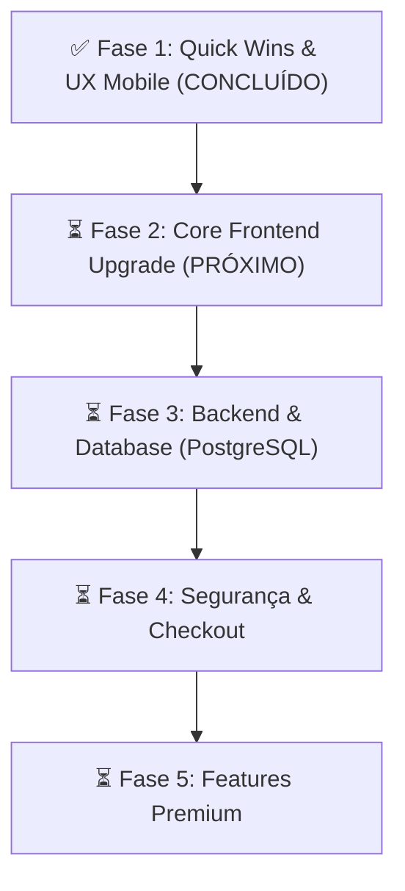

# 🚀 Plano de Reestruturação & Modernização — RAIO MODS

Este documento serve para guiar o desenvolvimento do projeto entre diferentes computadores e sessões. Ao trocar de máquina, basta atualizar o repositório (`git pull`) e ler este arquivo para saber exatamente onde paramos.

---

## 🚦 Status Atual do Projeto



---

## 🛠️ Detalhamento das Fases

### ✅ FASE 1: Quick Wins & UX Mobile (Concluída)
- **Otimização Crítica do Logo:** `static/logo.png` de **5.8MB** foi reduzido para variantes otimizadas:
  - `logo.webp` (**44KB**) - Carregado no cabeçalho do site.
  - `logo-192.png` / `logo-192.webp` - Usados para PWA e ícones mobile.
  - `logo-512.png` - Fallback para pré-visualizações de redes sociais (OpenGraph/Twitter).
  - Atualizados `templates/base.html`, `static/manifest.json` e `static/sw.js` para usar as imagens otimizadas.
- **UX Mobile - Bottom Navigation Bar:**
  - Implementada barra de navegação inferior fixa em telas pequenas com links rápidos (*Início, Links, Pagamento, Segurança, Minha Conta*).
  - Adicionado espaçamento seguro no rodapé para não ocultar conteúdos nas telas mobile (`pb-20` no body).
- **Hero Glow:**
  - Adicionado efeito de orbes de luz dinâmicas flutuantes (orbes neon) no fundo da seção Hero.

---

### ⏳ FASE 2: Core Frontend Upgrade (Próximo Passo)
- **Build Local do Tailwind CSS:**
  - Configurar Tailwind local via `npm` para sair do script CDN do Tailwind que pesa ~300KB no head.
- **Efeitos 3D nos Cards:**
  - Adicionar rotação 3D interativa (efeito Tilt) com reflexo (shimmer/glassmorphism) nos cards de produto no hover.
- **Tipografia & Animações no Hero:**
  - Adicionar efeitos modernos de digitação ou revelação gradual de letras no título principal do Hero.

---

### ⏳ FASE 3: Backend & Database Upgrade
- **Migração para PostgreSQL (Neon):**
  - Configurar e migrar a conexão do SQLite local (`database.db`) para o PostgreSQL usando o serviço Neon Cloud.
- **Mapeamento SQLAlchemy (ORM):**
  - Substituir gradualmente as queries SQL puras por models ORM estruturados.
- **Reorganização de Rotas (Blueprints):**
  - Dividir e organizar melhor as rotas administrativas em Blueprints menores.

---

### ⏳ FASE 4: Segurança & Checkout
- **Validação e Redesign do Checkout:**
  - Checkout em etapas (dados pessoais -> pagamento -> sucesso) com máscara de inputs e validações em JS.
- **Implementação de CSRF Protection & Rate Limiting:**
  - Proteger rotas contra abusos e ataques nos formulários.

---

### ⏳ FASE 5: Features Premium
- **Notificações Push / In-App**
- **Landing pages dedicadas por jogo**
- **Chat ao vivo via WhatsApp Business API**

---

## 💻 Como continuar em outra máquina

1. **Obter os arquivos mais recentes:**
   ```bash
   git pull origin main
   ```
2. **Ativar o ambiente virtual e instalar dependências:**
   ```bash
   # No Windows (PowerShell):
   .venv\Scripts\activate
   pip install -r requirements.txt
   
   # No macOS/Linux:
   source .venv/bin/activate
   pip install -r requirements.txt
   ```
3. **Executar a aplicação localmente:**
   ```bash
   python app.py
   ```
   A aplicação subirá em `http://127.0.0.1:5000`.
